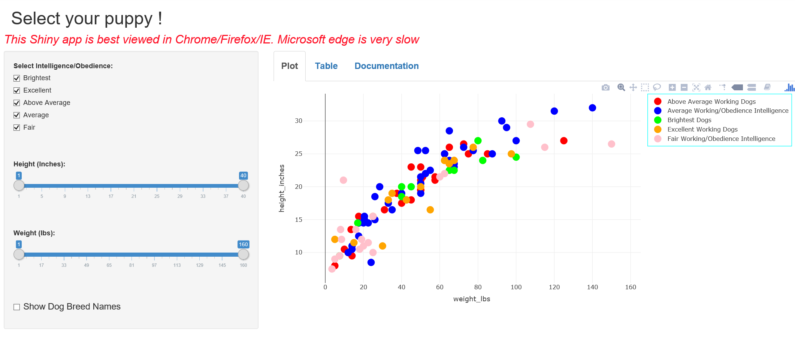

Dog Breeds
========================================================
author: Joseph Natarajan
date: 12/29/17
autosize:true

Looking for the perfect Puppy !
========================================================
  
  
  
Searching for the perfect puppy can be a time consuming task since many factors have to be taken into account like life style,location, age, profession, personal preferences,etc.
  
  
This app  will help you narrow your search.
  
  
You will have access to details for over 100 breeds that can be searched by height, weight and intelligence using a simple user interface !!

Summary
========================================================  


1) Interactive Application (URL Link) (Slide 4)
  
2) Data Source & R Code (Slide 5)

3) Data - Sample  (Slide 6)

4) Scatter Plot - All Data Points (Slide 7)

5) R Code for this Project (URL Link)(slide 8)
  
  
Interactive Application (URL Link)
========================================================
To work with the interactive app and search the Dogs database, please click the following link.

https://natarjoe.shinyapps.io/Dog_Breed/

Please see Image of the Interactive Application below


Data for this Project
========================================================

Data Source:

The data for this visual is available in https://data.world/ 

1) AKC Breed Info.csv 2) dog_intelligence.csv 


```r
#setwd("~/R/Dog/Dog")


  
  df1<-read.csv(file="AKC Breed Info_r.csv",sep = ",",header=TRUE,stringsAsFactors=FALSE)
  
  df1$Breed <- toupper(df1$Breed) 
  df2<-read.csv(file="Breed_intelligence_r.csv",sep = ",",header=TRUE,stringsAsFactors=FALSE)
  
  df2$Breed <- toupper(df2$Breed) 
  
  df<-merge(df1, df2, all.x = TRUE,by =c("Breed"))
  df$Classification<-as.factor(df$Classification)
  
  df[df == '#N/A'] <- NA
  df[df == 'n/a'] <- NA
  df[df == 'na'] <- NA
  df[df == 'not found'] <- NA
  df[df == 'VIZSLA'] <- NA # Appears to have incorrect data for this breed . Height shown  is 66 inches !. 
  df <- df[complete.cases(df), ]
  
  df$height_low_inches<-as.numeric(df$height_low_inches)
  df$height_high_inches<-as.numeric(df$height_high_inches)
  
  
  
  
  df$height_inches <- (df$height_low_inches + df$height_high_inches)/2 # Average Height
  
  
  df$weight_low_lbs<-as.numeric(df$weight_low_lbs)
  df$weight_high_lbs<-as.numeric(df$weight_high_lbs)
  
  df$weight_lbs <- (df$weight_low_lbs+df$weight_high_lbs)/2 # Average Weight
  
  df <- df[,c("Breed","height_inches","weight_lbs","Classification")]
  
  table(df)
```

```
, , weight_lbs = 3.5, Classification = Above Average Working Dogs

                                height_inches
Breed                            7.5 8 8.5 9 9.5 10 10.5 11 11.5 12 12.5
  AFFENPINSCHER                    0 0   0 0   0  0    0  0    0  0    0
  AIRDALE TERRIER                  0 0   0 0   0  0    0  0    0  0    0
  AKITA                            0 0   0 0   0  0    0  0    0  0    0
  AMERICAN FOXHOUND                0 0   0 0   0  0    0  0    0  0    0
  AMERICAN STAFFORDSHIRE TERRIER   0 0   0 0   0  0    0  0    0  0    0
  AMERICAN WATER SPANIEL           0 0   0 0   0  0    0  0    0  0    0
  AUSTRALIAN CATTLE                0 0   0 0   0  0    0  0    0  0    0
  AUSTRALIAN SHEPHERD              0 0   0 0   0  0    0  0    0  0    0
  AUSTRALIAN TERRIER               0 0   0 0   0  0    0  0    0  0    0
  BEARDED COLLIE                   0 0   0 0   0  0    0  0    0  0    0
  BEDLINGTON TERRIER               0 0   0 0   0  0    0  0    0  0    0
  BELGIAN MALINOIS                 0 0   0 0   0  0    0  0    0  0    0
  BELGIAN SHEEPDOG                 0 0   0 0   0  0    0  0    0  0    0
  BELGIAN TERVUREN                 0 0   0 0   0  0    0  0    0  0    0
  BERNESE MOUNTAIN                 0 0   0 0   0  0    0  0    0  0    0
  BICHON FRISE                     0 0   0 0   0  0    0  0    0  0    0
  BLACK AND TAN COONHOUND          0 0   0 0   0  0    0  0    0  0    0
  BORDER COLLIE                    0 0   0 0   0  0    0  0    0  0    0
  BORDER TERRIER                   0 0   0 0   0  0    0  0    0  0    0
  BOSTON TERRIER                   0 0   0 0   0  0    0  0    0  0    0
  BOUVIER DES FLANDRES             0 0   0 0   0  0    0  0    0  0    0
  BOXER                            0 0   0 0   0  0    0  0    0  0    0
  BRIARD                           0 0   0 0   0  0    0  0    0  0    0
  BRITTANY                         0 0   0 0   0  0    0  0    0  0    0
  BULL TERRIER                     0 0   0 0   0  0    0  0    0  0    0
  BULLMASTIFF                      0 0   0 0   0  0    0  0    0  0    0
  CAIRN TERRIER                    0 0   0 0   0  0    0  0    0  0    0
  CARDIGAN WELSH CORGI             0 0   0 0   0  0    0  0    0  0    0
  CAVALIER KING CHARLES SPANIEL    0 0   0 0   0  0    0  0    0  0    0
  CHESAPEAKE BAY RETRIEVER         0 0   0 0   0  0    0  0    0  0    0
  CHIHUAHUA                        0 0   0 0   0  0    0  0    0  0    0
  CHINESE CRESTED                  0 0   0 0   0  0    0  0    0  0    0
  CHINESE SHAR PEI                 0 0   0 0   0  0    0  0    0  0    0
  CLUMBER SPANIEL                  0 0   0 0   0  0    0  0    0  0    0
  COCKER SPANIEL                   0 0   0 0   0  0    0  0    0  0    0
  COLLIE                           0 0   0 0   0  0    0  0    0  0    0
  CURLY COATED RETRIEVER           0 0   0 0   0  0    0  0    0  0    0
  DACHSHUND                        0 0   0 0   0  0    0  0    0  0    0
  DALMATIAN                        0 0   0 0   0  0    0  0    0  0    0
  DANDIE DINMONT TERRIER           0 0   0 0   0  0    0  0    0  0    0
  DOBERMAN PINSCHER                0 0   0 0   0  0    0  0    0  0    0
  ENGLISH FOXHOUND                 0 0   0 0   0  0    0  0    0  0    0
  ENGLISH SETTER                   0 0   0 0   0  0    0  0    0  0    0
  ENGLISH SPRINGER SPANIEL         0 0   0 0   0  0    0  0    0  0    0
  FIELD SPANIEL                    0 0   0 0   0  0    0  0    0  0    0
  FINNISH SPITZ                    0 0   0 0   0  0    0  0    0  0    0
  FOX TERRIER (SMOOTH)             0 0   0 0   0  0    0  0    0  0    0
  FOX TERRIER (WIRE)               0 0   0 0   0  0    0  0    0  0    0
  FRENCH BULLDOG                   0 0   0 0   0  0    0  0    0  0    0
  GERMAN SHEPHERD                  0 0   0 0   0  0    0  0    0  0    0
  GERMAN SHORTHAIRED POINTER       0 0   0 0   0  0    0  0    0  0    0
  GERMAN WIREHAIRED POINTER        0 0   0 0   0  0    0  0    0  0    0
  GIANT SCHNAUZER                  0 0   0 0   0  0    0  0    0  0    0
  GOLDEN RETRIEVER                 0 0   0 0   0  0    0  0    0  0    0
  GORDON SETTER                    0 0   0 0   0  0    0  0    0  0    0
  GREAT DANE                       0 0   0 0   0  0    0  0    0  0    0
  GREAT PYRENEES                   0 0   0 0   0  0    0  0    0  0    0
  GREYHOUND                        0 0   0 0   0  0    0  0    0  0    0
  IBIZAN HOUND                     0 0   0 0   0  0    0  0    0  0    0
  IRISH SETTER                     0 0   0 0   0  0    0  0    0  0    0
  IRISH TERRIER                    0 0   0 0   0  0    0  0    0  0    0
  IRISH WATER SPANIEL              0 0   0 0   0  0    0  0    0  0    0
  IRISH WOLFHOUND                  0 0   0 0   0  0    0  0    0  0    0
  ITALIAN GREYHOUND                0 0   0 0   0  0    0  0    0  0    0
  JAPANESE CHIN                    0 0   0 0   0  0    0  0    0  0    0
  KEESHOND                         0 0   0 0   0  0    0  0    0  0    0
  KERRY BLUE TERRIER               0 0   0 0   0  0    0  0    0  0    0
  KUVASZ                           0 0   0 0   0  0    0  0    0  0    0
  LABRADOR RETRIEVER               0 0   0 0   0  0    0  0    0  0    0
  LAKELAND TERRIER                 0 0   0 0   0  0    0  0    0  0    0
  MALTESE                          0 0   0 0   0  0    0  0    0  0    0
  MANCHESTER TERRIER               0 0   0 0   0  0    0  0    0  0    0
  NEWFOUNDLAND                     0 0   0 0   0  0    0  0    0  0    0
  NORWEGIAN ELKHOUND               0 0   0 0   0  0    0  0    0  0    0
  OLD ENGLISH SHEEPDOG             0 0   0 0   0  0    0  0    0  0    0
  OTTER HOUND                      0 0   0 0   0  0    0  0    0  0    0
  PAPILLON                         0 0   0 0   0  0    0  0    0  0    0
  PHARAOH HOUND                    0 0   0 0   0  0    0  0    0  0    0
  POINTER                          0 0   0 0   0  0    0  0    0  0    0
  POMERANIAN                       0 0   0 0   0  0    0  0    0  0    0
  POODLE                           0 0   0 0   0  0    0  0    0  0    0
  PORTUGUESE WATER                 0 0   0 0   0  0    0  0    0  0    0
  PUG                              0 0   0 0   0  0    0  0    0  0    0
  PULI                             0 0   0 0   0  0    0  0    0  0    0
  RHODESIAN RIDGEBACK              0 0   0 0   0  0    0  0    0  0    0
  ROTTWEILER                       0 0   0 0   0  0    0  0    0  0    0
  SAINT BERNARD                    0 0   0 0   0  0    0  0    0  0    0
  SALUKI                           0 0   0 0   0  0    0  0    0  0    0
  SAMOYED                          0 0   0 0   0  0    0  0    0  0    0
  SCHIPPERKE                       0 0   0 0   0  0    0  0    0  0    0
  SCOTTISH DEERHOUND               0 0   0 0   0  0    0  0    0  0    0
  SCOTTISH TERRIER                 0 0   0 0   0  0    0  0    0  0    0
  SEALYHAM TERRIER                 0 0   0 0   0  0    0  0    0  0    0
  SHETLAND SHEEPDOG (SHELTIE)      0 0   0 0   0  0    0  0    0  0    0
  SHIBA INU                        0 0   0 0   0  0    0  0    0  0    0
  SIBERIAN HUSKY                   0 0   0 0   0  0    0  0    0  0    0
  SKYE TERRIER                     0 0   0 0   0  0    0  0    0  0    0
  SOFT-COATED WHEATEN TERRIER      0 0   0 0   0  0    0  0    0  0    0
  STAFFORDSHIRE BULL TERRIER       0 0   0 0   0  0    0  0    0  0    0
  STANDARD SCHNAUZER               0 0   0 0   0  0    0  0    0  0    0
  TIBETAN SPANIEL                  0 0   0 0   0  0    0  0    0  0    0
  TIBETAN TERRIER                  0 0   0 0   0  0    0  0    0  0    0
  WEIMARANER                       0 0   0 0   0  0    0  0    0  0    0
  WELSH SPRINGER SPANIEL           0 0   0 0   0  0    0  0    0  0    0
  WELSH TERRIER                    0 0   0 0   0  0    0  0    0  0    0
  WEST HIGHLAND WHITE TERRIER      0 0   0 0   0  0    0  0    0  0    0
  WHIPPET                          0 0   0 0   0  0    0  0    0  0    0
  WIREHAIRED POINTING GRIFFON      0 0   0 0   0  0    0  0    0  0    0
  YORKSHIRE TERRIER                0 0   0 0   0  0    0  0    0  0    0
                                height_inches
Breed                            13.5 14.5 15 15.5 16.5 17.5 18 18.5 19
  AFFENPINSCHER                     0    0  0    0    0    0  0    0  0
  AIRDALE TERRIER                   0    0  0    0    0    0  0    0  0
  AKITA                             0    0  0    0    0    0  0    0  0
  AMERICAN FOXHOUND                 0    0  0    0    0    0  0    0  0
  AMERICAN STAFFORDSHIRE TERRIER    0    0  0    0    0    0  0    0  0
  AMERICAN WATER SPANIEL            0    0  0    0    0    0  0    0  0
  AUSTRALIAN CATTLE                 0    0  0    0    0    0  0    0  0
  AUSTRALIAN SHEPHERD               0    0  0    0    0    0  0    0  0
  AUSTRALIAN TERRIER                0    0  0    0    0    0  0    0  0
  BEARDED COLLIE                    0    0  0    0    0    0  0    0  0
  BEDLINGTON TERRIER                0    0  0    0    0    0  0    0  0
  BELGIAN MALINOIS                  0    0  0    0    0    0  0    0  0
  BELGIAN SHEEPDOG                  0    0  0    0    0    0  0    0  0
  BELGIAN TERVUREN                  0    0  0    0    0    0  0    0  0
  BERNESE MOUNTAIN                  0    0  0    0    0    0  0    0  0
  BICHON FRISE                      0    0  0    0    0    0  0    0  0
  BLACK AND TAN COONHOUND           0    0  0    0    0    0  0    0  0
  BORDER COLLIE                     0    0  0    0    0    0  0    0  0
  BORDER TERRIER                    0    0  0    0    0    0  0    0  0
  BOSTON TERRIER                    0    0  0    0    0    0  0    0  0
  BOUVIER DES FLANDRES              0    0  0    0    0    0  0    0  0
  BOXER                             0    0  0    0    0    0  0    0  0
  BRIARD                            0    0  0    0    0    0  0    0  0
  BRITTANY                          0    0  0    0    0    0  0    0  0
  BULL TERRIER                      0    0  0    0    0    0  0    0  0
  BULLMASTIFF                       0    0  0    0    0    0  0    0  0
  CAIRN TERRIER                     0    0  0    0    0    0  0    0  0
  CARDIGAN WELSH CORGI              0    0  0    0    0    0  0    0  0
  CAVALIER KING CHARLES SPANIEL     0    0  0    0    0    0  0    0  0
  CHESAPEAKE BAY RETRIEVER          0    0  0    0    0    0  0    0  0
  CHIHUAHUA                         0    0  0    0    0    0  0    0  0
  CHINESE CRESTED                   0    0  0    0    0    0  0    0  0
  CHINESE SHAR PEI                  0    0  0    0    0    0  0    0  0
  CLUMBER SPANIEL                   0    0  0    0    0    0  0    0  0
  COCKER SPANIEL                    0    0  0    0    0    0  0    0  0
  COLLIE                            0    0  0    0    0    0  0    0  0
  CURLY COATED RETRIEVER            0    0  0    0    0    0  0    0  0
  DACHSHUND                         0    0  0    0    0    0  0    0  0
  DALMATIAN                         0    0  0    0    0    0  0    0  0
  DANDIE DINMONT TERRIER            0    0  0    0    0    0  0    0  0
  DOBERMAN PINSCHER                 0    0  0    0    0    0  0    0  0
  ENGLISH FOXHOUND                  0    0  0    0    0    0  0    0  0
  ENGLISH SETTER                    0    0  0    0    0    0  0    0  0
  ENGLISH SPRINGER SPANIEL          0    0  0    0    0    0  0    0  0
  FIELD SPANIEL                     0    0  0    0    0    0  0    0  0
  FINNISH SPITZ                     0    0  0    0    0    0  0    0  0
  FOX TERRIER (SMOOTH)              0    0  0    0    0    0  0    0  0
  FOX TERRIER (WIRE)                0    0  0    0    0    0  0    0  0
  FRENCH BULLDOG                    0    0  0    0    0    0  0    0  0
  GERMAN SHEPHERD                   0    0  0    0    0    0  0    0  0
  GERMAN SHORTHAIRED POINTER        0    0  0    0    0    0  0    0  0
  GERMAN WIREHAIRED POINTER         0    0  0    0    0    0  0    0  0
  GIANT SCHNAUZER                   0    0  0    0    0    0  0    0  0
  GOLDEN RETRIEVER                  0    0  0    0    0    0  0    0  0
  GORDON SETTER                     0    0  0    0    0    0  0    0  0
  GREAT DANE                        0    0  0    0    0    0  0    0  0
  GREAT PYRENEES                    0    0  0    0    0    0  0    0  0
  GREYHOUND                         0    0  0    0    0    0  0    0  0
  IBIZAN HOUND                      0    0  0    0    0    0  0    0  0
  IRISH SETTER                      0    0  0    0    0    0  0    0  0
  IRISH TERRIER                     0    0  0    0    0    0  0    0  0
  IRISH WATER SPANIEL               0    0  0    0    0    0  0    0  0
  IRISH WOLFHOUND                   0    0  0    0    0    0  0    0  0
  ITALIAN GREYHOUND                 0    0  0    0    0    0  0    0  0
  JAPANESE CHIN                     0    0  0    0    0    0  0    0  0
  KEESHOND                          0    0  0    0    0    0  0    0  0
  KERRY BLUE TERRIER                0    0  0    0    0    0  0    0  0
  KUVASZ                            0    0  0    0    0    0  0    0  0
  LABRADOR RETRIEVER                0    0  0    0    0    0  0    0  0
  LAKELAND TERRIER                  0    0  0    0    0    0  0    0  0
  MALTESE                           0    0  0    0    0    0  0    0  0
  MANCHESTER TERRIER                0    0  0    0    0    0  0    0  0
  NEWFOUNDLAND                      0    0  0    0    0    0  0    0  0
  NORWEGIAN ELKHOUND                0    0  0    0    0    0  0    0  0
  OLD ENGLISH SHEEPDOG              0    0  0    0    0    0  0    0  0
  OTTER HOUND                       0    0  0    0    0    0  0    0  0
  PAPILLON                          0    0  0    0    0    0  0    0  0
  PHARAOH HOUND                     0    0  0    0    0    0  0    0  0
  POINTER                           0    0  0    0    0    0  0    0  0
  POMERANIAN                        0    0  0    0    0    0  0    0  0
  POODLE                            0    0  0    0    0    0  0    0  0
  PORTUGUESE WATER                  0    0  0    0    0    0  0    0  0
  PUG                               0    0  0    0    0    0  0    0  0
  PULI                              0    0  0    0    0    0  0    0  0
  RHODESIAN RIDGEBACK               0    0  0    0    0    0  0    0  0
  ROTTWEILER                        0    0  0    0    0    0  0    0  0
  SAINT BERNARD                     0    0  0    0    0    0  0    0  0
  SALUKI                            0    0  0    0    0    0  0    0  0
  SAMOYED                           0    0  0    0    0    0  0    0  0
  SCHIPPERKE                        0    0  0    0    0    0  0    0  0
  SCOTTISH DEERHOUND                0    0  0    0    0    0  0    0  0
  SCOTTISH TERRIER                  0    0  0    0    0    0  0    0  0
  SEALYHAM TERRIER                  0    0  0    0    0    0  0    0  0
  SHETLAND SHEEPDOG (SHELTIE)       0    0  0    0    0    0  0    0  0
  SHIBA INU                         0    0  0    0    0    0  0    0  0
  SIBERIAN HUSKY                    0    0  0    0    0    0  0    0  0
  SKYE TERRIER                      0    0  0    0    0    0  0    0  0
  SOFT-COATED WHEATEN TERRIER       0    0  0    0    0    0  0    0  0
  STAFFORDSHIRE BULL TERRIER        0    0  0    0    0    0  0    0  0
  STANDARD SCHNAUZER                0    0  0    0    0    0  0    0  0
  TIBETAN SPANIEL                   0    0  0    0    0    0  0    0  0
  TIBETAN TERRIER                   0    0  0    0    0    0  0    0  0
  WEIMARANER                        0    0  0    0    0    0  0    0  0
  WELSH SPRINGER SPANIEL            0    0  0    0    0    0  0    0  0
  WELSH TERRIER                     0    0  0    0    0    0  0    0  0
  WEST HIGHLAND WHITE TERRIER       0    0  0    0    0    0  0    0  0
  WHIPPET                           0    0  0    0    0    0  0    0  0
  WIREHAIRED POINTING GRIFFON       0    0  0    0    0    0  0    0  0
  YORKSHIRE TERRIER                 0    0  0    0    0    0  0    0  0
                                height_inches
Breed                            19.5 20 20.5 21 21.5 22 22.5 23 23.5 24
  AFFENPINSCHER                     0  0    0  0    0  0    0  0    0  0
  AIRDALE TERRIER                   0  0    0  0    0  0    0  0    0  0
  AKITA                             0  0    0  0    0  0    0  0    0  0
  AMERICAN FOXHOUND                 0  0    0  0    0  0    0  0    0  0
  AMERICAN STAFFORDSHIRE TERRIER    0  0    0  0    0  0    0  0    0  0
  AMERICAN WATER SPANIEL            0  0    0  0    0  0    0  0    0  0
  AUSTRALIAN CATTLE                 0  0    0  0    0  0    0  0    0  0
  AUSTRALIAN SHEPHERD               0  0    0  0    0  0    0  0    0  0
  AUSTRALIAN TERRIER                0  0    0  0    0  0    0  0    0  0
  BEARDED COLLIE                    0  0    0  0    0  0    0  0    0  0
  BEDLINGTON TERRIER                0  0    0  0    0  0    0  0    0  0
  BELGIAN MALINOIS                  0  0    0  0    0  0    0  0    0  0
  BELGIAN SHEEPDOG                  0  0    0  0    0  0    0  0    0  0
  BELGIAN TERVUREN                  0  0    0  0    0  0    0  0    0  0
  BERNESE MOUNTAIN                  0  0    0  0    0  0    0  0    0  0
  BICHON FRISE                      0  0    0  0    0  0    0  0    0  0
  BLACK AND TAN COONHOUND           0  0    0  0    0  0    0  0    0  0
  BORDER COLLIE                     0  0    0  0    0  0    0  0    0  0
  BORDER TERRIER                    0  0    0  0    0  0    0  0    0  0
  BOSTON TERRIER                    0  0    0  0    0  0    0  0    0  0
  BOUVIER DES FLANDRES              0  0    0  0    0  0    0  0    0  0
  BOXER                             0  0    0  0    0  0    0  0    0  0
  BRIARD                            0  0    0  0    0  0    0  0    0  0
  BRITTANY                          0  0    0  0    0  0    0  0    0  0
  BULL TERRIER                      0  0    0  0    0  0    0  0    0  0
  BULLMASTIFF                       0  0    0  0    0  0    0  0    0  0
  CAIRN TERRIER                     0  0    0  0    0  0    0  0    0  0
  CARDIGAN WELSH CORGI              0  0    0  0    0  0    0  0    0  0
  CAVALIER KING CHARLES SPANIEL     0  0    0  0    0  0    0  0    0  0
  CHESAPEAKE BAY RETRIEVER          0  0    0  0    0  0    0  0    0  0
  CHIHUAHUA                         0  0    0  0    0  0    0  0    0  0
  CHINESE CRESTED                   0  0    0  0    0  0    0  0    0  0
  CHINESE SHAR PEI                  0  0    0  0    0  0    0  0    0  0
  CLUMBER SPANIEL                   0  0    0  0    0  0    0  0    0  0
  COCKER SPANIEL                    0  0    0  0    0  0    0  0    0  0
  COLLIE                            0  0    0  0    0  0    0  0    0  0
  CURLY COATED RETRIEVER            0  0    0  0    0  0    0  0    0  0
  DACHSHUND                         0  0    0  0    0  0    0  0    0  0
  DALMATIAN                         0  0    0  0    0  0    0  0    0  0
  DANDIE DINMONT TERRIER            0  0    0  0    0  0    0  0    0  0
  DOBERMAN PINSCHER                 0  0    0  0    0  0    0  0    0  0
  ENGLISH FOXHOUND                  0  0    0  0    0  0    0  0    0  0
  ENGLISH SETTER                    0  0    0  0    0  0    0  0    0  0
  ENGLISH SPRINGER SPANIEL          0  0    0  0    0  0    0  0    0  0
  FIELD SPANIEL                     0  0    0  0    0  0    0  0    0  0
  FINNISH SPITZ                     0  0    0  0    0  0    0  0    0  0
  FOX TERRIER (SMOOTH)              0  0    0  0    0  0    0  0    0  0
  FOX TERRIER (WIRE)                0  0    0  0    0  0    0  0    0  0
  FRENCH BULLDOG                    0  0    0  0    0  0    0  0    0  0
  GERMAN SHEPHERD                   0  0    0  0    0  0    0  0    0  0
  GERMAN SHORTHAIRED POINTER        0  0    0  0    0  0    0  0    0  0
  GERMAN WIREHAIRED POINTER         0  0    0  0    0  0    0  0    0  0
  GIANT SCHNAUZER                   0  0    0  0    0  0    0  0    0  0
  GOLDEN RETRIEVER                  0  0    0  0    0  0    0  0    0  0
  GORDON SETTER                     0  0    0  0    0  0    0  0    0  0
  GREAT DANE                        0  0    0  0    0  0    0  0    0  0
  GREAT PYRENEES                    0  0    0  0    0  0    0  0    0  0
  GREYHOUND                         0  0    0  0    0  0    0  0    0  0
  IBIZAN HOUND                      0  0    0  0    0  0    0  0    0  0
  IRISH SETTER                      0  0    0  0    0  0    0  0    0  0
  IRISH TERRIER                     0  0    0  0    0  0    0  0    0  0
  IRISH WATER SPANIEL               0  0    0  0    0  0    0  0    0  0
  IRISH WOLFHOUND                   0  0    0  0    0  0    0  0    0  0
  ITALIAN GREYHOUND                 0  0    0  0    0  0    0  0    0  0
  JAPANESE CHIN                     0  0    0  0    0  0    0  0    0  0
  KEESHOND                          0  0    0  0    0  0    0  0    0  0
  KERRY BLUE TERRIER                0  0    0  0    0  0    0  0    0  0
  KUVASZ                            0  0    0  0    0  0    0  0    0  0
  LABRADOR RETRIEVER                0  0    0  0    0  0    0  0    0  0
  LAKELAND TERRIER                  0  0    0  0    0  0    0  0    0  0
  MALTESE                           0  0    0  0    0  0    0  0    0  0
  MANCHESTER TERRIER                0  0    0  0    0  0    0  0    0  0
  NEWFOUNDLAND                      0  0    0  0    0  0    0  0    0  0
  NORWEGIAN ELKHOUND                0  0    0  0    0  0    0  0    0  0
  OLD ENGLISH SHEEPDOG              0  0    0  0    0  0    0  0    0  0
  OTTER HOUND                       0  0    0  0    0  0    0  0    0  0
  PAPILLON                          0  0    0  0    0  0    0  0    0  0
  PHARAOH HOUND                     0  0    0  0    0  0    0  0    0  0
  POINTER                           0  0    0  0    0  0    0  0    0  0
  POMERANIAN                        0  0    0  0    0  0    0  0    0  0
  POODLE                            0  0    0  0    0  0    0  0    0  0
  PORTUGUESE WATER                  0  0    0  0    0  0    0  0    0  0
  PUG                               0  0    0  0    0  0    0  0    0  0
  PULI                              0  0    0  0    0  0    0  0    0  0
  RHODESIAN RIDGEBACK               0  0    0  0    0  0    0  0    0  0
  ROTTWEILER                        0  0    0  0    0  0    0  0    0  0
  SAINT BERNARD                     0  0    0  0    0  0    0  0    0  0
  SALUKI                            0  0    0  0    0  0    0  0    0  0
  SAMOYED                           0  0    0  0    0  0    0  0    0  0
  SCHIPPERKE                        0  0    0  0    0  0    0  0    0  0
  SCOTTISH DEERHOUND                0  0    0  0    0  0    0  0    0  0
  SCOTTISH TERRIER                  0  0    0  0    0  0    0  0    0  0
  SEALYHAM TERRIER                  0  0    0  0    0  0    0  0    0  0
  SHETLAND SHEEPDOG (SHELTIE)       0  0    0  0    0  0    0  0    0  0
  SHIBA INU                         0  0    0  0    0  0    0  0    0  0
  SIBERIAN HUSKY                    0  0    0  0    0  0    0  0    0  0
  SKYE TERRIER                      0  0    0  0    0  0    0  0    0  0
  SOFT-COATED WHEATEN TERRIER       0  0    0  0    0  0    0  0    0  0
  STAFFORDSHIRE BULL TERRIER        0  0    0  0    0  0    0  0    0  0
  STANDARD SCHNAUZER                0  0    0  0    0  0    0  0    0  0
  TIBETAN SPANIEL                   0  0    0  0    0  0    0  0    0  0
  TIBETAN TERRIER                   0  0    0  0    0  0    0  0    0  0
  WEIMARANER                        0  0    0  0    0  0    0  0    0  0
  WELSH SPRINGER SPANIEL            0  0    0  0    0  0    0  0    0  0
  WELSH TERRIER                     0  0    0  0    0  0    0  0    0  0
  WEST HIGHLAND WHITE TERRIER       0  0    0  0    0  0    0  0    0  0
  WHIPPET                           0  0    0  0    0  0    0  0    0  0
  WIREHAIRED POINTING GRIFFON       0  0    0  0    0  0    0  0    0  0
  YORKSHIRE TERRIER                 0  0    0  0    0  0    0  0    0  0
                                height_inches
Breed                            24.5 25 25.5 26 26.5 27 28.5 29 29.5 30
  AFFENPINSCHER                     0  0    0  0    0  0    0  0    0  0
  AIRDALE TERRIER                   0  0    0  0    0  0    0  0    0  0
  AKITA                             0  0    0  0    0  0    0  0    0  0
  AMERICAN FOXHOUND                 0  0    0  0    0  0    0  0    0  0
  AMERICAN STAFFORDSHIRE TERRIER    0  0    0  0    0  0    0  0    0  0
  AMERICAN WATER SPANIEL            0  0    0  0    0  0    0  0    0  0
  AUSTRALIAN CATTLE                 0  0    0  0    0  0    0  0    0  0
  AUSTRALIAN SHEPHERD               0  0    0  0    0  0    0  0    0  0
  AUSTRALIAN TERRIER                0  0    0  0    0  0    0  0    0  0
  BEARDED COLLIE                    0  0    0  0    0  0    0  0    0  0
  BEDLINGTON TERRIER                0  0    0  0    0  0    0  0    0  0
  BELGIAN MALINOIS                  0  0    0  0    0  0    0  0    0  0
  BELGIAN SHEEPDOG                  0  0    0  0    0  0    0  0    0  0
  BELGIAN TERVUREN                  0  0    0  0    0  0    0  0    0  0
  BERNESE MOUNTAIN                  0  0    0  0    0  0    0  0    0  0
  BICHON FRISE                      0  0    0  0    0  0    0  0    0  0
  BLACK AND TAN COONHOUND           0  0    0  0    0  0    0  0    0  0
  BORDER COLLIE                     0  0    0  0    0  0    0  0    0  0
  BORDER TERRIER                    0  0    0  0    0  0    0  0    0  0
  BOSTON TERRIER                    0  0    0  0    0  0    0  0    0  0
  BOUVIER DES FLANDRES              0  0    0  0    0  0    0  0    0  0
  BOXER                             0  0    0  0    0  0    0  0    0  0
  BRIARD                            0  0    0  0    0  0    0  0    0  0
  BRITTANY                          0  0    0  0    0  0    0  0    0  0
  BULL TERRIER                      0  0    0  0    0  0    0  0    0  0
  BULLMASTIFF                       0  0    0  0    0  0    0  0    0  0
  CAIRN TERRIER                     0  0    0  0    0  0    0  0    0  0
  CARDIGAN WELSH CORGI              0  0    0  0    0  0    0  0    0  0
  CAVALIER KING CHARLES SPANIEL     0  0    0  0    0  0    0  0    0  0
  CHESAPEAKE BAY RETRIEVER          0  0    0  0    0  0    0  0    0  0
  CHIHUAHUA                         0  0    0  0    0  0    0  0    0  0
  CHINESE CRESTED                   0  0    0  0    0  0    0  0    0  0
  CHINESE SHAR PEI                  0  0    0  0    0  0    0  0    0  0
  CLUMBER SPANIEL                   0  0    0  0    0  0    0  0    0  0
  COCKER SPANIEL                    0  0    0  0    0  0    0  0    0  0
  COLLIE                            0  0    0  0    0  0    0  0    0  0
  CURLY COATED RETRIEVER            0  0    0  0    0  0    0  0    0  0
  DACHSHUND                         0  0    0  0    0  0    0  0    0  0
  DALMATIAN                         0  0    0  0    0  0    0  0    0  0
  DANDIE DINMONT TERRIER            0  0    0  0    0  0    0  0    0  0
  DOBERMAN PINSCHER                 0  0    0  0    0  0    0  0    0  0
  ENGLISH FOXHOUND                  0  0    0  0    0  0    0  0    0  0
  ENGLISH SETTER                    0  0    0  0    0  0    0  0    0  0
  ENGLISH SPRINGER SPANIEL          0  0    0  0    0  0    0  0    0  0
  FIELD SPANIEL                     0  0    0  0    0  0    0  0    0  0
  FINNISH SPITZ                     0  0    0  0    0  0    0  0    0  0
  FOX TERRIER (SMOOTH)              0  0    0  0    0  0    0  0    0  0
  FOX TERRIER (WIRE)                0  0    0  0    0  0    0  0    0  0
  FRENCH BULLDOG                    0  0    0  0    0  0    0  0    0  0
  GERMAN SHEPHERD                   0  0    0  0    0  0    0  0    0  0
  GERMAN SHORTHAIRED POINTER        0  0    0  0    0  0    0  0    0  0
  GERMAN WIREHAIRED POINTER         0  0    0  0    0  0    0  0    0  0
  GIANT SCHNAUZER                   0  0    0  0    0  0    0  0    0  0
  GOLDEN RETRIEVER                  0  0    0  0    0  0    0  0    0  0
  GORDON SETTER                     0  0    0  0    0  0    0  0    0  0
  GREAT DANE                        0  0    0  0    0  0    0  0    0  0
  GREAT PYRENEES                    0  0    0  0    0  0    0  0    0  0
  GREYHOUND                         0  0    0  0    0  0    0  0    0  0
  IBIZAN HOUND                      0  0    0  0    0  0    0  0    0  0
  IRISH SETTER                      0  0    0  0    0  0    0  0    0  0
  IRISH TERRIER                     0  0    0  0    0  0    0  0    0  0
  IRISH WATER SPANIEL               0  0    0  0    0  0    0  0    0  0
  IRISH WOLFHOUND                   0  0    0  0    0  0    0  0    0  0
  ITALIAN GREYHOUND                 0  0    0  0    0  0    0  0    0  0
  JAPANESE CHIN                     0  0    0  0    0  0    0  0    0  0
  KEESHOND                          0  0    0  0    0  0    0  0    0  0
  KERRY BLUE TERRIER                0  0    0  0    0  0    0  0    0  0
  KUVASZ                            0  0    0  0    0  0    0  0    0  0
  LABRADOR RETRIEVER                0  0    0  0    0  0    0  0    0  0
  LAKELAND TERRIER                  0  0    0  0    0  0    0  0    0  0
  MALTESE                           0  0    0  0    0  0    0  0    0  0
  MANCHESTER TERRIER                0  0    0  0    0  0    0  0    0  0
  NEWFOUNDLAND                      0  0    0  0    0  0    0  0    0  0
  NORWEGIAN ELKHOUND                0  0    0  0    0  0    0  0    0  0
  OLD ENGLISH SHEEPDOG              0  0    0  0    0  0    0  0    0  0
  OTTER HOUND                       0  0    0  0    0  0    0  0    0  0
  PAPILLON                          0  0    0  0    0  0    0  0    0  0
  PHARAOH HOUND                     0  0    0  0    0  0    0  0    0  0
  POINTER                           0  0    0  0    0  0    0  0    0  0
  POMERANIAN                        0  0    0  0    0  0    0  0    0  0
  POODLE                            0  0    0  0    0  0    0  0    0  0
  PORTUGUESE WATER                  0  0    0  0    0  0    0  0    0  0
  PUG                               0  0    0  0    0  0    0  0    0  0
  PULI                              0  0    0  0    0  0    0  0    0  0
  RHODESIAN RIDGEBACK               0  0    0  0    0  0    0  0    0  0
  ROTTWEILER                        0  0    0  0    0  0    0  0    0  0
  SAINT BERNARD                     0  0    0  0    0  0    0  0    0  0
  SALUKI                            0  0    0  0    0  0    0  0    0  0
  SAMOYED                           0  0    0  0    0  0    0  0    0  0
  SCHIPPERKE                        0  0    0  0    0  0    0  0    0  0
  SCOTTISH DEERHOUND                0  0    0  0    0  0    0  0    0  0
  SCOTTISH TERRIER                  0  0    0  0    0  0    0  0    0  0
  SEALYHAM TERRIER                  0  0    0  0    0  0    0  0    0  0
  SHETLAND SHEEPDOG (SHELTIE)       0  0    0  0    0  0    0  0    0  0
  SHIBA INU                         0  0    0  0    0  0    0  0    0  0
  SIBERIAN HUSKY                    0  0    0  0    0  0    0  0    0  0
  SKYE TERRIER                      0  0    0  0    0  0    0  0    0  0
  SOFT-COATED WHEATEN TERRIER       0  0    0  0    0  0    0  0    0  0
  STAFFORDSHIRE BULL TERRIER        0  0    0  0    0  0    0  0    0  0
  STANDARD SCHNAUZER                0  0    0  0    0  0    0  0    0  0
  TIBETAN SPANIEL                   0  0    0  0    0  0    0  0    0  0
  TIBETAN TERRIER                   0  0    0  0    0  0    0  0    0  0
  WEIMARANER                        0  0    0  0    0  0    0  0    0  0
  WELSH SPRINGER SPANIEL            0  0    0  0    0  0    0  0    0  0
  WELSH TERRIER                     0  0    0  0    0  0    0  0    0  0
  WEST HIGHLAND WHITE TERRIER       0  0    0  0    0  0    0  0    0  0
  WHIPPET                           0  0    0  0    0  0    0  0    0  0
  WIREHAIRED POINTING GRIFFON       0  0    0  0    0  0    0  0    0  0
  YORKSHIRE TERRIER                 0  0    0  0    0  0    0  0    0  0
                                height_inches
Breed                            31.5 32
  AFFENPINSCHER                     0  0
  AIRDALE TERRIER                   0  0
  AKITA                             0  0
  AMERICAN FOXHOUND                 0  0
  AMERICAN STAFFORDSHIRE TERRIER    0  0
  AMERICAN WATER SPANIEL            0  0
  AUSTRALIAN CATTLE                 0  0
  AUSTRALIAN SHEPHERD               0  0
  AUSTRALIAN TERRIER                0  0
  BEARDED COLLIE                    0  0
  BEDLINGTON TERRIER                0  0
  BELGIAN MALINOIS                  0  0
  BELGIAN SHEEPDOG                  0  0
  BELGIAN TERVUREN                  0  0
  BERNESE MOUNTAIN                  0  0
  BICHON FRISE                      0  0
  BLACK AND TAN COONHOUND           0  0
  BORDER COLLIE                     0  0
  BORDER TERRIER                    0  0
  BOSTON TERRIER                    0  0
  BOUVIER DES FLANDRES              0  0
  BOXER                             0  0
  BRIARD                            0  0
  BRITTANY                          0  0
  BULL TERRIER                      0  0
  BULLMASTIFF                       0  0
  CAIRN TERRIER                     0  0
  CARDIGAN WELSH CORGI              0  0
  CAVALIER KING CHARLES SPANIEL     0  0
  CHESAPEAKE BAY RETRIEVER          0  0
  CHIHUAHUA                         0  0
  CHINESE CRESTED                   0  0
  CHINESE SHAR PEI                  0  0
  CLUMBER SPANIEL                   0  0
  COCKER SPANIEL                    0  0
  COLLIE                            0  0
  CURLY COATED RETRIEVER            0  0
  DACHSHUND                         0  0
  DALMATIAN                         0  0
  DANDIE DINMONT TERRIER            0  0
  DOBERMAN PINSCHER                 0  0
  ENGLISH FOXHOUND                  0  0
  ENGLISH SETTER                    0  0
  ENGLISH SPRINGER SPANIEL          0  0
  FIELD SPANIEL                     0  0
  FINNISH SPITZ                     0  0
  FOX TERRIER (SMOOTH)              0  0
  FOX TERRIER (WIRE)                0  0
  FRENCH BULLDOG                    0  0
  GERMAN SHEPHERD                   0  0
  GERMAN SHORTHAIRED POINTER        0  0
  GERMAN WIREHAIRED POINTER         0  0
  GIANT SCHNAUZER                   0  0
  GOLDEN RETRIEVER                  0  0
  GORDON SETTER                     0  0
  GREAT DANE                        0  0
  GREAT PYRENEES                    0  0
  GREYHOUND                         0  0
  IBIZAN HOUND                      0  0
  IRISH SETTER                      0  0
  IRISH TERRIER                     0  0
  IRISH WATER SPANIEL               0  0
  IRISH WOLFHOUND                   0  0
  ITALIAN GREYHOUND                 0  0
  JAPANESE CHIN                     0  0
  KEESHOND                          0  0
  KERRY BLUE TERRIER                0  0
  KUVASZ                            0  0
  LABRADOR RETRIEVER                0  0
  LAKELAND TERRIER                  0  0
  MALTESE                           0  0
  MANCHESTER TERRIER                0  0
  NEWFOUNDLAND                      0  0
  NORWEGIAN ELKHOUND                0  0
  OLD ENGLISH SHEEPDOG              0  0
  OTTER HOUND                       0  0
  PAPILLON                          0  0
  PHARAOH HOUND                     0  0
  POINTER                           0  0
  POMERANIAN                        0  0
  POODLE                            0  0
  PORTUGUESE WATER                  0  0
  PUG                               0  0
  PULI                              0  0
  RHODESIAN RIDGEBACK               0  0
  ROTTWEILER                        0  0
  SAINT BERNARD                     0  0
  SALUKI                            0  0
  SAMOYED                           0  0
  SCHIPPERKE                        0  0
  SCOTTISH DEERHOUND                0  0
  SCOTTISH TERRIER                  0  0
  SEALYHAM TERRIER                  0  0
  SHETLAND SHEEPDOG (SHELTIE)       0  0
  SHIBA INU                         0  0
  SIBERIAN HUSKY                    0  0
  SKYE TERRIER                      0  0
  SOFT-COATED WHEATEN TERRIER       0  0
  STAFFORDSHIRE BULL TERRIER        0  0
  STANDARD SCHNAUZER                0  0
  TIBETAN SPANIEL                   0  0
  TIBETAN TERRIER                   0  0
  WEIMARANER                        0  0
  WELSH SPRINGER SPANIEL            0  0
  WELSH TERRIER                     0  0
  WEST HIGHLAND WHITE TERRIER       0  0
  WHIPPET                           0  0
  WIREHAIRED POINTING GRIFFON       0  0
  YORKSHIRE TERRIER                 0  0

, , weight_lbs = 5, Classification = Above Average Working Dogs

                                height_inches
Breed                            7.5 8 8.5 9 9.5 10 10.5 11 11.5 12 12.5
  AFFENPINSCHER                    0 0   0 0   0  0    0  0    0  0    0
  AIRDALE TERRIER                  0 0   0 0   0  0    0  0    0  0    0
  AKITA                            0 0   0 0   0  0    0  0    0  0    0
  AMERICAN FOXHOUND                0 0   0 0   0  0    0  0    0  0    0
  AMERICAN STAFFORDSHIRE TERRIER   0 0   0 0   0  0    0  0    0  0    0
  AMERICAN WATER SPANIEL           0 0   0 0   0  0    0  0    0  0    0
  AUSTRALIAN CATTLE                0 0   0 0   0  0    0  0    0  0    0
  AUSTRALIAN SHEPHERD              0 0   0 0   0  0    0  0    0  0    0
  AUSTRALIAN TERRIER               0 0   0 0   0  0    0  0    0  0    0
  BEARDED COLLIE                   0 0   0 0   0  0    0  0    0  0    0
  BEDLINGTON TERRIER               0 0   0 0   0  0    0  0    0  0    0
  BELGIAN MALINOIS                 0 0   0 0   0  0    0  0    0  0    0
  BELGIAN SHEEPDOG                 0 0   0 0   0  0    0  0    0  0    0
  BELGIAN TERVUREN                 0 0   0 0   0  0    0  0    0  0    0
  BERNESE MOUNTAIN                 0 0   0 0   0  0    0  0    0  0    0
  BICHON FRISE                     0 0   0 0   0  0    0  0    0  0    0
  BLACK AND TAN COONHOUND          0 0   0 0   0  0    0  0    0  0    0
  BORDER COLLIE                    0 0   0 0   0  0    0  0    0  0    0
  BORDER TERRIER                   0 0   0 0   0  0    0  0    0  0    0
  BOSTON TERRIER                   0 0   0 0   0  0    0  0    0  0    0
  BOUVIER DES FLANDRES             0 0   0 0   0  0    0  0    0  0    0
  BOXER                            0 0   0 0   0  0    0  0    0  0    0
  BRIARD                           0 0   0 0   0  0    0  0    0  0    0
  BRITTANY                         0 0   0 0   0  0    0  0    0  0    0
  BULL TERRIER                     0 0   0 0   0  0    0  0    0  0    0
  BULLMASTIFF                      0 0   0 0   0  0    0  0    0  0    0
  CAIRN TERRIER                    0 0   0 0   0  0    0  0    0  0    0
  CARDIGAN WELSH CORGI             0 0   0 0   0  0    0  0    0  0    0
  CAVALIER KING CHARLES SPANIEL    0 0   0 0   0  0    0  0    0  0    0
  CHESAPEAKE BAY RETRIEVER         0 0   0 0   0  0    0  0    0  0    0
  CHIHUAHUA                        0 0   0 0   0  0    0  0    0  0    0
  CHINESE CRESTED                  0 0   0 0   0  0    0  0    0  0    0
  CHINESE SHAR PEI                 0 0   0 0   0  0    0  0    0  0    0
  CLUMBER SPANIEL                  0 0   0 0   0  0    0  0    0  0    0
  COCKER SPANIEL                   0 0   0 0   0  0    0  0    0  0    0
  COLLIE                           0 0   0 0   0  0    0  0    0  0    0
  CURLY COATED RETRIEVER           0 0   0 0   0  0    0  0    0  0    0
  DACHSHUND                        0 0   0 0   0  0    0  0    0  0    0
  DALMATIAN                        0 0   0 0   0  0    0  0    0  0    0
  DANDIE DINMONT TERRIER           0 0   0 0   0  0    0  0    0  0    0
  DOBERMAN PINSCHER                0 0   0 0   0  0    0  0    0  0    0
  ENGLISH FOXHOUND                 0 0   0 0   0  0    0  0    0  0    0
  ENGLISH SETTER                   0 0   0 0   0  0    0  0    0  0    0
  ENGLISH SPRINGER SPANIEL         0 0   0 0   0  0    0  0    0  0    0
  FIELD SPANIEL                    0 0   0 0   0  0    0  0    0  0    0
  FINNISH SPITZ                    0 0   0 0   0  0    0  0    0  0    0
  FOX TERRIER (SMOOTH)             0 0   0 0   0  0    0  0    0  0    0
  FOX TERRIER (WIRE)               0 0   0 0   0  0    0  0    0  0    0
  FRENCH BULLDOG                   0 0   0 0   0  0    0  0    0  0    0
  GERMAN SHEPHERD                  0 0   0 0   0  0    0  0    0  0    0
  GERMAN SHORTHAIRED POINTER       0 0   0 0   0  0    0  0    0  0    0
  GERMAN WIREHAIRED POINTER        0 0   0 0   0  0    0  0    0  0    0
  GIANT SCHNAUZER                  0 0   0 0   0  0    0  0    0  0    0
  GOLDEN RETRIEVER                 0 0   0 0   0  0    0  0    0  0    0
  GORDON SETTER                    0 0   0 0   0  0    0  0    0  0    0
  GREAT DANE                       0 0   0 0   0  0    0  0    0  0    0
  GREAT PYRENEES                   0 0   0 0   0  0    0  0    0  0    0
  GREYHOUND                        0 0   0 0   0  0    0  0    0  0    0
  IBIZAN HOUND                     0 0   0 0   0  0    0  0    0  0    0
  IRISH SETTER                     0 0   0 0   0  0    0  0    0  0    0
  IRISH TERRIER                    0 0   0 0   0  0    0  0    0  0    0
  IRISH WATER SPANIEL              0 0   0 0   0  0    0  0    0  0    0
  IRISH WOLFHOUND                  0 0   0 0   0  0    0  0    0  0    0
  ITALIAN GREYHOUND                0 0   0 0   0  0    0  0    0  0    0
  JAPANESE CHIN                    0 0   0 0   0  0    0  0    0  0    0
  KEESHOND                         0 0   0 0   0  0    0  0    0  0    0
  KERRY BLUE TERRIER               0 0   0 0   0  0    0  0    0  0    0
  KUVASZ                           0 0   0 0   0  0    0  0    0  0    0
  LABRADOR RETRIEVER               0 0   0 0   0  0    0  0    0  0    0
  LAKELAND TERRIER                 0 0   0 0   0  0    0  0    0  0    0
  MALTESE                          0 0   0 0   0  0    0  0    0  0    0
  MANCHESTER TERRIER               0 0   0 0   0  0    0  0    0  0    0
  NEWFOUNDLAND                     0 0   0 0   0  0    0  0    0  0    0
  NORWEGIAN ELKHOUND               0 0   0 0   0  0    0  0    0  0    0
  OLD ENGLISH SHEEPDOG             0 0   0 0   0  0    0  0    0  0    0
  OTTER HOUND                      0 0   0 0   0  0    0  0    0  0    0
  PAPILLON                         0 0   0 0   0  0    0  0    0  0    0
  PHARAOH HOUND                    0 0   0 0   0  0    0  0    0  0    0
  POINTER                          0 0   0 0   0  0    0  0    0  0    0
  POMERANIAN                       0 0   0 0   0  0    0  0    0  0    0
  POODLE                           0 0   0 0   0  0    0  0    0  0    0
  PORTUGUESE WATER                 0 0   0 0   0  0    0  0    0  0    0
  PUG                              0 0   0 0   0  0    0  0    0  0    0
  PULI                             0 0   0 0   0  0    0  0    0  0    0
  RHODESIAN RIDGEBACK              0 0   0 0   0  0    0  0    0  0    0
  ROTTWEILER                       0 0   0 0   0  0    0  0    0  0    0
  SAINT BERNARD                    0 0   0 0   0  0    0  0    0  0    0
  SALUKI                           0 0   0 0   0  0    0  0    0  0    0
  SAMOYED                          0 0   0 0   0  0    0  0    0  0    0
  SCHIPPERKE                       0 0   0 0   0  0    0  0    0  0    0
  SCOTTISH DEERHOUND               0 0   0 0   0  0    0  0    0  0    0
  SCOTTISH TERRIER                 0 0   0 0   0  0    0  0    0  0    0
  SEALYHAM TERRIER                 0 0   0 0   0  0    0  0    0  0    0
  SHETLAND SHEEPDOG (SHELTIE)      0 0   0 0   0  0    0  0    0  0    0
  SHIBA INU                        0 0   0 0   0  0    0  0    0  0    0
  SIBERIAN HUSKY                   0 0   0 0   0  0    0  0    0  0    0
  SKYE TERRIER                     0 0   0 0   0  0    0  0    0  0    0
  SOFT-COATED WHEATEN TERRIER      0 0   0 0   0  0    0  0    0  0    0
  STAFFORDSHIRE BULL TERRIER       0 0   0 0   0  0    0  0    0  0    0
  STANDARD SCHNAUZER               0 0   0 0   0  0    0  0    0  0    0
  TIBETAN SPANIEL                  0 0   0 0   0  0    0  0    0  0    0
  TIBETAN TERRIER                  0 0   0 0   0  0    0  0    0  0    0
  WEIMARANER                       0 0   0 0   0  0    0  0    0  0    0
  WELSH SPRINGER SPANIEL           0 0   0 0   0  0    0  0    0  0    0
  WELSH TERRIER                    0 0   0 0   0  0    0  0    0  0    0
  WEST HIGHLAND WHITE TERRIER      0 0   0 0   0  0    0  0    0  0    0
  WHIPPET                          0 0   0 0   0  0    0  0    0  0    0
  WIREHAIRED POINTING GRIFFON      0 0   0 0   0  0    0  0    0  0    0
  YORKSHIRE TERRIER                0 1   0 0   0  0    0  0    0  0    0
                                height_inches
Breed                            13.5 14.5 15 15.5 16.5 17.5 18 18.5 19
  AFFENPINSCHER                     0    0  0    0    0    0  0    0  0
  AIRDALE TERRIER                   0    0  0    0    0    0  0    0  0
  AKITA                             0    0  0    0    0    0  0    0  0
  AMERICAN FOXHOUND                 0    0  0    0    0    0  0    0  0
  AMERICAN STAFFORDSHIRE TERRIER    0    0  0    0    0    0  0    0  0
  AMERICAN WATER SPANIEL            0    0  0    0    0    0  0    0  0
  AUSTRALIAN CATTLE                 0    0  0    0    0    0  0    0  0
  AUSTRALIAN SHEPHERD               0    0  0    0    0    0  0    0  0
  AUSTRALIAN TERRIER                0    0  0    0    0    0  0    0  0
  BEARDED COLLIE                    0    0  0    0    0    0  0    0  0
  BEDLINGTON TERRIER                0    0  0    0    0    0  0    0  0
  BELGIAN MALINOIS                  0    0  0    0    0    0  0    0  0
  BELGIAN SHEEPDOG                  0    0  0    0    0    0  0    0  0
  BELGIAN TERVUREN                  0    0  0    0    0    0  0    0  0
  BERNESE MOUNTAIN                  0    0  0    0    0    0  0    0  0
  BICHON FRISE                      0    0  0    0    0    0  0    0  0
  BLACK AND TAN COONHOUND           0    0  0    0    0    0  0    0  0
  BORDER COLLIE                     0    0  0    0    0    0  0    0  0
  BORDER TERRIER                    0    0  0    0    0    0  0    0  0
  BOSTON TERRIER                    0    0  0    0    0    0  0    0  0
  BOUVIER DES FLANDRES              0    0  0    0    0    0  0    0  0
  BOXER                             0    0  0    0    0    0  0    0  0
  BRIARD                            0    0  0    0    0    0  0    0  0
  BRITTANY                          0    0  0    0    0    0  0    0  0
  BULL TERRIER                      0    0  0    0    0    0  0    0  0
  BULLMASTIFF                       0    0  0    0    0    0  0    0  0
  CAIRN TERRIER                     0    0  0    0    0    0  0    0  0
  CARDIGAN WELSH CORGI              0    0  0    0    0    0  0    0  0
  CAVALIER KING CHARLES SPANIEL     0    0  0    0    0    0  0    0  0
  CHESAPEAKE BAY RETRIEVER          0    0  0    0    0    0  0    0  0
  CHIHUAHUA                         0    0  0    0    0    0  0    0  0
  CHINESE CRESTED                   0    0  0    0    0    0  0    0  0
  CHINESE SHAR PEI                  0    0  0    0    0    0  0    0  0
  CLUMBER SPANIEL                   0    0  0    0    0    0  0    0  0
  COCKER SPANIEL                    0    0  0    0    0    0  0    0  0
  COLLIE                            0    0  0    0    0    0  0    0  0
  CURLY COATED RETRIEVER            0    0  0    0    0    0  0    0  0
  DACHSHUND                         0    0  0    0    0    0  0    0  0
  DALMATIAN                         0    0  0    0    0    0  0    0  0
  DANDIE DINMONT TERRIER            0    0  0    0    0    0  0    0  0
  DOBERMAN PINSCHER                 0    0  0    0    0    0  0    0  0
  ENGLISH FOXHOUND                  0    0  0    0    0    0  0    0  0
  ENGLISH SETTER                    0    0  0    0    0    0  0    0  0
  ENGLISH SPRINGER SPANIEL          0    0  0    0    0    0  0    0  0
  FIELD SPANIEL                     0    0  0    0    0    0  0    0  0
  FINNISH SPITZ                     0    0  0    0    0    0  0    0  0
  FOX TERRIER (SMOOTH)              0    0  0    0    0    0  0    0  0
  FOX TERRIER (WIRE)                0    0  0    0    0    0  0    0  0
  FRENCH BULLDOG                    0    0  0    0    0    0  0    0  0
  GERMAN SHEPHERD                   0    0  0    0    0    0  0    0  0
  GERMAN SHORTHAIRED POINTER        0    0  0    0    0    0  0    0  0
  GERMAN WIREHAIRED POINTER         0    0  0    0    0    0  0    0  0
  GIANT SCHNAUZER                   0    0  0    0    0    0  0    0  0
  GOLDEN RETRIEVER                  0    0  0    0    0    0  0    0  0
  GORDON SETTER                     0    0  0    0    0    0  0    0  0
  GREAT DANE                        0    0  0    0    0    0  0    0  0
  GREAT PYRENEES                    0    0  0    0    0    0  0    0  0
  GREYHOUND                         0    0  0    0    0    0  0    0  0
  IBIZAN HOUND                      0    0  0    0    0    0  0    0  0
  IRISH SETTER                      0    0  0    0    0    0  0    0  0
  IRISH TERRIER                     0    0  0    0    0    0  0    0  0
  IRISH WATER SPANIEL               0    0  0    0    0    0  0    0  0
  IRISH WOLFHOUND                   0    0  0    0    0    0  0    0  0
  ITALIAN GREYHOUND                 0    0  0    0    0    0  0    0  0
  JAPANESE CHIN                     0    0  0    0    0    0  0    0  0
  KEESHOND                          0    0  0    0    0    0  0    0  0
  KERRY BLUE TERRIER                0    0  0    0    0    0  0    0  0
  KUVASZ                            0    0  0    0    0    0  0    0  0
  LABRADOR RETRIEVER                0    0  0    0    0    0  0    0  0
  LAKELAND TERRIER                  0    0  0    0    0    0  0    0  0
  MALTESE                           0    0  0    0    0    0  0    0  0
  MANCHESTER TERRIER                0    0  0    0    0    0  0    0  0
  NEWFOUNDLAND                      0    0  0    0    0    0  0    0  0
  NORWEGIAN ELKHOUND                0    0  0    0    0    0  0    0  0
  OLD ENGLISH SHEEPDOG              0    0  0    0    0    0  0    0  0
  OTTER HOUND                       0    0  0    0    0    0  0    0  0
  PAPILLON                          0    0  0    0    0    0  0    0  0
  PHARAOH HOUND                     0    0  0    0    0    0  0    0  0
  POINTER                           0    0  0    0    0    0  0    0  0
  POMERANIAN                        0    0  0    0    0    0  0    0  0
  POODLE                            0    0  0    0    0    0  0    0  0
  PORTUGUESE WATER                  0    0  0    0    0    0  0    0  0
  PUG                               0    0  0    0    0    0  0    0  0
  PULI                              0    0  0    0    0    0  0    0  0
  RHODESIAN RIDGEBACK               0    0  0    0    0    0  0    0  0
  ROTTWEILER                        0    0  0    0    0    0  0    0  0
  SAINT BERNARD                     0    0  0    0    0    0  0    0  0
  SALUKI                            0    0  0    0    0    0  0    0  0
  SAMOYED                           0    0  0    0    0    0  0    0  0
  SCHIPPERKE                        0    0  0    0    0    0  0    0  0
  SCOTTISH DEERHOUND                0    0  0    0    0    0  0    0  0
  SCOTTISH TERRIER                  0    0  0    0    0    0  0    0  0
  SEALYHAM TERRIER                  0    0  0    0    0    0  0    0  0
  SHETLAND SHEEPDOG (SHELTIE)       0    0  0    0    0    0  0    0  0
  SHIBA INU                         0    0  0    0    0    0  0    0  0
  SIBERIAN HUSKY                    0    0  0    0    0    0  0    0  0
  SKYE TERRIER                      0    0  0    0    0    0  0    0  0
  SOFT-COATED WHEATEN TERRIER       0    0  0    0    0    0  0    0  0
  STAFFORDSHIRE BULL TERRIER        0    0  0    0    0    0  0    0  0
  STANDARD SCHNAUZER                0    0  0    0    0    0  0    0  0
  TIBETAN SPANIEL                   0    0  0    0    0    0  0    0  0
  TIBETAN TERRIER                   0    0  0    0    0    0  0    0  0
  WEIMARANER                        0    0  0    0    0    0  0    0  0
  WELSH SPRINGER SPANIEL            0    0  0    0    0    0  0    0  0
  WELSH TERRIER                     0    0  0    0    0    0  0    0  0
  WEST HIGHLAND WHITE TERRIER       0    0  0    0    0    0  0    0  0
  WHIPPET                           0    0  0    0    0    0  0    0  0
  WIREHAIRED POINTING GRIFFON       0    0  0    0    0    0  0    0  0
  YORKSHIRE TERRIER                 0    0  0    0    0    0  0    0  0
                                height_inches
Breed                            19.5 20 20.5 21 21.5 22 22.5 23 23.5 24
  AFFENPINSCHER                     0  0    0  0    0  0    0  0    0  0
  AIRDALE TERRIER                   0  0    0  0    0  0    0  0    0  0
  AKITA                             0  0    0  0    0  0    0  0    0  0
  AMERICAN FOXHOUND                 0  0    0  0    0  0    0  0    0  0
  AMERICAN STAFFORDSHIRE TERRIER    0  0    0  0    0  0    0  0    0  0
  AMERICAN WATER SPANIEL            0  0    0  0    0  0    0  0    0  0
  AUSTRALIAN CATTLE                 0  0    0  0    0  0    0  0    0  0
  AUSTRALIAN SHEPHERD               0  0    0  0    0  0    0  0    0  0
  AUSTRALIAN TERRIER                0  0    0  0    0  0    0  0    0  0
  BEARDED COLLIE                    0  0    0  0    0  0    0  0    0  0
  BEDLINGTON TERRIER                0  0    0  0    0  0    0  0    0  0
  BELGIAN MALINOIS                  0  0    0  0    0  0    0  0    0  0
  BELGIAN SHEEPDOG                  0  0    0  0    0  0    0  0    0  0
  BELGIAN TERVUREN                  0  0    0  0    0  0    0  0    0  0
  BERNESE MOUNTAIN                  0  0    0  0    0  0    0  0    0  0
  BICHON FRISE                      0  0    0  0    0  0    0  0    0  0
  BLACK AND TAN COONHOUND           0  0    0  0    0  0    0  0    0  0
  BORDER COLLIE                     0  0    0  0    0  0    0  0    0  0
  BORDER TERRIER                    0  0    0  0    0  0    0  0    0  0
  BOSTON TERRIER                    0  0    0  0    0  0    0  0    0  0
  BOUVIER DES FLANDRES              0  0    0  0    0  0    0  0    0  0
  BOXER                             0  0    0  0    0  0    0  0    0  0
  BRIARD                            0  0    0  0    0  0    0  0    0  0
  BRITTANY                          0  0    0  0    0  0    0  0    0  0
  BULL TERRIER                      0  0    0  0    0  0    0  0    0  0
  BULLMASTIFF                       0  0    0  0    0  0    0  0    0  0
  CAIRN TERRIER                     0  0    0  0    0  0    0  0    0  0
  CARDIGAN WELSH CORGI              0  0    0  0    0  0    0  0    0  0
  CAVALIER KING CHARLES SPANIEL     0  0    0  0    0  0    0  0    0  0
  CHESAPEAKE BAY RETRIEVER          0  0    0  0    0  0    0  0    0  0
  CHIHUAHUA                         0  0    0  0    0  0    0  0    0  0
  CHINESE CRESTED                   0  0    0  0    0  0    0  0    0  0
  CHINESE SHAR PEI                  0  0    0  0    0  0    0  0    0  0
  CLUMBER SPANIEL                   0  0    0  0    0  0    0  0    0  0
  COCKER SPANIEL                    0  0    0  0    0  0    0  0    0  0
  COLLIE                            0  0    0  0    0  0    0  0    0  0
  CURLY COATED RETRIEVER            0  0    0  0    0  0    0  0    0  0
  DACHSHUND                         0  0    0  0    0  0    0  0    0  0
  DALMATIAN                         0  0    0  0    0  0    0  0    0  0
  DANDIE DINMONT TERRIER            0  0    0  0    0  0    0  0    0  0
  DOBERMAN PINSCHER                 0  0    0  0    0  0    0  0    0  0
  ENGLISH FOXHOUND                  0  0    0  0    0  0    0  0    0  0
  ENGLISH SETTER                    0  0    0  0    0  0    0  0    0  0
  ENGLISH SPRINGER SPANIEL          0  0    0  0    0  0    0  0    0  0
  FIELD SPANIEL                     0  0    0  0    0  0    0  0    0  0
  FINNISH SPITZ                     0  0    0  0    0  0    0  0    0  0
  FOX TERRIER (SMOOTH)              0  0    0  0    0  0    0  0    0  0
  FOX TERRIER (WIRE)                0  0    0  0    0  0    0  0    0  0
  FRENCH BULLDOG                    0  0    0  0    0  0    0  0    0  0
  GERMAN SHEPHERD                   0  0    0  0    0  0    0  0    0  0
  GERMAN SHORTHAIRED POINTER        0  0    0  0    0  0    0  0    0  0
  GERMAN WIREHAIRED POINTER         0  0    0  0    0  0    0  0    0  0
  GIANT SCHNAUZER                   0  0    0  0    0  0    0  0    0  0
  GOLDEN RETRIEVER                  0  0    0  0    0  0    0  0    0  0
  GORDON SETTER                     0  0    0  0    0  0    0  0    0  0
  GREAT DANE                        0  0    0  0    0  0    0  0    0  0
  GREAT PYRENEES                    0  0    0  0    0  0    0  0    0  0
  GREYHOUND                         0  0    0  0    0  0    0  0    0  0
  IBIZAN HOUND                      0  0    0  0    0  0    0  0    0  0
  IRISH SETTER                      0  0    0  0    0  0    0  0    0  0
  IRISH TERRIER                     0  0    0  0    0  0    0  0    0  0
  IRISH WATER SPANIEL               0  0    0  0    0  0    0  0    0  0
  IRISH WOLFHOUND                   0  0    0  0    0  0    0  0    0  0
  ITALIAN GREYHOUND                 0  0    0  0    0  0    0  0    0  0
  JAPANESE CHIN                     0  0    0  0    0  0    0  0    0  0
  KEESHOND                          0  0    0  0    0  0    0  0    0  0
  KERRY BLUE TERRIER                0  0    0  0    0  0    0  0    0  0
  KUVASZ                            0  0    0  0    0  0    0  0    0  0
  LABRADOR RETRIEVER                0  0    0  0    0  0    0  0    0  0
  LAKELAND TERRIER                  0  0    0  0    0  0    0  0    0  0
  MALTESE                           0  0    0  0    0  0    0  0    0  0
  MANCHESTER TERRIER                0  0    0  0    0  0    0  0    0  0
  NEWFOUNDLAND                      0  0    0  0    0  0    0  0    0  0
  NORWEGIAN ELKHOUND                0  0    0  0    0  0    0  0    0  0
  OLD ENGLISH SHEEPDOG              0  0    0  0    0  0    0  0    0  0
  OTTER HOUND                       0  0    0  0    0  0    0  0    0  0
  PAPILLON                          0  0    0  0    0  0    0  0    0  0
  PHARAOH HOUND                     0  0    0  0    0  0    0  0    0  0
  POINTER                           0  0    0  0    0  0    0  0    0  0
  POMERANIAN                        0  0    0  0    0  0    0  0    0  0
  POODLE                            0  0    0  0    0  0    0  0    0  0
  PORTUGUESE WATER                  0  0    0  0    0  0    0  0    0  0
  PUG                               0  0    0  0    0  0    0  0    0  0
  PULI                              0  0    0  0    0  0    0  0    0  0
  RHODESIAN RIDGEBACK               0  0    0  0    0  0    0  0    0  0
  ROTTWEILER                        0  0    0  0    0  0    0  0    0  0
  SAINT BERNARD                     0  0    0  0    0  0    0  0    0  0
  SALUKI                            0  0    0  0    0  0    0  0    0  0
  SAMOYED                           0  0    0  0    0  0    0  0    0  0
  SCHIPPERKE                        0  0    0  0    0  0    0  0    0  0
  SCOTTISH DEERHOUND                0  0    0  0    0  0    0  0    0  0
  SCOTTISH TERRIER                  0  0    0  0    0  0    0  0    0  0
  SEALYHAM TERRIER                  0  0    0  0    0  0    0  0    0  0
  SHETLAND SHEEPDOG (SHELTIE)       0  0    0  0    0  0    0  0    0  0
  SHIBA INU                         0  0    0  0    0  0    0  0    0  0
  SIBERIAN HUSKY                    0  0    0  0    0  0    0  0    0  0
  SKYE TERRIER                      0  0    0  0    0  0    0  0    0  0
  SOFT-COATED WHEATEN TERRIER       0  0    0  0    0  0    0  0    0  0
  STAFFORDSHIRE BULL TERRIER        0  0    0  0    0  0    0  0    0  0
  STANDARD SCHNAUZER                0  0    0  0    0  0    0  0    0  0
  TIBETAN SPANIEL                   0  0    0  0    0  0    0  0    0  0
  TIBETAN TERRIER                   0  0    0  0    0  0    0  0    0  0
  WEIMARANER                        0  0    0  0    0  0    0  0    0  0
  WELSH SPRINGER SPANIEL            0  0    0  0    0  0    0  0    0  0
  WELSH TERRIER                     0  0    0  0    0  0    0  0    0  0
  WEST HIGHLAND WHITE TERRIER       0  0    0  0    0  0    0  0    0  0
  WHIPPET                           0  0    0  0    0  0    0  0    0  0
  WIREHAIRED POINTING GRIFFON       0  0    0  0    0  0    0  0    0  0
  YORKSHIRE TERRIER                 0  0    0  0    0  0    0  0    0  0
                                height_inches
Breed                            24.5 25 25.5 26 26.5 27 28.5 29 29.5 30
  AFFENPINSCHER                     0  0    0  0    0  0    0  0    0  0
  AIRDALE TERRIER                   0  0    0  0    0  0    0  0    0  0
  AKITA                             0  0    0  0    0  0    0  0    0  0
  AMERICAN FOXHOUND                 0  0    0  0    0  0    0  0    0  0
  AMERICAN STAFFORDSHIRE TERRIER    0  0    0  0    0  0    0  0    0  0
  AMERICAN WATER SPANIEL            0  0    0  0    0  0    0  0    0  0
  AUSTRALIAN CATTLE                 0  0    0  0    0  0    0  0    0  0
  AUSTRALIAN SHEPHERD               0  0    0  0    0  0    0  0    0  0
  AUSTRALIAN TERRIER                0  0    0  0    0  0    0  0    0  0
  BEARDED COLLIE                    0  0    0  0    0  0    0  0    0  0
  BEDLINGTON TERRIER                0  0    0  0    0  0    0  0    0  0
  BELGIAN MALINOIS                  0  0    0  0    0  0    0  0    0  0
  BELGIAN SHEEPDOG                  0  0    0  0    0  0    0  0    0  0
  BELGIAN TERVUREN                  0  0    0  0    0  0    0  0    0  0
  BERNESE MOUNTAIN                  0  0    0  0    0  0    0  0    0  0
  BICHON FRISE                      0  0    0  0    0  0    0  0    0  0
  BLACK AND TAN COONHOUND           0  0    0  0    0  0    0  0    0  0
  BORDER COLLIE                     0  0    0  0    0  0    0  0    0  0
  BORDER TERRIER                    0  0    0  0    0  0    0  0    0  0
  BOSTON TERRIER                    0  0    0  0    0  0    0  0    0  0
  BOUVIER DES FLANDRES              0  0    0  0    0  0    0  0    0  0
  BOXER                             0  0    0  0    0  0    0  0    0  0
  BRIARD                            0  0    0  0    0  0    0  0    0  0
  BRITTANY                          0  0    0  0    0  0    0  0    0  0
  BULL TERRIER                      0  0    0  0    0  0    0  0    0  0
  BULLMASTIFF                       0  0    0  0    0  0    0  0    0  0
  CAIRN TERRIER                     0  0    0  0    0  0    0  0    0  0
  CARDIGAN WELSH CORGI              0  0    0  0    0  0    0  0    0  0
  CAVALIER KING CHARLES SPANIEL     0  0    0  0    0  0    0  0    0  0
  CHESAPEAKE BAY RETRIEVER          0  0    0  0    0  0    0  0    0  0
  CHIHUAHUA                         0  0    0  0    0  0    0  0    0  0
  CHINESE CRESTED                   0  0    0  0    0  0    0  0    0  0
  CHINESE SHAR PEI                  0  0    0  0    0  0    0  0    0  0
  CLUMBER SPANIEL                   0  0    0  0    0  0    0  0    0  0
  COCKER SPANIEL                    0  0    0  0    0  0    0  0    0  0
  COLLIE                            0  0    0  0    0  0    0  0    0  0
  CURLY COATED RETRIEVER            0  0    0  0    0  0    0  0    0  0
  DACHSHUND                         0  0    0  0    0  0    0  0    0  0
  DALMATIAN                         0  0    0  0    0  0    0  0    0  0
  DANDIE DINMONT TERRIER            0  0    0  0    0  0    0  0    0  0
  DOBERMAN PINSCHER                 0  0    0  0    0  0    0  0    0  0
  ENGLISH FOXHOUND                  0  0    0  0    0  0    0  0    0  0
  ENGLISH SETTER                    0  0    0  0    0  0    0  0    0  0
  ENGLISH SPRINGER SPANIEL          0  0    0  0    0  0    0  0    0  0
  FIELD SPANIEL                     0  0    0  0    0  0    0  0    0  0
  FINNISH SPITZ                     0  0    0  0    0  0    0  0    0  0
  FOX TERRIER (SMOOTH)              0  0    0  0    0  0    0  0    0  0
  FOX TERRIER (WIRE)                0  0    0  0    0  0    0  0    0  0
  FRENCH BULLDOG                    0  0    0  0    0  0    0  0    0  0
  GERMAN SHEPHERD                   0  0    0  0    0  0    0  0    0  0
  GERMAN SHORTHAIRED POINTER        0  0    0  0    0  0    0  0    0  0
  GERMAN WIREHAIRED POINTER         0  0    0  0    0  0    0  0    0  0
  GIANT SCHNAUZER                   0  0    0  0    0  0    0  0    0  0
  GOLDEN RETRIEVER                  0  0    0  0    0  0    0  0    0  0
  GORDON SETTER                     0  0    0  0    0  0    0  0    0  0
  GREAT DANE                        0  0    0  0    0  0    0  0    0  0
  GREAT PYRENEES                    0  0    0  0    0  0    0  0    0  0
  GREYHOUND                         0  0    0  0    0  0    0  0    0  0
  IBIZAN HOUND                      0  0    0  0    0  0    0  0    0  0
  IRISH SETTER                      0  0    0  0    0  0    0  0    0  0
  IRISH TERRIER                     0  0    0  0    0  0    0  0    0  0
  IRISH WATER SPANIEL               0  0    0  0    0  0    0  0    0  0
  IRISH WOLFHOUND                   0  0    0  0    0  0    0  0    0  0
  ITALIAN GREYHOUND                 0  0    0  0    0  0    0  0    0  0
  JAPANESE CHIN                     0  0    0  0    0  0    0  0    0  0
  KEESHOND                          0  0    0  0    0  0    0  0    0  0
  KERRY BLUE TERRIER                0  0    0  0    0  0    0  0    0  0
  KUVASZ                            0  0    0  0    0  0    0  0    0  0
  LABRADOR RETRIEVER                0  0    0  0    0  0    0  0    0  0
  LAKELAND TERRIER                  0  0    0  0    0  0    0  0    0  0
  MALTESE                           0  0    0  0    0  0    0  0    0  0
  MANCHESTER TERRIER                0  0    0  0    0  0    0  0    0  0
  NEWFOUNDLAND                      0  0    0  0    0  0    0  0    0  0
  NORWEGIAN ELKHOUND                0  0    0  0    0  0    0  0    0  0
  OLD ENGLISH SHEEPDOG              0  0    0  0    0  0    0  0    0  0
  OTTER HOUND                       0  0    0  0    0  0    0  0    0  0
  PAPILLON                          0  0    0  0    0  0    0  0    0  0
  PHARAOH HOUND                     0  0    0  0    0  0    0  0    0  0
  POINTER                           0  0    0  0    0  0    0  0    0  0
  POMERANIAN                        0  0    0  0    0  0    0  0    0  0
  POODLE                            0  0    0  0    0  0    0  0    0  0
  PORTUGUESE WATER                  0  0    0  0    0  0    0  0    0  0
  PUG                               0  0    0  0    0  0    0  0    0  0
  PULI                              0  0    0  0    0  0    0  0    0  0
  RHODESIAN RIDGEBACK               0  0    0  0    0  0    0  0    0  0
  ROTTWEILER                        0  0    0  0    0  0    0  0    0  0
  SAINT BERNARD                     0  0    0  0    0  0    0  0    0  0
  SALUKI                            0  0    0  0    0  0    0  0    0  0
  SAMOYED                           0  0    0  0    0  0    0  0    0  0
  SCHIPPERKE                        0  0    0  0    0  0    0  0    0  0
  SCOTTISH DEERHOUND                0  0    0  0    0  0    0  0    0  0
  SCOTTISH TERRIER                  0  0    0  0    0  0    0  0    0  0
  SEALYHAM TERRIER                  0  0    0  0    0  0    0  0    0  0
  SHETLAND SHEEPDOG (SHELTIE)       0  0    0  0    0  0    0  0    0  0
  SHIBA INU                         0  0    0  0    0  0    0  0    0  0
  SIBERIAN HUSKY                    0  0    0  0    0  0    0  0    0  0
  SKYE TERRIER                      0  0    0  0    0  0    0  0    0  0
  SOFT-COATED WHEATEN TERRIER       0  0    0  0    0  0    0  0    0  0
  STAFFORDSHIRE BULL TERRIER        0  0    0  0    0  0    0  0    0  0
  STANDARD SCHNAUZER                0  0    0  0    0  0    0  0    0  0
  TIBETAN SPANIEL                   0  0    0  0    0  0    0  0    0  0
  TIBETAN TERRIER                   0  0    0  0    0  0    0  0    0  0
  WEIMARANER                        0  0    0  0    0  0    0  0    0  0
  WELSH SPRINGER SPANIEL            0  0    0  0    0  0    0  0    0  0
  WELSH TERRIER                     0  0    0  0    0  0    0  0    0  0
  WEST HIGHLAND WHITE TERRIER       0  0    0  0    0  0    0  0    0  0
  WHIPPET                           0  0    0  0    0  0    0  0    0  0
  WIREHAIRED POINTING GRIFFON       0  0    0  0    0  0    0  0    0  0
  YORKSHIRE TERRIER                 0  0    0  0    0  0    0  0    0  0
                                height_inches
Breed                            31.5 32
  AFFENPINSCHER                     0  0
  AIRDALE TERRIER                   0  0
  AKITA                             0  0
  AMERICAN FOXHOUND                 0  0
  AMERICAN STAFFORDSHIRE TERRIER    0  0
  AMERICAN WATER SPANIEL            0  0
  AUSTRALIAN CATTLE                 0  0
  AUSTRALIAN SHEPHERD               0  0
  AUSTRALIAN TERRIER                0  0
  BEARDED COLLIE                    0  0
  BEDLINGTON TERRIER                0  0
  BELGIAN MALINOIS                  0  0
  BELGIAN SHEEPDOG                  0  0
  BELGIAN TERVUREN                  0  0
  BERNESE MOUNTAIN                  0  0
  BICHON FRISE                      0  0
  BLACK AND TAN COONHOUND           0  0
  BORDER COLLIE                     0  0
  BORDER TERRIER                    0  0
  BOSTON TERRIER                    0  0
  BOUVIER DES FLANDRES              0  0
  BOXER                             0  0
  BRIARD                            0  0
  BRITTANY                          0  0
  BULL TERRIER                      0  0
  BULLMASTIFF                       0  0
  CAIRN TERRIER                     0  0
  CARDIGAN WELSH CORGI              0  0
  CAVALIER KING CHARLES SPANIEL     0  0
  CHESAPEAKE BAY RETRIEVER          0  0
  CHIHUAHUA                         0  0
  CHINESE CRESTED                   0  0
  CHINESE SHAR PEI                  0  0
  CLUMBER SPANIEL                   0  0
  COCKER SPANIEL                    0  0
  COLLIE                            0  0
  CURLY COATED RETRIEVER            0  0
  DACHSHUND                         0  0
  DALMATIAN                         0  0
  DANDIE DINMONT TERRIER            0  0
  DOBERMAN PINSCHER                 0  0
  ENGLISH FOXHOUND                  0  0
  ENGLISH SETTER                    0  0
  ENGLISH SPRINGER SPANIEL          0  0
  FIELD SPANIEL                     0  0
  FINNISH SPITZ                     0  0
  FOX TERRIER (SMOOTH)              0  0
  FOX TERRIER (WIRE)                0  0
  FRENCH BULLDOG                    0  0
  GERMAN SHEPHERD                   0  0
  GERMAN SHORTHAIRED POINTER        0  0
  GERMAN WIREHAIRED POINTER         0  0
  GIANT SCHNAUZER                   0  0
  GOLDEN RETRIEVER                  0  0
  GORDON SETTER                     0  0
  GREAT DANE                        0  0
  GREAT PYRENEES                    0  0
  GREYHOUND                         0  0
  IBIZAN HOUND                      0  0
  IRISH SETTER                      0  0
  IRISH TERRIER                     0  0
  IRISH WATER SPANIEL               0  0
  IRISH WOLFHOUND                   0  0
  ITALIAN GREYHOUND                 0  0
  JAPANESE CHIN                     0  0
  KEESHOND                          0  0
  KERRY BLUE TERRIER                0  0
  KUVASZ                            0  0
  LABRADOR RETRIEVER                0  0
  LAKELAND TERRIER                  0  0
  MALTESE                           0  0
  MANCHESTER TERRIER                0  0
  NEWFOUNDLAND                      0  0
  NORWEGIAN ELKHOUND                0  0
  OLD ENGLISH SHEEPDOG              0  0
  OTTER HOUND                       0  0
  PAPILLON                          0  0
  PHARAOH HOUND                     0  0
  POINTER                           0  0
  POMERANIAN                        0  0
  POODLE                            0  0
  PORTUGUESE WATER                  0  0
  PUG                               0  0
  PULI                              0  0
  RHODESIAN RIDGEBACK               0  0
  ROTTWEILER                        0  0
  SAINT BERNARD                     0  0
  SALUKI                            0  0
  SAMOYED                           0  0
  SCHIPPERKE                        0  0
  SCOTTISH DEERHOUND                0  0
  SCOTTISH TERRIER                  0  0
  SEALYHAM TERRIER                  0  0
  SHETLAND SHEEPDOG (SHELTIE)       0  0
  SHIBA INU                         0  0
  SIBERIAN HUSKY                    0  0
  SKYE TERRIER                      0  0
  SOFT-COATED WHEATEN TERRIER       0  0
  STAFFORDSHIRE BULL TERRIER        0  0
  STANDARD SCHNAUZER                0  0
  TIBETAN SPANIEL                   0  0
  TIBETAN TERRIER                   0  0
  WEIMARANER                        0  0
  WELSH SPRINGER SPANIEL            0  0
  WELSH TERRIER                     0  0
  WEST HIGHLAND WHITE TERRIER       0  0
  WHIPPET                           0  0
  WIREHAIRED POINTING GRIFFON       0  0
  YORKSHIRE TERRIER                 0  0

, , weight_lbs = 7.5, Classification = Above Average Working Dogs

                                height_inches
Breed                            7.5 8 8.5 9 9.5 10 10.5 11 11.5 12 12.5
  AFFENPINSCHER                    0 0   0 0   0  0    0  0    0  0    0
  AIRDALE TERRIER                  0 0   0 0   0  0    0  0    0  0    0
  AKITA                            0 0   0 0   0  0    0  0    0  0    0
  AMERICAN FOXHOUND                0 0   0 0   0  0    0  0    0  0    0
  AMERICAN STAFFORDSHIRE TERRIER   0 0   0 0   0  0    0  0    0  0    0
  AMERICAN WATER SPANIEL           0 0   0 0   0  0    0  0    0  0    0
  AUSTRALIAN CATTLE                0 0   0 0   0  0    0  0    0  0    0
  AUSTRALIAN SHEPHERD              0 0   0 0   0  0    0  0    0  0    0
  AUSTRALIAN TERRIER               0 0   0 0   0  0    0  0    0  0    0
  BEARDED COLLIE                   0 0   0 0   0  0    0  0    0  0    0
  BEDLINGTON TERRIER               0 0   0 0   0  0    0  0    0  0    0
  BELGIAN MALINOIS                 0 0   0 0   0  0    0  0    0  0    0
  BELGIAN SHEEPDOG                 0 0   0 0   0  0    0  0    0  0    0
  BELGIAN TERVUREN                 0 0   0 0   0  0    0  0    0  0    0
  BERNESE MOUNTAIN                 0 0   0 0   0  0    0  0    0  0    0
  BICHON FRISE                     0 0   0 0   0  0    0  0    0  0    0
  BLACK AND TAN COONHOUND          0 0   0 0   0  0    0  0    0  0    0
  BORDER COLLIE                    0 0   0 0   0  0    0  0    0  0    0
  BORDER TERRIER                   0 0   0 0   0  0    0  0    0  0    0
  BOSTON TERRIER                   0 0   0 0   0  0    0  0    0  0    0
  BOUVIER DES FLANDRES             0 0   0 0   0  0    0  0    0  0    0
  BOXER                            0 0   0 0   0  0    0  0    0  0    0
  BRIARD                           0 0   0 0   0  0    0  0    0  0    0
  BRITTANY                         0 0   0 0   0  0    0  0    0  0    0
  BULL TERRIER                     0 0   0 0   0  0    0  0    0  0    0
  BULLMASTIFF                      0 0   0 0   0  0    0  0    0  0    0
  CAIRN TERRIER                    0 0   0 0   0  0    0  0    0  0    0
  CARDIGAN WELSH CORGI             0 0   0 0   0  0    0  0    0  0    0
  CAVALIER KING CHARLES SPANIEL    0 0   0 0   0  0    0  0    0  0    0
  CHESAPEAKE BAY RETRIEVER         0 0   0 0   0  0    0  0    0  0    0
  CHIHUAHUA                        0 0   0 0   0  0    0  0    0  0    0
  CHINESE CRESTED                  0 0   0 0   0  0    0  0    0  0    0
  CHINESE SHAR PEI                 0 0   0 0   0  0    0  0    0  0    0
  CLUMBER SPANIEL                  0 0   0 0   0  0    0  0    0  0    0
  COCKER SPANIEL                   0 0   0 0   0  0    0  0    0  0    0
  COLLIE                           0 0   0 0   0  0    0  0    0  0    0
  CURLY COATED RETRIEVER           0 0   0 0   0  0    0  0    0  0    0
  DACHSHUND                        0 0   0 0   0  0    0  0    0  0    0
  DALMATIAN                        0 0   0 0   0  0    0  0    0  0    0
  DANDIE DINMONT TERRIER           0 0   0 0   0  0    0  0    0  0    0
  DOBERMAN PINSCHER                0 0   0 0   0  0    0  0    0  0    0
  ENGLISH FOXHOUND                 0 0   0 0   0  0    0  0    0  0    0
  ENGLISH SETTER                   0 0   0 0   0  0    0  0    0  0    0
  ENGLISH SPRINGER SPANIEL         0 0   0 0   0  0    0  0    0  0    0
  FIELD SPANIEL                    0 0   0 0   0  0    0  0    0  0    0
  FINNISH SPITZ                    0 0   0 0   0  0    0  0    0  0    0
  FOX TERRIER (SMOOTH)             0 0   0 0   0  0    0  0    0  0    0
  FOX TERRIER (WIRE)               0 0   0 0   0  0    0  0    0  0    0
  FRENCH BULLDOG                   0 0   0 0   0  0    0  0    0  0    0
  GERMAN SHEPHERD                  0 0   0 0   0  0    0  0    0  0    0
  GERMAN SHORTHAIRED POINTER       0 0   0 0   0  0    0  0    0  0    0
  GERMAN WIREHAIRED POINTER        0 0   0 0   0  0    0  0    0  0    0
  GIANT SCHNAUZER                  0 0   0 0   0  0    0  0    0  0    0
  GOLDEN RETRIEVER                 0 0   0 0   0  0    0  0    0  0    0
  GORDON SETTER                    0 0   0 0   0  0    0  0    0  0    0
  GREAT DANE                       0 0   0 0   0  0    0  0    0  0    0
  GREAT PYRENEES                   0 0   0 0   0  0    0  0    0  0    0
  GREYHOUND                        0 0   0 0   0  0    0  0    0  0    0
  IBIZAN HOUND                     0 0   0 0   0  0    0  0    0  0    0
  IRISH SETTER                     0 0   0 0   0  0    0  0    0  0    0
  IRISH TERRIER                    0 0   0 0   0  0    0  0    0  0    0
  IRISH WATER SPANIEL              0 0   0 0   0  0    0  0    0  0    0
  IRISH WOLFHOUND                  0 0   0 0   0  0    0  0    0  0    0
  ITALIAN GREYHOUND                0 0   0 0   0  0    0  0    0  0    0
  JAPANESE CHIN                    0 0   0 0   0  0    0  0    0  0    0
  KEESHOND                         0 0   0 0   0  0    0  0    0  0    0
  KERRY BLUE TERRIER               0 0   0 0   0  0    0  0    0  0    0
  KUVASZ                           0 0   0 0   0  0    0  0    0  0    0
  LABRADOR RETRIEVER               0 0   0 0   0  0    0  0    0  0    0
  LAKELAND TERRIER                 0 0   0 0   0  0    0  0    0  0    0
  MALTESE                          0 0   0 0   0  0    0  0    0  0    0
  MANCHESTER TERRIER               0 0   0 0   0  0    0  0    0  0    0
  NEWFOUNDLAND                     0 0   0 0   0  0    0  0    0  0    0
  NORWEGIAN ELKHOUND               0 0   0 0   0  0    0  0    0  0    0
  OLD ENGLISH SHEEPDOG             0 0   0 0   0  0    0  0    0  0    0
  OTTER HOUND                      0 0   0 0   0  0    0  0    0  0    0
  PAPILLON                         0 0   0 0   0  0    0  0    0  0    0
  PHARAOH HOUND                    0 0   0 0   0  0    0  0    0  0    0
  POINTER                          0 0   0 0   0  0    0  0    0  0    0
  POMERANIAN                       0 0   0 0   0  0    0  0    0  0    0
  POODLE                           0 0   0 0   0  0    0  0    0  0    0
  PORTUGUESE WATER                 0 0   0 0   0  0    0  0    0  0    0
  PUG                              0 0   0 0   0  0    0  0    0  0    0
  PULI                             0 0   0 0   0  0    0  0    0  0    0
  RHODESIAN RIDGEBACK              0 0   0 0   0  0    0  0    0  0    0
  ROTTWEILER                       0 0   0 0   0  0    0  0    0  0    0
  SAINT BERNARD                    0 0   0 0   0  0    0  0    0  0    0
  SALUKI                           0 0   0 0   0  0    0  0    0  0    0
  SAMOYED                          0 0   0 0   0  0    0  0    0  0    0
  SCHIPPERKE                       0 0   0 0   0  0    0  0    0  0    0
  SCOTTISH DEERHOUND               0 0   0 0   0  0    0  0    0  0    0
  SCOTTISH TERRIER                 0 0   0 0   0  0    0  0    0  0    0
  SEALYHAM TERRIER                 0 0   0 0   0  0    0  0    0  0    0
  SHETLAND SHEEPDOG (SHELTIE)      0 0   0 0   0  0    0  0    0  0    0
  SHIBA INU                        0 0   0 0   0  0    0  0    0  0    0
  SIBERIAN HUSKY                   0 0   0 0   0  0    0  0    0  0    0
  SKYE TERRIER                     0 0   0 0   0  0    0  0    0  0    0
  SOFT-COATED WHEATEN TERRIER      0 0   0 0   0  0    0  0    0  0    0
  STAFFORDSHIRE BULL TERRIER       0 0   0 0   0  0    0  0    0  0    0
  STANDARD SCHNAUZER               0 0   0 0   0  0    0  0    0  0    0
  TIBETAN SPANIEL                  0 0   0 0   0  0    0  0    0  0    0
  TIBETAN TERRIER                  0 0   0 0   0  0    0  0    0  0    0
  WEIMARANER                       0 0   0 0   0  0    0  0    0  0    0
  WELSH SPRINGER SPANIEL           0 0   0 0   0  0    0  0    0  0    0
  WELSH TERRIER                    0 0   0 0   0  0    0  0    0  0    0
  WEST HIGHLAND WHITE TERRIER      0 0   0 0   0  0    0  0    0  0    0
  WHIPPET                          0 0   0 0   0  0    0  0    0  0    0
  WIREHAIRED POINTING GRIFFON      0 0   0 0   0  0    0  0    0  0    0
  YORKSHIRE TERRIER                0 0   0 0   0  0    0  0    0  0    0
                                height_inches
Breed                            13.5 14.5 15 15.5 16.5 17.5 18 18.5 19
  AFFENPINSCHER                     0    0  0    0    0    0  0    0  0
  AIRDALE TERRIER                   0    0  0    0    0    0  0    0  0
  AKITA                             0    0  0    0    0    0  0    0  0
  AMERICAN FOXHOUND                 0    0  0    0    0    0  0    0  0
  AMERICAN STAFFORDSHIRE TERRIER    0    0  0    0    0    0  0    0  0
  AMERICAN WATER SPANIEL            0    0  0    0    0    0  0    0  0
  AUSTRALIAN CATTLE                 0    0  0    0    0    0  0    0  0
  AUSTRALIAN SHEPHERD               0    0  0    0    0    0  0    0  0
  AUSTRALIAN TERRIER                0    0  0    0    0    0  0    0  0
  BEARDED COLLIE                    0    0  0    0    0    0  0    0  0
  BEDLINGTON TERRIER                0    0  0    0    0    0  0    0  0
  BELGIAN MALINOIS                  0    0  0    0    0    0  0    0  0
  BELGIAN SHEEPDOG                  0    0  0    0    0    0  0    0  0
  BELGIAN TERVUREN                  0    0  0    0    0    0  0    0  0
  BERNESE MOUNTAIN                  0    0  0    0    0    0  0    0  0
  BICHON FRISE                      0    0  0    0    0    0  0    0  0
  BLACK AND TAN COONHOUND           0    0  0    0    0    0  0    0  0
  BORDER COLLIE                     0    0  0    0    0    0  0    0  0
  BORDER TERRIER                    0    0  0    0    0    0  0    0  0
  BOSTON TERRIER                    0    0  0    0    0    0  0    0  0
  BOUVIER DES FLANDRES              0    0  0    0    0    0  0    0  0
  BOXER                             0    0  0    0    0    0  0    0  0
  BRIARD                            0    0  0    0    0    0  0    0  0
  BRITTANY                          0    0  0    0    0    0  0    0  0
  BULL TERRIER                      0    0  0    0    0    0  0    0  0
  BULLMASTIFF                       0    0  0    0    0    0  0    0  0
  CAIRN TERRIER                     0    0  0    0    0    0  0    0  0
  CARDIGAN WELSH CORGI              0    0  0    0    0    0  0    0  0
  CAVALIER KING CHARLES SPANIEL     0    0  0    0    0    0  0    0  0
  CHESAPEAKE BAY RETRIEVER          0    0  0    0    0    0  0    0  0
  CHIHUAHUA                         0    0  0    0    0    0  0    0  0
  CHINESE CRESTED                   0    0  0    0    0    0  0    0  0
  CHINESE SHAR PEI                  0    0  0    0    0    0  0    0  0
  CLUMBER SPANIEL                   0    0  0    0    0    0  0    0  0
  COCKER SPANIEL                    0    0  0    0    0    0  0    0  0
  COLLIE                            0    0  0    0    0    0  0    0  0
  CURLY COATED RETRIEVER            0    0  0    0    0    0  0    0  0
  DACHSHUND                         0    0  0    0    0    0  0    0  0
  DALMATIAN                         0    0  0    0    0    0  0    0  0
  DANDIE DINMONT TERRIER            0    0  0    0    0    0  0    0  0
  DOBERMAN PINSCHER                 0    0  0    0    0    0  0    0  0
  ENGLISH FOXHOUND                  0    0  0    0    0    0  0    0  0
  ENGLISH SETTER                    0    0  0    0    0    0  0    0  0
  ENGLISH SPRINGER SPANIEL          0    0  0    0    0    0  0    0  0
  FIELD SPANIEL                     0    0  0    0    0    0  0    0  0
  FINNISH SPITZ                     0    0  0    0    0    0  0    0  0
  FOX TERRIER (SMOOTH)              0    0  0    0    0    0  0    0  0
  FOX TERRIER (WIRE)                0    0  0    0    0    0  0    0  0
  FRENCH BULLDOG                    0    0  0    0    0    0  0    0  0
  GERMAN SHEPHERD                   0    0  0    0    0    0  0    0  0
  GERMAN SHORTHAIRED POINTER        0    0  0    0    0    0  0    0  0
  GERMAN WIREHAIRED POINTER         0    0  0    0    0    0  0    0  0
  GIANT SCHNAUZER                   0    0  0    0    0    0  0    0  0
  GOLDEN RETRIEVER                  0    0  0    0    0    0  0    0  0
  GORDON SETTER                     0    0  0    0    0    0  0    0  0
  GREAT DANE                        0    0  0    0    0    0  0    0  0
  GREAT PYRENEES                    0    0  0    0    0    0  0    0  0
  GREYHOUND                         0    0  0    0    0    0  0    0  0
  IBIZAN HOUND                      0    0  0    0    0    0  0    0  0
  IRISH SETTER                      0    0  0    0    0    0  0    0  0
  IRISH TERRIER                     0    0  0    0    0    0  0    0  0
  IRISH WATER SPANIEL               0    0  0    0    0    0  0    0  0
  IRISH WOLFHOUND                   0    0  0    0    0    0  0    0  0
  ITALIAN GREYHOUND                 0    0  0    0    0    0  0    0  0
  JAPANESE CHIN                     0    0  0    0    0    0  0    0  0
  KEESHOND                          0    0  0    0    0    0  0    0  0
  KERRY BLUE TERRIER                0    0  0    0    0    0  0    0  0
  KUVASZ                            0    0  0    0    0    0  0    0  0
  LABRADOR RETRIEVER                0    0  0    0    0    0  0    0  0
  LAKELAND TERRIER                  0    0  0    0    0    0  0    0  0
  MALTESE                           0    0  0    0    0    0  0    0  0
  MANCHESTER TERRIER                0    0  0    0    0    0  0    0  0
  NEWFOUNDLAND                      0    0  0    0    0    0  0    0  0
  NORWEGIAN ELKHOUND                0    0  0    0    0    0  0    0  0
  OLD ENGLISH SHEEPDOG              0    0  0    0    0    0  0    0  0
  OTTER HOUND                       0    0  0    0    0    0  0    0  0
  PAPILLON                          0    0  0    0    0    0  0    0  0
  PHARAOH HOUND                     0    0  0    0    0    0  0    0  0
  POINTER                           0    0  0    0    0    0  0    0  0
  POMERANIAN                        0    0  0    0    0    0  0    0  0
  POODLE                            0    0  0    0    0    0  0    0  0
  PORTUGUESE WATER                  0    0  0    0    0    0  0    0  0
  PUG                               0    0  0    0    0    0  0    0  0
  PULI                              0    0  0    0    0    0  0    0  0
  RHODESIAN RIDGEBACK               0    0  0    0    0    0  0    0  0
  ROTTWEILER                        0    0  0    0    0    0  0    0  0
  SAINT BERNARD                     0    0  0    0    0    0  0    0  0
  SALUKI                            0    0  0    0    0    0  0    0  0
  SAMOYED                           0    0  0    0    0    0  0    0  0
  SCHIPPERKE                        0    0  0    0    0    0  0    0  0
  SCOTTISH DEERHOUND                0    0  0    0    0    0  0    0  0
  SCOTTISH TERRIER                  0    0  0    0    0    0  0    0  0
  SEALYHAM TERRIER                  0    0  0    0    0    0  0    0  0
  SHETLAND SHEEPDOG (SHELTIE)       0    0  0    0    0    0  0    0  0
  SHIBA INU                         0    0  0    0    0    0  0    0  0
  SIBERIAN HUSKY                    0    0  0    0    0    0  0    0  0
  SKYE TERRIER                      0    0  0    0    0    0  0    0  0
  SOFT-COATED WHEATEN TERRIER       0    0  0    0    0    0  0    0  0
  STAFFORDSHIRE BULL TERRIER        0    0  0    0    0    0  0    0  0
  STANDARD SCHNAUZER                0    0  0    0    0    0  0    0  0
  TIBETAN SPANIEL                   0    0  0    0    0    0  0    0  0
  TIBETAN TERRIER                   0    0  0    0    0    0  0    0  0
  WEIMARANER                        0    0  0    0    0    0  0    0  0
  WELSH SPRINGER SPANIEL            0    0  0    0    0    0  0    0  0
  WELSH TERRIER                     0    0  0    0    0    0  0    0  0
  WEST HIGHLAND WHITE TERRIER       0    0  0    0    0    0  0    0  0
  WHIPPET                           0    0  0    0    0    0  0    0  0
  WIREHAIRED POINTING GRIFFON       0    0  0    0    0    0  0    0  0
  YORKSHIRE TERRIER                 0    0  0    0    0    0  0    0  0
                                height_inches
Breed                            19.5 20 20.5 21 21.5 22 22.5 23 23.5 24
  AFFENPINSCHER                     0  0    0  0    0  0    0  0    0  0
  AIRDALE TERRIER                   0  0    0  0    0  0    0  0    0  0
  AKITA                             0  0    0  0    0  0    0  0    0  0
  AMERICAN FOXHOUND                 0  0    0  0    0  0    0  0    0  0
  AMERICAN STAFFORDSHIRE TERRIER    0  0    0  0    0  0    0  0    0  0
  AMERICAN WATER SPANIEL            0  0    0  0    0  0    0  0    0  0
  AUSTRALIAN CATTLE                 0  0    0  0    0  0    0  0    0  0
  AUSTRALIAN SHEPHERD               0  0    0  0    0  0    0  0    0  0
  AUSTRALIAN TERRIER                0  0    0  0    0  0    0  0    0  0
  BEARDED COLLIE                    0  0    0  0    0  0    0  0    0  0
  BEDLINGTON TERRIER                0  0    0  0    0  0    0  0    0  0
  BELGIAN MALINOIS                  0  0    0  0    0  0    0  0    0  0
  BELGIAN SHEEPDOG                  0  0    0  0    0  0    0  0    0  0
  BELGIAN TERVUREN                  0  0    0  0    0  0    0  0    0  0
  BERNESE MOUNTAIN                  0  0    0  0    0  0    0  0    0  0
  BICHON FRISE                      0  0    0  0    0  0    0  0    0  0
  BLACK AND TAN COONHOUND           0  0    0  0    0  0    0  0    0  0
  BORDER COLLIE                     0  0    0  0    0  0    0  0    0  0
  BORDER TERRIER                    0  0    0  0    0  0    0  0    0  0
  BOSTON TERRIER                    0  0    0  0    0  0    0  0    0  0
  BOUVIER DES FLANDRES              0  0    0  0    0  0    0  0    0  0
  BOXER                             0  0    0  0    0  0    0  0    0  0
  BRIARD                            0  0    0  0    0  0    0  0    0  0
  BRITTANY                          0  0    0  0    0  0    0  0    0  0
  BULL TERRIER                      0  0    0  0    0  0    0  0    0  0
  BULLMASTIFF                       0  0    0  0    0  0    0  0    0  0
  CAIRN TERRIER                     0  0    0  0    0  0    0  0    0  0
  CARDIGAN WELSH CORGI              0  0    0  0    0  0    0  0    0  0
  CAVALIER KING CHARLES SPANIEL     0  0    0  0    0  0    0  0    0  0
  CHESAPEAKE BAY RETRIEVER          0  0    0  0    0  0    0  0    0  0
  CHIHUAHUA                         0  0    0  0    0  0    0  0    0  0
  CHINESE CRESTED                   0  0    0  0    0  0    0  0    0  0
  CHINESE SHAR PEI                  0  0    0  0    0  0    0  0    0  0
  CLUMBER SPANIEL                   0  0    0  0    0  0    0  0    0  0
  COCKER SPANIEL                    0  0    0  0    0  0    0  0    0  0
  COLLIE                            0  0    0  0    0  0    0  0    0  0
  CURLY COATED RETRIEVER            0  0    0  0    0  0    0  0    0  0
  DACHSHUND                         0  0    0  0    0  0    0  0    0  0
  DALMATIAN                         0  0    0  0    0  0    0  0    0  0
  DANDIE DINMONT TERRIER            0  0    0  0    0  0    0  0    0  0
  DOBERMAN PINSCHER                 0  0    0  0    0  0    0  0    0  0
  ENGLISH FOXHOUND                  0  0    0  0    0  0    0  0    0  0
  ENGLISH SETTER                    0  0    0  0    0  0    0  0    0  0
  ENGLISH SPRINGER SPANIEL          0  0    0  0    0  0    0  0    0  0
  FIELD SPANIEL                     0  0    0  0    0  0    0  0    0  0
  FINNISH SPITZ                     0  0    0  0    0  0    0  0    0  0
  FOX TERRIER (SMOOTH)              0  0    0  0    0  0    0  0    0  0
  FOX TERRIER (WIRE)                0  0    0  0    0  0    0  0    0  0
  FRENCH BULLDOG                    0  0    0  0    0  0    0  0    0  0
  GERMAN SHEPHERD                   0  0    0  0    0  0    0  0    0  0
  GERMAN SHORTHAIRED POINTER        0  0    0  0    0  0    0  0    0  0
  GERMAN WIREHAIRED POINTER         0  0    0  0    0  0    0  0    0  0
  GIANT SCHNAUZER                   0  0    0  0    0  0    0  0    0  0
  GOLDEN RETRIEVER                  0  0    0  0    0  0    0  0    0  0
  GORDON SETTER                     0  0    0  0    0  0    0  0    0  0
  GREAT DANE                        0  0    0  0    0  0    0  0    0  0
  GREAT PYRENEES                    0  0    0  0    0  0    0  0    0  0
  GREYHOUND                         0  0    0  0    0  0    0  0    0  0
  IBIZAN HOUND                      0  0    0  0    0  0    0  0    0  0
  IRISH SETTER                      0  0    0  0    0  0    0  0    0  0
  IRISH TERRIER                     0  0    0  0    0  0    0  0    0  0
  IRISH WATER SPANIEL               0  0    0  0    0  0    0  0    0  0
  IRISH WOLFHOUND                   0  0    0  0    0  0    0  0    0  0
  ITALIAN GREYHOUND                 0  0    0  0    0  0    0  0    0  0
  JAPANESE CHIN                     0  0    0  0    0  0    0  0    0  0
  KEESHOND                          0  0    0  0    0  0    0  0    0  0
  KERRY BLUE TERRIER                0  0    0  0    0  0    0  0    0  0
  KUVASZ                            0  0    0  0    0  0    0  0    0  0
  LABRADOR RETRIEVER                0  0    0  0    0  0    0  0    0  0
  LAKELAND TERRIER                  0  0    0  0    0  0    0  0    0  0
  MALTESE                           0  0    0  0    0  0    0  0    0  0
  MANCHESTER TERRIER                0  0    0  0    0  0    0  0    0  0
  NEWFOUNDLAND                      0  0    0  0    0  0    0  0    0  0
  NORWEGIAN ELKHOUND                0  0    0  0    0  0    0  0    0  0
  OLD ENGLISH SHEEPDOG              0  0    0  0    0  0    0  0    0  0
  OTTER HOUND                       0  0    0  0    0  0    0  0    0  0
  PAPILLON                          0  0    0  0    0  0    0  0    0  0
  PHARAOH HOUND                     0  0    0  0    0  0    0  0    0  0
  POINTER                           0  0    0  0    0  0    0  0    0  0
  POMERANIAN                        0  0    0  0    0  0    0  0    0  0
  POODLE                            0  0    0  0    0  0    0  0    0  0
  PORTUGUESE WATER                  0  0    0  0    0  0    0  0    0  0
  PUG                               0  0    0  0    0  0    0  0    0  0
  PULI                              0  0    0  0    0  0    0  0    0  0
  RHODESIAN RIDGEBACK               0  0    0  0    0  0    0  0    0  0
  ROTTWEILER                        0  0    0  0    0  0    0  0    0  0
  SAINT BERNARD                     0  0    0  0    0  0    0  0    0  0
  SALUKI                            0  0    0  0    0  0    0  0    0  0
  SAMOYED                           0  0    0  0    0  0    0  0    0  0
  SCHIPPERKE                        0  0    0  0    0  0    0  0    0  0
  SCOTTISH DEERHOUND                0  0    0  0    0  0    0  0    0  0
  SCOTTISH TERRIER                  0  0    0  0    0  0    0  0    0  0
  SEALYHAM TERRIER                  0  0    0  0    0  0    0  0    0  0
  SHETLAND SHEEPDOG (SHELTIE)       0  0    0  0    0  0    0  0    0  0
  SHIBA INU                         0  0    0  0    0  0    0  0    0  0
  SIBERIAN HUSKY                    0  0    0  0    0  0    0  0    0  0
  SKYE TERRIER                      0  0    0  0    0  0    0  0    0  0
  SOFT-COATED WHEATEN TERRIER       0  0    0  0    0  0    0  0    0  0
  STAFFORDSHIRE BULL TERRIER        0  0    0  0    0  0    0  0    0  0
  STANDARD SCHNAUZER                0  0    0  0    0  0    0  0    0  0
  TIBETAN SPANIEL                   0  0    0  0    0  0    0  0    0  0
  TIBETAN TERRIER                   0  0    0  0    0  0    0  0    0  0
  WEIMARANER                        0  0    0  0    0  0    0  0    0  0
  WELSH SPRINGER SPANIEL            0  0    0  0    0  0    0  0    0  0
  WELSH TERRIER                     0  0    0  0    0  0    0  0    0  0
  WEST HIGHLAND WHITE TERRIER       0  0    0  0    0  0    0  0    0  0
  WHIPPET                           0  0    0  0    0  0    0  0    0  0
  WIREHAIRED POINTING GRIFFON       0  0    0  0    0  0    0  0    0  0
  YORKSHIRE TERRIER                 0  0    0  0    0  0    0  0    0  0
                                height_inches
Breed                            24.5 25 25.5 26 26.5 27 28.5 29 29.5 30
  AFFENPINSCHER                     0  0    0  0    0  0    0  0    0  0
  AIRDALE TERRIER                   0  0    0  0    0  0    0  0    0  0
  AKITA                             0  0    0  0    0  0    0  0    0  0
  AMERICAN FOXHOUND                 0  0    0  0    0  0    0  0    0  0
  AMERICAN STAFFORDSHIRE TERRIER    0  0    0  0    0  0    0  0    0  0
  AMERICAN WATER SPANIEL            0  0    0  0    0  0    0  0    0  0
  AUSTRALIAN CATTLE                 0  0    0  0    0  0    0  0    0  0
  AUSTRALIAN SHEPHERD               0  0    0  0    0  0    0  0    0  0
  AUSTRALIAN TERRIER                0  0    0  0    0  0    0  0    0  0
  BEARDED COLLIE                    0  0    0  0    0  0    0  0    0  0
  BEDLINGTON TERRIER                0  0    0  0    0  0    0  0    0  0
  BELGIAN MALINOIS                  0  0    0  0    0  0    0  0    0  0
  BELGIAN SHEEPDOG                  0  0    0  0    0  0    0  0    0  0
  BELGIAN TERVUREN                  0  0    0  0    0  0    0  0    0  0
  BERNESE MOUNTAIN                  0  0    0  0    0  0    0  0    0  0
  BICHON FRISE                      0  0    0  0    0  0    0  0    0  0
  BLACK AND TAN COONHOUND           0  0    0  0    0  0    0  0    0  0
  BORDER COLLIE                     0  0    0  0    0  0    0  0    0  0
  BORDER TERRIER                    0  0    0  0    0  0    0  0    0  0
  BOSTON TERRIER                    0  0    0  0    0  0    0  0    0  0
  BOUVIER DES FLANDRES              0  0    0  0    0  0    0  0    0  0
  BOXER                             0  0    0  0    0  0    0  0    0  0
  BRIARD                            0  0    0  0    0  0    0  0    0  0
  BRITTANY                          0  0    0  0    0  0    0  0    0  0
  BULL TERRIER                      0  0    0  0    0  0    0  0    0  0
  BULLMASTIFF                       0  0    0  0    0  0    0  0    0  0
  CAIRN TERRIER                     0  0    0  0    0  0    0  0    0  0
  CARDIGAN WELSH CORGI              0  0    0  0    0  0    0  0    0  0
  CAVALIER KING CHARLES SPANIEL     0  0    0  0    0  0    0  0    0  0
  CHESAPEAKE BAY RETRIEVER          0  0    0  0    0  0    0  0    0  0
  CHIHUAHUA                         0  0    0  0    0  0    0  0    0  0
  CHINESE CRESTED                   0  0    0  0    0  0    0  0    0  0
  CHINESE SHAR PEI                  0  0    0  0    0  0    0  0    0  0
  CLUMBER SPANIEL                   0  0    0  0    0  0    0  0    0  0
  COCKER SPANIEL                    0  0    0  0    0  0    0  0    0  0
  COLLIE                            0  0    0  0    0  0    0  0    0  0
  CURLY COATED RETRIEVER            0  0    0  0    0  0    0  0    0  0
  DACHSHUND                         0  0    0  0    0  0    0  0    0  0
  DALMATIAN                         0  0    0  0    0  0    0  0    0  0
  DANDIE DINMONT TERRIER            0  0    0  0    0  0    0  0    0  0
  DOBERMAN PINSCHER                 0  0    0  0    0  0    0  0    0  0
  ENGLISH FOXHOUND                  0  0    0  0    0  0    0  0    0  0
  ENGLISH SETTER                    0  0    0  0    0  0    0  0    0  0
  ENGLISH SPRINGER SPANIEL          0  0    0  0    0  0    0  0    0  0
  FIELD SPANIEL                     0  0    0  0    0  0    0  0    0  0
  FINNISH SPITZ                     0  0    0  0    0  0    0  0    0  0
  FOX TERRIER (SMOOTH)              0  0    0  0    0  0    0  0    0  0
  FOX TERRIER (WIRE)                0  0    0  0    0  0    0  0    0  0
  FRENCH BULLDOG                    0  0    0  0    0  0    0  0    0  0
  GERMAN SHEPHERD                   0  0    0  0    0  0    0  0    0  0
  GERMAN SHORTHAIRED POINTER        0  0    0  0    0  0    0  0    0  0
  GERMAN WIREHAIRED POINTER         0  0    0  0    0  0    0  0    0  0
  GIANT SCHNAUZER                   0  0    0  0    0  0    0  0    0  0
  GOLDEN RETRIEVER                  0  0    0  0    0  0    0  0    0  0
  GORDON SETTER                     0  0    0  0    0  0    0  0    0  0
  GREAT DANE                        0  0    0  0    0  0    0  0    0  0
  GREAT PYRENEES                    0  0    0  0    0  0    0  0    0  0
  GREYHOUND                         0  0    0  0    0  0    0  0    0  0
  IBIZAN HOUND                      0  0    0  0    0  0    0  0    0  0
  IRISH SETTER                      0  0    0  0    0  0    0  0    0  0
  IRISH TERRIER                     0  0    0  0    0  0    0  0    0  0
  IRISH WATER SPANIEL               0  0    0  0    0  0    0  0    0  0
  IRISH WOLFHOUND                   0  0    0  0    0  0    0  0    0  0
  ITALIAN GREYHOUND                 0  0    0  0    0  0    0  0    0  0
  JAPANESE CHIN                     0  0    0  0    0  0    0  0    0  0
  KEESHOND                          0  0    0  0    0  0    0  0    0  0
  KERRY BLUE TERRIER                0  0    0  0    0  0    0  0    0  0
  KUVASZ                            0  0    0  0    0  0    0  0    0  0
  LABRADOR RETRIEVER                0  0    0  0    0  0    0  0    0  0
  LAKELAND TERRIER                  0  0    0  0    0  0    0  0    0  0
  MALTESE                           0  0    0  0    0  0    0  0    0  0
  MANCHESTER TERRIER                0  0    0  0    0  0    0  0    0  0
  NEWFOUNDLAND                      0  0    0  0    0  0    0  0    0  0
  NORWEGIAN ELKHOUND                0  0    0  0    0  0    0  0    0  0
  OLD ENGLISH SHEEPDOG              0  0    0  0    0  0    0  0    0  0
  OTTER HOUND                       0  0    0  0    0  0    0  0    0  0
  PAPILLON                          0  0    0  0    0  0    0  0    0  0
  PHARAOH HOUND                     0  0    0  0    0  0    0  0    0  0
  POINTER                           0  0    0  0    0  0    0  0    0  0
  POMERANIAN                        0  0    0  0    0  0    0  0    0  0
  POODLE                            0  0    0  0    0  0    0  0    0  0
  PORTUGUESE WATER                  0  0    0  0    0  0    0  0    0  0
  PUG                               0  0    0  0    0  0    0  0    0  0
  PULI                              0  0    0  0    0  0    0  0    0  0
  RHODESIAN RIDGEBACK               0  0    0  0    0  0    0  0    0  0
  ROTTWEILER                        0  0    0  0    0  0    0  0    0  0
  SAINT BERNARD                     0  0    0  0    0  0    0  0    0  0
  SALUKI                            0  0    0  0    0  0    0  0    0  0
  SAMOYED                           0  0    0  0    0  0    0  0    0  0
  SCHIPPERKE                        0  0    0  0    0  0    0  0    0  0
  SCOTTISH DEERHOUND                0  0    0  0    0  0    0  0    0  0
  SCOTTISH TERRIER                  0  0    0  0    0  0    0  0    0  0
  SEALYHAM TERRIER                  0  0    0  0    0  0    0  0    0  0
  SHETLAND SHEEPDOG (SHELTIE)       0  0    0  0    0  0    0  0    0  0
  SHIBA INU                         0  0    0  0    0  0    0  0    0  0
  SIBERIAN HUSKY                    0  0    0  0    0  0    0  0    0  0
  SKYE TERRIER                      0  0    0  0    0  0    0  0    0  0
  SOFT-COATED WHEATEN TERRIER       0  0    0  0    0  0    0  0    0  0
  STAFFORDSHIRE BULL TERRIER        0  0    0  0    0  0    0  0    0  0
  STANDARD SCHNAUZER                0  0    0  0    0  0    0  0    0  0
  TIBETAN SPANIEL                   0  0    0  0    0  0    0  0    0  0
  TIBETAN TERRIER                   0  0    0  0    0  0    0  0    0  0
  WEIMARANER                        0  0    0  0    0  0    0  0    0  0
  WELSH SPRINGER SPANIEL            0  0    0  0    0  0    0  0    0  0
  WELSH TERRIER                     0  0    0  0    0  0    0  0    0  0
  WEST HIGHLAND WHITE TERRIER       0  0    0  0    0  0    0  0    0  0
  WHIPPET                           0  0    0  0    0  0    0  0    0  0
  WIREHAIRED POINTING GRIFFON       0  0    0  0    0  0    0  0    0  0
  YORKSHIRE TERRIER                 0  0    0  0    0  0    0  0    0  0
                                height_inches
Breed                            31.5 32
  AFFENPINSCHER                     0  0
  AIRDALE TERRIER                   0  0
  AKITA                             0  0
  AMERICAN FOXHOUND                 0  0
  AMERICAN STAFFORDSHIRE TERRIER    0  0
  AMERICAN WATER SPANIEL            0  0
  AUSTRALIAN CATTLE                 0  0
  AUSTRALIAN SHEPHERD               0  0
  AUSTRALIAN TERRIER                0  0
  BEARDED COLLIE                    0  0
  BEDLINGTON TERRIER                0  0
  BELGIAN MALINOIS                  0  0
  BELGIAN SHEEPDOG                  0  0
  BELGIAN TERVUREN                  0  0
  BERNESE MOUNTAIN                  0  0
  BICHON FRISE                      0  0
  BLACK AND TAN COONHOUND           0  0
  BORDER COLLIE                     0  0
  BORDER TERRIER                    0  0
  BOSTON TERRIER                    0  0
  BOUVIER DES FLANDRES              0  0
  BOXER                             0  0
  BRIARD                            0  0
  BRITTANY                          0  0
  BULL TERRIER                      0  0
  BULLMASTIFF                       0  0
  CAIRN TERRIER                     0  0
  CARDIGAN WELSH CORGI              0  0
  CAVALIER KING CHARLES SPANIEL     0  0
  CHESAPEAKE BAY RETRIEVER          0  0
  CHIHUAHUA                         0  0
  CHINESE CRESTED                   0  0
  CHINESE SHAR PEI                  0  0
  CLUMBER SPANIEL                   0  0
  COCKER SPANIEL                    0  0
  COLLIE                            0  0
  CURLY COATED RETRIEVER            0  0
  DACHSHUND                         0  0
  DALMATIAN                         0  0
  DANDIE DINMONT TERRIER            0  0
  DOBERMAN PINSCHER                 0  0
  ENGLISH FOXHOUND                  0  0
  ENGLISH SETTER                    0  0
  ENGLISH SPRINGER SPANIEL          0  0
  FIELD SPANIEL                     0  0
  FINNISH SPITZ                     0  0
  FOX TERRIER (SMOOTH)              0  0
  FOX TERRIER (WIRE)                0  0
  FRENCH BULLDOG                    0  0
  GERMAN SHEPHERD                   0  0
  GERMAN SHORTHAIRED POINTER        0  0
  GERMAN WIREHAIRED POINTER         0  0
  GIANT SCHNAUZER                   0  0
  GOLDEN RETRIEVER                  0  0
  GORDON SETTER                     0  0
  GREAT DANE                        0  0
  GREAT PYRENEES                    0  0
  GREYHOUND                         0  0
  IBIZAN HOUND                      0  0
  IRISH SETTER                      0  0
  IRISH TERRIER                     0  0
  IRISH WATER SPANIEL               0  0
  IRISH WOLFHOUND                   0  0
  ITALIAN GREYHOUND                 0  0
  JAPANESE CHIN                     0  0
  KEESHOND                          0  0
  KERRY BLUE TERRIER                0  0
  KUVASZ                            0  0
  LABRADOR RETRIEVER                0  0
  LAKELAND TERRIER                  0  0
  MALTESE                           0  0
  MANCHESTER TERRIER                0  0
  NEWFOUNDLAND                      0  0
  NORWEGIAN ELKHOUND                0  0
  OLD ENGLISH SHEEPDOG              0  0
  OTTER HOUND                       0  0
  PAPILLON                          0  0
  PHARAOH HOUND                     0  0
  POINTER                           0  0
  POMERANIAN                        0  0
  POODLE                            0  0
  PORTUGUESE WATER                  0  0
  PUG                               0  0
  PULI                              0  0
  RHODESIAN RIDGEBACK               0  0
  ROTTWEILER                        0  0
  SAINT BERNARD                     0  0
  SALUKI                            0  0
  SAMOYED                           0  0
  SCHIPPERKE                        0  0
  SCOTTISH DEERHOUND                0  0
  SCOTTISH TERRIER                  0  0
  SEALYHAM TERRIER                  0  0
  SHETLAND SHEEPDOG (SHELTIE)       0  0
  SHIBA INU                         0  0
  SIBERIAN HUSKY                    0  0
  SKYE TERRIER                      0  0
  SOFT-COATED WHEATEN TERRIER       0  0
  STAFFORDSHIRE BULL TERRIER        0  0
  STANDARD SCHNAUZER                0  0
  TIBETAN SPANIEL                   0  0
  TIBETAN TERRIER                   0  0
  WEIMARANER                        0  0
  WELSH SPRINGER SPANIEL            0  0
  WELSH TERRIER                     0  0
  WEST HIGHLAND WHITE TERRIER       0  0
  WHIPPET                           0  0
  WIREHAIRED POINTING GRIFFON       0  0
  YORKSHIRE TERRIER                 0  0

, , weight_lbs = 8, Classification = Above Average Working Dogs

                                height_inches
Breed                            7.5 8 8.5 9 9.5 10 10.5 11 11.5 12 12.5
  AFFENPINSCHER                    0 0   0 0   0  0    0  0    0  0    0
  AIRDALE TERRIER                  0 0   0 0   0  0    0  0    0  0    0
  AKITA                            0 0   0 0   0  0    0  0    0  0    0
  AMERICAN FOXHOUND                0 0   0 0   0  0    0  0    0  0    0
  AMERICAN STAFFORDSHIRE TERRIER   0 0   0 0   0  0    0  0    0  0    0
  AMERICAN WATER SPANIEL           0 0   0 0   0  0    0  0    0  0    0
  AUSTRALIAN CATTLE                0 0   0 0   0  0    0  0    0  0    0
  AUSTRALIAN SHEPHERD              0 0   0 0   0  0    0  0    0  0    0
  AUSTRALIAN TERRIER               0 0   0 0   0  0    0  0    0  0    0
  BEARDED COLLIE                   0 0   0 0   0  0    0  0    0  0    0
  BEDLINGTON TERRIER               0 0   0 0   0  0    0  0    0  0    0
  BELGIAN MALINOIS                 0 0   0 0   0  0    0  0    0  0    0
  BELGIAN SHEEPDOG                 0 0   0 0   0  0    0  0    0  0    0
  BELGIAN TERVUREN                 0 0   0 0   0  0    0  0    0  0    0
  BERNESE MOUNTAIN                 0 0   0 0   0  0    0  0    0  0    0
  BICHON FRISE                     0 0   0 0   0  0    0  0    0  0    0
  BLACK AND TAN COONHOUND          0 0   0 0   0  0    0  0    0  0    0
  BORDER COLLIE                    0 0   0 0   0  0    0  0    0  0    0
  BORDER TERRIER                   0 0   0 0   0  0    0  0    0  0    0
  BOSTON TERRIER                   0 0   0 0   0  0    0  0    0  0    0
  BOUVIER DES FLANDRES             0 0   0 0   0  0    0  0    0  0    0
  BOXER                            0 0   0 0   0  0    0  0    0  0    0
  BRIARD                           0 0   0 0   0  0    0  0    0  0    0
  BRITTANY                         0 0   0 0   0  0    0  0    0  0    0
  BULL TERRIER                     0 0   0 0   0  0    0  0    0  0    0
  BULLMASTIFF                      0 0   0 0   0  0    0  0    0  0    0
  CAIRN TERRIER                    0 0   0 0   0  0    0  0    0  0    0
  CARDIGAN WELSH CORGI             0 0   0 0   0  0    0  0    0  0    0
  CAVALIER KING CHARLES SPANIEL    0 0   0 0   0  0    0  0    0  0    0
  CHESAPEAKE BAY RETRIEVER         0 0   0 0   0  0    0  0    0  0    0
  CHIHUAHUA                        0 0   0 0   0  0    0  0    0  0    0
  CHINESE CRESTED                  0 0   0 0   0  0    0  0    0  0    0
  CHINESE SHAR PEI                 0 0   0 0   0  0    0  0    0  0    0
  CLUMBER SPANIEL                  0 0   0 0   0  0    0  0    0  0    0
  COCKER SPANIEL                   0 0   0 0   0  0    0  0    0  0    0
  COLLIE                           0 0   0 0   0  0    0  0    0  0    0
  CURLY COATED RETRIEVER           0 0   0 0   0  0    0  0    0  0    0
  DACHSHUND                        0 0   0 0   0  0    0  0    0  0    0
  DALMATIAN                        0 0   0 0   0  0    0  0    0  0    0
  DANDIE DINMONT TERRIER           0 0   0 0   0  0    0  0    0  0    0
  DOBERMAN PINSCHER                0 0   0 0   0  0    0  0    0  0    0
  ENGLISH FOXHOUND                 0 0   0 0   0  0    0  0    0  0    0
  ENGLISH SETTER                   0 0   0 0   0  0    0  0    0  0    0
  ENGLISH SPRINGER SPANIEL         0 0   0 0   0  0    0  0    0  0    0
  FIELD SPANIEL                    0 0   0 0   0  0    0  0    0  0    0
  FINNISH SPITZ                    0 0   0 0   0  0    0  0    0  0    0
  FOX TERRIER (SMOOTH)             0 0   0 0   0  0    0  0    0  0    0
  FOX TERRIER (WIRE)               0 0   0 0   0  0    0  0    0  0    0
  FRENCH BULLDOG                   0 0   0 0   0  0    0  0    0  0    0
  GERMAN SHEPHERD                  0 0   0 0   0  0    0  0    0  0    0
  GERMAN SHORTHAIRED POINTER       0 0   0 0   0  0    0  0    0  0    0
  GERMAN WIREHAIRED POINTER        0 0   0 0   0  0    0  0    0  0    0
  GIANT SCHNAUZER                  0 0   0 0   0  0    0  0    0  0    0
  GOLDEN RETRIEVER                 0 0   0 0   0  0    0  0    0  0    0
  GORDON SETTER                    0 0   0 0   0  0    0  0    0  0    0
  GREAT DANE                       0 0   0 0   0  0    0  0    0  0    0
  GREAT PYRENEES                   0 0   0 0   0  0    0  0    0  0    0
  GREYHOUND                        0 0   0 0   0  0    0  0    0  0    0
  IBIZAN HOUND                     0 0   0 0   0  0    0  0    0  0    0
  IRISH SETTER                     0 0   0 0   0  0    0  0    0  0    0
  IRISH TERRIER                    0 0   0 0   0  0    0  0    0  0    0
  IRISH WATER SPANIEL              0 0   0 0   0  0    0  0    0  0    0
  IRISH WOLFHOUND                  0 0   0 0   0  0    0  0    0  0    0
  ITALIAN GREYHOUND                0 0   0 0   0  0    0  0    0  0    0
  JAPANESE CHIN                    0 0   0 0   0  0    0  0    0  0    0
  KEESHOND                         0 0   0 0   0  0    0  0    0  0    0
  KERRY BLUE TERRIER               0 0   0 0   0  0    0  0    0  0    0
  KUVASZ                           0 0   0 0   0  0    0  0    0  0    0
  LABRADOR RETRIEVER               0 0   0 0   0  0    0  0    0  0    0
  LAKELAND TERRIER                 0 0   0 0   0  0    0  0    0  0    0
  MALTESE                          0 0   0 0   0  0    0  0    0  0    0
  MANCHESTER TERRIER               0 0   0 0   0  0    0  0    0  0    0
  NEWFOUNDLAND                     0 0   0 0   0  0    0  0    0  0    0
  NORWEGIAN ELKHOUND               0 0   0 0   0  0    0  0    0  0    0
  OLD ENGLISH SHEEPDOG             0 0   0 0   0  0    0  0    0  0    0
  OTTER HOUND                      0 0   0 0   0  0    0  0    0  0    0
  PAPILLON                         0 0   0 0   0  0    0  0    0  0    0
  PHARAOH HOUND                    0 0   0 0   0  0    0  0    0  0    0
  POINTER                          0 0   0 0   0  0    0  0    0  0    0
  POMERANIAN                       0 0   0 0   0  0    0  0    0  0    0
  POODLE                           0 0   0 0   0  0    0  0    0  0    0
  PORTUGUESE WATER                 0 0   0 0   0  0    0  0    0  0    0
  PUG                              0 0   0 0   0  0    0  0    0  0    0
  PULI                             0 0   0 0   0  0    0  0    0  0    0
  RHODESIAN RIDGEBACK              0 0   0 0   0  0    0  0    0  0    0
  ROTTWEILER                       0 0   0 0   0  0    0  0    0  0    0
  SAINT BERNARD                    0 0   0 0   0  0    0  0    0  0    0
  SALUKI                           0 0   0 0   0  0    0  0    0  0    0
  SAMOYED                          0 0   0 0   0  0    0  0    0  0    0
  SCHIPPERKE                       0 0   0 0   0  0    0  0    0  0    0
  SCOTTISH DEERHOUND               0 0   0 0   0  0    0  0    0  0    0
  SCOTTISH TERRIER                 0 0   0 0   0  0    0  0    0  0    0
  SEALYHAM TERRIER                 0 0   0 0   0  0    0  0    0  0    0
  SHETLAND SHEEPDOG (SHELTIE)      0 0   0 0   0  0    0  0    0  0    0
  SHIBA INU                        0 0   0 0   0  0    0  0    0  0    0
  SIBERIAN HUSKY                   0 0   0 0   0  0    0  0    0  0    0
  SKYE TERRIER                     0 0   0 0   0  0    0  0    0  0    0
  SOFT-COATED WHEATEN TERRIER      0 0   0 0   0  0    0  0    0  0    0
  STAFFORDSHIRE BULL TERRIER       0 0   0 0   0  0    0  0    0  0    0
  STANDARD SCHNAUZER               0 0   0 0   0  0    0  0    0  0    0
  TIBETAN SPANIEL                  0 0   0 0   0  0    0  0    0  0    0
  TIBETAN TERRIER                  0 0   0 0   0  0    0  0    0  0    0
  WEIMARANER                       0 0   0 0   0  0    0  0    0  0    0
  WELSH SPRINGER SPANIEL           0 0   0 0   0  0    0  0    0  0    0
  WELSH TERRIER                    0 0   0 0   0  0    0  0    0  0    0
  WEST HIGHLAND WHITE TERRIER      0 0   0 0   0  0    0  0    0  0    0
  WHIPPET                          0 0   0 0   0  0    0  0    0  0    0
  WIREHAIRED POINTING GRIFFON      0 0   0 0   0  0    0  0    0  0    0
  YORKSHIRE TERRIER                0 0   0 0   0  0    0  0    0  0    0
                                height_inches
Breed                            13.5 14.5 15 15.5 16.5 17.5 18 18.5 19
  AFFENPINSCHER                     0    0  0    0    0    0  0    0  0
  AIRDALE TERRIER                   0    0  0    0    0    0  0    0  0
  AKITA                             0    0  0    0    0    0  0    0  0
  AMERICAN FOXHOUND                 0    0  0    0    0    0  0    0  0
  AMERICAN STAFFORDSHIRE TERRIER    0    0  0    0    0    0  0    0  0
  AMERICAN WATER SPANIEL            0    0  0    0    0    0  0    0  0
  AUSTRALIAN CATTLE                 0    0  0    0    0    0  0    0  0
  AUSTRALIAN SHEPHERD               0    0  0    0    0    0  0    0  0
  AUSTRALIAN TERRIER                0    0  0    0    0    0  0    0  0
  BEARDED COLLIE                    0    0  0    0    0    0  0    0  0
  BEDLINGTON TERRIER                0    0  0    0    0    0  0    0  0
  BELGIAN MALINOIS                  0    0  0    0    0    0  0    0  0
  BELGIAN SHEEPDOG                  0    0  0    0    0    0  0    0  0
  BELGIAN TERVUREN                  0    0  0    0    0    0  0    0  0
  BERNESE MOUNTAIN                  0    0  0    0    0    0  0    0  0
  BICHON FRISE                      0    0  0    0    0    0  0    0  0
  BLACK AND TAN COONHOUND           0    0  0    0    0    0  0    0  0
  BORDER COLLIE                     0    0  0    0    0    0  0    0  0
  BORDER TERRIER                    0    0  0    0    0    0  0    0  0
  BOSTON TERRIER                    0    0  0    0    0    0  0    0  0
  BOUVIER DES FLANDRES              0    0  0    0    0    0  0    0  0
  BOXER                             0    0  0    0    0    0  0    0  0
  BRIARD                            0    0  0    0    0    0  0    0  0
  BRITTANY                          0    0  0    0    0    0  0    0  0
  BULL TERRIER                      0    0  0    0    0    0  0    0  0
  BULLMASTIFF                       0    0  0    0    0    0  0    0  0
  CAIRN TERRIER                     0    0  0    0    0    0  0    0  0
  CARDIGAN WELSH CORGI              0    0  0    0    0    0  0    0  0
  CAVALIER KING CHARLES SPANIEL     0    0  0    0    0    0  0    0  0
  CHESAPEAKE BAY RETRIEVER          0    0  0    0    0    0  0    0  0
  CHIHUAHUA                         0    0  0    0    0    0  0    0  0
  CHINESE CRESTED                   0    0  0    0    0    0  0    0  0
  CHINESE SHAR PEI                  0    0  0    0    0    0  0    0  0
  CLUMBER SPANIEL                   0    0  0    0    0    0  0    0  0
  COCKER SPANIEL                    0    0  0    0    0    0  0    0  0
  COLLIE                            0    0  0    0    0    0  0    0  0
  CURLY COATED RETRIEVER            0    0  0    0    0    0  0    0  0
  DACHSHUND                         0    0  0    0    0    0  0    0  0
  DALMATIAN                         0    0  0    0    0    0  0    0  0
  DANDIE DINMONT TERRIER            0    0  0    0    0    0  0    0  0
  DOBERMAN PINSCHER                 0    0  0    0    0    0  0    0  0
  ENGLISH FOXHOUND                  0    0  0    0    0    0  0    0  0
  ENGLISH SETTER                    0    0  0    0    0    0  0    0  0
  ENGLISH SPRINGER SPANIEL          0    0  0    0    0    0  0    0  0
  FIELD SPANIEL                     0    0  0    0    0    0  0    0  0
  FINNISH SPITZ                     0    0  0    0    0    0  0    0  0
  FOX TERRIER (SMOOTH)              0    0  0    0    0    0  0    0  0
  FOX TERRIER (WIRE)                0    0  0    0    0    0  0    0  0
  FRENCH BULLDOG                    0    0  0    0    0    0  0    0  0
  GERMAN SHEPHERD                   0    0  0    0    0    0  0    0  0
  GERMAN SHORTHAIRED POINTER        0    0  0    0    0    0  0    0  0
  GERMAN WIREHAIRED POINTER         0    0  0    0    0    0  0    0  0
  GIANT SCHNAUZER                   0    0  0    0    0    0  0    0  0
  GOLDEN RETRIEVER                  0    0  0    0    0    0  0    0  0
  GORDON SETTER                     0    0  0    0    0    0  0    0  0
  GREAT DANE                        0    0  0    0    0    0  0    0  0
  GREAT PYRENEES                    0    0  0    0    0    0  0    0  0
  GREYHOUND                         0    0  0    0    0    0  0    0  0
  IBIZAN HOUND                      0    0  0    0    0    0  0    0  0
  IRISH SETTER                      0    0  0    0    0    0  0    0  0
  IRISH TERRIER                     0    0  0    0    0    0  0    0  0
  IRISH WATER SPANIEL               0    0  0    0    0    0  0    0  0
  IRISH WOLFHOUND                   0    0  0    0    0    0  0    0  0
  ITALIAN GREYHOUND                 0    0  0    0    0    0  0    0  0
  JAPANESE CHIN                     0    0  0    0    0    0  0    0  0
  KEESHOND                          0    0  0    0    0    0  0    0  0
  KERRY BLUE TERRIER                0    0  0    0    0    0  0    0  0
  KUVASZ                            0    0  0    0    0    0  0    0  0
  LABRADOR RETRIEVER                0    0  0    0    0    0  0    0  0
  LAKELAND TERRIER                  0    0  0    0    0    0  0    0  0
  MALTESE                           0    0  0    0    0    0  0    0  0
  MANCHESTER TERRIER                0    0  0    0    0    0  0    0  0
  NEWFOUNDLAND                      0    0  0    0    0    0  0    0  0
  NORWEGIAN ELKHOUND                0    0  0    0    0    0  0    0  0
  OLD ENGLISH SHEEPDOG              0    0  0    0    0    0  0    0  0
  OTTER HOUND                       0    0  0    0    0    0  0    0  0
  PAPILLON                          0    0  0    0    0    0  0    0  0
  PHARAOH HOUND                     0    0  0    0    0    0  0    0  0
  POINTER                           0    0  0    0    0    0  0    0  0
  POMERANIAN                        0    0  0    0    0    0  0    0  0
  POODLE                            0    0  0    0    0    0  0    0  0
  PORTUGUESE WATER                  0    0  0    0    0    0  0    0  0
  PUG                               0    0  0    0    0    0  0    0  0
  PULI                              0    0  0    0    0    0  0    0  0
  RHODESIAN RIDGEBACK               0    0  0    0    0    0  0    0  0
  ROTTWEILER                        0    0  0    0    0    0  0    0  0
  SAINT BERNARD                     0    0  0    0    0    0  0    0  0
  SALUKI                            0    0  0    0    0    0  0    0  0
  SAMOYED                           0    0  0    0    0    0  0    0  0
  SCHIPPERKE                        0    0  0    0    0    0  0    0  0
  SCOTTISH DEERHOUND                0    0  0    0    0    0  0    0  0
  SCOTTISH TERRIER                  0    0  0    0    0    0  0    0  0
  SEALYHAM TERRIER                  0    0  0    0    0    0  0    0  0
  SHETLAND SHEEPDOG (SHELTIE)       0    0  0    0    0    0  0    0  0
  SHIBA INU                         0    0  0    0    0    0  0    0  0
  SIBERIAN HUSKY                    0    0  0    0    0    0  0    0  0
  SKYE TERRIER                      0    0  0    0    0    0  0    0  0
  SOFT-COATED WHEATEN TERRIER       0    0  0    0    0    0  0    0  0
  STAFFORDSHIRE BULL TERRIER        0    0  0    0    0    0  0    0  0
  STANDARD SCHNAUZER                0    0  0    0    0    0  0    0  0
  TIBETAN SPANIEL                   0    0  0    0    0    0  0    0  0
  TIBETAN TERRIER                   0    0  0    0    0    0  0    0  0
  WEIMARANER                        0    0  0    0    0    0  0    0  0
  WELSH SPRINGER SPANIEL            0    0  0    0    0    0  0    0  0
  WELSH TERRIER                     0    0  0    0    0    0  0    0  0
  WEST HIGHLAND WHITE TERRIER       0    0  0    0    0    0  0    0  0
  WHIPPET                           0    0  0    0    0    0  0    0  0
  WIREHAIRED POINTING GRIFFON       0    0  0    0    0    0  0    0  0
  YORKSHIRE TERRIER                 0    0  0    0    0    0  0    0  0
                                height_inches
Breed                            19.5 20 20.5 21 21.5 22 22.5 23 23.5 24
  AFFENPINSCHER                     0  0    0  0    0  0    0  0    0  0
  AIRDALE TERRIER                   0  0    0  0    0  0    0  0    0  0
  AKITA                             0  0    0  0    0  0    0  0    0  0
  AMERICAN FOXHOUND                 0  0    0  0    0  0    0  0    0  0
  AMERICAN STAFFORDSHIRE TERRIER    0  0    0  0    0  0    0  0    0  0
  AMERICAN WATER SPANIEL            0  0    0  0    0  0    0  0    0  0
  AUSTRALIAN CATTLE                 0  0    0  0    0  0    0  0    0  0
  AUSTRALIAN SHEPHERD               0  0    0  0    0  0    0  0    0  0
  AUSTRALIAN TERRIER                0  0    0  0    0  0    0  0    0  0
  BEARDED COLLIE                    0  0    0  0    0  0    0  0    0  0
  BEDLINGTON TERRIER                0  0    0  0    0  0    0  0    0  0
  BELGIAN MALINOIS                  0  0    0  0    0  0    0  0    0  0
  BELGIAN SHEEPDOG                  0  0    0  0    0  0    0  0    0  0
  BELGIAN TERVUREN                  0  0    0  0    0  0    0  0    0  0
  BERNESE MOUNTAIN                  0  0    0  0    0  0    0  0    0  0
  BICHON FRISE                      0  0    0  0    0  0    0  0    0  0
  BLACK AND TAN COONHOUND           0  0    0  0    0  0    0  0    0  0
  BORDER COLLIE                     0  0    0  0    0  0    0  0    0  0
  BORDER TERRIER                    0  0    0  0    0  0    0  0    0  0
  BOSTON TERRIER                    0  0    0  0    0  0    0  0    0  0
  BOUVIER DES FLANDRES              0  0    0  0    0  0    0  0    0  0
  BOXER                             0  0    0  0    0  0    0  0    0  0
  BRIARD                            0  0    0  0    0  0    0  0    0  0
  BRITTANY                          0  0    0  0    0  0    0  0    0  0
  BULL TERRIER                      0  0    0  0    0  0    0  0    0  0
  BULLMASTIFF                       0  0    0  0    0  0    0  0    0  0
  CAIRN TERRIER                     0  0    0  0    0  0    0  0    0  0
  CARDIGAN WELSH CORGI              0  0    0  0    0  0    0  0    0  0
  CAVALIER KING CHARLES SPANIEL     0  0    0  0    0  0    0  0    0  0
  CHESAPEAKE BAY RETRIEVER          0  0    0  0    0  0    0  0    0  0
  CHIHUAHUA                         0  0    0  0    0  0    0  0    0  0
  CHINESE CRESTED                   0  0    0  0    0  0    0  0    0  0
  CHINESE SHAR PEI                  0  0    0  0    0  0    0  0    0  0
  CLUMBER SPANIEL                   0  0    0  0    0  0    0  0    0  0
  COCKER SPANIEL                    0  0    0  0    0  0    0  0    0  0
  COLLIE                            0  0    0  0    0  0    0  0    0  0
  CURLY COATED RETRIEVER            0  0    0  0    0  0    0  0    0  0
  DACHSHUND                         0  0    0  0    0  0    0  0    0  0
  DALMATIAN                         0  0    0  0    0  0    0  0    0  0
  DANDIE DINMONT TERRIER            0  0    0  0    0  0    0  0    0  0
  DOBERMAN PINSCHER                 0  0    0  0    0  0    0  0    0  0
  ENGLISH FOXHOUND                  0  0    0  0    0  0    0  0    0  0
  ENGLISH SETTER                    0  0    0  0    0  0    0  0    0  0
  ENGLISH SPRINGER SPANIEL          0  0    0  0    0  0    0  0    0  0
  FIELD SPANIEL                     0  0    0  0    0  0    0  0    0  0
  FINNISH SPITZ                     0  0    0  0    0  0    0  0    0  0
  FOX TERRIER (SMOOTH)              0  0    0  0    0  0    0  0    0  0
  FOX TERRIER (WIRE)                0  0    0  0    0  0    0  0    0  0
  FRENCH BULLDOG                    0  0    0  0    0  0    0  0    0  0
  GERMAN SHEPHERD                   0  0    0  0    0  0    0  0    0  0
  GERMAN SHORTHAIRED POINTER        0  0    0  0    0  0    0  0    0  0
  GERMAN WIREHAIRED POINTER         0  0    0  0    0  0    0  0    0  0
  GIANT SCHNAUZER                   0  0    0  0    0  0    0  0    0  0
  GOLDEN RETRIEVER                  0  0    0  0    0  0    0  0    0  0
  GORDON SETTER                     0  0    0  0    0  0    0  0    0  0
  GREAT DANE                        0  0    0  0    0  0    0  0    0  0
  GREAT PYRENEES                    0  0    0  0    0  0    0  0    0  0
  GREYHOUND                         0  0    0  0    0  0    0  0    0  0
  IBIZAN HOUND                      0  0    0  0    0  0    0  0    0  0
  IRISH SETTER                      0  0    0  0    0  0    0  0    0  0
  IRISH TERRIER                     0  0    0  0    0  0    0  0    0  0
  IRISH WATER SPANIEL               0  0    0  0    0  0    0  0    0  0
  IRISH WOLFHOUND                   0  0    0  0    0  0    0  0    0  0
  ITALIAN GREYHOUND                 0  0    0  0    0  0    0  0    0  0
  JAPANESE CHIN                     0  0    0  0    0  0    0  0    0  0
  KEESHOND                          0  0    0  0    0  0    0  0    0  0
  KERRY BLUE TERRIER                0  0    0  0    0  0    0  0    0  0
  KUVASZ                            0  0    0  0    0  0    0  0    0  0
  LABRADOR RETRIEVER                0  0    0  0    0  0    0  0    0  0
  LAKELAND TERRIER                  0  0    0  0    0  0    0  0    0  0
  MALTESE                           0  0    0  0    0  0    0  0    0  0
  MANCHESTER TERRIER                0  0    0  0    0  0    0  0    0  0
  NEWFOUNDLAND                      0  0    0  0    0  0    0  0    0  0
  NORWEGIAN ELKHOUND                0  0    0  0    0  0    0  0    0  0
  OLD ENGLISH SHEEPDOG              0  0    0  0    0  0    0  0    0  0
  OTTER HOUND                       0  0    0  0    0  0    0  0    0  0
  PAPILLON                          0  0    0  0    0  0    0  0    0  0
  PHARAOH HOUND                     0  0    0  0    0  0    0  0    0  0
  POINTER                           0  0    0  0    0  0    0  0    0  0
  POMERANIAN                        0  0    0  0    0  0    0  0    0  0
  POODLE                            0  0    0  0    0  0    0  0    0  0
  PORTUGUESE WATER                  0  0    0  0    0  0    0  0    0  0
  PUG                               0  0    0  0    0  0    0  0    0  0
  PULI                              0  0    0  0    0  0    0  0    0  0
  RHODESIAN RIDGEBACK               0  0    0  0    0  0    0  0    0  0
  ROTTWEILER                        0  0    0  0    0  0    0  0    0  0
  SAINT BERNARD                     0  0    0  0    0  0    0  0    0  0
  SALUKI                            0  0    0  0    0  0    0  0    0  0
  SAMOYED                           0  0    0  0    0  0    0  0    0  0
  SCHIPPERKE                        0  0    0  0    0  0    0  0    0  0
  SCOTTISH DEERHOUND                0  0    0  0    0  0    0  0    0  0
  SCOTTISH TERRIER                  0  0    0  0    0  0    0  0    0  0
  SEALYHAM TERRIER                  0  0    0  0    0  0    0  0    0  0
  SHETLAND SHEEPDOG (SHELTIE)       0  0    0  0    0  0    0  0    0  0
  SHIBA INU                         0  0    0  0    0  0    0  0    0  0
  SIBERIAN HUSKY                    0  0    0  0    0  0    0  0    0  0
  SKYE TERRIER                      0  0    0  0    0  0    0  0    0  0
  SOFT-COATED WHEATEN TERRIER       0  0    0  0    0  0    0  0    0  0
  STAFFORDSHIRE BULL TERRIER        0  0    0  0    0  0    0  0    0  0
  STANDARD SCHNAUZER                0  0    0  0    0  0    0  0    0  0
  TIBETAN SPANIEL                   0  0    0  0    0  0    0  0    0  0
  TIBETAN TERRIER                   0  0    0  0    0  0    0  0    0  0
  WEIMARANER                        0  0    0  0    0  0    0  0    0  0
  WELSH SPRINGER SPANIEL            0  0    0  0    0  0    0  0    0  0
  WELSH TERRIER                     0  0    0  0    0  0    0  0    0  0
  WEST HIGHLAND WHITE TERRIER       0  0    0  0    0  0    0  0    0  0
  WHIPPET                           0  0    0  0    0  0    0  0    0  0
  WIREHAIRED POINTING GRIFFON       0  0    0  0    0  0    0  0    0  0
  YORKSHIRE TERRIER                 0  0    0  0    0  0    0  0    0  0
                                height_inches
Breed                            24.5 25 25.5 26 26.5 27 28.5 29 29.5 30
  AFFENPINSCHER                     0  0    0  0    0  0    0  0    0  0
  AIRDALE TERRIER                   0  0    0  0    0  0    0  0    0  0
  AKITA                             0  0    0  0    0  0    0  0    0  0
  AMERICAN FOXHOUND                 0  0    0  0    0  0    0  0    0  0
  AMERICAN STAFFORDSHIRE TERRIER    0  0    0  0    0  0    0  0    0  0
  AMERICAN WATER SPANIEL            0  0    0  0    0  0    0  0    0  0
  AUSTRALIAN CATTLE                 0  0    0  0    0  0    0  0    0  0
  AUSTRALIAN SHEPHERD               0  0    0  0    0  0    0  0    0  0
  AUSTRALIAN TERRIER                0  0    0  0    0  0    0  0    0  0
  BEARDED COLLIE                    0  0    0  0    0  0    0  0    0  0
  BEDLINGTON TERRIER                0  0    0  0    0  0    0  0    0  0
  BELGIAN MALINOIS                  0  0    0  0    0  0    0  0    0  0
  BELGIAN SHEEPDOG                  0  0    0  0    0  0    0  0    0  0
  BELGIAN TERVUREN                  0  0    0  0    0  0    0  0    0  0
  BERNESE MOUNTAIN                  0  0    0  0    0  0    0  0    0  0
  BICHON FRISE                      0  0    0  0    0  0    0  0    0  0
  BLACK AND TAN COONHOUND           0  0    0  0    0  0    0  0    0  0
  BORDER COLLIE                     0  0    0  0    0  0    0  0    0  0
  BORDER TERRIER                    0  0    0  0    0  0    0  0    0  0
  BOSTON TERRIER                    0  0    0  0    0  0    0  0    0  0
  BOUVIER DES FLANDRES              0  0    0  0    0  0    0  0    0  0
  BOXER                             0  0    0  0    0  0    0  0    0  0
  BRIARD                            0  0    0  0    0  0    0  0    0  0
  BRITTANY                          0  0    0  0    0  0    0  0    0  0
  BULL TERRIER                      0  0    0  0    0  0    0  0    0  0
  BULLMASTIFF                       0  0    0  0    0  0    0  0    0  0
  CAIRN TERRIER                     0  0    0  0    0  0    0  0    0  0
  CARDIGAN WELSH CORGI              0  0    0  0    0  0    0  0    0  0
  CAVALIER KING CHARLES SPANIEL     0  0    0  0    0  0    0  0    0  0
  CHESAPEAKE BAY RETRIEVER          0  0    0  0    0  0    0  0    0  0
  CHIHUAHUA                         0  0    0  0    0  0    0  0    0  0
  CHINESE CRESTED                   0  0    0  0    0  0    0  0    0  0
  CHINESE SHAR PEI                  0  0    0  0    0  0    0  0    0  0
  CLUMBER SPANIEL                   0  0    0  0    0  0    0  0    0  0
  COCKER SPANIEL                    0  0    0  0    0  0    0  0    0  0
  COLLIE                            0  0    0  0    0  0    0  0    0  0
  CURLY COATED RETRIEVER            0  0    0  0    0  0    0  0    0  0
  DACHSHUND                         0  0    0  0    0  0    0  0    0  0
  DALMATIAN                         0  0    0  0    0  0    0  0    0  0
  DANDIE DINMONT TERRIER            0  0    0  0    0  0    0  0    0  0
  DOBERMAN PINSCHER                 0  0    0  0    0  0    0  0    0  0
  ENGLISH FOXHOUND                  0  0    0  0    0  0    0  0    0  0
  ENGLISH SETTER                    0  0    0  0    0  0    0  0    0  0
  ENGLISH SPRINGER SPANIEL          0  0    0  0    0  0    0  0    0  0
  FIELD SPANIEL                     0  0    0  0    0  0    0  0    0  0
  FINNISH SPITZ                     0  0    0  0    0  0    0  0    0  0
  FOX TERRIER (SMOOTH)              0  0    0  0    0  0    0  0    0  0
  FOX TERRIER (WIRE)                0  0    0  0    0  0    0  0    0  0
  FRENCH BULLDOG                    0  0    0  0    0  0    0  0    0  0
  GERMAN SHEPHERD                   0  0    0  0    0  0    0  0    0  0
  GERMAN SHORTHAIRED POINTER        0  0    0  0    0  0    0  0    0  0
  GERMAN WIREHAIRED POINTER         0  0    0  0    0  0    0  0    0  0
  GIANT SCHNAUZER                   0  0    0  0    0  0    0  0    0  0
  GOLDEN RETRIEVER                  0  0    0  0    0  0    0  0    0  0
  GORDON SETTER                     0  0    0  0    0  0    0  0    0  0
  GREAT DANE                        0  0    0  0    0  0    0  0    0  0
  GREAT PYRENEES                    0  0    0  0    0  0    0  0    0  0
  GREYHOUND                         0  0    0  0    0  0    0  0    0  0
  IBIZAN HOUND                      0  0    0  0    0  0    0  0    0  0
  IRISH SETTER                      0  0    0  0    0  0    0  0    0  0
  IRISH TERRIER                     0  0    0  0    0  0    0  0    0  0
  IRISH WATER SPANIEL               0  0    0  0    0  0    0  0    0  0
  IRISH WOLFHOUND                   0  0    0  0    0  0    0  0    0  0
  ITALIAN GREYHOUND                 0  0    0  0    0  0    0  0    0  0
  JAPANESE CHIN                     0  0    0  0    0  0    0  0    0  0
  KEESHOND                          0  0    0  0    0  0    0  0    0  0
  KERRY BLUE TERRIER                0  0    0  0    0  0    0  0    0  0
  KUVASZ                            0  0    0  0    0  0    0  0    0  0
  LABRADOR RETRIEVER                0  0    0  0    0  0    0  0    0  0
  LAKELAND TERRIER                  0  0    0  0    0  0    0  0    0  0
  MALTESE                           0  0    0  0    0  0    0  0    0  0
  MANCHESTER TERRIER                0  0    0  0    0  0    0  0    0  0
  NEWFOUNDLAND                      0  0    0  0    0  0    0  0    0  0
  NORWEGIAN ELKHOUND                0  0    0  0    0  0    0  0    0  0
  OLD ENGLISH SHEEPDOG              0  0    0  0    0  0    0  0    0  0
  OTTER HOUND                       0  0    0  0    0  0    0  0    0  0
  PAPILLON                          0  0    0  0    0  0    0  0    0  0
  PHARAOH HOUND                     0  0    0  0    0  0    0  0    0  0
  POINTER                           0  0    0  0    0  0    0  0    0  0
  POMERANIAN                        0  0    0  0    0  0    0  0    0  0
  POODLE                            0  0    0  0    0  0    0  0    0  0
  PORTUGUESE WATER                  0  0    0  0    0  0    0  0    0  0
  PUG                               0  0    0  0    0  0    0  0    0  0
  PULI                              0  0    0  0    0  0    0  0    0  0
  RHODESIAN RIDGEBACK               0  0    0  0    0  0    0  0    0  0
  ROTTWEILER                        0  0    0  0    0  0    0  0    0  0
  SAINT BERNARD                     0  0    0  0    0  0    0  0    0  0
  SALUKI                            0  0    0  0    0  0    0  0    0  0
  SAMOYED                           0  0    0  0    0  0    0  0    0  0
  SCHIPPERKE                        0  0    0  0    0  0    0  0    0  0
  SCOTTISH DEERHOUND                0  0    0  0    0  0    0  0    0  0
  SCOTTISH TERRIER                  0  0    0  0    0  0    0  0    0  0
  SEALYHAM TERRIER                  0  0    0  0    0  0    0  0    0  0
  SHETLAND SHEEPDOG (SHELTIE)       0  0    0  0    0  0    0  0    0  0
  SHIBA INU                         0  0    0  0    0  0    0  0    0  0
  SIBERIAN HUSKY                    0  0    0  0    0  0    0  0    0  0
  SKYE TERRIER                      0  0    0  0    0  0    0  0    0  0
  SOFT-COATED WHEATEN TERRIER       0  0    0  0    0  0    0  0    0  0
  STAFFORDSHIRE BULL TERRIER        0  0    0  0    0  0    0  0    0  0
  STANDARD SCHNAUZER                0  0    0  0    0  0    0  0    0  0
  TIBETAN SPANIEL                   0  0    0  0    0  0    0  0    0  0
  TIBETAN TERRIER                   0  0    0  0    0  0    0  0    0  0
  WEIMARANER                        0  0    0  0    0  0    0  0    0  0
  WELSH SPRINGER SPANIEL            0  0    0  0    0  0    0  0    0  0
  WELSH TERRIER                     0  0    0  0    0  0    0  0    0  0
  WEST HIGHLAND WHITE TERRIER       0  0    0  0    0  0    0  0    0  0
  WHIPPET                           0  0    0  0    0  0    0  0    0  0
  WIREHAIRED POINTING GRIFFON       0  0    0  0    0  0    0  0    0  0
  YORKSHIRE TERRIER                 0  0    0  0    0  0    0  0    0  0
                                height_inches
Breed                            31.5 32
  AFFENPINSCHER                     0  0
  AIRDALE TERRIER                   0  0
  AKITA                             0  0
  AMERICAN FOXHOUND                 0  0
  AMERICAN STAFFORDSHIRE TERRIER    0  0
  AMERICAN WATER SPANIEL            0  0
  AUSTRALIAN CATTLE                 0  0
  AUSTRALIAN SHEPHERD               0  0
  AUSTRALIAN TERRIER                0  0
  BEARDED COLLIE                    0  0
  BEDLINGTON TERRIER                0  0
  BELGIAN MALINOIS                  0  0
  BELGIAN SHEEPDOG                  0  0
  BELGIAN TERVUREN                  0  0
  BERNESE MOUNTAIN                  0  0
  BICHON FRISE                      0  0
  BLACK AND TAN COONHOUND           0  0
  BORDER COLLIE                     0  0
  BORDER TERRIER                    0  0
  BOSTON TERRIER                    0  0
  BOUVIER DES FLANDRES              0  0
  BOXER                             0  0
  BRIARD                            0  0
  BRITTANY                          0  0
  BULL TERRIER                      0  0
  BULLMASTIFF                       0  0
  CAIRN TERRIER                     0  0
  CARDIGAN WELSH CORGI              0  0
  CAVALIER KING CHARLES SPANIEL     0  0
  CHESAPEAKE BAY RETRIEVER          0  0
  CHIHUAHUA                         0  0
  CHINESE CRESTED                   0  0
  CHINESE SHAR PEI                  0  0
  CLUMBER SPANIEL                   0  0
  COCKER SPANIEL                    0  0
  COLLIE                            0  0
  CURLY COATED RETRIEVER            0  0
  DACHSHUND                         0  0
  DALMATIAN                         0  0
  DANDIE DINMONT TERRIER            0  0
  DOBERMAN PINSCHER                 0  0
  ENGLISH FOXHOUND                  0  0
  ENGLISH SETTER                    0  0
  ENGLISH SPRINGER SPANIEL          0  0
  FIELD SPANIEL                     0  0
  FINNISH SPITZ                     0  0
  FOX TERRIER (SMOOTH)              0  0
  FOX TERRIER (WIRE)                0  0
  FRENCH BULLDOG                    0  0
  GERMAN SHEPHERD                   0  0
  GERMAN SHORTHAIRED POINTER        0  0
  GERMAN WIREHAIRED POINTER         0  0
  GIANT SCHNAUZER                   0  0
  GOLDEN RETRIEVER                  0  0
  GORDON SETTER                     0  0
  GREAT DANE                        0  0
  GREAT PYRENEES                    0  0
  GREYHOUND                         0  0
  IBIZAN HOUND                      0  0
  IRISH SETTER                      0  0
  IRISH TERRIER                     0  0
  IRISH WATER SPANIEL               0  0
  IRISH WOLFHOUND                   0  0
  ITALIAN GREYHOUND                 0  0
  JAPANESE CHIN                     0  0
  KEESHOND                          0  0
  KERRY BLUE TERRIER                0  0
  KUVASZ                            0  0
  LABRADOR RETRIEVER                0  0
  LAKELAND TERRIER                  0  0
  MALTESE                           0  0
  MANCHESTER TERRIER                0  0
  NEWFOUNDLAND                      0  0
  NORWEGIAN ELKHOUND                0  0
  OLD ENGLISH SHEEPDOG              0  0
  OTTER HOUND                       0  0
  PAPILLON                          0  0
  PHARAOH HOUND                     0  0
  POINTER                           0  0
  POMERANIAN                        0  0
  POODLE                            0  0
  PORTUGUESE WATER                  0  0
  PUG                               0  0
  PULI                              0  0
  RHODESIAN RIDGEBACK               0  0
  ROTTWEILER                        0  0
  SAINT BERNARD                     0  0
  SALUKI                            0  0
  SAMOYED                           0  0
  SCHIPPERKE                        0  0
  SCOTTISH DEERHOUND                0  0
  SCOTTISH TERRIER                  0  0
  SEALYHAM TERRIER                  0  0
  SHETLAND SHEEPDOG (SHELTIE)       0  0
  SHIBA INU                         0  0
  SIBERIAN HUSKY                    0  0
  SKYE TERRIER                      0  0
  SOFT-COATED WHEATEN TERRIER       0  0
  STAFFORDSHIRE BULL TERRIER        0  0
  STANDARD SCHNAUZER                0  0
  TIBETAN SPANIEL                   0  0
  TIBETAN TERRIER                   0  0
  WEIMARANER                        0  0
  WELSH SPRINGER SPANIEL            0  0
  WELSH TERRIER                     0  0
  WEST HIGHLAND WHITE TERRIER       0  0
  WHIPPET                           0  0
  WIREHAIRED POINTING GRIFFON       0  0
  YORKSHIRE TERRIER                 0  0

, , weight_lbs = 8.5, Classification = Above Average Working Dogs

                                height_inches
Breed                            7.5 8 8.5 9 9.5 10 10.5 11 11.5 12 12.5
  AFFENPINSCHER                    0 0   0 0   0  0    0  0    0  0    0
  AIRDALE TERRIER                  0 0   0 0   0  0    0  0    0  0    0
  AKITA                            0 0   0 0   0  0    0  0    0  0    0
  AMERICAN FOXHOUND                0 0   0 0   0  0    0  0    0  0    0
  AMERICAN STAFFORDSHIRE TERRIER   0 0   0 0   0  0    0  0    0  0    0
  AMERICAN WATER SPANIEL           0 0   0 0   0  0    0  0    0  0    0
  AUSTRALIAN CATTLE                0 0   0 0   0  0    0  0    0  0    0
  AUSTRALIAN SHEPHERD              0 0   0 0   0  0    0  0    0  0    0
  AUSTRALIAN TERRIER               0 0   0 0   0  0    0  0    0  0    0
  BEARDED COLLIE                   0 0   0 0   0  0    0  0    0  0    0
  BEDLINGTON TERRIER               0 0   0 0   0  0    0  0    0  0    0
  BELGIAN MALINOIS                 0 0   0 0   0  0    0  0    0  0    0
  BELGIAN SHEEPDOG                 0 0   0 0   0  0    0  0    0  0    0
  BELGIAN TERVUREN                 0 0   0 0   0  0    0  0    0  0    0
  BERNESE MOUNTAIN                 0 0   0 0   0  0    0  0    0  0    0
  BICHON FRISE                     0 0   0 0   0  0    0  0    0  0    0
  BLACK AND TAN COONHOUND          0 0   0 0   0  0    0  0    0  0    0
  BORDER COLLIE                    0 0   0 0   0  0    0  0    0  0    0
  BORDER TERRIER                   0 0   0 0   0  0    0  0    0  0    0
  BOSTON TERRIER                   0 0   0 0   0  0    0  0    0  0    0
  BOUVIER DES FLANDRES             0 0   0 0   0  0    0  0    0  0    0
  BOXER                            0 0   0 0   0  0    0  0    0  0    0
  BRIARD                           0 0   0 0   0  0    0  0    0  0    0
  BRITTANY                         0 0   0 0   0  0    0  0    0  0    0
  BULL TERRIER                     0 0   0 0   0  0    0  0    0  0    0
  BULLMASTIFF                      0 0   0 0   0  0    0  0    0  0    0
  CAIRN TERRIER                    0 0   0 0   0  0    0  0    0  0    0
  CARDIGAN WELSH CORGI             0 0   0 0   0  0    0  0    0  0    0
  CAVALIER KING CHARLES SPANIEL    0 0   0 0   0  0    0  0    0  0    0
  CHESAPEAKE BAY RETRIEVER         0 0   0 0   0  0    0  0    0  0    0
  CHIHUAHUA                        0 0   0 0   0  0    0  0    0  0    0
  CHINESE CRESTED                  0 0   0 0   0  0    0  0    0  0    0
  CHINESE SHAR PEI                 0 0   0 0   0  0    0  0    0  0    0
  CLUMBER SPANIEL                  0 0   0 0   0  0    0  0    0  0    0
  COCKER SPANIEL                   0 0   0 0   0  0    0  0    0  0    0
  COLLIE                           0 0   0 0   0  0    0  0    0  0    0
  CURLY COATED RETRIEVER           0 0   0 0   0  0    0  0    0  0    0
  DACHSHUND                        0 0   0 0   0  0    0  0    0  0    0
  DALMATIAN                        0 0   0 0   0  0    0  0    0  0    0
  DANDIE DINMONT TERRIER           0 0   0 0   0  0    0  0    0  0    0
  DOBERMAN PINSCHER                0 0   0 0   0  0    0  0    0  0    0
  ENGLISH FOXHOUND                 0 0   0 0   0  0    0  0    0  0    0
  ENGLISH SETTER                   0 0   0 0   0  0    0  0    0  0    0
  ENGLISH SPRINGER SPANIEL         0 0   0 0   0  0    0  0    0  0    0
  FIELD SPANIEL                    0 0   0 0   0  0    0  0    0  0    0
  FINNISH SPITZ                    0 0   0 0   0  0    0  0    0  0    0
  FOX TERRIER (SMOOTH)             0 0   0 0   0  0    0  0    0  0    0
  FOX TERRIER (WIRE)               0 0   0 0   0  0    0  0    0  0    0
  FRENCH BULLDOG                   0 0   0 0   0  0    0  0    0  0    0
  GERMAN SHEPHERD                  0 0   0 0   0  0    0  0    0  0    0
  GERMAN SHORTHAIRED POINTER       0 0   0 0   0  0    0  0    0  0    0
  GERMAN WIREHAIRED POINTER        0 0   0 0   0  0    0  0    0  0    0
  GIANT SCHNAUZER                  0 0   0 0   0  0    0  0    0  0    0
  GOLDEN RETRIEVER                 0 0   0 0   0  0    0  0    0  0    0
  GORDON SETTER                    0 0   0 0   0  0    0  0    0  0    0
  GREAT DANE                       0 0   0 0   0  0    0  0    0  0    0
  GREAT PYRENEES                   0 0   0 0   0  0    0  0    0  0    0
  GREYHOUND                        0 0   0 0   0  0    0  0    0  0    0
  IBIZAN HOUND                     0 0   0 0   0  0    0  0    0  0    0
  IRISH SETTER                     0 0   0 0   0  0    0  0    0  0    0
  IRISH TERRIER                    0 0   0 0   0  0    0  0    0  0    0
  IRISH WATER SPANIEL              0 0   0 0   0  0    0  0    0  0    0
  IRISH WOLFHOUND                  0 0   0 0   0  0    0  0    0  0    0
  ITALIAN GREYHOUND                0 0   0 0   0  0    0  0    0  0    0
  JAPANESE CHIN                    0 0   0 0   0  0    0  0    0  0    0
  KEESHOND                         0 0   0 0   0  0    0  0    0  0    0
  KERRY BLUE TERRIER               0 0   0 0   0  0    0  0    0  0    0
  KUVASZ                           0 0   0 0   0  0    0  0    0  0    0
  LABRADOR RETRIEVER               0 0   0 0   0  0    0  0    0  0    0
  LAKELAND TERRIER                 0 0   0 0   0  0    0  0    0  0    0
  MALTESE                          0 0   0 0   0  0    0  0    0  0    0
  MANCHESTER TERRIER               0 0   0 0   0  0    0  0    0  0    0
  NEWFOUNDLAND                     0 0   0 0   0  0    0  0    0  0    0
  NORWEGIAN ELKHOUND               0 0   0 0   0  0    0  0    0  0    0
  OLD ENGLISH SHEEPDOG             0 0   0 0   0  0    0  0    0  0    0
  OTTER HOUND                      0 0   0 0   0  0    0  0    0  0    0
  PAPILLON                         0 0   0 0   0  0    0  0    0  0    0
  PHARAOH HOUND                    0 0   0 0   0  0    0  0    0  0    0
  POINTER                          0 0   0 0   0  0    0  0    0  0    0
  POMERANIAN                       0 0   0 0   0  0    0  0    0  0    0
  POODLE                           0 0   0 0   0  0    0  0    0  0    0
  PORTUGUESE WATER                 0 0   0 0   0  0    0  0    0  0    0
  PUG                              0 0   0 0   0  0    0  0    0  0    0
  PULI                             0 0   0 0   0  0    0  0    0  0    0
  RHODESIAN RIDGEBACK              0 0   0 0   0  0    0  0    0  0    0
  ROTTWEILER                       0 0   0 0   0  0    0  0    0  0    0
  SAINT BERNARD                    0 0   0 0   0  0    0  0    0  0    0
  SALUKI                           0 0   0 0   0  0    0  0    0  0    0
  SAMOYED                          0 0   0 0   0  0    0  0    0  0    0
  SCHIPPERKE                       0 0   0 0   0  0    0  0    0  0    0
  SCOTTISH DEERHOUND               0 0   0 0   0  0    0  0    0  0    0
  SCOTTISH TERRIER                 0 0   0 0   0  0    0  0    0  0    0
  SEALYHAM TERRIER                 0 0   0 0   0  0    0  0    0  0    0
  SHETLAND SHEEPDOG (SHELTIE)      0 0   0 0   0  0    0  0    0  0    0
  SHIBA INU                        0 0   0 0   0  0    0  0    0  0    0
  SIBERIAN HUSKY                   0 0   0 0   0  0    0  0    0  0    0
  SKYE TERRIER                     0 0   0 0   0  0    0  0    0  0    0
  SOFT-COATED WHEATEN TERRIER      0 0   0 0   0  0    0  0    0  0    0
  STAFFORDSHIRE BULL TERRIER       0 0   0 0   0  0    0  0    0  0    0
  STANDARD SCHNAUZER               0 0   0 0   0  0    0  0    0  0    0
  TIBETAN SPANIEL                  0 0   0 0   0  0    0  0    0  0    0
  TIBETAN TERRIER                  0 0   0 0   0  0    0  0    0  0    0
  WEIMARANER                       0 0   0 0   0  0    0  0    0  0    0
  WELSH SPRINGER SPANIEL           0 0   0 0   0  0    0  0    0  0    0
  WELSH TERRIER                    0 0   0 0   0  0    0  0    0  0    0
  WEST HIGHLAND WHITE TERRIER      0 0   0 0   0  0    0  0    0  0    0
  WHIPPET                          0 0   0 0   0  0    0  0    0  0    0
  WIREHAIRED POINTING GRIFFON      0 0   0 0   0  0    0  0    0  0    0
  YORKSHIRE TERRIER                0 0   0 0   0  0    0  0    0  0    0
                                height_inches
Breed                            13.5 14.5 15 15.5 16.5 17.5 18 18.5 19
  AFFENPINSCHER                     0    0  0    0    0    0  0    0  0
  AIRDALE TERRIER                   0    0  0    0    0    0  0    0  0
  AKITA                             0    0  0    0    0    0  0    0  0
  AMERICAN FOXHOUND                 0    0  0    0    0    0  0    0  0
  AMERICAN STAFFORDSHIRE TERRIER    0    0  0    0    0    0  0    0  0
  AMERICAN WATER SPANIEL            0    0  0    0    0    0  0    0  0
  AUSTRALIAN CATTLE                 0    0  0    0    0    0  0    0  0
  AUSTRALIAN SHEPHERD               0    0  0    0    0    0  0    0  0
  AUSTRALIAN TERRIER                0    0  0    0    0    0  0    0  0
  BEARDED COLLIE                    0    0  0    0    0    0  0    0  0
  BEDLINGTON TERRIER                0    0  0    0    0    0  0    0  0
  BELGIAN MALINOIS                  0    0  0    0    0    0  0    0  0
  BELGIAN SHEEPDOG                  0    0  0    0    0    0  0    0  0
  BELGIAN TERVUREN                  0    0  0    0    0    0  0    0  0
  BERNESE MOUNTAIN                  0    0  0    0    0    0  0    0  0
  BICHON FRISE                      0    0  0    0    0    0  0    0  0
  BLACK AND TAN COONHOUND           0    0  0    0    0    0  0    0  0
  BORDER COLLIE                     0    0  0    0    0    0  0    0  0
  BORDER TERRIER                    0    0  0    0    0    0  0    0  0
  BOSTON TERRIER                    0    0  0    0    0    0  0    0  0
  BOUVIER DES FLANDRES              0    0  0    0    0    0  0    0  0
  BOXER                             0    0  0    0    0    0  0    0  0
  BRIARD                            0    0  0    0    0    0  0    0  0
  BRITTANY                          0    0  0    0    0    0  0    0  0
  BULL TERRIER                      0    0  0    0    0    0  0    0  0
  BULLMASTIFF                       0    0  0    0    0    0  0    0  0
  CAIRN TERRIER                     0    0  0    0    0    0  0    0  0
  CARDIGAN WELSH CORGI              0    0  0    0    0    0  0    0  0
  CAVALIER KING CHARLES SPANIEL     0    0  0    0    0    0  0    0  0
  CHESAPEAKE BAY RETRIEVER          0    0  0    0    0    0  0    0  0
  CHIHUAHUA                         0    0  0    0    0    0  0    0  0
  CHINESE CRESTED                   0    0  0    0    0    0  0    0  0
  CHINESE SHAR PEI                  0    0  0    0    0    0  0    0  0
  CLUMBER SPANIEL                   0    0  0    0    0    0  0    0  0
  COCKER SPANIEL                    0    0  0    0    0    0  0    0  0
  COLLIE                            0    0  0    0    0    0  0    0  0
  CURLY COATED RETRIEVER            0    0  0    0    0    0  0    0  0
  DACHSHUND                         0    0  0    0    0    0  0    0  0
  DALMATIAN                         0    0  0    0    0    0  0    0  0
  DANDIE DINMONT TERRIER            0    0  0    0    0    0  0    0  0
  DOBERMAN PINSCHER                 0    0  0    0    0    0  0    0  0
  ENGLISH FOXHOUND                  0    0  0    0    0    0  0    0  0
  ENGLISH SETTER                    0    0  0    0    0    0  0    0  0
  ENGLISH SPRINGER SPANIEL          0    0  0    0    0    0  0    0  0
  FIELD SPANIEL                     0    0  0    0    0    0  0    0  0
  FINNISH SPITZ                     0    0  0    0    0    0  0    0  0
  FOX TERRIER (SMOOTH)              0    0  0    0    0    0  0    0  0
  FOX TERRIER (WIRE)                0    0  0    0    0    0  0    0  0
  FRENCH BULLDOG                    0    0  0    0    0    0  0    0  0
  GERMAN SHEPHERD                   0    0  0    0    0    0  0    0  0
  GERMAN SHORTHAIRED POINTER        0    0  0    0    0    0  0    0  0
  GERMAN WIREHAIRED POINTER         0    0  0    0    0    0  0    0  0
  GIANT SCHNAUZER                   0    0  0    0    0    0  0    0  0
  GOLDEN RETRIEVER                  0    0  0    0    0    0  0    0  0
  GORDON SETTER                     0    0  0    0    0    0  0    0  0
  GREAT DANE                        0    0  0    0    0    0  0    0  0
  GREAT PYRENEES                    0    0  0    0    0    0  0    0  0
  GREYHOUND                         0    0  0    0    0    0  0    0  0
  IBIZAN HOUND                      0    0  0    0    0    0  0    0  0
  IRISH SETTER                      0    0  0    0    0    0  0    0  0
  IRISH TERRIER                     0    0  0    0    0    0  0    0  0
  IRISH WATER SPANIEL               0    0  0    0    0    0  0    0  0
  IRISH WOLFHOUND                   0    0  0    0    0    0  0    0  0
  ITALIAN GREYHOUND                 0    0  0    0    0    0  0    0  0
  JAPANESE CHIN                     0    0  0    0    0    0  0    0  0
  KEESHOND                          0    0  0    0    0    0  0    0  0
  KERRY BLUE TERRIER                0    0  0    0    0    0  0    0  0
  KUVASZ                            0    0  0    0    0    0  0    0  0
  LABRADOR RETRIEVER                0    0  0    0    0    0  0    0  0
  LAKELAND TERRIER                  0    0  0    0    0    0  0    0  0
  MALTESE                           0    0  0    0    0    0  0    0  0
  MANCHESTER TERRIER                0    0  0    0    0    0  0    0  0
  NEWFOUNDLAND                      0    0  0    0    0    0  0    0  0
  NORWEGIAN ELKHOUND                0    0  0    0    0    0  0    0  0
  OLD ENGLISH SHEEPDOG              0    0  0    0    0    0  0    0  0
  OTTER HOUND                       0    0  0    0    0    0  0    0  0
  PAPILLON                          0    0  0    0    0    0  0    0  0
  PHARAOH HOUND                     0    0  0    0    0    0  0    0  0
  POINTER                           0    0  0    0    0    0  0    0  0
  POMERANIAN                        0    0  0    0    0    0  0    0  0
  POODLE                            0    0  0    0    0    0  0    0  0
  PORTUGUESE WATER                  0    0  0    0    0    0  0    0  0
  PUG                               0    0  0    0    0    0  0    0  0
  PULI                              0    0  0    0    0    0  0    0  0
  RHODESIAN RIDGEBACK               0    0  0    0    0    0  0    0  0
  ROTTWEILER                        0    0  0    0    0    0  0    0  0
  SAINT BERNARD                     0    0  0    0    0    0  0    0  0
  SALUKI                            0    0  0    0    0    0  0    0  0
  SAMOYED                           0    0  0    0    0    0  0    0  0
  SCHIPPERKE                        0    0  0    0    0    0  0    0  0
  SCOTTISH DEERHOUND                0    0  0    0    0    0  0    0  0
  SCOTTISH TERRIER                  0    0  0    0    0    0  0    0  0
  SEALYHAM TERRIER                  0    0  0    0    0    0  0    0  0
  SHETLAND SHEEPDOG (SHELTIE)       0    0  0    0    0    0  0    0  0
  SHIBA INU                         0    0  0    0    0    0  0    0  0
  SIBERIAN HUSKY                    0    0  0    0    0    0  0    0  0
  SKYE TERRIER                      0    0  0    0    0    0  0    0  0
  SOFT-COATED WHEATEN TERRIER       0    0  0    0    0    0  0    0  0
  STAFFORDSHIRE BULL TERRIER        0    0  0    0    0    0  0    0  0
  STANDARD SCHNAUZER                0    0  0    0    0    0  0    0  0
  TIBETAN SPANIEL                   0    0  0    0    0    0  0    0  0
  TIBETAN TERRIER                   0    0  0    0    0    0  0    0  0
  WEIMARANER                        0    0  0    0    0    0  0    0  0
  WELSH SPRINGER SPANIEL            0    0  0    0    0    0  0    0  0
  WELSH TERRIER                     0    0  0    0    0    0  0    0  0
  WEST HIGHLAND WHITE TERRIER       0    0  0    0    0    0  0    0  0
  WHIPPET                           0    0  0    0    0    0  0    0  0
  WIREHAIRED POINTING GRIFFON       0    0  0    0    0    0  0    0  0
  YORKSHIRE TERRIER                 0    0  0    0    0    0  0    0  0
                                height_inches
Breed                            19.5 20 20.5 21 21.5 22 22.5 23 23.5 24
  AFFENPINSCHER                     0  0    0  0    0  0    0  0    0  0
  AIRDALE TERRIER                   0  0    0  0    0  0    0  0    0  0
  AKITA                             0  0    0  0    0  0    0  0    0  0
  AMERICAN FOXHOUND                 0  0    0  0    0  0    0  0    0  0
  AMERICAN STAFFORDSHIRE TERRIER    0  0    0  0    0  0    0  0    0  0
  AMERICAN WATER SPANIEL            0  0    0  0    0  0    0  0    0  0
  AUSTRALIAN CATTLE                 0  0    0  0    0  0    0  0    0  0
  AUSTRALIAN SHEPHERD               0  0    0  0    0  0    0  0    0  0
  AUSTRALIAN TERRIER                0  0    0  0    0  0    0  0    0  0
  BEARDED COLLIE                    0  0    0  0    0  0    0  0    0  0
  BEDLINGTON TERRIER                0  0    0  0    0  0    0  0    0  0
  BELGIAN MALINOIS                  0  0    0  0    0  0    0  0    0  0
  BELGIAN SHEEPDOG                  0  0    0  0    0  0    0  0    0  0
  BELGIAN TERVUREN                  0  0    0  0    0  0    0  0    0  0
  BERNESE MOUNTAIN                  0  0    0  0    0  0    0  0    0  0
  BICHON FRISE                      0  0    0  0    0  0    0  0    0  0
  BLACK AND TAN COONHOUND           0  0    0  0    0  0    0  0    0  0
  BORDER COLLIE                     0  0    0  0    0  0    0  0    0  0
  BORDER TERRIER                    0  0    0  0    0  0    0  0    0  0
  BOSTON TERRIER                    0  0    0  0    0  0    0  0    0  0
  BOUVIER DES FLANDRES              0  0    0  0    0  0    0  0    0  0
  BOXER                             0  0    0  0    0  0    0  0    0  0
  BRIARD                            0  0    0  0    0  0    0  0    0  0
  BRITTANY                          0  0    0  0    0  0    0  0    0  0
  BULL TERRIER                      0  0    0  0    0  0    0  0    0  0
  BULLMASTIFF                       0  0    0  0    0  0    0  0    0  0
  CAIRN TERRIER                     0  0    0  0    0  0    0  0    0  0
  CARDIGAN WELSH CORGI              0  0    0  0    0  0    0  0    0  0
  CAVALIER KING CHARLES SPANIEL     0  0    0  0    0  0    0  0    0  0
  CHESAPEAKE BAY RETRIEVER          0  0    0  0    0  0    0  0    0  0
  CHIHUAHUA                         0  0    0  0    0  0    0  0    0  0
  CHINESE CRESTED                   0  0    0  0    0  0    0  0    0  0
  CHINESE SHAR PEI                  0  0    0  0    0  0    0  0    0  0
  CLUMBER SPANIEL                   0  0    0  0    0  0    0  0    0  0
  COCKER SPANIEL                    0  0    0  0    0  0    0  0    0  0
  COLLIE                            0  0    0  0    0  0    0  0    0  0
  CURLY COATED RETRIEVER            0  0    0  0    0  0    0  0    0  0
  DACHSHUND                         0  0    0  0    0  0    0  0    0  0
  DALMATIAN                         0  0    0  0    0  0    0  0    0  0
  DANDIE DINMONT TERRIER            0  0    0  0    0  0    0  0    0  0
  DOBERMAN PINSCHER                 0  0    0  0    0  0    0  0    0  0
  ENGLISH FOXHOUND                  0  0    0  0    0  0    0  0    0  0
  ENGLISH SETTER                    0  0    0  0    0  0    0  0    0  0
  ENGLISH SPRINGER SPANIEL          0  0    0  0    0  0    0  0    0  0
  FIELD SPANIEL                     0  0    0  0    0  0    0  0    0  0
  FINNISH SPITZ                     0  0    0  0    0  0    0  0    0  0
  FOX TERRIER (SMOOTH)              0  0    0  0    0  0    0  0    0  0
  FOX TERRIER (WIRE)                0  0    0  0    0  0    0  0    0  0
  FRENCH BULLDOG                    0  0    0  0    0  0    0  0    0  0
  GERMAN SHEPHERD                   0  0    0  0    0  0    0  0    0  0
  GERMAN SHORTHAIRED POINTER        0  0    0  0    0  0    0  0    0  0
  GERMAN WIREHAIRED POINTER         0  0    0  0    0  0    0  0    0  0
  GIANT SCHNAUZER                   0  0    0  0    0  0    0  0    0  0
  GOLDEN RETRIEVER                  0  0    0  0    0  0    0  0    0  0
  GORDON SETTER                     0  0    0  0    0  0    0  0    0  0
  GREAT DANE                        0  0    0  0    0  0    0  0    0  0
  GREAT PYRENEES                    0  0    0  0    0  0    0  0    0  0
  GREYHOUND                         0  0    0  0    0  0    0  0    0  0
  IBIZAN HOUND                      0  0    0  0    0  0    0  0    0  0
  IRISH SETTER                      0  0    0  0    0  0    0  0    0  0
  IRISH TERRIER                     0  0    0  0    0  0    0  0    0  0
  IRISH WATER SPANIEL               0  0    0  0    0  0    0  0    0  0
  IRISH WOLFHOUND                   0  0    0  0    0  0    0  0    0  0
  ITALIAN GREYHOUND                 0  0    0  0    0  0    0  0    0  0
  JAPANESE CHIN                     0  0    0  0    0  0    0  0    0  0
  KEESHOND                          0  0    0  0    0  0    0  0    0  0
  KERRY BLUE TERRIER                0  0    0  0    0  0    0  0    0  0
  KUVASZ                            0  0    0  0    0  0    0  0    0  0
  LABRADOR RETRIEVER                0  0    0  0    0  0    0  0    0  0
  LAKELAND TERRIER                  0  0    0  0    0  0    0  0    0  0
  MALTESE                           0  0    0  0    0  0    0  0    0  0
  MANCHESTER TERRIER                0  0    0  0    0  0    0  0    0  0
  NEWFOUNDLAND                      0  0    0  0    0  0    0  0    0  0
  NORWEGIAN ELKHOUND                0  0    0  0    0  0    0  0    0  0
  OLD ENGLISH SHEEPDOG              0  0    0  0    0  0    0  0    0  0
  OTTER HOUND                       0  0    0  0    0  0    0  0    0  0
  PAPILLON                          0  0    0  0    0  0    0  0    0  0
  PHARAOH HOUND                     0  0    0  0    0  0    0  0    0  0
  POINTER                           0  0    0  0    0  0    0  0    0  0
  POMERANIAN                        0  0    0  0    0  0    0  0    0  0
  POODLE                            0  0    0  0    0  0    0  0    0  0
  PORTUGUESE WATER                  0  0    0  0    0  0    0  0    0  0
  PUG                               0  0    0  0    0  0    0  0    0  0
  PULI                              0  0    0  0    0  0    0  0    0  0
  RHODESIAN RIDGEBACK               0  0    0  0    0  0    0  0    0  0
  ROTTWEILER                        0  0    0  0    0  0    0  0    0  0
  SAINT BERNARD                     0  0    0  0    0  0    0  0    0  0
  SALUKI                            0  0    0  0    0  0    0  0    0  0
  SAMOYED                           0  0    0  0    0  0    0  0    0  0
  SCHIPPERKE                        0  0    0  0    0  0    0  0    0  0
  SCOTTISH DEERHOUND                0  0    0  0    0  0    0  0    0  0
  SCOTTISH TERRIER                  0  0    0  0    0  0    0  0    0  0
  SEALYHAM TERRIER                  0  0    0  0    0  0    0  0    0  0
  SHETLAND SHEEPDOG (SHELTIE)       0  0    0  0    0  0    0  0    0  0
  SHIBA INU                         0  0    0  0    0  0    0  0    0  0
  SIBERIAN HUSKY                    0  0    0  0    0  0    0  0    0  0
  SKYE TERRIER                      0  0    0  0    0  0    0  0    0  0
  SOFT-COATED WHEATEN TERRIER       0  0    0  0    0  0    0  0    0  0
  STAFFORDSHIRE BULL TERRIER        0  0    0  0    0  0    0  0    0  0
  STANDARD SCHNAUZER                0  0    0  0    0  0    0  0    0  0
  TIBETAN SPANIEL                   0  0    0  0    0  0    0  0    0  0
  TIBETAN TERRIER                   0  0    0  0    0  0    0  0    0  0
  WEIMARANER                        0  0    0  0    0  0    0  0    0  0
  WELSH SPRINGER SPANIEL            0  0    0  0    0  0    0  0    0  0
  WELSH TERRIER                     0  0    0  0    0  0    0  0    0  0
  WEST HIGHLAND WHITE TERRIER       0  0    0  0    0  0    0  0    0  0
  WHIPPET                           0  0    0  0    0  0    0  0    0  0
  WIREHAIRED POINTING GRIFFON       0  0    0  0    0  0    0  0    0  0
  YORKSHIRE TERRIER                 0  0    0  0    0  0    0  0    0  0
                                height_inches
Breed                            24.5 25 25.5 26 26.5 27 28.5 29 29.5 30
  AFFENPINSCHER                     0  0    0  0    0  0    0  0    0  0
  AIRDALE TERRIER                   0  0    0  0    0  0    0  0    0  0
  AKITA                             0  0    0  0    0  0    0  0    0  0
  AMERICAN FOXHOUND                 0  0    0  0    0  0    0  0    0  0
  AMERICAN STAFFORDSHIRE TERRIER    0  0    0  0    0  0    0  0    0  0
  AMERICAN WATER SPANIEL            0  0    0  0    0  0    0  0    0  0
  AUSTRALIAN CATTLE                 0  0    0  0    0  0    0  0    0  0
  AUSTRALIAN SHEPHERD               0  0    0  0    0  0    0  0    0  0
  AUSTRALIAN TERRIER                0  0    0  0    0  0    0  0    0  0
  BEARDED COLLIE                    0  0    0  0    0  0    0  0    0  0
  BEDLINGTON TERRIER                0  0    0  0    0  0    0  0    0  0
  BELGIAN MALINOIS                  0  0    0  0    0  0    0  0    0  0
  BELGIAN SHEEPDOG                  0  0    0  0    0  0    0  0    0  0
  BELGIAN TERVUREN                  0  0    0  0    0  0    0  0    0  0
  BERNESE MOUNTAIN                  0  0    0  0    0  0    0  0    0  0
  BICHON FRISE                      0  0    0  0    0  0    0  0    0  0
  BLACK AND TAN COONHOUND           0  0    0  0    0  0    0  0    0  0
  BORDER COLLIE                     0  0    0  0    0  0    0  0    0  0
  BORDER TERRIER                    0  0    0  0    0  0    0  0    0  0
  BOSTON TERRIER                    0  0    0  0    0  0    0  0    0  0
  BOUVIER DES FLANDRES              0  0    0  0    0  0    0  0    0  0
  BOXER                             0  0    0  0    0  0    0  0    0  0
  BRIARD                            0  0    0  0    0  0    0  0    0  0
  BRITTANY                          0  0    0  0    0  0    0  0    0  0
  BULL TERRIER                      0  0    0  0    0  0    0  0    0  0
  BULLMASTIFF                       0  0    0  0    0  0    0  0    0  0
  CAIRN TERRIER                     0  0    0  0    0  0    0  0    0  0
  CARDIGAN WELSH CORGI              0  0    0  0    0  0    0  0    0  0
  CAVALIER KING CHARLES SPANIEL     0  0    0  0    0  0    0  0    0  0
  CHESAPEAKE BAY RETRIEVER          0  0    0  0    0  0    0  0    0  0
  CHIHUAHUA                         0  0    0  0    0  0    0  0    0  0
  CHINESE CRESTED                   0  0    0  0    0  0    0  0    0  0
  CHINESE SHAR PEI                  0  0    0  0    0  0    0  0    0  0
  CLUMBER SPANIEL                   0  0    0  0    0  0    0  0    0  0
  COCKER SPANIEL                    0  0    0  0    0  0    0  0    0  0
  COLLIE                            0  0    0  0    0  0    0  0    0  0
  CURLY COATED RETRIEVER            0  0    0  0    0  0    0  0    0  0
  DACHSHUND                         0  0    0  0    0  0    0  0    0  0
  DALMATIAN                         0  0    0  0    0  0    0  0    0  0
  DANDIE DINMONT TERRIER            0  0    0  0    0  0    0  0    0  0
  DOBERMAN PINSCHER                 0  0    0  0    0  0    0  0    0  0
  ENGLISH FOXHOUND                  0  0    0  0    0  0    0  0    0  0
  ENGLISH SETTER                    0  0    0  0    0  0    0  0    0  0
  ENGLISH SPRINGER SPANIEL          0  0    0  0    0  0    0  0    0  0
  FIELD SPANIEL                     0  0    0  0    0  0    0  0    0  0
  FINNISH SPITZ                     0  0    0  0    0  0    0  0    0  0
  FOX TERRIER (SMOOTH)              0  0    0  0    0  0    0  0    0  0
  FOX TERRIER (WIRE)                0  0    0  0    0  0    0  0    0  0
  FRENCH BULLDOG                    0  0    0  0    0  0    0  0    0  0
  GERMAN SHEPHERD                   0  0    0  0    0  0    0  0    0  0
  GERMAN SHORTHAIRED POINTER        0  0    0  0    0  0    0  0    0  0
  GERMAN WIREHAIRED POINTER         0  0    0  0    0  0    0  0    0  0
  GIANT SCHNAUZER                   0  0    0  0    0  0    0  0    0  0
  GOLDEN RETRIEVER                  0  0    0  0    0  0    0  0    0  0
  GORDON SETTER                     0  0    0  0    0  0    0  0    0  0
  GREAT DANE                        0  0    0  0    0  0    0  0    0  0
  GREAT PYRENEES                    0  0    0  0    0  0    0  0    0  0
  GREYHOUND                         0  0    0  0    0  0    0  0    0  0
  IBIZAN HOUND                      0  0    0  0    0  0    0  0    0  0
  IRISH SETTER                      0  0    0  0    0  0    0  0    0  0
  IRISH TERRIER                     0  0    0  0    0  0    0  0    0  0
  IRISH WATER SPANIEL               0  0    0  0    0  0    0  0    0  0
  IRISH WOLFHOUND                   0  0    0  0    0  0    0  0    0  0
  ITALIAN GREYHOUND                 0  0    0  0    0  0    0  0    0  0
  JAPANESE CHIN                     0  0    0  0    0  0    0  0    0  0
  KEESHOND                          0  0    0  0    0  0    0  0    0  0
  KERRY BLUE TERRIER                0  0    0  0    0  0    0  0    0  0
  KUVASZ                            0  0    0  0    0  0    0  0    0  0
  LABRADOR RETRIEVER                0  0    0  0    0  0    0  0    0  0
  LAKELAND TERRIER                  0  0    0  0    0  0    0  0    0  0
  MALTESE                           0  0    0  0    0  0    0  0    0  0
  MANCHESTER TERRIER                0  0    0  0    0  0    0  0    0  0
  NEWFOUNDLAND                      0  0    0  0    0  0    0  0    0  0
  NORWEGIAN ELKHOUND                0  0    0  0    0  0    0  0    0  0
  OLD ENGLISH SHEEPDOG              0  0    0  0    0  0    0  0    0  0
  OTTER HOUND                       0  0    0  0    0  0    0  0    0  0
  PAPILLON                          0  0    0  0    0  0    0  0    0  0
  PHARAOH HOUND                     0  0    0  0    0  0    0  0    0  0
  POINTER                           0  0    0  0    0  0    0  0    0  0
  POMERANIAN                        0  0    0  0    0  0    0  0    0  0
  POODLE                            0  0    0  0    0  0    0  0    0  0
  PORTUGUESE WATER                  0  0    0  0    0  0    0  0    0  0
  PUG                               0  0    0  0    0  0    0  0    0  0
  PULI                              0  0    0  0    0  0    0  0    0  0
  RHODESIAN RIDGEBACK               0  0    0  0    0  0    0  0    0  0
  ROTTWEILER                        0  0    0  0    0  0    0  0    0  0
  SAINT BERNARD                     0  0    0  0    0  0    0  0    0  0
  SALUKI                            0  0    0  0    0  0    0  0    0  0
  SAMOYED                           0  0    0  0    0  0    0  0    0  0
  SCHIPPERKE                        0  0    0  0    0  0    0  0    0  0
  SCOTTISH DEERHOUND                0  0    0  0    0  0    0  0    0  0
  SCOTTISH TERRIER                  0  0    0  0    0  0    0  0    0  0
  SEALYHAM TERRIER                  0  0    0  0    0  0    0  0    0  0
  SHETLAND SHEEPDOG (SHELTIE)       0  0    0  0    0  0    0  0    0  0
  SHIBA INU                         0  0    0  0    0  0    0  0    0  0
  SIBERIAN HUSKY                    0  0    0  0    0  0    0  0    0  0
  SKYE TERRIER                      0  0    0  0    0  0    0  0    0  0
  SOFT-COATED WHEATEN TERRIER       0  0    0  0    0  0    0  0    0  0
  STAFFORDSHIRE BULL TERRIER        0  0    0  0    0  0    0  0    0  0
  STANDARD SCHNAUZER                0  0    0  0    0  0    0  0    0  0
  TIBETAN SPANIEL                   0  0    0  0    0  0    0  0    0  0
  TIBETAN TERRIER                   0  0    0  0    0  0    0  0    0  0
  WEIMARANER                        0  0    0  0    0  0    0  0    0  0
  WELSH SPRINGER SPANIEL            0  0    0  0    0  0    0  0    0  0
  WELSH TERRIER                     0  0    0  0    0  0    0  0    0  0
  WEST HIGHLAND WHITE TERRIER       0  0    0  0    0  0    0  0    0  0
  WHIPPET                           0  0    0  0    0  0    0  0    0  0
  WIREHAIRED POINTING GRIFFON       0  0    0  0    0  0    0  0    0  0
  YORKSHIRE TERRIER                 0  0    0  0    0  0    0  0    0  0
                                height_inches
Breed                            31.5 32
  AFFENPINSCHER                     0  0
  AIRDALE TERRIER                   0  0
  AKITA                             0  0
  AMERICAN FOXHOUND                 0  0
  AMERICAN STAFFORDSHIRE TERRIER    0  0
  AMERICAN WATER SPANIEL            0  0
  AUSTRALIAN CATTLE                 0  0
  AUSTRALIAN SHEPHERD               0  0
  AUSTRALIAN TERRIER                0  0
  BEARDED COLLIE                    0  0
  BEDLINGTON TERRIER                0  0
  BELGIAN MALINOIS                  0  0
  BELGIAN SHEEPDOG                  0  0
  BELGIAN TERVUREN                  0  0
  BERNESE MOUNTAIN                  0  0
  BICHON FRISE                      0  0
  BLACK AND TAN COONHOUND           0  0
  BORDER COLLIE                     0  0
  BORDER TERRIER                    0  0
  BOSTON TERRIER                    0  0
  BOUVIER DES FLANDRES              0  0
  BOXER                             0  0
  BRIARD                            0  0
  BRITTANY                          0  0
  BULL TERRIER                      0  0
  BULLMASTIFF                       0  0
  CAIRN TERRIER                     0  0
  CARDIGAN WELSH CORGI              0  0
  CAVALIER KING CHARLES SPANIEL     0  0
  CHESAPEAKE BAY RETRIEVER          0  0
  CHIHUAHUA                         0  0
  CHINESE CRESTED                   0  0
  CHINESE SHAR PEI                  0  0
  CLUMBER SPANIEL                   0  0
  COCKER SPANIEL                    0  0
  COLLIE                            0  0
  CURLY COATED RETRIEVER            0  0
  DACHSHUND                         0  0
  DALMATIAN                         0  0
  DANDIE DINMONT TERRIER            0  0
  DOBERMAN PINSCHER                 0  0
  ENGLISH FOXHOUND                  0  0
  ENGLISH SETTER                    0  0
  ENGLISH SPRINGER SPANIEL          0  0
  FIELD SPANIEL                     0  0
  FINNISH SPITZ                     0  0
  FOX TERRIER (SMOOTH)              0  0
  FOX TERRIER (WIRE)                0  0
  FRENCH BULLDOG                    0  0
  GERMAN SHEPHERD                   0  0
  GERMAN SHORTHAIRED POINTER        0  0
  GERMAN WIREHAIRED POINTER         0  0
  GIANT SCHNAUZER                   0  0
  GOLDEN RETRIEVER                  0  0
  GORDON SETTER                     0  0
  GREAT DANE                        0  0
  GREAT PYRENEES                    0  0
  GREYHOUND                         0  0
  IBIZAN HOUND                      0  0
  IRISH SETTER                      0  0
  IRISH TERRIER                     0  0
  IRISH WATER SPANIEL               0  0
  IRISH WOLFHOUND                   0  0
  ITALIAN GREYHOUND                 0  0
  JAPANESE CHIN                     0  0
  KEESHOND                          0  0
  KERRY BLUE TERRIER                0  0
  KUVASZ                            0  0
  LABRADOR RETRIEVER                0  0
  LAKELAND TERRIER                  0  0
  MALTESE                           0  0
  MANCHESTER TERRIER                0  0
  NEWFOUNDLAND                      0  0
  NORWEGIAN ELKHOUND                0  0
  OLD ENGLISH SHEEPDOG              0  0
  OTTER HOUND                       0  0
  PAPILLON                          0  0
  PHARAOH HOUND                     0  0
  POINTER                           0  0
  POMERANIAN                        0  0
  POODLE                            0  0
  PORTUGUESE WATER                  0  0
  PUG                               0  0
  PULI                              0  0
  RHODESIAN RIDGEBACK               0  0
  ROTTWEILER                        0  0
  SAINT BERNARD                     0  0
  SALUKI                            0  0
  SAMOYED                           0  0
  SCHIPPERKE                        0  0
  SCOTTISH DEERHOUND                0  0
  SCOTTISH TERRIER                  0  0
  SEALYHAM TERRIER                  0  0
  SHETLAND SHEEPDOG (SHELTIE)       0  0
  SHIBA INU                         0  0
  SIBERIAN HUSKY                    0  0
  SKYE TERRIER                      0  0
  SOFT-COATED WHEATEN TERRIER       0  0
  STAFFORDSHIRE BULL TERRIER        0  0
  STANDARD SCHNAUZER                0  0
  TIBETAN SPANIEL                   0  0
  TIBETAN TERRIER                   0  0
  WEIMARANER                        0  0
  WELSH SPRINGER SPANIEL            0  0
  WELSH TERRIER                     0  0
  WEST HIGHLAND WHITE TERRIER       0  0
  WHIPPET                           0  0
  WIREHAIRED POINTING GRIFFON       0  0
  YORKSHIRE TERRIER                 0  0

, , weight_lbs = 9.5, Classification = Above Average Working Dogs

                                height_inches
Breed                            7.5 8 8.5 9 9.5 10 10.5 11 11.5 12 12.5
  AFFENPINSCHER                    0 0   0 0   0  0    0  0    0  0    0
  AIRDALE TERRIER                  0 0   0 0   0  0    0  0    0  0    0
  AKITA                            0 0   0 0   0  0    0  0    0  0    0
  AMERICAN FOXHOUND                0 0   0 0   0  0    0  0    0  0    0
  AMERICAN STAFFORDSHIRE TERRIER   0 0   0 0   0  0    0  0    0  0    0
  AMERICAN WATER SPANIEL           0 0   0 0   0  0    0  0    0  0    0
  AUSTRALIAN CATTLE                0 0   0 0   0  0    0  0    0  0    0
  AUSTRALIAN SHEPHERD              0 0   0 0   0  0    0  0    0  0    0
  AUSTRALIAN TERRIER               0 0   0 0   0  0    0  0    0  0    0
  BEARDED COLLIE                   0 0   0 0   0  0    0  0    0  0    0
  BEDLINGTON TERRIER               0 0   0 0   0  0    0  0    0  0    0
  BELGIAN MALINOIS                 0 0   0 0   0  0    0  0    0  0    0
  BELGIAN SHEEPDOG                 0 0   0 0   0  0    0  0    0  0    0
  BELGIAN TERVUREN                 0 0   0 0   0  0    0  0    0  0    0
  BERNESE MOUNTAIN                 0 0   0 0   0  0    0  0    0  0    0
  BICHON FRISE                     0 0   0 0   0  0    0  0    0  0    0
  BLACK AND TAN COONHOUND          0 0   0 0   0  0    0  0    0  0    0
  BORDER COLLIE                    0 0   0 0   0  0    0  0    0  0    0
  BORDER TERRIER                   0 0   0 0   0  0    0  0    0  0    0
  BOSTON TERRIER                   0 0   0 0   0  0    0  0    0  0    0
  BOUVIER DES FLANDRES             0 0   0 0   0  0    0  0    0  0    0
  BOXER                            0 0   0 0   0  0    0  0    0  0    0
  BRIARD                           0 0   0 0   0  0    0  0    0  0    0
  BRITTANY                         0 0   0 0   0  0    0  0    0  0    0
  BULL TERRIER                     0 0   0 0   0  0    0  0    0  0    0
  BULLMASTIFF                      0 0   0 0   0  0    0  0    0  0    0
  CAIRN TERRIER                    0 0   0 0   0  0    0  0    0  0    0
  CARDIGAN WELSH CORGI             0 0   0 0   0  0    0  0    0  0    0
  CAVALIER KING CHARLES SPANIEL    0 0   0 0   0  0    0  0    0  0    0
  CHESAPEAKE BAY RETRIEVER         0 0   0 0   0  0    0  0    0  0    0
  CHIHUAHUA                        0 0   0 0   0  0    0  0    0  0    0
  CHINESE CRESTED                  0 0   0 0   0  0    0  0    0  0    0
  CHINESE SHAR PEI                 0 0   0 0   0  0    0  0    0  0    0
  CLUMBER SPANIEL                  0 0   0 0   0  0    0  0    0  0    0
  COCKER SPANIEL                   0 0   0 0   0  0    0  0    0  0    0
  COLLIE                           0 0   0 0   0  0    0  0    0  0    0
  CURLY COATED RETRIEVER           0 0   0 0   0  0    0  0    0  0    0
  DACHSHUND                        0 0   0 0   0  0    0  0    0  0    0
  DALMATIAN                        0 0   0 0   0  0    0  0    0  0    0
  DANDIE DINMONT TERRIER           0 0   0 0   0  0    0  0    0  0    0
  DOBERMAN PINSCHER                0 0   0 0   0  0    0  0    0  0    0
  ENGLISH FOXHOUND                 0 0   0 0   0  0    0  0    0  0    0
  ENGLISH SETTER                   0 0   0 0   0  0    0  0    0  0    0
  ENGLISH SPRINGER SPANIEL         0 0   0 0   0  0    0  0    0  0    0
  FIELD SPANIEL                    0 0   0 0   0  0    0  0    0  0    0
  FINNISH SPITZ                    0 0   0 0   0  0    0  0    0  0    0
  FOX TERRIER (SMOOTH)             0 0   0 0   0  0    0  0    0  0    0
  FOX TERRIER (WIRE)               0 0   0 0   0  0    0  0    0  0    0
  FRENCH BULLDOG                   0 0   0 0   0  0    0  0    0  0    0
  GERMAN SHEPHERD                  0 0   0 0   0  0    0  0    0  0    0
  GERMAN SHORTHAIRED POINTER       0 0   0 0   0  0    0  0    0  0    0
  GERMAN WIREHAIRED POINTER        0 0   0 0   0  0    0  0    0  0    0
  GIANT SCHNAUZER                  0 0   0 0   0  0    0  0    0  0    0
  GOLDEN RETRIEVER                 0 0   0 0   0  0    0  0    0  0    0
  GORDON SETTER                    0 0   0 0   0  0    0  0    0  0    0
  GREAT DANE                       0 0   0 0   0  0    0  0    0  0    0
  GREAT PYRENEES                   0 0   0 0   0  0    0  0    0  0    0
  GREYHOUND                        0 0   0 0   0  0    0  0    0  0    0
  IBIZAN HOUND                     0 0   0 0   0  0    0  0    0  0    0
  IRISH SETTER                     0 0   0 0   0  0    0  0    0  0    0
  IRISH TERRIER                    0 0   0 0   0  0    0  0    0  0    0
  IRISH WATER SPANIEL              0 0   0 0   0  0    0  0    0  0    0
  IRISH WOLFHOUND                  0 0   0 0   0  0    0  0    0  0    0
  ITALIAN GREYHOUND                0 0   0 0   0  0    0  0    0  0    0
  JAPANESE CHIN                    0 0   0 0   0  0    0  0    0  0    0
  KEESHOND                         0 0   0 0   0  0    0  0    0  0    0
  KERRY BLUE TERRIER               0 0   0 0   0  0    0  0    0  0    0
  KUVASZ                           0 0   0 0   0  0    0  0    0  0    0
  LABRADOR RETRIEVER               0 0   0 0   0  0    0  0    0  0    0
  LAKELAND TERRIER                 0 0   0 0   0  0    0  0    0  0    0
  MALTESE                          0 0   0 0   0  0    0  0    0  0    0
  MANCHESTER TERRIER               0 0   0 0   0  0    0  0    0  0    0
  NEWFOUNDLAND                     0 0   0 0   0  0    0  0    0  0    0
  NORWEGIAN ELKHOUND               0 0   0 0   0  0    0  0    0  0    0
  OLD ENGLISH SHEEPDOG             0 0   0 0   0  0    0  0    0  0    0
  OTTER HOUND                      0 0   0 0   0  0    0  0    0  0    0
  PAPILLON                         0 0   0 0   0  0    0  0    0  0    0
  PHARAOH HOUND                    0 0   0 0   0  0    0  0    0  0    0
  POINTER                          0 0   0 0   0  0    0  0    0  0    0
  POMERANIAN                       0 0   0 0   0  0    0  0    0  0    0
  POODLE                           0 0   0 0   0  0    0  0    0  0    0
  PORTUGUESE WATER                 0 0   0 0   0  0    0  0    0  0    0
  PUG                              0 0   0 0   0  0    0  0    0  0    0
  PULI                             0 0   0 0   0  0    0  0    0  0    0
  RHODESIAN RIDGEBACK              0 0   0 0   0  0    0  0    0  0    0
  ROTTWEILER                       0 0   0 0   0  0    0  0    0  0    0
  SAINT BERNARD                    0 0   0 0   0  0    0  0    0  0    0
  SALUKI                           0 0   0 0   0  0    0  0    0  0    0
  SAMOYED                          0 0   0 0   0  0    0  0    0  0    0
  SCHIPPERKE                       0 0   0 0   0  0    0  0    0  0    0
  SCOTTISH DEERHOUND               0 0   0 0   0  0    0  0    0  0    0
  SCOTTISH TERRIER                 0 0   0 0   0  0    0  0    0  0    0
  SEALYHAM TERRIER                 0 0   0 0   0  0    0  0    0  0    0
  SHETLAND SHEEPDOG (SHELTIE)      0 0   0 0   0  0    0  0    0  0    0
  SHIBA INU                        0 0   0 0   0  0    0  0    0  0    0
  SIBERIAN HUSKY                   0 0   0 0   0  0    0  0    0  0    0
  SKYE TERRIER                     0 0   0 0   0  0    0  0    0  0    0
  SOFT-COATED WHEATEN TERRIER      0 0   0 0   0  0    0  0    0  0    0
  STAFFORDSHIRE BULL TERRIER       0 0   0 0   0  0    0  0    0  0    0
  STANDARD SCHNAUZER               0 0   0 0   0  0    0  0    0  0    0
  TIBETAN SPANIEL                  0 0   0 0   0  0    0  0    0  0    0
  TIBETAN TERRIER                  0 0   0 0   0  0    0  0    0  0    0
  WEIMARANER                       0 0   0 0   0  0    0  0    0  0    0
  WELSH SPRINGER SPANIEL           0 0   0 0   0  0    0  0    0  0    0
  WELSH TERRIER                    0 0   0 0   0  0    0  0    0  0    0
  WEST HIGHLAND WHITE TERRIER      0 0   0 0   0  0    0  0    0  0    0
  WHIPPET                          0 0   0 0   0  0    0  0    0  0    0
  WIREHAIRED POINTING GRIFFON      0 0   0 0   0  0    0  0    0  0    0
  YORKSHIRE TERRIER                0 0   0 0   0  0    0  0    0  0    0
                                height_inches
Breed                            13.5 14.5 15 15.5 16.5 17.5 18 18.5 19
  AFFENPINSCHER                     0    0  0    0    0    0  0    0  0
  AIRDALE TERRIER                   0    0  0    0    0    0  0    0  0
  AKITA                             0    0  0    0    0    0  0    0  0
  AMERICAN FOXHOUND                 0    0  0    0    0    0  0    0  0
  AMERICAN STAFFORDSHIRE TERRIER    0    0  0    0    0    0  0    0  0
  AMERICAN WATER SPANIEL            0    0  0    0    0    0  0    0  0
  AUSTRALIAN CATTLE                 0    0  0    0    0    0  0    0  0
  AUSTRALIAN SHEPHERD               0    0  0    0    0    0  0    0  0
  AUSTRALIAN TERRIER                0    0  0    0    0    0  0    0  0
  BEARDED COLLIE                    0    0  0    0    0    0  0    0  0
  BEDLINGTON TERRIER                0    0  0    0    0    0  0    0  0
  BELGIAN MALINOIS                  0    0  0    0    0    0  0    0  0
  BELGIAN SHEEPDOG                  0    0  0    0    0    0  0    0  0
  BELGIAN TERVUREN                  0    0  0    0    0    0  0    0  0
  BERNESE MOUNTAIN                  0    0  0    0    0    0  0    0  0
  BICHON FRISE                      0    0  0    0    0    0  0    0  0
  BLACK AND TAN COONHOUND           0    0  0    0    0    0  0    0  0
  BORDER COLLIE                     0    0  0    0    0    0  0    0  0
  BORDER TERRIER                    0    0  0    0    0    0  0    0  0
  BOSTON TERRIER                    0    0  0    0    0    0  0    0  0
  BOUVIER DES FLANDRES              0    0  0    0    0    0  0    0  0
  BOXER                             0    0  0    0    0    0  0    0  0
  BRIARD                            0    0  0    0    0    0  0    0  0
  BRITTANY                          0    0  0    0    0    0  0    0  0
  BULL TERRIER                      0    0  0    0    0    0  0    0  0
  BULLMASTIFF                       0    0  0    0    0    0  0    0  0
  CAIRN TERRIER                     0    0  0    0    0    0  0    0  0
  CARDIGAN WELSH CORGI              0    0  0    0    0    0  0    0  0
  CAVALIER KING CHARLES SPANIEL     0    0  0    0    0    0  0    0  0
  CHESAPEAKE BAY RETRIEVER          0    0  0    0    0    0  0    0  0
  CHIHUAHUA                         0    0  0    0    0    0  0    0  0
  CHINESE CRESTED                   0    0  0    0    0    0  0    0  0
  CHINESE SHAR PEI                  0    0  0    0    0    0  0    0  0
  CLUMBER SPANIEL                   0    0  0    0    0    0  0    0  0
  COCKER SPANIEL                    0    0  0    0    0    0  0    0  0
  COLLIE                            0    0  0    0    0    0  0    0  0
  CURLY COATED RETRIEVER            0    0  0    0    0    0  0    0  0
  DACHSHUND                         0    0  0    0    0    0  0    0  0
  DALMATIAN                         0    0  0    0    0    0  0    0  0
  DANDIE DINMONT TERRIER            0    0  0    0    0    0  0    0  0
  DOBERMAN PINSCHER                 0    0  0    0    0    0  0    0  0
  ENGLISH FOXHOUND                  0    0  0    0    0    0  0    0  0
  ENGLISH SETTER                    0    0  0    0    0    0  0    0  0
  ENGLISH SPRINGER SPANIEL          0    0  0    0    0    0  0    0  0
  FIELD SPANIEL                     0    0  0    0    0    0  0    0  0
  FINNISH SPITZ                     0    0  0    0    0    0  0    0  0
  FOX TERRIER (SMOOTH)              0    0  0    0    0    0  0    0  0
  FOX TERRIER (WIRE)                0    0  0    0    0    0  0    0  0
  FRENCH BULLDOG                    0    0  0    0    0    0  0    0  0
  GERMAN SHEPHERD                   0    0  0    0    0    0  0    0  0
  GERMAN SHORTHAIRED POINTER        0    0  0    0    0    0  0    0  0
  GERMAN WIREHAIRED POINTER         0    0  0    0    0    0  0    0  0
  GIANT SCHNAUZER                   0    0  0    0    0    0  0    0  0
  GOLDEN RETRIEVER                  0    0  0    0    0    0  0    0  0
  GORDON SETTER                     0    0  0    0    0    0  0    0  0
  GREAT DANE                        0    0  0    0    0    0  0    0  0
  GREAT PYRENEES                    0    0  0    0    0    0  0    0  0
  GREYHOUND                         0    0  0    0    0    0  0    0  0
  IBIZAN HOUND                      0    0  0    0    0    0  0    0  0
  IRISH SETTER                      0    0  0    0    0    0  0    0  0
  IRISH TERRIER                     0    0  0    0    0    0  0    0  0
  IRISH WATER SPANIEL               0    0  0    0    0    0  0    0  0
  IRISH WOLFHOUND                   0    0  0    0    0    0  0    0  0
  ITALIAN GREYHOUND                 0    0  0    0    0    0  0    0  0
  JAPANESE CHIN                     0    0  0    0    0    0  0    0  0
  KEESHOND                          0    0  0    0    0    0  0    0  0
  KERRY BLUE TERRIER                0    0  0    0    0    0  0    0  0
  KUVASZ                            0    0  0    0    0    0  0    0  0
  LABRADOR RETRIEVER                0    0  0    0    0    0  0    0  0
  LAKELAND TERRIER                  0    0  0    0    0    0  0    0  0
  MALTESE                           0    0  0    0    0    0  0    0  0
  MANCHESTER TERRIER                0    0  0    0    0    0  0    0  0
  NEWFOUNDLAND                      0    0  0    0    0    0  0    0  0
  NORWEGIAN ELKHOUND                0    0  0    0    0    0  0    0  0
  OLD ENGLISH SHEEPDOG              0    0  0    0    0    0  0    0  0
  OTTER HOUND                       0    0  0    0    0    0  0    0  0
  PAPILLON                          0    0  0    0    0    0  0    0  0
  PHARAOH HOUND                     0    0  0    0    0    0  0    0  0
  POINTER                           0    0  0    0    0    0  0    0  0
  POMERANIAN                        0    0  0    0    0    0  0    0  0
  POODLE                            0    0  0    0    0    0  0    0  0
  PORTUGUESE WATER                  0    0  0    0    0    0  0    0  0
  PUG                               0    0  0    0    0    0  0    0  0
  PULI                              0    0  0    0    0    0  0    0  0
  RHODESIAN RIDGEBACK               0    0  0    0    0    0  0    0  0
  ROTTWEILER                        0    0  0    0    0    0  0    0  0
  SAINT BERNARD                     0    0  0    0    0    0  0    0  0
  SALUKI                            0    0  0    0    0    0  0    0  0
  SAMOYED                           0    0  0    0    0    0  0    0  0
  SCHIPPERKE                        0    0  0    0    0    0  0    0  0
  SCOTTISH DEERHOUND                0    0  0    0    0    0  0    0  0
  SCOTTISH TERRIER                  0    0  0    0    0    0  0    0  0
  SEALYHAM TERRIER                  0    0  0    0    0    0  0    0  0
  SHETLAND SHEEPDOG (SHELTIE)       0    0  0    0    0    0  0    0  0
  SHIBA INU                         0    0  0    0    0    0  0    0  0
  SIBERIAN HUSKY                    0    0  0    0    0    0  0    0  0
  SKYE TERRIER                      0    0  0    0    0    0  0    0  0
  SOFT-COATED WHEATEN TERRIER       0    0  0    0    0    0  0    0  0
  STAFFORDSHIRE BULL TERRIER        0    0  0    0    0    0  0    0  0
  STANDARD SCHNAUZER                0    0  0    0    0    0  0    0  0
  TIBETAN SPANIEL                   0    0  0    0    0    0  0    0  0
  TIBETAN TERRIER                   0    0  0    0    0    0  0    0  0
  WEIMARANER                        0    0  0    0    0    0  0    0  0
  WELSH SPRINGER SPANIEL            0    0  0    0    0    0  0    0  0
  WELSH TERRIER                     0    0  0    0    0    0  0    0  0
  WEST HIGHLAND WHITE TERRIER       0    0  0    0    0    0  0    0  0
  WHIPPET                           0    0  0    0    0    0  0    0  0
  WIREHAIRED POINTING GRIFFON       0    0  0    0    0    0  0    0  0
  YORKSHIRE TERRIER                 0    0  0    0    0    0  0    0  0
                                height_inches
Breed                            19.5 20 20.5 21 21.5 22 22.5 23 23.5 24
  AFFENPINSCHER                     0  0    0  0    0  0    0  0    0  0
  AIRDALE TERRIER                   0  0    0  0    0  0    0  0    0  0
  AKITA                             0  0    0  0    0  0    0  0    0  0
  AMERICAN FOXHOUND                 0  0    0  0    0  0    0  0    0  0
  AMERICAN STAFFORDSHIRE TERRIER    0  0    0  0    0  0    0  0    0  0
  AMERICAN WATER SPANIEL            0  0    0  0    0  0    0  0    0  0
  AUSTRALIAN CATTLE                 0  0    0  0    0  0    0  0    0  0
  AUSTRALIAN SHEPHERD               0  0    0  0    0  0    0  0    0  0
  AUSTRALIAN TERRIER                0  0    0  0    0  0    0  0    0  0
  BEARDED COLLIE                    0  0    0  0    0  0    0  0    0  0
  BEDLINGTON TERRIER                0  0    0  0    0  0    0  0    0  0
  BELGIAN MALINOIS                  0  0    0  0    0  0    0  0    0  0
  BELGIAN SHEEPDOG                  0  0    0  0    0  0    0  0    0  0
  BELGIAN TERVUREN                  0  0    0  0    0  0    0  0    0  0
  BERNESE MOUNTAIN                  0  0    0  0    0  0    0  0    0  0
  BICHON FRISE                      0  0    0  0    0  0    0  0    0  0
  BLACK AND TAN COONHOUND           0  0    0  0    0  0    0  0    0  0
  BORDER COLLIE                     0  0    0  0    0  0    0  0    0  0
  BORDER TERRIER                    0  0    0  0    0  0    0  0    0  0
  BOSTON TERRIER                    0  0    0  0    0  0    0  0    0  0
  BOUVIER DES FLANDRES              0  0    0  0    0  0    0  0    0  0
  BOXER                             0  0    0  0    0  0    0  0    0  0
  BRIARD                            0  0    0  0    0  0    0  0    0  0
  BRITTANY                          0  0    0  0    0  0    0  0    0  0
  BULL TERRIER                      0  0    0  0    0  0    0  0    0  0
  BULLMASTIFF                       0  0    0  0    0  0    0  0    0  0
  CAIRN TERRIER                     0  0    0  0    0  0    0  0    0  0
  CARDIGAN WELSH CORGI              0  0    0  0    0  0    0  0    0  0
  CAVALIER KING CHARLES SPANIEL     0  0    0  0    0  0    0  0    0  0
  CHESAPEAKE BAY RETRIEVER          0  0    0  0    0  0    0  0    0  0
  CHIHUAHUA                         0  0    0  0    0  0    0  0    0  0
  CHINESE CRESTED                   0  0    0  0    0  0    0  0    0  0
  CHINESE SHAR PEI                  0  0    0  0    0  0    0  0    0  0
  CLUMBER SPANIEL                   0  0    0  0    0  0    0  0    0  0
  COCKER SPANIEL                    0  0    0  0    0  0    0  0    0  0
  COLLIE                            0  0    0  0    0  0    0  0    0  0
  CURLY COATED RETRIEVER            0  0    0  0    0  0    0  0    0  0
  DACHSHUND                         0  0    0  0    0  0    0  0    0  0
  DALMATIAN                         0  0    0  0    0  0    0  0    0  0
  DANDIE DINMONT TERRIER            0  0    0  0    0  0    0  0    0  0
  DOBERMAN PINSCHER                 0  0    0  0    0  0    0  0    0  0
  ENGLISH FOXHOUND                  0  0    0  0    0  0    0  0    0  0
  ENGLISH SETTER                    0  0    0  0    0  0    0  0    0  0
  ENGLISH SPRINGER SPANIEL          0  0    0  0    0  0    0  0    0  0
  FIELD SPANIEL                     0  0    0  0    0  0    0  0    0  0
  FINNISH SPITZ                     0  0    0  0    0  0    0  0    0  0
  FOX TERRIER (SMOOTH)              0  0    0  0    0  0    0  0    0  0
  FOX TERRIER (WIRE)                0  0    0  0    0  0    0  0    0  0
  FRENCH BULLDOG                    0  0    0  0    0  0    0  0    0  0
  GERMAN SHEPHERD                   0  0    0  0    0  0    0  0    0  0
  GERMAN SHORTHAIRED POINTER        0  0    0  0    0  0    0  0    0  0
  GERMAN WIREHAIRED POINTER         0  0    0  0    0  0    0  0    0  0
  GIANT SCHNAUZER                   0  0    0  0    0  0    0  0    0  0
  GOLDEN RETRIEVER                  0  0    0  0    0  0    0  0    0  0
  GORDON SETTER                     0  0    0  0    0  0    0  0    0  0
  GREAT DANE                        0  0    0  0    0  0    0  0    0  0
  GREAT PYRENEES                    0  0    0  0    0  0    0  0    0  0
  GREYHOUND                         0  0    0  0    0  0    0  0    0  0
  IBIZAN HOUND                      0  0    0  0    0  0    0  0    0  0
  IRISH SETTER                      0  0    0  0    0  0    0  0    0  0
  IRISH TERRIER                     0  0    0  0    0  0    0  0    0  0
  IRISH WATER SPANIEL               0  0    0  0    0  0    0  0    0  0
  IRISH WOLFHOUND                   0  0    0  0    0  0    0  0    0  0
  ITALIAN GREYHOUND                 0  0    0  0    0  0    0  0    0  0
  JAPANESE CHIN                     0  0    0  0    0  0    0  0    0  0
  KEESHOND                          0  0    0  0    0  0    0  0    0  0
  KERRY BLUE TERRIER                0  0    0  0    0  0    0  0    0  0
  KUVASZ                            0  0    0  0    0  0    0  0    0  0
  LABRADOR RETRIEVER                0  0    0  0    0  0    0  0    0  0
  LAKELAND TERRIER                  0  0    0  0    0  0    0  0    0  0
  MALTESE                           0  0    0  0    0  0    0  0    0  0
  MANCHESTER TERRIER                0  0    0  0    0  0    0  0    0  0
  NEWFOUNDLAND                      0  0    0  0    0  0    0  0    0  0
  NORWEGIAN ELKHOUND                0  0    0  0    0  0    0  0    0  0
  OLD ENGLISH SHEEPDOG              0  0    0  0    0  0    0  0    0  0
  OTTER HOUND                       0  0    0  0    0  0    0  0    0  0
  PAPILLON                          0  0    0  0    0  0    0  0    0  0
  PHARAOH HOUND                     0  0    0  0    0  0    0  0    0  0
  POINTER                           0  0    0  0    0  0    0  0    0  0
  POMERANIAN                        0  0    0  0    0  0    0  0    0  0
  POODLE                            0  0    0  0    0  0    0  0    0  0
  PORTUGUESE WATER                  0  0    0  0    0  0    0  0    0  0
  PUG                               0  0    0  0    0  0    0  0    0  0
  PULI                              0  0    0  0    0  0    0  0    0  0
  RHODESIAN RIDGEBACK               0  0    0  0    0  0    0  0    0  0
  ROTTWEILER                        0  0    0  0    0  0    0  0    0  0
  SAINT BERNARD                     0  0    0  0    0  0    0  0    0  0
  SALUKI                            0  0    0  0    0  0    0  0    0  0
  SAMOYED                           0  0    0  0    0  0    0  0    0  0
  SCHIPPERKE                        0  0    0  0    0  0    0  0    0  0
  SCOTTISH DEERHOUND                0  0    0  0    0  0    0  0    0  0
  SCOTTISH TERRIER                  0  0    0  0    0  0    0  0    0  0
  SEALYHAM TERRIER                  0  0    0  0    0  0    0  0    0  0
  SHETLAND SHEEPDOG (SHELTIE)       0  0    0  0    0  0    0  0    0  0
  SHIBA INU                         0  0    0  0    0  0    0  0    0  0
  SIBERIAN HUSKY                    0  0    0  0    0  0    0  0    0  0
  SKYE TERRIER                      0  0    0  0    0  0    0  0    0  0
  SOFT-COATED WHEATEN TERRIER       0  0    0  0    0  0    0  0    0  0
  STAFFORDSHIRE BULL TERRIER        0  0    0  0    0  0    0  0    0  0
  STANDARD SCHNAUZER                0  0    0  0    0  0    0  0    0  0
  TIBETAN SPANIEL                   0  0    0  0    0  0    0  0    0  0
  TIBETAN TERRIER                   0  0    0  0    0  0    0  0    0  0
  WEIMARANER                        0  0    0  0    0  0    0  0    0  0
  WELSH SPRINGER SPANIEL            0  0    0  0    0  0    0  0    0  0
  WELSH TERRIER                     0  0    0  0    0  0    0  0    0  0
  WEST HIGHLAND WHITE TERRIER       0  0    0  0    0  0    0  0    0  0
  WHIPPET                           0  0    0  0    0  0    0  0    0  0
  WIREHAIRED POINTING GRIFFON       0  0    0  0    0  0    0  0    0  0
  YORKSHIRE TERRIER                 0  0    0  0    0  0    0  0    0  0
                                height_inches
Breed                            24.5 25 25.5 26 26.5 27 28.5 29 29.5 30
  AFFENPINSCHER                     0  0    0  0    0  0    0  0    0  0
  AIRDALE TERRIER                   0  0    0  0    0  0    0  0    0  0
  AKITA                             0  0    0  0    0  0    0  0    0  0
  AMERICAN FOXHOUND                 0  0    0  0    0  0    0  0    0  0
  AMERICAN STAFFORDSHIRE TERRIER    0  0    0  0    0  0    0  0    0  0
  AMERICAN WATER SPANIEL            0  0    0  0    0  0    0  0    0  0
  AUSTRALIAN CATTLE                 0  0    0  0    0  0    0  0    0  0
  AUSTRALIAN SHEPHERD               0  0    0  0    0  0    0  0    0  0
  AUSTRALIAN TERRIER                0  0    0  0    0  0    0  0    0  0
  BEARDED COLLIE                    0  0    0  0    0  0    0  0    0  0
  BEDLINGTON TERRIER                0  0    0  0    0  0    0  0    0  0
  BELGIAN MALINOIS                  0  0    0  0    0  0    0  0    0  0
  BELGIAN SHEEPDOG                  0  0    0  0    0  0    0  0    0  0
  BELGIAN TERVUREN                  0  0    0  0    0  0    0  0    0  0
  BERNESE MOUNTAIN                  0  0    0  0    0  0    0  0    0  0
  BICHON FRISE                      0  0    0  0    0  0    0  0    0  0
  BLACK AND TAN COONHOUND           0  0    0  0    0  0    0  0    0  0
  BORDER COLLIE                     0  0    0  0    0  0    0  0    0  0
  BORDER TERRIER                    0  0    0  0    0  0    0  0    0  0
  BOSTON TERRIER                    0  0    0  0    0  0    0  0    0  0
  BOUVIER DES FLANDRES              0  0    0  0    0  0    0  0    0  0
  BOXER                             0  0    0  0    0  0    0  0    0  0
  BRIARD                            0  0    0  0    0  0    0  0    0  0
  BRITTANY                          0  0    0  0    0  0    0  0    0  0
  BULL TERRIER                      0  0    0  0    0  0    0  0    0  0
  BULLMASTIFF                       0  0    0  0    0  0    0  0    0  0
  CAIRN TERRIER                     0  0    0  0    0  0    0  0    0  0
  CARDIGAN WELSH CORGI              0  0    0  0    0  0    0  0    0  0
  CAVALIER KING CHARLES SPANIEL     0  0    0  0    0  0    0  0    0  0
  CHESAPEAKE BAY RETRIEVER          0  0    0  0    0  0    0  0    0  0
  CHIHUAHUA                         0  0    0  0    0  0    0  0    0  0
  CHINESE CRESTED                   0  0    0  0    0  0    0  0    0  0
  CHINESE SHAR PEI                  0  0    0  0    0  0    0  0    0  0
  CLUMBER SPANIEL                   0  0    0  0    0  0    0  0    0  0
  COCKER SPANIEL                    0  0    0  0    0  0    0  0    0  0
  COLLIE                            0  0    0  0    0  0    0  0    0  0
  CURLY COATED RETRIEVER            0  0    0  0    0  0    0  0    0  0
  DACHSHUND                         0  0    0  0    0  0    0  0    0  0
  DALMATIAN                         0  0    0  0    0  0    0  0    0  0
  DANDIE DINMONT TERRIER            0  0    0  0    0  0    0  0    0  0
  DOBERMAN PINSCHER                 0  0    0  0    0  0    0  0    0  0
  ENGLISH FOXHOUND                  0  0    0  0    0  0    0  0    0  0
  ENGLISH SETTER                    0  0    0  0    0  0    0  0    0  0
  ENGLISH SPRINGER SPANIEL          0  0    0  0    0  0    0  0    0  0
  FIELD SPANIEL                     0  0    0  0    0  0    0  0    0  0
  FINNISH SPITZ                     0  0    0  0    0  0    0  0    0  0
  FOX TERRIER (SMOOTH)              0  0    0  0    0  0    0  0    0  0
  FOX TERRIER (WIRE)                0  0    0  0    0  0    0  0    0  0
  FRENCH BULLDOG                    0  0    0  0    0  0    0  0    0  0
  GERMAN SHEPHERD                   0  0    0  0    0  0    0  0    0  0
  GERMAN SHORTHAIRED POINTER        0  0    0  0    0  0    0  0    0  0
  GERMAN WIREHAIRED POINTER         0  0    0  0    0  0    0  0    0  0
  GIANT SCHNAUZER                   0  0    0  0    0  0    0  0    0  0
  GOLDEN RETRIEVER                  0  0    0  0    0  0    0  0    0  0
  GORDON SETTER                     0  0    0  0    0  0    0  0    0  0
  GREAT DANE                        0  0    0  0    0  0    0  0    0  0
  GREAT PYRENEES                    0  0    0  0    0  0    0  0    0  0
  GREYHOUND                         0  0    0  0    0  0    0  0    0  0
  IBIZAN HOUND                      0  0    0  0    0  0    0  0    0  0
  IRISH SETTER                      0  0    0  0    0  0    0  0    0  0
  IRISH TERRIER                     0  0    0  0    0  0    0  0    0  0
  IRISH WATER SPANIEL               0  0    0  0    0  0    0  0    0  0
  IRISH WOLFHOUND                   0  0    0  0    0  0    0  0    0  0
  ITALIAN GREYHOUND                 0  0    0  0    0  0    0  0    0  0
  JAPANESE CHIN                     0  0    0  0    0  0    0  0    0  0
  KEESHOND                          0  0    0  0    0  0    0  0    0  0
  KERRY BLUE TERRIER                0  0    0  0    0  0    0  0    0  0
  KUVASZ                            0  0    0  0    0  0    0  0    0  0
  LABRADOR RETRIEVER                0  0    0  0    0  0    0  0    0  0
  LAKELAND TERRIER                  0  0    0  0    0  0    0  0    0  0
  MALTESE                           0  0    0  0    0  0    0  0    0  0
  MANCHESTER TERRIER                0  0    0  0    0  0    0  0    0  0
  NEWFOUNDLAND                      0  0    0  0    0  0    0  0    0  0
  NORWEGIAN ELKHOUND                0  0    0  0    0  0    0  0    0  0
  OLD ENGLISH SHEEPDOG              0  0    0  0    0  0    0  0    0  0
  OTTER HOUND                       0  0    0  0    0  0    0  0    0  0
  PAPILLON                          0  0    0  0    0  0    0  0    0  0
  PHARAOH HOUND                     0  0    0  0    0  0    0  0    0  0
  POINTER                           0  0    0  0    0  0    0  0    0  0
  POMERANIAN                        0  0    0  0    0  0    0  0    0  0
  POODLE                            0  0    0  0    0  0    0  0    0  0
  PORTUGUESE WATER                  0  0    0  0    0  0    0  0    0  0
  PUG                               0  0    0  0    0  0    0  0    0  0
  PULI                              0  0    0  0    0  0    0  0    0  0
  RHODESIAN RIDGEBACK               0  0    0  0    0  0    0  0    0  0
  ROTTWEILER                        0  0    0  0    0  0    0  0    0  0
  SAINT BERNARD                     0  0    0  0    0  0    0  0    0  0
  SALUKI                            0  0    0  0    0  0    0  0    0  0
  SAMOYED                           0  0    0  0    0  0    0  0    0  0
  SCHIPPERKE                        0  0    0  0    0  0    0  0    0  0
  SCOTTISH DEERHOUND                0  0    0  0    0  0    0  0    0  0
  SCOTTISH TERRIER                  0  0    0  0    0  0    0  0    0  0
  SEALYHAM TERRIER                  0  0    0  0    0  0    0  0    0  0
  SHETLAND SHEEPDOG (SHELTIE)       0  0    0  0    0  0    0  0    0  0
  SHIBA INU                         0  0    0  0    0  0    0  0    0  0
  SIBERIAN HUSKY                    0  0    0  0    0  0    0  0    0  0
  SKYE TERRIER                      0  0    0  0    0  0    0  0    0  0
  SOFT-COATED WHEATEN TERRIER       0  0    0  0    0  0    0  0    0  0
  STAFFORDSHIRE BULL TERRIER        0  0    0  0    0  0    0  0    0  0
  STANDARD SCHNAUZER                0  0    0  0    0  0    0  0    0  0
  TIBETAN SPANIEL                   0  0    0  0    0  0    0  0    0  0
  TIBETAN TERRIER                   0  0    0  0    0  0    0  0    0  0
  WEIMARANER                        0  0    0  0    0  0    0  0    0  0
  WELSH SPRINGER SPANIEL            0  0    0  0    0  0    0  0    0  0
  WELSH TERRIER                     0  0    0  0    0  0    0  0    0  0
  WEST HIGHLAND WHITE TERRIER       0  0    0  0    0  0    0  0    0  0
  WHIPPET                           0  0    0  0    0  0    0  0    0  0
  WIREHAIRED POINTING GRIFFON       0  0    0  0    0  0    0  0    0  0
  YORKSHIRE TERRIER                 0  0    0  0    0  0    0  0    0  0
                                height_inches
Breed                            31.5 32
  AFFENPINSCHER                     0  0
  AIRDALE TERRIER                   0  0
  AKITA                             0  0
  AMERICAN FOXHOUND                 0  0
  AMERICAN STAFFORDSHIRE TERRIER    0  0
  AMERICAN WATER SPANIEL            0  0
  AUSTRALIAN CATTLE                 0  0
  AUSTRALIAN SHEPHERD               0  0
  AUSTRALIAN TERRIER                0  0
  BEARDED COLLIE                    0  0
  BEDLINGTON TERRIER                0  0
  BELGIAN MALINOIS                  0  0
  BELGIAN SHEEPDOG                  0  0
  BELGIAN TERVUREN                  0  0
  BERNESE MOUNTAIN                  0  0
  BICHON FRISE                      0  0
  BLACK AND TAN COONHOUND           0  0
  BORDER COLLIE                     0  0
  BORDER TERRIER                    0  0
  BOSTON TERRIER                    0  0
  BOUVIER DES FLANDRES              0  0
  BOXER                             0  0
  BRIARD                            0  0
  BRITTANY                          0  0
  BULL TERRIER                      0  0
  BULLMASTIFF                       0  0
  CAIRN TERRIER                     0  0
  CARDIGAN WELSH CORGI              0  0
  CAVALIER KING CHARLES SPANIEL     0  0
  CHESAPEAKE BAY RETRIEVER          0  0
  CHIHUAHUA                         0  0
  CHINESE CRESTED                   0  0
  CHINESE SHAR PEI                  0  0
  CLUMBER SPANIEL                   0  0
  COCKER SPANIEL                    0  0
  COLLIE                            0  0
  CURLY COATED RETRIEVER            0  0
  DACHSHUND                         0  0
  DALMATIAN                         0  0
  DANDIE DINMONT TERRIER            0  0
  DOBERMAN PINSCHER                 0  0
  ENGLISH FOXHOUND                  0  0
  ENGLISH SETTER                    0  0
  ENGLISH SPRINGER SPANIEL          0  0
  FIELD SPANIEL                     0  0
  FINNISH SPITZ                     0  0
  FOX TERRIER (SMOOTH)              0  0
  FOX TERRIER (WIRE)                0  0
  FRENCH BULLDOG                    0  0
  GERMAN SHEPHERD                   0  0
  GERMAN SHORTHAIRED POINTER        0  0
  GERMAN WIREHAIRED POINTER         0  0
  GIANT SCHNAUZER                   0  0
  GOLDEN RETRIEVER                  0  0
  GORDON SETTER                     0  0
  GREAT DANE                        0  0
  GREAT PYRENEES                    0  0
  GREYHOUND                         0  0
  IBIZAN HOUND                      0  0
  IRISH SETTER                      0  0
  IRISH TERRIER                     0  0
  IRISH WATER SPANIEL               0  0
  IRISH WOLFHOUND                   0  0
  ITALIAN GREYHOUND                 0  0
  JAPANESE CHIN                     0  0
  KEESHOND                          0  0
  KERRY BLUE TERRIER                0  0
  KUVASZ                            0  0
  LABRADOR RETRIEVER                0  0
  LAKELAND TERRIER                  0  0
  MALTESE                           0  0
  MANCHESTER TERRIER                0  0
  NEWFOUNDLAND                      0  0
  NORWEGIAN ELKHOUND                0  0
  OLD ENGLISH SHEEPDOG              0  0
  OTTER HOUND                       0  0
  PAPILLON                          0  0
  PHARAOH HOUND                     0  0
  POINTER                           0  0
  POMERANIAN                        0  0
  POODLE                            0  0
  PORTUGUESE WATER                  0  0
  PUG                               0  0
  PULI                              0  0
  RHODESIAN RIDGEBACK               0  0
  ROTTWEILER                        0  0
  SAINT BERNARD                     0  0
  SALUKI                            0  0
  SAMOYED                           0  0
  SCHIPPERKE                        0  0
  SCOTTISH DEERHOUND                0  0
  SCOTTISH TERRIER                  0  0
  SEALYHAM TERRIER                  0  0
  SHETLAND SHEEPDOG (SHELTIE)       0  0
  SHIBA INU                         0  0
  SIBERIAN HUSKY                    0  0
  SKYE TERRIER                      0  0
  SOFT-COATED WHEATEN TERRIER       0  0
  STAFFORDSHIRE BULL TERRIER        0  0
  STANDARD SCHNAUZER                0  0
  TIBETAN SPANIEL                   0  0
  TIBETAN TERRIER                   0  0
  WEIMARANER                        0  0
  WELSH SPRINGER SPANIEL            0  0
  WELSH TERRIER                     0  0
  WEST HIGHLAND WHITE TERRIER       0  0
  WHIPPET                           0  0
  WIREHAIRED POINTING GRIFFON       0  0
  YORKSHIRE TERRIER                 0  0

, , weight_lbs = 10, Classification = Above Average Working Dogs

                                height_inches
Breed                            7.5 8 8.5 9 9.5 10 10.5 11 11.5 12 12.5
  AFFENPINSCHER                    0 0   0 0   0  0    1  0    0  0    0
  AIRDALE TERRIER                  0 0   0 0   0  0    0  0    0  0    0
  AKITA                            0 0   0 0   0  0    0  0    0  0    0
  AMERICAN FOXHOUND                0 0   0 0   0  0    0  0    0  0    0
  AMERICAN STAFFORDSHIRE TERRIER   0 0   0 0   0  0    0  0    0  0    0
  AMERICAN WATER SPANIEL           0 0   0 0   0  0    0  0    0  0    0
  AUSTRALIAN CATTLE                0 0   0 0   0  0    0  0    0  0    0
  AUSTRALIAN SHEPHERD              0 0   0 0   0  0    0  0    0  0    0
  AUSTRALIAN TERRIER               0 0   0 0   0  0    0  0    0  0    0
  BEARDED COLLIE                   0 0   0 0   0  0    0  0    0  0    0
  BEDLINGTON TERRIER               0 0   0 0   0  0    0  0    0  0    0
  BELGIAN MALINOIS                 0 0   0 0   0  0    0  0    0  0    0
  BELGIAN SHEEPDOG                 0 0   0 0   0  0    0  0    0  0    0
  BELGIAN TERVUREN                 0 0   0 0   0  0    0  0    0  0    0
  BERNESE MOUNTAIN                 0 0   0 0   0  0    0  0    0  0    0
  BICHON FRISE                     0 0   0 0   0  0    0  0    0  0    0
  BLACK AND TAN COONHOUND          0 0   0 0   0  0    0  0    0  0    0
  BORDER COLLIE                    0 0   0 0   0  0    0  0    0  0    0
  BORDER TERRIER                   0 0   0 0   0  0    0  0    0  0    0
  BOSTON TERRIER                   0 0   0 0   0  0    0  0    0  0    0
  BOUVIER DES FLANDRES             0 0   0 0   0  0    0  0    0  0    0
  BOXER                            0 0   0 0   0  0    0  0    0  0    0
  BRIARD                           0 0   0 0   0  0    0  0    0  0    0
  BRITTANY                         0 0   0 0   0  0    0  0    0  0    0
  BULL TERRIER                     0 0   0 0   0  0    0  0    0  0    0
  BULLMASTIFF                      0 0   0 0   0  0    0  0    0  0    0
  CAIRN TERRIER                    0 0   0 0   0  0    0  0    0  0    0
  CARDIGAN WELSH CORGI             0 0   0 0   0  0    0  0    0  0    0
  CAVALIER KING CHARLES SPANIEL    0 0   0 0   0  0    0  0    0  0    0
  CHESAPEAKE BAY RETRIEVER         0 0   0 0   0  0    0  0    0  0    0
  CHIHUAHUA                        0 0   0 0   0  0    0  0    0  0    0
  CHINESE CRESTED                  0 0   0 0   0  0    0  0    0  0    0
  CHINESE SHAR PEI                 0 0   0 0   0  0    0  0    0  0    0
  CLUMBER SPANIEL                  0 0   0 0   0  0    0  0    0  0    0
  COCKER SPANIEL                   0 0   0 0   0  0    0  0    0  0    0
  COLLIE                           0 0   0 0   0  0    0  0    0  0    0
  CURLY COATED RETRIEVER           0 0   0 0   0  0    0  0    0  0    0
  DACHSHUND                        0 0   0 0   0  0    0  0    0  0    0
  DALMATIAN                        0 0   0 0   0  0    0  0    0  0    0
  DANDIE DINMONT TERRIER           0 0   0 0   0  0    0  0    0  0    0
  DOBERMAN PINSCHER                0 0   0 0   0  0    0  0    0  0    0
  ENGLISH FOXHOUND                 0 0   0 0   0  0    0  0    0  0    0
  ENGLISH SETTER                   0 0   0 0   0  0    0  0    0  0    0
  ENGLISH SPRINGER SPANIEL         0 0   0 0   0  0    0  0    0  0    0
  FIELD SPANIEL                    0 0   0 0   0  0    0  0    0  0    0
  FINNISH SPITZ                    0 0   0 0   0  0    0  0    0  0    0
  FOX TERRIER (SMOOTH)             0 0   0 0   0  0    0  0    0  0    0
  FOX TERRIER (WIRE)               0 0   0 0   0  0    0  0    0  0    0
  FRENCH BULLDOG                   0 0   0 0   0  0    0  0    0  0    0
  GERMAN SHEPHERD                  0 0   0 0   0  0    0  0    0  0    0
  GERMAN SHORTHAIRED POINTER       0 0   0 0   0  0    0  0    0  0    0
  GERMAN WIREHAIRED POINTER        0 0   0 0   0  0    0  0    0  0    0
  GIANT SCHNAUZER                  0 0   0 0   0  0    0  0    0  0    0
  GOLDEN RETRIEVER                 0 0   0 0   0  0    0  0    0  0    0
  GORDON SETTER                    0 0   0 0   0  0    0  0    0  0    0
  GREAT DANE                       0 0   0 0   0  0    0  0    0  0    0
  GREAT PYRENEES                   0 0   0 0   0  0    0  0    0  0    0
  GREYHOUND                        0 0   0 0   0  0    0  0    0  0    0
  IBIZAN HOUND                     0 0   0 0   0  0    0  0    0  0    0
  IRISH SETTER                     0 0   0 0   0  0    0  0    0  0    0
  IRISH TERRIER                    0 0   0 0   0  0    0  0    0  0    0
  IRISH WATER SPANIEL              0 0   0 0   0  0    0  0    0  0    0
  IRISH WOLFHOUND                  0 0   0 0   0  0    0  0    0  0    0
  ITALIAN GREYHOUND                0 0   0 0   0  0    0  0    0  0    0
  JAPANESE CHIN                    0 0   0 0   0  0    0  0    0  0    0
  KEESHOND                         0 0   0 0   0  0    0  0    0  0    0
  KERRY BLUE TERRIER               0 0   0 0   0  0    0  0    0  0    0
  KUVASZ                           0 0   0 0   0  0    0  0    0  0    0
  LABRADOR RETRIEVER               0 0   0 0   0  0    0  0    0  0    0
  LAKELAND TERRIER                 0 0   0 0   0  0    0  0    0  0    0
  MALTESE                          0 0   0 0   0  0    0  0    0  0    0
  MANCHESTER TERRIER               0 0   0 0   0  0    0  0    0  0    0
  NEWFOUNDLAND                     0 0   0 0   0  0    0  0    0  0    0
  NORWEGIAN ELKHOUND               0 0   0 0   0  0    0  0    0  0    0
  OLD ENGLISH SHEEPDOG             0 0   0 0   0  0    0  0    0  0    0
  OTTER HOUND                      0 0   0 0   0  0    0  0    0  0    0
  PAPILLON                         0 0   0 0   0  0    0  0    0  0    0
  PHARAOH HOUND                    0 0   0 0   0  0    0  0    0  0    0
  POINTER                          0 0   0 0   0  0    0  0    0  0    0
  POMERANIAN                       0 0   0 0   0  0    0  0    0  0    0
  POODLE                           0 0   0 0   0  0    0  0    0  0    0
  PORTUGUESE WATER                 0 0   0 0   0  0    0  0    0  0    0
  PUG                              0 0   0 0   0  0    0  0    0  0    0
  PULI                             0 0   0 0   0  0    0  0    0  0    0
  RHODESIAN RIDGEBACK              0 0   0 0   0  0    0  0    0  0    0
  ROTTWEILER                       0 0   0 0   0  0    0  0    0  0    0
  SAINT BERNARD                    0 0   0 0   0  0    0  0    0  0    0
  SALUKI                           0 0   0 0   0  0    0  0    0  0    0
  SAMOYED                          0 0   0 0   0  0    0  0    0  0    0
  SCHIPPERKE                       0 0   0 0   0  0    0  0    0  0    0
  SCOTTISH DEERHOUND               0 0   0 0   0  0    0  0    0  0    0
  SCOTTISH TERRIER                 0 0   0 0   0  0    0  0    0  0    0
  SEALYHAM TERRIER                 0 0   0 0   0  0    0  0    0  0    0
  SHETLAND SHEEPDOG (SHELTIE)      0 0   0 0   0  0    0  0    0  0    0
  SHIBA INU                        0 0   0 0   0  0    0  0    0  0    0
  SIBERIAN HUSKY                   0 0   0 0   0  0    0  0    0  0    0
  SKYE TERRIER                     0 0   0 0   0  0    0  0    0  0    0
  SOFT-COATED WHEATEN TERRIER      0 0   0 0   0  0    0  0    0  0    0
  STAFFORDSHIRE BULL TERRIER       0 0   0 0   0  0    0  0    0  0    0
  STANDARD SCHNAUZER               0 0   0 0   0  0    0  0    0  0    0
  TIBETAN SPANIEL                  0 0   0 0   0  0    0  0    0  0    0
  TIBETAN TERRIER                  0 0   0 0   0  0    0  0    0  0    0
  WEIMARANER                       0 0   0 0   0  0    0  0    0  0    0
  WELSH SPRINGER SPANIEL           0 0   0 0   0  0    0  0    0  0    0
  WELSH TERRIER                    0 0   0 0   0  0    0  0    0  0    0
  WEST HIGHLAND WHITE TERRIER      0 0   0 0   0  0    0  0    0  0    0
  WHIPPET                          0 0   0 0   0  0    0  0    0  0    0
  WIREHAIRED POINTING GRIFFON      0 0   0 0   0  0    0  0    0  0    0
  YORKSHIRE TERRIER                0 0   0 0   0  0    0  0    0  0    0
                                height_inches
Breed                            13.5 14.5 15 15.5 16.5 17.5 18 18.5 19
  AFFENPINSCHER                     0    0  0    0    0    0  0    0  0
  AIRDALE TERRIER                   0    0  0    0    0    0  0    0  0
  AKITA                             0    0  0    0    0    0  0    0  0
  AMERICAN FOXHOUND                 0    0  0    0    0    0  0    0  0
  AMERICAN STAFFORDSHIRE TERRIER    0    0  0    0    0    0  0    0  0
  AMERICAN WATER SPANIEL            0    0  0    0    0    0  0    0  0
  AUSTRALIAN CATTLE                 0    0  0    0    0    0  0    0  0
  AUSTRALIAN SHEPHERD               0    0  0    0    0    0  0    0  0
  AUSTRALIAN TERRIER                0    0  0    0    0    0  0    0  0
  BEARDED COLLIE                    0    0  0    0    0    0  0    0  0
  BEDLINGTON TERRIER                0    0  0    0    0    0  0    0  0
  BELGIAN MALINOIS                  0    0  0    0    0    0  0    0  0
  BELGIAN SHEEPDOG                  0    0  0    0    0    0  0    0  0
  BELGIAN TERVUREN                  0    0  0    0    0    0  0    0  0
  BERNESE MOUNTAIN                  0    0  0    0    0    0  0    0  0
  BICHON FRISE                      0    0  0    0    0    0  0    0  0
  BLACK AND TAN COONHOUND           0    0  0    0    0    0  0    0  0
  BORDER COLLIE                     0    0  0    0    0    0  0    0  0
  BORDER TERRIER                    0    0  0    0    0    0  0    0  0
  BOSTON TERRIER                    0    0  0    0    0    0  0    0  0
  BOUVIER DES FLANDRES              0    0  0    0    0    0  0    0  0
  BOXER                             0    0  0    0    0    0  0    0  0
  BRIARD                            0    0  0    0    0    0  0    0  0
  BRITTANY                          0    0  0    0    0    0  0    0  0
  BULL TERRIER                      0    0  0    0    0    0  0    0  0
  BULLMASTIFF                       0    0  0    0    0    0  0    0  0
  CAIRN TERRIER                     0    0  0    0    0    0  0    0  0
  CARDIGAN WELSH CORGI              0    0  0    0    0    0  0    0  0
  CAVALIER KING CHARLES SPANIEL     0    0  0    0    0    0  0    0  0
  CHESAPEAKE BAY RETRIEVER          0    0  0    0    0    0  0    0  0
  CHIHUAHUA                         0    0  0    0    0    0  0    0  0
  CHINESE CRESTED                   0    0  0    0    0    0  0    0  0
  CHINESE SHAR PEI                  0    0  0    0    0    0  0    0  0
  CLUMBER SPANIEL                   0    0  0    0    0    0  0    0  0
  COCKER SPANIEL                    0    0  0    0    0    0  0    0  0
  COLLIE                            0    0  0    0    0    0  0    0  0
  CURLY COATED RETRIEVER            0    0  0    0    0    0  0    0  0
  DACHSHUND                         0    0  0    0    0    0  0    0  0
  DALMATIAN                         0    0  0    0    0    0  0    0  0
  DANDIE DINMONT TERRIER            0    0  0    0    0    0  0    0  0
  DOBERMAN PINSCHER                 0    0  0    0    0    0  0    0  0
  ENGLISH FOXHOUND                  0    0  0    0    0    0  0    0  0
  ENGLISH SETTER                    0    0  0    0    0    0  0    0  0
  ENGLISH SPRINGER SPANIEL          0    0  0    0    0    0  0    0  0
  FIELD SPANIEL                     0    0  0    0    0    0  0    0  0
  FINNISH SPITZ                     0    0  0    0    0    0  0    0  0
  FOX TERRIER (SMOOTH)              0    0  0    0    0    0  0    0  0
  FOX TERRIER (WIRE)                0    0  0    0    0    0  0    0  0
  FRENCH BULLDOG                    0    0  0    0    0    0  0    0  0
  GERMAN SHEPHERD                   0    0  0    0    0    0  0    0  0
  GERMAN SHORTHAIRED POINTER        0    0  0    0    0    0  0    0  0
  GERMAN WIREHAIRED POINTER         0    0  0    0    0    0  0    0  0
  GIANT SCHNAUZER                   0    0  0    0    0    0  0    0  0
  GOLDEN RETRIEVER                  0    0  0    0    0    0  0    0  0
  GORDON SETTER                     0    0  0    0    0    0  0    0  0
  GREAT DANE                        0    0  0    0    0    0  0    0  0
  GREAT PYRENEES                    0    0  0    0    0    0  0    0  0
  GREYHOUND                         0    0  0    0    0    0  0    0  0
  IBIZAN HOUND                      0    0  0    0    0    0  0    0  0
  IRISH SETTER                      0    0  0    0    0    0  0    0  0
  IRISH TERRIER                     0    0  0    0    0    0  0    0  0
  IRISH WATER SPANIEL               0    0  0    0    0    0  0    0  0
  IRISH WOLFHOUND                   0    0  0    0    0    0  0    0  0
  ITALIAN GREYHOUND                 0    0  0    0    0    0  0    0  0
  JAPANESE CHIN                     0    0  0    0    0    0  0    0  0
  KEESHOND                          0    0  0    0    0    0  0    0  0
  KERRY BLUE TERRIER                0    0  0    0    0    0  0    0  0
  KUVASZ                            0    0  0    0    0    0  0    0  0
  LABRADOR RETRIEVER                0    0  0    0    0    0  0    0  0
  LAKELAND TERRIER                  0    0  0    0    0    0  0    0  0
  MALTESE                           0    0  0    0    0    0  0    0  0
  MANCHESTER TERRIER                0    0  0    0    0    0  0    0  0
  NEWFOUNDLAND                      0    0  0    0    0    0  0    0  0
  NORWEGIAN ELKHOUND                0    0  0    0    0    0  0    0  0
  OLD ENGLISH SHEEPDOG              0    0  0    0    0    0  0    0  0
  OTTER HOUND                       0    0  0    0    0    0  0    0  0
  PAPILLON                          0    0  0    0    0    0  0    0  0
  PHARAOH HOUND                     0    0  0    0    0    0  0    0  0
  POINTER                           0    0  0    0    0    0  0    0  0
  POMERANIAN                        0    0  0    0    0    0  0    0  0
  POODLE                            0    0  0    0    0    0  0    0  0
  PORTUGUESE WATER                  0    0  0    0    0    0  0    0  0
  PUG                               0    0  0    0    0    0  0    0  0
  PULI                              0    0  0    0    0    0  0    0  0
  RHODESIAN RIDGEBACK               0    0  0    0    0    0  0    0  0
  ROTTWEILER                        0    0  0    0    0    0  0    0  0
  SAINT BERNARD                     0    0  0    0    0    0  0    0  0
  SALUKI                            0    0  0    0    0    0  0    0  0
  SAMOYED                           0    0  0    0    0    0  0    0  0
  SCHIPPERKE                        0    0  0    0    0    0  0    0  0
  SCOTTISH DEERHOUND                0    0  0    0    0    0  0    0  0
  SCOTTISH TERRIER                  0    0  0    0    0    0  0    0  0
  SEALYHAM TERRIER                  0    0  0    0    0    0  0    0  0
  SHETLAND SHEEPDOG (SHELTIE)       0    0  0    0    0    0  0    0  0
  SHIBA INU                         0    0  0    0    0    0  0    0  0
  SIBERIAN HUSKY                    0    0  0    0    0    0  0    0  0
  SKYE TERRIER                      0    0  0    0    0    0  0    0  0
  SOFT-COATED WHEATEN TERRIER       0    0  0    0    0    0  0    0  0
  STAFFORDSHIRE BULL TERRIER        0    0  0    0    0    0  0    0  0
  STANDARD SCHNAUZER                0    0  0    0    0    0  0    0  0
  TIBETAN SPANIEL                   0    0  0    0    0    0  0    0  0
  TIBETAN TERRIER                   0    0  0    0    0    0  0    0  0
  WEIMARANER                        0    0  0    0    0    0  0    0  0
  WELSH SPRINGER SPANIEL            0    0  0    0    0    0  0    0  0
  WELSH TERRIER                     0    0  0    0    0    0  0    0  0
  WEST HIGHLAND WHITE TERRIER       0    0  0    0    0    0  0    0  0
  WHIPPET                           0    0  0    0    0    0  0    0  0
  WIREHAIRED POINTING GRIFFON       0    0  0    0    0    0  0    0  0
  YORKSHIRE TERRIER                 0    0  0    0    0    0  0    0  0
                                height_inches
Breed                            19.5 20 20.5 21 21.5 22 22.5 23 23.5 24
  AFFENPINSCHER                     0  0    0  0    0  0    0  0    0  0
  AIRDALE TERRIER                   0  0    0  0    0  0    0  0    0  0
  AKITA                             0  0    0  0    0  0    0  0    0  0
  AMERICAN FOXHOUND                 0  0    0  0    0  0    0  0    0  0
  AMERICAN STAFFORDSHIRE TERRIER    0  0    0  0    0  0    0  0    0  0
  AMERICAN WATER SPANIEL            0  0    0  0    0  0    0  0    0  0
  AUSTRALIAN CATTLE                 0  0    0  0    0  0    0  0    0  0
  AUSTRALIAN SHEPHERD               0  0    0  0    0  0    0  0    0  0
  AUSTRALIAN TERRIER                0  0    0  0    0  0    0  0    0  0
  BEARDED COLLIE                    0  0    0  0    0  0    0  0    0  0
  BEDLINGTON TERRIER                0  0    0  0    0  0    0  0    0  0
  BELGIAN MALINOIS                  0  0    0  0    0  0    0  0    0  0
  BELGIAN SHEEPDOG                  0  0    0  0    0  0    0  0    0  0
  BELGIAN TERVUREN                  0  0    0  0    0  0    0  0    0  0
  BERNESE MOUNTAIN                  0  0    0  0    0  0    0  0    0  0
  BICHON FRISE                      0  0    0  0    0  0    0  0    0  0
  BLACK AND TAN COONHOUND           0  0    0  0    0  0    0  0    0  0
  BORDER COLLIE                     0  0    0  0    0  0    0  0    0  0
  BORDER TERRIER                    0  0    0  0    0  0    0  0    0  0
  BOSTON TERRIER                    0  0    0  0    0  0    0  0    0  0
  BOUVIER DES FLANDRES              0  0    0  0    0  0    0  0    0  0
  BOXER                             0  0    0  0    0  0    0  0    0  0
  BRIARD                            0  0    0  0    0  0    0  0    0  0
  BRITTANY                          0  0    0  0    0  0    0  0    0  0
  BULL TERRIER                      0  0    0  0    0  0    0  0    0  0
  BULLMASTIFF                       0  0    0  0    0  0    0  0    0  0
  CAIRN TERRIER                     0  0    0  0    0  0    0  0    0  0
  CARDIGAN WELSH CORGI              0  0    0  0    0  0    0  0    0  0
  CAVALIER KING CHARLES SPANIEL     0  0    0  0    0  0    0  0    0  0
  CHESAPEAKE BAY RETRIEVER          0  0    0  0    0  0    0  0    0  0
  CHIHUAHUA                         0  0    0  0    0  0    0  0    0  0
  CHINESE CRESTED                   0  0    0  0    0  0    0  0    0  0
  CHINESE SHAR PEI                  0  0    0  0    0  0    0  0    0  0
  CLUMBER SPANIEL                   0  0    0  0    0  0    0  0    0  0
  COCKER SPANIEL                    0  0    0  0    0  0    0  0    0  0
  COLLIE                            0  0    0  0    0  0    0  0    0  0
  CURLY COATED RETRIEVER            0  0    0  0    0  0    0  0    0  0
  DACHSHUND                         0  0    0  0    0  0    0  0    0  0
  DALMATIAN                         0  0    0  0    0  0    0  0    0  0
  DANDIE DINMONT TERRIER            0  0    0  0    0  0    0  0    0  0
  DOBERMAN PINSCHER                 0  0    0  0    0  0    0  0    0  0
  ENGLISH FOXHOUND                  0  0    0  0    0  0    0  0    0  0
  ENGLISH SETTER                    0  0    0  0    0  0    0  0    0  0
  ENGLISH SPRINGER SPANIEL          0  0    0  0    0  0    0  0    0  0
  FIELD SPANIEL                     0  0    0  0    0  0    0  0    0  0
  FINNISH SPITZ                     0  0    0  0    0  0    0  0    0  0
  FOX TERRIER (SMOOTH)              0  0    0  0    0  0    0  0    0  0
  FOX TERRIER (WIRE)                0  0    0  0    0  0    0  0    0  0
  FRENCH BULLDOG                    0  0    0  0    0  0    0  0    0  0
  GERMAN SHEPHERD                   0  0    0  0    0  0    0  0    0  0
  GERMAN SHORTHAIRED POINTER        0  0    0  0    0  0    0  0    0  0
  GERMAN WIREHAIRED POINTER         0  0    0  0    0  0    0  0    0  0
  GIANT SCHNAUZER                   0  0    0  0    0  0    0  0    0  0
  GOLDEN RETRIEVER                  0  0    0  0    0  0    0  0    0  0
  GORDON SETTER                     0  0    0  0    0  0    0  0    0  0
  GREAT DANE                        0  0    0  0    0  0    0  0    0  0
  GREAT PYRENEES                    0  0    0  0    0  0    0  0    0  0
  GREYHOUND                         0  0    0  0    0  0    0  0    0  0
  IBIZAN HOUND                      0  0    0  0    0  0    0  0    0  0
  IRISH SETTER                      0  0    0  0    0  0    0  0    0  0
  IRISH TERRIER                     0  0    0  0    0  0    0  0    0  0
  IRISH WATER SPANIEL               0  0    0  0    0  0    0  0    0  0
  IRISH WOLFHOUND                   0  0    0  0    0  0    0  0    0  0
  ITALIAN GREYHOUND                 0  0    0  0    0  0    0  0    0  0
  JAPANESE CHIN                     0  0    0  0    0  0    0  0    0  0
  KEESHOND                          0  0    0  0    0  0    0  0    0  0
  KERRY BLUE TERRIER                0  0    0  0    0  0    0  0    0  0
  KUVASZ                            0  0    0  0    0  0    0  0    0  0
  LABRADOR RETRIEVER                0  0    0  0    0  0    0  0    0  0
  LAKELAND TERRIER                  0  0    0  0    0  0    0  0    0  0
  MALTESE                           0  0    0  0    0  0    0  0    0  0
  MANCHESTER TERRIER                0  0    0  0    0  0    0  0    0  0
  NEWFOUNDLAND                      0  0    0  0    0  0    0  0    0  0
  NORWEGIAN ELKHOUND                0  0    0  0    0  0    0  0    0  0
  OLD ENGLISH SHEEPDOG              0  0    0  0    0  0    0  0    0  0
  OTTER HOUND                       0  0    0  0    0  0    0  0    0  0
  PAPILLON                          0  0    0  0    0  0    0  0    0  0
  PHARAOH HOUND                     0  0    0  0    0  0    0  0    0  0
  POINTER                           0  0    0  0    0  0    0  0    0  0
  POMERANIAN                        0  0    0  0    0  0    0  0    0  0
  POODLE                            0  0    0  0    0  0    0  0    0  0
  PORTUGUESE WATER                  0  0    0  0    0  0    0  0    0  0
  PUG                               0  0    0  0    0  0    0  0    0  0
  PULI                              0  0    0  0    0  0    0  0    0  0
  RHODESIAN RIDGEBACK               0  0    0  0    0  0    0  0    0  0
  ROTTWEILER                        0  0    0  0    0  0    0  0    0  0
  SAINT BERNARD                     0  0    0  0    0  0    0  0    0  0
  SALUKI                            0  0    0  0    0  0    0  0    0  0
  SAMOYED                           0  0    0  0    0  0    0  0    0  0
  SCHIPPERKE                        0  0    0  0    0  0    0  0    0  0
  SCOTTISH DEERHOUND                0  0    0  0    0  0    0  0    0  0
  SCOTTISH TERRIER                  0  0    0  0    0  0    0  0    0  0
  SEALYHAM TERRIER                  0  0    0  0    0  0    0  0    0  0
  SHETLAND SHEEPDOG (SHELTIE)       0  0    0  0    0  0    0  0    0  0
  SHIBA INU                         0  0    0  0    0  0    0  0    0  0
  SIBERIAN HUSKY                    0  0    0  0    0  0    0  0    0  0
  SKYE TERRIER                      0  0    0  0    0  0    0  0    0  0
  SOFT-COATED WHEATEN TERRIER       0  0    0  0    0  0    0  0    0  0
  STAFFORDSHIRE BULL TERRIER        0  0    0  0    0  0    0  0    0  0
  STANDARD SCHNAUZER                0  0    0  0    0  0    0  0    0  0
  TIBETAN SPANIEL                   0  0    0  0    0  0    0  0    0  0
  TIBETAN TERRIER                   0  0    0  0    0  0    0  0    0  0
  WEIMARANER                        0  0    0  0    0  0    0  0    0  0
  WELSH SPRINGER SPANIEL            0  0    0  0    0  0    0  0    0  0
  WELSH TERRIER                     0  0    0  0    0  0    0  0    0  0
  WEST HIGHLAND WHITE TERRIER       0  0    0  0    0  0    0  0    0  0
  WHIPPET                           0  0    0  0    0  0    0  0    0  0
  WIREHAIRED POINTING GRIFFON       0  0    0  0    0  0    0  0    0  0
  YORKSHIRE TERRIER                 0  0    0  0    0  0    0  0    0  0
                                height_inches
Breed                            24.5 25 25.5 26 26.5 27 28.5 29 29.5 30
  AFFENPINSCHER                     0  0    0  0    0  0    0  0    0  0
  AIRDALE TERRIER                   0  0    0  0    0  0    0  0    0  0
  AKITA                             0  0    0  0    0  0    0  0    0  0
  AMERICAN FOXHOUND                 0  0    0  0    0  0    0  0    0  0
  AMERICAN STAFFORDSHIRE TERRIER    0  0    0  0    0  0    0  0    0  0
  AMERICAN WATER SPANIEL            0  0    0  0    0  0    0  0    0  0
  AUSTRALIAN CATTLE                 0  0    0  0    0  0    0  0    0  0
  AUSTRALIAN SHEPHERD               0  0    0  0    0  0    0  0    0  0
  AUSTRALIAN TERRIER                0  0    0  0    0  0    0  0    0  0
  BEARDED COLLIE                    0  0    0  0    0  0    0  0    0  0
  BEDLINGTON TERRIER                0  0    0  0    0  0    0  0    0  0
  BELGIAN MALINOIS                  0  0    0  0    0  0    0  0    0  0
  BELGIAN SHEEPDOG                  0  0    0  0    0  0    0  0    0  0
  BELGIAN TERVUREN                  0  0    0  0    0  0    0  0    0  0
  BERNESE MOUNTAIN                  0  0    0  0    0  0    0  0    0  0
  BICHON FRISE                      0  0    0  0    0  0    0  0    0  0
  BLACK AND TAN COONHOUND           0  0    0  0    0  0    0  0    0  0
  BORDER COLLIE                     0  0    0  0    0  0    0  0    0  0
  BORDER TERRIER                    0  0    0  0    0  0    0  0    0  0
  BOSTON TERRIER                    0  0    0  0    0  0    0  0    0  0
  BOUVIER DES FLANDRES              0  0    0  0    0  0    0  0    0  0
  BOXER                             0  0    0  0    0  0    0  0    0  0
  BRIARD                            0  0    0  0    0  0    0  0    0  0
  BRITTANY                          0  0    0  0    0  0    0  0    0  0
  BULL TERRIER                      0  0    0  0    0  0    0  0    0  0
  BULLMASTIFF                       0  0    0  0    0  0    0  0    0  0
  CAIRN TERRIER                     0  0    0  0    0  0    0  0    0  0
  CARDIGAN WELSH CORGI              0  0    0  0    0  0    0  0    0  0
  CAVALIER KING CHARLES SPANIEL     0  0    0  0    0  0    0  0    0  0
  CHESAPEAKE BAY RETRIEVER          0  0    0  0    0  0    0  0    0  0
  CHIHUAHUA                         0  0    0  0    0  0    0  0    0  0
  CHINESE CRESTED                   0  0    0  0    0  0    0  0    0  0
  CHINESE SHAR PEI                  0  0    0  0    0  0    0  0    0  0
  CLUMBER SPANIEL                   0  0    0  0    0  0    0  0    0  0
  COCKER SPANIEL                    0  0    0  0    0  0    0  0    0  0
  COLLIE                            0  0    0  0    0  0    0  0    0  0
  CURLY COATED RETRIEVER            0  0    0  0    0  0    0  0    0  0
  DACHSHUND                         0  0    0  0    0  0    0  0    0  0
  DALMATIAN                         0  0    0  0    0  0    0  0    0  0
  DANDIE DINMONT TERRIER            0  0    0  0    0  0    0  0    0  0
  DOBERMAN PINSCHER                 0  0    0  0    0  0    0  0    0  0
  ENGLISH FOXHOUND                  0  0    0  0    0  0    0  0    0  0
  ENGLISH SETTER                    0  0    0  0    0  0    0  0    0  0
  ENGLISH SPRINGER SPANIEL          0  0    0  0    0  0    0  0    0  0
  FIELD SPANIEL                     0  0    0  0    0  0    0  0    0  0
  FINNISH SPITZ                     0  0    0  0    0  0    0  0    0  0
  FOX TERRIER (SMOOTH)              0  0    0  0    0  0    0  0    0  0
  FOX TERRIER (WIRE)                0  0    0  0    0  0    0  0    0  0
  FRENCH BULLDOG                    0  0    0  0    0  0    0  0    0  0
  GERMAN SHEPHERD                   0  0    0  0    0  0    0  0    0  0
  GERMAN SHORTHAIRED POINTER        0  0    0  0    0  0    0  0    0  0
  GERMAN WIREHAIRED POINTER         0  0    0  0    0  0    0  0    0  0
  GIANT SCHNAUZER                   0  0    0  0    0  0    0  0    0  0
  GOLDEN RETRIEVER                  0  0    0  0    0  0    0  0    0  0
  GORDON SETTER                     0  0    0  0    0  0    0  0    0  0
  GREAT DANE                        0  0    0  0    0  0    0  0    0  0
  GREAT PYRENEES                    0  0    0  0    0  0    0  0    0  0
  GREYHOUND                         0  0    0  0    0  0    0  0    0  0
  IBIZAN HOUND                      0  0    0  0    0  0    0  0    0  0
  IRISH SETTER                      0  0    0  0    0  0    0  0    0  0
  IRISH TERRIER                     0  0    0  0    0  0    0  0    0  0
  IRISH WATER SPANIEL               0  0    0  0    0  0    0  0    0  0
  IRISH WOLFHOUND                   0  0    0  0    0  0    0  0    0  0
  ITALIAN GREYHOUND                 0  0    0  0    0  0    0  0    0  0
  JAPANESE CHIN                     0  0    0  0    0  0    0  0    0  0
  KEESHOND                          0  0    0  0    0  0    0  0    0  0
  KERRY BLUE TERRIER                0  0    0  0    0  0    0  0    0  0
  KUVASZ                            0  0    0  0    0  0    0  0    0  0
  LABRADOR RETRIEVER                0  0    0  0    0  0    0  0    0  0
  LAKELAND TERRIER                  0  0    0  0    0  0    0  0    0  0
  MALTESE                           0  0    0  0    0  0    0  0    0  0
  MANCHESTER TERRIER                0  0    0  0    0  0    0  0    0  0
  NEWFOUNDLAND                      0  0    0  0    0  0    0  0    0  0
  NORWEGIAN ELKHOUND                0  0    0  0    0  0    0  0    0  0
  OLD ENGLISH SHEEPDOG              0  0    0  0    0  0    0  0    0  0
  OTTER HOUND                       0  0    0  0    0  0    0  0    0  0
  PAPILLON                          0  0    0  0    0  0    0  0    0  0
  PHARAOH HOUND                     0  0    0  0    0  0    0  0    0  0
  POINTER                           0  0    0  0    0  0    0  0    0  0
  POMERANIAN                        0  0    0  0    0  0    0  0    0  0
  POODLE                            0  0    0  0    0  0    0  0    0  0
  PORTUGUESE WATER                  0  0    0  0    0  0    0  0    0  0
  PUG                               0  0    0  0    0  0    0  0    0  0
  PULI                              0  0    0  0    0  0    0  0    0  0
  RHODESIAN RIDGEBACK               0  0    0  0    0  0    0  0    0  0
  ROTTWEILER                        0  0    0  0    0  0    0  0    0  0
  SAINT BERNARD                     0  0    0  0    0  0    0  0    0  0
  SALUKI                            0  0    0  0    0  0    0  0    0  0
  SAMOYED                           0  0    0  0    0  0    0  0    0  0
  SCHIPPERKE                        0  0    0  0    0  0    0  0    0  0
  SCOTTISH DEERHOUND                0  0    0  0    0  0    0  0    0  0
  SCOTTISH TERRIER                  0  0    0  0    0  0    0  0    0  0
  SEALYHAM TERRIER                  0  0    0  0    0  0    0  0    0  0
  SHETLAND SHEEPDOG (SHELTIE)       0  0    0  0    0  0    0  0    0  0
  SHIBA INU                         0  0    0  0    0  0    0  0    0  0
  SIBERIAN HUSKY                    0  0    0  0    0  0    0  0    0  0
  SKYE TERRIER                      0  0    0  0    0  0    0  0    0  0
  SOFT-COATED WHEATEN TERRIER       0  0    0  0    0  0    0  0    0  0
  STAFFORDSHIRE BULL TERRIER        0  0    0  0    0  0    0  0    0  0
  STANDARD SCHNAUZER                0  0    0  0    0  0    0  0    0  0
  TIBETAN SPANIEL                   0  0    0  0    0  0    0  0    0  0
  TIBETAN TERRIER                   0  0    0  0    0  0    0  0    0  0
  WEIMARANER                        0  0    0  0    0  0    0  0    0  0
  WELSH SPRINGER SPANIEL            0  0    0  0    0  0    0  0    0  0
  WELSH TERRIER                     0  0    0  0    0  0    0  0    0  0
  WEST HIGHLAND WHITE TERRIER       0  0    0  0    0  0    0  0    0  0
  WHIPPET                           0  0    0  0    0  0    0  0    0  0
  WIREHAIRED POINTING GRIFFON       0  0    0  0    0  0    0  0    0  0
  YORKSHIRE TERRIER                 0  0    0  0    0  0    0  0    0  0
                                height_inches
Breed                            31.5 32
  AFFENPINSCHER                     0  0
  AIRDALE TERRIER                   0  0
  AKITA                             0  0
  AMERICAN FOXHOUND                 0  0
  AMERICAN STAFFORDSHIRE TERRIER    0  0
  AMERICAN WATER SPANIEL            0  0
  AUSTRALIAN CATTLE                 0  0
  AUSTRALIAN SHEPHERD               0  0
  AUSTRALIAN TERRIER                0  0
  BEARDED COLLIE                    0  0
  BEDLINGTON TERRIER                0  0
  BELGIAN MALINOIS                  0  0
  BELGIAN SHEEPDOG                  0  0
  BELGIAN TERVUREN                  0  0
  BERNESE MOUNTAIN                  0  0
  BICHON FRISE                      0  0
  BLACK AND TAN COONHOUND           0  0
  BORDER COLLIE                     0  0
  BORDER TERRIER                    0  0
  BOSTON TERRIER                    0  0
  BOUVIER DES FLANDRES              0  0
  BOXER                             0  0
  BRIARD                            0  0
  BRITTANY                          0  0
  BULL TERRIER                      0  0
  BULLMASTIFF                       0  0
  CAIRN TERRIER                     0  0
  CARDIGAN WELSH CORGI              0  0
  CAVALIER KING CHARLES SPANIEL     0  0
  CHESAPEAKE BAY RETRIEVER          0  0
  CHIHUAHUA                         0  0
  CHINESE CRESTED                   0  0
  CHINESE SHAR PEI                  0  0
  CLUMBER SPANIEL                   0  0
  COCKER SPANIEL                    0  0
  COLLIE                            0  0
  CURLY COATED RETRIEVER            0  0
  DACHSHUND                         0  0
  DALMATIAN                         0  0
  DANDIE DINMONT TERRIER            0  0
  DOBERMAN PINSCHER                 0  0
  ENGLISH FOXHOUND                  0  0
  ENGLISH SETTER                    0  0
  ENGLISH SPRINGER SPANIEL          0  0
  FIELD SPANIEL                     0  0
  FINNISH SPITZ                     0  0
  FOX TERRIER (SMOOTH)              0  0
  FOX TERRIER (WIRE)                0  0
  FRENCH BULLDOG                    0  0
  GERMAN SHEPHERD                   0  0
  GERMAN SHORTHAIRED POINTER        0  0
  GERMAN WIREHAIRED POINTER         0  0
  GIANT SCHNAUZER                   0  0
  GOLDEN RETRIEVER                  0  0
  GORDON SETTER                     0  0
  GREAT DANE                        0  0
  GREAT PYRENEES                    0  0
  GREYHOUND                         0  0
  IBIZAN HOUND                      0  0
  IRISH SETTER                      0  0
  IRISH TERRIER                     0  0
  IRISH WATER SPANIEL               0  0
  IRISH WOLFHOUND                   0  0
  ITALIAN GREYHOUND                 0  0
  JAPANESE CHIN                     0  0
  KEESHOND                          0  0
  KERRY BLUE TERRIER                0  0
  KUVASZ                            0  0
  LABRADOR RETRIEVER                0  0
  LAKELAND TERRIER                  0  0
  MALTESE                           0  0
  MANCHESTER TERRIER                0  0
  NEWFOUNDLAND                      0  0
  NORWEGIAN ELKHOUND                0  0
  OLD ENGLISH SHEEPDOG              0  0
  OTTER HOUND                       0  0
  PAPILLON                          0  0
  PHARAOH HOUND                     0  0
  POINTER                           0  0
  POMERANIAN                        0  0
  POODLE                            0  0
  PORTUGUESE WATER                  0  0
  PUG                               0  0
  PULI                              0  0
  RHODESIAN RIDGEBACK               0  0
  ROTTWEILER                        0  0
  SAINT BERNARD                     0  0
  SALUKI                            0  0
  SAMOYED                           0  0
  SCHIPPERKE                        0  0
  SCOTTISH DEERHOUND                0  0
  SCOTTISH TERRIER                  0  0
  SEALYHAM TERRIER                  0  0
  SHETLAND SHEEPDOG (SHELTIE)       0  0
  SHIBA INU                         0  0
  SIBERIAN HUSKY                    0  0
  SKYE TERRIER                      0  0
  SOFT-COATED WHEATEN TERRIER       0  0
  STAFFORDSHIRE BULL TERRIER        0  0
  STANDARD SCHNAUZER                0  0
  TIBETAN SPANIEL                   0  0
  TIBETAN TERRIER                   0  0
  WEIMARANER                        0  0
  WELSH SPRINGER SPANIEL            0  0
  WELSH TERRIER                     0  0
  WEST HIGHLAND WHITE TERRIER       0  0
  WHIPPET                           0  0
  WIREHAIRED POINTING GRIFFON       0  0
  YORKSHIRE TERRIER                 0  0

, , weight_lbs = 12, Classification = Above Average Working Dogs

                                height_inches
Breed                            7.5 8 8.5 9 9.5 10 10.5 11 11.5 12 12.5
  AFFENPINSCHER                    0 0   0 0   0  0    0  0    0  0    0
  AIRDALE TERRIER                  0 0   0 0   0  0    0  0    0  0    0
  AKITA                            0 0   0 0   0  0    0  0    0  0    0
  AMERICAN FOXHOUND                0 0   0 0   0  0    0  0    0  0    0
  AMERICAN STAFFORDSHIRE TERRIER   0 0   0 0   0  0    0  0    0  0    0
  AMERICAN WATER SPANIEL           0 0   0 0   0  0    0  0    0  0    0
  AUSTRALIAN CATTLE                0 0   0 0   0  0    0  0    0  0    0
  AUSTRALIAN SHEPHERD              0 0   0 0   0  0    0  0    0  0    0
  AUSTRALIAN TERRIER               0 0   0 0   0  1    0  0    0  0    0
  BEARDED COLLIE                   0 0   0 0   0  0    0  0    0  0    0
  BEDLINGTON TERRIER               0 0   0 0   0  0    0  0    0  0    0
  BELGIAN MALINOIS                 0 0   0 0   0  0    0  0    0  0    0
  BELGIAN SHEEPDOG                 0 0   0 0   0  0    0  0    0  0    0
  BELGIAN TERVUREN                 0 0   0 0   0  0    0  0    0  0    0
  BERNESE MOUNTAIN                 0 0   0 0   0  0    0  0    0  0    0
  BICHON FRISE                     0 0   0 0   0  0    0  0    0  0    0
  BLACK AND TAN COONHOUND          0 0   0 0   0  0    0  0    0  0    0
  BORDER COLLIE                    0 0   0 0   0  0    0  0    0  0    0
  BORDER TERRIER                   0 0   0 0   0  0    0  0    0  0    0
  BOSTON TERRIER                   0 0   0 0   0  0    0  0    0  0    0
  BOUVIER DES FLANDRES             0 0   0 0   0  0    0  0    0  0    0
  BOXER                            0 0   0 0   0  0    0  0    0  0    0
  BRIARD                           0 0   0 0   0  0    0  0    0  0    0
  BRITTANY                         0 0   0 0   0  0    0  0    0  0    0
  BULL TERRIER                     0 0   0 0   0  0    0  0    0  0    0
  BULLMASTIFF                      0 0   0 0   0  0    0  0    0  0    0
  CAIRN TERRIER                    0 0   0 0   0  0    0  0    0  0    0
  CARDIGAN WELSH CORGI             0 0   0 0   0  0    0  0    0  0    0
  CAVALIER KING CHARLES SPANIEL    0 0   0 0   0  0    0  0    0  0    0
  CHESAPEAKE BAY RETRIEVER         0 0   0 0   0  0    0  0    0  0    0
  CHIHUAHUA                        0 0   0 0   0  0    0  0    0  0    0
  CHINESE CRESTED                  0 0   0 0   0  0    0  0    0  0    0
  CHINESE SHAR PEI                 0 0   0 0   0  0    0  0    0  0    0
  CLUMBER SPANIEL                  0 0   0 0   0  0    0  0    0  0    0
  COCKER SPANIEL                   0 0   0 0   0  0    0  0    0  0    0
  COLLIE                           0 0   0 0   0  0    0  0    0  0    0
  CURLY COATED RETRIEVER           0 0   0 0   0  0    0  0    0  0    0
  DACHSHUND                        0 0   0 0   0  0    0  0    0  0    0
  DALMATIAN                        0 0   0 0   0  0    0  0    0  0    0
  DANDIE DINMONT TERRIER           0 0   0 0   0  0    0  0    0  0    0
  DOBERMAN PINSCHER                0 0   0 0   0  0    0  0    0  0    0
  ENGLISH FOXHOUND                 0 0   0 0   0  0    0  0    0  0    0
  ENGLISH SETTER                   0 0   0 0   0  0    0  0    0  0    0
  ENGLISH SPRINGER SPANIEL         0 0   0 0   0  0    0  0    0  0    0
  FIELD SPANIEL                    0 0   0 0   0  0    0  0    0  0    0
  FINNISH SPITZ                    0 0   0 0   0  0    0  0    0  0    0
  FOX TERRIER (SMOOTH)             0 0   0 0   0  0    0  0    0  0    0
  FOX TERRIER (WIRE)               0 0   0 0   0  0    0  0    0  0    0
  FRENCH BULLDOG                   0 0   0 0   0  0    0  0    0  0    0
  GERMAN SHEPHERD                  0 0   0 0   0  0    0  0    0  0    0
  GERMAN SHORTHAIRED POINTER       0 0   0 0   0  0    0  0    0  0    0
  GERMAN WIREHAIRED POINTER        0 0   0 0   0  0    0  0    0  0    0
  GIANT SCHNAUZER                  0 0   0 0   0  0    0  0    0  0    0
  GOLDEN RETRIEVER                 0 0   0 0   0  0    0  0    0  0    0
  GORDON SETTER                    0 0   0 0   0  0    0  0    0  0    0
  GREAT DANE                       0 0   0 0   0  0    0  0    0  0    0
  GREAT PYRENEES                   0 0   0 0   0  0    0  0    0  0    0
  GREYHOUND                        0 0   0 0   0  0    0  0    0  0    0
  IBIZAN HOUND                     0 0   0 0   0  0    0  0    0  0    0
  IRISH SETTER                     0 0   0 0   0  0    0  0    0  0    0
  IRISH TERRIER                    0 0   0 0   0  0    0  0    0  0    0
  IRISH WATER SPANIEL              0 0   0 0   0  0    0  0    0  0    0
  IRISH WOLFHOUND                  0 0   0 0   0  0    0  0    0  0    0
  ITALIAN GREYHOUND                0 0   0 0   0  0    0  0    0  0    0
  JAPANESE CHIN                    0 0   0 0   0  0    0  0    0  0    0
  KEESHOND                         0 0   0 0   0  0    0  0    0  0    0
  KERRY BLUE TERRIER               0 0   0 0   0  0    0  0    0  0    0
  KUVASZ                           0 0   0 0   0  0    0  0    0  0    0
  LABRADOR RETRIEVER               0 0   0 0   0  0    0  0    0  0    0
  LAKELAND TERRIER                 0 0   0 0   0  0    0  0    0  0    0
  MALTESE                          0 0   0 0   0  0    0  0    0  0    0
  MANCHESTER TERRIER               0 0   0 0   0  0    0  0    0  0    0
  NEWFOUNDLAND                     0 0   0 0   0  0    0  0    0  0    0
  NORWEGIAN ELKHOUND               0 0   0 0   0  0    0  0    0  0    0
  OLD ENGLISH SHEEPDOG             0 0   0 0   0  0    0  0    0  0    0
  OTTER HOUND                      0 0   0 0   0  0    0  0    0  0    0
  PAPILLON                         0 0   0 0   0  0    0  0    0  0    0
  PHARAOH HOUND                    0 0   0 0   0  0    0  0    0  0    0
  POINTER                          0 0   0 0   0  0    0  0    0  0    0
  POMERANIAN                       0 0   0 0   0  0    0  0    0  0    0
  POODLE                           0 0   0 0   0  0    0  0    0  0    0
  PORTUGUESE WATER                 0 0   0 0   0  0    0  0    0  0    0
  PUG                              0 0   0 0   0  0    0  0    0  0    0
  PULI                             0 0   0 0   0  0    0  0    0  0    0
  RHODESIAN RIDGEBACK              0 0   0 0   0  0    0  0    0  0    0
  ROTTWEILER                       0 0   0 0   0  0    0  0    0  0    0
  SAINT BERNARD                    0 0   0 0   0  0    0  0    0  0    0
  SALUKI                           0 0   0 0   0  0    0  0    0  0    0
  SAMOYED                          0 0   0 0   0  0    0  0    0  0    0
  SCHIPPERKE                       0 0   0 0   0  0    0  0    0  0    0
  SCOTTISH DEERHOUND               0 0   0 0   0  0    0  0    0  0    0
  SCOTTISH TERRIER                 0 0   0 0   0  0    0  0    0  0    0
  SEALYHAM TERRIER                 0 0   0 0   0  0    0  0    0  0    0
  SHETLAND SHEEPDOG (SHELTIE)      0 0   0 0   0  0    0  0    0  0    0
  SHIBA INU                        0 0   0 0   0  0    0  0    0  0    0
  SIBERIAN HUSKY                   0 0   0 0   0  0    0  0    0  0    0
  SKYE TERRIER                     0 0   0 0   0  0    0  0    0  0    0
  SOFT-COATED WHEATEN TERRIER      0 0   0 0   0  0    0  0    0  0    0
  STAFFORDSHIRE BULL TERRIER       0 0   0 0   0  0    0  0    0  0    0
  STANDARD SCHNAUZER               0 0   0 0   0  0    0  0    0  0    0
  TIBETAN SPANIEL                  0 0   0 0   0  0    0  0    0  0    0
  TIBETAN TERRIER                  0 0   0 0   0  0    0  0    0  0    0
  WEIMARANER                       0 0   0 0   0  0    0  0    0  0    0
  WELSH SPRINGER SPANIEL           0 0   0 0   0  0    0  0    0  0    0
  WELSH TERRIER                    0 0   0 0   0  0    0  0    0  0    0
  WEST HIGHLAND WHITE TERRIER      0 0   0 0   0  0    0  0    0  0    0
  WHIPPET                          0 0   0 0   0  0    0  0    0  0    0
  WIREHAIRED POINTING GRIFFON      0 0   0 0   0  0    0  0    0  0    0
  YORKSHIRE TERRIER                0 0   0 0   0  0    0  0    0  0    0
                                height_inches
Breed                            13.5 14.5 15 15.5 16.5 17.5 18 18.5 19
  AFFENPINSCHER                     0    0  0    0    0    0  0    0  0
  AIRDALE TERRIER                   0    0  0    0    0    0  0    0  0
  AKITA                             0    0  0    0    0    0  0    0  0
  AMERICAN FOXHOUND                 0    0  0    0    0    0  0    0  0
  AMERICAN STAFFORDSHIRE TERRIER    0    0  0    0    0    0  0    0  0
  AMERICAN WATER SPANIEL            0    0  0    0    0    0  0    0  0
  AUSTRALIAN CATTLE                 0    0  0    0    0    0  0    0  0
  AUSTRALIAN SHEPHERD               0    0  0    0    0    0  0    0  0
  AUSTRALIAN TERRIER                0    0  0    0    0    0  0    0  0
  BEARDED COLLIE                    0    0  0    0    0    0  0    0  0
  BEDLINGTON TERRIER                0    0  0    0    0    0  0    0  0
  BELGIAN MALINOIS                  0    0  0    0    0    0  0    0  0
  BELGIAN SHEEPDOG                  0    0  0    0    0    0  0    0  0
  BELGIAN TERVUREN                  0    0  0    0    0    0  0    0  0
  BERNESE MOUNTAIN                  0    0  0    0    0    0  0    0  0
  BICHON FRISE                      0    0  0    0    0    0  0    0  0
  BLACK AND TAN COONHOUND           0    0  0    0    0    0  0    0  0
  BORDER COLLIE                     0    0  0    0    0    0  0    0  0
  BORDER TERRIER                    0    0  0    0    0    0  0    0  0
  BOSTON TERRIER                    0    0  0    0    0    0  0    0  0
  BOUVIER DES FLANDRES              0    0  0    0    0    0  0    0  0
  BOXER                             0    0  0    0    0    0  0    0  0
  BRIARD                            0    0  0    0    0    0  0    0  0
  BRITTANY                          0    0  0    0    0    0  0    0  0
  BULL TERRIER                      0    0  0    0    0    0  0    0  0
  BULLMASTIFF                       0    0  0    0    0    0  0    0  0
  CAIRN TERRIER                     0    0  0    0    0    0  0    0  0
  CARDIGAN WELSH CORGI              0    0  0    0    0    0  0    0  0
  CAVALIER KING CHARLES SPANIEL     0    0  0    0    0    0  0    0  0
  CHESAPEAKE BAY RETRIEVER          0    0  0    0    0    0  0    0  0
  CHIHUAHUA                         0    0  0    0    0    0  0    0  0
  CHINESE CRESTED                   0    0  0    0    0    0  0    0  0
  CHINESE SHAR PEI                  0    0  0    0    0    0  0    0  0
  CLUMBER SPANIEL                   0    0  0    0    0    0  0    0  0
  COCKER SPANIEL                    0    0  0    0    0    0  0    0  0
  COLLIE                            0    0  0    0    0    0  0    0  0
  CURLY COATED RETRIEVER            0    0  0    0    0    0  0    0  0
  DACHSHUND                         0    0  0    0    0    0  0    0  0
  DALMATIAN                         0    0  0    0    0    0  0    0  0
  DANDIE DINMONT TERRIER            0    0  0    0    0    0  0    0  0
  DOBERMAN PINSCHER                 0    0  0    0    0    0  0    0  0
  ENGLISH FOXHOUND                  0    0  0    0    0    0  0    0  0
  ENGLISH SETTER                    0    0  0    0    0    0  0    0  0
  ENGLISH SPRINGER SPANIEL          0    0  0    0    0    0  0    0  0
  FIELD SPANIEL                     0    0  0    0    0    0  0    0  0
  FINNISH SPITZ                     0    0  0    0    0    0  0    0  0
  FOX TERRIER (SMOOTH)              0    0  0    0    0    0  0    0  0
  FOX TERRIER (WIRE)                0    0  0    0    0    0  0    0  0
  FRENCH BULLDOG                    0    0  0    0    0    0  0    0  0
  GERMAN SHEPHERD                   0    0  0    0    0    0  0    0  0
  GERMAN SHORTHAIRED POINTER        0    0  0    0    0    0  0    0  0
  GERMAN WIREHAIRED POINTER         0    0  0    0    0    0  0    0  0
  GIANT SCHNAUZER                   0    0  0    0    0    0  0    0  0
  GOLDEN RETRIEVER                  0    0  0    0    0    0  0    0  0
  GORDON SETTER                     0    0  0    0    0    0  0    0  0
  GREAT DANE                        0    0  0    0    0    0  0    0  0
  GREAT PYRENEES                    0    0  0    0    0    0  0    0  0
  GREYHOUND                         0    0  0    0    0    0  0    0  0
  IBIZAN HOUND                      0    0  0    0    0    0  0    0  0
  IRISH SETTER                      0    0  0    0    0    0  0    0  0
  IRISH TERRIER                     0    0  0    0    0    0  0    0  0
  IRISH WATER SPANIEL               0    0  0    0    0    0  0    0  0
  IRISH WOLFHOUND                   0    0  0    0    0    0  0    0  0
  ITALIAN GREYHOUND                 0    0  0    0    0    0  0    0  0
  JAPANESE CHIN                     0    0  0    0    0    0  0    0  0
  KEESHOND                          0    0  0    0    0    0  0    0  0
  KERRY BLUE TERRIER                0    0  0    0    0    0  0    0  0
  KUVASZ                            0    0  0    0    0    0  0    0  0
  LABRADOR RETRIEVER                0    0  0    0    0    0  0    0  0
  LAKELAND TERRIER                  0    0  0    0    0    0  0    0  0
  MALTESE                           0    0  0    0    0    0  0    0  0
  MANCHESTER TERRIER                0    0  0    0    0    0  0    0  0
  NEWFOUNDLAND                      0    0  0    0    0    0  0    0  0
  NORWEGIAN ELKHOUND                0    0  0    0    0    0  0    0  0
  OLD ENGLISH SHEEPDOG              0    0  0    0    0    0  0    0  0
  OTTER HOUND                       0    0  0    0    0    0  0    0  0
  PAPILLON                          0    0  0    0    0    0  0    0  0
  PHARAOH HOUND                     0    0  0    0    0    0  0    0  0
  POINTER                           0    0  0    0    0    0  0    0  0
  POMERANIAN                        0    0  0    0    0    0  0    0  0
  POODLE                            0    0  0    0    0    0  0    0  0
  PORTUGUESE WATER                  0    0  0    0    0    0  0    0  0
  PUG                               0    0  0    0    0    0  0    0  0
  PULI                              0    0  0    0    0    0  0    0  0
  RHODESIAN RIDGEBACK               0    0  0    0    0    0  0    0  0
  ROTTWEILER                        0    0  0    0    0    0  0    0  0
  SAINT BERNARD                     0    0  0    0    0    0  0    0  0
  SALUKI                            0    0  0    0    0    0  0    0  0
  SAMOYED                           0    0  0    0    0    0  0    0  0
  SCHIPPERKE                        0    0  0    0    0    0  0    0  0
  SCOTTISH DEERHOUND                0    0  0    0    0    0  0    0  0
  SCOTTISH TERRIER                  0    0  0    0    0    0  0    0  0
  SEALYHAM TERRIER                  0    0  0    0    0    0  0    0  0
  SHETLAND SHEEPDOG (SHELTIE)       0    0  0    0    0    0  0    0  0
  SHIBA INU                         0    0  0    0    0    0  0    0  0
  SIBERIAN HUSKY                    0    0  0    0    0    0  0    0  0
  SKYE TERRIER                      0    0  0    0    0    0  0    0  0
  SOFT-COATED WHEATEN TERRIER       0    0  0    0    0    0  0    0  0
  STAFFORDSHIRE BULL TERRIER        0    0  0    0    0    0  0    0  0
  STANDARD SCHNAUZER                0    0  0    0    0    0  0    0  0
  TIBETAN SPANIEL                   0    0  0    0    0    0  0    0  0
  TIBETAN TERRIER                   0    0  0    0    0    0  0    0  0
  WEIMARANER                        0    0  0    0    0    0  0    0  0
  WELSH SPRINGER SPANIEL            0    0  0    0    0    0  0    0  0
  WELSH TERRIER                     0    0  0    0    0    0  0    0  0
  WEST HIGHLAND WHITE TERRIER       0    0  0    0    0    0  0    0  0
  WHIPPET                           0    0  0    0    0    0  0    0  0
  WIREHAIRED POINTING GRIFFON       0    0  0    0    0    0  0    0  0
  YORKSHIRE TERRIER                 0    0  0    0    0    0  0    0  0
                                height_inches
Breed                            19.5 20 20.5 21 21.5 22 22.5 23 23.5 24
  AFFENPINSCHER                     0  0    0  0    0  0    0  0    0  0
  AIRDALE TERRIER                   0  0    0  0    0  0    0  0    0  0
  AKITA                             0  0    0  0    0  0    0  0    0  0
  AMERICAN FOXHOUND                 0  0    0  0    0  0    0  0    0  0
  AMERICAN STAFFORDSHIRE TERRIER    0  0    0  0    0  0    0  0    0  0
  AMERICAN WATER SPANIEL            0  0    0  0    0  0    0  0    0  0
  AUSTRALIAN CATTLE                 0  0    0  0    0  0    0  0    0  0
  AUSTRALIAN SHEPHERD               0  0    0  0    0  0    0  0    0  0
  AUSTRALIAN TERRIER                0  0    0  0    0  0    0  0    0  0
  BEARDED COLLIE                    0  0    0  0    0  0    0  0    0  0
  BEDLINGTON TERRIER                0  0    0  0    0  0    0  0    0  0
  BELGIAN MALINOIS                  0  0    0  0    0  0    0  0    0  0
  BELGIAN SHEEPDOG                  0  0    0  0    0  0    0  0    0  0
  BELGIAN TERVUREN                  0  0    0  0    0  0    0  0    0  0
  BERNESE MOUNTAIN                  0  0    0  0    0  0    0  0    0  0
  BICHON FRISE                      0  0    0  0    0  0    0  0    0  0
  BLACK AND TAN COONHOUND           0  0    0  0    0  0    0  0    0  0
  BORDER COLLIE                     0  0    0  0    0  0    0  0    0  0
  BORDER TERRIER                    0  0    0  0    0  0    0  0    0  0
  BOSTON TERRIER                    0  0    0  0    0  0    0  0    0  0
  BOUVIER DES FLANDRES              0  0    0  0    0  0    0  0    0  0
  BOXER                             0  0    0  0    0  0    0  0    0  0
  BRIARD                            0  0    0  0    0  0    0  0    0  0
  BRITTANY                          0  0    0  0    0  0    0  0    0  0
  BULL TERRIER                      0  0    0  0    0  0    0  0    0  0
  BULLMASTIFF                       0  0    0  0    0  0    0  0    0  0
  CAIRN TERRIER                     0  0    0  0    0  0    0  0    0  0
  CARDIGAN WELSH CORGI              0  0    0  0    0  0    0  0    0  0
  CAVALIER KING CHARLES SPANIEL     0  0    0  0    0  0    0  0    0  0
  CHESAPEAKE BAY RETRIEVER          0  0    0  0    0  0    0  0    0  0
  CHIHUAHUA                         0  0    0  0    0  0    0  0    0  0
  CHINESE CRESTED                   0  0    0  0    0  0    0  0    0  0
  CHINESE SHAR PEI                  0  0    0  0    0  0    0  0    0  0
  CLUMBER SPANIEL                   0  0    0  0    0  0    0  0    0  0
  COCKER SPANIEL                    0  0    0  0    0  0    0  0    0  0
  COLLIE                            0  0    0  0    0  0    0  0    0  0
  CURLY COATED RETRIEVER            0  0    0  0    0  0    0  0    0  0
  DACHSHUND                         0  0    0  0    0  0    0  0    0  0
  DALMATIAN                         0  0    0  0    0  0    0  0    0  0
  DANDIE DINMONT TERRIER            0  0    0  0    0  0    0  0    0  0
  DOBERMAN PINSCHER                 0  0    0  0    0  0    0  0    0  0
  ENGLISH FOXHOUND                  0  0    0  0    0  0    0  0    0  0
  ENGLISH SETTER                    0  0    0  0    0  0    0  0    0  0
  ENGLISH SPRINGER SPANIEL          0  0    0  0    0  0    0  0    0  0
  FIELD SPANIEL                     0  0    0  0    0  0    0  0    0  0
  FINNISH SPITZ                     0  0    0  0    0  0    0  0    0  0
  FOX TERRIER (SMOOTH)              0  0    0  0    0  0    0  0    0  0
  FOX TERRIER (WIRE)                0  0    0  0    0  0    0  0    0  0
  FRENCH BULLDOG                    0  0    0  0    0  0    0  0    0  0
  GERMAN SHEPHERD                   0  0    0  0    0  0    0  0    0  0
  GERMAN SHORTHAIRED POINTER        0  0    0  0    0  0    0  0    0  0
  GERMAN WIREHAIRED POINTER         0  0    0  0    0  0    0  0    0  0
  GIANT SCHNAUZER                   0  0    0  0    0  0    0  0    0  0
  GOLDEN RETRIEVER                  0  0    0  0    0  0    0  0    0  0
  GORDON SETTER                     0  0    0  0    0  0    0  0    0  0
  GREAT DANE                        0  0    0  0    0  0    0  0    0  0
  GREAT PYRENEES                    0  0    0  0    0  0    0  0    0  0
  GREYHOUND                         0  0    0  0    0  0    0  0    0  0
  IBIZAN HOUND                      0  0    0  0    0  0    0  0    0  0
  IRISH SETTER                      0  0    0  0    0  0    0  0    0  0
  IRISH TERRIER                     0  0    0  0    0  0    0  0    0  0
  IRISH WATER SPANIEL               0  0    0  0    0  0    0  0    0  0
  IRISH WOLFHOUND                   0  0    0  0    0  0    0  0    0  0
  ITALIAN GREYHOUND                 0  0    0  0    0  0    0  0    0  0
  JAPANESE CHIN                     0  0    0  0    0  0    0  0    0  0
  KEESHOND                          0  0    0  0    0  0    0  0    0  0
  KERRY BLUE TERRIER                0  0    0  0    0  0    0  0    0  0
  KUVASZ                            0  0    0  0    0  0    0  0    0  0
  LABRADOR RETRIEVER                0  0    0  0    0  0    0  0    0  0
  LAKELAND TERRIER                  0  0    0  0    0  0    0  0    0  0
  MALTESE                           0  0    0  0    0  0    0  0    0  0
  MANCHESTER TERRIER                0  0    0  0    0  0    0  0    0  0
  NEWFOUNDLAND                      0  0    0  0    0  0    0  0    0  0
  NORWEGIAN ELKHOUND                0  0    0  0    0  0    0  0    0  0
  OLD ENGLISH SHEEPDOG              0  0    0  0    0  0    0  0    0  0
  OTTER HOUND                       0  0    0  0    0  0    0  0    0  0
  PAPILLON                          0  0    0  0    0  0    0  0    0  0
  PHARAOH HOUND                     0  0    0  0    0  0    0  0    0  0
  POINTER                           0  0    0  0    0  0    0  0    0  0
  POMERANIAN                        0  0    0  0    0  0    0  0    0  0
  POODLE                            0  0    0  0    0  0    0  0    0  0
  PORTUGUESE WATER                  0  0    0  0    0  0    0  0    0  0
  PUG                               0  0    0  0    0  0    0  0    0  0
  PULI                              0  0    0  0    0  0    0  0    0  0
  RHODESIAN RIDGEBACK               0  0    0  0    0  0    0  0    0  0
  ROTTWEILER                        0  0    0  0    0  0    0  0    0  0
  SAINT BERNARD                     0  0    0  0    0  0    0  0    0  0
  SALUKI                            0  0    0  0    0  0    0  0    0  0
  SAMOYED                           0  0    0  0    0  0    0  0    0  0
  SCHIPPERKE                        0  0    0  0    0  0    0  0    0  0
  SCOTTISH DEERHOUND                0  0    0  0    0  0    0  0    0  0
  SCOTTISH TERRIER                  0  0    0  0    0  0    0  0    0  0
  SEALYHAM TERRIER                  0  0    0  0    0  0    0  0    0  0
  SHETLAND SHEEPDOG (SHELTIE)       0  0    0  0    0  0    0  0    0  0
  SHIBA INU                         0  0    0  0    0  0    0  0    0  0
  SIBERIAN HUSKY                    0  0    0  0    0  0    0  0    0  0
  SKYE TERRIER                      0  0    0  0    0  0    0  0    0  0
  SOFT-COATED WHEATEN TERRIER       0  0    0  0    0  0    0  0    0  0
  STAFFORDSHIRE BULL TERRIER        0  0    0  0    0  0    0  0    0  0
  STANDARD SCHNAUZER                0  0    0  0    0  0    0  0    0  0
  TIBETAN SPANIEL                   0  0    0  0    0  0    0  0    0  0
  TIBETAN TERRIER                   0  0    0  0    0  0    0  0    0  0
  WEIMARANER                        0  0    0  0    0  0    0  0    0  0
  WELSH SPRINGER SPANIEL            0  0    0  0    0  0    0  0    0  0
  WELSH TERRIER                     0  0    0  0    0  0    0  0    0  0
  WEST HIGHLAND WHITE TERRIER       0  0    0  0    0  0    0  0    0  0
  WHIPPET                           0  0    0  0    0  0    0  0    0  0
  WIREHAIRED POINTING GRIFFON       0  0    0  0    0  0    0  0    0  0
  YORKSHIRE TERRIER                 0  0    0  0    0  0    0  0    0  0
                                height_inches
Breed                            24.5 25 25.5 26 26.5 27 28.5 29 29.5 30
  AFFENPINSCHER                     0  0    0  0    0  0    0  0    0  0
  AIRDALE TERRIER                   0  0    0  0    0  0    0  0    0  0
  AKITA                             0  0    0  0    0  0    0  0    0  0
  AMERICAN FOXHOUND                 0  0    0  0    0  0    0  0    0  0
  AMERICAN STAFFORDSHIRE TERRIER    0  0    0  0    0  0    0  0    0  0
  AMERICAN WATER SPANIEL            0  0    0  0    0  0    0  0    0  0
  AUSTRALIAN CATTLE                 0  0    0  0    0  0    0  0    0  0
  AUSTRALIAN SHEPHERD               0  0    0  0    0  0    0  0    0  0
  AUSTRALIAN TERRIER                0  0    0  0    0  0    0  0    0  0
  BEARDED COLLIE                    0  0    0  0    0  0    0  0    0  0
  BEDLINGTON TERRIER                0  0    0  0    0  0    0  0    0  0
  BELGIAN MALINOIS                  0  0    0  0    0  0    0  0    0  0
  BELGIAN SHEEPDOG                  0  0    0  0    0  0    0  0    0  0
  BELGIAN TERVUREN                  0  0    0  0    0  0    0  0    0  0
  BERNESE MOUNTAIN                  0  0    0  0    0  0    0  0    0  0
  BICHON FRISE                      0  0    0  0    0  0    0  0    0  0
  BLACK AND TAN COONHOUND           0  0    0  0    0  0    0  0    0  0
  BORDER COLLIE                     0  0    0  0    0  0    0  0    0  0
  BORDER TERRIER                    0  0    0  0    0  0    0  0    0  0
  BOSTON TERRIER                    0  0    0  0    0  0    0  0    0  0
  BOUVIER DES FLANDRES              0  0    0  0    0  0    0  0    0  0
  BOXER                             0  0    0  0    0  0    0  0    0  0
  BRIARD                            0  0    0  0    0  0    0  0    0  0
  BRITTANY                          0  0    0  0    0  0    0  0    0  0
  BULL TERRIER                      0  0    0  0    0  0    0  0    0  0
  BULLMASTIFF                       0  0    0  0    0  0    0  0    0  0
  CAIRN TERRIER                     0  0    0  0    0  0    0  0    0  0
  CARDIGAN WELSH CORGI              0  0    0  0    0  0    0  0    0  0
  CAVALIER KING CHARLES SPANIEL     0  0    0  0    0  0    0  0    0  0
  CHESAPEAKE BAY RETRIEVER          0  0    0  0    0  0    0  0    0  0
  CHIHUAHUA                         0  0    0  0    0  0    0  0    0  0
  CHINESE CRESTED                   0  0    0  0    0  0    0  0    0  0
  CHINESE SHAR PEI                  0  0    0  0    0  0    0  0    0  0
  CLUMBER SPANIEL                   0  0    0  0    0  0    0  0    0  0
  COCKER SPANIEL                    0  0    0  0    0  0    0  0    0  0
  COLLIE                            0  0    0  0    0  0    0  0    0  0
  CURLY COATED RETRIEVER            0  0    0  0    0  0    0  0    0  0
  DACHSHUND                         0  0    0  0    0  0    0  0    0  0
  DALMATIAN                         0  0    0  0    0  0    0  0    0  0
  DANDIE DINMONT TERRIER            0  0    0  0    0  0    0  0    0  0
  DOBERMAN PINSCHER                 0  0    0  0    0  0    0  0    0  0
  ENGLISH FOXHOUND                  0  0    0  0    0  0    0  0    0  0
  ENGLISH SETTER                    0  0    0  0    0  0    0  0    0  0
  ENGLISH SPRINGER SPANIEL          0  0    0  0    0  0    0  0    0  0
  FIELD SPANIEL                     0  0    0  0    0  0    0  0    0  0
  FINNISH SPITZ                     0  0    0  0    0  0    0  0    0  0
  FOX TERRIER (SMOOTH)              0  0    0  0    0  0    0  0    0  0
  FOX TERRIER (WIRE)                0  0    0  0    0  0    0  0    0  0
  FRENCH BULLDOG                    0  0    0  0    0  0    0  0    0  0
  GERMAN SHEPHERD                   0  0    0  0    0  0    0  0    0  0
  GERMAN SHORTHAIRED POINTER        0  0    0  0    0  0    0  0    0  0
  GERMAN WIREHAIRED POINTER         0  0    0  0    0  0    0  0    0  0
  GIANT SCHNAUZER                   0  0    0  0    0  0    0  0    0  0
  GOLDEN RETRIEVER                  0  0    0  0    0  0    0  0    0  0
  GORDON SETTER                     0  0    0  0    0  0    0  0    0  0
  GREAT DANE                        0  0    0  0    0  0    0  0    0  0
  GREAT PYRENEES                    0  0    0  0    0  0    0  0    0  0
  GREYHOUND                         0  0    0  0    0  0    0  0    0  0
  IBIZAN HOUND                      0  0    0  0    0  0    0  0    0  0
  IRISH SETTER                      0  0    0  0    0  0    0  0    0  0
  IRISH TERRIER                     0  0    0  0    0  0    0  0    0  0
  IRISH WATER SPANIEL               0  0    0  0    0  0    0  0    0  0
  IRISH WOLFHOUND                   0  0    0  0    0  0    0  0    0  0
  ITALIAN GREYHOUND                 0  0    0  0    0  0    0  0    0  0
  JAPANESE CHIN                     0  0    0  0    0  0    0  0    0  0
  KEESHOND                          0  0    0  0    0  0    0  0    0  0
  KERRY BLUE TERRIER                0  0    0  0    0  0    0  0    0  0
  KUVASZ                            0  0    0  0    0  0    0  0    0  0
  LABRADOR RETRIEVER                0  0    0  0    0  0    0  0    0  0
  LAKELAND TERRIER                  0  0    0  0    0  0    0  0    0  0
  MALTESE                           0  0    0  0    0  0    0  0    0  0
  MANCHESTER TERRIER                0  0    0  0    0  0    0  0    0  0
  NEWFOUNDLAND                      0  0    0  0    0  0    0  0    0  0
  NORWEGIAN ELKHOUND                0  0    0  0    0  0    0  0    0  0
  OLD ENGLISH SHEEPDOG              0  0    0  0    0  0    0  0    0  0
  OTTER HOUND                       0  0    0  0    0  0    0  0    0  0
  PAPILLON                          0  0    0  0    0  0    0  0    0  0
  PHARAOH HOUND                     0  0    0  0    0  0    0  0    0  0
  POINTER                           0  0    0  0    0  0    0  0    0  0
  POMERANIAN                        0  0    0  0    0  0    0  0    0  0
  POODLE                            0  0    0  0    0  0    0  0    0  0
  PORTUGUESE WATER                  0  0    0  0    0  0    0  0    0  0
  PUG                               0  0    0  0    0  0    0  0    0  0
  PULI                              0  0    0  0    0  0    0  0    0  0
  RHODESIAN RIDGEBACK               0  0    0  0    0  0    0  0    0  0
  ROTTWEILER                        0  0    0  0    0  0    0  0    0  0
  SAINT BERNARD                     0  0    0  0    0  0    0  0    0  0
  SALUKI                            0  0    0  0    0  0    0  0    0  0
  SAMOYED                           0  0    0  0    0  0    0  0    0  0
  SCHIPPERKE                        0  0    0  0    0  0    0  0    0  0
  SCOTTISH DEERHOUND                0  0    0  0    0  0    0  0    0  0
  SCOTTISH TERRIER                  0  0    0  0    0  0    0  0    0  0
  SEALYHAM TERRIER                  0  0    0  0    0  0    0  0    0  0
  SHETLAND SHEEPDOG (SHELTIE)       0  0    0  0    0  0    0  0    0  0
  SHIBA INU                         0  0    0  0    0  0    0  0    0  0
  SIBERIAN HUSKY                    0  0    0  0    0  0    0  0    0  0
  SKYE TERRIER                      0  0    0  0    0  0    0  0    0  0
  SOFT-COATED WHEATEN TERRIER       0  0    0  0    0  0    0  0    0  0
  STAFFORDSHIRE BULL TERRIER        0  0    0  0    0  0    0  0    0  0
  STANDARD SCHNAUZER                0  0    0  0    0  0    0  0    0  0
  TIBETAN SPANIEL                   0  0    0  0    0  0    0  0    0  0
  TIBETAN TERRIER                   0  0    0  0    0  0    0  0    0  0
  WEIMARANER                        0  0    0  0    0  0    0  0    0  0
  WELSH SPRINGER SPANIEL            0  0    0  0    0  0    0  0    0  0
  WELSH TERRIER                     0  0    0  0    0  0    0  0    0  0
  WEST HIGHLAND WHITE TERRIER       0  0    0  0    0  0    0  0    0  0
  WHIPPET                           0  0    0  0    0  0    0  0    0  0
  WIREHAIRED POINTING GRIFFON       0  0    0  0    0  0    0  0    0  0
  YORKSHIRE TERRIER                 0  0    0  0    0  0    0  0    0  0
                                height_inches
Breed                            31.5 32
  AFFENPINSCHER                     0  0
  AIRDALE TERRIER                   0  0
  AKITA                             0  0
  AMERICAN FOXHOUND                 0  0
  AMERICAN STAFFORDSHIRE TERRIER    0  0
  AMERICAN WATER SPANIEL            0  0
  AUSTRALIAN CATTLE                 0  0
  AUSTRALIAN SHEPHERD               0  0
  AUSTRALIAN TERRIER                0  0
  BEARDED COLLIE                    0  0
  BEDLINGTON TERRIER                0  0
  BELGIAN MALINOIS                  0  0
  BELGIAN SHEEPDOG                  0  0
  BELGIAN TERVUREN                  0  0
  BERNESE MOUNTAIN                  0  0
  BICHON FRISE                      0  0
  BLACK AND TAN COONHOUND           0  0
  BORDER COLLIE                     0  0
  BORDER TERRIER                    0  0
  BOSTON TERRIER                    0  0
  BOUVIER DES FLANDRES              0  0
  BOXER                             0  0
  BRIARD                            0  0
  BRITTANY                          0  0
  BULL TERRIER                      0  0
  BULLMASTIFF                       0  0
  CAIRN TERRIER                     0  0
  CARDIGAN WELSH CORGI              0  0
  CAVALIER KING CHARLES SPANIEL     0  0
  CHESAPEAKE BAY RETRIEVER          0  0
  CHIHUAHUA                         0  0
  CHINESE CRESTED                   0  0
  CHINESE SHAR PEI                  0  0
  CLUMBER SPANIEL                   0  0
  COCKER SPANIEL                    0  0
  COLLIE                            0  0
  CURLY COATED RETRIEVER            0  0
  DACHSHUND                         0  0
  DALMATIAN                         0  0
  DANDIE DINMONT TERRIER            0  0
  DOBERMAN PINSCHER                 0  0
  ENGLISH FOXHOUND                  0  0
  ENGLISH SETTER                    0  0
  ENGLISH SPRINGER SPANIEL          0  0
  FIELD SPANIEL                     0  0
  FINNISH SPITZ                     0  0
  FOX TERRIER (SMOOTH)              0  0
  FOX TERRIER (WIRE)                0  0
  FRENCH BULLDOG                    0  0
  GERMAN SHEPHERD                   0  0
  GERMAN SHORTHAIRED POINTER        0  0
  GERMAN WIREHAIRED POINTER         0  0
  GIANT SCHNAUZER                   0  0
  GOLDEN RETRIEVER                  0  0
  GORDON SETTER                     0  0
  GREAT DANE                        0  0
  GREAT PYRENEES                    0  0
  GREYHOUND                         0  0
  IBIZAN HOUND                      0  0
  IRISH SETTER                      0  0
  IRISH TERRIER                     0  0
  IRISH WATER SPANIEL               0  0
  IRISH WOLFHOUND                   0  0
  ITALIAN GREYHOUND                 0  0
  JAPANESE CHIN                     0  0
  KEESHOND                          0  0
  KERRY BLUE TERRIER                0  0
  KUVASZ                            0  0
  LABRADOR RETRIEVER                0  0
  LAKELAND TERRIER                  0  0
  MALTESE                           0  0
  MANCHESTER TERRIER                0  0
  NEWFOUNDLAND                      0  0
  NORWEGIAN ELKHOUND                0  0
  OLD ENGLISH SHEEPDOG              0  0
  OTTER HOUND                       0  0
  PAPILLON                          0  0
  PHARAOH HOUND                     0  0
  POINTER                           0  0
  POMERANIAN                        0  0
  POODLE                            0  0
  PORTUGUESE WATER                  0  0
  PUG                               0  0
  PULI                              0  0
  RHODESIAN RIDGEBACK               0  0
  ROTTWEILER                        0  0
  SAINT BERNARD                     0  0
  SALUKI                            0  0
  SAMOYED                           0  0
  SCHIPPERKE                        0  0
  SCOTTISH DEERHOUND                0  0
  SCOTTISH TERRIER                  0  0
  SEALYHAM TERRIER                  0  0
  SHETLAND SHEEPDOG (SHELTIE)       0  0
  SHIBA INU                         0  0
  SIBERIAN HUSKY                    0  0
  SKYE TERRIER                      0  0
  SOFT-COATED WHEATEN TERRIER       0  0
  STAFFORDSHIRE BULL TERRIER        0  0
  STANDARD SCHNAUZER                0  0
  TIBETAN SPANIEL                   0  0
  TIBETAN TERRIER                   0  0
  WEIMARANER                        0  0
  WELSH SPRINGER SPANIEL            0  0
  WELSH TERRIER                     0  0
  WEST HIGHLAND WHITE TERRIER       0  0
  WHIPPET                           0  0
  WIREHAIRED POINTING GRIFFON       0  0
  YORKSHIRE TERRIER                 0  0

, , weight_lbs = 13.5, Classification = Above Average Working Dogs

                                height_inches
Breed                            7.5 8 8.5 9 9.5 10 10.5 11 11.5 12 12.5
  AFFENPINSCHER                    0 0   0 0   0  0    0  0    0  0    0
  AIRDALE TERRIER                  0 0   0 0   0  0    0  0    0  0    0
  AKITA                            0 0   0 0   0  0    0  0    0  0    0
  AMERICAN FOXHOUND                0 0   0 0   0  0    0  0    0  0    0
  AMERICAN STAFFORDSHIRE TERRIER   0 0   0 0   0  0    0  0    0  0    0
  AMERICAN WATER SPANIEL           0 0   0 0   0  0    0  0    0  0    0
  AUSTRALIAN CATTLE                0 0   0 0   0  0    0  0    0  0    0
  AUSTRALIAN SHEPHERD              0 0   0 0   0  0    0  0    0  0    0
  AUSTRALIAN TERRIER               0 0   0 0   0  0    0  0    0  0    0
  BEARDED COLLIE                   0 0   0 0   0  0    0  0    0  0    0
  BEDLINGTON TERRIER               0 0   0 0   0  0    0  0    0  0    0
  BELGIAN MALINOIS                 0 0   0 0   0  0    0  0    0  0    0
  BELGIAN SHEEPDOG                 0 0   0 0   0  0    0  0    0  0    0
  BELGIAN TERVUREN                 0 0   0 0   0  0    0  0    0  0    0
  BERNESE MOUNTAIN                 0 0   0 0   0  0    0  0    0  0    0
  BICHON FRISE                     0 0   0 0   0  0    0  0    0  0    0
  BLACK AND TAN COONHOUND          0 0   0 0   0  0    0  0    0  0    0
  BORDER COLLIE                    0 0   0 0   0  0    0  0    0  0    0
  BORDER TERRIER                   0 0   0 0   0  0    0  0    0  0    0
  BOSTON TERRIER                   0 0   0 0   0  0    0  0    0  0    0
  BOUVIER DES FLANDRES             0 0   0 0   0  0    0  0    0  0    0
  BOXER                            0 0   0 0   0  0    0  0    0  0    0
  BRIARD                           0 0   0 0   0  0    0  0    0  0    0
  BRITTANY                         0 0   0 0   0  0    0  0    0  0    0
  BULL TERRIER                     0 0   0 0   0  0    0  0    0  0    0
  BULLMASTIFF                      0 0   0 0   0  0    0  0    0  0    0
  CAIRN TERRIER                    0 0   0 0   0  0    0  0    0  0    0
  CARDIGAN WELSH CORGI             0 0   0 0   0  0    0  0    0  0    0
  CAVALIER KING CHARLES SPANIEL    0 0   0 0   0  0    0  0    0  0    0
  CHESAPEAKE BAY RETRIEVER         0 0   0 0   0  0    0  0    0  0    0
  CHIHUAHUA                        0 0   0 0   0  0    0  0    0  0    0
  CHINESE CRESTED                  0 0   0 0   0  0    0  0    0  0    0
  CHINESE SHAR PEI                 0 0   0 0   0  0    0  0    0  0    0
  CLUMBER SPANIEL                  0 0   0 0   0  0    0  0    0  0    0
  COCKER SPANIEL                   0 0   0 0   0  0    0  0    0  0    0
  COLLIE                           0 0   0 0   0  0    0  0    0  0    0
  CURLY COATED RETRIEVER           0 0   0 0   0  0    0  0    0  0    0
  DACHSHUND                        0 0   0 0   0  0    0  0    0  0    0
  DALMATIAN                        0 0   0 0   0  0    0  0    0  0    0
  DANDIE DINMONT TERRIER           0 0   0 0   0  0    0  0    0  0    0
  DOBERMAN PINSCHER                0 0   0 0   0  0    0  0    0  0    0
  ENGLISH FOXHOUND                 0 0   0 0   0  0    0  0    0  0    0
  ENGLISH SETTER                   0 0   0 0   0  0    0  0    0  0    0
  ENGLISH SPRINGER SPANIEL         0 0   0 0   0  0    0  0    0  0    0
  FIELD SPANIEL                    0 0   0 0   0  0    0  0    0  0    0
  FINNISH SPITZ                    0 0   0 0   0  0    0  0    0  0    0
  FOX TERRIER (SMOOTH)             0 0   0 0   0  0    0  0    0  0    0
  FOX TERRIER (WIRE)               0 0   0 0   0  0    0  0    0  0    0
  FRENCH BULLDOG                   0 0   0 0   0  0    0  0    0  0    0
  GERMAN SHEPHERD                  0 0   0 0   0  0    0  0    0  0    0
  GERMAN SHORTHAIRED POINTER       0 0   0 0   0  0    0  0    0  0    0
  GERMAN WIREHAIRED POINTER        0 0   0 0   0  0    0  0    0  0    0
  GIANT SCHNAUZER                  0 0   0 0   0  0    0  0    0  0    0
  GOLDEN RETRIEVER                 0 0   0 0   0  0    0  0    0  0    0
  GORDON SETTER                    0 0   0 0   0  0    0  0    0  0    0
  GREAT DANE                       0 0   0 0   0  0    0  0    0  0    0
  GREAT PYRENEES                   0 0   0 0   0  0    0  0    0  0    0
  GREYHOUND                        0 0   0 0   0  0    0  0    0  0    0
  IBIZAN HOUND                     0 0   0 0   0  0    0  0    0  0    0
  IRISH SETTER                     0 0   0 0   0  0    0  0    0  0    0
  IRISH TERRIER                    0 0   0 0   0  0    0  0    0  0    0
  IRISH WATER SPANIEL              0 0   0 0   0  0    0  0    0  0    0
  IRISH WOLFHOUND                  0 0   0 0   0  0    0  0    0  0    0
  ITALIAN GREYHOUND                0 0   0 0   0  0    0  0    0  0    0
  JAPANESE CHIN                    0 0   0 0   0  0    0  0    0  0    0
  KEESHOND                         0 0   0 0   0  0    0  0    0  0    0
  KERRY BLUE TERRIER               0 0   0 0   0  0    0  0    0  0    0
  KUVASZ                           0 0   0 0   0  0    0  0    0  0    0
  LABRADOR RETRIEVER               0 0   0 0   0  0    0  0    0  0    0
  LAKELAND TERRIER                 0 0   0 0   0  0    0  0    0  0    0
  MALTESE                          0 0   0 0   0  0    0  0    0  0    0
  MANCHESTER TERRIER               0 0   0 0   0  0    0  0    0  0    0
  NEWFOUNDLAND                     0 0   0 0   0  0    0  0    0  0    0
  NORWEGIAN ELKHOUND               0 0   0 0   0  0    0  0    0  0    0
  OLD ENGLISH SHEEPDOG             0 0   0 0   0  0    0  0    0  0    0
  OTTER HOUND                      0 0   0 0   0  0    0  0    0  0    0
  PAPILLON                         0 0   0 0   0  0    0  0    0  0    0
  PHARAOH HOUND                    0 0   0 0   0  0    0  0    0  0    0
  POINTER                          0 0   0 0   0  0    0  0    0  0    0
  POMERANIAN                       0 0   0 0   0  0    0  0    0  0    0
  POODLE                           0 0   0 0   0  0    0  0    0  0    0
  PORTUGUESE WATER                 0 0   0 0   0  0    0  0    0  0    0
  PUG                              0 0   0 0   0  0    0  0    0  0    0
  PULI                             0 0   0 0   0  0    0  0    0  0    0
  RHODESIAN RIDGEBACK              0 0   0 0   0  0    0  0    0  0    0
  ROTTWEILER                       0 0   0 0   0  0    0  0    0  0    0
  SAINT BERNARD                    0 0   0 0   0  0    0  0    0  0    0
  SALUKI                           0 0   0 0   0  0    0  0    0  0    0
  SAMOYED                          0 0   0 0   0  0    0  0    0  0    0
  SCHIPPERKE                       0 0   0 0   0  0    0  0    0  0    0
  SCOTTISH DEERHOUND               0 0   0 0   0  0    0  0    0  0    0
  SCOTTISH TERRIER                 0 0   0 0   0  0    0  0    0  0    0
  SEALYHAM TERRIER                 0 0   0 0   0  0    0  0    0  0    0
  SHETLAND SHEEPDOG (SHELTIE)      0 0   0 0   0  0    0  0    0  0    0
  SHIBA INU                        0 0   0 0   0  0    0  0    0  0    0
  SIBERIAN HUSKY                   0 0   0 0   0  0    0  0    0  0    0
  SKYE TERRIER                     0 0   0 0   0  0    0  0    0  0    0
  SOFT-COATED WHEATEN TERRIER      0 0   0 0   0  0    0  0    0  0    0
  STAFFORDSHIRE BULL TERRIER       0 0   0 0   0  0    0  0    0  0    0
  STANDARD SCHNAUZER               0 0   0 0   0  0    0  0    0  0    0
  TIBETAN SPANIEL                  0 0   0 0   0  0    0  0    0  0    0
  TIBETAN TERRIER                  0 0   0 0   0  0    0  0    0  0    0
  WEIMARANER                       0 0   0 0   0  0    0  0    0  0    0
  WELSH SPRINGER SPANIEL           0 0   0 0   0  0    0  0    0  0    0
  WELSH TERRIER                    0 0   0 0   0  0    0  0    0  0    0
  WEST HIGHLAND WHITE TERRIER      0 0   0 0   0  0    0  0    0  0    0
  WHIPPET                          0 0   0 0   0  0    0  0    0  0    0
  WIREHAIRED POINTING GRIFFON      0 0   0 0   0  0    0  0    0  0    0
  YORKSHIRE TERRIER                0 0   0 0   0  0    0  0    0  0    0
                                height_inches
Breed                            13.5 14.5 15 15.5 16.5 17.5 18 18.5 19
  AFFENPINSCHER                     0    0  0    0    0    0  0    0  0
  AIRDALE TERRIER                   0    0  0    0    0    0  0    0  0
  AKITA                             0    0  0    0    0    0  0    0  0
  AMERICAN FOXHOUND                 0    0  0    0    0    0  0    0  0
  AMERICAN STAFFORDSHIRE TERRIER    0    0  0    0    0    0  0    0  0
  AMERICAN WATER SPANIEL            0    0  0    0    0    0  0    0  0
  AUSTRALIAN CATTLE                 0    0  0    0    0    0  0    0  0
  AUSTRALIAN SHEPHERD               0    0  0    0    0    0  0    0  0
  AUSTRALIAN TERRIER                0    0  0    0    0    0  0    0  0
  BEARDED COLLIE                    0    0  0    0    0    0  0    0  0
  BEDLINGTON TERRIER                0    0  0    0    0    0  0    0  0
  BELGIAN MALINOIS                  0    0  0    0    0    0  0    0  0
  BELGIAN SHEEPDOG                  0    0  0    0    0    0  0    0  0
  BELGIAN TERVUREN                  0    0  0    0    0    0  0    0  0
  BERNESE MOUNTAIN                  0    0  0    0    0    0  0    0  0
  BICHON FRISE                      0    0  0    0    0    0  0    0  0
  BLACK AND TAN COONHOUND           0    0  0    0    0    0  0    0  0
  BORDER COLLIE                     0    0  0    0    0    0  0    0  0
  BORDER TERRIER                    1    0  0    0    0    0  0    0  0
  BOSTON TERRIER                    0    0  0    0    0    0  0    0  0
  BOUVIER DES FLANDRES              0    0  0    0    0    0  0    0  0
  BOXER                             0    0  0    0    0    0  0    0  0
  BRIARD                            0    0  0    0    0    0  0    0  0
  BRITTANY                          0    0  0    0    0    0  0    0  0
  BULL TERRIER                      0    0  0    0    0    0  0    0  0
  BULLMASTIFF                       0    0  0    0    0    0  0    0  0
  CAIRN TERRIER                     0    0  0    0    0    0  0    0  0
  CARDIGAN WELSH CORGI              0    0  0    0    0    0  0    0  0
  CAVALIER KING CHARLES SPANIEL     0    0  0    0    0    0  0    0  0
  CHESAPEAKE BAY RETRIEVER          0    0  0    0    0    0  0    0  0
  CHIHUAHUA                         0    0  0    0    0    0  0    0  0
  CHINESE CRESTED                   0    0  0    0    0    0  0    0  0
  CHINESE SHAR PEI                  0    0  0    0    0    0  0    0  0
  CLUMBER SPANIEL                   0    0  0    0    0    0  0    0  0
  COCKER SPANIEL                    0    0  0    0    0    0  0    0  0
  COLLIE                            0    0  0    0    0    0  0    0  0
  CURLY COATED RETRIEVER            0    0  0    0    0    0  0    0  0
  DACHSHUND                         0    0  0    0    0    0  0    0  0
  DALMATIAN                         0    0  0    0    0    0  0    0  0
  DANDIE DINMONT TERRIER            0    0  0    0    0    0  0    0  0
  DOBERMAN PINSCHER                 0    0  0    0    0    0  0    0  0
  ENGLISH FOXHOUND                  0    0  0    0    0    0  0    0  0
  ENGLISH SETTER                    0    0  0    0    0    0  0    0  0
  ENGLISH SPRINGER SPANIEL          0    0  0    0    0    0  0    0  0
  FIELD SPANIEL                     0    0  0    0    0    0  0    0  0
  FINNISH SPITZ                     0    0  0    0    0    0  0    0  0
  FOX TERRIER (SMOOTH)              0    0  0    0    0    0  0    0  0
  FOX TERRIER (WIRE)                0    0  0    0    0    0  0    0  0
  FRENCH BULLDOG                    0    0  0    0    0    0  0    0  0
  GERMAN SHEPHERD                   0    0  0    0    0    0  0    0  0
  GERMAN SHORTHAIRED POINTER        0    0  0    0    0    0  0    0  0
  GERMAN WIREHAIRED POINTER         0    0  0    0    0    0  0    0  0
  GIANT SCHNAUZER                   0    0  0    0    0    0  0    0  0
  GOLDEN RETRIEVER                  0    0  0    0    0    0  0    0  0
  GORDON SETTER                     0    0  0    0    0    0  0    0  0
  GREAT DANE                        0    0  0    0    0    0  0    0  0
  GREAT PYRENEES                    0    0  0    0    0    0  0    0  0
  GREYHOUND                         0    0  0    0    0    0  0    0  0
  IBIZAN HOUND                      0    0  0    0    0    0  0    0  0
  IRISH SETTER                      0    0  0    0    0    0  0    0  0
  IRISH TERRIER                     0    0  0    0    0    0  0    0  0
  IRISH WATER SPANIEL               0    0  0    0    0    0  0    0  0
  IRISH WOLFHOUND                   0    0  0    0    0    0  0    0  0
  ITALIAN GREYHOUND                 0    0  0    0    0    0  0    0  0
  JAPANESE CHIN                     0    0  0    0    0    0  0    0  0
  KEESHOND                          0    0  0    0    0    0  0    0  0
  KERRY BLUE TERRIER                0    0  0    0    0    0  0    0  0
  KUVASZ                            0    0  0    0    0    0  0    0  0
  LABRADOR RETRIEVER                0    0  0    0    0    0  0    0  0
  LAKELAND TERRIER                  0    0  0    0    0    0  0    0  0
  MALTESE                           0    0  0    0    0    0  0    0  0
  MANCHESTER TERRIER                0    0  0    0    0    0  0    0  0
  NEWFOUNDLAND                      0    0  0    0    0    0  0    0  0
  NORWEGIAN ELKHOUND                0    0  0    0    0    0  0    0  0
  OLD ENGLISH SHEEPDOG              0    0  0    0    0    0  0    0  0
  OTTER HOUND                       0    0  0    0    0    0  0    0  0
  PAPILLON                          0    0  0    0    0    0  0    0  0
  PHARAOH HOUND                     0    0  0    0    0    0  0    0  0
  POINTER                           0    0  0    0    0    0  0    0  0
  POMERANIAN                        0    0  0    0    0    0  0    0  0
  POODLE                            0    0  0    0    0    0  0    0  0
  PORTUGUESE WATER                  0    0  0    0    0    0  0    0  0
  PUG                               0    0  0    0    0    0  0    0  0
  PULI                              0    0  0    0    0    0  0    0  0
  RHODESIAN RIDGEBACK               0    0  0    0    0    0  0    0  0
  ROTTWEILER                        0    0  0    0    0    0  0    0  0
  SAINT BERNARD                     0    0  0    0    0    0  0    0  0
  SALUKI                            0    0  0    0    0    0  0    0  0
  SAMOYED                           0    0  0    0    0    0  0    0  0
  SCHIPPERKE                        0    0  0    0    0    0  0    0  0
  SCOTTISH DEERHOUND                0    0  0    0    0    0  0    0  0
  SCOTTISH TERRIER                  0    0  0    0    0    0  0    0  0
  SEALYHAM TERRIER                  0    0  0    0    0    0  0    0  0
  SHETLAND SHEEPDOG (SHELTIE)       0    0  0    0    0    0  0    0  0
  SHIBA INU                         0    0  0    0    0    0  0    0  0
  SIBERIAN HUSKY                    0    0  0    0    0    0  0    0  0
  SKYE TERRIER                      0    0  0    0    0    0  0    0  0
  SOFT-COATED WHEATEN TERRIER       0    0  0    0    0    0  0    0  0
  STAFFORDSHIRE BULL TERRIER        0    0  0    0    0    0  0    0  0
  STANDARD SCHNAUZER                0    0  0    0    0    0  0    0  0
  TIBETAN SPANIEL                   0    0  0    0    0    0  0    0  0
  TIBETAN TERRIER                   0    0  0    0    0    0  0    0  0
  WEIMARANER                        0    0  0    0    0    0  0    0  0
  WELSH SPRINGER SPANIEL            0    0  0    0    0    0  0    0  0
  WELSH TERRIER                     0    0  0    0    0    0  0    0  0
  WEST HIGHLAND WHITE TERRIER       0    0  0    0    0    0  0    0  0
  WHIPPET                           0    0  0    0    0    0  0    0  0
  WIREHAIRED POINTING GRIFFON       0    0  0    0    0    0  0    0  0
  YORKSHIRE TERRIER                 0    0  0    0    0    0  0    0  0
                                height_inches
Breed                            19.5 20 20.5 21 21.5 22 22.5 23 23.5 24
  AFFENPINSCHER                     0  0    0  0    0  0    0  0    0  0
  AIRDALE TERRIER                   0  0    0  0    0  0    0  0    0  0
  AKITA                             0  0    0  0    0  0    0  0    0  0
  AMERICAN FOXHOUND                 0  0    0  0    0  0    0  0    0  0
  AMERICAN STAFFORDSHIRE TERRIER    0  0    0  0    0  0    0  0    0  0
  AMERICAN WATER SPANIEL            0  0    0  0    0  0    0  0    0  0
  AUSTRALIAN CATTLE                 0  0    0  0    0  0    0  0    0  0
  AUSTRALIAN SHEPHERD               0  0    0  0    0  0    0  0    0  0
  AUSTRALIAN TERRIER                0  0    0  0    0  0    0  0    0  0
  BEARDED COLLIE                    0  0    0  0    0  0    0  0    0  0
  BEDLINGTON TERRIER                0  0    0  0    0  0    0  0    0  0
  BELGIAN MALINOIS                  0  0    0  0    0  0    0  0    0  0
  BELGIAN SHEEPDOG                  0  0    0  0    0  0    0  0    0  0
  BELGIAN TERVUREN                  0  0    0  0    0  0    0  0    0  0
  BERNESE MOUNTAIN                  0  0    0  0    0  0    0  0    0  0
  BICHON FRISE                      0  0    0  0    0  0    0  0    0  0
  BLACK AND TAN COONHOUND           0  0    0  0    0  0    0  0    0  0
  BORDER COLLIE                     0  0    0  0    0  0    0  0    0  0
  BORDER TERRIER                    0  0    0  0    0  0    0  0    0  0
  BOSTON TERRIER                    0  0    0  0    0  0    0  0    0  0
  BOUVIER DES FLANDRES              0  0    0  0    0  0    0  0    0  0
  BOXER                             0  0    0  0    0  0    0  0    0  0
  BRIARD                            0  0    0  0    0  0    0  0    0  0
  BRITTANY                          0  0    0  0    0  0    0  0    0  0
  BULL TERRIER                      0  0    0  0    0  0    0  0    0  0
  BULLMASTIFF                       0  0    0  0    0  0    0  0    0  0
  CAIRN TERRIER                     0  0    0  0    0  0    0  0    0  0
  CARDIGAN WELSH CORGI              0  0    0  0    0  0    0  0    0  0
  CAVALIER KING CHARLES SPANIEL     0  0    0  0    0  0    0  0    0  0
  CHESAPEAKE BAY RETRIEVER          0  0    0  0    0  0    0  0    0  0
  CHIHUAHUA                         0  0    0  0    0  0    0  0    0  0
  CHINESE CRESTED                   0  0    0  0    0  0    0  0    0  0
  CHINESE SHAR PEI                  0  0    0  0    0  0    0  0    0  0
  CLUMBER SPANIEL                   0  0    0  0    0  0    0  0    0  0
  COCKER SPANIEL                    0  0    0  0    0  0    0  0    0  0
  COLLIE                            0  0    0  0    0  0    0  0    0  0
  CURLY COATED RETRIEVER            0  0    0  0    0  0    0  0    0  0
  DACHSHUND                         0  0    0  0    0  0    0  0    0  0
  DALMATIAN                         0  0    0  0    0  0    0  0    0  0
  DANDIE DINMONT TERRIER            0  0    0  0    0  0    0  0    0  0
  DOBERMAN PINSCHER                 0  0    0  0    0  0    0  0    0  0
  ENGLISH FOXHOUND                  0  0    0  0    0  0    0  0    0  0
  ENGLISH SETTER                    0  0    0  0    0  0    0  0    0  0
  ENGLISH SPRINGER SPANIEL          0  0    0  0    0  0    0  0    0  0
  FIELD SPANIEL                     0  0    0  0    0  0    0  0    0  0
  FINNISH SPITZ                     0  0    0  0    0  0    0  0    0  0
  FOX TERRIER (SMOOTH)              0  0    0  0    0  0    0  0    0  0
  FOX TERRIER (WIRE)                0  0    0  0    0  0    0  0    0  0
  FRENCH BULLDOG                    0  0    0  0    0  0    0  0    0  0
  GERMAN SHEPHERD                   0  0    0  0    0  0    0  0    0  0
  GERMAN SHORTHAIRED POINTER        0  0    0  0    0  0    0  0    0  0
  GERMAN WIREHAIRED POINTER         0  0    0  0    0  0    0  0    0  0
  GIANT SCHNAUZER                   0  0    0  0    0  0    0  0    0  0
  GOLDEN RETRIEVER                  0  0    0  0    0  0    0  0    0  0
  GORDON SETTER                     0  0    0  0    0  0    0  0    0  0
  GREAT DANE                        0  0    0  0    0  0    0  0    0  0
  GREAT PYRENEES                    0  0    0  0    0  0    0  0    0  0
  GREYHOUND                         0  0    0  0    0  0    0  0    0  0
  IBIZAN HOUND                      0  0    0  0    0  0    0  0    0  0
  IRISH SETTER                      0  0    0  0    0  0    0  0    0  0
  IRISH TERRIER                     0  0    0  0    0  0    0  0    0  0
  IRISH WATER SPANIEL               0  0    0  0    0  0    0  0    0  0
  IRISH WOLFHOUND                   0  0    0  0    0  0    0  0    0  0
  ITALIAN GREYHOUND                 0  0    0  0    0  0    0  0    0  0
  JAPANESE CHIN                     0  0    0  0    0  0    0  0    0  0
  KEESHOND                          0  0    0  0    0  0    0  0    0  0
  KERRY BLUE TERRIER                0  0    0  0    0  0    0  0    0  0
  KUVASZ                            0  0    0  0    0  0    0  0    0  0
  LABRADOR RETRIEVER                0  0    0  0    0  0    0  0    0  0
  LAKELAND TERRIER                  0  0    0  0    0  0    0  0    0  0
  MALTESE                           0  0    0  0    0  0    0  0    0  0
  MANCHESTER TERRIER                0  0    0  0    0  0    0  0    0  0
  NEWFOUNDLAND                      0  0    0  0    0  0    0  0    0  0
  NORWEGIAN ELKHOUND                0  0    0  0    0  0    0  0    0  0
  OLD ENGLISH SHEEPDOG              0  0    0  0    0  0    0  0    0  0
  OTTER HOUND                       0  0    0  0    0  0    0  0    0  0
  PAPILLON                          0  0    0  0    0  0    0  0    0  0
  PHARAOH HOUND                     0  0    0  0    0  0    0  0    0  0
  POINTER                           0  0    0  0    0  0    0  0    0  0
  POMERANIAN                        0  0    0  0    0  0    0  0    0  0
  POODLE                            0  0    0  0    0  0    0  0    0  0
  PORTUGUESE WATER                  0  0    0  0    0  0    0  0    0  0
  PUG                               0  0    0  0    0  0    0  0    0  0
  PULI                              0  0    0  0    0  0    0  0    0  0
  RHODESIAN RIDGEBACK               0  0    0  0    0  0    0  0    0  0
  ROTTWEILER                        0  0    0  0    0  0    0  0    0  0
  SAINT BERNARD                     0  0    0  0    0  0    0  0    0  0
  SALUKI                            0  0    0  0    0  0    0  0    0  0
  SAMOYED                           0  0    0  0    0  0    0  0    0  0
  SCHIPPERKE                        0  0    0  0    0  0    0  0    0  0
  SCOTTISH DEERHOUND                0  0    0  0    0  0    0  0    0  0
  SCOTTISH TERRIER                  0  0    0  0    0  0    0  0    0  0
  SEALYHAM TERRIER                  0  0    0  0    0  0    0  0    0  0
  SHETLAND SHEEPDOG (SHELTIE)       0  0    0  0    0  0    0  0    0  0
  SHIBA INU                         0  0    0  0    0  0    0  0    0  0
  SIBERIAN HUSKY                    0  0    0  0    0  0    0  0    0  0
  SKYE TERRIER                      0  0    0  0    0  0    0  0    0  0
  SOFT-COATED WHEATEN TERRIER       0  0    0  0    0  0    0  0    0  0
  STAFFORDSHIRE BULL TERRIER        0  0    0  0    0  0    0  0    0  0
  STANDARD SCHNAUZER                0  0    0  0    0  0    0  0    0  0
  TIBETAN SPANIEL                   0  0    0  0    0  0    0  0    0  0
  TIBETAN TERRIER                   0  0    0  0    0  0    0  0    0  0
  WEIMARANER                        0  0    0  0    0  0    0  0    0  0
  WELSH SPRINGER SPANIEL            0  0    0  0    0  0    0  0    0  0
  WELSH TERRIER                     0  0    0  0    0  0    0  0    0  0
  WEST HIGHLAND WHITE TERRIER       0  0    0  0    0  0    0  0    0  0
  WHIPPET                           0  0    0  0    0  0    0  0    0  0
  WIREHAIRED POINTING GRIFFON       0  0    0  0    0  0    0  0    0  0
  YORKSHIRE TERRIER                 0  0    0  0    0  0    0  0    0  0
                                height_inches
Breed                            24.5 25 25.5 26 26.5 27 28.5 29 29.5 30
  AFFENPINSCHER                     0  0    0  0    0  0    0  0    0  0
  AIRDALE TERRIER                   0  0    0  0    0  0    0  0    0  0
  AKITA                             0  0    0  0    0  0    0  0    0  0
  AMERICAN FOXHOUND                 0  0    0  0    0  0    0  0    0  0
  AMERICAN STAFFORDSHIRE TERRIER    0  0    0  0    0  0    0  0    0  0
  AMERICAN WATER SPANIEL            0  0    0  0    0  0    0  0    0  0
  AUSTRALIAN CATTLE                 0  0    0  0    0  0    0  0    0  0
  AUSTRALIAN SHEPHERD               0  0    0  0    0  0    0  0    0  0
  AUSTRALIAN TERRIER                0  0    0  0    0  0    0  0    0  0
  BEARDED COLLIE                    0  0    0  0    0  0    0  0    0  0
  BEDLINGTON TERRIER                0  0    0  0    0  0    0  0    0  0
  BELGIAN MALINOIS                  0  0    0  0    0  0    0  0    0  0
  BELGIAN SHEEPDOG                  0  0    0  0    0  0    0  0    0  0
  BELGIAN TERVUREN                  0  0    0  0    0  0    0  0    0  0
  BERNESE MOUNTAIN                  0  0    0  0    0  0    0  0    0  0
  BICHON FRISE                      0  0    0  0    0  0    0  0    0  0
  BLACK AND TAN COONHOUND           0  0    0  0    0  0    0  0    0  0
  BORDER COLLIE                     0  0    0  0    0  0    0  0    0  0
  BORDER TERRIER                    0  0    0  0    0  0    0  0    0  0
  BOSTON TERRIER                    0  0    0  0    0  0    0  0    0  0
  BOUVIER DES FLANDRES              0  0    0  0    0  0    0  0    0  0
  BOXER                             0  0    0  0    0  0    0  0    0  0
  BRIARD                            0  0    0  0    0  0    0  0    0  0
  BRITTANY                          0  0    0  0    0  0    0  0    0  0
  BULL TERRIER                      0  0    0  0    0  0    0  0    0  0
  BULLMASTIFF                       0  0    0  0    0  0    0  0    0  0
  CAIRN TERRIER                     0  0    0  0    0  0    0  0    0  0
  CARDIGAN WELSH CORGI              0  0    0  0    0  0    0  0    0  0
  CAVALIER KING CHARLES SPANIEL     0  0    0  0    0  0    0  0    0  0
  CHESAPEAKE BAY RETRIEVER          0  0    0  0    0  0    0  0    0  0
  CHIHUAHUA                         0  0    0  0    0  0    0  0    0  0
  CHINESE CRESTED                   0  0    0  0    0  0    0  0    0  0
  CHINESE SHAR PEI                  0  0    0  0    0  0    0  0    0  0
  CLUMBER SPANIEL                   0  0    0  0    0  0    0  0    0  0
  COCKER SPANIEL                    0  0    0  0    0  0    0  0    0  0
  COLLIE                            0  0    0  0    0  0    0  0    0  0
  CURLY COATED RETRIEVER            0  0    0  0    0  0    0  0    0  0
  DACHSHUND                         0  0    0  0    0  0    0  0    0  0
  DALMATIAN                         0  0    0  0    0  0    0  0    0  0
  DANDIE DINMONT TERRIER            0  0    0  0    0  0    0  0    0  0
  DOBERMAN PINSCHER                 0  0    0  0    0  0    0  0    0  0
  ENGLISH FOXHOUND                  0  0    0  0    0  0    0  0    0  0
  ENGLISH SETTER                    0  0    0  0    0  0    0  0    0  0
  ENGLISH SPRINGER SPANIEL          0  0    0  0    0  0    0  0    0  0
  FIELD SPANIEL                     0  0    0  0    0  0    0  0    0  0
  FINNISH SPITZ                     0  0    0  0    0  0    0  0    0  0
  FOX TERRIER (SMOOTH)              0  0    0  0    0  0    0  0    0  0
  FOX TERRIER (WIRE)                0  0    0  0    0  0    0  0    0  0
  FRENCH BULLDOG                    0  0    0  0    0  0    0  0    0  0
  GERMAN SHEPHERD                   0  0    0  0    0  0    0  0    0  0
  GERMAN SHORTHAIRED POINTER        0  0    0  0    0  0    0  0    0  0
  GERMAN WIREHAIRED POINTER         0  0    0  0    0  0    0  0    0  0
  GIANT SCHNAUZER                   0  0    0  0    0  0    0  0    0  0
  GOLDEN RETRIEVER                  0  0    0  0    0  0    0  0    0  0
  GORDON SETTER                     0  0    0  0    0  0    0  0    0  0
  GREAT DANE                        0  0    0  0    0  0    0  0    0  0
  GREAT PYRENEES                    0  0    0  0    0  0    0  0    0  0
  GREYHOUND                         0  0    0  0    0  0    0  0    0  0
  IBIZAN HOUND                      0  0    0  0    0  0    0  0    0  0
  IRISH SETTER                      0  0    0  0    0  0    0  0    0  0
  IRISH TERRIER                     0  0    0  0    0  0    0  0    0  0
  IRISH WATER SPANIEL               0  0    0  0    0  0    0  0    0  0
  IRISH WOLFHOUND                   0  0    0  0    0  0    0  0    0  0
  ITALIAN GREYHOUND                 0  0    0  0    0  0    0  0    0  0
  JAPANESE CHIN                     0  0    0  0    0  0    0  0    0  0
  KEESHOND                          0  0    0  0    0  0    0  0    0  0
  KERRY BLUE TERRIER                0  0    0  0    0  0    0  0    0  0
  KUVASZ                            0  0    0  0    0  0    0  0    0  0
  LABRADOR RETRIEVER                0  0    0  0    0  0    0  0    0  0
  LAKELAND TERRIER                  0  0    0  0    0  0    0  0    0  0
  MALTESE                           0  0    0  0    0  0    0  0    0  0
  MANCHESTER TERRIER                0  0    0  0    0  0    0  0    0  0
  NEWFOUNDLAND                      0  0    0  0    0  0    0  0    0  0
  NORWEGIAN ELKHOUND                0  0    0  0    0  0    0  0    0  0
  OLD ENGLISH SHEEPDOG              0  0    0  0    0  0    0  0    0  0
  OTTER HOUND                       0  0    0  0    0  0    0  0    0  0
  PAPILLON                          0  0    0  0    0  0    0  0    0  0
  PHARAOH HOUND                     0  0    0  0    0  0    0  0    0  0
  POINTER                           0  0    0  0    0  0    0  0    0  0
  POMERANIAN                        0  0    0  0    0  0    0  0    0  0
  POODLE                            0  0    0  0    0  0    0  0    0  0
  PORTUGUESE WATER                  0  0    0  0    0  0    0  0    0  0
  PUG                               0  0    0  0    0  0    0  0    0  0
  PULI                              0  0    0  0    0  0    0  0    0  0
  RHODESIAN RIDGEBACK               0  0    0  0    0  0    0  0    0  0
  ROTTWEILER                        0  0    0  0    0  0    0  0    0  0
  SAINT BERNARD                     0  0    0  0    0  0    0  0    0  0
  SALUKI                            0  0    0  0    0  0    0  0    0  0
  SAMOYED                           0  0    0  0    0  0    0  0    0  0
  SCHIPPERKE                        0  0    0  0    0  0    0  0    0  0
  SCOTTISH DEERHOUND                0  0    0  0    0  0    0  0    0  0
  SCOTTISH TERRIER                  0  0    0  0    0  0    0  0    0  0
  SEALYHAM TERRIER                  0  0    0  0    0  0    0  0    0  0
  SHETLAND SHEEPDOG (SHELTIE)       0  0    0  0    0  0    0  0    0  0
  SHIBA INU                         0  0    0  0    0  0    0  0    0  0
  SIBERIAN HUSKY                    0  0    0  0    0  0    0  0    0  0
  SKYE TERRIER                      0  0    0  0    0  0    0  0    0  0
  SOFT-COATED WHEATEN TERRIER       0  0    0  0    0  0    0  0    0  0
  STAFFORDSHIRE BULL TERRIER        0  0    0  0    0  0    0  0    0  0
  STANDARD SCHNAUZER                0  0    0  0    0  0    0  0    0  0
  TIBETAN SPANIEL                   0  0    0  0    0  0    0  0    0  0
  TIBETAN TERRIER                   0  0    0  0    0  0    0  0    0  0
  WEIMARANER                        0  0    0  0    0  0    0  0    0  0
  WELSH SPRINGER SPANIEL            0  0    0  0    0  0    0  0    0  0
  WELSH TERRIER                     0  0    0  0    0  0    0  0    0  0
  WEST HIGHLAND WHITE TERRIER       0  0    0  0    0  0    0  0    0  0
  WHIPPET                           0  0    0  0    0  0    0  0    0  0
  WIREHAIRED POINTING GRIFFON       0  0    0  0    0  0    0  0    0  0
  YORKSHIRE TERRIER                 0  0    0  0    0  0    0  0    0  0
                                height_inches
Breed                            31.5 32
  AFFENPINSCHER                     0  0
  AIRDALE TERRIER                   0  0
  AKITA                             0  0
  AMERICAN FOXHOUND                 0  0
  AMERICAN STAFFORDSHIRE TERRIER    0  0
  AMERICAN WATER SPANIEL            0  0
  AUSTRALIAN CATTLE                 0  0
  AUSTRALIAN SHEPHERD               0  0
  AUSTRALIAN TERRIER                0  0
  BEARDED COLLIE                    0  0
  BEDLINGTON TERRIER                0  0
  BELGIAN MALINOIS                  0  0
  BELGIAN SHEEPDOG                  0  0
  BELGIAN TERVUREN                  0  0
  BERNESE MOUNTAIN                  0  0
  BICHON FRISE                      0  0
  BLACK AND TAN COONHOUND           0  0
  BORDER COLLIE                     0  0
  BORDER TERRIER                    0  0
  BOSTON TERRIER                    0  0
  BOUVIER DES FLANDRES              0  0
  BOXER                             0  0
  BRIARD                            0  0
  BRITTANY                          0  0
  BULL TERRIER                      0  0
  BULLMASTIFF                       0  0
  CAIRN TERRIER                     0  0
  CARDIGAN WELSH CORGI              0  0
  CAVALIER KING CHARLES SPANIEL     0  0
  CHESAPEAKE BAY RETRIEVER          0  0
  CHIHUAHUA                         0  0
  CHINESE CRESTED                   0  0
  CHINESE SHAR PEI                  0  0
  CLUMBER SPANIEL                   0  0
  COCKER SPANIEL                    0  0
  COLLIE                            0  0
  CURLY COATED RETRIEVER            0  0
  DACHSHUND                         0  0
  DALMATIAN                         0  0
  DANDIE DINMONT TERRIER            0  0
  DOBERMAN PINSCHER                 0  0
  ENGLISH FOXHOUND                  0  0
  ENGLISH SETTER                    0  0
  ENGLISH SPRINGER SPANIEL          0  0
  FIELD SPANIEL                     0  0
  FINNISH SPITZ                     0  0
  FOX TERRIER (SMOOTH)              0  0
  FOX TERRIER (WIRE)                0  0
  FRENCH BULLDOG                    0  0
  GERMAN SHEPHERD                   0  0
  GERMAN SHORTHAIRED POINTER        0  0
  GERMAN WIREHAIRED POINTER         0  0
  GIANT SCHNAUZER                   0  0
  GOLDEN RETRIEVER                  0  0
  GORDON SETTER                     0  0
  GREAT DANE                        0  0
  GREAT PYRENEES                    0  0
  GREYHOUND                         0  0
  IBIZAN HOUND                      0  0
  IRISH SETTER                      0  0
  IRISH TERRIER                     0  0
  IRISH WATER SPANIEL               0  0
  IRISH WOLFHOUND                   0  0
  ITALIAN GREYHOUND                 0  0
  JAPANESE CHIN                     0  0
  KEESHOND                          0  0
  KERRY BLUE TERRIER                0  0
  KUVASZ                            0  0
  LABRADOR RETRIEVER                0  0
  LAKELAND TERRIER                  0  0
  MALTESE                           0  0
  MANCHESTER TERRIER                0  0
  NEWFOUNDLAND                      0  0
  NORWEGIAN ELKHOUND                0  0
  OLD ENGLISH SHEEPDOG              0  0
  OTTER HOUND                       0  0
  PAPILLON                          0  0
  PHARAOH HOUND                     0  0
  POINTER                           0  0
  POMERANIAN                        0  0
  POODLE                            0  0
  PORTUGUESE WATER                  0  0
  PUG                               0  0
  PULI                              0  0
  RHODESIAN RIDGEBACK               0  0
  ROTTWEILER                        0  0
  SAINT BERNARD                     0  0
  SALUKI                            0  0
  SAMOYED                           0  0
  SCHIPPERKE                        0  0
  SCOTTISH DEERHOUND                0  0
  SCOTTISH TERRIER                  0  0
  SEALYHAM TERRIER                  0  0
  SHETLAND SHEEPDOG (SHELTIE)       0  0
  SHIBA INU                         0  0
  SIBERIAN HUSKY                    0  0
  SKYE TERRIER                      0  0
  SOFT-COATED WHEATEN TERRIER       0  0
  STAFFORDSHIRE BULL TERRIER        0  0
  STANDARD SCHNAUZER                0  0
  TIBETAN SPANIEL                   0  0
  TIBETAN TERRIER                   0  0
  WEIMARANER                        0  0
  WELSH SPRINGER SPANIEL            0  0
  WELSH TERRIER                     0  0
  WEST HIGHLAND WHITE TERRIER       0  0
  WHIPPET                           0  0
  WIREHAIRED POINTING GRIFFON       0  0
  YORKSHIRE TERRIER                 0  0

, , weight_lbs = 14, Classification = Above Average Working Dogs

                                height_inches
Breed                            7.5 8 8.5 9 9.5 10 10.5 11 11.5 12 12.5
  AFFENPINSCHER                    0 0   0 0   0  0    0  0    0  0    0
  AIRDALE TERRIER                  0 0   0 0   0  0    0  0    0  0    0
  AKITA                            0 0   0 0   0  0    0  0    0  0    0
  AMERICAN FOXHOUND                0 0   0 0   0  0    0  0    0  0    0
  AMERICAN STAFFORDSHIRE TERRIER   0 0   0 0   0  0    0  0    0  0    0
  AMERICAN WATER SPANIEL           0 0   0 0   0  0    0  0    0  0    0
  AUSTRALIAN CATTLE                0 0   0 0   0  0    0  0    0  0    0
  AUSTRALIAN SHEPHERD              0 0   0 0   0  0    0  0    0  0    0
  AUSTRALIAN TERRIER               0 0   0 0   0  0    0  0    0  0    0
  BEARDED COLLIE                   0 0   0 0   0  0    0  0    0  0    0
  BEDLINGTON TERRIER               0 0   0 0   0  0    0  0    0  0    0
  BELGIAN MALINOIS                 0 0   0 0   0  0    0  0    0  0    0
  BELGIAN SHEEPDOG                 0 0   0 0   0  0    0  0    0  0    0
  BELGIAN TERVUREN                 0 0   0 0   0  0    0  0    0  0    0
  BERNESE MOUNTAIN                 0 0   0 0   0  0    0  0    0  0    0
  BICHON FRISE                     0 0   0 0   0  0    0  0    0  0    0
  BLACK AND TAN COONHOUND          0 0   0 0   0  0    0  0    0  0    0
  BORDER COLLIE                    0 0   0 0   0  0    0  0    0  0    0
  BORDER TERRIER                   0 0   0 0   0  0    0  0    0  0    0
  BOSTON TERRIER                   0 0   0 0   0  0    0  0    0  0    0
  BOUVIER DES FLANDRES             0 0   0 0   0  0    0  0    0  0    0
  BOXER                            0 0   0 0   0  0    0  0    0  0    0
  BRIARD                           0 0   0 0   0  0    0  0    0  0    0
  BRITTANY                         0 0   0 0   0  0    0  0    0  0    0
  BULL TERRIER                     0 0   0 0   0  0    0  0    0  0    0
  BULLMASTIFF                      0 0   0 0   0  0    0  0    0  0    0
  CAIRN TERRIER                    0 0   0 0   1  0    0  0    0  0    0
  CARDIGAN WELSH CORGI             0 0   0 0   0  0    0  0    0  0    0
  CAVALIER KING CHARLES SPANIEL    0 0   0 0   0  0    0  0    0  0    0
  CHESAPEAKE BAY RETRIEVER         0 0   0 0   0  0    0  0    0  0    0
  CHIHUAHUA                        0 0   0 0   0  0    0  0    0  0    0
  CHINESE CRESTED                  0 0   0 0   0  0    0  0    0  0    0
  CHINESE SHAR PEI                 0 0   0 0   0  0    0  0    0  0    0
  CLUMBER SPANIEL                  0 0   0 0   0  0    0  0    0  0    0
  COCKER SPANIEL                   0 0   0 0   0  0    0  0    0  0    0
  COLLIE                           0 0   0 0   0  0    0  0    0  0    0
  CURLY COATED RETRIEVER           0 0   0 0   0  0    0  0    0  0    0
  DACHSHUND                        0 0   0 0   0  0    0  0    0  0    0
  DALMATIAN                        0 0   0 0   0  0    0  0    0  0    0
  DANDIE DINMONT TERRIER           0 0   0 0   0  0    0  0    0  0    0
  DOBERMAN PINSCHER                0 0   0 0   0  0    0  0    0  0    0
  ENGLISH FOXHOUND                 0 0   0 0   0  0    0  0    0  0    0
  ENGLISH SETTER                   0 0   0 0   0  0    0  0    0  0    0
  ENGLISH SPRINGER SPANIEL         0 0   0 0   0  0    0  0    0  0    0
  FIELD SPANIEL                    0 0   0 0   0  0    0  0    0  0    0
  FINNISH SPITZ                    0 0   0 0   0  0    0  0    0  0    0
  FOX TERRIER (SMOOTH)             0 0   0 0   0  0    0  0    0  0    0
  FOX TERRIER (WIRE)               0 0   0 0   0  0    0  0    0  0    0
  FRENCH BULLDOG                   0 0   0 0   0  0    0  0    0  0    0
  GERMAN SHEPHERD                  0 0   0 0   0  0    0  0    0  0    0
  GERMAN SHORTHAIRED POINTER       0 0   0 0   0  0    0  0    0  0    0
  GERMAN WIREHAIRED POINTER        0 0   0 0   0  0    0  0    0  0    0
  GIANT SCHNAUZER                  0 0   0 0   0  0    0  0    0  0    0
  GOLDEN RETRIEVER                 0 0   0 0   0  0    0  0    0  0    0
  GORDON SETTER                    0 0   0 0   0  0    0  0    0  0    0
  GREAT DANE                       0 0   0 0   0  0    0  0    0  0    0
  GREAT PYRENEES                   0 0   0 0   0  0    0  0    0  0    0
  GREYHOUND                        0 0   0 0   0  0    0  0    0  0    0
  IBIZAN HOUND                     0 0   0 0   0  0    0  0    0  0    0
  IRISH SETTER                     0 0   0 0   0  0    0  0    0  0    0
  IRISH TERRIER                    0 0   0 0   0  0    0  0    0  0    0
  IRISH WATER SPANIEL              0 0   0 0   0  0    0  0    0  0    0
  IRISH WOLFHOUND                  0 0   0 0   0  0    0  0    0  0    0
  ITALIAN GREYHOUND                0 0   0 0   0  0    0  0    0  0    0
  JAPANESE CHIN                    0 0   0 0   0  0    0  0    0  0    0
  KEESHOND                         0 0   0 0   0  0    0  0    0  0    0
  KERRY BLUE TERRIER               0 0   0 0   0  0    0  0    0  0    0
  KUVASZ                           0 0   0 0   0  0    0  0    0  0    0
  LABRADOR RETRIEVER               0 0   0 0   0  0    0  0    0  0    0
  LAKELAND TERRIER                 0 0   0 0   0  0    0  0    0  0    0
  MALTESE                          0 0   0 0   0  0    0  0    0  0    0
  MANCHESTER TERRIER               0 0   0 0   0  0    0  0    0  0    0
  NEWFOUNDLAND                     0 0   0 0   0  0    0  0    0  0    0
  NORWEGIAN ELKHOUND               0 0   0 0   0  0    0  0    0  0    0
  OLD ENGLISH SHEEPDOG             0 0   0 0   0  0    0  0    0  0    0
  OTTER HOUND                      0 0   0 0   0  0    0  0    0  0    0
  PAPILLON                         0 0   0 0   0  0    0  0    0  0    0
  PHARAOH HOUND                    0 0   0 0   0  0    0  0    0  0    0
  POINTER                          0 0   0 0   0  0    0  0    0  0    0
  POMERANIAN                       0 0   0 0   0  0    0  0    0  0    0
  POODLE                           0 0   0 0   0  0    0  0    0  0    0
  PORTUGUESE WATER                 0 0   0 0   0  0    0  0    0  0    0
  PUG                              0 0   0 0   0  0    0  0    0  0    0
  PULI                             0 0   0 0   0  0    0  0    0  0    0
  RHODESIAN RIDGEBACK              0 0   0 0   0  0    0  0    0  0    0
  ROTTWEILER                       0 0   0 0   0  0    0  0    0  0    0
  SAINT BERNARD                    0 0   0 0   0  0    0  0    0  0    0
  SALUKI                           0 0   0 0   0  0    0  0    0  0    0
  SAMOYED                          0 0   0 0   0  0    0  0    0  0    0
  SCHIPPERKE                       0 0   0 0   0  0    0  0    0  0    0
  SCOTTISH DEERHOUND               0 0   0 0   0  0    0  0    0  0    0
  SCOTTISH TERRIER                 0 0   0 0   0  0    0  0    0  0    0
  SEALYHAM TERRIER                 0 0   0 0   0  0    0  0    0  0    0
  SHETLAND SHEEPDOG (SHELTIE)      0 0   0 0   0  0    0  0    0  0    0
  SHIBA INU                        0 0   0 0   0  0    0  0    0  0    0
  SIBERIAN HUSKY                   0 0   0 0   0  0    0  0    0  0    0
  SKYE TERRIER                     0 0   0 0   0  0    0  0    0  0    0
  SOFT-COATED WHEATEN TERRIER      0 0   0 0   0  0    0  0    0  0    0
  STAFFORDSHIRE BULL TERRIER       0 0   0 0   0  0    0  0    0  0    0
  STANDARD SCHNAUZER               0 0   0 0   0  0    0  0    0  0    0
  TIBETAN SPANIEL                  0 0   0 0   0  0    0  0    0  0    0
  TIBETAN TERRIER                  0 0   0 0   0  0    0  0    0  0    0
  WEIMARANER                       0 0   0 0   0  0    0  0    0  0    0
  WELSH SPRINGER SPANIEL           0 0   0 0   0  0    0  0    0  0    0
  WELSH TERRIER                    0 0   0 0   0  0    0  0    0  0    0
  WEST HIGHLAND WHITE TERRIER      0 0   0 0   0  0    0  0    0  0    0
  WHIPPET                          0 0   0 0   0  0    0  0    0  0    0
  WIREHAIRED POINTING GRIFFON      0 0   0 0   0  0    0  0    0  0    0
  YORKSHIRE TERRIER                0 0   0 0   0  0    0  0    0  0    0
                                height_inches
Breed                            13.5 14.5 15 15.5 16.5 17.5 18 18.5 19
  AFFENPINSCHER                     0    0  0    0    0    0  0    0  0
  AIRDALE TERRIER                   0    0  0    0    0    0  0    0  0
  AKITA                             0    0  0    0    0    0  0    0  0
  AMERICAN FOXHOUND                 0    0  0    0    0    0  0    0  0
  AMERICAN STAFFORDSHIRE TERRIER    0    0  0    0    0    0  0    0  0
  AMERICAN WATER SPANIEL            0    0  0    0    0    0  0    0  0
  AUSTRALIAN CATTLE                 0    0  0    0    0    0  0    0  0
  AUSTRALIAN SHEPHERD               0    0  0    0    0    0  0    0  0
  AUSTRALIAN TERRIER                0    0  0    0    0    0  0    0  0
  BEARDED COLLIE                    0    0  0    0    0    0  0    0  0
  BEDLINGTON TERRIER                0    0  0    0    0    0  0    0  0
  BELGIAN MALINOIS                  0    0  0    0    0    0  0    0  0
  BELGIAN SHEEPDOG                  0    0  0    0    0    0  0    0  0
  BELGIAN TERVUREN                  0    0  0    0    0    0  0    0  0
  BERNESE MOUNTAIN                  0    0  0    0    0    0  0    0  0
  BICHON FRISE                      0    0  0    0    0    0  0    0  0
  BLACK AND TAN COONHOUND           0    0  0    0    0    0  0    0  0
  BORDER COLLIE                     0    0  0    0    0    0  0    0  0
  BORDER TERRIER                    0    0  0    0    0    0  0    0  0
  BOSTON TERRIER                    0    0  0    0    0    0  0    0  0
  BOUVIER DES FLANDRES              0    0  0    0    0    0  0    0  0
  BOXER                             0    0  0    0    0    0  0    0  0
  BRIARD                            0    0  0    0    0    0  0    0  0
  BRITTANY                          0    0  0    0    0    0  0    0  0
  BULL TERRIER                      0    0  0    0    0    0  0    0  0
  BULLMASTIFF                       0    0  0    0    0    0  0    0  0
  CAIRN TERRIER                     0    0  0    0    0    0  0    0  0
  CARDIGAN WELSH CORGI              0    0  0    0    0    0  0    0  0
  CAVALIER KING CHARLES SPANIEL     0    0  0    0    0    0  0    0  0
  CHESAPEAKE BAY RETRIEVER          0    0  0    0    0    0  0    0  0
  CHIHUAHUA                         0    0  0    0    0    0  0    0  0
  CHINESE CRESTED                   0    0  0    0    0    0  0    0  0
  CHINESE SHAR PEI                  0    0  0    0    0    0  0    0  0
  CLUMBER SPANIEL                   0    0  0    0    0    0  0    0  0
  COCKER SPANIEL                    0    0  0    0    0    0  0    0  0
  COLLIE                            0    0  0    0    0    0  0    0  0
  CURLY COATED RETRIEVER            0    0  0    0    0    0  0    0  0
  DACHSHUND                         0    0  0    0    0    0  0    0  0
  DALMATIAN                         0    0  0    0    0    0  0    0  0
  DANDIE DINMONT TERRIER            0    0  0    0    0    0  0    0  0
  DOBERMAN PINSCHER                 0    0  0    0    0    0  0    0  0
  ENGLISH FOXHOUND                  0    0  0    0    0    0  0    0  0
  ENGLISH SETTER                    0    0  0    0    0    0  0    0  0
  ENGLISH SPRINGER SPANIEL          0    0  0    0    0    0  0    0  0
  FIELD SPANIEL                     0    0  0    0    0    0  0    0  0
  FINNISH SPITZ                     0    0  0    0    0    0  0    0  0
  FOX TERRIER (SMOOTH)              0    0  0    0    0    0  0    0  0
  FOX TERRIER (WIRE)                0    0  0    0    0    0  0    0  0
  FRENCH BULLDOG                    0    0  0    0    0    0  0    0  0
  GERMAN SHEPHERD                   0    0  0    0    0    0  0    0  0
  GERMAN SHORTHAIRED POINTER        0    0  0    0    0    0  0    0  0
  GERMAN WIREHAIRED POINTER         0    0  0    0    0    0  0    0  0
  GIANT SCHNAUZER                   0    0  0    0    0    0  0    0  0
  GOLDEN RETRIEVER                  0    0  0    0    0    0  0    0  0
  GORDON SETTER                     0    0  0    0    0    0  0    0  0
  GREAT DANE                        0    0  0    0    0    0  0    0  0
  GREAT PYRENEES                    0    0  0    0    0    0  0    0  0
  GREYHOUND                         0    0  0    0    0    0  0    0  0
  IBIZAN HOUND                      0    0  0    0    0    0  0    0  0
  IRISH SETTER                      0    0  0    0    0    0  0    0  0
  IRISH TERRIER                     0    0  0    0    0    0  0    0  0
  IRISH WATER SPANIEL               0    0  0    0    0    0  0    0  0
  IRISH WOLFHOUND                   0    0  0    0    0    0  0    0  0
  ITALIAN GREYHOUND                 0    0  0    0    0    0  0    0  0
  JAPANESE CHIN                     0    0  0    0    0    0  0    0  0
  KEESHOND                          0    0  0    0    0    0  0    0  0
  KERRY BLUE TERRIER                0    0  0    0    0    0  0    0  0
  KUVASZ                            0    0  0    0    0    0  0    0  0
  LABRADOR RETRIEVER                0    0  0    0    0    0  0    0  0
  LAKELAND TERRIER                  0    0  0    0    0    0  0    0  0
  MALTESE                           0    0  0    0    0    0  0    0  0
  MANCHESTER TERRIER                0    0  0    0    0    0  0    0  0
  NEWFOUNDLAND                      0    0  0    0    0    0  0    0  0
  NORWEGIAN ELKHOUND                0    0  0    0    0    0  0    0  0
  OLD ENGLISH SHEEPDOG              0    0  0    0    0    0  0    0  0
  OTTER HOUND                       0    0  0    0    0    0  0    0  0
  PAPILLON                          0    0  0    0    0    0  0    0  0
  PHARAOH HOUND                     0    0  0    0    0    0  0    0  0
  POINTER                           0    0  0    0    0    0  0    0  0
  POMERANIAN                        0    0  0    0    0    0  0    0  0
  POODLE                            0    0  0    0    0    0  0    0  0
  PORTUGUESE WATER                  0    0  0    0    0    0  0    0  0
  PUG                               0    0  0    0    0    0  0    0  0
  PULI                              0    0  0    0    0    0  0    0  0
  RHODESIAN RIDGEBACK               0    0  0    0    0    0  0    0  0
  ROTTWEILER                        0    0  0    0    0    0  0    0  0
  SAINT BERNARD                     0    0  0    0    0    0  0    0  0
  SALUKI                            0    0  0    0    0    0  0    0  0
  SAMOYED                           0    0  0    0    0    0  0    0  0
  SCHIPPERKE                        0    0  0    0    0    0  0    0  0
  SCOTTISH DEERHOUND                0    0  0    0    0    0  0    0  0
  SCOTTISH TERRIER                  0    0  0    0    0    0  0    0  0
  SEALYHAM TERRIER                  0    0  0    0    0    0  0    0  0
  SHETLAND SHEEPDOG (SHELTIE)       0    0  0    0    0    0  0    0  0
  SHIBA INU                         0    0  0    0    0    0  0    0  0
  SIBERIAN HUSKY                    0    0  0    0    0    0  0    0  0
  SKYE TERRIER                      0    0  0    0    0    0  0    0  0
  SOFT-COATED WHEATEN TERRIER       0    0  0    0    0    0  0    0  0
  STAFFORDSHIRE BULL TERRIER        0    0  0    0    0    0  0    0  0
  STANDARD SCHNAUZER                0    0  0    0    0    0  0    0  0
  TIBETAN SPANIEL                   0    0  0    0    0    0  0    0  0
  TIBETAN TERRIER                   0    0  0    0    0    0  0    0  0
  WEIMARANER                        0    0  0    0    0    0  0    0  0
  WELSH SPRINGER SPANIEL            0    0  0    0    0    0  0    0  0
  WELSH TERRIER                     0    0  0    0    0    0  0    0  0
  WEST HIGHLAND WHITE TERRIER       0    0  0    0    0    0  0    0  0
  WHIPPET                           0    0  0    0    0    0  0    0  0
  WIREHAIRED POINTING GRIFFON       0    0  0    0    0    0  0    0  0
  YORKSHIRE TERRIER                 0    0  0    0    0    0  0    0  0
                                height_inches
Breed                            19.5 20 20.5 21 21.5 22 22.5 23 23.5 24
  AFFENPINSCHER                     0  0    0  0    0  0    0  0    0  0
  AIRDALE TERRIER                   0  0    0  0    0  0    0  0    0  0
  AKITA                             0  0    0  0    0  0    0  0    0  0
  AMERICAN FOXHOUND                 0  0    0  0    0  0    0  0    0  0
  AMERICAN STAFFORDSHIRE TERRIER    0  0    0  0    0  0    0  0    0  0
  AMERICAN WATER SPANIEL            0  0    0  0    0  0    0  0    0  0
  AUSTRALIAN CATTLE                 0  0    0  0    0  0    0  0    0  0
  AUSTRALIAN SHEPHERD               0  0    0  0    0  0    0  0    0  0
  AUSTRALIAN TERRIER                0  0    0  0    0  0    0  0    0  0
  BEARDED COLLIE                    0  0    0  0    0  0    0  0    0  0
  BEDLINGTON TERRIER                0  0    0  0    0  0    0  0    0  0
  BELGIAN MALINOIS                  0  0    0  0    0  0    0  0    0  0
  BELGIAN SHEEPDOG                  0  0    0  0    0  0    0  0    0  0
  BELGIAN TERVUREN                  0  0    0  0    0  0    0  0    0  0
  BERNESE MOUNTAIN                  0  0    0  0    0  0    0  0    0  0
  BICHON FRISE                      0  0    0  0    0  0    0  0    0  0
  BLACK AND TAN COONHOUND           0  0    0  0    0  0    0  0    0  0
  BORDER COLLIE                     0  0    0  0    0  0    0  0    0  0
  BORDER TERRIER                    0  0    0  0    0  0    0  0    0  0
  BOSTON TERRIER                    0  0    0  0    0  0    0  0    0  0
  BOUVIER DES FLANDRES              0  0    0  0    0  0    0  0    0  0
  BOXER                             0  0    0  0    0  0    0  0    0  0
  BRIARD                            0  0    0  0    0  0    0  0    0  0
  BRITTANY                          0  0    0  0    0  0    0  0    0  0
  BULL TERRIER                      0  0    0  0    0  0    0  0    0  0
  BULLMASTIFF                       0  0    0  0    0  0    0  0    0  0
  CAIRN TERRIER                     0  0    0  0    0  0    0  0    0  0
  CARDIGAN WELSH CORGI              0  0    0  0    0  0    0  0    0  0
  CAVALIER KING CHARLES SPANIEL     0  0    0  0    0  0    0  0    0  0
  CHESAPEAKE BAY RETRIEVER          0  0    0  0    0  0    0  0    0  0
  CHIHUAHUA                         0  0    0  0    0  0    0  0    0  0
  CHINESE CRESTED                   0  0    0  0    0  0    0  0    0  0
  CHINESE SHAR PEI                  0  0    0  0    0  0    0  0    0  0
  CLUMBER SPANIEL                   0  0    0  0    0  0    0  0    0  0
  COCKER SPANIEL                    0  0    0  0    0  0    0  0    0  0
  COLLIE                            0  0    0  0    0  0    0  0    0  0
  CURLY COATED RETRIEVER            0  0    0  0    0  0    0  0    0  0
  DACHSHUND                         0  0    0  0    0  0    0  0    0  0
  DALMATIAN                         0  0    0  0    0  0    0  0    0  0
  DANDIE DINMONT TERRIER            0  0    0  0    0  0    0  0    0  0
  DOBERMAN PINSCHER                 0  0    0  0    0  0    0  0    0  0
  ENGLISH FOXHOUND                  0  0    0  0    0  0    0  0    0  0
  ENGLISH SETTER                    0  0    0  0    0  0    0  0    0  0
  ENGLISH SPRINGER SPANIEL          0  0    0  0    0  0    0  0    0  0
  FIELD SPANIEL                     0  0    0  0    0  0    0  0    0  0
  FINNISH SPITZ                     0  0    0  0    0  0    0  0    0  0
  FOX TERRIER (SMOOTH)              0  0    0  0    0  0    0  0    0  0
  FOX TERRIER (WIRE)                0  0    0  0    0  0    0  0    0  0
  FRENCH BULLDOG                    0  0    0  0    0  0    0  0    0  0
  GERMAN SHEPHERD                   0  0    0  0    0  0    0  0    0  0
  GERMAN SHORTHAIRED POINTER        0  0    0  0    0  0    0  0    0  0
  GERMAN WIREHAIRED POINTER         0  0    0  0    0  0    0  0    0  0
  GIANT SCHNAUZER                   0  0    0  0    0  0    0  0    0  0
  GOLDEN RETRIEVER                  0  0    0  0    0  0    0  0    0  0
  GORDON SETTER                     0  0    0  0    0  0    0  0    0  0
  GREAT DANE                        0  0    0  0    0  0    0  0    0  0
  GREAT PYRENEES                    0  0    0  0    0  0    0  0    0  0
  GREYHOUND                         0  0    0  0    0  0    0  0    0  0
  IBIZAN HOUND                      0  0    0  0    0  0    0  0    0  0
  IRISH SETTER                      0  0    0  0    0  0    0  0    0  0
  IRISH TERRIER                     0  0    0  0    0  0    0  0    0  0
  IRISH WATER SPANIEL               0  0    0  0    0  0    0  0    0  0
  IRISH WOLFHOUND                   0  0    0  0    0  0    0  0    0  0
  ITALIAN GREYHOUND                 0  0    0  0    0  0    0  0    0  0
  JAPANESE CHIN                     0  0    0  0    0  0    0  0    0  0
  KEESHOND                          0  0    0  0    0  0    0  0    0  0
  KERRY BLUE TERRIER                0  0    0  0    0  0    0  0    0  0
  KUVASZ                            0  0    0  0    0  0    0  0    0  0
  LABRADOR RETRIEVER                0  0    0  0    0  0    0  0    0  0
  LAKELAND TERRIER                  0  0    0  0    0  0    0  0    0  0
  MALTESE                           0  0    0  0    0  0    0  0    0  0
  MANCHESTER TERRIER                0  0    0  0    0  0    0  0    0  0
  NEWFOUNDLAND                      0  0    0  0    0  0    0  0    0  0
  NORWEGIAN ELKHOUND                0  0    0  0    0  0    0  0    0  0
  OLD ENGLISH SHEEPDOG              0  0    0  0    0  0    0  0    0  0
  OTTER HOUND                       0  0    0  0    0  0    0  0    0  0
  PAPILLON                          0  0    0  0    0  0    0  0    0  0
  PHARAOH HOUND                     0  0    0  0    0  0    0  0    0  0
  POINTER                           0  0    0  0    0  0    0  0    0  0
  POMERANIAN                        0  0    0  0    0  0    0  0    0  0
  POODLE                            0  0    0  0    0  0    0  0    0  0
  PORTUGUESE WATER                  0  0    0  0    0  0    0  0    0  0
  PUG                               0  0    0  0    0  0    0  0    0  0
  PULI                              0  0    0  0    0  0    0  0    0  0
  RHODESIAN RIDGEBACK               0  0    0  0    0  0    0  0    0  0
  ROTTWEILER                        0  0    0  0    0  0    0  0    0  0
  SAINT BERNARD                     0  0    0  0    0  0    0  0    0  0
  SALUKI                            0  0    0  0    0  0    0  0    0  0
  SAMOYED                           0  0    0  0    0  0    0  0    0  0
  SCHIPPERKE                        0  0    0  0    0  0    0  0    0  0
  SCOTTISH DEERHOUND                0  0    0  0    0  0    0  0    0  0
  SCOTTISH TERRIER                  0  0    0  0    0  0    0  0    0  0
  SEALYHAM TERRIER                  0  0    0  0    0  0    0  0    0  0
  SHETLAND SHEEPDOG (SHELTIE)       0  0    0  0    0  0    0  0    0  0
  SHIBA INU                         0  0    0  0    0  0    0  0    0  0
  SIBERIAN HUSKY                    0  0    0  0    0  0    0  0    0  0
  SKYE TERRIER                      0  0    0  0    0  0    0  0    0  0
  SOFT-COATED WHEATEN TERRIER       0  0    0  0    0  0    0  0    0  0
  STAFFORDSHIRE BULL TERRIER        0  0    0  0    0  0    0  0    0  0
  STANDARD SCHNAUZER                0  0    0  0    0  0    0  0    0  0
  TIBETAN SPANIEL                   0  0    0  0    0  0    0  0    0  0
  TIBETAN TERRIER                   0  0    0  0    0  0    0  0    0  0
  WEIMARANER                        0  0    0  0    0  0    0  0    0  0
  WELSH SPRINGER SPANIEL            0  0    0  0    0  0    0  0    0  0
  WELSH TERRIER                     0  0    0  0    0  0    0  0    0  0
  WEST HIGHLAND WHITE TERRIER       0  0    0  0    0  0    0  0    0  0
  WHIPPET                           0  0    0  0    0  0    0  0    0  0
  WIREHAIRED POINTING GRIFFON       0  0    0  0    0  0    0  0    0  0
  YORKSHIRE TERRIER                 0  0    0  0    0  0    0  0    0  0
                                height_inches
Breed                            24.5 25 25.5 26 26.5 27 28.5 29 29.5 30
  AFFENPINSCHER                     0  0    0  0    0  0    0  0    0  0
  AIRDALE TERRIER                   0  0    0  0    0  0    0  0    0  0
  AKITA                             0  0    0  0    0  0    0  0    0  0
  AMERICAN FOXHOUND                 0  0    0  0    0  0    0  0    0  0
  AMERICAN STAFFORDSHIRE TERRIER    0  0    0  0    0  0    0  0    0  0
  AMERICAN WATER SPANIEL            0  0    0  0    0  0    0  0    0  0
  AUSTRALIAN CATTLE                 0  0    0  0    0  0    0  0    0  0
  AUSTRALIAN SHEPHERD               0  0    0  0    0  0    0  0    0  0
  AUSTRALIAN TERRIER                0  0    0  0    0  0    0  0    0  0
  BEARDED COLLIE                    0  0    0  0    0  0    0  0    0  0
  BEDLINGTON TERRIER                0  0    0  0    0  0    0  0    0  0
  BELGIAN MALINOIS                  0  0    0  0    0  0    0  0    0  0
  BELGIAN SHEEPDOG                  0  0    0  0    0  0    0  0    0  0
  BELGIAN TERVUREN                  0  0    0  0    0  0    0  0    0  0
  BERNESE MOUNTAIN                  0  0    0  0    0  0    0  0    0  0
  BICHON FRISE                      0  0    0  0    0  0    0  0    0  0
  BLACK AND TAN COONHOUND           0  0    0  0    0  0    0  0    0  0
  BORDER COLLIE                     0  0    0  0    0  0    0  0    0  0
  BORDER TERRIER                    0  0    0  0    0  0    0  0    0  0
  BOSTON TERRIER                    0  0    0  0    0  0    0  0    0  0
  BOUVIER DES FLANDRES              0  0    0  0    0  0    0  0    0  0
  BOXER                             0  0    0  0    0  0    0  0    0  0
  BRIARD                            0  0    0  0    0  0    0  0    0  0
  BRITTANY                          0  0    0  0    0  0    0  0    0  0
  BULL TERRIER                      0  0    0  0    0  0    0  0    0  0
  BULLMASTIFF                       0  0    0  0    0  0    0  0    0  0
  CAIRN TERRIER                     0  0    0  0    0  0    0  0    0  0
  CARDIGAN WELSH CORGI              0  0    0  0    0  0    0  0    0  0
  CAVALIER KING CHARLES SPANIEL     0  0    0  0    0  0    0  0    0  0
  CHESAPEAKE BAY RETRIEVER          0  0    0  0    0  0    0  0    0  0
  CHIHUAHUA                         0  0    0  0    0  0    0  0    0  0
  CHINESE CRESTED                   0  0    0  0    0  0    0  0    0  0
  CHINESE SHAR PEI                  0  0    0  0    0  0    0  0    0  0
  CLUMBER SPANIEL                   0  0    0  0    0  0    0  0    0  0
  COCKER SPANIEL                    0  0    0  0    0  0    0  0    0  0
  COLLIE                            0  0    0  0    0  0    0  0    0  0
  CURLY COATED RETRIEVER            0  0    0  0    0  0    0  0    0  0
  DACHSHUND                         0  0    0  0    0  0    0  0    0  0
  DALMATIAN                         0  0    0  0    0  0    0  0    0  0
  DANDIE DINMONT TERRIER            0  0    0  0    0  0    0  0    0  0
  DOBERMAN PINSCHER                 0  0    0  0    0  0    0  0    0  0
  ENGLISH FOXHOUND                  0  0    0  0    0  0    0  0    0  0
  ENGLISH SETTER                    0  0    0  0    0  0    0  0    0  0
  ENGLISH SPRINGER SPANIEL          0  0    0  0    0  0    0  0    0  0
  FIELD SPANIEL                     0  0    0  0    0  0    0  0    0  0
  FINNISH SPITZ                     0  0    0  0    0  0    0  0    0  0
  FOX TERRIER (SMOOTH)              0  0    0  0    0  0    0  0    0  0
  FOX TERRIER (WIRE)                0  0    0  0    0  0    0  0    0  0
  FRENCH BULLDOG                    0  0    0  0    0  0    0  0    0  0
  GERMAN SHEPHERD                   0  0    0  0    0  0    0  0    0  0
  GERMAN SHORTHAIRED POINTER        0  0    0  0    0  0    0  0    0  0
  GERMAN WIREHAIRED POINTER         0  0    0  0    0  0    0  0    0  0
  GIANT SCHNAUZER                   0  0    0  0    0  0    0  0    0  0
  GOLDEN RETRIEVER                  0  0    0  0    0  0    0  0    0  0
  GORDON SETTER                     0  0    0  0    0  0    0  0    0  0
  GREAT DANE                        0  0    0  0    0  0    0  0    0  0
  GREAT PYRENEES                    0  0    0  0    0  0    0  0    0  0
  GREYHOUND                         0  0    0  0    0  0    0  0    0  0
  IBIZAN HOUND                      0  0    0  0    0  0    0  0    0  0
  IRISH SETTER                      0  0    0  0    0  0    0  0    0  0
  IRISH TERRIER                     0  0    0  0    0  0    0  0    0  0
  IRISH WATER SPANIEL               0  0    0  0    0  0    0  0    0  0
  IRISH WOLFHOUND                   0  0    0  0    0  0    0  0    0  0
  ITALIAN GREYHOUND                 0  0    0  0    0  0    0  0    0  0
  JAPANESE CHIN                     0  0    0  0    0  0    0  0    0  0
  KEESHOND                          0  0    0  0    0  0    0  0    0  0
  KERRY BLUE TERRIER                0  0    0  0    0  0    0  0    0  0
  KUVASZ                            0  0    0  0    0  0    0  0    0  0
  LABRADOR RETRIEVER                0  0    0  0    0  0    0  0    0  0
  LAKELAND TERRIER                  0  0    0  0    0  0    0  0    0  0
  MALTESE                           0  0    0  0    0  0    0  0    0  0
  MANCHESTER TERRIER                0  0    0  0    0  0    0  0    0  0
  NEWFOUNDLAND                      0  0    0  0    0  0    0  0    0  0
  NORWEGIAN ELKHOUND                0  0    0  0    0  0    0  0    0  0
  OLD ENGLISH SHEEPDOG              0  0    0  0    0  0    0  0    0  0
  OTTER HOUND                       0  0    0  0    0  0    0  0    0  0
  PAPILLON                          0  0    0  0    0  0    0  0    0  0
  PHARAOH HOUND                     0  0    0  0    0  0    0  0    0  0
  POINTER                           0  0    0  0    0  0    0  0    0  0
  POMERANIAN                        0  0    0  0    0  0    0  0    0  0
  POODLE                            0  0    0  0    0  0    0  0    0  0
  PORTUGUESE WATER                  0  0    0  0    0  0    0  0    0  0
  PUG                               0  0    0  0    0  0    0  0    0  0
  PULI                              0  0    0  0    0  0    0  0    0  0
  RHODESIAN RIDGEBACK               0  0    0  0    0  0    0  0    0  0
  ROTTWEILER                        0  0    0  0    0  0    0  0    0  0
  SAINT BERNARD                     0  0    0  0    0  0    0  0    0  0
  SALUKI                            0  0    0  0    0  0    0  0    0  0
  SAMOYED                           0  0    0  0    0  0    0  0    0  0
  SCHIPPERKE                        0  0    0  0    0  0    0  0    0  0
  SCOTTISH DEERHOUND                0  0    0  0    0  0    0  0    0  0
  SCOTTISH TERRIER                  0  0    0  0    0  0    0  0    0  0
  SEALYHAM TERRIER                  0  0    0  0    0  0    0  0    0  0
  SHETLAND SHEEPDOG (SHELTIE)       0  0    0  0    0  0    0  0    0  0
  SHIBA INU                         0  0    0  0    0  0    0  0    0  0
  SIBERIAN HUSKY                    0  0    0  0    0  0    0  0    0  0
  SKYE TERRIER                      0  0    0  0    0  0    0  0    0  0
  SOFT-COATED WHEATEN TERRIER       0  0    0  0    0  0    0  0    0  0
  STAFFORDSHIRE BULL TERRIER        0  0    0  0    0  0    0  0    0  0
  STANDARD SCHNAUZER                0  0    0  0    0  0    0  0    0  0
  TIBETAN SPANIEL                   0  0    0  0    0  0    0  0    0  0
  TIBETAN TERRIER                   0  0    0  0    0  0    0  0    0  0
  WEIMARANER                        0  0    0  0    0  0    0  0    0  0
  WELSH SPRINGER SPANIEL            0  0    0  0    0  0    0  0    0  0
  WELSH TERRIER                     0  0    0  0    0  0    0  0    0  0
  WEST HIGHLAND WHITE TERRIER       0  0    0  0    0  0    0  0    0  0
  WHIPPET                           0  0    0  0    0  0    0  0    0  0
  WIREHAIRED POINTING GRIFFON       0  0    0  0    0  0    0  0    0  0
  YORKSHIRE TERRIER                 0  0    0  0    0  0    0  0    0  0
                                height_inches
Breed                            31.5 32
  AFFENPINSCHER                     0  0
  AIRDALE TERRIER                   0  0
  AKITA                             0  0
  AMERICAN FOXHOUND                 0  0
  AMERICAN STAFFORDSHIRE TERRIER    0  0
  AMERICAN WATER SPANIEL            0  0
  AUSTRALIAN CATTLE                 0  0
  AUSTRALIAN SHEPHERD               0  0
  AUSTRALIAN TERRIER                0  0
  BEARDED COLLIE                    0  0
  BEDLINGTON TERRIER                0  0
  BELGIAN MALINOIS                  0  0
  BELGIAN SHEEPDOG                  0  0
  BELGIAN TERVUREN                  0  0
  BERNESE MOUNTAIN                  0  0
  BICHON FRISE                      0  0
  BLACK AND TAN COONHOUND           0  0
  BORDER COLLIE                     0  0
  BORDER TERRIER                    0  0
  BOSTON TERRIER                    0  0
  BOUVIER DES FLANDRES              0  0
  BOXER                             0  0
  BRIARD                            0  0
  BRITTANY                          0  0
  BULL TERRIER                      0  0
  BULLMASTIFF                       0  0
  CAIRN TERRIER                     0  0
  CARDIGAN WELSH CORGI              0  0
  CAVALIER KING CHARLES SPANIEL     0  0
  CHESAPEAKE BAY RETRIEVER          0  0
  CHIHUAHUA                         0  0
  CHINESE CRESTED                   0  0
  CHINESE SHAR PEI                  0  0
  CLUMBER SPANIEL                   0  0
  COCKER SPANIEL                    0  0
  COLLIE                            0  0
  CURLY COATED RETRIEVER            0  0
  DACHSHUND                         0  0
  DALMATIAN                         0  0
  DANDIE DINMONT TERRIER            0  0
  DOBERMAN PINSCHER                 0  0
  ENGLISH FOXHOUND                  0  0
  ENGLISH SETTER                    0  0
  ENGLISH SPRINGER SPANIEL          0  0
  FIELD SPANIEL                     0  0
  FINNISH SPITZ                     0  0
  FOX TERRIER (SMOOTH)              0  0
  FOX TERRIER (WIRE)                0  0
  FRENCH BULLDOG                    0  0
  GERMAN SHEPHERD                   0  0
  GERMAN SHORTHAIRED POINTER        0  0
  GERMAN WIREHAIRED POINTER         0  0
  GIANT SCHNAUZER                   0  0
  GOLDEN RETRIEVER                  0  0
  GORDON SETTER                     0  0
  GREAT DANE                        0  0
  GREAT PYRENEES                    0  0
  GREYHOUND                         0  0
  IBIZAN HOUND                      0  0
  IRISH SETTER                      0  0
  IRISH TERRIER                     0  0
  IRISH WATER SPANIEL               0  0
  IRISH WOLFHOUND                   0  0
  ITALIAN GREYHOUND                 0  0
  JAPANESE CHIN                     0  0
  KEESHOND                          0  0
  KERRY BLUE TERRIER                0  0
  KUVASZ                            0  0
  LABRADOR RETRIEVER                0  0
  LAKELAND TERRIER                  0  0
  MALTESE                           0  0
  MANCHESTER TERRIER                0  0
  NEWFOUNDLAND                      0  0
  NORWEGIAN ELKHOUND                0  0
  OLD ENGLISH SHEEPDOG              0  0
  OTTER HOUND                       0  0
  PAPILLON                          0  0
  PHARAOH HOUND                     0  0
  POINTER                           0  0
  POMERANIAN                        0  0
  POODLE                            0  0
  PORTUGUESE WATER                  0  0
  PUG                               0  0
  PULI                              0  0
  RHODESIAN RIDGEBACK               0  0
  ROTTWEILER                        0  0
  SAINT BERNARD                     0  0
  SALUKI                            0  0
  SAMOYED                           0  0
  SCHIPPERKE                        0  0
  SCOTTISH DEERHOUND                0  0
  SCOTTISH TERRIER                  0  0
  SEALYHAM TERRIER                  0  0
  SHETLAND SHEEPDOG (SHELTIE)       0  0
  SHIBA INU                         0  0
  SIBERIAN HUSKY                    0  0
  SKYE TERRIER                      0  0
  SOFT-COATED WHEATEN TERRIER       0  0
  STAFFORDSHIRE BULL TERRIER        0  0
  STANDARD SCHNAUZER                0  0
  TIBETAN SPANIEL                   0  0
  TIBETAN TERRIER                   0  0
  WEIMARANER                        0  0
  WELSH SPRINGER SPANIEL            0  0
  WELSH TERRIER                     0  0
  WEST HIGHLAND WHITE TERRIER       0  0
  WHIPPET                           0  0
  WIREHAIRED POINTING GRIFFON       0  0
  YORKSHIRE TERRIER                 0  0

, , weight_lbs = 15, Classification = Above Average Working Dogs

                                height_inches
Breed                            7.5 8 8.5 9 9.5 10 10.5 11 11.5 12 12.5
  AFFENPINSCHER                    0 0   0 0   0  0    0  0    0  0    0
  AIRDALE TERRIER                  0 0   0 0   0  0    0  0    0  0    0
  AKITA                            0 0   0 0   0  0    0  0    0  0    0
  AMERICAN FOXHOUND                0 0   0 0   0  0    0  0    0  0    0
  AMERICAN STAFFORDSHIRE TERRIER   0 0   0 0   0  0    0  0    0  0    0
  AMERICAN WATER SPANIEL           0 0   0 0   0  0    0  0    0  0    0
  AUSTRALIAN CATTLE                0 0   0 0   0  0    0  0    0  0    0
  AUSTRALIAN SHEPHERD              0 0   0 0   0  0    0  0    0  0    0
  AUSTRALIAN TERRIER               0 0   0 0   0  0    0  0    0  0    0
  BEARDED COLLIE                   0 0   0 0   0  0    0  0    0  0    0
  BEDLINGTON TERRIER               0 0   0 0   0  0    0  0    0  0    0
  BELGIAN MALINOIS                 0 0   0 0   0  0    0  0    0  0    0
  BELGIAN SHEEPDOG                 0 0   0 0   0  0    0  0    0  0    0
  BELGIAN TERVUREN                 0 0   0 0   0  0    0  0    0  0    0
  BERNESE MOUNTAIN                 0 0   0 0   0  0    0  0    0  0    0
  BICHON FRISE                     0 0   0 0   0  0    0  0    0  0    0
  BLACK AND TAN COONHOUND          0 0   0 0   0  0    0  0    0  0    0
  BORDER COLLIE                    0 0   0 0   0  0    0  0    0  0    0
  BORDER TERRIER                   0 0   0 0   0  0    0  0    0  0    0
  BOSTON TERRIER                   0 0   0 0   0  0    0  0    0  0    0
  BOUVIER DES FLANDRES             0 0   0 0   0  0    0  0    0  0    0
  BOXER                            0 0   0 0   0  0    0  0    0  0    0
  BRIARD                           0 0   0 0   0  0    0  0    0  0    0
  BRITTANY                         0 0   0 0   0  0    0  0    0  0    0
  BULL TERRIER                     0 0   0 0   0  0    0  0    0  0    0
  BULLMASTIFF                      0 0   0 0   0  0    0  0    0  0    0
  CAIRN TERRIER                    0 0   0 0   0  0    0  0    0  0    0
  CARDIGAN WELSH CORGI             0 0   0 0   0  0    0  0    0  0    0
  CAVALIER KING CHARLES SPANIEL    0 0   0 0   0  0    0  0    0  0    0
  CHESAPEAKE BAY RETRIEVER         0 0   0 0   0  0    0  0    0  0    0
  CHIHUAHUA                        0 0   0 0   0  0    0  0    0  0    0
  CHINESE CRESTED                  0 0   0 0   0  0    0  0    0  0    0
  CHINESE SHAR PEI                 0 0   0 0   0  0    0  0    0  0    0
  CLUMBER SPANIEL                  0 0   0 0   0  0    0  0    0  0    0
  COCKER SPANIEL                   0 0   0 0   0  0    0  0    0  0    0
  COLLIE                           0 0   0 0   0  0    0  0    0  0    0
  CURLY COATED RETRIEVER           0 0   0 0   0  0    0  0    0  0    0
  DACHSHUND                        0 0   0 0   0  0    0  0    0  0    0
  DALMATIAN                        0 0   0 0   0  0    0  0    0  0    0
  DANDIE DINMONT TERRIER           0 0   0 0   0  0    0  0    0  0    0
  DOBERMAN PINSCHER                0 0   0 0   0  0    0  0    0  0    0
  ENGLISH FOXHOUND                 0 0   0 0   0  0    0  0    0  0    0
  ENGLISH SETTER                   0 0   0 0   0  0    0  0    0  0    0
  ENGLISH SPRINGER SPANIEL         0 0   0 0   0  0    0  0    0  0    0
  FIELD SPANIEL                    0 0   0 0   0  0    0  0    0  0    0
  FINNISH SPITZ                    0 0   0 0   0  0    0  0    0  0    0
  FOX TERRIER (SMOOTH)             0 0   0 0   0  0    0  0    0  0    0
  FOX TERRIER (WIRE)               0 0   0 0   0  0    0  0    0  0    0
  FRENCH BULLDOG                   0 0   0 0   0  0    0  0    0  0    0
  GERMAN SHEPHERD                  0 0   0 0   0  0    0  0    0  0    0
  GERMAN SHORTHAIRED POINTER       0 0   0 0   0  0    0  0    0  0    0
  GERMAN WIREHAIRED POINTER        0 0   0 0   0  0    0  0    0  0    0
  GIANT SCHNAUZER                  0 0   0 0   0  0    0  0    0  0    0
  GOLDEN RETRIEVER                 0 0   0 0   0  0    0  0    0  0    0
  GORDON SETTER                    0 0   0 0   0  0    0  0    0  0    0
  GREAT DANE                       0 0   0 0   0  0    0  0    0  0    0
  GREAT PYRENEES                   0 0   0 0   0  0    0  0    0  0    0
  GREYHOUND                        0 0   0 0   0  0    0  0    0  0    0
  IBIZAN HOUND                     0 0   0 0   0  0    0  0    0  0    0
  IRISH SETTER                     0 0   0 0   0  0    0  0    0  0    0
  IRISH TERRIER                    0 0   0 0   0  0    0  0    0  0    0
  IRISH WATER SPANIEL              0 0   0 0   0  0    0  0    0  0    0
  IRISH WOLFHOUND                  0 0   0 0   0  0    0  0    0  0    0
  ITALIAN GREYHOUND                0 0   0 0   0  0    0  0    0  0    0
  JAPANESE CHIN                    0 0   0 0   0  0    0  0    0  0    0
  KEESHOND                         0 0   0 0   0  0    0  0    0  0    0
  KERRY BLUE TERRIER               0 0   0 0   0  0    0  0    0  0    0
  KUVASZ                           0 0   0 0   0  0    0  0    0  0    0
  LABRADOR RETRIEVER               0 0   0 0   0  0    0  0    0  0    0
  LAKELAND TERRIER                 0 0   0 0   0  0    0  0    0  0    0
  MALTESE                          0 0   0 0   0  0    0  0    0  0    0
  MANCHESTER TERRIER               0 0   0 0   0  0    0  0    0  0    0
  NEWFOUNDLAND                     0 0   0 0   0  0    0  0    0  0    0
  NORWEGIAN ELKHOUND               0 0   0 0   0  0    0  0    0  0    0
  OLD ENGLISH SHEEPDOG             0 0   0 0   0  0    0  0    0  0    0
  OTTER HOUND                      0 0   0 0   0  0    0  0    0  0    0
  PAPILLON                         0 0   0 0   0  0    0  0    0  0    0
  PHARAOH HOUND                    0 0   0 0   0  0    0  0    0  0    0
  POINTER                          0 0   0 0   0  0    0  0    0  0    0
  POMERANIAN                       0 0   0 0   0  0    0  0    0  0    0
  POODLE                           0 0   0 0   0  0    0  0    0  0    0
  PORTUGUESE WATER                 0 0   0 0   0  0    0  0    0  0    0
  PUG                              0 0   0 0   0  0    0  0    0  0    0
  PULI                             0 0   0 0   0  0    0  0    0  0    0
  RHODESIAN RIDGEBACK              0 0   0 0   0  0    0  0    0  0    0
  ROTTWEILER                       0 0   0 0   0  0    0  0    0  0    0
  SAINT BERNARD                    0 0   0 0   0  0    0  0    0  0    0
  SALUKI                           0 0   0 0   0  0    0  0    0  0    0
  SAMOYED                          0 0   0 0   0  0    0  0    0  0    0
  SCHIPPERKE                       0 0   0 0   0  0    0  0    0  0    0
  SCOTTISH DEERHOUND               0 0   0 0   0  0    0  0    0  0    0
  SCOTTISH TERRIER                 0 0   0 0   0  0    0  0    0  0    0
  SEALYHAM TERRIER                 0 0   0 0   0  0    0  0    0  0    0
  SHETLAND SHEEPDOG (SHELTIE)      0 0   0 0   0  0    0  0    0  0    0
  SHIBA INU                        0 0   0 0   0  0    0  0    0  0    0
  SIBERIAN HUSKY                   0 0   0 0   0  0    0  0    0  0    0
  SKYE TERRIER                     0 0   0 0   0  0    0  0    0  0    0
  SOFT-COATED WHEATEN TERRIER      0 0   0 0   0  0    0  0    0  0    0
  STAFFORDSHIRE BULL TERRIER       0 0   0 0   0  0    0  0    0  0    0
  STANDARD SCHNAUZER               0 0   0 0   0  0    0  0    0  0    0
  TIBETAN SPANIEL                  0 0   0 0   0  0    0  0    0  0    0
  TIBETAN TERRIER                  0 0   0 0   0  0    0  0    0  0    0
  WEIMARANER                       0 0   0 0   0  0    0  0    0  0    0
  WELSH SPRINGER SPANIEL           0 0   0 0   0  0    0  0    0  0    0
  WELSH TERRIER                    0 0   0 0   0  0    0  0    0  0    0
  WEST HIGHLAND WHITE TERRIER      0 0   0 0   0  0    0  0    0  0    0
  WHIPPET                          0 0   0 0   0  0    0  0    0  0    0
  WIREHAIRED POINTING GRIFFON      0 0   0 0   0  0    0  0    0  0    0
  YORKSHIRE TERRIER                0 0   0 0   0  0    0  0    0  0    0
                                height_inches
Breed                            13.5 14.5 15 15.5 16.5 17.5 18 18.5 19
  AFFENPINSCHER                     0    0  0    0    0    0  0    0  0
  AIRDALE TERRIER                   0    0  0    0    0    0  0    0  0
  AKITA                             0    0  0    0    0    0  0    0  0
  AMERICAN FOXHOUND                 0    0  0    0    0    0  0    0  0
  AMERICAN STAFFORDSHIRE TERRIER    0    0  0    0    0    0  0    0  0
  AMERICAN WATER SPANIEL            0    0  0    0    0    0  0    0  0
  AUSTRALIAN CATTLE                 0    0  0    0    0    0  0    0  0
  AUSTRALIAN SHEPHERD               0    0  0    0    0    0  0    0  0
  AUSTRALIAN TERRIER                0    0  0    0    0    0  0    0  0
  BEARDED COLLIE                    0    0  0    0    0    0  0    0  0
  BEDLINGTON TERRIER                0    0  0    0    0    0  0    0  0
  BELGIAN MALINOIS                  0    0  0    0    0    0  0    0  0
  BELGIAN SHEEPDOG                  0    0  0    0    0    0  0    0  0
  BELGIAN TERVUREN                  0    0  0    0    0    0  0    0  0
  BERNESE MOUNTAIN                  0    0  0    0    0    0  0    0  0
  BICHON FRISE                      0    0  0    0    0    0  0    0  0
  BLACK AND TAN COONHOUND           0    0  0    0    0    0  0    0  0
  BORDER COLLIE                     0    0  0    0    0    0  0    0  0
  BORDER TERRIER                    0    0  0    0    0    0  0    0  0
  BOSTON TERRIER                    0    0  0    0    0    0  0    0  0
  BOUVIER DES FLANDRES              0    0  0    0    0    0  0    0  0
  BOXER                             0    0  0    0    0    0  0    0  0
  BRIARD                            0    0  0    0    0    0  0    0  0
  BRITTANY                          0    0  0    0    0    0  0    0  0
  BULL TERRIER                      0    0  0    0    0    0  0    0  0
  BULLMASTIFF                       0    0  0    0    0    0  0    0  0
  CAIRN TERRIER                     0    0  0    0    0    0  0    0  0
  CARDIGAN WELSH CORGI              0    0  0    0    0    0  0    0  0
  CAVALIER KING CHARLES SPANIEL     0    0  0    0    0    0  0    0  0
  CHESAPEAKE BAY RETRIEVER          0    0  0    0    0    0  0    0  0
  CHIHUAHUA                         0    0  0    0    0    0  0    0  0
  CHINESE CRESTED                   0    0  0    0    0    0  0    0  0
  CHINESE SHAR PEI                  0    0  0    0    0    0  0    0  0
  CLUMBER SPANIEL                   0    0  0    0    0    0  0    0  0
  COCKER SPANIEL                    0    0  0    0    0    0  0    0  0
  COLLIE                            0    0  0    0    0    0  0    0  0
  CURLY COATED RETRIEVER            0    0  0    0    0    0  0    0  0
  DACHSHUND                         0    0  0    0    0    0  0    0  0
  DALMATIAN                         0    0  0    0    0    0  0    0  0
  DANDIE DINMONT TERRIER            0    0  0    0    0    0  0    0  0
  DOBERMAN PINSCHER                 0    0  0    0    0    0  0    0  0
  ENGLISH FOXHOUND                  0    0  0    0    0    0  0    0  0
  ENGLISH SETTER                    0    0  0    0    0    0  0    0  0
  ENGLISH SPRINGER SPANIEL          0    0  0    0    0    0  0    0  0
  FIELD SPANIEL                     0    0  0    0    0    0  0    0  0
  FINNISH SPITZ                     0    0  0    0    0    0  0    0  0
  FOX TERRIER (SMOOTH)              0    0  0    0    0    0  0    0  0
  FOX TERRIER (WIRE)                0    0  0    0    0    0  0    0  0
  FRENCH BULLDOG                    0    0  0    0    0    0  0    0  0
  GERMAN SHEPHERD                   0    0  0    0    0    0  0    0  0
  GERMAN SHORTHAIRED POINTER        0    0  0    0    0    0  0    0  0
  GERMAN WIREHAIRED POINTER         0    0  0    0    0    0  0    0  0
  GIANT SCHNAUZER                   0    0  0    0    0    0  0    0  0
  GOLDEN RETRIEVER                  0    0  0    0    0    0  0    0  0
  GORDON SETTER                     0    0  0    0    0    0  0    0  0
  GREAT DANE                        0    0  0    0    0    0  0    0  0
  GREAT PYRENEES                    0    0  0    0    0    0  0    0  0
  GREYHOUND                         0    0  0    0    0    0  0    0  0
  IBIZAN HOUND                      0    0  0    0    0    0  0    0  0
  IRISH SETTER                      0    0  0    0    0    0  0    0  0
  IRISH TERRIER                     0    0  0    0    0    0  0    0  0
  IRISH WATER SPANIEL               0    0  0    0    0    0  0    0  0
  IRISH WOLFHOUND                   0    0  0    0    0    0  0    0  0
  ITALIAN GREYHOUND                 0    0  0    0    0    0  0    0  0
  JAPANESE CHIN                     0    0  0    0    0    0  0    0  0
  KEESHOND                          0    0  0    0    0    0  0    0  0
  KERRY BLUE TERRIER                0    0  0    0    0    0  0    0  0
  KUVASZ                            0    0  0    0    0    0  0    0  0
  LABRADOR RETRIEVER                0    0  0    0    0    0  0    0  0
  LAKELAND TERRIER                  0    0  0    0    0    0  0    0  0
  MALTESE                           0    0  0    0    0    0  0    0  0
  MANCHESTER TERRIER                0    0  0    0    0    0  0    0  0
  NEWFOUNDLAND                      0    0  0    0    0    0  0    0  0
  NORWEGIAN ELKHOUND                0    0  0    0    0    0  0    0  0
  OLD ENGLISH SHEEPDOG              0    0  0    0    0    0  0    0  0
  OTTER HOUND                       0    0  0    0    0    0  0    0  0
  PAPILLON                          0    0  0    0    0    0  0    0  0
  PHARAOH HOUND                     0    0  0    0    0    0  0    0  0
  POINTER                           0    0  0    0    0    0  0    0  0
  POMERANIAN                        0    0  0    0    0    0  0    0  0
  POODLE                            0    0  0    0    0    0  0    0  0
  PORTUGUESE WATER                  0    0  0    0    0    0  0    0  0
  PUG                               0    0  0    0    0    0  0    0  0
  PULI                              0    0  0    0    0    0  0    0  0
  RHODESIAN RIDGEBACK               0    0  0    0    0    0  0    0  0
  ROTTWEILER                        0    0  0    0    0    0  0    0  0
  SAINT BERNARD                     0    0  0    0    0    0  0    0  0
  SALUKI                            0    0  0    0    0    0  0    0  0
  SAMOYED                           0    0  0    0    0    0  0    0  0
  SCHIPPERKE                        0    0  0    0    0    0  0    0  0
  SCOTTISH DEERHOUND                0    0  0    0    0    0  0    0  0
  SCOTTISH TERRIER                  0    0  0    0    0    0  0    0  0
  SEALYHAM TERRIER                  0    0  0    0    0    0  0    0  0
  SHETLAND SHEEPDOG (SHELTIE)       0    0  0    0    0    0  0    0  0
  SHIBA INU                         0    0  0    0    0    0  0    0  0
  SIBERIAN HUSKY                    0    0  0    0    0    0  0    0  0
  SKYE TERRIER                      0    0  0    0    0    0  0    0  0
  SOFT-COATED WHEATEN TERRIER       0    0  0    0    0    0  0    0  0
  STAFFORDSHIRE BULL TERRIER        0    0  0    0    0    0  0    0  0
  STANDARD SCHNAUZER                0    0  0    0    0    0  0    0  0
  TIBETAN SPANIEL                   0    0  0    0    0    0  0    0  0
  TIBETAN TERRIER                   0    0  0    0    0    0  0    0  0
  WEIMARANER                        0    0  0    0    0    0  0    0  0
  WELSH SPRINGER SPANIEL            0    0  0    0    0    0  0    0  0
  WELSH TERRIER                     0    0  0    0    0    0  0    0  0
  WEST HIGHLAND WHITE TERRIER       0    0  0    0    0    0  0    0  0
  WHIPPET                           0    0  0    0    0    0  0    0  0
  WIREHAIRED POINTING GRIFFON       0    0  0    0    0    0  0    0  0
  YORKSHIRE TERRIER                 0    0  0    0    0    0  0    0  0
                                height_inches
Breed                            19.5 20 20.5 21 21.5 22 22.5 23 23.5 24
  AFFENPINSCHER                     0  0    0  0    0  0    0  0    0  0
  AIRDALE TERRIER                   0  0    0  0    0  0    0  0    0  0
  AKITA                             0  0    0  0    0  0    0  0    0  0
  AMERICAN FOXHOUND                 0  0    0  0    0  0    0  0    0  0
  AMERICAN STAFFORDSHIRE TERRIER    0  0    0  0    0  0    0  0    0  0
  AMERICAN WATER SPANIEL            0  0    0  0    0  0    0  0    0  0
  AUSTRALIAN CATTLE                 0  0    0  0    0  0    0  0    0  0
  AUSTRALIAN SHEPHERD               0  0    0  0    0  0    0  0    0  0
  AUSTRALIAN TERRIER                0  0    0  0    0  0    0  0    0  0
  BEARDED COLLIE                    0  0    0  0    0  0    0  0    0  0
  BEDLINGTON TERRIER                0  0    0  0    0  0    0  0    0  0
  BELGIAN MALINOIS                  0  0    0  0    0  0    0  0    0  0
  BELGIAN SHEEPDOG                  0  0    0  0    0  0    0  0    0  0
  BELGIAN TERVUREN                  0  0    0  0    0  0    0  0    0  0
  BERNESE MOUNTAIN                  0  0    0  0    0  0    0  0    0  0
  BICHON FRISE                      0  0    0  0    0  0    0  0    0  0
  BLACK AND TAN COONHOUND           0  0    0  0    0  0    0  0    0  0
  BORDER COLLIE                     0  0    0  0    0  0    0  0    0  0
  BORDER TERRIER                    0  0    0  0    0  0    0  0    0  0
  BOSTON TERRIER                    0  0    0  0    0  0    0  0    0  0
  BOUVIER DES FLANDRES              0  0    0  0    0  0    0  0    0  0
  BOXER                             0  0    0  0    0  0    0  0    0  0
  BRIARD                            0  0    0  0    0  0    0  0    0  0
  BRITTANY                          0  0    0  0    0  0    0  0    0  0
  BULL TERRIER                      0  0    0  0    0  0    0  0    0  0
  BULLMASTIFF                       0  0    0  0    0  0    0  0    0  0
  CAIRN TERRIER                     0  0    0  0    0  0    0  0    0  0
  CARDIGAN WELSH CORGI              0  0    0  0    0  0    0  0    0  0
  CAVALIER KING CHARLES SPANIEL     0  0    0  0    0  0    0  0    0  0
  CHESAPEAKE BAY RETRIEVER          0  0    0  0    0  0    0  0    0  0
  CHIHUAHUA                         0  0    0  0    0  0    0  0    0  0
  CHINESE CRESTED                   0  0    0  0    0  0    0  0    0  0
  CHINESE SHAR PEI                  0  0    0  0    0  0    0  0    0  0
  CLUMBER SPANIEL                   0  0    0  0    0  0    0  0    0  0
  COCKER SPANIEL                    0  0    0  0    0  0    0  0    0  0
  COLLIE                            0  0    0  0    0  0    0  0    0  0
  CURLY COATED RETRIEVER            0  0    0  0    0  0    0  0    0  0
  DACHSHUND                         0  0    0  0    0  0    0  0    0  0
  DALMATIAN                         0  0    0  0    0  0    0  0    0  0
  DANDIE DINMONT TERRIER            0  0    0  0    0  0    0  0    0  0
  DOBERMAN PINSCHER                 0  0    0  0    0  0    0  0    0  0
  ENGLISH FOXHOUND                  0  0    0  0    0  0    0  0    0  0
  ENGLISH SETTER                    0  0    0  0    0  0    0  0    0  0
  ENGLISH SPRINGER SPANIEL          0  0    0  0    0  0    0  0    0  0
  FIELD SPANIEL                     0  0    0  0    0  0    0  0    0  0
  FINNISH SPITZ                     0  0    0  0    0  0    0  0    0  0
  FOX TERRIER (SMOOTH)              0  0    0  0    0  0    0  0    0  0
  FOX TERRIER (WIRE)                0  0    0  0    0  0    0  0    0  0
  FRENCH BULLDOG                    0  0    0  0    0  0    0  0    0  0
  GERMAN SHEPHERD                   0  0    0  0    0  0    0  0    0  0
  GERMAN SHORTHAIRED POINTER        0  0    0  0    0  0    0  0    0  0
  GERMAN WIREHAIRED POINTER         0  0    0  0    0  0    0  0    0  0
  GIANT SCHNAUZER                   0  0    0  0    0  0    0  0    0  0
  GOLDEN RETRIEVER                  0  0    0  0    0  0    0  0    0  0
  GORDON SETTER                     0  0    0  0    0  0    0  0    0  0
  GREAT DANE                        0  0    0  0    0  0    0  0    0  0
  GREAT PYRENEES                    0  0    0  0    0  0    0  0    0  0
  GREYHOUND                         0  0    0  0    0  0    0  0    0  0
  IBIZAN HOUND                      0  0    0  0    0  0    0  0    0  0
  IRISH SETTER                      0  0    0  0    0  0    0  0    0  0
  IRISH TERRIER                     0  0    0  0    0  0    0  0    0  0
  IRISH WATER SPANIEL               0  0    0  0    0  0    0  0    0  0
  IRISH WOLFHOUND                   0  0    0  0    0  0    0  0    0  0
  ITALIAN GREYHOUND                 0  0    0  0    0  0    0  0    0  0
  JAPANESE CHIN                     0  0    0  0    0  0    0  0    0  0
  KEESHOND                          0  0    0  0    0  0    0  0    0  0
  KERRY BLUE TERRIER                0  0    0  0    0  0    0  0    0  0
  KUVASZ                            0  0    0  0    0  0    0  0    0  0
  LABRADOR RETRIEVER                0  0    0  0    0  0    0  0    0  0
  LAKELAND TERRIER                  0  0    0  0    0  0    0  0    0  0
  MALTESE                           0  0    0  0    0  0    0  0    0  0
  MANCHESTER TERRIER                0  0    0  0    0  0    0  0    0  0
  NEWFOUNDLAND                      0  0    0  0    0  0    0  0    0  0
  NORWEGIAN ELKHOUND                0  0    0  0    0  0    0  0    0  0
  OLD ENGLISH SHEEPDOG              0  0    0  0    0  0    0  0    0  0
  OTTER HOUND                       0  0    0  0    0  0    0  0    0  0
  PAPILLON                          0  0    0  0    0  0    0  0    0  0
  PHARAOH HOUND                     0  0    0  0    0  0    0  0    0  0
  POINTER                           0  0    0  0    0  0    0  0    0  0
  POMERANIAN                        0  0    0  0    0  0    0  0    0  0
  POODLE                            0  0    0  0    0  0    0  0    0  0
  PORTUGUESE WATER                  0  0    0  0    0  0    0  0    0  0
  PUG                               0  0    0  0    0  0    0  0    0  0
  PULI                              0  0    0  0    0  0    0  0    0  0
  RHODESIAN RIDGEBACK               0  0    0  0    0  0    0  0    0  0
  ROTTWEILER                        0  0    0  0    0  0    0  0    0  0
  SAINT BERNARD                     0  0    0  0    0  0    0  0    0  0
  SALUKI                            0  0    0  0    0  0    0  0    0  0
  SAMOYED                           0  0    0  0    0  0    0  0    0  0
  SCHIPPERKE                        0  0    0  0    0  0    0  0    0  0
  SCOTTISH DEERHOUND                0  0    0  0    0  0    0  0    0  0
  SCOTTISH TERRIER                  0  0    0  0    0  0    0  0    0  0
  SEALYHAM TERRIER                  0  0    0  0    0  0    0  0    0  0
  SHETLAND SHEEPDOG (SHELTIE)       0  0    0  0    0  0    0  0    0  0
  SHIBA INU                         0  0    0  0    0  0    0  0    0  0
  SIBERIAN HUSKY                    0  0    0  0    0  0    0  0    0  0
  SKYE TERRIER                      0  0    0  0    0  0    0  0    0  0
  SOFT-COATED WHEATEN TERRIER       0  0    0  0    0  0    0  0    0  0
  STAFFORDSHIRE BULL TERRIER        0  0    0  0    0  0    0  0    0  0
  STANDARD SCHNAUZER                0  0    0  0    0  0    0  0    0  0
  TIBETAN SPANIEL                   0  0    0  0    0  0    0  0    0  0
  TIBETAN TERRIER                   0  0    0  0    0  0    0  0    0  0
  WEIMARANER                        0  0    0  0    0  0    0  0    0  0
  WELSH SPRINGER SPANIEL            0  0    0  0    0  0    0  0    0  0
  WELSH TERRIER                     0  0    0  0    0  0    0  0    0  0
  WEST HIGHLAND WHITE TERRIER       0  0    0  0    0  0    0  0    0  0
  WHIPPET                           0  0    0  0    0  0    0  0    0  0
  WIREHAIRED POINTING GRIFFON       0  0    0  0    0  0    0  0    0  0
  YORKSHIRE TERRIER                 0  0    0  0    0  0    0  0    0  0
                                height_inches
Breed                            24.5 25 25.5 26 26.5 27 28.5 29 29.5 30
  AFFENPINSCHER                     0  0    0  0    0  0    0  0    0  0
  AIRDALE TERRIER                   0  0    0  0    0  0    0  0    0  0
  AKITA                             0  0    0  0    0  0    0  0    0  0
  AMERICAN FOXHOUND                 0  0    0  0    0  0    0  0    0  0
  AMERICAN STAFFORDSHIRE TERRIER    0  0    0  0    0  0    0  0    0  0
  AMERICAN WATER SPANIEL            0  0    0  0    0  0    0  0    0  0
  AUSTRALIAN CATTLE                 0  0    0  0    0  0    0  0    0  0
  AUSTRALIAN SHEPHERD               0  0    0  0    0  0    0  0    0  0
  AUSTRALIAN TERRIER                0  0    0  0    0  0    0  0    0  0
  BEARDED COLLIE                    0  0    0  0    0  0    0  0    0  0
  BEDLINGTON TERRIER                0  0    0  0    0  0    0  0    0  0
  BELGIAN MALINOIS                  0  0    0  0    0  0    0  0    0  0
  BELGIAN SHEEPDOG                  0  0    0  0    0  0    0  0    0  0
  BELGIAN TERVUREN                  0  0    0  0    0  0    0  0    0  0
  BERNESE MOUNTAIN                  0  0    0  0    0  0    0  0    0  0
  BICHON FRISE                      0  0    0  0    0  0    0  0    0  0
  BLACK AND TAN COONHOUND           0  0    0  0    0  0    0  0    0  0
  BORDER COLLIE                     0  0    0  0    0  0    0  0    0  0
  BORDER TERRIER                    0  0    0  0    0  0    0  0    0  0
  BOSTON TERRIER                    0  0    0  0    0  0    0  0    0  0
  BOUVIER DES FLANDRES              0  0    0  0    0  0    0  0    0  0
  BOXER                             0  0    0  0    0  0    0  0    0  0
  BRIARD                            0  0    0  0    0  0    0  0    0  0
  BRITTANY                          0  0    0  0    0  0    0  0    0  0
  BULL TERRIER                      0  0    0  0    0  0    0  0    0  0
  BULLMASTIFF                       0  0    0  0    0  0    0  0    0  0
  CAIRN TERRIER                     0  0    0  0    0  0    0  0    0  0
  CARDIGAN WELSH CORGI              0  0    0  0    0  0    0  0    0  0
  CAVALIER KING CHARLES SPANIEL     0  0    0  0    0  0    0  0    0  0
  CHESAPEAKE BAY RETRIEVER          0  0    0  0    0  0    0  0    0  0
  CHIHUAHUA                         0  0    0  0    0  0    0  0    0  0
  CHINESE CRESTED                   0  0    0  0    0  0    0  0    0  0
  CHINESE SHAR PEI                  0  0    0  0    0  0    0  0    0  0
  CLUMBER SPANIEL                   0  0    0  0    0  0    0  0    0  0
  COCKER SPANIEL                    0  0    0  0    0  0    0  0    0  0
  COLLIE                            0  0    0  0    0  0    0  0    0  0
  CURLY COATED RETRIEVER            0  0    0  0    0  0    0  0    0  0
  DACHSHUND                         0  0    0  0    0  0    0  0    0  0
  DALMATIAN                         0  0    0  0    0  0    0  0    0  0
  DANDIE DINMONT TERRIER            0  0    0  0    0  0    0  0    0  0
  DOBERMAN PINSCHER                 0  0    0  0    0  0    0  0    0  0
  ENGLISH FOXHOUND                  0  0    0  0    0  0    0  0    0  0
  ENGLISH SETTER                    0  0    0  0    0  0    0  0    0  0
  ENGLISH SPRINGER SPANIEL          0  0    0  0    0  0    0  0    0  0
  FIELD SPANIEL                     0  0    0  0    0  0    0  0    0  0
  FINNISH SPITZ                     0  0    0  0    0  0    0  0    0  0
  FOX TERRIER (SMOOTH)              0  0    0  0    0  0    0  0    0  0
  FOX TERRIER (WIRE)                0  0    0  0    0  0    0  0    0  0
  FRENCH BULLDOG                    0  0    0  0    0  0    0  0    0  0
  GERMAN SHEPHERD                   0  0    0  0    0  0    0  0    0  0
  GERMAN SHORTHAIRED POINTER        0  0    0  0    0  0    0  0    0  0
  GERMAN WIREHAIRED POINTER         0  0    0  0    0  0    0  0    0  0
  GIANT SCHNAUZER                   0  0    0  0    0  0    0  0    0  0
  GOLDEN RETRIEVER                  0  0    0  0    0  0    0  0    0  0
  GORDON SETTER                     0  0    0  0    0  0    0  0    0  0
  GREAT DANE                        0  0    0  0    0  0    0  0    0  0
  GREAT PYRENEES                    0  0    0  0    0  0    0  0    0  0
  GREYHOUND                         0  0    0  0    0  0    0  0    0  0
  IBIZAN HOUND                      0  0    0  0    0  0    0  0    0  0
  IRISH SETTER                      0  0    0  0    0  0    0  0    0  0
  IRISH TERRIER                     0  0    0  0    0  0    0  0    0  0
  IRISH WATER SPANIEL               0  0    0  0    0  0    0  0    0  0
  IRISH WOLFHOUND                   0  0    0  0    0  0    0  0    0  0
  ITALIAN GREYHOUND                 0  0    0  0    0  0    0  0    0  0
  JAPANESE CHIN                     0  0    0  0    0  0    0  0    0  0
  KEESHOND                          0  0    0  0    0  0    0  0    0  0
  KERRY BLUE TERRIER                0  0    0  0    0  0    0  0    0  0
  KUVASZ                            0  0    0  0    0  0    0  0    0  0
  LABRADOR RETRIEVER                0  0    0  0    0  0    0  0    0  0
  LAKELAND TERRIER                  0  0    0  0    0  0    0  0    0  0
  MALTESE                           0  0    0  0    0  0    0  0    0  0
  MANCHESTER TERRIER                0  0    0  0    0  0    0  0    0  0
  NEWFOUNDLAND                      0  0    0  0    0  0    0  0    0  0
  NORWEGIAN ELKHOUND                0  0    0  0    0  0    0  0    0  0
  OLD ENGLISH SHEEPDOG              0  0    0  0    0  0    0  0    0  0
  OTTER HOUND                       0  0    0  0    0  0    0  0    0  0
  PAPILLON                          0  0    0  0    0  0    0  0    0  0
  PHARAOH HOUND                     0  0    0  0    0  0    0  0    0  0
  POINTER                           0  0    0  0    0  0    0  0    0  0
  POMERANIAN                        0  0    0  0    0  0    0  0    0  0
  POODLE                            0  0    0  0    0  0    0  0    0  0
  PORTUGUESE WATER                  0  0    0  0    0  0    0  0    0  0
  PUG                               0  0    0  0    0  0    0  0    0  0
  PULI                              0  0    0  0    0  0    0  0    0  0
  RHODESIAN RIDGEBACK               0  0    0  0    0  0    0  0    0  0
  ROTTWEILER                        0  0    0  0    0  0    0  0    0  0
  SAINT BERNARD                     0  0    0  0    0  0    0  0    0  0
  SALUKI                            0  0    0  0    0  0    0  0    0  0
  SAMOYED                           0  0    0  0    0  0    0  0    0  0
  SCHIPPERKE                        0  0    0  0    0  0    0  0    0  0
  SCOTTISH DEERHOUND                0  0    0  0    0  0    0  0    0  0
  SCOTTISH TERRIER                  0  0    0  0    0  0    0  0    0  0
  SEALYHAM TERRIER                  0  0    0  0    0  0    0  0    0  0
  SHETLAND SHEEPDOG (SHELTIE)       0  0    0  0    0  0    0  0    0  0
  SHIBA INU                         0  0    0  0    0  0    0  0    0  0
  SIBERIAN HUSKY                    0  0    0  0    0  0    0  0    0  0
  SKYE TERRIER                      0  0    0  0    0  0    0  0    0  0
  SOFT-COATED WHEATEN TERRIER       0  0    0  0    0  0    0  0    0  0
  STAFFORDSHIRE BULL TERRIER        0  0    0  0    0  0    0  0    0  0
  STANDARD SCHNAUZER                0  0    0  0    0  0    0  0    0  0
  TIBETAN SPANIEL                   0  0    0  0    0  0    0  0    0  0
  TIBETAN TERRIER                   0  0    0  0    0  0    0  0    0  0
  WEIMARANER                        0  0    0  0    0  0    0  0    0  0
  WELSH SPRINGER SPANIEL            0  0    0  0    0  0    0  0    0  0
  WELSH TERRIER                     0  0    0  0    0  0    0  0    0  0
  WEST HIGHLAND WHITE TERRIER       0  0    0  0    0  0    0  0    0  0
  WHIPPET                           0  0    0  0    0  0    0  0    0  0
  WIREHAIRED POINTING GRIFFON       0  0    0  0    0  0    0  0    0  0
  YORKSHIRE TERRIER                 0  0    0  0    0  0    0  0    0  0
                                height_inches
Breed                            31.5 32
  AFFENPINSCHER                     0  0
  AIRDALE TERRIER                   0  0
  AKITA                             0  0
  AMERICAN FOXHOUND                 0  0
  AMERICAN STAFFORDSHIRE TERRIER    0  0
  AMERICAN WATER SPANIEL            0  0
  AUSTRALIAN CATTLE                 0  0
  AUSTRALIAN SHEPHERD               0  0
  AUSTRALIAN TERRIER                0  0
  BEARDED COLLIE                    0  0
  BEDLINGTON TERRIER                0  0
  BELGIAN MALINOIS                  0  0
  BELGIAN SHEEPDOG                  0  0
  BELGIAN TERVUREN                  0  0
  BERNESE MOUNTAIN                  0  0
  BICHON FRISE                      0  0
  BLACK AND TAN COONHOUND           0  0
  BORDER COLLIE                     0  0
  BORDER TERRIER                    0  0
  BOSTON TERRIER                    0  0
  BOUVIER DES FLANDRES              0  0
  BOXER                             0  0
  BRIARD                            0  0
  BRITTANY                          0  0
  BULL TERRIER                      0  0
  BULLMASTIFF                       0  0
  CAIRN TERRIER                     0  0
  CARDIGAN WELSH CORGI              0  0
  CAVALIER KING CHARLES SPANIEL     0  0
  CHESAPEAKE BAY RETRIEVER          0  0
  CHIHUAHUA                         0  0
  CHINESE CRESTED                   0  0
  CHINESE SHAR PEI                  0  0
  CLUMBER SPANIEL                   0  0
  COCKER SPANIEL                    0  0
  COLLIE                            0  0
  CURLY COATED RETRIEVER            0  0
  DACHSHUND                         0  0
  DALMATIAN                         0  0
  DANDIE DINMONT TERRIER            0  0
  DOBERMAN PINSCHER                 0  0
  ENGLISH FOXHOUND                  0  0
  ENGLISH SETTER                    0  0
  ENGLISH SPRINGER SPANIEL          0  0
  FIELD SPANIEL                     0  0
  FINNISH SPITZ                     0  0
  FOX TERRIER (SMOOTH)              0  0
  FOX TERRIER (WIRE)                0  0
  FRENCH BULLDOG                    0  0
  GERMAN SHEPHERD                   0  0
  GERMAN SHORTHAIRED POINTER        0  0
  GERMAN WIREHAIRED POINTER         0  0
  GIANT SCHNAUZER                   0  0
  GOLDEN RETRIEVER                  0  0
  GORDON SETTER                     0  0
  GREAT DANE                        0  0
  GREAT PYRENEES                    0  0
  GREYHOUND                         0  0
  IBIZAN HOUND                      0  0
  IRISH SETTER                      0  0
  IRISH TERRIER                     0  0
  IRISH WATER SPANIEL               0  0
  IRISH WOLFHOUND                   0  0
  ITALIAN GREYHOUND                 0  0
  JAPANESE CHIN                     0  0
  KEESHOND                          0  0
  KERRY BLUE TERRIER                0  0
  KUVASZ                            0  0
  LABRADOR RETRIEVER                0  0
  LAKELAND TERRIER                  0  0
  MALTESE                           0  0
  MANCHESTER TERRIER                0  0
  NEWFOUNDLAND                      0  0
  NORWEGIAN ELKHOUND                0  0
  OLD ENGLISH SHEEPDOG              0  0
  OTTER HOUND                       0  0
  PAPILLON                          0  0
  PHARAOH HOUND                     0  0
  POINTER                           0  0
  POMERANIAN                        0  0
  POODLE                            0  0
  PORTUGUESE WATER                  0  0
  PUG                               0  0
  PULI                              0  0
  RHODESIAN RIDGEBACK               0  0
  ROTTWEILER                        0  0
  SAINT BERNARD                     0  0
  SALUKI                            0  0
  SAMOYED                           0  0
  SCHIPPERKE                        0  0
  SCOTTISH DEERHOUND                0  0
  SCOTTISH TERRIER                  0  0
  SEALYHAM TERRIER                  0  0
  SHETLAND SHEEPDOG (SHELTIE)       0  0
  SHIBA INU                         0  0
  SIBERIAN HUSKY                    0  0
  SKYE TERRIER                      0  0
  SOFT-COATED WHEATEN TERRIER       0  0
  STAFFORDSHIRE BULL TERRIER        0  0
  STANDARD SCHNAUZER                0  0
  TIBETAN SPANIEL                   0  0
  TIBETAN TERRIER                   0  0
  WEIMARANER                        0  0
  WELSH SPRINGER SPANIEL            0  0
  WELSH TERRIER                     0  0
  WEST HIGHLAND WHITE TERRIER       0  0
  WHIPPET                           0  0
  WIREHAIRED POINTING GRIFFON       0  0
  YORKSHIRE TERRIER                 0  0

, , weight_lbs = 16, Classification = Above Average Working Dogs

                                height_inches
Breed                            7.5 8 8.5 9 9.5 10 10.5 11 11.5 12 12.5
  AFFENPINSCHER                    0 0   0 0   0  0    0  0    0  0    0
  AIRDALE TERRIER                  0 0   0 0   0  0    0  0    0  0    0
  AKITA                            0 0   0 0   0  0    0  0    0  0    0
  AMERICAN FOXHOUND                0 0   0 0   0  0    0  0    0  0    0
  AMERICAN STAFFORDSHIRE TERRIER   0 0   0 0   0  0    0  0    0  0    0
  AMERICAN WATER SPANIEL           0 0   0 0   0  0    0  0    0  0    0
  AUSTRALIAN CATTLE                0 0   0 0   0  0    0  0    0  0    0
  AUSTRALIAN SHEPHERD              0 0   0 0   0  0    0  0    0  0    0
  AUSTRALIAN TERRIER               0 0   0 0   0  0    0  0    0  0    0
  BEARDED COLLIE                   0 0   0 0   0  0    0  0    0  0    0
  BEDLINGTON TERRIER               0 0   0 0   0  0    0  0    0  0    0
  BELGIAN MALINOIS                 0 0   0 0   0  0    0  0    0  0    0
  BELGIAN SHEEPDOG                 0 0   0 0   0  0    0  0    0  0    0
  BELGIAN TERVUREN                 0 0   0 0   0  0    0  0    0  0    0
  BERNESE MOUNTAIN                 0 0   0 0   0  0    0  0    0  0    0
  BICHON FRISE                     0 0   0 0   0  0    0  0    0  0    0
  BLACK AND TAN COONHOUND          0 0   0 0   0  0    0  0    0  0    0
  BORDER COLLIE                    0 0   0 0   0  0    0  0    0  0    0
  BORDER TERRIER                   0 0   0 0   0  0    0  0    0  0    0
  BOSTON TERRIER                   0 0   0 0   0  0    0  0    0  0    0
  BOUVIER DES FLANDRES             0 0   0 0   0  0    0  0    0  0    0
  BOXER                            0 0   0 0   0  0    0  0    0  0    0
  BRIARD                           0 0   0 0   0  0    0  0    0  0    0
  BRITTANY                         0 0   0 0   0  0    0  0    0  0    0
  BULL TERRIER                     0 0   0 0   0  0    0  0    0  0    0
  BULLMASTIFF                      0 0   0 0   0  0    0  0    0  0    0
  CAIRN TERRIER                    0 0   0 0   0  0    0  0    0  0    0
  CARDIGAN WELSH CORGI             0 0   0 0   0  0    0  0    0  0    0
  CAVALIER KING CHARLES SPANIEL    0 0   0 0   0  0    0  0    0  0    0
  CHESAPEAKE BAY RETRIEVER         0 0   0 0   0  0    0  0    0  0    0
  CHIHUAHUA                        0 0   0 0   0  0    0  0    0  0    0
  CHINESE CRESTED                  0 0   0 0   0  0    0  0    0  0    0
  CHINESE SHAR PEI                 0 0   0 0   0  0    0  0    0  0    0
  CLUMBER SPANIEL                  0 0   0 0   0  0    0  0    0  0    0
  COCKER SPANIEL                   0 0   0 0   0  0    0  0    0  0    0
  COLLIE                           0 0   0 0   0  0    0  0    0  0    0
  CURLY COATED RETRIEVER           0 0   0 0   0  0    0  0    0  0    0
  DACHSHUND                        0 0   0 0   0  0    0  0    0  0    0
  DALMATIAN                        0 0   0 0   0  0    0  0    0  0    0
  DANDIE DINMONT TERRIER           0 0   0 0   0  0    0  0    0  0    0
  DOBERMAN PINSCHER                0 0   0 0   0  0    0  0    0  0    0
  ENGLISH FOXHOUND                 0 0   0 0   0  0    0  0    0  0    0
  ENGLISH SETTER                   0 0   0 0   0  0    0  0    0  0    0
  ENGLISH SPRINGER SPANIEL         0 0   0 0   0  0    0  0    0  0    0
  FIELD SPANIEL                    0 0   0 0   0  0    0  0    0  0    0
  FINNISH SPITZ                    0 0   0 0   0  0    0  0    0  0    0
  FOX TERRIER (SMOOTH)             0 0   0 0   0  0    0  0    0  0    0
  FOX TERRIER (WIRE)               0 0   0 0   0  0    0  0    0  0    0
  FRENCH BULLDOG                   0 0   0 0   0  0    0  0    0  0    0
  GERMAN SHEPHERD                  0 0   0 0   0  0    0  0    0  0    0
  GERMAN SHORTHAIRED POINTER       0 0   0 0   0  0    0  0    0  0    0
  GERMAN WIREHAIRED POINTER        0 0   0 0   0  0    0  0    0  0    0
  GIANT SCHNAUZER                  0 0   0 0   0  0    0  0    0  0    0
  GOLDEN RETRIEVER                 0 0   0 0   0  0    0  0    0  0    0
  GORDON SETTER                    0 0   0 0   0  0    0  0    0  0    0
  GREAT DANE                       0 0   0 0   0  0    0  0    0  0    0
  GREAT PYRENEES                   0 0   0 0   0  0    0  0    0  0    0
  GREYHOUND                        0 0   0 0   0  0    0  0    0  0    0
  IBIZAN HOUND                     0 0   0 0   0  0    0  0    0  0    0
  IRISH SETTER                     0 0   0 0   0  0    0  0    0  0    0
  IRISH TERRIER                    0 0   0 0   0  0    0  0    0  0    0
  IRISH WATER SPANIEL              0 0   0 0   0  0    0  0    0  0    0
  IRISH WOLFHOUND                  0 0   0 0   0  0    0  0    0  0    0
  ITALIAN GREYHOUND                0 0   0 0   0  0    0  0    0  0    0
  JAPANESE CHIN                    0 0   0 0   0  0    0  0    0  0    0
  KEESHOND                         0 0   0 0   0  0    0  0    0  0    0
  KERRY BLUE TERRIER               0 0   0 0   0  0    0  0    0  0    0
  KUVASZ                           0 0   0 0   0  0    0  0    0  0    0
  LABRADOR RETRIEVER               0 0   0 0   0  0    0  0    0  0    0
  LAKELAND TERRIER                 0 0   0 0   0  0    0  0    0  0    0
  MALTESE                          0 0   0 0   0  0    0  0    0  0    0
  MANCHESTER TERRIER               0 0   0 0   0  0    0  0    0  0    0
  NEWFOUNDLAND                     0 0   0 0   0  0    0  0    0  0    0
  NORWEGIAN ELKHOUND               0 0   0 0   0  0    0  0    0  0    0
  OLD ENGLISH SHEEPDOG             0 0   0 0   0  0    0  0    0  0    0
  OTTER HOUND                      0 0   0 0   0  0    0  0    0  0    0
  PAPILLON                         0 0   0 0   0  0    0  0    0  0    0
  PHARAOH HOUND                    0 0   0 0   0  0    0  0    0  0    0
  POINTER                          0 0   0 0   0  0    0  0    0  0    0
  POMERANIAN                       0 0   0 0   0  0    0  0    0  0    0
  POODLE                           0 0   0 0   0  0    0  0    0  0    0
  PORTUGUESE WATER                 0 0   0 0   0  0    0  0    0  0    0
  PUG                              0 0   0 0   0  0    0  0    0  0    0
  PULI                             0 0   0 0   0  0    0  0    0  0    0
  RHODESIAN RIDGEBACK              0 0   0 0   0  0    0  0    0  0    0
  ROTTWEILER                       0 0   0 0   0  0    0  0    0  0    0
  SAINT BERNARD                    0 0   0 0   0  0    0  0    0  0    0
  SALUKI                           0 0   0 0   0  0    0  0    0  0    0
  SAMOYED                          0 0   0 0   0  0    0  0    0  0    0
  SCHIPPERKE                       0 0   0 0   0  0    0  0    0  0    0
  SCOTTISH DEERHOUND               0 0   0 0   0  0    0  0    0  0    0
  SCOTTISH TERRIER                 0 0   0 0   0  0    0  0    0  0    0
  SEALYHAM TERRIER                 0 0   0 0   0  0    0  0    0  0    0
  SHETLAND SHEEPDOG (SHELTIE)      0 0   0 0   0  0    0  0    0  0    0
  SHIBA INU                        0 0   0 0   0  0    0  0    0  0    0
  SIBERIAN HUSKY                   0 0   0 0   0  0    0  0    0  0    0
  SKYE TERRIER                     0 0   0 0   0  0    0  0    0  0    0
  SOFT-COATED WHEATEN TERRIER      0 0   0 0   0  0    0  0    0  0    0
  STAFFORDSHIRE BULL TERRIER       0 0   0 0   0  0    0  0    0  0    0
  STANDARD SCHNAUZER               0 0   0 0   0  0    0  0    0  0    0
  TIBETAN SPANIEL                  0 0   0 0   0  0    0  0    0  0    0
  TIBETAN TERRIER                  0 0   0 0   0  0    0  0    0  0    0
  WEIMARANER                       0 0   0 0   0  0    0  0    0  0    0
  WELSH SPRINGER SPANIEL           0 0   0 0   0  0    0  0    0  0    0
  WELSH TERRIER                    0 0   0 0   0  0    0  0    0  0    0
  WEST HIGHLAND WHITE TERRIER      0 0   0 0   0  0    0  0    0  0    0
  WHIPPET                          0 0   0 0   0  0    0  0    0  0    0
  WIREHAIRED POINTING GRIFFON      0 0   0 0   0  0    0  0    0  0    0
  YORKSHIRE TERRIER                0 0   0 0   0  0    0  0    0  0    0
                                height_inches
Breed                            13.5 14.5 15 15.5 16.5 17.5 18 18.5 19
  AFFENPINSCHER                     0    0  0    0    0    0  0    0  0
  AIRDALE TERRIER                   0    0  0    0    0    0  0    0  0
  AKITA                             0    0  0    0    0    0  0    0  0
  AMERICAN FOXHOUND                 0    0  0    0    0    0  0    0  0
  AMERICAN STAFFORDSHIRE TERRIER    0    0  0    0    0    0  0    0  0
  AMERICAN WATER SPANIEL            0    0  0    0    0    0  0    0  0
  AUSTRALIAN CATTLE                 0    0  0    0    0    0  0    0  0
  AUSTRALIAN SHEPHERD               0    0  0    0    0    0  0    0  0
  AUSTRALIAN TERRIER                0    0  0    0    0    0  0    0  0
  BEARDED COLLIE                    0    0  0    0    0    0  0    0  0
  BEDLINGTON TERRIER                0    0  0    0    0    0  0    0  0
  BELGIAN MALINOIS                  0    0  0    0    0    0  0    0  0
  BELGIAN SHEEPDOG                  0    0  0    0    0    0  0    0  0
  BELGIAN TERVUREN                  0    0  0    0    0    0  0    0  0
  BERNESE MOUNTAIN                  0    0  0    0    0    0  0    0  0
  BICHON FRISE                      0    0  0    0    0    0  0    0  0
  BLACK AND TAN COONHOUND           0    0  0    0    0    0  0    0  0
  BORDER COLLIE                     0    0  0    0    0    0  0    0  0
  BORDER TERRIER                    0    0  0    0    0    0  0    0  0
  BOSTON TERRIER                    0    0  0    0    0    0  0    0  0
  BOUVIER DES FLANDRES              0    0  0    0    0    0  0    0  0
  BOXER                             0    0  0    0    0    0  0    0  0
  BRIARD                            0    0  0    0    0    0  0    0  0
  BRITTANY                          0    0  0    0    0    0  0    0  0
  BULL TERRIER                      0    0  0    0    0    0  0    0  0
  BULLMASTIFF                       0    0  0    0    0    0  0    0  0
  CAIRN TERRIER                     0    0  0    0    0    0  0    0  0
  CARDIGAN WELSH CORGI              0    0  0    0    0    0  0    0  0
  CAVALIER KING CHARLES SPANIEL     0    0  0    0    0    0  0    0  0
  CHESAPEAKE BAY RETRIEVER          0    0  0    0    0    0  0    0  0
  CHIHUAHUA                         0    0  0    0    0    0  0    0  0
  CHINESE CRESTED                   0    0  0    0    0    0  0    0  0
  CHINESE SHAR PEI                  0    0  0    0    0    0  0    0  0
  CLUMBER SPANIEL                   0    0  0    0    0    0  0    0  0
  COCKER SPANIEL                    0    0  0    0    0    0  0    0  0
  COLLIE                            0    0  0    0    0    0  0    0  0
  CURLY COATED RETRIEVER            0    0  0    0    0    0  0    0  0
  DACHSHUND                         0    0  0    0    0    0  0    0  0
  DALMATIAN                         0    0  0    0    0    0  0    0  0
  DANDIE DINMONT TERRIER            0    0  0    0    0    0  0    0  0
  DOBERMAN PINSCHER                 0    0  0    0    0    0  0    0  0
  ENGLISH FOXHOUND                  0    0  0    0    0    0  0    0  0
  ENGLISH SETTER                    0    0  0    0    0    0  0    0  0
  ENGLISH SPRINGER SPANIEL          0    0  0    0    0    0  0    0  0
  FIELD SPANIEL                     0    0  0    0    0    0  0    0  0
  FINNISH SPITZ                     0    0  0    0    0    0  0    0  0
  FOX TERRIER (SMOOTH)              0    0  0    0    0    0  0    0  0
  FOX TERRIER (WIRE)                0    0  0    0    0    0  0    0  0
  FRENCH BULLDOG                    0    0  0    0    0    0  0    0  0
  GERMAN SHEPHERD                   0    0  0    0    0    0  0    0  0
  GERMAN SHORTHAIRED POINTER        0    0  0    0    0    0  0    0  0
  GERMAN WIREHAIRED POINTER         0    0  0    0    0    0  0    0  0
  GIANT SCHNAUZER                   0    0  0    0    0    0  0    0  0
  GOLDEN RETRIEVER                  0    0  0    0    0    0  0    0  0
  GORDON SETTER                     0    0  0    0    0    0  0    0  0
  GREAT DANE                        0    0  0    0    0    0  0    0  0
  GREAT PYRENEES                    0    0  0    0    0    0  0    0  0
  GREYHOUND                         0    0  0    0    0    0  0    0  0
  IBIZAN HOUND                      0    0  0    0    0    0  0    0  0
  IRISH SETTER                      0    0  0    0    0    0  0    0  0
  IRISH TERRIER                     0    0  0    0    0    0  0    0  0
  IRISH WATER SPANIEL               0    0  0    0    0    0  0    0  0
  IRISH WOLFHOUND                   0    0  0    0    0    0  0    0  0
  ITALIAN GREYHOUND                 0    0  0    0    0    0  0    0  0
  JAPANESE CHIN                     0    0  0    0    0    0  0    0  0
  KEESHOND                          0    0  0    0    0    0  0    0  0
  KERRY BLUE TERRIER                0    0  0    0    0    0  0    0  0
  KUVASZ                            0    0  0    0    0    0  0    0  0
  LABRADOR RETRIEVER                0    0  0    0    0    0  0    0  0
  LAKELAND TERRIER                  0    0  0    0    0    0  0    0  0
  MALTESE                           0    0  0    0    0    0  0    0  0
  MANCHESTER TERRIER                0    0  0    0    0    0  0    0  0
  NEWFOUNDLAND                      0    0  0    0    0    0  0    0  0
  NORWEGIAN ELKHOUND                0    0  0    0    0    0  0    0  0
  OLD ENGLISH SHEEPDOG              0    0  0    0    0    0  0    0  0
  OTTER HOUND                       0    0  0    0    0    0  0    0  0
  PAPILLON                          0    0  0    0    0    0  0    0  0
  PHARAOH HOUND                     0    0  0    0    0    0  0    0  0
  POINTER                           0    0  0    0    0    0  0    0  0
  POMERANIAN                        0    0  0    0    0    0  0    0  0
  POODLE                            0    0  0    0    0    0  0    0  0
  PORTUGUESE WATER                  0    0  0    0    0    0  0    0  0
  PUG                               0    0  0    0    0    0  0    0  0
  PULI                              0    0  0    0    0    0  0    0  0
  RHODESIAN RIDGEBACK               0    0  0    0    0    0  0    0  0
  ROTTWEILER                        0    0  0    0    0    0  0    0  0
  SAINT BERNARD                     0    0  0    0    0    0  0    0  0
  SALUKI                            0    0  0    0    0    0  0    0  0
  SAMOYED                           0    0  0    0    0    0  0    0  0
  SCHIPPERKE                        0    0  0    0    0    0  0    0  0
  SCOTTISH DEERHOUND                0    0  0    0    0    0  0    0  0
  SCOTTISH TERRIER                  0    0  0    0    0    0  0    0  0
  SEALYHAM TERRIER                  0    0  0    0    0    0  0    0  0
  SHETLAND SHEEPDOG (SHELTIE)       0    0  0    0    0    0  0    0  0
  SHIBA INU                         0    0  0    0    0    0  0    0  0
  SIBERIAN HUSKY                    0    0  0    0    0    0  0    0  0
  SKYE TERRIER                      0    0  0    0    0    0  0    0  0
  SOFT-COATED WHEATEN TERRIER       0    0  0    0    0    0  0    0  0
  STAFFORDSHIRE BULL TERRIER        0    0  0    0    0    0  0    0  0
  STANDARD SCHNAUZER                0    0  0    0    0    0  0    0  0
  TIBETAN SPANIEL                   0    0  0    0    0    0  0    0  0
  TIBETAN TERRIER                   0    0  0    0    0    0  0    0  0
  WEIMARANER                        0    0  0    0    0    0  0    0  0
  WELSH SPRINGER SPANIEL            0    0  0    0    0    0  0    0  0
  WELSH TERRIER                     0    0  0    0    0    0  0    0  0
  WEST HIGHLAND WHITE TERRIER       0    0  0    0    0    0  0    0  0
  WHIPPET                           0    0  0    0    0    0  0    0  0
  WIREHAIRED POINTING GRIFFON       0    0  0    0    0    0  0    0  0
  YORKSHIRE TERRIER                 0    0  0    0    0    0  0    0  0
                                height_inches
Breed                            19.5 20 20.5 21 21.5 22 22.5 23 23.5 24
  AFFENPINSCHER                     0  0    0  0    0  0    0  0    0  0
  AIRDALE TERRIER                   0  0    0  0    0  0    0  0    0  0
  AKITA                             0  0    0  0    0  0    0  0    0  0
  AMERICAN FOXHOUND                 0  0    0  0    0  0    0  0    0  0
  AMERICAN STAFFORDSHIRE TERRIER    0  0    0  0    0  0    0  0    0  0
  AMERICAN WATER SPANIEL            0  0    0  0    0  0    0  0    0  0
  AUSTRALIAN CATTLE                 0  0    0  0    0  0    0  0    0  0
  AUSTRALIAN SHEPHERD               0  0    0  0    0  0    0  0    0  0
  AUSTRALIAN TERRIER                0  0    0  0    0  0    0  0    0  0
  BEARDED COLLIE                    0  0    0  0    0  0    0  0    0  0
  BEDLINGTON TERRIER                0  0    0  0    0  0    0  0    0  0
  BELGIAN MALINOIS                  0  0    0  0    0  0    0  0    0  0
  BELGIAN SHEEPDOG                  0  0    0  0    0  0    0  0    0  0
  BELGIAN TERVUREN                  0  0    0  0    0  0    0  0    0  0
  BERNESE MOUNTAIN                  0  0    0  0    0  0    0  0    0  0
  BICHON FRISE                      0  0    0  0    0  0    0  0    0  0
  BLACK AND TAN COONHOUND           0  0    0  0    0  0    0  0    0  0
  BORDER COLLIE                     0  0    0  0    0  0    0  0    0  0
  BORDER TERRIER                    0  0    0  0    0  0    0  0    0  0
  BOSTON TERRIER                    0  0    0  0    0  0    0  0    0  0
  BOUVIER DES FLANDRES              0  0    0  0    0  0    0  0    0  0
  BOXER                             0  0    0  0    0  0    0  0    0  0
  BRIARD                            0  0    0  0    0  0    0  0    0  0
  BRITTANY                          0  0    0  0    0  0    0  0    0  0
  BULL TERRIER                      0  0    0  0    0  0    0  0    0  0
  BULLMASTIFF                       0  0    0  0    0  0    0  0    0  0
  CAIRN TERRIER                     0  0    0  0    0  0    0  0    0  0
  CARDIGAN WELSH CORGI              0  0    0  0    0  0    0  0    0  0
  CAVALIER KING CHARLES SPANIEL     0  0    0  0    0  0    0  0    0  0
  CHESAPEAKE BAY RETRIEVER          0  0    0  0    0  0    0  0    0  0
  CHIHUAHUA                         0  0    0  0    0  0    0  0    0  0
  CHINESE CRESTED                   0  0    0  0    0  0    0  0    0  0
  CHINESE SHAR PEI                  0  0    0  0    0  0    0  0    0  0
  CLUMBER SPANIEL                   0  0    0  0    0  0    0  0    0  0
  COCKER SPANIEL                    0  0    0  0    0  0    0  0    0  0
  COLLIE                            0  0    0  0    0  0    0  0    0  0
  CURLY COATED RETRIEVER            0  0    0  0    0  0    0  0    0  0
  DACHSHUND                         0  0    0  0    0  0    0  0    0  0
  DALMATIAN                         0  0    0  0    0  0    0  0    0  0
  DANDIE DINMONT TERRIER            0  0    0  0    0  0    0  0    0  0
  DOBERMAN PINSCHER                 0  0    0  0    0  0    0  0    0  0
  ENGLISH FOXHOUND                  0  0    0  0    0  0    0  0    0  0
  ENGLISH SETTER                    0  0    0  0    0  0    0  0    0  0
  ENGLISH SPRINGER SPANIEL          0  0    0  0    0  0    0  0    0  0
  FIELD SPANIEL                     0  0    0  0    0  0    0  0    0  0
  FINNISH SPITZ                     0  0    0  0    0  0    0  0    0  0
  FOX TERRIER (SMOOTH)              0  0    0  0    0  0    0  0    0  0
  FOX TERRIER (WIRE)                0  0    0  0    0  0    0  0    0  0
  FRENCH BULLDOG                    0  0    0  0    0  0    0  0    0  0
  GERMAN SHEPHERD                   0  0    0  0    0  0    0  0    0  0
  GERMAN SHORTHAIRED POINTER        0  0    0  0    0  0    0  0    0  0
  GERMAN WIREHAIRED POINTER         0  0    0  0    0  0    0  0    0  0
  GIANT SCHNAUZER                   0  0    0  0    0  0    0  0    0  0
  GOLDEN RETRIEVER                  0  0    0  0    0  0    0  0    0  0
  GORDON SETTER                     0  0    0  0    0  0    0  0    0  0
  GREAT DANE                        0  0    0  0    0  0    0  0    0  0
  GREAT PYRENEES                    0  0    0  0    0  0    0  0    0  0
  GREYHOUND                         0  0    0  0    0  0    0  0    0  0
  IBIZAN HOUND                      0  0    0  0    0  0    0  0    0  0
  IRISH SETTER                      0  0    0  0    0  0    0  0    0  0
  IRISH TERRIER                     0  0    0  0    0  0    0  0    0  0
  IRISH WATER SPANIEL               0  0    0  0    0  0    0  0    0  0
  IRISH WOLFHOUND                   0  0    0  0    0  0    0  0    0  0
  ITALIAN GREYHOUND                 0  0    0  0    0  0    0  0    0  0
  JAPANESE CHIN                     0  0    0  0    0  0    0  0    0  0
  KEESHOND                          0  0    0  0    0  0    0  0    0  0
  KERRY BLUE TERRIER                0  0    0  0    0  0    0  0    0  0
  KUVASZ                            0  0    0  0    0  0    0  0    0  0
  LABRADOR RETRIEVER                0  0    0  0    0  0    0  0    0  0
  LAKELAND TERRIER                  0  0    0  0    0  0    0  0    0  0
  MALTESE                           0  0    0  0    0  0    0  0    0  0
  MANCHESTER TERRIER                0  0    0  0    0  0    0  0    0  0
  NEWFOUNDLAND                      0  0    0  0    0  0    0  0    0  0
  NORWEGIAN ELKHOUND                0  0    0  0    0  0    0  0    0  0
  OLD ENGLISH SHEEPDOG              0  0    0  0    0  0    0  0    0  0
  OTTER HOUND                       0  0    0  0    0  0    0  0    0  0
  PAPILLON                          0  0    0  0    0  0    0  0    0  0
  PHARAOH HOUND                     0  0    0  0    0  0    0  0    0  0
  POINTER                           0  0    0  0    0  0    0  0    0  0
  POMERANIAN                        0  0    0  0    0  0    0  0    0  0
  POODLE                            0  0    0  0    0  0    0  0    0  0
  PORTUGUESE WATER                  0  0    0  0    0  0    0  0    0  0
  PUG                               0  0    0  0    0  0    0  0    0  0
  PULI                              0  0    0  0    0  0    0  0    0  0
  RHODESIAN RIDGEBACK               0  0    0  0    0  0    0  0    0  0
  ROTTWEILER                        0  0    0  0    0  0    0  0    0  0
  SAINT BERNARD                     0  0    0  0    0  0    0  0    0  0
  SALUKI                            0  0    0  0    0  0    0  0    0  0
  SAMOYED                           0  0    0  0    0  0    0  0    0  0
  SCHIPPERKE                        0  0    0  0    0  0    0  0    0  0
  SCOTTISH DEERHOUND                0  0    0  0    0  0    0  0    0  0
  SCOTTISH TERRIER                  0  0    0  0    0  0    0  0    0  0
  SEALYHAM TERRIER                  0  0    0  0    0  0    0  0    0  0
  SHETLAND SHEEPDOG (SHELTIE)       0  0    0  0    0  0    0  0    0  0
  SHIBA INU                         0  0    0  0    0  0    0  0    0  0
  SIBERIAN HUSKY                    0  0    0  0    0  0    0  0    0  0
  SKYE TERRIER                      0  0    0  0    0  0    0  0    0  0
  SOFT-COATED WHEATEN TERRIER       0  0    0  0    0  0    0  0    0  0
  STAFFORDSHIRE BULL TERRIER        0  0    0  0    0  0    0  0    0  0
  STANDARD SCHNAUZER                0  0    0  0    0  0    0  0    0  0
  TIBETAN SPANIEL                   0  0    0  0    0  0    0  0    0  0
  TIBETAN TERRIER                   0  0    0  0    0  0    0  0    0  0
  WEIMARANER                        0  0    0  0    0  0    0  0    0  0
  WELSH SPRINGER SPANIEL            0  0    0  0    0  0    0  0    0  0
  WELSH TERRIER                     0  0    0  0    0  0    0  0    0  0
  WEST HIGHLAND WHITE TERRIER       0  0    0  0    0  0    0  0    0  0
  WHIPPET                           0  0    0  0    0  0    0  0    0  0
  WIREHAIRED POINTING GRIFFON       0  0    0  0    0  0    0  0    0  0
  YORKSHIRE TERRIER                 0  0    0  0    0  0    0  0    0  0
                                height_inches
Breed                            24.5 25 25.5 26 26.5 27 28.5 29 29.5 30
  AFFENPINSCHER                     0  0    0  0    0  0    0  0    0  0
  AIRDALE TERRIER                   0  0    0  0    0  0    0  0    0  0
  AKITA                             0  0    0  0    0  0    0  0    0  0
  AMERICAN FOXHOUND                 0  0    0  0    0  0    0  0    0  0
  AMERICAN STAFFORDSHIRE TERRIER    0  0    0  0    0  0    0  0    0  0
  AMERICAN WATER SPANIEL            0  0    0  0    0  0    0  0    0  0
  AUSTRALIAN CATTLE                 0  0    0  0    0  0    0  0    0  0
  AUSTRALIAN SHEPHERD               0  0    0  0    0  0    0  0    0  0
  AUSTRALIAN TERRIER                0  0    0  0    0  0    0  0    0  0
  BEARDED COLLIE                    0  0    0  0    0  0    0  0    0  0
  BEDLINGTON TERRIER                0  0    0  0    0  0    0  0    0  0
  BELGIAN MALINOIS                  0  0    0  0    0  0    0  0    0  0
  BELGIAN SHEEPDOG                  0  0    0  0    0  0    0  0    0  0
  BELGIAN TERVUREN                  0  0    0  0    0  0    0  0    0  0
  BERNESE MOUNTAIN                  0  0    0  0    0  0    0  0    0  0
  BICHON FRISE                      0  0    0  0    0  0    0  0    0  0
  BLACK AND TAN COONHOUND           0  0    0  0    0  0    0  0    0  0
  BORDER COLLIE                     0  0    0  0    0  0    0  0    0  0
  BORDER TERRIER                    0  0    0  0    0  0    0  0    0  0
  BOSTON TERRIER                    0  0    0  0    0  0    0  0    0  0
  BOUVIER DES FLANDRES              0  0    0  0    0  0    0  0    0  0
  BOXER                             0  0    0  0    0  0    0  0    0  0
  BRIARD                            0  0    0  0    0  0    0  0    0  0
  BRITTANY                          0  0    0  0    0  0    0  0    0  0
  BULL TERRIER                      0  0    0  0    0  0    0  0    0  0
  BULLMASTIFF                       0  0    0  0    0  0    0  0    0  0
  CAIRN TERRIER                     0  0    0  0    0  0    0  0    0  0
  CARDIGAN WELSH CORGI              0  0    0  0    0  0    0  0    0  0
  CAVALIER KING CHARLES SPANIEL     0  0    0  0    0  0    0  0    0  0
  CHESAPEAKE BAY RETRIEVER          0  0    0  0    0  0    0  0    0  0
  CHIHUAHUA                         0  0    0  0    0  0    0  0    0  0
  CHINESE CRESTED                   0  0    0  0    0  0    0  0    0  0
  CHINESE SHAR PEI                  0  0    0  0    0  0    0  0    0  0
  CLUMBER SPANIEL                   0  0    0  0    0  0    0  0    0  0
  COCKER SPANIEL                    0  0    0  0    0  0    0  0    0  0
  COLLIE                            0  0    0  0    0  0    0  0    0  0
  CURLY COATED RETRIEVER            0  0    0  0    0  0    0  0    0  0
  DACHSHUND                         0  0    0  0    0  0    0  0    0  0
  DALMATIAN                         0  0    0  0    0  0    0  0    0  0
  DANDIE DINMONT TERRIER            0  0    0  0    0  0    0  0    0  0
  DOBERMAN PINSCHER                 0  0    0  0    0  0    0  0    0  0
  ENGLISH FOXHOUND                  0  0    0  0    0  0    0  0    0  0
  ENGLISH SETTER                    0  0    0  0    0  0    0  0    0  0
  ENGLISH SPRINGER SPANIEL          0  0    0  0    0  0    0  0    0  0
  FIELD SPANIEL                     0  0    0  0    0  0    0  0    0  0
  FINNISH SPITZ                     0  0    0  0    0  0    0  0    0  0
  FOX TERRIER (SMOOTH)              0  0    0  0    0  0    0  0    0  0
  FOX TERRIER (WIRE)                0  0    0  0    0  0    0  0    0  0
  FRENCH BULLDOG                    0  0    0  0    0  0    0  0    0  0
  GERMAN SHEPHERD                   0  0    0  0    0  0    0  0    0  0
  GERMAN SHORTHAIRED POINTER        0  0    0  0    0  0    0  0    0  0
  GERMAN WIREHAIRED POINTER         0  0    0  0    0  0    0  0    0  0
  GIANT SCHNAUZER                   0  0    0  0    0  0    0  0    0  0
  GOLDEN RETRIEVER                  0  0    0  0    0  0    0  0    0  0
  GORDON SETTER                     0  0    0  0    0  0    0  0    0  0
  GREAT DANE                        0  0    0  0    0  0    0  0    0  0
  GREAT PYRENEES                    0  0    0  0    0  0    0  0    0  0
  GREYHOUND                         0  0    0  0    0  0    0  0    0  0
  IBIZAN HOUND                      0  0    0  0    0  0    0  0    0  0
  IRISH SETTER                      0  0    0  0    0  0    0  0    0  0
  IRISH TERRIER                     0  0    0  0    0  0    0  0    0  0
  IRISH WATER SPANIEL               0  0    0  0    0  0    0  0    0  0
  IRISH WOLFHOUND                   0  0    0  0    0  0    0  0    0  0
  ITALIAN GREYHOUND                 0  0    0  0    0  0    0  0    0  0
  JAPANESE CHIN                     0  0    0  0    0  0    0  0    0  0
  KEESHOND                          0  0    0  0    0  0    0  0    0  0
  KERRY BLUE TERRIER                0  0    0  0    0  0    0  0    0  0
  KUVASZ                            0  0    0  0    0  0    0  0    0  0
  LABRADOR RETRIEVER                0  0    0  0    0  0    0  0    0  0
  LAKELAND TERRIER                  0  0    0  0    0  0    0  0    0  0
  MALTESE                           0  0    0  0    0  0    0  0    0  0
  MANCHESTER TERRIER                0  0    0  0    0  0    0  0    0  0
  NEWFOUNDLAND                      0  0    0  0    0  0    0  0    0  0
  NORWEGIAN ELKHOUND                0  0    0  0    0  0    0  0    0  0
  OLD ENGLISH SHEEPDOG              0  0    0  0    0  0    0  0    0  0
  OTTER HOUND                       0  0    0  0    0  0    0  0    0  0
  PAPILLON                          0  0    0  0    0  0    0  0    0  0
  PHARAOH HOUND                     0  0    0  0    0  0    0  0    0  0
  POINTER                           0  0    0  0    0  0    0  0    0  0
  POMERANIAN                        0  0    0  0    0  0    0  0    0  0
  POODLE                            0  0    0  0    0  0    0  0    0  0
  PORTUGUESE WATER                  0  0    0  0    0  0    0  0    0  0
  PUG                               0  0    0  0    0  0    0  0    0  0
  PULI                              0  0    0  0    0  0    0  0    0  0
  RHODESIAN RIDGEBACK               0  0    0  0    0  0    0  0    0  0
  ROTTWEILER                        0  0    0  0    0  0    0  0    0  0
  SAINT BERNARD                     0  0    0  0    0  0    0  0    0  0
  SALUKI                            0  0    0  0    0  0    0  0    0  0
  SAMOYED                           0  0    0  0    0  0    0  0    0  0
  SCHIPPERKE                        0  0    0  0    0  0    0  0    0  0
  SCOTTISH DEERHOUND                0  0    0  0    0  0    0  0    0  0
  SCOTTISH TERRIER                  0  0    0  0    0  0    0  0    0  0
  SEALYHAM TERRIER                  0  0    0  0    0  0    0  0    0  0
  SHETLAND SHEEPDOG (SHELTIE)       0  0    0  0    0  0    0  0    0  0
  SHIBA INU                         0  0    0  0    0  0    0  0    0  0
  SIBERIAN HUSKY                    0  0    0  0    0  0    0  0    0  0
  SKYE TERRIER                      0  0    0  0    0  0    0  0    0  0
  SOFT-COATED WHEATEN TERRIER       0  0    0  0    0  0    0  0    0  0
  STAFFORDSHIRE BULL TERRIER        0  0    0  0    0  0    0  0    0  0
  STANDARD SCHNAUZER                0  0    0  0    0  0    0  0    0  0
  TIBETAN SPANIEL                   0  0    0  0    0  0    0  0    0  0
  TIBETAN TERRIER                   0  0    0  0    0  0    0  0    0  0
  WEIMARANER                        0  0    0  0    0  0    0  0    0  0
  WELSH SPRINGER SPANIEL            0  0    0  0    0  0    0  0    0  0
  WELSH TERRIER                     0  0    0  0    0  0    0  0    0  0
  WEST HIGHLAND WHITE TERRIER       0  0    0  0    0  0    0  0    0  0
  WHIPPET                           0  0    0  0    0  0    0  0    0  0
  WIREHAIRED POINTING GRIFFON       0  0    0  0    0  0    0  0    0  0
  YORKSHIRE TERRIER                 0  0    0  0    0  0    0  0    0  0
                                height_inches
Breed                            31.5 32
  AFFENPINSCHER                     0  0
  AIRDALE TERRIER                   0  0
  AKITA                             0  0
  AMERICAN FOXHOUND                 0  0
  AMERICAN STAFFORDSHIRE TERRIER    0  0
  AMERICAN WATER SPANIEL            0  0
  AUSTRALIAN CATTLE                 0  0
  AUSTRALIAN SHEPHERD               0  0
  AUSTRALIAN TERRIER                0  0
  BEARDED COLLIE                    0  0
  BEDLINGTON TERRIER                0  0
  BELGIAN MALINOIS                  0  0
  BELGIAN SHEEPDOG                  0  0
  BELGIAN TERVUREN                  0  0
  BERNESE MOUNTAIN                  0  0
  BICHON FRISE                      0  0
  BLACK AND TAN COONHOUND           0  0
  BORDER COLLIE                     0  0
  BORDER TERRIER                    0  0
  BOSTON TERRIER                    0  0
  BOUVIER DES FLANDRES              0  0
  BOXER                             0  0
  BRIARD                            0  0
  BRITTANY                          0  0
  BULL TERRIER                      0  0
  BULLMASTIFF                       0  0
  CAIRN TERRIER                     0  0
  CARDIGAN WELSH CORGI              0  0
  CAVALIER KING CHARLES SPANIEL     0  0
  CHESAPEAKE BAY RETRIEVER          0  0
  CHIHUAHUA                         0  0
  CHINESE CRESTED                   0  0
  CHINESE SHAR PEI                  0  0
  CLUMBER SPANIEL                   0  0
  COCKER SPANIEL                    0  0
  COLLIE                            0  0
  CURLY COATED RETRIEVER            0  0
  DACHSHUND                         0  0
  DALMATIAN                         0  0
  DANDIE DINMONT TERRIER            0  0
  DOBERMAN PINSCHER                 0  0
  ENGLISH FOXHOUND                  0  0
  ENGLISH SETTER                    0  0
  ENGLISH SPRINGER SPANIEL          0  0
  FIELD SPANIEL                     0  0
  FINNISH SPITZ                     0  0
  FOX TERRIER (SMOOTH)              0  0
  FOX TERRIER (WIRE)                0  0
  FRENCH BULLDOG                    0  0
  GERMAN SHEPHERD                   0  0
  GERMAN SHORTHAIRED POINTER        0  0
  GERMAN WIREHAIRED POINTER         0  0
  GIANT SCHNAUZER                   0  0
  GOLDEN RETRIEVER                  0  0
  GORDON SETTER                     0  0
  GREAT DANE                        0  0
  GREAT PYRENEES                    0  0
  GREYHOUND                         0  0
  IBIZAN HOUND                      0  0
  IRISH SETTER                      0  0
  IRISH TERRIER                     0  0
  IRISH WATER SPANIEL               0  0
  IRISH WOLFHOUND                   0  0
  ITALIAN GREYHOUND                 0  0
  JAPANESE CHIN                     0  0
  KEESHOND                          0  0
  KERRY BLUE TERRIER                0  0
  KUVASZ                            0  0
  LABRADOR RETRIEVER                0  0
  LAKELAND TERRIER                  0  0
  MALTESE                           0  0
  MANCHESTER TERRIER                0  0
  NEWFOUNDLAND                      0  0
  NORWEGIAN ELKHOUND                0  0
  OLD ENGLISH SHEEPDOG              0  0
  OTTER HOUND                       0  0
  PAPILLON                          0  0
  PHARAOH HOUND                     0  0
  POINTER                           0  0
  POMERANIAN                        0  0
  POODLE                            0  0
  PORTUGUESE WATER                  0  0
  PUG                               0  0
  PULI                              0  0
  RHODESIAN RIDGEBACK               0  0
  ROTTWEILER                        0  0
  SAINT BERNARD                     0  0
  SALUKI                            0  0
  SAMOYED                           0  0
  SCHIPPERKE                        0  0
  SCOTTISH DEERHOUND                0  0
  SCOTTISH TERRIER                  0  0
  SEALYHAM TERRIER                  0  0
  SHETLAND SHEEPDOG (SHELTIE)       0  0
  SHIBA INU                         0  0
  SIBERIAN HUSKY                    0  0
  SKYE TERRIER                      0  0
  SOFT-COATED WHEATEN TERRIER       0  0
  STAFFORDSHIRE BULL TERRIER        0  0
  STANDARD SCHNAUZER                0  0
  TIBETAN SPANIEL                   0  0
  TIBETAN TERRIER                   0  0
  WEIMARANER                        0  0
  WELSH SPRINGER SPANIEL            0  0
  WELSH TERRIER                     0  0
  WEST HIGHLAND WHITE TERRIER       0  0
  WHIPPET                           0  0
  WIREHAIRED POINTING GRIFFON       0  0
  YORKSHIRE TERRIER                 0  0

, , weight_lbs = 17, Classification = Above Average Working Dogs

                                height_inches
Breed                            7.5 8 8.5 9 9.5 10 10.5 11 11.5 12 12.5
  AFFENPINSCHER                    0 0   0 0   0  0    0  0    0  0    0
  AIRDALE TERRIER                  0 0   0 0   0  0    0  0    0  0    0
  AKITA                            0 0   0 0   0  0    0  0    0  0    0
  AMERICAN FOXHOUND                0 0   0 0   0  0    0  0    0  0    0
  AMERICAN STAFFORDSHIRE TERRIER   0 0   0 0   0  0    0  0    0  0    0
  AMERICAN WATER SPANIEL           0 0   0 0   0  0    0  0    0  0    0
  AUSTRALIAN CATTLE                0 0   0 0   0  0    0  0    0  0    0
  AUSTRALIAN SHEPHERD              0 0   0 0   0  0    0  0    0  0    0
  AUSTRALIAN TERRIER               0 0   0 0   0  0    0  0    0  0    0
  BEARDED COLLIE                   0 0   0 0   0  0    0  0    0  0    0
  BEDLINGTON TERRIER               0 0   0 0   0  0    0  0    0  0    0
  BELGIAN MALINOIS                 0 0   0 0   0  0    0  0    0  0    0
  BELGIAN SHEEPDOG                 0 0   0 0   0  0    0  0    0  0    0
  BELGIAN TERVUREN                 0 0   0 0   0  0    0  0    0  0    0
  BERNESE MOUNTAIN                 0 0   0 0   0  0    0  0    0  0    0
  BICHON FRISE                     0 0   0 0   0  0    0  0    0  0    0
  BLACK AND TAN COONHOUND          0 0   0 0   0  0    0  0    0  0    0
  BORDER COLLIE                    0 0   0 0   0  0    0  0    0  0    0
  BORDER TERRIER                   0 0   0 0   0  0    0  0    0  0    0
  BOSTON TERRIER                   0 0   0 0   0  0    0  0    0  0    0
  BOUVIER DES FLANDRES             0 0   0 0   0  0    0  0    0  0    0
  BOXER                            0 0   0 0   0  0    0  0    0  0    0
  BRIARD                           0 0   0 0   0  0    0  0    0  0    0
  BRITTANY                         0 0   0 0   0  0    0  0    0  0    0
  BULL TERRIER                     0 0   0 0   0  0    0  0    0  0    0
  BULLMASTIFF                      0 0   0 0   0  0    0  0    0  0    0
  CAIRN TERRIER                    0 0   0 0   0  0    0  0    0  0    0
  CARDIGAN WELSH CORGI             0 0   0 0   0  0    0  0    0  0    0
  CAVALIER KING CHARLES SPANIEL    0 0   0 0   0  0    0  0    0  0    0
  CHESAPEAKE BAY RETRIEVER         0 0   0 0   0  0    0  0    0  0    0
  CHIHUAHUA                        0 0   0 0   0  0    0  0    0  0    0
  CHINESE CRESTED                  0 0   0 0   0  0    0  0    0  0    0
  CHINESE SHAR PEI                 0 0   0 0   0  0    0  0    0  0    0
  CLUMBER SPANIEL                  0 0   0 0   0  0    0  0    0  0    0
  COCKER SPANIEL                   0 0   0 0   0  0    0  0    0  0    0
  COLLIE                           0 0   0 0   0  0    0  0    0  0    0
  CURLY COATED RETRIEVER           0 0   0 0   0  0    0  0    0  0    0
  DACHSHUND                        0 0   0 0   0  0    0  0    0  0    0
  DALMATIAN                        0 0   0 0   0  0    0  0    0  0    0
  DANDIE DINMONT TERRIER           0 0   0 0   0  0    0  0    0  0    0
  DOBERMAN PINSCHER                0 0   0 0   0  0    0  0    0  0    0
  ENGLISH FOXHOUND                 0 0   0 0   0  0    0  0    0  0    0
  ENGLISH SETTER                   0 0   0 0   0  0    0  0    0  0    0
  ENGLISH SPRINGER SPANIEL         0 0   0 0   0  0    0  0    0  0    0
  FIELD SPANIEL                    0 0   0 0   0  0    0  0    0  0    0
  FINNISH SPITZ                    0 0   0 0   0  0    0  0    0  0    0
  FOX TERRIER (SMOOTH)             0 0   0 0   0  0    0  0    0  0    0
  FOX TERRIER (WIRE)               0 0   0 0   0  0    0  0    0  0    0
  FRENCH BULLDOG                   0 0   0 0   0  0    0  0    0  0    0
  GERMAN SHEPHERD                  0 0   0 0   0  0    0  0    0  0    0
  GERMAN SHORTHAIRED POINTER       0 0   0 0   0  0    0  0    0  0    0
  GERMAN WIREHAIRED POINTER        0 0   0 0   0  0    0  0    0  0    0
  GIANT SCHNAUZER                  0 0   0 0   0  0    0  0    0  0    0
  GOLDEN RETRIEVER                 0 0   0 0   0  0    0  0    0  0    0
  GORDON SETTER                    0 0   0 0   0  0    0  0    0  0    0
  GREAT DANE                       0 0   0 0   0  0    0  0    0  0    0
  GREAT PYRENEES                   0 0   0 0   0  0    0  0    0  0    0
  GREYHOUND                        0 0   0 0   0  0    0  0    0  0    0
  IBIZAN HOUND                     0 0   0 0   0  0    0  0    0  0    0
  IRISH SETTER                     0 0   0 0   0  0    0  0    0  0    0
  IRISH TERRIER                    0 0   0 0   0  0    0  0    0  0    0
  IRISH WATER SPANIEL              0 0   0 0   0  0    0  0    0  0    0
  IRISH WOLFHOUND                  0 0   0 0   0  0    0  0    0  0    0
  ITALIAN GREYHOUND                0 0   0 0   0  0    0  0    0  0    0
  JAPANESE CHIN                    0 0   0 0   0  0    0  0    0  0    0
  KEESHOND                         0 0   0 0   0  0    0  0    0  0    0
  KERRY BLUE TERRIER               0 0   0 0   0  0    0  0    0  0    0
  KUVASZ                           0 0   0 0   0  0    0  0    0  0    0
  LABRADOR RETRIEVER               0 0   0 0   0  0    0  0    0  0    0
  LAKELAND TERRIER                 0 0   0 0   0  0    0  0    0  0    0
  MALTESE                          0 0   0 0   0  0    0  0    0  0    0
  MANCHESTER TERRIER               0 0   0 0   0  0    0  0    0  0    0
  NEWFOUNDLAND                     0 0   0 0   0  0    0  0    0  0    0
  NORWEGIAN ELKHOUND               0 0   0 0   0  0    0  0    0  0    0
  OLD ENGLISH SHEEPDOG             0 0   0 0   0  0    0  0    0  0    0
  OTTER HOUND                      0 0   0 0   0  0    0  0    0  0    0
  PAPILLON                         0 0   0 0   0  0    0  0    0  0    0
  PHARAOH HOUND                    0 0   0 0   0  0    0  0    0  0    0
  POINTER                          0 0   0 0   0  0    0  0    0  0    0
  POMERANIAN                       0 0   0 0   0  0    0  0    0  0    0
  POODLE                           0 0   0 0   0  0    0  0    0  0    0
  PORTUGUESE WATER                 0 0   0 0   0  0    0  0    0  0    0
  PUG                              0 0   0 0   0  0    0  0    0  0    0
  PULI                             0 0   0 0   0  0    0  0    0  0    0
  RHODESIAN RIDGEBACK              0 0   0 0   0  0    0  0    0  0    0
  ROTTWEILER                       0 0   0 0   0  0    0  0    0  0    0
  SAINT BERNARD                    0 0   0 0   0  0    0  0    0  0    0
  SALUKI                           0 0   0 0   0  0    0  0    0  0    0
  SAMOYED                          0 0   0 0   0  0    0  0    0  0    0
  SCHIPPERKE                       0 0   0 0   0  0    0  0    0  0    0
  SCOTTISH DEERHOUND               0 0   0 0   0  0    0  0    0  0    0
  SCOTTISH TERRIER                 0 0   0 0   0  0    0  0    0  0    0
  SEALYHAM TERRIER                 0 0   0 0   0  0    0  0    0  0    0
  SHETLAND SHEEPDOG (SHELTIE)      0 0   0 0   0  0    0  0    0  0    0
  SHIBA INU                        0 0   0 0   0  0    0  0    0  0    0
  SIBERIAN HUSKY                   0 0   0 0   0  0    0  0    0  0    0
  SKYE TERRIER                     0 0   0 0   0  0    0  0    0  0    0
  SOFT-COATED WHEATEN TERRIER      0 0   0 0   0  0    0  0    0  0    0
  STAFFORDSHIRE BULL TERRIER       0 0   0 0   0  0    0  0    0  0    0
  STANDARD SCHNAUZER               0 0   0 0   0  0    0  0    0  0    0
  TIBETAN SPANIEL                  0 0   0 0   0  0    0  0    0  0    0
  TIBETAN TERRIER                  0 0   0 0   0  0    0  0    0  0    0
  WEIMARANER                       0 0   0 0   0  0    0  0    0  0    0
  WELSH SPRINGER SPANIEL           0 0   0 0   0  0    0  0    0  0    0
  WELSH TERRIER                    0 0   0 0   0  0    0  0    0  0    0
  WEST HIGHLAND WHITE TERRIER      0 0   0 0   0  0    0  0    0  0    0
  WHIPPET                          0 0   0 0   0  0    0  0    0  0    0
  WIREHAIRED POINTING GRIFFON      0 0   0 0   0  0    0  0    0  0    0
  YORKSHIRE TERRIER                0 0   0 0   0  0    0  0    0  0    0
                                height_inches
Breed                            13.5 14.5 15 15.5 16.5 17.5 18 18.5 19
  AFFENPINSCHER                     0    0  0    0    0    0  0    0  0
  AIRDALE TERRIER                   0    0  0    0    0    0  0    0  0
  AKITA                             0    0  0    0    0    0  0    0  0
  AMERICAN FOXHOUND                 0    0  0    0    0    0  0    0  0
  AMERICAN STAFFORDSHIRE TERRIER    0    0  0    0    0    0  0    0  0
  AMERICAN WATER SPANIEL            0    0  0    0    0    0  0    0  0
  AUSTRALIAN CATTLE                 0    0  0    0    0    0  0    0  0
  AUSTRALIAN SHEPHERD               0    0  0    0    0    0  0    0  0
  AUSTRALIAN TERRIER                0    0  0    0    0    0  0    0  0
  BEARDED COLLIE                    0    0  0    0    0    0  0    0  0
  BEDLINGTON TERRIER                0    0  0    0    0    0  0    0  0
  BELGIAN MALINOIS                  0    0  0    0    0    0  0    0  0
  BELGIAN SHEEPDOG                  0    0  0    0    0    0  0    0  0
  BELGIAN TERVUREN                  0    0  0    0    0    0  0    0  0
  BERNESE MOUNTAIN                  0    0  0    0    0    0  0    0  0
  BICHON FRISE                      0    0  0    0    0    0  0    0  0
  BLACK AND TAN COONHOUND           0    0  0    0    0    0  0    0  0
  BORDER COLLIE                     0    0  0    0    0    0  0    0  0
  BORDER TERRIER                    0    0  0    0    0    0  0    0  0
  BOSTON TERRIER                    0    0  0    0    0    0  0    0  0
  BOUVIER DES FLANDRES              0    0  0    0    0    0  0    0  0
  BOXER                             0    0  0    0    0    0  0    0  0
  BRIARD                            0    0  0    0    0    0  0    0  0
  BRITTANY                          0    0  0    0    0    0  0    0  0
  BULL TERRIER                      0    0  0    0    0    0  0    0  0
  BULLMASTIFF                       0    0  0    0    0    0  0    0  0
  CAIRN TERRIER                     0    0  0    0    0    0  0    0  0
  CARDIGAN WELSH CORGI              0    0  0    0    0    0  0    0  0
  CAVALIER KING CHARLES SPANIEL     0    0  0    0    0    0  0    0  0
  CHESAPEAKE BAY RETRIEVER          0    0  0    0    0    0  0    0  0
  CHIHUAHUA                         0    0  0    0    0    0  0    0  0
  CHINESE CRESTED                   0    0  0    0    0    0  0    0  0
  CHINESE SHAR PEI                  0    0  0    0    0    0  0    0  0
  CLUMBER SPANIEL                   0    0  0    0    0    0  0    0  0
  COCKER SPANIEL                    0    0  0    0    0    0  0    0  0
  COLLIE                            0    0  0    0    0    0  0    0  0
  CURLY COATED RETRIEVER            0    0  0    0    0    0  0    0  0
  DACHSHUND                         0    0  0    0    0    0  0    0  0
  DALMATIAN                         0    0  0    0    0    0  0    0  0
  DANDIE DINMONT TERRIER            0    0  0    0    0    0  0    0  0
  DOBERMAN PINSCHER                 0    0  0    0    0    0  0    0  0
  ENGLISH FOXHOUND                  0    0  0    0    0    0  0    0  0
  ENGLISH SETTER                    0    0  0    0    0    0  0    0  0
  ENGLISH SPRINGER SPANIEL          0    0  0    0    0    0  0    0  0
  FIELD SPANIEL                     0    0  0    0    0    0  0    0  0
  FINNISH SPITZ                     0    0  0    0    0    0  0    0  0
  FOX TERRIER (SMOOTH)              0    0  0    0    0    0  0    0  0
  FOX TERRIER (WIRE)                0    0  0    0    0    0  0    0  0
  FRENCH BULLDOG                    0    0  0    0    0    0  0    0  0
  GERMAN SHEPHERD                   0    0  0    0    0    0  0    0  0
  GERMAN SHORTHAIRED POINTER        0    0  0    0    0    0  0    0  0
  GERMAN WIREHAIRED POINTER         0    0  0    0    0    0  0    0  0
  GIANT SCHNAUZER                   0    0  0    0    0    0  0    0  0
  GOLDEN RETRIEVER                  0    0  0    0    0    0  0    0  0
  GORDON SETTER                     0    0  0    0    0    0  0    0  0
  GREAT DANE                        0    0  0    0    0    0  0    0  0
  GREAT PYRENEES                    0    0  0    0    0    0  0    0  0
  GREYHOUND                         0    0  0    0    0    0  0    0  0
  IBIZAN HOUND                      0    0  0    0    0    0  0    0  0
  IRISH SETTER                      0    0  0    0    0    0  0    0  0
  IRISH TERRIER                     0    0  0    0    0    0  0    0  0
  IRISH WATER SPANIEL               0    0  0    0    0    0  0    0  0
  IRISH WOLFHOUND                   0    0  0    0    0    0  0    0  0
  ITALIAN GREYHOUND                 0    0  0    0    0    0  0    0  0
  JAPANESE CHIN                     0    0  0    0    0    0  0    0  0
  KEESHOND                          0    0  0    0    0    0  0    0  0
  KERRY BLUE TERRIER                0    0  0    0    0    0  0    0  0
  KUVASZ                            0    0  0    0    0    0  0    0  0
  LABRADOR RETRIEVER                0    0  0    0    0    0  0    0  0
  LAKELAND TERRIER                  0    0  0    0    0    0  0    0  0
  MALTESE                           0    0  0    0    0    0  0    0  0
  MANCHESTER TERRIER                0    0  0    0    0    0  0    0  0
  NEWFOUNDLAND                      0    0  0    0    0    0  0    0  0
  NORWEGIAN ELKHOUND                0    0  0    0    0    0  0    0  0
  OLD ENGLISH SHEEPDOG              0    0  0    0    0    0  0    0  0
  OTTER HOUND                       0    0  0    0    0    0  0    0  0
  PAPILLON                          0    0  0    0    0    0  0    0  0
  PHARAOH HOUND                     0    0  0    0    0    0  0    0  0
  POINTER                           0    0  0    0    0    0  0    0  0
  POMERANIAN                        0    0  0    0    0    0  0    0  0
  POODLE                            0    0  0    0    0    0  0    0  0
  PORTUGUESE WATER                  0    0  0    0    0    0  0    0  0
  PUG                               0    0  0    0    0    0  0    0  0
  PULI                              0    0  0    0    0    0  0    0  0
  RHODESIAN RIDGEBACK               0    0  0    0    0    0  0    0  0
  ROTTWEILER                        0    0  0    0    0    0  0    0  0
  SAINT BERNARD                     0    0  0    0    0    0  0    0  0
  SALUKI                            0    0  0    0    0    0  0    0  0
  SAMOYED                           0    0  0    0    0    0  0    0  0
  SCHIPPERKE                        0    0  0    0    0    0  0    0  0
  SCOTTISH DEERHOUND                0    0  0    0    0    0  0    0  0
  SCOTTISH TERRIER                  0    0  0    0    0    0  0    0  0
  SEALYHAM TERRIER                  0    0  0    0    0    0  0    0  0
  SHETLAND SHEEPDOG (SHELTIE)       0    0  0    0    0    0  0    0  0
  SHIBA INU                         0    0  0    0    0    0  0    0  0
  SIBERIAN HUSKY                    0    0  0    0    0    0  0    0  0
  SKYE TERRIER                      0    0  0    0    0    0  0    0  0
  SOFT-COATED WHEATEN TERRIER       0    0  0    0    0    0  0    0  0
  STAFFORDSHIRE BULL TERRIER        0    0  0    0    0    0  0    0  0
  STANDARD SCHNAUZER                0    0  0    0    0    0  0    0  0
  TIBETAN SPANIEL                   0    0  0    0    0    0  0    0  0
  TIBETAN TERRIER                   0    0  0    0    0    0  0    0  0
  WEIMARANER                        0    0  0    0    0    0  0    0  0
  WELSH SPRINGER SPANIEL            0    0  0    0    0    0  0    0  0
  WELSH TERRIER                     0    0  0    0    0    0  0    0  0
  WEST HIGHLAND WHITE TERRIER       0    0  0    0    0    0  0    0  0
  WHIPPET                           0    0  0    0    0    0  0    0  0
  WIREHAIRED POINTING GRIFFON       0    0  0    0    0    0  0    0  0
  YORKSHIRE TERRIER                 0    0  0    0    0    0  0    0  0
                                height_inches
Breed                            19.5 20 20.5 21 21.5 22 22.5 23 23.5 24
  AFFENPINSCHER                     0  0    0  0    0  0    0  0    0  0
  AIRDALE TERRIER                   0  0    0  0    0  0    0  0    0  0
  AKITA                             0  0    0  0    0  0    0  0    0  0
  AMERICAN FOXHOUND                 0  0    0  0    0  0    0  0    0  0
  AMERICAN STAFFORDSHIRE TERRIER    0  0    0  0    0  0    0  0    0  0
  AMERICAN WATER SPANIEL            0  0    0  0    0  0    0  0    0  0
  AUSTRALIAN CATTLE                 0  0    0  0    0  0    0  0    0  0
  AUSTRALIAN SHEPHERD               0  0    0  0    0  0    0  0    0  0
  AUSTRALIAN TERRIER                0  0    0  0    0  0    0  0    0  0
  BEARDED COLLIE                    0  0    0  0    0  0    0  0    0  0
  BEDLINGTON TERRIER                0  0    0  0    0  0    0  0    0  0
  BELGIAN MALINOIS                  0  0    0  0    0  0    0  0    0  0
  BELGIAN SHEEPDOG                  0  0    0  0    0  0    0  0    0  0
  BELGIAN TERVUREN                  0  0    0  0    0  0    0  0    0  0
  BERNESE MOUNTAIN                  0  0    0  0    0  0    0  0    0  0
  BICHON FRISE                      0  0    0  0    0  0    0  0    0  0
  BLACK AND TAN COONHOUND           0  0    0  0    0  0    0  0    0  0
  BORDER COLLIE                     0  0    0  0    0  0    0  0    0  0
  BORDER TERRIER                    0  0    0  0    0  0    0  0    0  0
  BOSTON TERRIER                    0  0    0  0    0  0    0  0    0  0
  BOUVIER DES FLANDRES              0  0    0  0    0  0    0  0    0  0
  BOXER                             0  0    0  0    0  0    0  0    0  0
  BRIARD                            0  0    0  0    0  0    0  0    0  0
  BRITTANY                          0  0    0  0    0  0    0  0    0  0
  BULL TERRIER                      0  0    0  0    0  0    0  0    0  0
  BULLMASTIFF                       0  0    0  0    0  0    0  0    0  0
  CAIRN TERRIER                     0  0    0  0    0  0    0  0    0  0
  CARDIGAN WELSH CORGI              0  0    0  0    0  0    0  0    0  0
  CAVALIER KING CHARLES SPANIEL     0  0    0  0    0  0    0  0    0  0
  CHESAPEAKE BAY RETRIEVER          0  0    0  0    0  0    0  0    0  0
  CHIHUAHUA                         0  0    0  0    0  0    0  0    0  0
  CHINESE CRESTED                   0  0    0  0    0  0    0  0    0  0
  CHINESE SHAR PEI                  0  0    0  0    0  0    0  0    0  0
  CLUMBER SPANIEL                   0  0    0  0    0  0    0  0    0  0
  COCKER SPANIEL                    0  0    0  0    0  0    0  0    0  0
  COLLIE                            0  0    0  0    0  0    0  0    0  0
  CURLY COATED RETRIEVER            0  0    0  0    0  0    0  0    0  0
  DACHSHUND                         0  0    0  0    0  0    0  0    0  0
  DALMATIAN                         0  0    0  0    0  0    0  0    0  0
  DANDIE DINMONT TERRIER            0  0    0  0    0  0    0  0    0  0
  DOBERMAN PINSCHER                 0  0    0  0    0  0    0  0    0  0
  ENGLISH FOXHOUND                  0  0    0  0    0  0    0  0    0  0
  ENGLISH SETTER                    0  0    0  0    0  0    0  0    0  0
  ENGLISH SPRINGER SPANIEL          0  0    0  0    0  0    0  0    0  0
  FIELD SPANIEL                     0  0    0  0    0  0    0  0    0  0
  FINNISH SPITZ                     0  0    0  0    0  0    0  0    0  0
  FOX TERRIER (SMOOTH)              0  0    0  0    0  0    0  0    0  0
  FOX TERRIER (WIRE)                0  0    0  0    0  0    0  0    0  0
  FRENCH BULLDOG                    0  0    0  0    0  0    0  0    0  0
  GERMAN SHEPHERD                   0  0    0  0    0  0    0  0    0  0
  GERMAN SHORTHAIRED POINTER        0  0    0  0    0  0    0  0    0  0
  GERMAN WIREHAIRED POINTER         0  0    0  0    0  0    0  0    0  0
  GIANT SCHNAUZER                   0  0    0  0    0  0    0  0    0  0
  GOLDEN RETRIEVER                  0  0    0  0    0  0    0  0    0  0
  GORDON SETTER                     0  0    0  0    0  0    0  0    0  0
  GREAT DANE                        0  0    0  0    0  0    0  0    0  0
  GREAT PYRENEES                    0  0    0  0    0  0    0  0    0  0
  GREYHOUND                         0  0    0  0    0  0    0  0    0  0
  IBIZAN HOUND                      0  0    0  0    0  0    0  0    0  0
  IRISH SETTER                      0  0    0  0    0  0    0  0    0  0
  IRISH TERRIER                     0  0    0  0    0  0    0  0    0  0
  IRISH WATER SPANIEL               0  0    0  0    0  0    0  0    0  0
  IRISH WOLFHOUND                   0  0    0  0    0  0    0  0    0  0
  ITALIAN GREYHOUND                 0  0    0  0    0  0    0  0    0  0
  JAPANESE CHIN                     0  0    0  0    0  0    0  0    0  0
  KEESHOND                          0  0    0  0    0  0    0  0    0  0
  KERRY BLUE TERRIER                0  0    0  0    0  0    0  0    0  0
  KUVASZ                            0  0    0  0    0  0    0  0    0  0
  LABRADOR RETRIEVER                0  0    0  0    0  0    0  0    0  0
  LAKELAND TERRIER                  0  0    0  0    0  0    0  0    0  0
  MALTESE                           0  0    0  0    0  0    0  0    0  0
  MANCHESTER TERRIER                0  0    0  0    0  0    0  0    0  0
  NEWFOUNDLAND                      0  0    0  0    0  0    0  0    0  0
  NORWEGIAN ELKHOUND                0  0    0  0    0  0    0  0    0  0
  OLD ENGLISH SHEEPDOG              0  0    0  0    0  0    0  0    0  0
  OTTER HOUND                       0  0    0  0    0  0    0  0    0  0
  PAPILLON                          0  0    0  0    0  0    0  0    0  0
  PHARAOH HOUND                     0  0    0  0    0  0    0  0    0  0
  POINTER                           0  0    0  0    0  0    0  0    0  0
  POMERANIAN                        0  0    0  0    0  0    0  0    0  0
  POODLE                            0  0    0  0    0  0    0  0    0  0
  PORTUGUESE WATER                  0  0    0  0    0  0    0  0    0  0
  PUG                               0  0    0  0    0  0    0  0    0  0
  PULI                              0  0    0  0    0  0    0  0    0  0
  RHODESIAN RIDGEBACK               0  0    0  0    0  0    0  0    0  0
  ROTTWEILER                        0  0    0  0    0  0    0  0    0  0
  SAINT BERNARD                     0  0    0  0    0  0    0  0    0  0
  SALUKI                            0  0    0  0    0  0    0  0    0  0
  SAMOYED                           0  0    0  0    0  0    0  0    0  0
  SCHIPPERKE                        0  0    0  0    0  0    0  0    0  0
  SCOTTISH DEERHOUND                0  0    0  0    0  0    0  0    0  0
  SCOTTISH TERRIER                  0  0    0  0    0  0    0  0    0  0
  SEALYHAM TERRIER                  0  0    0  0    0  0    0  0    0  0
  SHETLAND SHEEPDOG (SHELTIE)       0  0    0  0    0  0    0  0    0  0
  SHIBA INU                         0  0    0  0    0  0    0  0    0  0
  SIBERIAN HUSKY                    0  0    0  0    0  0    0  0    0  0
  SKYE TERRIER                      0  0    0  0    0  0    0  0    0  0
  SOFT-COATED WHEATEN TERRIER       0  0    0  0    0  0    0  0    0  0
  STAFFORDSHIRE BULL TERRIER        0  0    0  0    0  0    0  0    0  0
  STANDARD SCHNAUZER                0  0    0  0    0  0    0  0    0  0
  TIBETAN SPANIEL                   0  0    0  0    0  0    0  0    0  0
  TIBETAN TERRIER                   0  0    0  0    0  0    0  0    0  0
  WEIMARANER                        0  0    0  0    0  0    0  0    0  0
  WELSH SPRINGER SPANIEL            0  0    0  0    0  0    0  0    0  0
  WELSH TERRIER                     0  0    0  0    0  0    0  0    0  0
  WEST HIGHLAND WHITE TERRIER       0  0    0  0    0  0    0  0    0  0
  WHIPPET                           0  0    0  0    0  0    0  0    0  0
  WIREHAIRED POINTING GRIFFON       0  0    0  0    0  0    0  0    0  0
  YORKSHIRE TERRIER                 0  0    0  0    0  0    0  0    0  0
                                height_inches
Breed                            24.5 25 25.5 26 26.5 27 28.5 29 29.5 30
  AFFENPINSCHER                     0  0    0  0    0  0    0  0    0  0
  AIRDALE TERRIER                   0  0    0  0    0  0    0  0    0  0
  AKITA                             0  0    0  0    0  0    0  0    0  0
  AMERICAN FOXHOUND                 0  0    0  0    0  0    0  0    0  0
  AMERICAN STAFFORDSHIRE TERRIER    0  0    0  0    0  0    0  0    0  0
  AMERICAN WATER SPANIEL            0  0    0  0    0  0    0  0    0  0
  AUSTRALIAN CATTLE                 0  0    0  0    0  0    0  0    0  0
  AUSTRALIAN SHEPHERD               0  0    0  0    0  0    0  0    0  0
  AUSTRALIAN TERRIER                0  0    0  0    0  0    0  0    0  0
  BEARDED COLLIE                    0  0    0  0    0  0    0  0    0  0
  BEDLINGTON TERRIER                0  0    0  0    0  0    0  0    0  0
  BELGIAN MALINOIS                  0  0    0  0    0  0    0  0    0  0
  BELGIAN SHEEPDOG                  0  0    0  0    0  0    0  0    0  0
  BELGIAN TERVUREN                  0  0    0  0    0  0    0  0    0  0
  BERNESE MOUNTAIN                  0  0    0  0    0  0    0  0    0  0
  BICHON FRISE                      0  0    0  0    0  0    0  0    0  0
  BLACK AND TAN COONHOUND           0  0    0  0    0  0    0  0    0  0
  BORDER COLLIE                     0  0    0  0    0  0    0  0    0  0
  BORDER TERRIER                    0  0    0  0    0  0    0  0    0  0
  BOSTON TERRIER                    0  0    0  0    0  0    0  0    0  0
  BOUVIER DES FLANDRES              0  0    0  0    0  0    0  0    0  0
  BOXER                             0  0    0  0    0  0    0  0    0  0
  BRIARD                            0  0    0  0    0  0    0  0    0  0
  BRITTANY                          0  0    0  0    0  0    0  0    0  0
  BULL TERRIER                      0  0    0  0    0  0    0  0    0  0
  BULLMASTIFF                       0  0    0  0    0  0    0  0    0  0
  CAIRN TERRIER                     0  0    0  0    0  0    0  0    0  0
  CARDIGAN WELSH CORGI              0  0    0  0    0  0    0  0    0  0
  CAVALIER KING CHARLES SPANIEL     0  0    0  0    0  0    0  0    0  0
  CHESAPEAKE BAY RETRIEVER          0  0    0  0    0  0    0  0    0  0
  CHIHUAHUA                         0  0    0  0    0  0    0  0    0  0
  CHINESE CRESTED                   0  0    0  0    0  0    0  0    0  0
  CHINESE SHAR PEI                  0  0    0  0    0  0    0  0    0  0
  CLUMBER SPANIEL                   0  0    0  0    0  0    0  0    0  0
  COCKER SPANIEL                    0  0    0  0    0  0    0  0    0  0
  COLLIE                            0  0    0  0    0  0    0  0    0  0
  CURLY COATED RETRIEVER            0  0    0  0    0  0    0  0    0  0
  DACHSHUND                         0  0    0  0    0  0    0  0    0  0
  DALMATIAN                         0  0    0  0    0  0    0  0    0  0
  DANDIE DINMONT TERRIER            0  0    0  0    0  0    0  0    0  0
  DOBERMAN PINSCHER                 0  0    0  0    0  0    0  0    0  0
  ENGLISH FOXHOUND                  0  0    0  0    0  0    0  0    0  0
  ENGLISH SETTER                    0  0    0  0    0  0    0  0    0  0
  ENGLISH SPRINGER SPANIEL          0  0    0  0    0  0    0  0    0  0
  FIELD SPANIEL                     0  0    0  0    0  0    0  0    0  0
  FINNISH SPITZ                     0  0    0  0    0  0    0  0    0  0
  FOX TERRIER (SMOOTH)              0  0    0  0    0  0    0  0    0  0
  FOX TERRIER (WIRE)                0  0    0  0    0  0    0  0    0  0
  FRENCH BULLDOG                    0  0    0  0    0  0    0  0    0  0
  GERMAN SHEPHERD                   0  0    0  0    0  0    0  0    0  0
  GERMAN SHORTHAIRED POINTER        0  0    0  0    0  0    0  0    0  0
  GERMAN WIREHAIRED POINTER         0  0    0  0    0  0    0  0    0  0
  GIANT SCHNAUZER                   0  0    0  0    0  0    0  0    0  0
  GOLDEN RETRIEVER                  0  0    0  0    0  0    0  0    0  0
  GORDON SETTER                     0  0    0  0    0  0    0  0    0  0
  GREAT DANE                        0  0    0  0    0  0    0  0    0  0
  GREAT PYRENEES                    0  0    0  0    0  0    0  0    0  0
  GREYHOUND                         0  0    0  0    0  0    0  0    0  0
  IBIZAN HOUND                      0  0    0  0    0  0    0  0    0  0
  IRISH SETTER                      0  0    0  0    0  0    0  0    0  0
  IRISH TERRIER                     0  0    0  0    0  0    0  0    0  0
  IRISH WATER SPANIEL               0  0    0  0    0  0    0  0    0  0
  IRISH WOLFHOUND                   0  0    0  0    0  0    0  0    0  0
  ITALIAN GREYHOUND                 0  0    0  0    0  0    0  0    0  0
  JAPANESE CHIN                     0  0    0  0    0  0    0  0    0  0
  KEESHOND                          0  0    0  0    0  0    0  0    0  0
  KERRY BLUE TERRIER                0  0    0  0    0  0    0  0    0  0
  KUVASZ                            0  0    0  0    0  0    0  0    0  0
  LABRADOR RETRIEVER                0  0    0  0    0  0    0  0    0  0
  LAKELAND TERRIER                  0  0    0  0    0  0    0  0    0  0
  MALTESE                           0  0    0  0    0  0    0  0    0  0
  MANCHESTER TERRIER                0  0    0  0    0  0    0  0    0  0
  NEWFOUNDLAND                      0  0    0  0    0  0    0  0    0  0
  NORWEGIAN ELKHOUND                0  0    0  0    0  0    0  0    0  0
  OLD ENGLISH SHEEPDOG              0  0    0  0    0  0    0  0    0  0
  OTTER HOUND                       0  0    0  0    0  0    0  0    0  0
  PAPILLON                          0  0    0  0    0  0    0  0    0  0
  PHARAOH HOUND                     0  0    0  0    0  0    0  0    0  0
  POINTER                           0  0    0  0    0  0    0  0    0  0
  POMERANIAN                        0  0    0  0    0  0    0  0    0  0
  POODLE                            0  0    0  0    0  0    0  0    0  0
  PORTUGUESE WATER                  0  0    0  0    0  0    0  0    0  0
  PUG                               0  0    0  0    0  0    0  0    0  0
  PULI                              0  0    0  0    0  0    0  0    0  0
  RHODESIAN RIDGEBACK               0  0    0  0    0  0    0  0    0  0
  ROTTWEILER                        0  0    0  0    0  0    0  0    0  0
  SAINT BERNARD                     0  0    0  0    0  0    0  0    0  0
  SALUKI                            0  0    0  0    0  0    0  0    0  0
  SAMOYED                           0  0    0  0    0  0    0  0    0  0
  SCHIPPERKE                        0  0    0  0    0  0    0  0    0  0
  SCOTTISH DEERHOUND                0  0    0  0    0  0    0  0    0  0
  SCOTTISH TERRIER                  0  0    0  0    0  0    0  0    0  0
  SEALYHAM TERRIER                  0  0    0  0    0  0    0  0    0  0
  SHETLAND SHEEPDOG (SHELTIE)       0  0    0  0    0  0    0  0    0  0
  SHIBA INU                         0  0    0  0    0  0    0  0    0  0
  SIBERIAN HUSKY                    0  0    0  0    0  0    0  0    0  0
  SKYE TERRIER                      0  0    0  0    0  0    0  0    0  0
  SOFT-COATED WHEATEN TERRIER       0  0    0  0    0  0    0  0    0  0
  STAFFORDSHIRE BULL TERRIER        0  0    0  0    0  0    0  0    0  0
  STANDARD SCHNAUZER                0  0    0  0    0  0    0  0    0  0
  TIBETAN SPANIEL                   0  0    0  0    0  0    0  0    0  0
  TIBETAN TERRIER                   0  0    0  0    0  0    0  0    0  0
  WEIMARANER                        0  0    0  0    0  0    0  0    0  0
  WELSH SPRINGER SPANIEL            0  0    0  0    0  0    0  0    0  0
  WELSH TERRIER                     0  0    0  0    0  0    0  0    0  0
  WEST HIGHLAND WHITE TERRIER       0  0    0  0    0  0    0  0    0  0
  WHIPPET                           0  0    0  0    0  0    0  0    0  0
  WIREHAIRED POINTING GRIFFON       0  0    0  0    0  0    0  0    0  0
  YORKSHIRE TERRIER                 0  0    0  0    0  0    0  0    0  0
                                height_inches
Breed                            31.5 32
  AFFENPINSCHER                     0  0
  AIRDALE TERRIER                   0  0
  AKITA                             0  0
  AMERICAN FOXHOUND                 0  0
  AMERICAN STAFFORDSHIRE TERRIER    0  0
  AMERICAN WATER SPANIEL            0  0
  AUSTRALIAN CATTLE                 0  0
  AUSTRALIAN SHEPHERD               0  0
  AUSTRALIAN TERRIER                0  0
  BEARDED COLLIE                    0  0
  BEDLINGTON TERRIER                0  0
  BELGIAN MALINOIS                  0  0
  BELGIAN SHEEPDOG                  0  0
  BELGIAN TERVUREN                  0  0
  BERNESE MOUNTAIN                  0  0
  BICHON FRISE                      0  0
  BLACK AND TAN COONHOUND           0  0
  BORDER COLLIE                     0  0
  BORDER TERRIER                    0  0
  BOSTON TERRIER                    0  0
  BOUVIER DES FLANDRES              0  0
  BOXER                             0  0
  BRIARD                            0  0
  BRITTANY                          0  0
  BULL TERRIER                      0  0
  BULLMASTIFF                       0  0
  CAIRN TERRIER                     0  0
  CARDIGAN WELSH CORGI              0  0
  CAVALIER KING CHARLES SPANIEL     0  0
  CHESAPEAKE BAY RETRIEVER          0  0
  CHIHUAHUA                         0  0
  CHINESE CRESTED                   0  0
  CHINESE SHAR PEI                  0  0
  CLUMBER SPANIEL                   0  0
  COCKER SPANIEL                    0  0
  COLLIE                            0  0
  CURLY COATED RETRIEVER            0  0
  DACHSHUND                         0  0
  DALMATIAN                         0  0
  DANDIE DINMONT TERRIER            0  0
  DOBERMAN PINSCHER                 0  0
  ENGLISH FOXHOUND                  0  0
  ENGLISH SETTER                    0  0
  ENGLISH SPRINGER SPANIEL          0  0
  FIELD SPANIEL                     0  0
  FINNISH SPITZ                     0  0
  FOX TERRIER (SMOOTH)              0  0
  FOX TERRIER (WIRE)                0  0
  FRENCH BULLDOG                    0  0
  GERMAN SHEPHERD                   0  0
  GERMAN SHORTHAIRED POINTER        0  0
  GERMAN WIREHAIRED POINTER         0  0
  GIANT SCHNAUZER                   0  0
  GOLDEN RETRIEVER                  0  0
  GORDON SETTER                     0  0
  GREAT DANE                        0  0
  GREAT PYRENEES                    0  0
  GREYHOUND                         0  0
  IBIZAN HOUND                      0  0
  IRISH SETTER                      0  0
  IRISH TERRIER                     0  0
  IRISH WATER SPANIEL               0  0
  IRISH WOLFHOUND                   0  0
  ITALIAN GREYHOUND                 0  0
  JAPANESE CHIN                     0  0
  KEESHOND                          0  0
  KERRY BLUE TERRIER                0  0
  KUVASZ                            0  0
  LABRADOR RETRIEVER                0  0
  LAKELAND TERRIER                  0  0
  MALTESE                           0  0
  MANCHESTER TERRIER                0  0
  NEWFOUNDLAND                      0  0
  NORWEGIAN ELKHOUND                0  0
  OLD ENGLISH SHEEPDOG              0  0
  OTTER HOUND                       0  0
  PAPILLON                          0  0
  PHARAOH HOUND                     0  0
  POINTER                           0  0
  POMERANIAN                        0  0
  POODLE                            0  0
  PORTUGUESE WATER                  0  0
  PUG                               0  0
  PULI                              0  0
  RHODESIAN RIDGEBACK               0  0
  ROTTWEILER                        0  0
  SAINT BERNARD                     0  0
  SALUKI                            0  0
  SAMOYED                           0  0
  SCHIPPERKE                        0  0
  SCOTTISH DEERHOUND                0  0
  SCOTTISH TERRIER                  0  0
  SEALYHAM TERRIER                  0  0
  SHETLAND SHEEPDOG (SHELTIE)       0  0
  SHIBA INU                         0  0
  SIBERIAN HUSKY                    0  0
  SKYE TERRIER                      0  0
  SOFT-COATED WHEATEN TERRIER       0  0
  STAFFORDSHIRE BULL TERRIER        0  0
  STANDARD SCHNAUZER                0  0
  TIBETAN SPANIEL                   0  0
  TIBETAN TERRIER                   0  0
  WEIMARANER                        0  0
  WELSH SPRINGER SPANIEL            0  0
  WELSH TERRIER                     0  0
  WEST HIGHLAND WHITE TERRIER       0  0
  WHIPPET                           0  0
  WIREHAIRED POINTING GRIFFON       0  0
  YORKSHIRE TERRIER                 0  0

, , weight_lbs = 17.5, Classification = Above Average Working Dogs

                                height_inches
Breed                            7.5 8 8.5 9 9.5 10 10.5 11 11.5 12 12.5
  AFFENPINSCHER                    0 0   0 0   0  0    0  0    0  0    0
  AIRDALE TERRIER                  0 0   0 0   0  0    0  0    0  0    0
  AKITA                            0 0   0 0   0  0    0  0    0  0    0
  AMERICAN FOXHOUND                0 0   0 0   0  0    0  0    0  0    0
  AMERICAN STAFFORDSHIRE TERRIER   0 0   0 0   0  0    0  0    0  0    0
  AMERICAN WATER SPANIEL           0 0   0 0   0  0    0  0    0  0    0
  AUSTRALIAN CATTLE                0 0   0 0   0  0    0  0    0  0    0
  AUSTRALIAN SHEPHERD              0 0   0 0   0  0    0  0    0  0    0
  AUSTRALIAN TERRIER               0 0   0 0   0  0    0  0    0  0    0
  BEARDED COLLIE                   0 0   0 0   0  0    0  0    0  0    0
  BEDLINGTON TERRIER               0 0   0 0   0  0    0  0    0  0    0
  BELGIAN MALINOIS                 0 0   0 0   0  0    0  0    0  0    0
  BELGIAN SHEEPDOG                 0 0   0 0   0  0    0  0    0  0    0
  BELGIAN TERVUREN                 0 0   0 0   0  0    0  0    0  0    0
  BERNESE MOUNTAIN                 0 0   0 0   0  0    0  0    0  0    0
  BICHON FRISE                     0 0   0 0   0  0    0  0    0  0    0
  BLACK AND TAN COONHOUND          0 0   0 0   0  0    0  0    0  0    0
  BORDER COLLIE                    0 0   0 0   0  0    0  0    0  0    0
  BORDER TERRIER                   0 0   0 0   0  0    0  0    0  0    0
  BOSTON TERRIER                   0 0   0 0   0  0    0  0    0  0    0
  BOUVIER DES FLANDRES             0 0   0 0   0  0    0  0    0  0    0
  BOXER                            0 0   0 0   0  0    0  0    0  0    0
  BRIARD                           0 0   0 0   0  0    0  0    0  0    0
  BRITTANY                         0 0   0 0   0  0    0  0    0  0    0
  BULL TERRIER                     0 0   0 0   0  0    0  0    0  0    0
  BULLMASTIFF                      0 0   0 0   0  0    0  0    0  0    0
  CAIRN TERRIER                    0 0   0 0   0  0    0  0    0  0    0
  CARDIGAN WELSH CORGI             0 0   0 0   0  0    0  0    0  0    0
  CAVALIER KING CHARLES SPANIEL    0 0   0 0   0  0    0  0    0  0    0
  CHESAPEAKE BAY RETRIEVER         0 0   0 0   0  0    0  0    0  0    0
  CHIHUAHUA                        0 0   0 0   0  0    0  0    0  0    0
  CHINESE CRESTED                  0 0   0 0   0  0    0  0    0  0    0
  CHINESE SHAR PEI                 0 0   0 0   0  0    0  0    0  0    0
  CLUMBER SPANIEL                  0 0   0 0   0  0    0  0    0  0    0
  COCKER SPANIEL                   0 0   0 0   0  0    0  0    0  0    0
  COLLIE                           0 0   0 0   0  0    0  0    0  0    0
  CURLY COATED RETRIEVER           0 0   0 0   0  0    0  0    0  0    0
  DACHSHUND                        0 0   0 0   0  0    0  0    0  0    0
  DALMATIAN                        0 0   0 0   0  0    0  0    0  0    0
  DANDIE DINMONT TERRIER           0 0   0 0   0  0    0  0    0  0    0
  DOBERMAN PINSCHER                0 0   0 0   0  0    0  0    0  0    0
  ENGLISH FOXHOUND                 0 0   0 0   0  0    0  0    0  0    0
  ENGLISH SETTER                   0 0   0 0   0  0    0  0    0  0    0
  ENGLISH SPRINGER SPANIEL         0 0   0 0   0  0    0  0    0  0    0
  FIELD SPANIEL                    0 0   0 0   0  0    0  0    0  0    0
  FINNISH SPITZ                    0 0   0 0   0  0    0  0    0  0    0
  FOX TERRIER (SMOOTH)             0 0   0 0   0  0    0  0    0  0    0
  FOX TERRIER (WIRE)               0 0   0 0   0  0    0  0    0  0    0
  FRENCH BULLDOG                   0 0   0 0   0  0    0  0    0  0    0
  GERMAN SHEPHERD                  0 0   0 0   0  0    0  0    0  0    0
  GERMAN SHORTHAIRED POINTER       0 0   0 0   0  0    0  0    0  0    0
  GERMAN WIREHAIRED POINTER        0 0   0 0   0  0    0  0    0  0    0
  GIANT SCHNAUZER                  0 0   0 0   0  0    0  0    0  0    0
  GOLDEN RETRIEVER                 0 0   0 0   0  0    0  0    0  0    0
  GORDON SETTER                    0 0   0 0   0  0    0  0    0  0    0
  GREAT DANE                       0 0   0 0   0  0    0  0    0  0    0
  GREAT PYRENEES                   0 0   0 0   0  0    0  0    0  0    0
  GREYHOUND                        0 0   0 0   0  0    0  0    0  0    0
  IBIZAN HOUND                     0 0   0 0   0  0    0  0    0  0    0
  IRISH SETTER                     0 0   0 0   0  0    0  0    0  0    0
  IRISH TERRIER                    0 0   0 0   0  0    0  0    0  0    0
  IRISH WATER SPANIEL              0 0   0 0   0  0    0  0    0  0    0
  IRISH WOLFHOUND                  0 0   0 0   0  0    0  0    0  0    0
  ITALIAN GREYHOUND                0 0   0 0   0  0    0  0    0  0    0
  JAPANESE CHIN                    0 0   0 0   0  0    0  0    0  0    0
  KEESHOND                         0 0   0 0   0  0    0  0    0  0    0
  KERRY BLUE TERRIER               0 0   0 0   0  0    0  0    0  0    0
  KUVASZ                           0 0   0 0   0  0    0  0    0  0    0
  LABRADOR RETRIEVER               0 0   0 0   0  0    0  0    0  0    0
  LAKELAND TERRIER                 0 0   0 0   0  0    0  0    0  0    0
  MALTESE                          0 0   0 0   0  0    0  0    0  0    0
  MANCHESTER TERRIER               0 0   0 0   0  0    0  0    0  0    0
  NEWFOUNDLAND                     0 0   0 0   0  0    0  0    0  0    0
  NORWEGIAN ELKHOUND               0 0   0 0   0  0    0  0    0  0    0
  OLD ENGLISH SHEEPDOG             0 0   0 0   0  0    0  0    0  0    0
  OTTER HOUND                      0 0   0 0   0  0    0  0    0  0    0
  PAPILLON                         0 0   0 0   0  0    0  0    0  0    0
  PHARAOH HOUND                    0 0   0 0   0  0    0  0    0  0    0
  POINTER                          0 0   0 0   0  0    0  0    0  0    0
  POMERANIAN                       0 0   0 0   0  0    0  0    0  0    0
  POODLE                           0 0   0 0   0  0    0  0    0  0    0
  PORTUGUESE WATER                 0 0   0 0   0  0    0  0    0  0    0
  PUG                              0 0   0 0   0  0    0  0    0  0    0
  PULI                             0 0   0 0   0  0    0  0    0  0    0
  RHODESIAN RIDGEBACK              0 0   0 0   0  0    0  0    0  0    0
  ROTTWEILER                       0 0   0 0   0  0    0  0    0  0    0
  SAINT BERNARD                    0 0   0 0   0  0    0  0    0  0    0
  SALUKI                           0 0   0 0   0  0    0  0    0  0    0
  SAMOYED                          0 0   0 0   0  0    0  0    0  0    0
  SCHIPPERKE                       0 0   0 0   0  0    0  0    0  0    0
  SCOTTISH DEERHOUND               0 0   0 0   0  0    0  0    0  0    0
  SCOTTISH TERRIER                 0 0   0 0   0  0    0  0    0  0    0
  SEALYHAM TERRIER                 0 0   0 0   0  0    0  0    0  0    0
  SHETLAND SHEEPDOG (SHELTIE)      0 0   0 0   0  0    0  0    0  0    0
  SHIBA INU                        0 0   0 0   0  0    0  0    0  0    0
  SIBERIAN HUSKY                   0 0   0 0   0  0    0  0    0  0    0
  SKYE TERRIER                     0 0   0 0   0  0    0  0    0  0    0
  SOFT-COATED WHEATEN TERRIER      0 0   0 0   0  0    0  0    0  0    0
  STAFFORDSHIRE BULL TERRIER       0 0   0 0   0  0    0  0    0  0    0
  STANDARD SCHNAUZER               0 0   0 0   0  0    0  0    0  0    0
  TIBETAN SPANIEL                  0 0   0 0   0  0    0  0    0  0    0
  TIBETAN TERRIER                  0 0   0 0   0  0    0  0    0  0    0
  WEIMARANER                       0 0   0 0   0  0    0  0    0  0    0
  WELSH SPRINGER SPANIEL           0 0   0 0   0  0    0  0    0  0    0
  WELSH TERRIER                    0 0   0 0   0  0    0  0    0  0    0
  WEST HIGHLAND WHITE TERRIER      0 0   0 0   0  0    0  0    0  0    0
  WHIPPET                          0 0   0 0   0  0    0  0    0  0    0
  WIREHAIRED POINTING GRIFFON      0 0   0 0   0  0    0  0    0  0    0
  YORKSHIRE TERRIER                0 0   0 0   0  0    0  0    0  0    0
                                height_inches
Breed                            13.5 14.5 15 15.5 16.5 17.5 18 18.5 19
  AFFENPINSCHER                     0    0  0    0    0    0  0    0  0
  AIRDALE TERRIER                   0    0  0    0    0    0  0    0  0
  AKITA                             0    0  0    0    0    0  0    0  0
  AMERICAN FOXHOUND                 0    0  0    0    0    0  0    0  0
  AMERICAN STAFFORDSHIRE TERRIER    0    0  0    0    0    0  0    0  0
  AMERICAN WATER SPANIEL            0    0  0    0    0    0  0    0  0
  AUSTRALIAN CATTLE                 0    0  0    0    0    0  0    0  0
  AUSTRALIAN SHEPHERD               0    0  0    0    0    0  0    0  0
  AUSTRALIAN TERRIER                0    0  0    0    0    0  0    0  0
  BEARDED COLLIE                    0    0  0    0    0    0  0    0  0
  BEDLINGTON TERRIER                0    0  0    0    0    0  0    0  0
  BELGIAN MALINOIS                  0    0  0    0    0    0  0    0  0
  BELGIAN SHEEPDOG                  0    0  0    0    0    0  0    0  0
  BELGIAN TERVUREN                  0    0  0    0    0    0  0    0  0
  BERNESE MOUNTAIN                  0    0  0    0    0    0  0    0  0
  BICHON FRISE                      0    0  0    0    0    0  0    0  0
  BLACK AND TAN COONHOUND           0    0  0    0    0    0  0    0  0
  BORDER COLLIE                     0    0  0    0    0    0  0    0  0
  BORDER TERRIER                    0    0  0    0    0    0  0    0  0
  BOSTON TERRIER                    0    0  0    0    0    0  0    0  0
  BOUVIER DES FLANDRES              0    0  0    0    0    0  0    0  0
  BOXER                             0    0  0    0    0    0  0    0  0
  BRIARD                            0    0  0    0    0    0  0    0  0
  BRITTANY                          0    0  0    0    0    0  0    0  0
  BULL TERRIER                      0    0  0    0    0    0  0    0  0
  BULLMASTIFF                       0    0  0    0    0    0  0    0  0
  CAIRN TERRIER                     0    0  0    0    0    0  0    0  0
  CARDIGAN WELSH CORGI              0    0  0    0    0    0  0    0  0
  CAVALIER KING CHARLES SPANIEL     0    0  0    0    0    0  0    0  0
  CHESAPEAKE BAY RETRIEVER          0    0  0    0    0    0  0    0  0
  CHIHUAHUA                         0    0  0    0    0    0  0    0  0
  CHINESE CRESTED                   0    0  0    0    0    0  0    0  0
  CHINESE SHAR PEI                  0    0  0    0    0    0  0    0  0
  CLUMBER SPANIEL                   0    0  0    0    0    0  0    0  0
  COCKER SPANIEL                    0    0  0    0    0    0  0    0  0
  COLLIE                            0    0  0    0    0    0  0    0  0
  CURLY COATED RETRIEVER            0    0  0    0    0    0  0    0  0
  DACHSHUND                         0    0  0    0    0    0  0    0  0
  DALMATIAN                         0    0  0    0    0    0  0    0  0
  DANDIE DINMONT TERRIER            0    0  0    0    0    0  0    0  0
  DOBERMAN PINSCHER                 0    0  0    0    0    0  0    0  0
  ENGLISH FOXHOUND                  0    0  0    0    0    0  0    0  0
  ENGLISH SETTER                    0    0  0    0    0    0  0    0  0
  ENGLISH SPRINGER SPANIEL          0    0  0    0    0    0  0    0  0
  FIELD SPANIEL                     0    0  0    0    0    0  0    0  0
  FINNISH SPITZ                     0    0  0    0    0    0  0    0  0
  FOX TERRIER (SMOOTH)              0    0  0    0    0    0  0    0  0
  FOX TERRIER (WIRE)                0    0  0    0    0    0  0    0  0
  FRENCH BULLDOG                    0    0  0    0    0    0  0    0  0
  GERMAN SHEPHERD                   0    0  0    0    0    0  0    0  0
  GERMAN SHORTHAIRED POINTER        0    0  0    0    0    0  0    0  0
  GERMAN WIREHAIRED POINTER         0    0  0    0    0    0  0    0  0
  GIANT SCHNAUZER                   0    0  0    0    0    0  0    0  0
  GOLDEN RETRIEVER                  0    0  0    0    0    0  0    0  0
  GORDON SETTER                     0    0  0    0    0    0  0    0  0
  GREAT DANE                        0    0  0    0    0    0  0    0  0
  GREAT PYRENEES                    0    0  0    0    0    0  0    0  0
  GREYHOUND                         0    0  0    0    0    0  0    0  0
  IBIZAN HOUND                      0    0  0    0    0    0  0    0  0
  IRISH SETTER                      0    0  0    0    0    0  0    0  0
  IRISH TERRIER                     0    0  0    0    0    0  0    0  0
  IRISH WATER SPANIEL               0    0  0    0    0    0  0    0  0
  IRISH WOLFHOUND                   0    0  0    0    0    0  0    0  0
  ITALIAN GREYHOUND                 0    0  0    0    0    0  0    0  0
  JAPANESE CHIN                     0    0  0    0    0    0  0    0  0
  KEESHOND                          0    0  0    0    0    0  0    0  0
  KERRY BLUE TERRIER                0    0  0    0    0    0  0    0  0
  KUVASZ                            0    0  0    0    0    0  0    0  0
  LABRADOR RETRIEVER                0    0  0    0    0    0  0    0  0
  LAKELAND TERRIER                  0    0  0    0    0    0  0    0  0
  MALTESE                           0    0  0    0    0    0  0    0  0
  MANCHESTER TERRIER                0    0  0    1    0    0  0    0  0
  NEWFOUNDLAND                      0    0  0    0    0    0  0    0  0
  NORWEGIAN ELKHOUND                0    0  0    0    0    0  0    0  0
  OLD ENGLISH SHEEPDOG              0    0  0    0    0    0  0    0  0
  OTTER HOUND                       0    0  0    0    0    0  0    0  0
  PAPILLON                          0    0  0    0    0    0  0    0  0
  PHARAOH HOUND                     0    0  0    0    0    0  0    0  0
  POINTER                           0    0  0    0    0    0  0    0  0
  POMERANIAN                        0    0  0    0    0    0  0    0  0
  POODLE                            0    0  0    0    0    0  0    0  0
  PORTUGUESE WATER                  0    0  0    0    0    0  0    0  0
  PUG                               0    0  0    0    0    0  0    0  0
  PULI                              0    0  0    0    0    0  0    0  0
  RHODESIAN RIDGEBACK               0    0  0    0    0    0  0    0  0
  ROTTWEILER                        0    0  0    0    0    0  0    0  0
  SAINT BERNARD                     0    0  0    0    0    0  0    0  0
  SALUKI                            0    0  0    0    0    0  0    0  0
  SAMOYED                           0    0  0    0    0    0  0    0  0
  SCHIPPERKE                        0    0  0    0    0    0  0    0  0
  SCOTTISH DEERHOUND                0    0  0    0    0    0  0    0  0
  SCOTTISH TERRIER                  0    0  0    0    0    0  0    0  0
  SEALYHAM TERRIER                  0    0  0    0    0    0  0    0  0
  SHETLAND SHEEPDOG (SHELTIE)       0    0  0    0    0    0  0    0  0
  SHIBA INU                         0    0  0    0    0    0  0    0  0
  SIBERIAN HUSKY                    0    0  0    0    0    0  0    0  0
  SKYE TERRIER                      0    0  0    0    0    0  0    0  0
  SOFT-COATED WHEATEN TERRIER       0    0  0    0    0    0  0    0  0
  STAFFORDSHIRE BULL TERRIER        0    0  0    0    0    0  0    0  0
  STANDARD SCHNAUZER                0    0  0    0    0    0  0    0  0
  TIBETAN SPANIEL                   0    0  0    0    0    0  0    0  0
  TIBETAN TERRIER                   0    0  0    0    0    0  0    0  0
  WEIMARANER                        0    0  0    0    0    0  0    0  0
  WELSH SPRINGER SPANIEL            0    0  0    0    0    0  0    0  0
  WELSH TERRIER                     0    0  0    0    0    0  0    0  0
  WEST HIGHLAND WHITE TERRIER       0    0  0    0    0    0  0    0  0
  WHIPPET                           0    0  0    0    0    0  0    0  0
  WIREHAIRED POINTING GRIFFON       0    0  0    0    0    0  0    0  0
  YORKSHIRE TERRIER                 0    0  0    0    0    0  0    0  0
                                height_inches
Breed                            19.5 20 20.5 21 21.5 22 22.5 23 23.5 24
  AFFENPINSCHER                     0  0    0  0    0  0    0  0    0  0
  AIRDALE TERRIER                   0  0    0  0    0  0    0  0    0  0
  AKITA                             0  0    0  0    0  0    0  0    0  0
  AMERICAN FOXHOUND                 0  0    0  0    0  0    0  0    0  0
  AMERICAN STAFFORDSHIRE TERRIER    0  0    0  0    0  0    0  0    0  0
  AMERICAN WATER SPANIEL            0  0    0  0    0  0    0  0    0  0
  AUSTRALIAN CATTLE                 0  0    0  0    0  0    0  0    0  0
  AUSTRALIAN SHEPHERD               0  0    0  0    0  0    0  0    0  0
  AUSTRALIAN TERRIER                0  0    0  0    0  0    0  0    0  0
  BEARDED COLLIE                    0  0    0  0    0  0    0  0    0  0
  BEDLINGTON TERRIER                0  0    0  0    0  0    0  0    0  0
  BELGIAN MALINOIS                  0  0    0  0    0  0    0  0    0  0
  BELGIAN SHEEPDOG                  0  0    0  0    0  0    0  0    0  0
  BELGIAN TERVUREN                  0  0    0  0    0  0    0  0    0  0
  BERNESE MOUNTAIN                  0  0    0  0    0  0    0  0    0  0
  BICHON FRISE                      0  0    0  0    0  0    0  0    0  0
  BLACK AND TAN COONHOUND           0  0    0  0    0  0    0  0    0  0
  BORDER COLLIE                     0  0    0  0    0  0    0  0    0  0
  BORDER TERRIER                    0  0    0  0    0  0    0  0    0  0
  BOSTON TERRIER                    0  0    0  0    0  0    0  0    0  0
  BOUVIER DES FLANDRES              0  0    0  0    0  0    0  0    0  0
  BOXER                             0  0    0  0    0  0    0  0    0  0
  BRIARD                            0  0    0  0    0  0    0  0    0  0
  BRITTANY                          0  0    0  0    0  0    0  0    0  0
  BULL TERRIER                      0  0    0  0    0  0    0  0    0  0
  BULLMASTIFF                       0  0    0  0    0  0    0  0    0  0
  CAIRN TERRIER                     0  0    0  0    0  0    0  0    0  0
  CARDIGAN WELSH CORGI              0  0    0  0    0  0    0  0    0  0
  CAVALIER KING CHARLES SPANIEL     0  0    0  0    0  0    0  0    0  0
  CHESAPEAKE BAY RETRIEVER          0  0    0  0    0  0    0  0    0  0
  CHIHUAHUA                         0  0    0  0    0  0    0  0    0  0
  CHINESE CRESTED                   0  0    0  0    0  0    0  0    0  0
  CHINESE SHAR PEI                  0  0    0  0    0  0    0  0    0  0
  CLUMBER SPANIEL                   0  0    0  0    0  0    0  0    0  0
  COCKER SPANIEL                    0  0    0  0    0  0    0  0    0  0
  COLLIE                            0  0    0  0    0  0    0  0    0  0
  CURLY COATED RETRIEVER            0  0    0  0    0  0    0  0    0  0
  DACHSHUND                         0  0    0  0    0  0    0  0    0  0
  DALMATIAN                         0  0    0  0    0  0    0  0    0  0
  DANDIE DINMONT TERRIER            0  0    0  0    0  0    0  0    0  0
  DOBERMAN PINSCHER                 0  0    0  0    0  0    0  0    0  0
  ENGLISH FOXHOUND                  0  0    0  0    0  0    0  0    0  0
  ENGLISH SETTER                    0  0    0  0    0  0    0  0    0  0
  ENGLISH SPRINGER SPANIEL          0  0    0  0    0  0    0  0    0  0
  FIELD SPANIEL                     0  0    0  0    0  0    0  0    0  0
  FINNISH SPITZ                     0  0    0  0    0  0    0  0    0  0
  FOX TERRIER (SMOOTH)              0  0    0  0    0  0    0  0    0  0
  FOX TERRIER (WIRE)                0  0    0  0    0  0    0  0    0  0
  FRENCH BULLDOG                    0  0    0  0    0  0    0  0    0  0
  GERMAN SHEPHERD                   0  0    0  0    0  0    0  0    0  0
  GERMAN SHORTHAIRED POINTER        0  0    0  0    0  0    0  0    0  0
  GERMAN WIREHAIRED POINTER         0  0    0  0    0  0    0  0    0  0
  GIANT SCHNAUZER                   0  0    0  0    0  0    0  0    0  0
  GOLDEN RETRIEVER                  0  0    0  0    0  0    0  0    0  0
  GORDON SETTER                     0  0    0  0    0  0    0  0    0  0
  GREAT DANE                        0  0    0  0    0  0    0  0    0  0
  GREAT PYRENEES                    0  0    0  0    0  0    0  0    0  0
  GREYHOUND                         0  0    0  0    0  0    0  0    0  0
  IBIZAN HOUND                      0  0    0  0    0  0    0  0    0  0
  IRISH SETTER                      0  0    0  0    0  0    0  0    0  0
  IRISH TERRIER                     0  0    0  0    0  0    0  0    0  0
  IRISH WATER SPANIEL               0  0    0  0    0  0    0  0    0  0
  IRISH WOLFHOUND                   0  0    0  0    0  0    0  0    0  0
  ITALIAN GREYHOUND                 0  0    0  0    0  0    0  0    0  0
  JAPANESE CHIN                     0  0    0  0    0  0    0  0    0  0
  KEESHOND                          0  0    0  0    0  0    0  0    0  0
  KERRY BLUE TERRIER                0  0    0  0    0  0    0  0    0  0
  KUVASZ                            0  0    0  0    0  0    0  0    0  0
  LABRADOR RETRIEVER                0  0    0  0    0  0    0  0    0  0
  LAKELAND TERRIER                  0  0    0  0    0  0    0  0    0  0
  MALTESE                           0  0    0  0    0  0    0  0    0  0
  MANCHESTER TERRIER                0  0    0  0    0  0    0  0    0  0
  NEWFOUNDLAND                      0  0    0  0    0  0    0  0    0  0
  NORWEGIAN ELKHOUND                0  0    0  0    0  0    0  0    0  0
  OLD ENGLISH SHEEPDOG              0  0    0  0    0  0    0  0    0  0
  OTTER HOUND                       0  0    0  0    0  0    0  0    0  0
  PAPILLON                          0  0    0  0    0  0    0  0    0  0
  PHARAOH HOUND                     0  0    0  0    0  0    0  0    0  0
  POINTER                           0  0    0  0    0  0    0  0    0  0
  POMERANIAN                        0  0    0  0    0  0    0  0    0  0
  POODLE                            0  0    0  0    0  0    0  0    0  0
  PORTUGUESE WATER                  0  0    0  0    0  0    0  0    0  0
  PUG                               0  0    0  0    0  0    0  0    0  0
  PULI                              0  0    0  0    0  0    0  0    0  0
  RHODESIAN RIDGEBACK               0  0    0  0    0  0    0  0    0  0
  ROTTWEILER                        0  0    0  0    0  0    0  0    0  0
  SAINT BERNARD                     0  0    0  0    0  0    0  0    0  0
  SALUKI                            0  0    0  0    0  0    0  0    0  0
  SAMOYED                           0  0    0  0    0  0    0  0    0  0
  SCHIPPERKE                        0  0    0  0    0  0    0  0    0  0
  SCOTTISH DEERHOUND                0  0    0  0    0  0    0  0    0  0
  SCOTTISH TERRIER                  0  0    0  0    0  0    0  0    0  0
  SEALYHAM TERRIER                  0  0    0  0    0  0    0  0    0  0
  SHETLAND SHEEPDOG (SHELTIE)       0  0    0  0    0  0    0  0    0  0
  SHIBA INU                         0  0    0  0    0  0    0  0    0  0
  SIBERIAN HUSKY                    0  0    0  0    0  0    0  0    0  0
  SKYE TERRIER                      0  0    0  0    0  0    0  0    0  0
  SOFT-COATED WHEATEN TERRIER       0  0    0  0    0  0    0  0    0  0
  STAFFORDSHIRE BULL TERRIER        0  0    0  0    0  0    0  0    0  0
  STANDARD SCHNAUZER                0  0    0  0    0  0    0  0    0  0
  TIBETAN SPANIEL                   0  0    0  0    0  0    0  0    0  0
  TIBETAN TERRIER                   0  0    0  0    0  0    0  0    0  0
  WEIMARANER                        0  0    0  0    0  0    0  0    0  0
  WELSH SPRINGER SPANIEL            0  0    0  0    0  0    0  0    0  0
  WELSH TERRIER                     0  0    0  0    0  0    0  0    0  0
  WEST HIGHLAND WHITE TERRIER       0  0    0  0    0  0    0  0    0  0
  WHIPPET                           0  0    0  0    0  0    0  0    0  0
  WIREHAIRED POINTING GRIFFON       0  0    0  0    0  0    0  0    0  0
  YORKSHIRE TERRIER                 0  0    0  0    0  0    0  0    0  0
                                height_inches
Breed                            24.5 25 25.5 26 26.5 27 28.5 29 29.5 30
  AFFENPINSCHER                     0  0    0  0    0  0    0  0    0  0
  AIRDALE TERRIER                   0  0    0  0    0  0    0  0    0  0
  AKITA                             0  0    0  0    0  0    0  0    0  0
  AMERICAN FOXHOUND                 0  0    0  0    0  0    0  0    0  0
  AMERICAN STAFFORDSHIRE TERRIER    0  0    0  0    0  0    0  0    0  0
  AMERICAN WATER SPANIEL            0  0    0  0    0  0    0  0    0  0
  AUSTRALIAN CATTLE                 0  0    0  0    0  0    0  0    0  0
  AUSTRALIAN SHEPHERD               0  0    0  0    0  0    0  0    0  0
  AUSTRALIAN TERRIER                0  0    0  0    0  0    0  0    0  0
  BEARDED COLLIE                    0  0    0  0    0  0    0  0    0  0
  BEDLINGTON TERRIER                0  0    0  0    0  0    0  0    0  0
  BELGIAN MALINOIS                  0  0    0  0    0  0    0  0    0  0
  BELGIAN SHEEPDOG                  0  0    0  0    0  0    0  0    0  0
  BELGIAN TERVUREN                  0  0    0  0    0  0    0  0    0  0
  BERNESE MOUNTAIN                  0  0    0  0    0  0    0  0    0  0
  BICHON FRISE                      0  0    0  0    0  0    0  0    0  0
  BLACK AND TAN COONHOUND           0  0    0  0    0  0    0  0    0  0
  BORDER COLLIE                     0  0    0  0    0  0    0  0    0  0
  BORDER TERRIER                    0  0    0  0    0  0    0  0    0  0
  BOSTON TERRIER                    0  0    0  0    0  0    0  0    0  0
  BOUVIER DES FLANDRES              0  0    0  0    0  0    0  0    0  0
  BOXER                             0  0    0  0    0  0    0  0    0  0
  BRIARD                            0  0    0  0    0  0    0  0    0  0
  BRITTANY                          0  0    0  0    0  0    0  0    0  0
  BULL TERRIER                      0  0    0  0    0  0    0  0    0  0
  BULLMASTIFF                       0  0    0  0    0  0    0  0    0  0
  CAIRN TERRIER                     0  0    0  0    0  0    0  0    0  0
  CARDIGAN WELSH CORGI              0  0    0  0    0  0    0  0    0  0
  CAVALIER KING CHARLES SPANIEL     0  0    0  0    0  0    0  0    0  0
  CHESAPEAKE BAY RETRIEVER          0  0    0  0    0  0    0  0    0  0
  CHIHUAHUA                         0  0    0  0    0  0    0  0    0  0
  CHINESE CRESTED                   0  0    0  0    0  0    0  0    0  0
  CHINESE SHAR PEI                  0  0    0  0    0  0    0  0    0  0
  CLUMBER SPANIEL                   0  0    0  0    0  0    0  0    0  0
  COCKER SPANIEL                    0  0    0  0    0  0    0  0    0  0
  COLLIE                            0  0    0  0    0  0    0  0    0  0
  CURLY COATED RETRIEVER            0  0    0  0    0  0    0  0    0  0
  DACHSHUND                         0  0    0  0    0  0    0  0    0  0
  DALMATIAN                         0  0    0  0    0  0    0  0    0  0
  DANDIE DINMONT TERRIER            0  0    0  0    0  0    0  0    0  0
  DOBERMAN PINSCHER                 0  0    0  0    0  0    0  0    0  0
  ENGLISH FOXHOUND                  0  0    0  0    0  0    0  0    0  0
  ENGLISH SETTER                    0  0    0  0    0  0    0  0    0  0
  ENGLISH SPRINGER SPANIEL          0  0    0  0    0  0    0  0    0  0
  FIELD SPANIEL                     0  0    0  0    0  0    0  0    0  0
  FINNISH SPITZ                     0  0    0  0    0  0    0  0    0  0
  FOX TERRIER (SMOOTH)              0  0    0  0    0  0    0  0    0  0
  FOX TERRIER (WIRE)                0  0    0  0    0  0    0  0    0  0
  FRENCH BULLDOG                    0  0    0  0    0  0    0  0    0  0
  GERMAN SHEPHERD                   0  0    0  0    0  0    0  0    0  0
  GERMAN SHORTHAIRED POINTER        0  0    0  0    0  0    0  0    0  0
  GERMAN WIREHAIRED POINTER         0  0    0  0    0  0    0  0    0  0
  GIANT SCHNAUZER                   0  0    0  0    0  0    0  0    0  0
  GOLDEN RETRIEVER                  0  0    0  0    0  0    0  0    0  0
  GORDON SETTER                     0  0    0  0    0  0    0  0    0  0
  GREAT DANE                        0  0    0  0    0  0    0  0    0  0
  GREAT PYRENEES                    0  0    0  0    0  0    0  0    0  0
  GREYHOUND                         0  0    0  0    0  0    0  0    0  0
  IBIZAN HOUND                      0  0    0  0    0  0    0  0    0  0
  IRISH SETTER                      0  0    0  0    0  0    0  0    0  0
  IRISH TERRIER                     0  0    0  0    0  0    0  0    0  0
  IRISH WATER SPANIEL               0  0    0  0    0  0    0  0    0  0
  IRISH WOLFHOUND                   0  0    0  0    0  0    0  0    0  0
  ITALIAN GREYHOUND                 0  0    0  0    0  0    0  0    0  0
  JAPANESE CHIN                     0  0    0  0    0  0    0  0    0  0
  KEESHOND                          0  0    0  0    0  0    0  0    0  0
  KERRY BLUE TERRIER                0  0    0  0    0  0    0  0    0  0
  KUVASZ                            0  0    0  0    0  0    0  0    0  0
  LABRADOR RETRIEVER                0  0    0  0    0  0    0  0    0  0
  LAKELAND TERRIER                  0  0    0  0    0  0    0  0    0  0
  MALTESE                           0  0    0  0    0  0    0  0    0  0
  MANCHESTER TERRIER                0  0    0  0    0  0    0  0    0  0
  NEWFOUNDLAND                      0  0    0  0    0  0    0  0    0  0
  NORWEGIAN ELKHOUND                0  0    0  0    0  0    0  0    0  0
  OLD ENGLISH SHEEPDOG              0  0    0  0    0  0    0  0    0  0
  OTTER HOUND                       0  0    0  0    0  0    0  0    0  0
  PAPILLON                          0  0    0  0    0  0    0  0    0  0
  PHARAOH HOUND                     0  0    0  0    0  0    0  0    0  0
  POINTER                           0  0    0  0    0  0    0  0    0  0
  POMERANIAN                        0  0    0  0    0  0    0  0    0  0
  POODLE                            0  0    0  0    0  0    0  0    0  0
  PORTUGUESE WATER                  0  0    0  0    0  0    0  0    0  0
  PUG                               0  0    0  0    0  0    0  0    0  0
  PULI                              0  0    0  0    0  0    0  0    0  0
  RHODESIAN RIDGEBACK               0  0    0  0    0  0    0  0    0  0
  ROTTWEILER                        0  0    0  0    0  0    0  0    0  0
  SAINT BERNARD                     0  0    0  0    0  0    0  0    0  0
  SALUKI                            0  0    0  0    0  0    0  0    0  0
  SAMOYED                           0  0    0  0    0  0    0  0    0  0
  SCHIPPERKE                        0  0    0  0    0  0    0  0    0  0
  SCOTTISH DEERHOUND                0  0    0  0    0  0    0  0    0  0
  SCOTTISH TERRIER                  0  0    0  0    0  0    0  0    0  0
  SEALYHAM TERRIER                  0  0    0  0    0  0    0  0    0  0
  SHETLAND SHEEPDOG (SHELTIE)       0  0    0  0    0  0    0  0    0  0
  SHIBA INU                         0  0    0  0    0  0    0  0    0  0
  SIBERIAN HUSKY                    0  0    0  0    0  0    0  0    0  0
  SKYE TERRIER                      0  0    0  0    0  0    0  0    0  0
  SOFT-COATED WHEATEN TERRIER       0  0    0  0    0  0    0  0    0  0
  STAFFORDSHIRE BULL TERRIER        0  0    0  0    0  0    0  0    0  0
  STANDARD SCHNAUZER                0  0    0  0    0  0    0  0    0  0
  TIBETAN SPANIEL                   0  0    0  0    0  0    0  0    0  0
  TIBETAN TERRIER                   0  0    0  0    0  0    0  0    0  0
  WEIMARANER                        0  0    0  0    0  0    0  0    0  0
  WELSH SPRINGER SPANIEL            0  0    0  0    0  0    0  0    0  0
  WELSH TERRIER                     0  0    0  0    0  0    0  0    0  0
  WEST HIGHLAND WHITE TERRIER       0  0    0  0    0  0    0  0    0  0
  WHIPPET                           0  0    0  0    0  0    0  0    0  0
  WIREHAIRED POINTING GRIFFON       0  0    0  0    0  0    0  0    0  0
  YORKSHIRE TERRIER                 0  0    0  0    0  0    0  0    0  0
                                height_inches
Breed                            31.5 32
  AFFENPINSCHER                     0  0
  AIRDALE TERRIER                   0  0
  AKITA                             0  0
  AMERICAN FOXHOUND                 0  0
  AMERICAN STAFFORDSHIRE TERRIER    0  0
  AMERICAN WATER SPANIEL            0  0
  AUSTRALIAN CATTLE                 0  0
  AUSTRALIAN SHEPHERD               0  0
  AUSTRALIAN TERRIER                0  0
  BEARDED COLLIE                    0  0
  BEDLINGTON TERRIER                0  0
  BELGIAN MALINOIS                  0  0
  BELGIAN SHEEPDOG                  0  0
  BELGIAN TERVUREN                  0  0
  BERNESE MOUNTAIN                  0  0
  BICHON FRISE                      0  0
  BLACK AND TAN COONHOUND           0  0
  BORDER COLLIE                     0  0
  BORDER TERRIER                    0  0
  BOSTON TERRIER                    0  0
  BOUVIER DES FLANDRES              0  0
  BOXER                             0  0
  BRIARD                            0  0
  BRITTANY                          0  0
  BULL TERRIER                      0  0
  BULLMASTIFF                       0  0
  CAIRN TERRIER                     0  0
  CARDIGAN WELSH CORGI              0  0
  CAVALIER KING CHARLES SPANIEL     0  0
  CHESAPEAKE BAY RETRIEVER          0  0
  CHIHUAHUA                         0  0
  CHINESE CRESTED                   0  0
  CHINESE SHAR PEI                  0  0
  CLUMBER SPANIEL                   0  0
  COCKER SPANIEL                    0  0
  COLLIE                            0  0
  CURLY COATED RETRIEVER            0  0
  DACHSHUND                         0  0
  DALMATIAN                         0  0
  DANDIE DINMONT TERRIER            0  0
  DOBERMAN PINSCHER                 0  0
  ENGLISH FOXHOUND                  0  0
  ENGLISH SETTER                    0  0
  ENGLISH SPRINGER SPANIEL          0  0
  FIELD SPANIEL                     0  0
  FINNISH SPITZ                     0  0
  FOX TERRIER (SMOOTH)              0  0
  FOX TERRIER (WIRE)                0  0
  FRENCH BULLDOG                    0  0
  GERMAN SHEPHERD                   0  0
  GERMAN SHORTHAIRED POINTER        0  0
  GERMAN WIREHAIRED POINTER         0  0
  GIANT SCHNAUZER                   0  0
  GOLDEN RETRIEVER                  0  0
  GORDON SETTER                     0  0
  GREAT DANE                        0  0
  GREAT PYRENEES                    0  0
  GREYHOUND                         0  0
  IBIZAN HOUND                      0  0
  IRISH SETTER                      0  0
  IRISH TERRIER                     0  0
  IRISH WATER SPANIEL               0  0
  IRISH WOLFHOUND                   0  0
  ITALIAN GREYHOUND                 0  0
  JAPANESE CHIN                     0  0
  KEESHOND                          0  0
  KERRY BLUE TERRIER                0  0
  KUVASZ                            0  0
  LABRADOR RETRIEVER                0  0
  LAKELAND TERRIER                  0  0
  MALTESE                           0  0
  MANCHESTER TERRIER                0  0
  NEWFOUNDLAND                      0  0
  NORWEGIAN ELKHOUND                0  0
  OLD ENGLISH SHEEPDOG              0  0
  OTTER HOUND                       0  0
  PAPILLON                          0  0
  PHARAOH HOUND                     0  0
  POINTER                           0  0
  POMERANIAN                        0  0
  POODLE                            0  0
  PORTUGUESE WATER                  0  0
  PUG                               0  0
  PULI                              0  0
  RHODESIAN RIDGEBACK               0  0
  ROTTWEILER                        0  0
  SAINT BERNARD                     0  0
  SALUKI                            0  0
  SAMOYED                           0  0
  SCHIPPERKE                        0  0
  SCOTTISH DEERHOUND                0  0
  SCOTTISH TERRIER                  0  0
  SEALYHAM TERRIER                  0  0
  SHETLAND SHEEPDOG (SHELTIE)       0  0
  SHIBA INU                         0  0
  SIBERIAN HUSKY                    0  0
  SKYE TERRIER                      0  0
  SOFT-COATED WHEATEN TERRIER       0  0
  STAFFORDSHIRE BULL TERRIER        0  0
  STANDARD SCHNAUZER                0  0
  TIBETAN SPANIEL                   0  0
  TIBETAN TERRIER                   0  0
  WEIMARANER                        0  0
  WELSH SPRINGER SPANIEL            0  0
  WELSH TERRIER                     0  0
  WEST HIGHLAND WHITE TERRIER       0  0
  WHIPPET                           0  0
  WIREHAIRED POINTING GRIFFON       0  0
  YORKSHIRE TERRIER                 0  0

, , weight_lbs = 18, Classification = Above Average Working Dogs

                                height_inches
Breed                            7.5 8 8.5 9 9.5 10 10.5 11 11.5 12 12.5
  AFFENPINSCHER                    0 0   0 0   0  0    0  0    0  0    0
  AIRDALE TERRIER                  0 0   0 0   0  0    0  0    0  0    0
  AKITA                            0 0   0 0   0  0    0  0    0  0    0
  AMERICAN FOXHOUND                0 0   0 0   0  0    0  0    0  0    0
  AMERICAN STAFFORDSHIRE TERRIER   0 0   0 0   0  0    0  0    0  0    0
  AMERICAN WATER SPANIEL           0 0   0 0   0  0    0  0    0  0    0
  AUSTRALIAN CATTLE                0 0   0 0   0  0    0  0    0  0    0
  AUSTRALIAN SHEPHERD              0 0   0 0   0  0    0  0    0  0    0
  AUSTRALIAN TERRIER               0 0   0 0   0  0    0  0    0  0    0
  BEARDED COLLIE                   0 0   0 0   0  0    0  0    0  0    0
  BEDLINGTON TERRIER               0 0   0 0   0  0    0  0    0  0    0
  BELGIAN MALINOIS                 0 0   0 0   0  0    0  0    0  0    0
  BELGIAN SHEEPDOG                 0 0   0 0   0  0    0  0    0  0    0
  BELGIAN TERVUREN                 0 0   0 0   0  0    0  0    0  0    0
  BERNESE MOUNTAIN                 0 0   0 0   0  0    0  0    0  0    0
  BICHON FRISE                     0 0   0 0   0  0    0  0    0  0    0
  BLACK AND TAN COONHOUND          0 0   0 0   0  0    0  0    0  0    0
  BORDER COLLIE                    0 0   0 0   0  0    0  0    0  0    0
  BORDER TERRIER                   0 0   0 0   0  0    0  0    0  0    0
  BOSTON TERRIER                   0 0   0 0   0  0    0  0    0  0    0
  BOUVIER DES FLANDRES             0 0   0 0   0  0    0  0    0  0    0
  BOXER                            0 0   0 0   0  0    0  0    0  0    0
  BRIARD                           0 0   0 0   0  0    0  0    0  0    0
  BRITTANY                         0 0   0 0   0  0    0  0    0  0    0
  BULL TERRIER                     0 0   0 0   0  0    0  0    0  0    0
  BULLMASTIFF                      0 0   0 0   0  0    0  0    0  0    0
  CAIRN TERRIER                    0 0   0 0   0  0    0  0    0  0    0
  CARDIGAN WELSH CORGI             0 0   0 0   0  0    0  0    0  0    0
  CAVALIER KING CHARLES SPANIEL    0 0   0 0   0  0    0  0    0  0    0
  CHESAPEAKE BAY RETRIEVER         0 0   0 0   0  0    0  0    0  0    0
  CHIHUAHUA                        0 0   0 0   0  0    0  0    0  0    0
  CHINESE CRESTED                  0 0   0 0   0  0    0  0    0  0    0
  CHINESE SHAR PEI                 0 0   0 0   0  0    0  0    0  0    0
  CLUMBER SPANIEL                  0 0   0 0   0  0    0  0    0  0    0
  COCKER SPANIEL                   0 0   0 0   0  0    0  0    0  0    0
  COLLIE                           0 0   0 0   0  0    0  0    0  0    0
  CURLY COATED RETRIEVER           0 0   0 0   0  0    0  0    0  0    0
  DACHSHUND                        0 0   0 0   0  0    0  0    0  0    0
  DALMATIAN                        0 0   0 0   0  0    0  0    0  0    0
  DANDIE DINMONT TERRIER           0 0   0 0   0  0    0  0    0  0    0
  DOBERMAN PINSCHER                0 0   0 0   0  0    0  0    0  0    0
  ENGLISH FOXHOUND                 0 0   0 0   0  0    0  0    0  0    0
  ENGLISH SETTER                   0 0   0 0   0  0    0  0    0  0    0
  ENGLISH SPRINGER SPANIEL         0 0   0 0   0  0    0  0    0  0    0
  FIELD SPANIEL                    0 0   0 0   0  0    0  0    0  0    0
  FINNISH SPITZ                    0 0   0 0   0  0    0  0    0  0    0
  FOX TERRIER (SMOOTH)             0 0   0 0   0  0    0  0    0  0    0
  FOX TERRIER (WIRE)               0 0   0 0   0  0    0  0    0  0    0
  FRENCH BULLDOG                   0 0   0 0   0  0    0  0    0  0    0
  GERMAN SHEPHERD                  0 0   0 0   0  0    0  0    0  0    0
  GERMAN SHORTHAIRED POINTER       0 0   0 0   0  0    0  0    0  0    0
  GERMAN WIREHAIRED POINTER        0 0   0 0   0  0    0  0    0  0    0
  GIANT SCHNAUZER                  0 0   0 0   0  0    0  0    0  0    0
  GOLDEN RETRIEVER                 0 0   0 0   0  0    0  0    0  0    0
  GORDON SETTER                    0 0   0 0   0  0    0  0    0  0    0
  GREAT DANE                       0 0   0 0   0  0    0  0    0  0    0
  GREAT PYRENEES                   0 0   0 0   0  0    0  0    0  0    0
  GREYHOUND                        0 0   0 0   0  0    0  0    0  0    0
  IBIZAN HOUND                     0 0   0 0   0  0    0  0    0  0    0
  IRISH SETTER                     0 0   0 0   0  0    0  0    0  0    0
  IRISH TERRIER                    0 0   0 0   0  0    0  0    0  0    0
  IRISH WATER SPANIEL              0 0   0 0   0  0    0  0    0  0    0
  IRISH WOLFHOUND                  0 0   0 0   0  0    0  0    0  0    0
  ITALIAN GREYHOUND                0 0   0 0   0  0    0  0    0  0    0
  JAPANESE CHIN                    0 0   0 0   0  0    0  0    0  0    0
  KEESHOND                         0 0   0 0   0  0    0  0    0  0    0
  KERRY BLUE TERRIER               0 0   0 0   0  0    0  0    0  0    0
  KUVASZ                           0 0   0 0   0  0    0  0    0  0    0
  LABRADOR RETRIEVER               0 0   0 0   0  0    0  0    0  0    0
  LAKELAND TERRIER                 0 0   0 0   0  0    0  0    0  0    0
  MALTESE                          0 0   0 0   0  0    0  0    0  0    0
  MANCHESTER TERRIER               0 0   0 0   0  0    0  0    0  0    0
  NEWFOUNDLAND                     0 0   0 0   0  0    0  0    0  0    0
  NORWEGIAN ELKHOUND               0 0   0 0   0  0    0  0    0  0    0
  OLD ENGLISH SHEEPDOG             0 0   0 0   0  0    0  0    0  0    0
  OTTER HOUND                      0 0   0 0   0  0    0  0    0  0    0
  PAPILLON                         0 0   0 0   0  0    0  0    0  0    0
  PHARAOH HOUND                    0 0   0 0   0  0    0  0    0  0    0
  POINTER                          0 0   0 0   0  0    0  0    0  0    0
  POMERANIAN                       0 0   0 0   0  0    0  0    0  0    0
  POODLE                           0 0   0 0   0  0    0  0    0  0    0
  PORTUGUESE WATER                 0 0   0 0   0  0    0  0    0  0    0
  PUG                              0 0   0 0   0  0    0  0    0  0    0
  PULI                             0 0   0 0   0  0    0  0    0  0    0
  RHODESIAN RIDGEBACK              0 0   0 0   0  0    0  0    0  0    0
  ROTTWEILER                       0 0   0 0   0  0    0  0    0  0    0
  SAINT BERNARD                    0 0   0 0   0  0    0  0    0  0    0
  SALUKI                           0 0   0 0   0  0    0  0    0  0    0
  SAMOYED                          0 0   0 0   0  0    0  0    0  0    0
  SCHIPPERKE                       0 0   0 0   0  0    0  0    0  0    0
  SCOTTISH DEERHOUND               0 0   0 0   0  0    0  0    0  0    0
  SCOTTISH TERRIER                 0 0   0 0   0  0    0  0    0  0    0
  SEALYHAM TERRIER                 0 0   0 0   0  0    0  0    0  0    0
  SHETLAND SHEEPDOG (SHELTIE)      0 0   0 0   0  0    0  0    0  0    0
  SHIBA INU                        0 0   0 0   0  0    0  0    0  0    0
  SIBERIAN HUSKY                   0 0   0 0   0  0    0  0    0  0    0
  SKYE TERRIER                     0 0   0 0   0  0    0  0    0  0    0
  SOFT-COATED WHEATEN TERRIER      0 0   0 0   0  0    0  0    0  0    0
  STAFFORDSHIRE BULL TERRIER       0 0   0 0   0  0    0  0    0  0    0
  STANDARD SCHNAUZER               0 0   0 0   0  0    0  0    0  0    0
  TIBETAN SPANIEL                  0 0   0 0   0  0    0  0    0  0    0
  TIBETAN TERRIER                  0 0   0 0   0  0    0  0    0  0    0
  WEIMARANER                       0 0   0 0   0  0    0  0    0  0    0
  WELSH SPRINGER SPANIEL           0 0   0 0   0  0    0  0    0  0    0
  WELSH TERRIER                    0 0   0 0   0  0    0  0    0  0    0
  WEST HIGHLAND WHITE TERRIER      0 0   0 0   0  0    0  0    0  0    0
  WHIPPET                          0 0   0 0   0  0    0  0    0  0    0
  WIREHAIRED POINTING GRIFFON      0 0   0 0   0  0    0  0    0  0    0
  YORKSHIRE TERRIER                0 0   0 0   0  0    0  0    0  0    0
                                height_inches
Breed                            13.5 14.5 15 15.5 16.5 17.5 18 18.5 19
  AFFENPINSCHER                     0    0  0    0    0    0  0    0  0
  AIRDALE TERRIER                   0    0  0    0    0    0  0    0  0
  AKITA                             0    0  0    0    0    0  0    0  0
  AMERICAN FOXHOUND                 0    0  0    0    0    0  0    0  0
  AMERICAN STAFFORDSHIRE TERRIER    0    0  0    0    0    0  0    0  0
  AMERICAN WATER SPANIEL            0    0  0    0    0    0  0    0  0
  AUSTRALIAN CATTLE                 0    0  0    0    0    0  0    0  0
  AUSTRALIAN SHEPHERD               0    0  0    0    0    0  0    0  0
  AUSTRALIAN TERRIER                0    0  0    0    0    0  0    0  0
  BEARDED COLLIE                    0    0  0    0    0    0  0    0  0
  BEDLINGTON TERRIER                0    0  0    0    0    0  0    0  0
  BELGIAN MALINOIS                  0    0  0    0    0    0  0    0  0
  BELGIAN SHEEPDOG                  0    0  0    0    0    0  0    0  0
  BELGIAN TERVUREN                  0    0  0    0    0    0  0    0  0
  BERNESE MOUNTAIN                  0    0  0    0    0    0  0    0  0
  BICHON FRISE                      0    0  0    0    0    0  0    0  0
  BLACK AND TAN COONHOUND           0    0  0    0    0    0  0    0  0
  BORDER COLLIE                     0    0  0    0    0    0  0    0  0
  BORDER TERRIER                    0    0  0    0    0    0  0    0  0
  BOSTON TERRIER                    0    0  0    0    0    0  0    0  0
  BOUVIER DES FLANDRES              0    0  0    0    0    0  0    0  0
  BOXER                             0    0  0    0    0    0  0    0  0
  BRIARD                            0    0  0    0    0    0  0    0  0
  BRITTANY                          0    0  0    0    0    0  0    0  0
  BULL TERRIER                      0    0  0    0    0    0  0    0  0
  BULLMASTIFF                       0    0  0    0    0    0  0    0  0
  CAIRN TERRIER                     0    0  0    0    0    0  0    0  0
  CARDIGAN WELSH CORGI              0    0  0    0    0    0  0    0  0
  CAVALIER KING CHARLES SPANIEL     0    0  0    0    0    0  0    0  0
  CHESAPEAKE BAY RETRIEVER          0    0  0    0    0    0  0    0  0
  CHIHUAHUA                         0    0  0    0    0    0  0    0  0
  CHINESE CRESTED                   0    0  0    0    0    0  0    0  0
  CHINESE SHAR PEI                  0    0  0    0    0    0  0    0  0
  CLUMBER SPANIEL                   0    0  0    0    0    0  0    0  0
  COCKER SPANIEL                    0    0  0    0    0    0  0    0  0
  COLLIE                            0    0  0    0    0    0  0    0  0
  CURLY COATED RETRIEVER            0    0  0    0    0    0  0    0  0
  DACHSHUND                         0    0  0    0    0    0  0    0  0
  DALMATIAN                         0    0  0    0    0    0  0    0  0
  DANDIE DINMONT TERRIER            0    0  0    0    0    0  0    0  0
  DOBERMAN PINSCHER                 0    0  0    0    0    0  0    0  0
  ENGLISH FOXHOUND                  0    0  0    0    0    0  0    0  0
  ENGLISH SETTER                    0    0  0    0    0    0  0    0  0
  ENGLISH SPRINGER SPANIEL          0    0  0    0    0    0  0    0  0
  FIELD SPANIEL                     0    0  0    0    0    0  0    0  0
  FINNISH SPITZ                     0    0  0    0    0    0  0    0  0
  FOX TERRIER (SMOOTH)              0    0  0    0    0    0  0    0  0
  FOX TERRIER (WIRE)                0    0  0    0    0    0  0    0  0
  FRENCH BULLDOG                    0    0  0    0    0    0  0    0  0
  GERMAN SHEPHERD                   0    0  0    0    0    0  0    0  0
  GERMAN SHORTHAIRED POINTER        0    0  0    0    0    0  0    0  0
  GERMAN WIREHAIRED POINTER         0    0  0    0    0    0  0    0  0
  GIANT SCHNAUZER                   0    0  0    0    0    0  0    0  0
  GOLDEN RETRIEVER                  0    0  0    0    0    0  0    0  0
  GORDON SETTER                     0    0  0    0    0    0  0    0  0
  GREAT DANE                        0    0  0    0    0    0  0    0  0
  GREAT PYRENEES                    0    0  0    0    0    0  0    0  0
  GREYHOUND                         0    0  0    0    0    0  0    0  0
  IBIZAN HOUND                      0    0  0    0    0    0  0    0  0
  IRISH SETTER                      0    0  0    0    0    0  0    0  0
  IRISH TERRIER                     0    0  0    0    0    0  0    0  0
  IRISH WATER SPANIEL               0    0  0    0    0    0  0    0  0
  IRISH WOLFHOUND                   0    0  0    0    0    0  0    0  0
  ITALIAN GREYHOUND                 0    0  0    0    0    0  0    0  0
  JAPANESE CHIN                     0    0  0    0    0    0  0    0  0
  KEESHOND                          0    0  0    0    0    0  0    0  0
  KERRY BLUE TERRIER                0    0  0    0    0    0  0    0  0
  KUVASZ                            0    0  0    0    0    0  0    0  0
  LABRADOR RETRIEVER                0    0  0    0    0    0  0    0  0
  LAKELAND TERRIER                  0    0  0    0    0    0  0    0  0
  MALTESE                           0    0  0    0    0    0  0    0  0
  MANCHESTER TERRIER                0    0  0    0    0    0  0    0  0
  NEWFOUNDLAND                      0    0  0    0    0    0  0    0  0
  NORWEGIAN ELKHOUND                0    0  0    0    0    0  0    0  0
  OLD ENGLISH SHEEPDOG              0    0  0    0    0    0  0    0  0
  OTTER HOUND                       0    0  0    0    0    0  0    0  0
  PAPILLON                          0    0  0    0    0    0  0    0  0
  PHARAOH HOUND                     0    0  0    0    0    0  0    0  0
  POINTER                           0    0  0    0    0    0  0    0  0
  POMERANIAN                        0    0  0    0    0    0  0    0  0
  POODLE                            0    0  0    0    0    0  0    0  0
  PORTUGUESE WATER                  0    0  0    0    0    0  0    0  0
  PUG                               0    0  0    0    0    0  0    0  0
  PULI                              0    0  0    0    0    0  0    0  0
  RHODESIAN RIDGEBACK               0    0  0    0    0    0  0    0  0
  ROTTWEILER                        0    0  0    0    0    0  0    0  0
  SAINT BERNARD                     0    0  0    0    0    0  0    0  0
  SALUKI                            0    0  0    0    0    0  0    0  0
  SAMOYED                           0    0  0    0    0    0  0    0  0
  SCHIPPERKE                        0    0  0    0    0    0  0    0  0
  SCOTTISH DEERHOUND                0    0  0    0    0    0  0    0  0
  SCOTTISH TERRIER                  0    0  0    0    0    0  0    0  0
  SEALYHAM TERRIER                  0    0  0    0    0    0  0    0  0
  SHETLAND SHEEPDOG (SHELTIE)       0    0  0    0    0    0  0    0  0
  SHIBA INU                         0    0  0    0    0    0  0    0  0
  SIBERIAN HUSKY                    0    0  0    0    0    0  0    0  0
  SKYE TERRIER                      0    0  0    0    0    0  0    0  0
  SOFT-COATED WHEATEN TERRIER       0    0  0    0    0    0  0    0  0
  STAFFORDSHIRE BULL TERRIER        0    0  0    0    0    0  0    0  0
  STANDARD SCHNAUZER                0    0  0    0    0    0  0    0  0
  TIBETAN SPANIEL                   0    0  0    0    0    0  0    0  0
  TIBETAN TERRIER                   0    0  0    0    0    0  0    0  0
  WEIMARANER                        0    0  0    0    0    0  0    0  0
  WELSH SPRINGER SPANIEL            0    0  0    0    0    0  0    0  0
  WELSH TERRIER                     0    0  0    0    0    0  0    0  0
  WEST HIGHLAND WHITE TERRIER       0    0  0    0    0    0  0    0  0
  WHIPPET                           0    0  0    0    0    0  0    0  0
  WIREHAIRED POINTING GRIFFON       0    0  0    0    0    0  0    0  0
  YORKSHIRE TERRIER                 0    0  0    0    0    0  0    0  0
                                height_inches
Breed                            19.5 20 20.5 21 21.5 22 22.5 23 23.5 24
  AFFENPINSCHER                     0  0    0  0    0  0    0  0    0  0
  AIRDALE TERRIER                   0  0    0  0    0  0    0  0    0  0
  AKITA                             0  0    0  0    0  0    0  0    0  0
  AMERICAN FOXHOUND                 0  0    0  0    0  0    0  0    0  0
  AMERICAN STAFFORDSHIRE TERRIER    0  0    0  0    0  0    0  0    0  0
  AMERICAN WATER SPANIEL            0  0    0  0    0  0    0  0    0  0
  AUSTRALIAN CATTLE                 0  0    0  0    0  0    0  0    0  0
  AUSTRALIAN SHEPHERD               0  0    0  0    0  0    0  0    0  0
  AUSTRALIAN TERRIER                0  0    0  0    0  0    0  0    0  0
  BEARDED COLLIE                    0  0    0  0    0  0    0  0    0  0
  BEDLINGTON TERRIER                0  0    0  0    0  0    0  0    0  0
  BELGIAN MALINOIS                  0  0    0  0    0  0    0  0    0  0
  BELGIAN SHEEPDOG                  0  0    0  0    0  0    0  0    0  0
  BELGIAN TERVUREN                  0  0    0  0    0  0    0  0    0  0
  BERNESE MOUNTAIN                  0  0    0  0    0  0    0  0    0  0
  BICHON FRISE                      0  0    0  0    0  0    0  0    0  0
  BLACK AND TAN COONHOUND           0  0    0  0    0  0    0  0    0  0
  BORDER COLLIE                     0  0    0  0    0  0    0  0    0  0
  BORDER TERRIER                    0  0    0  0    0  0    0  0    0  0
  BOSTON TERRIER                    0  0    0  0    0  0    0  0    0  0
  BOUVIER DES FLANDRES              0  0    0  0    0  0    0  0    0  0
  BOXER                             0  0    0  0    0  0    0  0    0  0
  BRIARD                            0  0    0  0    0  0    0  0    0  0
  BRITTANY                          0  0    0  0    0  0    0  0    0  0
  BULL TERRIER                      0  0    0  0    0  0    0  0    0  0
  BULLMASTIFF                       0  0    0  0    0  0    0  0    0  0
  CAIRN TERRIER                     0  0    0  0    0  0    0  0    0  0
  CARDIGAN WELSH CORGI              0  0    0  0    0  0    0  0    0  0
  CAVALIER KING CHARLES SPANIEL     0  0    0  0    0  0    0  0    0  0
  CHESAPEAKE BAY RETRIEVER          0  0    0  0    0  0    0  0    0  0
  CHIHUAHUA                         0  0    0  0    0  0    0  0    0  0
  CHINESE CRESTED                   0  0    0  0    0  0    0  0    0  0
  CHINESE SHAR PEI                  0  0    0  0    0  0    0  0    0  0
  CLUMBER SPANIEL                   0  0    0  0    0  0    0  0    0  0
  COCKER SPANIEL                    0  0    0  0    0  0    0  0    0  0
  COLLIE                            0  0    0  0    0  0    0  0    0  0
  CURLY COATED RETRIEVER            0  0    0  0    0  0    0  0    0  0
  DACHSHUND                         0  0    0  0    0  0    0  0    0  0
  DALMATIAN                         0  0    0  0    0  0    0  0    0  0
  DANDIE DINMONT TERRIER            0  0    0  0    0  0    0  0    0  0
  DOBERMAN PINSCHER                 0  0    0  0    0  0    0  0    0  0
  ENGLISH FOXHOUND                  0  0    0  0    0  0    0  0    0  0
  ENGLISH SETTER                    0  0    0  0    0  0    0  0    0  0
  ENGLISH SPRINGER SPANIEL          0  0    0  0    0  0    0  0    0  0
  FIELD SPANIEL                     0  0    0  0    0  0    0  0    0  0
  FINNISH SPITZ                     0  0    0  0    0  0    0  0    0  0
  FOX TERRIER (SMOOTH)              0  0    0  0    0  0    0  0    0  0
  FOX TERRIER (WIRE)                0  0    0  0    0  0    0  0    0  0
  FRENCH BULLDOG                    0  0    0  0    0  0    0  0    0  0
  GERMAN SHEPHERD                   0  0    0  0    0  0    0  0    0  0
  GERMAN SHORTHAIRED POINTER        0  0    0  0    0  0    0  0    0  0
  GERMAN WIREHAIRED POINTER         0  0    0  0    0  0    0  0    0  0
  GIANT SCHNAUZER                   0  0    0  0    0  0    0  0    0  0
  GOLDEN RETRIEVER                  0  0    0  0    0  0    0  0    0  0
  GORDON SETTER                     0  0    0  0    0  0    0  0    0  0
  GREAT DANE                        0  0    0  0    0  0    0  0    0  0
  GREAT PYRENEES                    0  0    0  0    0  0    0  0    0  0
  GREYHOUND                         0  0    0  0    0  0    0  0    0  0
  IBIZAN HOUND                      0  0    0  0    0  0    0  0    0  0
  IRISH SETTER                      0  0    0  0    0  0    0  0    0  0
  IRISH TERRIER                     0  0    0  0    0  0    0  0    0  0
  IRISH WATER SPANIEL               0  0    0  0    0  0    0  0    0  0
  IRISH WOLFHOUND                   0  0    0  0    0  0    0  0    0  0
  ITALIAN GREYHOUND                 0  0    0  0    0  0    0  0    0  0
  JAPANESE CHIN                     0  0    0  0    0  0    0  0    0  0
  KEESHOND                          0  0    0  0    0  0    0  0    0  0
  KERRY BLUE TERRIER                0  0    0  0    0  0    0  0    0  0
  KUVASZ                            0  0    0  0    0  0    0  0    0  0
  LABRADOR RETRIEVER                0  0    0  0    0  0    0  0    0  0
  LAKELAND TERRIER                  0  0    0  0    0  0    0  0    0  0
  MALTESE                           0  0    0  0    0  0    0  0    0  0
  MANCHESTER TERRIER                0  0    0  0    0  0    0  0    0  0
  NEWFOUNDLAND                      0  0    0  0    0  0    0  0    0  0
  NORWEGIAN ELKHOUND                0  0    0  0    0  0    0  0    0  0
  OLD ENGLISH SHEEPDOG              0  0    0  0    0  0    0  0    0  0
  OTTER HOUND                       0  0    0  0    0  0    0  0    0  0
  PAPILLON                          0  0    0  0    0  0    0  0    0  0
  PHARAOH HOUND                     0  0    0  0    0  0    0  0    0  0
  POINTER                           0  0    0  0    0  0    0  0    0  0
  POMERANIAN                        0  0    0  0    0  0    0  0    0  0
  POODLE                            0  0    0  0    0  0    0  0    0  0
  PORTUGUESE WATER                  0  0    0  0    0  0    0  0    0  0
  PUG                               0  0    0  0    0  0    0  0    0  0
  PULI                              0  0    0  0    0  0    0  0    0  0
  RHODESIAN RIDGEBACK               0  0    0  0    0  0    0  0    0  0
  ROTTWEILER                        0  0    0  0    0  0    0  0    0  0
  SAINT BERNARD                     0  0    0  0    0  0    0  0    0  0
  SALUKI                            0  0    0  0    0  0    0  0    0  0
  SAMOYED                           0  0    0  0    0  0    0  0    0  0
  SCHIPPERKE                        0  0    0  0    0  0    0  0    0  0
  SCOTTISH DEERHOUND                0  0    0  0    0  0    0  0    0  0
  SCOTTISH TERRIER                  0  0    0  0    0  0    0  0    0  0
  SEALYHAM TERRIER                  0  0    0  0    0  0    0  0    0  0
  SHETLAND SHEEPDOG (SHELTIE)       0  0    0  0    0  0    0  0    0  0
  SHIBA INU                         0  0    0  0    0  0    0  0    0  0
  SIBERIAN HUSKY                    0  0    0  0    0  0    0  0    0  0
  SKYE TERRIER                      0  0    0  0    0  0    0  0    0  0
  SOFT-COATED WHEATEN TERRIER       0  0    0  0    0  0    0  0    0  0
  STAFFORDSHIRE BULL TERRIER        0  0    0  0    0  0    0  0    0  0
  STANDARD SCHNAUZER                0  0    0  0    0  0    0  0    0  0
  TIBETAN SPANIEL                   0  0    0  0    0  0    0  0    0  0
  TIBETAN TERRIER                   0  0    0  0    0  0    0  0    0  0
  WEIMARANER                        0  0    0  0    0  0    0  0    0  0
  WELSH SPRINGER SPANIEL            0  0    0  0    0  0    0  0    0  0
  WELSH TERRIER                     0  0    0  0    0  0    0  0    0  0
  WEST HIGHLAND WHITE TERRIER       0  0    0  0    0  0    0  0    0  0
  WHIPPET                           0  0    0  0    0  0    0  0    0  0
  WIREHAIRED POINTING GRIFFON       0  0    0  0    0  0    0  0    0  0
  YORKSHIRE TERRIER                 0  0    0  0    0  0    0  0    0  0
                                height_inches
Breed                            24.5 25 25.5 26 26.5 27 28.5 29 29.5 30
  AFFENPINSCHER                     0  0    0  0    0  0    0  0    0  0
  AIRDALE TERRIER                   0  0    0  0    0  0    0  0    0  0
  AKITA                             0  0    0  0    0  0    0  0    0  0
  AMERICAN FOXHOUND                 0  0    0  0    0  0    0  0    0  0
  AMERICAN STAFFORDSHIRE TERRIER    0  0    0  0    0  0    0  0    0  0
  AMERICAN WATER SPANIEL            0  0    0  0    0  0    0  0    0  0
  AUSTRALIAN CATTLE                 0  0    0  0    0  0    0  0    0  0
  AUSTRALIAN SHEPHERD               0  0    0  0    0  0    0  0    0  0
  AUSTRALIAN TERRIER                0  0    0  0    0  0    0  0    0  0
  BEARDED COLLIE                    0  0    0  0    0  0    0  0    0  0
  BEDLINGTON TERRIER                0  0    0  0    0  0    0  0    0  0
  BELGIAN MALINOIS                  0  0    0  0    0  0    0  0    0  0
  BELGIAN SHEEPDOG                  0  0    0  0    0  0    0  0    0  0
  BELGIAN TERVUREN                  0  0    0  0    0  0    0  0    0  0
  BERNESE MOUNTAIN                  0  0    0  0    0  0    0  0    0  0
  BICHON FRISE                      0  0    0  0    0  0    0  0    0  0
  BLACK AND TAN COONHOUND           0  0    0  0    0  0    0  0    0  0
  BORDER COLLIE                     0  0    0  0    0  0    0  0    0  0
  BORDER TERRIER                    0  0    0  0    0  0    0  0    0  0
  BOSTON TERRIER                    0  0    0  0    0  0    0  0    0  0
  BOUVIER DES FLANDRES              0  0    0  0    0  0    0  0    0  0
  BOXER                             0  0    0  0    0  0    0  0    0  0
  BRIARD                            0  0    0  0    0  0    0  0    0  0
  BRITTANY                          0  0    0  0    0  0    0  0    0  0
  BULL TERRIER                      0  0    0  0    0  0    0  0    0  0
  BULLMASTIFF                       0  0    0  0    0  0    0  0    0  0
  CAIRN TERRIER                     0  0    0  0    0  0    0  0    0  0
  CARDIGAN WELSH CORGI              0  0    0  0    0  0    0  0    0  0
  CAVALIER KING CHARLES SPANIEL     0  0    0  0    0  0    0  0    0  0
  CHESAPEAKE BAY RETRIEVER          0  0    0  0    0  0    0  0    0  0
  CHIHUAHUA                         0  0    0  0    0  0    0  0    0  0
  CHINESE CRESTED                   0  0    0  0    0  0    0  0    0  0
  CHINESE SHAR PEI                  0  0    0  0    0  0    0  0    0  0
  CLUMBER SPANIEL                   0  0    0  0    0  0    0  0    0  0
  COCKER SPANIEL                    0  0    0  0    0  0    0  0    0  0
  COLLIE                            0  0    0  0    0  0    0  0    0  0
  CURLY COATED RETRIEVER            0  0    0  0    0  0    0  0    0  0
  DACHSHUND                         0  0    0  0    0  0    0  0    0  0
  DALMATIAN                         0  0    0  0    0  0    0  0    0  0
  DANDIE DINMONT TERRIER            0  0    0  0    0  0    0  0    0  0
  DOBERMAN PINSCHER                 0  0    0  0    0  0    0  0    0  0
  ENGLISH FOXHOUND                  0  0    0  0    0  0    0  0    0  0
  ENGLISH SETTER                    0  0    0  0    0  0    0  0    0  0
  ENGLISH SPRINGER SPANIEL          0  0    0  0    0  0    0  0    0  0
  FIELD SPANIEL                     0  0    0  0    0  0    0  0    0  0
  FINNISH SPITZ                     0  0    0  0    0  0    0  0    0  0
  FOX TERRIER (SMOOTH)              0  0    0  0    0  0    0  0    0  0
  FOX TERRIER (WIRE)                0  0    0  0    0  0    0  0    0  0
  FRENCH BULLDOG                    0  0    0  0    0  0    0  0    0  0
  GERMAN SHEPHERD                   0  0    0  0    0  0    0  0    0  0
  GERMAN SHORTHAIRED POINTER        0  0    0  0    0  0    0  0    0  0
  GERMAN WIREHAIRED POINTER         0  0    0  0    0  0    0  0    0  0
  GIANT SCHNAUZER                   0  0    0  0    0  0    0  0    0  0
  GOLDEN RETRIEVER                  0  0    0  0    0  0    0  0    0  0
  GORDON SETTER                     0  0    0  0    0  0    0  0    0  0
  GREAT DANE                        0  0    0  0    0  0    0  0    0  0
  GREAT PYRENEES                    0  0    0  0    0  0    0  0    0  0
  GREYHOUND                         0  0    0  0    0  0    0  0    0  0
  IBIZAN HOUND                      0  0    0  0    0  0    0  0    0  0
  IRISH SETTER                      0  0    0  0    0  0    0  0    0  0
  IRISH TERRIER                     0  0    0  0    0  0    0  0    0  0
  IRISH WATER SPANIEL               0  0    0  0    0  0    0  0    0  0
  IRISH WOLFHOUND                   0  0    0  0    0  0    0  0    0  0
  ITALIAN GREYHOUND                 0  0    0  0    0  0    0  0    0  0
  JAPANESE CHIN                     0  0    0  0    0  0    0  0    0  0
  KEESHOND                          0  0    0  0    0  0    0  0    0  0
  KERRY BLUE TERRIER                0  0    0  0    0  0    0  0    0  0
  KUVASZ                            0  0    0  0    0  0    0  0    0  0
  LABRADOR RETRIEVER                0  0    0  0    0  0    0  0    0  0
  LAKELAND TERRIER                  0  0    0  0    0  0    0  0    0  0
  MALTESE                           0  0    0  0    0  0    0  0    0  0
  MANCHESTER TERRIER                0  0    0  0    0  0    0  0    0  0
  NEWFOUNDLAND                      0  0    0  0    0  0    0  0    0  0
  NORWEGIAN ELKHOUND                0  0    0  0    0  0    0  0    0  0
  OLD ENGLISH SHEEPDOG              0  0    0  0    0  0    0  0    0  0
  OTTER HOUND                       0  0    0  0    0  0    0  0    0  0
  PAPILLON                          0  0    0  0    0  0    0  0    0  0
  PHARAOH HOUND                     0  0    0  0    0  0    0  0    0  0
  POINTER                           0  0    0  0    0  0    0  0    0  0
  POMERANIAN                        0  0    0  0    0  0    0  0    0  0
  POODLE                            0  0    0  0    0  0    0  0    0  0
  PORTUGUESE WATER                  0  0    0  0    0  0    0  0    0  0
  PUG                               0  0    0  0    0  0    0  0    0  0
  PULI                              0  0    0  0    0  0    0  0    0  0
  RHODESIAN RIDGEBACK               0  0    0  0    0  0    0  0    0  0
  ROTTWEILER                        0  0    0  0    0  0    0  0    0  0
  SAINT BERNARD                     0  0    0  0    0  0    0  0    0  0
  SALUKI                            0  0    0  0    0  0    0  0    0  0
  SAMOYED                           0  0    0  0    0  0    0  0    0  0
  SCHIPPERKE                        0  0    0  0    0  0    0  0    0  0
  SCOTTISH DEERHOUND                0  0    0  0    0  0    0  0    0  0
  SCOTTISH TERRIER                  0  0    0  0    0  0    0  0    0  0
  SEALYHAM TERRIER                  0  0    0  0    0  0    0  0    0  0
  SHETLAND SHEEPDOG (SHELTIE)       0  0    0  0    0  0    0  0    0  0
  SHIBA INU                         0  0    0  0    0  0    0  0    0  0
  SIBERIAN HUSKY                    0  0    0  0    0  0    0  0    0  0
  SKYE TERRIER                      0  0    0  0    0  0    0  0    0  0
  SOFT-COATED WHEATEN TERRIER       0  0    0  0    0  0    0  0    0  0
  STAFFORDSHIRE BULL TERRIER        0  0    0  0    0  0    0  0    0  0
  STANDARD SCHNAUZER                0  0    0  0    0  0    0  0    0  0
  TIBETAN SPANIEL                   0  0    0  0    0  0    0  0    0  0
  TIBETAN TERRIER                   0  0    0  0    0  0    0  0    0  0
  WEIMARANER                        0  0    0  0    0  0    0  0    0  0
  WELSH SPRINGER SPANIEL            0  0    0  0    0  0    0  0    0  0
  WELSH TERRIER                     0  0    0  0    0  0    0  0    0  0
  WEST HIGHLAND WHITE TERRIER       0  0    0  0    0  0    0  0    0  0
  WHIPPET                           0  0    0  0    0  0    0  0    0  0
  WIREHAIRED POINTING GRIFFON       0  0    0  0    0  0    0  0    0  0
  YORKSHIRE TERRIER                 0  0    0  0    0  0    0  0    0  0
                                height_inches
Breed                            31.5 32
  AFFENPINSCHER                     0  0
  AIRDALE TERRIER                   0  0
  AKITA                             0  0
  AMERICAN FOXHOUND                 0  0
  AMERICAN STAFFORDSHIRE TERRIER    0  0
  AMERICAN WATER SPANIEL            0  0
  AUSTRALIAN CATTLE                 0  0
  AUSTRALIAN SHEPHERD               0  0
  AUSTRALIAN TERRIER                0  0
  BEARDED COLLIE                    0  0
  BEDLINGTON TERRIER                0  0
  BELGIAN MALINOIS                  0  0
  BELGIAN SHEEPDOG                  0  0
  BELGIAN TERVUREN                  0  0
  BERNESE MOUNTAIN                  0  0
  BICHON FRISE                      0  0
  BLACK AND TAN COONHOUND           0  0
  BORDER COLLIE                     0  0
  BORDER TERRIER                    0  0
  BOSTON TERRIER                    0  0
  BOUVIER DES FLANDRES              0  0
  BOXER                             0  0
  BRIARD                            0  0
  BRITTANY                          0  0
  BULL TERRIER                      0  0
  BULLMASTIFF                       0  0
  CAIRN TERRIER                     0  0
  CARDIGAN WELSH CORGI              0  0
  CAVALIER KING CHARLES SPANIEL     0  0
  CHESAPEAKE BAY RETRIEVER          0  0
  CHIHUAHUA                         0  0
  CHINESE CRESTED                   0  0
  CHINESE SHAR PEI                  0  0
  CLUMBER SPANIEL                   0  0
  COCKER SPANIEL                    0  0
  COLLIE                            0  0
  CURLY COATED RETRIEVER            0  0
  DACHSHUND                         0  0
  DALMATIAN                         0  0
  DANDIE DINMONT TERRIER            0  0
  DOBERMAN PINSCHER                 0  0
  ENGLISH FOXHOUND                  0  0
  ENGLISH SETTER                    0  0
  ENGLISH SPRINGER SPANIEL          0  0
  FIELD SPANIEL                     0  0
  FINNISH SPITZ                     0  0
  FOX TERRIER (SMOOTH)              0  0
  FOX TERRIER (WIRE)                0  0
  FRENCH BULLDOG                    0  0
  GERMAN SHEPHERD                   0  0
  GERMAN SHORTHAIRED POINTER        0  0
  GERMAN WIREHAIRED POINTER         0  0
  GIANT SCHNAUZER                   0  0
  GOLDEN RETRIEVER                  0  0
  GORDON SETTER                     0  0
  GREAT DANE                        0  0
  GREAT PYRENEES                    0  0
  GREYHOUND                         0  0
  IBIZAN HOUND                      0  0
  IRISH SETTER                      0  0
  IRISH TERRIER                     0  0
  IRISH WATER SPANIEL               0  0
  IRISH WOLFHOUND                   0  0
  ITALIAN GREYHOUND                 0  0
  JAPANESE CHIN                     0  0
  KEESHOND                          0  0
  KERRY BLUE TERRIER                0  0
  KUVASZ                            0  0
  LABRADOR RETRIEVER                0  0
  LAKELAND TERRIER                  0  0
  MALTESE                           0  0
  MANCHESTER TERRIER                0  0
  NEWFOUNDLAND                      0  0
  NORWEGIAN ELKHOUND                0  0
  OLD ENGLISH SHEEPDOG              0  0
  OTTER HOUND                       0  0
  PAPILLON                          0  0
  PHARAOH HOUND                     0  0
  POINTER                           0  0
  POMERANIAN                        0  0
  POODLE                            0  0
  PORTUGUESE WATER                  0  0
  PUG                               0  0
  PULI                              0  0
  RHODESIAN RIDGEBACK               0  0
  ROTTWEILER                        0  0
  SAINT BERNARD                     0  0
  SALUKI                            0  0
  SAMOYED                           0  0
  SCHIPPERKE                        0  0
  SCOTTISH DEERHOUND                0  0
  SCOTTISH TERRIER                  0  0
  SEALYHAM TERRIER                  0  0
  SHETLAND SHEEPDOG (SHELTIE)       0  0
  SHIBA INU                         0  0
  SIBERIAN HUSKY                    0  0
  SKYE TERRIER                      0  0
  SOFT-COATED WHEATEN TERRIER       0  0
  STAFFORDSHIRE BULL TERRIER        0  0
  STANDARD SCHNAUZER                0  0
  TIBETAN SPANIEL                   0  0
  TIBETAN TERRIER                   0  0
  WEIMARANER                        0  0
  WELSH SPRINGER SPANIEL            0  0
  WELSH TERRIER                     0  0
  WEST HIGHLAND WHITE TERRIER       0  0
  WHIPPET                           0  0
  WIREHAIRED POINTING GRIFFON       0  0
  YORKSHIRE TERRIER                 0  0

, , weight_lbs = 19, Classification = Above Average Working Dogs

                                height_inches
Breed                            7.5 8 8.5 9 9.5 10 10.5 11 11.5 12 12.5
  AFFENPINSCHER                    0 0   0 0   0  0    0  0    0  0    0
  AIRDALE TERRIER                  0 0   0 0   0  0    0  0    0  0    0
  AKITA                            0 0   0 0   0  0    0  0    0  0    0
  AMERICAN FOXHOUND                0 0   0 0   0  0    0  0    0  0    0
  AMERICAN STAFFORDSHIRE TERRIER   0 0   0 0   0  0    0  0    0  0    0
  AMERICAN WATER SPANIEL           0 0   0 0   0  0    0  0    0  0    0
  AUSTRALIAN CATTLE                0 0   0 0   0  0    0  0    0  0    0
  AUSTRALIAN SHEPHERD              0 0   0 0   0  0    0  0    0  0    0
  AUSTRALIAN TERRIER               0 0   0 0   0  0    0  0    0  0    0
  BEARDED COLLIE                   0 0   0 0   0  0    0  0    0  0    0
  BEDLINGTON TERRIER               0 0   0 0   0  0    0  0    0  0    0
  BELGIAN MALINOIS                 0 0   0 0   0  0    0  0    0  0    0
  BELGIAN SHEEPDOG                 0 0   0 0   0  0    0  0    0  0    0
  BELGIAN TERVUREN                 0 0   0 0   0  0    0  0    0  0    0
  BERNESE MOUNTAIN                 0 0   0 0   0  0    0  0    0  0    0
  BICHON FRISE                     0 0   0 0   0  0    0  0    0  0    0
  BLACK AND TAN COONHOUND          0 0   0 0   0  0    0  0    0  0    0
  BORDER COLLIE                    0 0   0 0   0  0    0  0    0  0    0
  BORDER TERRIER                   0 0   0 0   0  0    0  0    0  0    0
  BOSTON TERRIER                   0 0   0 0   0  0    0  0    0  0    0
  BOUVIER DES FLANDRES             0 0   0 0   0  0    0  0    0  0    0
  BOXER                            0 0   0 0   0  0    0  0    0  0    0
  BRIARD                           0 0   0 0   0  0    0  0    0  0    0
  BRITTANY                         0 0   0 0   0  0    0  0    0  0    0
  BULL TERRIER                     0 0   0 0   0  0    0  0    0  0    0
  BULLMASTIFF                      0 0   0 0   0  0    0  0    0  0    0
  CAIRN TERRIER                    0 0   0 0   0  0    0  0    0  0    0
  CARDIGAN WELSH CORGI             0 0   0 0   0  0    0  0    0  0    0
  CAVALIER KING CHARLES SPANIEL    0 0   0 0   0  0    0  0    0  0    0
  CHESAPEAKE BAY RETRIEVER         0 0   0 0   0  0    0  0    0  0    0
  CHIHUAHUA                        0 0   0 0   0  0    0  0    0  0    0
  CHINESE CRESTED                  0 0   0 0   0  0    0  0    0  0    0
  CHINESE SHAR PEI                 0 0   0 0   0  0    0  0    0  0    0
  CLUMBER SPANIEL                  0 0   0 0   0  0    0  0    0  0    0
  COCKER SPANIEL                   0 0   0 0   0  0    0  0    0  0    0
  COLLIE                           0 0   0 0   0  0    0  0    0  0    0
  CURLY COATED RETRIEVER           0 0   0 0   0  0    0  0    0  0    0
  DACHSHUND                        0 0   0 0   0  0    0  0    0  0    0
  DALMATIAN                        0 0   0 0   0  0    0  0    0  0    0
  DANDIE DINMONT TERRIER           0 0   0 0   0  0    0  0    0  0    0
  DOBERMAN PINSCHER                0 0   0 0   0  0    0  0    0  0    0
  ENGLISH FOXHOUND                 0 0   0 0   0  0    0  0    0  0    0
  ENGLISH SETTER                   0 0   0 0   0  0    0  0    0  0    0
  ENGLISH SPRINGER SPANIEL         0 0   0 0   0  0    0  0    0  0    0
  FIELD SPANIEL                    0 0   0 0   0  0    0  0    0  0    0
  FINNISH SPITZ                    0 0   0 0   0  0    0  0    0  0    0
  FOX TERRIER (SMOOTH)             0 0   0 0   0  0    0  0    0  0    0
  FOX TERRIER (WIRE)               0 0   0 0   0  0    0  0    0  0    0
  FRENCH BULLDOG                   0 0   0 0   0  0    0  0    0  0    0
  GERMAN SHEPHERD                  0 0   0 0   0  0    0  0    0  0    0
  GERMAN SHORTHAIRED POINTER       0 0   0 0   0  0    0  0    0  0    0
  GERMAN WIREHAIRED POINTER        0 0   0 0   0  0    0  0    0  0    0
  GIANT SCHNAUZER                  0 0   0 0   0  0    0  0    0  0    0
  GOLDEN RETRIEVER                 0 0   0 0   0  0    0  0    0  0    0
  GORDON SETTER                    0 0   0 0   0  0    0  0    0  0    0
  GREAT DANE                       0 0   0 0   0  0    0  0    0  0    0
  GREAT PYRENEES                   0 0   0 0   0  0    0  0    0  0    0
  GREYHOUND                        0 0   0 0   0  0    0  0    0  0    0
  IBIZAN HOUND                     0 0   0 0   0  0    0  0    0  0    0
  IRISH SETTER                     0 0   0 0   0  0    0  0    0  0    0
  IRISH TERRIER                    0 0   0 0   0  0    0  0    0  0    0
  IRISH WATER SPANIEL              0 0   0 0   0  0    0  0    0  0    0
  IRISH WOLFHOUND                  0 0   0 0   0  0    0  0    0  0    0
  ITALIAN GREYHOUND                0 0   0 0   0  0    0  0    0  0    0
  JAPANESE CHIN                    0 0   0 0   0  0    0  0    0  0    0
  KEESHOND                         0 0   0 0   0  0    0  0    0  0    0
  KERRY BLUE TERRIER               0 0   0 0   0  0    0  0    0  0    0
  KUVASZ                           0 0   0 0   0  0    0  0    0  0    0
  LABRADOR RETRIEVER               0 0   0 0   0  0    0  0    0  0    0
  LAKELAND TERRIER                 0 0   0 0   0  0    0  0    0  0    0
  MALTESE                          0 0   0 0   0  0    0  0    0  0    0
  MANCHESTER TERRIER               0 0   0 0   0  0    0  0    0  0    0
  NEWFOUNDLAND                     0 0   0 0   0  0    0  0    0  0    0
  NORWEGIAN ELKHOUND               0 0   0 0   0  0    0  0    0  0    0
  OLD ENGLISH SHEEPDOG             0 0   0 0   0  0    0  0    0  0    0
  OTTER HOUND                      0 0   0 0   0  0    0  0    0  0    0
  PAPILLON                         0 0   0 0   0  0    0  0    0  0    0
  PHARAOH HOUND                    0 0   0 0   0  0    0  0    0  0    0
  POINTER                          0 0   0 0   0  0    0  0    0  0    0
  POMERANIAN                       0 0   0 0   0  0    0  0    0  0    0
  POODLE                           0 0   0 0   0  0    0  0    0  0    0
  PORTUGUESE WATER                 0 0   0 0   0  0    0  0    0  0    0
  PUG                              0 0   0 0   0  0    0  0    0  0    0
  PULI                             0 0   0 0   0  0    0  0    0  0    0
  RHODESIAN RIDGEBACK              0 0   0 0   0  0    0  0    0  0    0
  ROTTWEILER                       0 0   0 0   0  0    0  0    0  0    0
  SAINT BERNARD                    0 0   0 0   0  0    0  0    0  0    0
  SALUKI                           0 0   0 0   0  0    0  0    0  0    0
  SAMOYED                          0 0   0 0   0  0    0  0    0  0    0
  SCHIPPERKE                       0 0   0 0   0  0    0  0    0  0    0
  SCOTTISH DEERHOUND               0 0   0 0   0  0    0  0    0  0    0
  SCOTTISH TERRIER                 0 0   0 0   0  0    0  0    0  0    0
  SEALYHAM TERRIER                 0 0   0 0   0  0    0  0    0  0    0
  SHETLAND SHEEPDOG (SHELTIE)      0 0   0 0   0  0    0  0    0  0    0
  SHIBA INU                        0 0   0 0   0  0    0  0    0  0    0
  SIBERIAN HUSKY                   0 0   0 0   0  0    0  0    0  0    0
  SKYE TERRIER                     0 0   0 0   0  0    0  0    0  0    0
  SOFT-COATED WHEATEN TERRIER      0 0   0 0   0  0    0  0    0  0    0
  STAFFORDSHIRE BULL TERRIER       0 0   0 0   0  0    0  0    0  0    0
  STANDARD SCHNAUZER               0 0   0 0   0  0    0  0    0  0    0
  TIBETAN SPANIEL                  0 0   0 0   0  0    0  0    0  0    0
  TIBETAN TERRIER                  0 0   0 0   0  0    0  0    0  0    0
  WEIMARANER                       0 0   0 0   0  0    0  0    0  0    0
  WELSH SPRINGER SPANIEL           0 0   0 0   0  0    0  0    0  0    0
  WELSH TERRIER                    0 0   0 0   0  0    0  0    0  0    0
  WEST HIGHLAND WHITE TERRIER      0 0   0 0   0  0    0  0    0  0    0
  WHIPPET                          0 0   0 0   0  0    0  0    0  0    0
  WIREHAIRED POINTING GRIFFON      0 0   0 0   0  0    0  0    0  0    0
  YORKSHIRE TERRIER                0 0   0 0   0  0    0  0    0  0    0
                                height_inches
Breed                            13.5 14.5 15 15.5 16.5 17.5 18 18.5 19
  AFFENPINSCHER                     0    0  0    0    0    0  0    0  0
  AIRDALE TERRIER                   0    0  0    0    0    0  0    0  0
  AKITA                             0    0  0    0    0    0  0    0  0
  AMERICAN FOXHOUND                 0    0  0    0    0    0  0    0  0
  AMERICAN STAFFORDSHIRE TERRIER    0    0  0    0    0    0  0    0  0
  AMERICAN WATER SPANIEL            0    0  0    0    0    0  0    0  0
  AUSTRALIAN CATTLE                 0    0  0    0    0    0  0    0  0
  AUSTRALIAN SHEPHERD               0    0  0    0    0    0  0    0  0
  AUSTRALIAN TERRIER                0    0  0    0    0    0  0    0  0
  BEARDED COLLIE                    0    0  0    0    0    0  0    0  0
  BEDLINGTON TERRIER                0    0  0    0    0    0  0    0  0
  BELGIAN MALINOIS                  0    0  0    0    0    0  0    0  0
  BELGIAN SHEEPDOG                  0    0  0    0    0    0  0    0  0
  BELGIAN TERVUREN                  0    0  0    0    0    0  0    0  0
  BERNESE MOUNTAIN                  0    0  0    0    0    0  0    0  0
  BICHON FRISE                      0    0  0    0    0    0  0    0  0
  BLACK AND TAN COONHOUND           0    0  0    0    0    0  0    0  0
  BORDER COLLIE                     0    0  0    0    0    0  0    0  0
  BORDER TERRIER                    0    0  0    0    0    0  0    0  0
  BOSTON TERRIER                    0    0  0    0    0    0  0    0  0
  BOUVIER DES FLANDRES              0    0  0    0    0    0  0    0  0
  BOXER                             0    0  0    0    0    0  0    0  0
  BRIARD                            0    0  0    0    0    0  0    0  0
  BRITTANY                          0    0  0    0    0    0  0    0  0
  BULL TERRIER                      0    0  0    0    0    0  0    0  0
  BULLMASTIFF                       0    0  0    0    0    0  0    0  0
  CAIRN TERRIER                     0    0  0    0    0    0  0    0  0
  CARDIGAN WELSH CORGI              0    0  0    0    0    0  0    0  0
  CAVALIER KING CHARLES SPANIEL     0    0  0    0    0    0  0    0  0
  CHESAPEAKE BAY RETRIEVER          0    0  0    0    0    0  0    0  0
  CHIHUAHUA                         0    0  0    0    0    0  0    0  0
  CHINESE CRESTED                   0    0  0    0    0    0  0    0  0
  CHINESE SHAR PEI                  0    0  0    0    0    0  0    0  0
  CLUMBER SPANIEL                   0    0  0    0    0    0  0    0  0
  COCKER SPANIEL                    0    0  0    0    0    0  0    0  0
  COLLIE                            0    0  0    0    0    0  0    0  0
  CURLY COATED RETRIEVER            0    0  0    0    0    0  0    0  0
  DACHSHUND                         0    0  0    0    0    0  0    0  0
  DALMATIAN                         0    0  0    0    0    0  0    0  0
  DANDIE DINMONT TERRIER            0    0  0    0    0    0  0    0  0
  DOBERMAN PINSCHER                 0    0  0    0    0    0  0    0  0
  ENGLISH FOXHOUND                  0    0  0    0    0    0  0    0  0
  ENGLISH SETTER                    0    0  0    0    0    0  0    0  0
  ENGLISH SPRINGER SPANIEL          0    0  0    0    0    0  0    0  0
  FIELD SPANIEL                     0    0  0    0    0    0  0    0  0
  FINNISH SPITZ                     0    0  0    0    0    0  0    0  0
  FOX TERRIER (SMOOTH)              0    0  0    0    0    0  0    0  0
  FOX TERRIER (WIRE)                0    0  0    0    0    0  0    0  0
  FRENCH BULLDOG                    0    0  0    0    0    0  0    0  0
  GERMAN SHEPHERD                   0    0  0    0    0    0  0    0  0
  GERMAN SHORTHAIRED POINTER        0    0  0    0    0    0  0    0  0
  GERMAN WIREHAIRED POINTER         0    0  0    0    0    0  0    0  0
  GIANT SCHNAUZER                   0    0  0    0    0    0  0    0  0
  GOLDEN RETRIEVER                  0    0  0    0    0    0  0    0  0
  GORDON SETTER                     0    0  0    0    0    0  0    0  0
  GREAT DANE                        0    0  0    0    0    0  0    0  0
  GREAT PYRENEES                    0    0  0    0    0    0  0    0  0
  GREYHOUND                         0    0  0    0    0    0  0    0  0
  IBIZAN HOUND                      0    0  0    0    0    0  0    0  0
  IRISH SETTER                      0    0  0    0    0    0  0    0  0
  IRISH TERRIER                     0    0  0    0    0    0  0    0  0
  IRISH WATER SPANIEL               0    0  0    0    0    0  0    0  0
  IRISH WOLFHOUND                   0    0  0    0    0    0  0    0  0
  ITALIAN GREYHOUND                 0    0  0    0    0    0  0    0  0
  JAPANESE CHIN                     0    0  0    0    0    0  0    0  0
  KEESHOND                          0    0  0    0    0    0  0    0  0
  KERRY BLUE TERRIER                0    0  0    0    0    0  0    0  0
  KUVASZ                            0    0  0    0    0    0  0    0  0
  LABRADOR RETRIEVER                0    0  0    0    0    0  0    0  0
  LAKELAND TERRIER                  0    0  0    0    0    0  0    0  0
  MALTESE                           0    0  0    0    0    0  0    0  0
  MANCHESTER TERRIER                0    0  0    0    0    0  0    0  0
  NEWFOUNDLAND                      0    0  0    0    0    0  0    0  0
  NORWEGIAN ELKHOUND                0    0  0    0    0    0  0    0  0
  OLD ENGLISH SHEEPDOG              0    0  0    0    0    0  0    0  0
  OTTER HOUND                       0    0  0    0    0    0  0    0  0
  PAPILLON                          0    0  0    0    0    0  0    0  0
  PHARAOH HOUND                     0    0  0    0    0    0  0    0  0
  POINTER                           0    0  0    0    0    0  0    0  0
  POMERANIAN                        0    0  0    0    0    0  0    0  0
  POODLE                            0    0  0    0    0    0  0    0  0
  PORTUGUESE WATER                  0    0  0    0    0    0  0    0  0
  PUG                               0    0  0    0    0    0  0    0  0
  PULI                              0    0  0    0    0    0  0    0  0
  RHODESIAN RIDGEBACK               0    0  0    0    0    0  0    0  0
  ROTTWEILER                        0    0  0    0    0    0  0    0  0
  SAINT BERNARD                     0    0  0    0    0    0  0    0  0
  SALUKI                            0    0  0    0    0    0  0    0  0
  SAMOYED                           0    0  0    0    0    0  0    0  0
  SCHIPPERKE                        0    0  0    0    0    0  0    0  0
  SCOTTISH DEERHOUND                0    0  0    0    0    0  0    0  0
  SCOTTISH TERRIER                  0    0  0    0    0    0  0    0  0
  SEALYHAM TERRIER                  0    0  0    0    0    0  0    0  0
  SHETLAND SHEEPDOG (SHELTIE)       0    0  0    0    0    0  0    0  0
  SHIBA INU                         0    0  0    0    0    0  0    0  0
  SIBERIAN HUSKY                    0    0  0    0    0    0  0    0  0
  SKYE TERRIER                      0    0  0    0    0    0  0    0  0
  SOFT-COATED WHEATEN TERRIER       0    0  0    0    0    0  0    0  0
  STAFFORDSHIRE BULL TERRIER        0    0  0    0    0    0  0    0  0
  STANDARD SCHNAUZER                0    0  0    0    0    0  0    0  0
  TIBETAN SPANIEL                   0    0  0    0    0    0  0    0  0
  TIBETAN TERRIER                   0    0  0    0    0    0  0    0  0
  WEIMARANER                        0    0  0    0    0    0  0    0  0
  WELSH SPRINGER SPANIEL            0    0  0    0    0    0  0    0  0
  WELSH TERRIER                     0    0  0    0    0    0  0    0  0
  WEST HIGHLAND WHITE TERRIER       0    0  0    0    0    0  0    0  0
  WHIPPET                           0    0  0    0    0    0  0    0  0
  WIREHAIRED POINTING GRIFFON       0    0  0    0    0    0  0    0  0
  YORKSHIRE TERRIER                 0    0  0    0    0    0  0    0  0
                                height_inches
Breed                            19.5 20 20.5 21 21.5 22 22.5 23 23.5 24
  AFFENPINSCHER                     0  0    0  0    0  0    0  0    0  0
  AIRDALE TERRIER                   0  0    0  0    0  0    0  0    0  0
  AKITA                             0  0    0  0    0  0    0  0    0  0
  AMERICAN FOXHOUND                 0  0    0  0    0  0    0  0    0  0
  AMERICAN STAFFORDSHIRE TERRIER    0  0    0  0    0  0    0  0    0  0
  AMERICAN WATER SPANIEL            0  0    0  0    0  0    0  0    0  0
  AUSTRALIAN CATTLE                 0  0    0  0    0  0    0  0    0  0
  AUSTRALIAN SHEPHERD               0  0    0  0    0  0    0  0    0  0
  AUSTRALIAN TERRIER                0  0    0  0    0  0    0  0    0  0
  BEARDED COLLIE                    0  0    0  0    0  0    0  0    0  0
  BEDLINGTON TERRIER                0  0    0  0    0  0    0  0    0  0
  BELGIAN MALINOIS                  0  0    0  0    0  0    0  0    0  0
  BELGIAN SHEEPDOG                  0  0    0  0    0  0    0  0    0  0
  BELGIAN TERVUREN                  0  0    0  0    0  0    0  0    0  0
  BERNESE MOUNTAIN                  0  0    0  0    0  0    0  0    0  0
  BICHON FRISE                      0  0    0  0    0  0    0  0    0  0
  BLACK AND TAN COONHOUND           0  0    0  0    0  0    0  0    0  0
  BORDER COLLIE                     0  0    0  0    0  0    0  0    0  0
  BORDER TERRIER                    0  0    0  0    0  0    0  0    0  0
  BOSTON TERRIER                    0  0    0  0    0  0    0  0    0  0
  BOUVIER DES FLANDRES              0  0    0  0    0  0    0  0    0  0
  BOXER                             0  0    0  0    0  0    0  0    0  0
  BRIARD                            0  0    0  0    0  0    0  0    0  0
  BRITTANY                          0  0    0  0    0  0    0  0    0  0
  BULL TERRIER                      0  0    0  0    0  0    0  0    0  0
  BULLMASTIFF                       0  0    0  0    0  0    0  0    0  0
  CAIRN TERRIER                     0  0    0  0    0  0    0  0    0  0
  CARDIGAN WELSH CORGI              0  0    0  0    0  0    0  0    0  0
  CAVALIER KING CHARLES SPANIEL     0  0    0  0    0  0    0  0    0  0
  CHESAPEAKE BAY RETRIEVER          0  0    0  0    0  0    0  0    0  0
  CHIHUAHUA                         0  0    0  0    0  0    0  0    0  0
  CHINESE CRESTED                   0  0    0  0    0  0    0  0    0  0
  CHINESE SHAR PEI                  0  0    0  0    0  0    0  0    0  0
  CLUMBER SPANIEL                   0  0    0  0    0  0    0  0    0  0
  COCKER SPANIEL                    0  0    0  0    0  0    0  0    0  0
  COLLIE                            0  0    0  0    0  0    0  0    0  0
  CURLY COATED RETRIEVER            0  0    0  0    0  0    0  0    0  0
  DACHSHUND                         0  0    0  0    0  0    0  0    0  0
  DALMATIAN                         0  0    0  0    0  0    0  0    0  0
  DANDIE DINMONT TERRIER            0  0    0  0    0  0    0  0    0  0
  DOBERMAN PINSCHER                 0  0    0  0    0  0    0  0    0  0
  ENGLISH FOXHOUND                  0  0    0  0    0  0    0  0    0  0
  ENGLISH SETTER                    0  0    0  0    0  0    0  0    0  0
  ENGLISH SPRINGER SPANIEL          0  0    0  0    0  0    0  0    0  0
  FIELD SPANIEL                     0  0    0  0    0  0    0  0    0  0
  FINNISH SPITZ                     0  0    0  0    0  0    0  0    0  0
  FOX TERRIER (SMOOTH)              0  0    0  0    0  0    0  0    0  0
  FOX TERRIER (WIRE)                0  0    0  0    0  0    0  0    0  0
  FRENCH BULLDOG                    0  0    0  0    0  0    0  0    0  0
  GERMAN SHEPHERD                   0  0    0  0    0  0    0  0    0  0
  GERMAN SHORTHAIRED POINTER        0  0    0  0    0  0    0  0    0  0
  GERMAN WIREHAIRED POINTER         0  0    0  0    0  0    0  0    0  0
  GIANT SCHNAUZER                   0  0    0  0    0  0    0  0    0  0
  GOLDEN RETRIEVER                  0  0    0  0    0  0    0  0    0  0
  GORDON SETTER                     0  0    0  0    0  0    0  0    0  0
  GREAT DANE                        0  0    0  0    0  0    0  0    0  0
  GREAT PYRENEES                    0  0    0  0    0  0    0  0    0  0
  GREYHOUND                         0  0    0  0    0  0    0  0    0  0
  IBIZAN HOUND                      0  0    0  0    0  0    0  0    0  0
  IRISH SETTER                      0  0    0  0    0  0    0  0    0  0
  IRISH TERRIER                     0  0    0  0    0  0    0  0    0  0
  IRISH WATER SPANIEL               0  0    0  0    0  0    0  0    0  0
  IRISH WOLFHOUND                   0  0    0  0    0  0    0  0    0  0
  ITALIAN GREYHOUND                 0  0    0  0    0  0    0  0    0  0
  JAPANESE CHIN                     0  0    0  0    0  0    0  0    0  0
  KEESHOND                          0  0    0  0    0  0    0  0    0  0
  KERRY BLUE TERRIER                0  0    0  0    0  0    0  0    0  0
  KUVASZ                            0  0    0  0    0  0    0  0    0  0
  LABRADOR RETRIEVER                0  0    0  0    0  0    0  0    0  0
  LAKELAND TERRIER                  0  0    0  0    0  0    0  0    0  0
  MALTESE                           0  0    0  0    0  0    0  0    0  0
  MANCHESTER TERRIER                0  0    0  0    0  0    0  0    0  0
  NEWFOUNDLAND                      0  0    0  0    0  0    0  0    0  0
  NORWEGIAN ELKHOUND                0  0    0  0    0  0    0  0    0  0
  OLD ENGLISH SHEEPDOG              0  0    0  0    0  0    0  0    0  0
  OTTER HOUND                       0  0    0  0    0  0    0  0    0  0
  PAPILLON                          0  0    0  0    0  0    0  0    0  0
  PHARAOH HOUND                     0  0    0  0    0  0    0  0    0  0
  POINTER                           0  0    0  0    0  0    0  0    0  0
  POMERANIAN                        0  0    0  0    0  0    0  0    0  0
  POODLE                            0  0    0  0    0  0    0  0    0  0
  PORTUGUESE WATER                  0  0    0  0    0  0    0  0    0  0
  PUG                               0  0    0  0    0  0    0  0    0  0
  PULI                              0  0    0  0    0  0    0  0    0  0
  RHODESIAN RIDGEBACK               0  0    0  0    0  0    0  0    0  0
  ROTTWEILER                        0  0    0  0    0  0    0  0    0  0
  SAINT BERNARD                     0  0    0  0    0  0    0  0    0  0
  SALUKI                            0  0    0  0    0  0    0  0    0  0
  SAMOYED                           0  0    0  0    0  0    0  0    0  0
  SCHIPPERKE                        0  0    0  0    0  0    0  0    0  0
  SCOTTISH DEERHOUND                0  0    0  0    0  0    0  0    0  0
  SCOTTISH TERRIER                  0  0    0  0    0  0    0  0    0  0
  SEALYHAM TERRIER                  0  0    0  0    0  0    0  0    0  0
  SHETLAND SHEEPDOG (SHELTIE)       0  0    0  0    0  0    0  0    0  0
  SHIBA INU                         0  0    0  0    0  0    0  0    0  0
  SIBERIAN HUSKY                    0  0    0  0    0  0    0  0    0  0
  SKYE TERRIER                      0  0    0  0    0  0    0  0    0  0
  SOFT-COATED WHEATEN TERRIER       0  0    0  0    0  0    0  0    0  0
  STAFFORDSHIRE BULL TERRIER        0  0    0  0    0  0    0  0    0  0
  STANDARD SCHNAUZER                0  0    0  0    0  0    0  0    0  0
  TIBETAN SPANIEL                   0  0    0  0    0  0    0  0    0  0
  TIBETAN TERRIER                   0  0    0  0    0  0    0  0    0  0
  WEIMARANER                        0  0    0  0    0  0    0  0    0  0
  WELSH SPRINGER SPANIEL            0  0    0  0    0  0    0  0    0  0
  WELSH TERRIER                     0  0    0  0    0  0    0  0    0  0
  WEST HIGHLAND WHITE TERRIER       0  0    0  0    0  0    0  0    0  0
  WHIPPET                           0  0    0  0    0  0    0  0    0  0
  WIREHAIRED POINTING GRIFFON       0  0    0  0    0  0    0  0    0  0
  YORKSHIRE TERRIER                 0  0    0  0    0  0    0  0    0  0
                                height_inches
Breed                            24.5 25 25.5 26 26.5 27 28.5 29 29.5 30
  AFFENPINSCHER                     0  0    0  0    0  0    0  0    0  0
  AIRDALE TERRIER                   0  0    0  0    0  0    0  0    0  0
  AKITA                             0  0    0  0    0  0    0  0    0  0
  AMERICAN FOXHOUND                 0  0    0  0    0  0    0  0    0  0
  AMERICAN STAFFORDSHIRE TERRIER    0  0    0  0    0  0    0  0    0  0
  AMERICAN WATER SPANIEL            0  0    0  0    0  0    0  0    0  0
  AUSTRALIAN CATTLE                 0  0    0  0    0  0    0  0    0  0
  AUSTRALIAN SHEPHERD               0  0    0  0    0  0    0  0    0  0
  AUSTRALIAN TERRIER                0  0    0  0    0  0    0  0    0  0
  BEARDED COLLIE                    0  0    0  0    0  0    0  0    0  0
  BEDLINGTON TERRIER                0  0    0  0    0  0    0  0    0  0
  BELGIAN MALINOIS                  0  0    0  0    0  0    0  0    0  0
  BELGIAN SHEEPDOG                  0  0    0  0    0  0    0  0    0  0
  BELGIAN TERVUREN                  0  0    0  0    0  0    0  0    0  0
  BERNESE MOUNTAIN                  0  0    0  0    0  0    0  0    0  0
  BICHON FRISE                      0  0    0  0    0  0    0  0    0  0
  BLACK AND TAN COONHOUND           0  0    0  0    0  0    0  0    0  0
  BORDER COLLIE                     0  0    0  0    0  0    0  0    0  0
  BORDER TERRIER                    0  0    0  0    0  0    0  0    0  0
  BOSTON TERRIER                    0  0    0  0    0  0    0  0    0  0
  BOUVIER DES FLANDRES              0  0    0  0    0  0    0  0    0  0
  BOXER                             0  0    0  0    0  0    0  0    0  0
  BRIARD                            0  0    0  0    0  0    0  0    0  0
  BRITTANY                          0  0    0  0    0  0    0  0    0  0
  BULL TERRIER                      0  0    0  0    0  0    0  0    0  0
  BULLMASTIFF                       0  0    0  0    0  0    0  0    0  0
  CAIRN TERRIER                     0  0    0  0    0  0    0  0    0  0
  CARDIGAN WELSH CORGI              0  0    0  0    0  0    0  0    0  0
  CAVALIER KING CHARLES SPANIEL     0  0    0  0    0  0    0  0    0  0
  CHESAPEAKE BAY RETRIEVER          0  0    0  0    0  0    0  0    0  0
  CHIHUAHUA                         0  0    0  0    0  0    0  0    0  0
  CHINESE CRESTED                   0  0    0  0    0  0    0  0    0  0
  CHINESE SHAR PEI                  0  0    0  0    0  0    0  0    0  0
  CLUMBER SPANIEL                   0  0    0  0    0  0    0  0    0  0
  COCKER SPANIEL                    0  0    0  0    0  0    0  0    0  0
  COLLIE                            0  0    0  0    0  0    0  0    0  0
  CURLY COATED RETRIEVER            0  0    0  0    0  0    0  0    0  0
  DACHSHUND                         0  0    0  0    0  0    0  0    0  0
  DALMATIAN                         0  0    0  0    0  0    0  0    0  0
  DANDIE DINMONT TERRIER            0  0    0  0    0  0    0  0    0  0
  DOBERMAN PINSCHER                 0  0    0  0    0  0    0  0    0  0
  ENGLISH FOXHOUND                  0  0    0  0    0  0    0  0    0  0
  ENGLISH SETTER                    0  0    0  0    0  0    0  0    0  0
  ENGLISH SPRINGER SPANIEL          0  0    0  0    0  0    0  0    0  0
  FIELD SPANIEL                     0  0    0  0    0  0    0  0    0  0
  FINNISH SPITZ                     0  0    0  0    0  0    0  0    0  0
  FOX TERRIER (SMOOTH)              0  0    0  0    0  0    0  0    0  0
  FOX TERRIER (WIRE)                0  0    0  0    0  0    0  0    0  0
  FRENCH BULLDOG                    0  0    0  0    0  0    0  0    0  0
  GERMAN SHEPHERD                   0  0    0  0    0  0    0  0    0  0
  GERMAN SHORTHAIRED POINTER        0  0    0  0    0  0    0  0    0  0
  GERMAN WIREHAIRED POINTER         0  0    0  0    0  0    0  0    0  0
  GIANT SCHNAUZER                   0  0    0  0    0  0    0  0    0  0
  GOLDEN RETRIEVER                  0  0    0  0    0  0    0  0    0  0
  GORDON SETTER                     0  0    0  0    0  0    0  0    0  0
  GREAT DANE                        0  0    0  0    0  0    0  0    0  0
  GREAT PYRENEES                    0  0    0  0    0  0    0  0    0  0
  GREYHOUND                         0  0    0  0    0  0    0  0    0  0
  IBIZAN HOUND                      0  0    0  0    0  0    0  0    0  0
  IRISH SETTER                      0  0    0  0    0  0    0  0    0  0
  IRISH TERRIER                     0  0    0  0    0  0    0  0    0  0
  IRISH WATER SPANIEL               0  0    0  0    0  0    0  0    0  0
  IRISH WOLFHOUND                   0  0    0  0    0  0    0  0    0  0
  ITALIAN GREYHOUND                 0  0    0  0    0  0    0  0    0  0
  JAPANESE CHIN                     0  0    0  0    0  0    0  0    0  0
  KEESHOND                          0  0    0  0    0  0    0  0    0  0
  KERRY BLUE TERRIER                0  0    0  0    0  0    0  0    0  0
  KUVASZ                            0  0    0  0    0  0    0  0    0  0
  LABRADOR RETRIEVER                0  0    0  0    0  0    0  0    0  0
  LAKELAND TERRIER                  0  0    0  0    0  0    0  0    0  0
  MALTESE                           0  0    0  0    0  0    0  0    0  0
  MANCHESTER TERRIER                0  0    0  0    0  0    0  0    0  0
  NEWFOUNDLAND                      0  0    0  0    0  0    0  0    0  0
  NORWEGIAN ELKHOUND                0  0    0  0    0  0    0  0    0  0
  OLD ENGLISH SHEEPDOG              0  0    0  0    0  0    0  0    0  0
  OTTER HOUND                       0  0    0  0    0  0    0  0    0  0
  PAPILLON                          0  0    0  0    0  0    0  0    0  0
  PHARAOH HOUND                     0  0    0  0    0  0    0  0    0  0
  POINTER                           0  0    0  0    0  0    0  0    0  0
  POMERANIAN                        0  0    0  0    0  0    0  0    0  0
  POODLE                            0  0    0  0    0  0    0  0    0  0
  PORTUGUESE WATER                  0  0    0  0    0  0    0  0    0  0
  PUG                               0  0    0  0    0  0    0  0    0  0
  PULI                              0  0    0  0    0  0    0  0    0  0
  RHODESIAN RIDGEBACK               0  0    0  0    0  0    0  0    0  0
  ROTTWEILER                        0  0    0  0    0  0    0  0    0  0
  SAINT BERNARD                     0  0    0  0    0  0    0  0    0  0
  SALUKI                            0  0    0  0    0  0    0  0    0  0
  SAMOYED                           0  0    0  0    0  0    0  0    0  0
  SCHIPPERKE                        0  0    0  0    0  0    0  0    0  0
  SCOTTISH DEERHOUND                0  0    0  0    0  0    0  0    0  0
  SCOTTISH TERRIER                  0  0    0  0    0  0    0  0    0  0
  SEALYHAM TERRIER                  0  0    0  0    0  0    0  0    0  0
  SHETLAND SHEEPDOG (SHELTIE)       0  0    0  0    0  0    0  0    0  0
  SHIBA INU                         0  0    0  0    0  0    0  0    0  0
  SIBERIAN HUSKY                    0  0    0  0    0  0    0  0    0  0
  SKYE TERRIER                      0  0    0  0    0  0    0  0    0  0
  SOFT-COATED WHEATEN TERRIER       0  0    0  0    0  0    0  0    0  0
  STAFFORDSHIRE BULL TERRIER        0  0    0  0    0  0    0  0    0  0
  STANDARD SCHNAUZER                0  0    0  0    0  0    0  0    0  0
  TIBETAN SPANIEL                   0  0    0  0    0  0    0  0    0  0
  TIBETAN TERRIER                   0  0    0  0    0  0    0  0    0  0
  WEIMARANER                        0  0    0  0    0  0    0  0    0  0
  WELSH SPRINGER SPANIEL            0  0    0  0    0  0    0  0    0  0
  WELSH TERRIER                     0  0    0  0    0  0    0  0    0  0
  WEST HIGHLAND WHITE TERRIER       0  0    0  0    0  0    0  0    0  0
  WHIPPET                           0  0    0  0    0  0    0  0    0  0
  WIREHAIRED POINTING GRIFFON       0  0    0  0    0  0    0  0    0  0
  YORKSHIRE TERRIER                 0  0    0  0    0  0    0  0    0  0
                                height_inches
Breed                            31.5 32
  AFFENPINSCHER                     0  0
  AIRDALE TERRIER                   0  0
  AKITA                             0  0
  AMERICAN FOXHOUND                 0  0
  AMERICAN STAFFORDSHIRE TERRIER    0  0
  AMERICAN WATER SPANIEL            0  0
  AUSTRALIAN CATTLE                 0  0
  AUSTRALIAN SHEPHERD               0  0
  AUSTRALIAN TERRIER                0  0
  BEARDED COLLIE                    0  0
  BEDLINGTON TERRIER                0  0
  BELGIAN MALINOIS                  0  0
  BELGIAN SHEEPDOG                  0  0
  BELGIAN TERVUREN                  0  0
  BERNESE MOUNTAIN                  0  0
  BICHON FRISE                      0  0
  BLACK AND TAN COONHOUND           0  0
  BORDER COLLIE                     0  0
  BORDER TERRIER                    0  0
  BOSTON TERRIER                    0  0
  BOUVIER DES FLANDRES              0  0
  BOXER                             0  0
  BRIARD                            0  0
  BRITTANY                          0  0
  BULL TERRIER                      0  0
  BULLMASTIFF                       0  0
  CAIRN TERRIER                     0  0
  CARDIGAN WELSH CORGI              0  0
  CAVALIER KING CHARLES SPANIEL     0  0
  CHESAPEAKE BAY RETRIEVER          0  0
  CHIHUAHUA                         0  0
  CHINESE CRESTED                   0  0
  CHINESE SHAR PEI                  0  0
  CLUMBER SPANIEL                   0  0
  COCKER SPANIEL                    0  0
  COLLIE                            0  0
  CURLY COATED RETRIEVER            0  0
  DACHSHUND                         0  0
  DALMATIAN                         0  0
  DANDIE DINMONT TERRIER            0  0
  DOBERMAN PINSCHER                 0  0
  ENGLISH FOXHOUND                  0  0
  ENGLISH SETTER                    0  0
  ENGLISH SPRINGER SPANIEL          0  0
  FIELD SPANIEL                     0  0
  FINNISH SPITZ                     0  0
  FOX TERRIER (SMOOTH)              0  0
  FOX TERRIER (WIRE)                0  0
  FRENCH BULLDOG                    0  0
  GERMAN SHEPHERD                   0  0
  GERMAN SHORTHAIRED POINTER        0  0
  GERMAN WIREHAIRED POINTER         0  0
  GIANT SCHNAUZER                   0  0
  GOLDEN RETRIEVER                  0  0
  GORDON SETTER                     0  0
  GREAT DANE                        0  0
  GREAT PYRENEES                    0  0
  GREYHOUND                         0  0
  IBIZAN HOUND                      0  0
  IRISH SETTER                      0  0
  IRISH TERRIER                     0  0
  IRISH WATER SPANIEL               0  0
  IRISH WOLFHOUND                   0  0
  ITALIAN GREYHOUND                 0  0
  JAPANESE CHIN                     0  0
  KEESHOND                          0  0
  KERRY BLUE TERRIER                0  0
  KUVASZ                            0  0
  LABRADOR RETRIEVER                0  0
  LAKELAND TERRIER                  0  0
  MALTESE                           0  0
  MANCHESTER TERRIER                0  0
  NEWFOUNDLAND                      0  0
  NORWEGIAN ELKHOUND                0  0
  OLD ENGLISH SHEEPDOG              0  0
  OTTER HOUND                       0  0
  PAPILLON                          0  0
  PHARAOH HOUND                     0  0
  POINTER                           0  0
  POMERANIAN                        0  0
  POODLE                            0  0
  PORTUGUESE WATER                  0  0
  PUG                               0  0
  PULI                              0  0
  RHODESIAN RIDGEBACK               0  0
  ROTTWEILER                        0  0
  SAINT BERNARD                     0  0
  SALUKI                            0  0
  SAMOYED                           0  0
  SCHIPPERKE                        0  0
  SCOTTISH DEERHOUND                0  0
  SCOTTISH TERRIER                  0  0
  SEALYHAM TERRIER                  0  0
  SHETLAND SHEEPDOG (SHELTIE)       0  0
  SHIBA INU                         0  0
  SIBERIAN HUSKY                    0  0
  SKYE TERRIER                      0  0
  SOFT-COATED WHEATEN TERRIER       0  0
  STAFFORDSHIRE BULL TERRIER        0  0
  STANDARD SCHNAUZER                0  0
  TIBETAN SPANIEL                   0  0
  TIBETAN TERRIER                   0  0
  WEIMARANER                        0  0
  WELSH SPRINGER SPANIEL            0  0
  WELSH TERRIER                     0  0
  WEST HIGHLAND WHITE TERRIER       0  0
  WHIPPET                           0  0
  WIREHAIRED POINTING GRIFFON       0  0
  YORKSHIRE TERRIER                 0  0

, , weight_lbs = 20, Classification = Above Average Working Dogs

                                height_inches
Breed                            7.5 8 8.5 9 9.5 10 10.5 11 11.5 12 12.5
  AFFENPINSCHER                    0 0   0 0   0  0    0  0    0  0    0
  AIRDALE TERRIER                  0 0   0 0   0  0    0  0    0  0    0
  AKITA                            0 0   0 0   0  0    0  0    0  0    0
  AMERICAN FOXHOUND                0 0   0 0   0  0    0  0    0  0    0
  AMERICAN STAFFORDSHIRE TERRIER   0 0   0 0   0  0    0  0    0  0    0
  AMERICAN WATER SPANIEL           0 0   0 0   0  0    0  0    0  0    0
  AUSTRALIAN CATTLE                0 0   0 0   0  0    0  0    0  0    0
  AUSTRALIAN SHEPHERD              0 0   0 0   0  0    0  0    0  0    0
  AUSTRALIAN TERRIER               0 0   0 0   0  0    0  0    0  0    0
  BEARDED COLLIE                   0 0   0 0   0  0    0  0    0  0    0
  BEDLINGTON TERRIER               0 0   0 0   0  0    0  0    0  0    0
  BELGIAN MALINOIS                 0 0   0 0   0  0    0  0    0  0    0
  BELGIAN SHEEPDOG                 0 0   0 0   0  0    0  0    0  0    0
  BELGIAN TERVUREN                 0 0   0 0   0  0    0  0    0  0    0
  BERNESE MOUNTAIN                 0 0   0 0   0  0    0  0    0  0    0
  BICHON FRISE                     0 0   0 0   0  0    0  0    0  0    0
  BLACK AND TAN COONHOUND          0 0   0 0   0  0    0  0    0  0    0
  BORDER COLLIE                    0 0   0 0   0  0    0  0    0  0    0
  BORDER TERRIER                   0 0   0 0   0  0    0  0    0  0    0
  BOSTON TERRIER                   0 0   0 0   0  0    0  0    0  0    0
  BOUVIER DES FLANDRES             0 0   0 0   0  0    0  0    0  0    0
  BOXER                            0 0   0 0   0  0    0  0    0  0    0
  BRIARD                           0 0   0 0   0  0    0  0    0  0    0
  BRITTANY                         0 0   0 0   0  0    0  0    0  0    0
  BULL TERRIER                     0 0   0 0   0  0    0  0    0  0    0
  BULLMASTIFF                      0 0   0 0   0  0    0  0    0  0    0
  CAIRN TERRIER                    0 0   0 0   0  0    0  0    0  0    0
  CARDIGAN WELSH CORGI             0 0   0 0   0  0    0  0    0  0    0
  CAVALIER KING CHARLES SPANIEL    0 0   0 0   0  0    0  0    0  0    0
  CHESAPEAKE BAY RETRIEVER         0 0   0 0   0  0    0  0    0  0    0
  CHIHUAHUA                        0 0   0 0   0  0    0  0    0  0    0
  CHINESE CRESTED                  0 0   0 0   0  0    0  0    0  0    0
  CHINESE SHAR PEI                 0 0   0 0   0  0    0  0    0  0    0
  CLUMBER SPANIEL                  0 0   0 0   0  0    0  0    0  0    0
  COCKER SPANIEL                   0 0   0 0   0  0    0  0    0  0    0
  COLLIE                           0 0   0 0   0  0    0  0    0  0    0
  CURLY COATED RETRIEVER           0 0   0 0   0  0    0  0    0  0    0
  DACHSHUND                        0 0   0 0   0  0    0  0    0  0    0
  DALMATIAN                        0 0   0 0   0  0    0  0    0  0    0
  DANDIE DINMONT TERRIER           0 0   0 0   0  0    0  0    0  0    0
  DOBERMAN PINSCHER                0 0   0 0   0  0    0  0    0  0    0
  ENGLISH FOXHOUND                 0 0   0 0   0  0    0  0    0  0    0
  ENGLISH SETTER                   0 0   0 0   0  0    0  0    0  0    0
  ENGLISH SPRINGER SPANIEL         0 0   0 0   0  0    0  0    0  0    0
  FIELD SPANIEL                    0 0   0 0   0  0    0  0    0  0    0
  FINNISH SPITZ                    0 0   0 0   0  0    0  0    0  0    0
  FOX TERRIER (SMOOTH)             0 0   0 0   0  0    0  0    0  0    0
  FOX TERRIER (WIRE)               0 0   0 0   0  0    0  0    0  0    0
  FRENCH BULLDOG                   0 0   0 0   0  0    0  0    0  0    0
  GERMAN SHEPHERD                  0 0   0 0   0  0    0  0    0  0    0
  GERMAN SHORTHAIRED POINTER       0 0   0 0   0  0    0  0    0  0    0
  GERMAN WIREHAIRED POINTER        0 0   0 0   0  0    0  0    0  0    0
  GIANT SCHNAUZER                  0 0   0 0   0  0    0  0    0  0    0
  GOLDEN RETRIEVER                 0 0   0 0   0  0    0  0    0  0    0
  GORDON SETTER                    0 0   0 0   0  0    0  0    0  0    0
  GREAT DANE                       0 0   0 0   0  0    0  0    0  0    0
  GREAT PYRENEES                   0 0   0 0   0  0    0  0    0  0    0
  GREYHOUND                        0 0   0 0   0  0    0  0    0  0    0
  IBIZAN HOUND                     0 0   0 0   0  0    0  0    0  0    0
  IRISH SETTER                     0 0   0 0   0  0    0  0    0  0    0
  IRISH TERRIER                    0 0   0 0   0  0    0  0    0  0    0
  IRISH WATER SPANIEL              0 0   0 0   0  0    0  0    0  0    0
  IRISH WOLFHOUND                  0 0   0 0   0  0    0  0    0  0    0
  ITALIAN GREYHOUND                0 0   0 0   0  0    0  0    0  0    0
  JAPANESE CHIN                    0 0   0 0   0  0    0  0    0  0    0
  KEESHOND                         0 0   0 0   0  0    0  0    0  0    0
  KERRY BLUE TERRIER               0 0   0 0   0  0    0  0    0  0    0
  KUVASZ                           0 0   0 0   0  0    0  0    0  0    0
  LABRADOR RETRIEVER               0 0   0 0   0  0    0  0    0  0    0
  LAKELAND TERRIER                 0 0   0 0   0  0    0  0    0  0    0
  MALTESE                          0 0   0 0   0  0    0  0    0  0    0
  MANCHESTER TERRIER               0 0   0 0   0  0    0  0    0  0    0
  NEWFOUNDLAND                     0 0   0 0   0  0    0  0    0  0    0
  NORWEGIAN ELKHOUND               0 0   0 0   0  0    0  0    0  0    0
  OLD ENGLISH SHEEPDOG             0 0   0 0   0  0    0  0    0  0    0
  OTTER HOUND                      0 0   0 0   0  0    0  0    0  0    0
  PAPILLON                         0 0   0 0   0  0    0  0    0  0    0
  PHARAOH HOUND                    0 0   0 0   0  0    0  0    0  0    0
  POINTER                          0 0   0 0   0  0    0  0    0  0    0
  POMERANIAN                       0 0   0 0   0  0    0  0    0  0    0
  POODLE                           0 0   0 0   0  0    0  0    0  0    0
  PORTUGUESE WATER                 0 0   0 0   0  0    0  0    0  0    0
  PUG                              0 0   0 0   0  0    0  0    0  0    0
  PULI                             0 0   0 0   0  0    0  0    0  0    0
  RHODESIAN RIDGEBACK              0 0   0 0   0  0    0  0    0  0    0
  ROTTWEILER                       0 0   0 0   0  0    0  0    0  0    0
  SAINT BERNARD                    0 0   0 0   0  0    0  0    0  0    0
  SALUKI                           0 0   0 0   0  0    0  0    0  0    0
  SAMOYED                          0 0   0 0   0  0    0  0    0  0    0
  SCHIPPERKE                       0 0   0 0   0  0    0  0    0  0    0
  SCOTTISH DEERHOUND               0 0   0 0   0  0    0  0    0  0    0
  SCOTTISH TERRIER                 0 0   0 0   0  0    0  0    0  0    0
  SEALYHAM TERRIER                 0 0   0 0   0  0    0  0    0  0    0
  SHETLAND SHEEPDOG (SHELTIE)      0 0   0 0   0  0    0  0    0  0    0
  SHIBA INU                        0 0   0 0   0  0    0  0    0  0    0
  SIBERIAN HUSKY                   0 0   0 0   0  0    0  0    0  0    0
  SKYE TERRIER                     0 0   0 0   0  0    0  0    0  0    0
  SOFT-COATED WHEATEN TERRIER      0 0   0 0   0  0    0  0    0  0    0
  STAFFORDSHIRE BULL TERRIER       0 0   0 0   0  0    0  0    0  0    0
  STANDARD SCHNAUZER               0 0   0 0   0  0    0  0    0  0    0
  TIBETAN SPANIEL                  0 0   0 0   0  0    0  0    0  0    0
  TIBETAN TERRIER                  0 0   0 0   0  0    0  0    0  0    0
  WEIMARANER                       0 0   0 0   0  0    0  0    0  0    0
  WELSH SPRINGER SPANIEL           0 0   0 0   0  0    0  0    0  0    0
  WELSH TERRIER                    0 0   0 0   0  0    0  0    0  0    0
  WEST HIGHLAND WHITE TERRIER      0 0   0 0   0  0    0  0    0  0    0
  WHIPPET                          0 0   0 0   0  0    0  0    0  0    0
  WIREHAIRED POINTING GRIFFON      0 0   0 0   0  0    0  0    0  0    0
  YORKSHIRE TERRIER                0 0   0 0   0  0    0  0    0  0    0
                                height_inches
Breed                            13.5 14.5 15 15.5 16.5 17.5 18 18.5 19
  AFFENPINSCHER                     0    0  0    0    0    0  0    0  0
  AIRDALE TERRIER                   0    0  0    0    0    0  0    0  0
  AKITA                             0    0  0    0    0    0  0    0  0
  AMERICAN FOXHOUND                 0    0  0    0    0    0  0    0  0
  AMERICAN STAFFORDSHIRE TERRIER    0    0  0    0    0    0  0    0  0
  AMERICAN WATER SPANIEL            0    0  0    0    0    0  0    0  0
  AUSTRALIAN CATTLE                 0    0  0    0    0    0  0    0  0
  AUSTRALIAN SHEPHERD               0    0  0    0    0    0  0    0  0
  AUSTRALIAN TERRIER                0    0  0    0    0    0  0    0  0
  BEARDED COLLIE                    0    0  0    0    0    0  0    0  0
  BEDLINGTON TERRIER                0    0  0    0    0    0  0    0  0
  BELGIAN MALINOIS                  0    0  0    0    0    0  0    0  0
  BELGIAN SHEEPDOG                  0    0  0    0    0    0  0    0  0
  BELGIAN TERVUREN                  0    0  0    0    0    0  0    0  0
  BERNESE MOUNTAIN                  0    0  0    0    0    0  0    0  0
  BICHON FRISE                      0    0  0    0    0    0  0    0  0
  BLACK AND TAN COONHOUND           0    0  0    0    0    0  0    0  0
  BORDER COLLIE                     0    0  0    0    0    0  0    0  0
  BORDER TERRIER                    0    0  0    0    0    0  0    0  0
  BOSTON TERRIER                    0    0  0    0    0    0  0    0  0
  BOUVIER DES FLANDRES              0    0  0    0    0    0  0    0  0
  BOXER                             0    0  0    0    0    0  0    0  0
  BRIARD                            0    0  0    0    0    0  0    0  0
  BRITTANY                          0    0  0    0    0    0  0    0  0
  BULL TERRIER                      0    0  0    0    0    0  0    0  0
  BULLMASTIFF                       0    0  0    0    0    0  0    0  0
  CAIRN TERRIER                     0    0  0    0    0    0  0    0  0
  CARDIGAN WELSH CORGI              0    0  0    0    0    0  0    0  0
  CAVALIER KING CHARLES SPANIEL     0    0  0    0    0    0  0    0  0
  CHESAPEAKE BAY RETRIEVER          0    0  0    0    0    0  0    0  0
  CHIHUAHUA                         0    0  0    0    0    0  0    0  0
  CHINESE CRESTED                   0    0  0    0    0    0  0    0  0
  CHINESE SHAR PEI                  0    0  0    0    0    0  0    0  0
  CLUMBER SPANIEL                   0    0  0    0    0    0  0    0  0
  COCKER SPANIEL                    0    0  0    0    0    0  0    0  0
  COLLIE                            0    0  0    0    0    0  0    0  0
  CURLY COATED RETRIEVER            0    0  0    0    0    0  0    0  0
  DACHSHUND                         0    0  0    0    0    0  0    0  0
  DALMATIAN                         0    0  0    0    0    0  0    0  0
  DANDIE DINMONT TERRIER            0    0  0    0    0    0  0    0  0
  DOBERMAN PINSCHER                 0    0  0    0    0    0  0    0  0
  ENGLISH FOXHOUND                  0    0  0    0    0    0  0    0  0
  ENGLISH SETTER                    0    0  0    0    0    0  0    0  0
  ENGLISH SPRINGER SPANIEL          0    0  0    0    0    0  0    0  0
  FIELD SPANIEL                     0    0  0    0    0    0  0    0  0
  FINNISH SPITZ                     0    0  0    0    0    0  0    0  0
  FOX TERRIER (SMOOTH)              0    0  0    0    0    0  0    0  0
  FOX TERRIER (WIRE)                0    0  0    0    0    0  0    0  0
  FRENCH BULLDOG                    0    0  0    0    0    0  0    0  0
  GERMAN SHEPHERD                   0    0  0    0    0    0  0    0  0
  GERMAN SHORTHAIRED POINTER        0    0  0    0    0    0  0    0  0
  GERMAN WIREHAIRED POINTER         0    0  0    0    0    0  0    0  0
  GIANT SCHNAUZER                   0    0  0    0    0    0  0    0  0
  GOLDEN RETRIEVER                  0    0  0    0    0    0  0    0  0
  GORDON SETTER                     0    0  0    0    0    0  0    0  0
  GREAT DANE                        0    0  0    0    0    0  0    0  0
  GREAT PYRENEES                    0    0  0    0    0    0  0    0  0
  GREYHOUND                         0    0  0    0    0    0  0    0  0
  IBIZAN HOUND                      0    0  0    0    0    0  0    0  0
  IRISH SETTER                      0    0  0    0    0    0  0    0  0
  IRISH TERRIER                     0    0  0    0    0    0  0    0  0
  IRISH WATER SPANIEL               0    0  0    0    0    0  0    0  0
  IRISH WOLFHOUND                   0    0  0    0    0    0  0    0  0
  ITALIAN GREYHOUND                 0    0  0    0    0    0  0    0  0
  JAPANESE CHIN                     0    0  0    0    0    0  0    0  0
  KEESHOND                          0    0  0    0    0    0  0    0  0
  KERRY BLUE TERRIER                0    0  0    0    0    0  0    0  0
  KUVASZ                            0    0  0    0    0    0  0    0  0
  LABRADOR RETRIEVER                0    0  0    0    0    0  0    0  0
  LAKELAND TERRIER                  0    0  0    0    0    0  0    0  0
  MALTESE                           0    0  0    0    0    0  0    0  0
  MANCHESTER TERRIER                0    0  0    0    0    0  0    0  0
  NEWFOUNDLAND                      0    0  0    0    0    0  0    0  0
  NORWEGIAN ELKHOUND                0    0  0    0    0    0  0    0  0
  OLD ENGLISH SHEEPDOG              0    0  0    0    0    0  0    0  0
  OTTER HOUND                       0    0  0    0    0    0  0    0  0
  PAPILLON                          0    0  0    0    0    0  0    0  0
  PHARAOH HOUND                     0    0  0    0    0    0  0    0  0
  POINTER                           0    0  0    0    0    0  0    0  0
  POMERANIAN                        0    0  0    0    0    0  0    0  0
  POODLE                            0    0  0    0    0    0  0    0  0
  PORTUGUESE WATER                  0    0  0    0    0    0  0    0  0
  PUG                               0    0  0    0    0    0  0    0  0
  PULI                              0    0  0    0    0    0  0    0  0
  RHODESIAN RIDGEBACK               0    0  0    0    0    0  0    0  0
  ROTTWEILER                        0    0  0    0    0    0  0    0  0
  SAINT BERNARD                     0    0  0    0    0    0  0    0  0
  SALUKI                            0    0  0    0    0    0  0    0  0
  SAMOYED                           0    0  0    0    0    0  0    0  0
  SCHIPPERKE                        0    0  0    0    0    0  0    0  0
  SCOTTISH DEERHOUND                0    0  0    0    0    0  0    0  0
  SCOTTISH TERRIER                  0    0  0    0    0    0  0    0  0
  SEALYHAM TERRIER                  0    0  0    0    0    0  0    0  0
  SHETLAND SHEEPDOG (SHELTIE)       0    0  0    0    0    0  0    0  0
  SHIBA INU                         0    0  0    0    0    0  0    0  0
  SIBERIAN HUSKY                    0    0  0    0    0    0  0    0  0
  SKYE TERRIER                      0    0  0    0    0    0  0    0  0
  SOFT-COATED WHEATEN TERRIER       0    0  0    0    0    0  0    0  0
  STAFFORDSHIRE BULL TERRIER        0    0  0    0    0    0  0    0  0
  STANDARD SCHNAUZER                0    0  0    0    0    0  0    0  0
  TIBETAN SPANIEL                   0    0  0    0    0    0  0    0  0
  TIBETAN TERRIER                   0    0  0    0    0    0  0    0  0
  WEIMARANER                        0    0  0    0    0    0  0    0  0
  WELSH SPRINGER SPANIEL            0    0  0    0    0    0  0    0  0
  WELSH TERRIER                     0    0  0    0    0    0  0    0  0
  WEST HIGHLAND WHITE TERRIER       0    0  0    0    0    0  0    0  0
  WHIPPET                           0    0  0    0    0    0  0    0  0
  WIREHAIRED POINTING GRIFFON       0    0  0    0    0    0  0    0  0
  YORKSHIRE TERRIER                 0    0  0    0    0    0  0    0  0
                                height_inches
Breed                            19.5 20 20.5 21 21.5 22 22.5 23 23.5 24
  AFFENPINSCHER                     0  0    0  0    0  0    0  0    0  0
  AIRDALE TERRIER                   0  0    0  0    0  0    0  0    0  0
  AKITA                             0  0    0  0    0  0    0  0    0  0
  AMERICAN FOXHOUND                 0  0    0  0    0  0    0  0    0  0
  AMERICAN STAFFORDSHIRE TERRIER    0  0    0  0    0  0    0  0    0  0
  AMERICAN WATER SPANIEL            0  0    0  0    0  0    0  0    0  0
  AUSTRALIAN CATTLE                 0  0    0  0    0  0    0  0    0  0
  AUSTRALIAN SHEPHERD               0  0    0  0    0  0    0  0    0  0
  AUSTRALIAN TERRIER                0  0    0  0    0  0    0  0    0  0
  BEARDED COLLIE                    0  0    0  0    0  0    0  0    0  0
  BEDLINGTON TERRIER                0  0    0  0    0  0    0  0    0  0
  BELGIAN MALINOIS                  0  0    0  0    0  0    0  0    0  0
  BELGIAN SHEEPDOG                  0  0    0  0    0  0    0  0    0  0
  BELGIAN TERVUREN                  0  0    0  0    0  0    0  0    0  0
  BERNESE MOUNTAIN                  0  0    0  0    0  0    0  0    0  0
  BICHON FRISE                      0  0    0  0    0  0    0  0    0  0
  BLACK AND TAN COONHOUND           0  0    0  0    0  0    0  0    0  0
  BORDER COLLIE                     0  0    0  0    0  0    0  0    0  0
  BORDER TERRIER                    0  0    0  0    0  0    0  0    0  0
  BOSTON TERRIER                    0  0    0  0    0  0    0  0    0  0
  BOUVIER DES FLANDRES              0  0    0  0    0  0    0  0    0  0
  BOXER                             0  0    0  0    0  0    0  0    0  0
  BRIARD                            0  0    0  0    0  0    0  0    0  0
  BRITTANY                          0  0    0  0    0  0    0  0    0  0
  BULL TERRIER                      0  0    0  0    0  0    0  0    0  0
  BULLMASTIFF                       0  0    0  0    0  0    0  0    0  0
  CAIRN TERRIER                     0  0    0  0    0  0    0  0    0  0
  CARDIGAN WELSH CORGI              0  0    0  0    0  0    0  0    0  0
  CAVALIER KING CHARLES SPANIEL     0  0    0  0    0  0    0  0    0  0
  CHESAPEAKE BAY RETRIEVER          0  0    0  0    0  0    0  0    0  0
  CHIHUAHUA                         0  0    0  0    0  0    0  0    0  0
  CHINESE CRESTED                   0  0    0  0    0  0    0  0    0  0
  CHINESE SHAR PEI                  0  0    0  0    0  0    0  0    0  0
  CLUMBER SPANIEL                   0  0    0  0    0  0    0  0    0  0
  COCKER SPANIEL                    0  0    0  0    0  0    0  0    0  0
  COLLIE                            0  0    0  0    0  0    0  0    0  0
  CURLY COATED RETRIEVER            0  0    0  0    0  0    0  0    0  0
  DACHSHUND                         0  0    0  0    0  0    0  0    0  0
  DALMATIAN                         0  0    0  0    0  0    0  0    0  0
  DANDIE DINMONT TERRIER            0  0    0  0    0  0    0  0    0  0
  DOBERMAN PINSCHER                 0  0    0  0    0  0    0  0    0  0
  ENGLISH FOXHOUND                  0  0    0  0    0  0    0  0    0  0
  ENGLISH SETTER                    0  0    0  0    0  0    0  0    0  0
  ENGLISH SPRINGER SPANIEL          0  0    0  0    0  0    0  0    0  0
  FIELD SPANIEL                     0  0    0  0    0  0    0  0    0  0
  FINNISH SPITZ                     0  0    0  0    0  0    0  0    0  0
  FOX TERRIER (SMOOTH)              0  0    0  0    0  0    0  0    0  0
  FOX TERRIER (WIRE)                0  0    0  0    0  0    0  0    0  0
  FRENCH BULLDOG                    0  0    0  0    0  0    0  0    0  0
  GERMAN SHEPHERD                   0  0    0  0    0  0    0  0    0  0
  GERMAN SHORTHAIRED POINTER        0  0    0  0    0  0    0  0    0  0
  GERMAN WIREHAIRED POINTER         0  0    0  0    0  0    0  0    0  0
  GIANT SCHNAUZER                   0  0    0  0    0  0    0  0    0  0
  GOLDEN RETRIEVER                  0  0    0  0    0  0    0  0    0  0
  GORDON SETTER                     0  0    0  0    0  0    0  0    0  0
  GREAT DANE                        0  0    0  0    0  0    0  0    0  0
  GREAT PYRENEES                    0  0    0  0    0  0    0  0    0  0
  GREYHOUND                         0  0    0  0    0  0    0  0    0  0
  IBIZAN HOUND                      0  0    0  0    0  0    0  0    0  0
  IRISH SETTER                      0  0    0  0    0  0    0  0    0  0
  IRISH TERRIER                     0  0    0  0    0  0    0  0    0  0
  IRISH WATER SPANIEL               0  0    0  0    0  0    0  0    0  0
  IRISH WOLFHOUND                   0  0    0  0    0  0    0  0    0  0
  ITALIAN GREYHOUND                 0  0    0  0    0  0    0  0    0  0
  JAPANESE CHIN                     0  0    0  0    0  0    0  0    0  0
  KEESHOND                          0  0    0  0    0  0    0  0    0  0
  KERRY BLUE TERRIER                0  0    0  0    0  0    0  0    0  0
  KUVASZ                            0  0    0  0    0  0    0  0    0  0
  LABRADOR RETRIEVER                0  0    0  0    0  0    0  0    0  0
  LAKELAND TERRIER                  0  0    0  0    0  0    0  0    0  0
  MALTESE                           0  0    0  0    0  0    0  0    0  0
  MANCHESTER TERRIER                0  0    0  0    0  0    0  0    0  0
  NEWFOUNDLAND                      0  0    0  0    0  0    0  0    0  0
  NORWEGIAN ELKHOUND                0  0    0  0    0  0    0  0    0  0
  OLD ENGLISH SHEEPDOG              0  0    0  0    0  0    0  0    0  0
  OTTER HOUND                       0  0    0  0    0  0    0  0    0  0
  PAPILLON                          0  0    0  0    0  0    0  0    0  0
  PHARAOH HOUND                     0  0    0  0    0  0    0  0    0  0
  POINTER                           0  0    0  0    0  0    0  0    0  0
  POMERANIAN                        0  0    0  0    0  0    0  0    0  0
  POODLE                            0  0    0  0    0  0    0  0    0  0
  PORTUGUESE WATER                  0  0    0  0    0  0    0  0    0  0
  PUG                               0  0    0  0    0  0    0  0    0  0
  PULI                              0  0    0  0    0  0    0  0    0  0
  RHODESIAN RIDGEBACK               0  0    0  0    0  0    0  0    0  0
  ROTTWEILER                        0  0    0  0    0  0    0  0    0  0
  SAINT BERNARD                     0  0    0  0    0  0    0  0    0  0
  SALUKI                            0  0    0  0    0  0    0  0    0  0
  SAMOYED                           0  0    0  0    0  0    0  0    0  0
  SCHIPPERKE                        0  0    0  0    0  0    0  0    0  0
  SCOTTISH DEERHOUND                0  0    0  0    0  0    0  0    0  0
  SCOTTISH TERRIER                  0  0    0  0    0  0    0  0    0  0
  SEALYHAM TERRIER                  0  0    0  0    0  0    0  0    0  0
  SHETLAND SHEEPDOG (SHELTIE)       0  0    0  0    0  0    0  0    0  0
  SHIBA INU                         0  0    0  0    0  0    0  0    0  0
  SIBERIAN HUSKY                    0  0    0  0    0  0    0  0    0  0
  SKYE TERRIER                      0  0    0  0    0  0    0  0    0  0
  SOFT-COATED WHEATEN TERRIER       0  0    0  0    0  0    0  0    0  0
  STAFFORDSHIRE BULL TERRIER        0  0    0  0    0  0    0  0    0  0
  STANDARD SCHNAUZER                0  0    0  0    0  0    0  0    0  0
  TIBETAN SPANIEL                   0  0    0  0    0  0    0  0    0  0
  TIBETAN TERRIER                   0  0    0  0    0  0    0  0    0  0
  WEIMARANER                        0  0    0  0    0  0    0  0    0  0
  WELSH SPRINGER SPANIEL            0  0    0  0    0  0    0  0    0  0
  WELSH TERRIER                     0  0    0  0    0  0    0  0    0  0
  WEST HIGHLAND WHITE TERRIER       0  0    0  0    0  0    0  0    0  0
  WHIPPET                           0  0    0  0    0  0    0  0    0  0
  WIREHAIRED POINTING GRIFFON       0  0    0  0    0  0    0  0    0  0
  YORKSHIRE TERRIER                 0  0    0  0    0  0    0  0    0  0
                                height_inches
Breed                            24.5 25 25.5 26 26.5 27 28.5 29 29.5 30
  AFFENPINSCHER                     0  0    0  0    0  0    0  0    0  0
  AIRDALE TERRIER                   0  0    0  0    0  0    0  0    0  0
  AKITA                             0  0    0  0    0  0    0  0    0  0
  AMERICAN FOXHOUND                 0  0    0  0    0  0    0  0    0  0
  AMERICAN STAFFORDSHIRE TERRIER    0  0    0  0    0  0    0  0    0  0
  AMERICAN WATER SPANIEL            0  0    0  0    0  0    0  0    0  0
  AUSTRALIAN CATTLE                 0  0    0  0    0  0    0  0    0  0
  AUSTRALIAN SHEPHERD               0  0    0  0    0  0    0  0    0  0
  AUSTRALIAN TERRIER                0  0    0  0    0  0    0  0    0  0
  BEARDED COLLIE                    0  0    0  0    0  0    0  0    0  0
  BEDLINGTON TERRIER                0  0    0  0    0  0    0  0    0  0
  BELGIAN MALINOIS                  0  0    0  0    0  0    0  0    0  0
  BELGIAN SHEEPDOG                  0  0    0  0    0  0    0  0    0  0
  BELGIAN TERVUREN                  0  0    0  0    0  0    0  0    0  0
  BERNESE MOUNTAIN                  0  0    0  0    0  0    0  0    0  0
  BICHON FRISE                      0  0    0  0    0  0    0  0    0  0
  BLACK AND TAN COONHOUND           0  0    0  0    0  0    0  0    0  0
  BORDER COLLIE                     0  0    0  0    0  0    0  0    0  0
  BORDER TERRIER                    0  0    0  0    0  0    0  0    0  0
  BOSTON TERRIER                    0  0    0  0    0  0    0  0    0  0
  BOUVIER DES FLANDRES              0  0    0  0    0  0    0  0    0  0
  BOXER                             0  0    0  0    0  0    0  0    0  0
  BRIARD                            0  0    0  0    0  0    0  0    0  0
  BRITTANY                          0  0    0  0    0  0    0  0    0  0
  BULL TERRIER                      0  0    0  0    0  0    0  0    0  0
  BULLMASTIFF                       0  0    0  0    0  0    0  0    0  0
  CAIRN TERRIER                     0  0    0  0    0  0    0  0    0  0
  CARDIGAN WELSH CORGI              0  0    0  0    0  0    0  0    0  0
  CAVALIER KING CHARLES SPANIEL     0  0    0  0    0  0    0  0    0  0
  CHESAPEAKE BAY RETRIEVER          0  0    0  0    0  0    0  0    0  0
  CHIHUAHUA                         0  0    0  0    0  0    0  0    0  0
  CHINESE CRESTED                   0  0    0  0    0  0    0  0    0  0
  CHINESE SHAR PEI                  0  0    0  0    0  0    0  0    0  0
  CLUMBER SPANIEL                   0  0    0  0    0  0    0  0    0  0
  COCKER SPANIEL                    0  0    0  0    0  0    0  0    0  0
  COLLIE                            0  0    0  0    0  0    0  0    0  0
  CURLY COATED RETRIEVER            0  0    0  0    0  0    0  0    0  0
  DACHSHUND                         0  0    0  0    0  0    0  0    0  0
  DALMATIAN                         0  0    0  0    0  0    0  0    0  0
  DANDIE DINMONT TERRIER            0  0    0  0    0  0    0  0    0  0
  DOBERMAN PINSCHER                 0  0    0  0    0  0    0  0    0  0
  ENGLISH FOXHOUND                  0  0    0  0    0  0    0  0    0  0
  ENGLISH SETTER                    0  0    0  0    0  0    0  0    0  0
  ENGLISH SPRINGER SPANIEL          0  0    0  0    0  0    0  0    0  0
  FIELD SPANIEL                     0  0    0  0    0  0    0  0    0  0
  FINNISH SPITZ                     0  0    0  0    0  0    0  0    0  0
  FOX TERRIER (SMOOTH)              0  0    0  0    0  0    0  0    0  0
  FOX TERRIER (WIRE)                0  0    0  0    0  0    0  0    0  0
  FRENCH BULLDOG                    0  0    0  0    0  0    0  0    0  0
  GERMAN SHEPHERD                   0  0    0  0    0  0    0  0    0  0
  GERMAN SHORTHAIRED POINTER        0  0    0  0    0  0    0  0    0  0
  GERMAN WIREHAIRED POINTER         0  0    0  0    0  0    0  0    0  0
  GIANT SCHNAUZER                   0  0    0  0    0  0    0  0    0  0
  GOLDEN RETRIEVER                  0  0    0  0    0  0    0  0    0  0
  GORDON SETTER                     0  0    0  0    0  0    0  0    0  0
  GREAT DANE                        0  0    0  0    0  0    0  0    0  0
  GREAT PYRENEES                    0  0    0  0    0  0    0  0    0  0
  GREYHOUND                         0  0    0  0    0  0    0  0    0  0
  IBIZAN HOUND                      0  0    0  0    0  0    0  0    0  0
  IRISH SETTER                      0  0    0  0    0  0    0  0    0  0
  IRISH TERRIER                     0  0    0  0    0  0    0  0    0  0
  IRISH WATER SPANIEL               0  0    0  0    0  0    0  0    0  0
  IRISH WOLFHOUND                   0  0    0  0    0  0    0  0    0  0
  ITALIAN GREYHOUND                 0  0    0  0    0  0    0  0    0  0
  JAPANESE CHIN                     0  0    0  0    0  0    0  0    0  0
  KEESHOND                          0  0    0  0    0  0    0  0    0  0
  KERRY BLUE TERRIER                0  0    0  0    0  0    0  0    0  0
  KUVASZ                            0  0    0  0    0  0    0  0    0  0
  LABRADOR RETRIEVER                0  0    0  0    0  0    0  0    0  0
  LAKELAND TERRIER                  0  0    0  0    0  0    0  0    0  0
  MALTESE                           0  0    0  0    0  0    0  0    0  0
  MANCHESTER TERRIER                0  0    0  0    0  0    0  0    0  0
  NEWFOUNDLAND                      0  0    0  0    0  0    0  0    0  0
  NORWEGIAN ELKHOUND                0  0    0  0    0  0    0  0    0  0
  OLD ENGLISH SHEEPDOG              0  0    0  0    0  0    0  0    0  0
  OTTER HOUND                       0  0    0  0    0  0    0  0    0  0
  PAPILLON                          0  0    0  0    0  0    0  0    0  0
  PHARAOH HOUND                     0  0    0  0    0  0    0  0    0  0
  POINTER                           0  0    0  0    0  0    0  0    0  0
  POMERANIAN                        0  0    0  0    0  0    0  0    0  0
  POODLE                            0  0    0  0    0  0    0  0    0  0
  PORTUGUESE WATER                  0  0    0  0    0  0    0  0    0  0
  PUG                               0  0    0  0    0  0    0  0    0  0
  PULI                              0  0    0  0    0  0    0  0    0  0
  RHODESIAN RIDGEBACK               0  0    0  0    0  0    0  0    0  0
  ROTTWEILER                        0  0    0  0    0  0    0  0    0  0
  SAINT BERNARD                     0  0    0  0    0  0    0  0    0  0
  SALUKI                            0  0    0  0    0  0    0  0    0  0
  SAMOYED                           0  0    0  0    0  0    0  0    0  0
  SCHIPPERKE                        0  0    0  0    0  0    0  0    0  0
  SCOTTISH DEERHOUND                0  0    0  0    0  0    0  0    0  0
  SCOTTISH TERRIER                  0  0    0  0    0  0    0  0    0  0
  SEALYHAM TERRIER                  0  0    0  0    0  0    0  0    0  0
  SHETLAND SHEEPDOG (SHELTIE)       0  0    0  0    0  0    0  0    0  0
  SHIBA INU                         0  0    0  0    0  0    0  0    0  0
  SIBERIAN HUSKY                    0  0    0  0    0  0    0  0    0  0
  SKYE TERRIER                      0  0    0  0    0  0    0  0    0  0
  SOFT-COATED WHEATEN TERRIER       0  0    0  0    0  0    0  0    0  0
  STAFFORDSHIRE BULL TERRIER        0  0    0  0    0  0    0  0    0  0
  STANDARD SCHNAUZER                0  0    0  0    0  0    0  0    0  0
  TIBETAN SPANIEL                   0  0    0  0    0  0    0  0    0  0
  TIBETAN TERRIER                   0  0    0  0    0  0    0  0    0  0
  WEIMARANER                        0  0    0  0    0  0    0  0    0  0
  WELSH SPRINGER SPANIEL            0  0    0  0    0  0    0  0    0  0
  WELSH TERRIER                     0  0    0  0    0  0    0  0    0  0
  WEST HIGHLAND WHITE TERRIER       0  0    0  0    0  0    0  0    0  0
  WHIPPET                           0  0    0  0    0  0    0  0    0  0
  WIREHAIRED POINTING GRIFFON       0  0    0  0    0  0    0  0    0  0
  YORKSHIRE TERRIER                 0  0    0  0    0  0    0  0    0  0
                                height_inches
Breed                            31.5 32
  AFFENPINSCHER                     0  0
  AIRDALE TERRIER                   0  0
  AKITA                             0  0
  AMERICAN FOXHOUND                 0  0
  AMERICAN STAFFORDSHIRE TERRIER    0  0
  AMERICAN WATER SPANIEL            0  0
  AUSTRALIAN CATTLE                 0  0
  AUSTRALIAN SHEPHERD               0  0
  AUSTRALIAN TERRIER                0  0
  BEARDED COLLIE                    0  0
  BEDLINGTON TERRIER                0  0
  BELGIAN MALINOIS                  0  0
  BELGIAN SHEEPDOG                  0  0
  BELGIAN TERVUREN                  0  0
  BERNESE MOUNTAIN                  0  0
  BICHON FRISE                      0  0
  BLACK AND TAN COONHOUND           0  0
  BORDER COLLIE                     0  0
  BORDER TERRIER                    0  0
  BOSTON TERRIER                    0  0
  BOUVIER DES FLANDRES              0  0
  BOXER                             0  0
  BRIARD                            0  0
  BRITTANY                          0  0
  BULL TERRIER                      0  0
  BULLMASTIFF                       0  0
  CAIRN TERRIER                     0  0
  CARDIGAN WELSH CORGI              0  0
  CAVALIER KING CHARLES SPANIEL     0  0
  CHESAPEAKE BAY RETRIEVER          0  0
  CHIHUAHUA                         0  0
  CHINESE CRESTED                   0  0
  CHINESE SHAR PEI                  0  0
  CLUMBER SPANIEL                   0  0
  COCKER SPANIEL                    0  0
  COLLIE                            0  0
  CURLY COATED RETRIEVER            0  0
  DACHSHUND                         0  0
  DALMATIAN                         0  0
  DANDIE DINMONT TERRIER            0  0
  DOBERMAN PINSCHER                 0  0
  ENGLISH FOXHOUND                  0  0
  ENGLISH SETTER                    0  0
  ENGLISH SPRINGER SPANIEL          0  0
  FIELD SPANIEL                     0  0
  FINNISH SPITZ                     0  0
  FOX TERRIER (SMOOTH)              0  0
  FOX TERRIER (WIRE)                0  0
  FRENCH BULLDOG                    0  0
  GERMAN SHEPHERD                   0  0
  GERMAN SHORTHAIRED POINTER        0  0
  GERMAN WIREHAIRED POINTER         0  0
  GIANT SCHNAUZER                   0  0
  GOLDEN RETRIEVER                  0  0
  GORDON SETTER                     0  0
  GREAT DANE                        0  0
  GREAT PYRENEES                    0  0
  GREYHOUND                         0  0
  IBIZAN HOUND                      0  0
  IRISH SETTER                      0  0
  IRISH TERRIER                     0  0
  IRISH WATER SPANIEL               0  0
  IRISH WOLFHOUND                   0  0
  ITALIAN GREYHOUND                 0  0
  JAPANESE CHIN                     0  0
  KEESHOND                          0  0
  KERRY BLUE TERRIER                0  0
  KUVASZ                            0  0
  LABRADOR RETRIEVER                0  0
  LAKELAND TERRIER                  0  0
  MALTESE                           0  0
  MANCHESTER TERRIER                0  0
  NEWFOUNDLAND                      0  0
  NORWEGIAN ELKHOUND                0  0
  OLD ENGLISH SHEEPDOG              0  0
  OTTER HOUND                       0  0
  PAPILLON                          0  0
  PHARAOH HOUND                     0  0
  POINTER                           0  0
  POMERANIAN                        0  0
  POODLE                            0  0
  PORTUGUESE WATER                  0  0
  PUG                               0  0
  PULI                              0  0
  RHODESIAN RIDGEBACK               0  0
  ROTTWEILER                        0  0
  SAINT BERNARD                     0  0
  SALUKI                            0  0
  SAMOYED                           0  0
  SCHIPPERKE                        0  0
  SCOTTISH DEERHOUND                0  0
  SCOTTISH TERRIER                  0  0
  SEALYHAM TERRIER                  0  0
  SHETLAND SHEEPDOG (SHELTIE)       0  0
  SHIBA INU                         0  0
  SIBERIAN HUSKY                    0  0
  SKYE TERRIER                      0  0
  SOFT-COATED WHEATEN TERRIER       0  0
  STAFFORDSHIRE BULL TERRIER        0  0
  STANDARD SCHNAUZER                0  0
  TIBETAN SPANIEL                   0  0
  TIBETAN TERRIER                   0  0
  WEIMARANER                        0  0
  WELSH SPRINGER SPANIEL            0  0
  WELSH TERRIER                     0  0
  WEST HIGHLAND WHITE TERRIER       0  0
  WHIPPET                           0  0
  WIREHAIRED POINTING GRIFFON       0  0
  YORKSHIRE TERRIER                 0  0

, , weight_lbs = 20.5, Classification = Above Average Working Dogs

                                height_inches
Breed                            7.5 8 8.5 9 9.5 10 10.5 11 11.5 12 12.5
  AFFENPINSCHER                    0 0   0 0   0  0    0  0    0  0    0
  AIRDALE TERRIER                  0 0   0 0   0  0    0  0    0  0    0
  AKITA                            0 0   0 0   0  0    0  0    0  0    0
  AMERICAN FOXHOUND                0 0   0 0   0  0    0  0    0  0    0
  AMERICAN STAFFORDSHIRE TERRIER   0 0   0 0   0  0    0  0    0  0    0
  AMERICAN WATER SPANIEL           0 0   0 0   0  0    0  0    0  0    0
  AUSTRALIAN CATTLE                0 0   0 0   0  0    0  0    0  0    0
  AUSTRALIAN SHEPHERD              0 0   0 0   0  0    0  0    0  0    0
  AUSTRALIAN TERRIER               0 0   0 0   0  0    0  0    0  0    0
  BEARDED COLLIE                   0 0   0 0   0  0    0  0    0  0    0
  BEDLINGTON TERRIER               0 0   0 0   0  0    0  0    0  0    0
  BELGIAN MALINOIS                 0 0   0 0   0  0    0  0    0  0    0
  BELGIAN SHEEPDOG                 0 0   0 0   0  0    0  0    0  0    0
  BELGIAN TERVUREN                 0 0   0 0   0  0    0  0    0  0    0
  BERNESE MOUNTAIN                 0 0   0 0   0  0    0  0    0  0    0
  BICHON FRISE                     0 0   0 0   0  0    0  0    0  0    0
  BLACK AND TAN COONHOUND          0 0   0 0   0  0    0  0    0  0    0
  BORDER COLLIE                    0 0   0 0   0  0    0  0    0  0    0
  BORDER TERRIER                   0 0   0 0   0  0    0  0    0  0    0
  BOSTON TERRIER                   0 0   0 0   0  0    0  0    0  0    0
  BOUVIER DES FLANDRES             0 0   0 0   0  0    0  0    0  0    0
  BOXER                            0 0   0 0   0  0    0  0    0  0    0
  BRIARD                           0 0   0 0   0  0    0  0    0  0    0
  BRITTANY                         0 0   0 0   0  0    0  0    0  0    0
  BULL TERRIER                     0 0   0 0   0  0    0  0    0  0    0
  BULLMASTIFF                      0 0   0 0   0  0    0  0    0  0    0
  CAIRN TERRIER                    0 0   0 0   0  0    0  0    0  0    0
  CARDIGAN WELSH CORGI             0 0   0 0   0  0    0  0    0  0    0
  CAVALIER KING CHARLES SPANIEL    0 0   0 0   0  0    0  0    0  0    0
  CHESAPEAKE BAY RETRIEVER         0 0   0 0   0  0    0  0    0  0    0
  CHIHUAHUA                        0 0   0 0   0  0    0  0    0  0    0
  CHINESE CRESTED                  0 0   0 0   0  0    0  0    0  0    0
  CHINESE SHAR PEI                 0 0   0 0   0  0    0  0    0  0    0
  CLUMBER SPANIEL                  0 0   0 0   0  0    0  0    0  0    0
  COCKER SPANIEL                   0 0   0 0   0  0    0  0    0  0    0
  COLLIE                           0 0   0 0   0  0    0  0    0  0    0
  CURLY COATED RETRIEVER           0 0   0 0   0  0    0  0    0  0    0
  DACHSHUND                        0 0   0 0   0  0    0  0    0  0    0
  DALMATIAN                        0 0   0 0   0  0    0  0    0  0    0
  DANDIE DINMONT TERRIER           0 0   0 0   0  0    0  0    0  0    0
  DOBERMAN PINSCHER                0 0   0 0   0  0    0  0    0  0    0
  ENGLISH FOXHOUND                 0 0   0 0   0  0    0  0    0  0    0
  ENGLISH SETTER                   0 0   0 0   0  0    0  0    0  0    0
  ENGLISH SPRINGER SPANIEL         0 0   0 0   0  0    0  0    0  0    0
  FIELD SPANIEL                    0 0   0 0   0  0    0  0    0  0    0
  FINNISH SPITZ                    0 0   0 0   0  0    0  0    0  0    0
  FOX TERRIER (SMOOTH)             0 0   0 0   0  0    0  0    0  0    0
  FOX TERRIER (WIRE)               0 0   0 0   0  0    0  0    0  0    0
  FRENCH BULLDOG                   0 0   0 0   0  0    0  0    0  0    0
  GERMAN SHEPHERD                  0 0   0 0   0  0    0  0    0  0    0
  GERMAN SHORTHAIRED POINTER       0 0   0 0   0  0    0  0    0  0    0
  GERMAN WIREHAIRED POINTER        0 0   0 0   0  0    0  0    0  0    0
  GIANT SCHNAUZER                  0 0   0 0   0  0    0  0    0  0    0
  GOLDEN RETRIEVER                 0 0   0 0   0  0    0  0    0  0    0
  GORDON SETTER                    0 0   0 0   0  0    0  0    0  0    0
  GREAT DANE                       0 0   0 0   0  0    0  0    0  0    0
  GREAT PYRENEES                   0 0   0 0   0  0    0  0    0  0    0
  GREYHOUND                        0 0   0 0   0  0    0  0    0  0    0
  IBIZAN HOUND                     0 0   0 0   0  0    0  0    0  0    0
  IRISH SETTER                     0 0   0 0   0  0    0  0    0  0    0
  IRISH TERRIER                    0 0   0 0   0  0    0  0    0  0    0
  IRISH WATER SPANIEL              0 0   0 0   0  0    0  0    0  0    0
  IRISH WOLFHOUND                  0 0   0 0   0  0    0  0    0  0    0
  ITALIAN GREYHOUND                0 0   0 0   0  0    0  0    0  0    0
  JAPANESE CHIN                    0 0   0 0   0  0    0  0    0  0    0
  KEESHOND                         0 0   0 0   0  0    0  0    0  0    0
  KERRY BLUE TERRIER               0 0   0 0   0  0    0  0    0  0    0
  KUVASZ                           0 0   0 0   0  0    0  0    0  0    0
  LABRADOR RETRIEVER               0 0   0 0   0  0    0  0    0  0    0
  LAKELAND TERRIER                 0 0   0 0   0  0    0  0    0  0    0
  MALTESE                          0 0   0 0   0  0    0  0    0  0    0
  MANCHESTER TERRIER               0 0   0 0   0  0    0  0    0  0    0
  NEWFOUNDLAND                     0 0   0 0   0  0    0  0    0  0    0
  NORWEGIAN ELKHOUND               0 0   0 0   0  0    0  0    0  0    0
  OLD ENGLISH SHEEPDOG             0 0   0 0   0  0    0  0    0  0    0
  OTTER HOUND                      0 0   0 0   0  0    0  0    0  0    0
  PAPILLON                         0 0   0 0   0  0    0  0    0  0    0
  PHARAOH HOUND                    0 0   0 0   0  0    0  0    0  0    0
  POINTER                          0 0   0 0   0  0    0  0    0  0    0
  POMERANIAN                       0 0   0 0   0  0    0  0    0  0    0
  POODLE                           0 0   0 0   0  0    0  0    0  0    0
  PORTUGUESE WATER                 0 0   0 0   0  0    0  0    0  0    0
  PUG                              0 0   0 0   0  0    0  0    0  0    0
  PULI                             0 0   0 0   0  0    0  0    0  0    0
  RHODESIAN RIDGEBACK              0 0   0 0   0  0    0  0    0  0    0
  ROTTWEILER                       0 0   0 0   0  0    0  0    0  0    0
  SAINT BERNARD                    0 0   0 0   0  0    0  0    0  0    0
  SALUKI                           0 0   0 0   0  0    0  0    0  0    0
  SAMOYED                          0 0   0 0   0  0    0  0    0  0    0
  SCHIPPERKE                       0 0   0 0   0  0    0  0    0  0    0
  SCOTTISH DEERHOUND               0 0   0 0   0  0    0  0    0  0    0
  SCOTTISH TERRIER                 0 0   0 0   0  0    0  0    0  0    0
  SEALYHAM TERRIER                 0 0   0 0   0  0    0  0    0  0    0
  SHETLAND SHEEPDOG (SHELTIE)      0 0   0 0   0  0    0  0    0  0    0
  SHIBA INU                        0 0   0 0   0  0    0  0    0  0    0
  SIBERIAN HUSKY                   0 0   0 0   0  0    0  0    0  0    0
  SKYE TERRIER                     0 0   0 0   0  0    0  0    0  0    0
  SOFT-COATED WHEATEN TERRIER      0 0   0 0   0  0    0  0    0  0    0
  STAFFORDSHIRE BULL TERRIER       0 0   0 0   0  0    0  0    0  0    0
  STANDARD SCHNAUZER               0 0   0 0   0  0    0  0    0  0    0
  TIBETAN SPANIEL                  0 0   0 0   0  0    0  0    0  0    0
  TIBETAN TERRIER                  0 0   0 0   0  0    0  0    0  0    0
  WEIMARANER                       0 0   0 0   0  0    0  0    0  0    0
  WELSH SPRINGER SPANIEL           0 0   0 0   0  0    0  0    0  0    0
  WELSH TERRIER                    0 0   0 0   0  0    0  0    0  0    0
  WEST HIGHLAND WHITE TERRIER      0 0   0 0   0  0    0  0    0  0    0
  WHIPPET                          0 0   0 0   0  0    0  0    0  0    0
  WIREHAIRED POINTING GRIFFON      0 0   0 0   0  0    0  0    0  0    0
  YORKSHIRE TERRIER                0 0   0 0   0  0    0  0    0  0    0
                                height_inches
Breed                            13.5 14.5 15 15.5 16.5 17.5 18 18.5 19
  AFFENPINSCHER                     0    0  0    0    0    0  0    0  0
  AIRDALE TERRIER                   0    0  0    0    0    0  0    0  0
  AKITA                             0    0  0    0    0    0  0    0  0
  AMERICAN FOXHOUND                 0    0  0    0    0    0  0    0  0
  AMERICAN STAFFORDSHIRE TERRIER    0    0  0    0    0    0  0    0  0
  AMERICAN WATER SPANIEL            0    0  0    0    0    0  0    0  0
  AUSTRALIAN CATTLE                 0    0  0    0    0    0  0    0  0
  AUSTRALIAN SHEPHERD               0    0  0    0    0    0  0    0  0
  AUSTRALIAN TERRIER                0    0  0    0    0    0  0    0  0
  BEARDED COLLIE                    0    0  0    0    0    0  0    0  0
  BEDLINGTON TERRIER                0    0  0    0    0    0  0    0  0
  BELGIAN MALINOIS                  0    0  0    0    0    0  0    0  0
  BELGIAN SHEEPDOG                  0    0  0    0    0    0  0    0  0
  BELGIAN TERVUREN                  0    0  0    0    0    0  0    0  0
  BERNESE MOUNTAIN                  0    0  0    0    0    0  0    0  0
  BICHON FRISE                      0    0  0    0    0    0  0    0  0
  BLACK AND TAN COONHOUND           0    0  0    0    0    0  0    0  0
  BORDER COLLIE                     0    0  0    0    0    0  0    0  0
  BORDER TERRIER                    0    0  0    0    0    0  0    0  0
  BOSTON TERRIER                    0    0  0    0    0    0  0    0  0
  BOUVIER DES FLANDRES              0    0  0    0    0    0  0    0  0
  BOXER                             0    0  0    0    0    0  0    0  0
  BRIARD                            0    0  0    0    0    0  0    0  0
  BRITTANY                          0    0  0    0    0    0  0    0  0
  BULL TERRIER                      0    0  0    0    0    0  0    0  0
  BULLMASTIFF                       0    0  0    0    0    0  0    0  0
  CAIRN TERRIER                     0    0  0    0    0    0  0    0  0
  CARDIGAN WELSH CORGI              0    0  0    0    0    0  0    0  0
  CAVALIER KING CHARLES SPANIEL     0    0  0    0    0    0  0    0  0
  CHESAPEAKE BAY RETRIEVER          0    0  0    0    0    0  0    0  0
  CHIHUAHUA                         0    0  0    0    0    0  0    0  0
  CHINESE CRESTED                   0    0  0    0    0    0  0    0  0
  CHINESE SHAR PEI                  0    0  0    0    0    0  0    0  0
  CLUMBER SPANIEL                   0    0  0    0    0    0  0    0  0
  COCKER SPANIEL                    0    0  0    0    0    0  0    0  0
  COLLIE                            0    0  0    0    0    0  0    0  0
  CURLY COATED RETRIEVER            0    0  0    0    0    0  0    0  0
  DACHSHUND                         0    0  0    0    0    0  0    0  0
  DALMATIAN                         0    0  0    0    0    0  0    0  0
  DANDIE DINMONT TERRIER            0    0  0    0    0    0  0    0  0
  DOBERMAN PINSCHER                 0    0  0    0    0    0  0    0  0
  ENGLISH FOXHOUND                  0    0  0    0    0    0  0    0  0
  ENGLISH SETTER                    0    0  0    0    0    0  0    0  0
  ENGLISH SPRINGER SPANIEL          0    0  0    0    0    0  0    0  0
  FIELD SPANIEL                     0    0  0    0    0    0  0    0  0
  FINNISH SPITZ                     0    0  0    0    0    0  0    0  0
  FOX TERRIER (SMOOTH)              0    0  0    0    0    0  0    0  0
  FOX TERRIER (WIRE)                0    0  0    0    0    0  0    0  0
  FRENCH BULLDOG                    0    0  0    0    0    0  0    0  0
  GERMAN SHEPHERD                   0    0  0    0    0    0  0    0  0
  GERMAN SHORTHAIRED POINTER        0    0  0    0    0    0  0    0  0
  GERMAN WIREHAIRED POINTER         0    0  0    0    0    0  0    0  0
  GIANT SCHNAUZER                   0    0  0    0    0    0  0    0  0
  GOLDEN RETRIEVER                  0    0  0    0    0    0  0    0  0
  GORDON SETTER                     0    0  0    0    0    0  0    0  0
  GREAT DANE                        0    0  0    0    0    0  0    0  0
  GREAT PYRENEES                    0    0  0    0    0    0  0    0  0
  GREYHOUND                         0    0  0    0    0    0  0    0  0
  IBIZAN HOUND                      0    0  0    0    0    0  0    0  0
  IRISH SETTER                      0    0  0    0    0    0  0    0  0
  IRISH TERRIER                     0    0  0    0    0    0  0    0  0
  IRISH WATER SPANIEL               0    0  0    0    0    0  0    0  0
  IRISH WOLFHOUND                   0    0  0    0    0    0  0    0  0
  ITALIAN GREYHOUND                 0    0  0    0    0    0  0    0  0
  JAPANESE CHIN                     0    0  0    0    0    0  0    0  0
  KEESHOND                          0    0  0    0    0    0  0    0  0
  KERRY BLUE TERRIER                0    0  0    0    0    0  0    0  0
  KUVASZ                            0    0  0    0    0    0  0    0  0
  LABRADOR RETRIEVER                0    0  0    0    0    0  0    0  0
  LAKELAND TERRIER                  0    0  0    0    0    0  0    0  0
  MALTESE                           0    0  0    0    0    0  0    0  0
  MANCHESTER TERRIER                0    0  0    0    0    0  0    0  0
  NEWFOUNDLAND                      0    0  0    0    0    0  0    0  0
  NORWEGIAN ELKHOUND                0    0  0    0    0    0  0    0  0
  OLD ENGLISH SHEEPDOG              0    0  0    0    0    0  0    0  0
  OTTER HOUND                       0    0  0    0    0    0  0    0  0
  PAPILLON                          0    0  0    0    0    0  0    0  0
  PHARAOH HOUND                     0    0  0    0    0    0  0    0  0
  POINTER                           0    0  0    0    0    0  0    0  0
  POMERANIAN                        0    0  0    0    0    0  0    0  0
  POODLE                            0    0  0    0    0    0  0    0  0
  PORTUGUESE WATER                  0    0  0    0    0    0  0    0  0
  PUG                               0    0  0    0    0    0  0    0  0
  PULI                              0    0  0    0    0    0  0    0  0
  RHODESIAN RIDGEBACK               0    0  0    0    0    0  0    0  0
  ROTTWEILER                        0    0  0    0    0    0  0    0  0
  SAINT BERNARD                     0    0  0    0    0    0  0    0  0
  SALUKI                            0    0  0    0    0    0  0    0  0
  SAMOYED                           0    0  0    0    0    0  0    0  0
  SCHIPPERKE                        0    0  0    0    0    0  0    0  0
  SCOTTISH DEERHOUND                0    0  0    0    0    0  0    0  0
  SCOTTISH TERRIER                  0    0  0    0    0    0  0    0  0
  SEALYHAM TERRIER                  0    0  0    0    0    0  0    0  0
  SHETLAND SHEEPDOG (SHELTIE)       0    0  0    0    0    0  0    0  0
  SHIBA INU                         0    0  0    0    0    0  0    0  0
  SIBERIAN HUSKY                    0    0  0    0    0    0  0    0  0
  SKYE TERRIER                      0    0  0    0    0    0  0    0  0
  SOFT-COATED WHEATEN TERRIER       0    0  0    0    0    0  0    0  0
  STAFFORDSHIRE BULL TERRIER        0    0  0    0    0    0  0    0  0
  STANDARD SCHNAUZER                0    0  0    0    0    0  0    0  0
  TIBETAN SPANIEL                   0    0  0    0    0    0  0    0  0
  TIBETAN TERRIER                   0    0  0    0    0    0  0    0  0
  WEIMARANER                        0    0  0    0    0    0  0    0  0
  WELSH SPRINGER SPANIEL            0    0  0    0    0    0  0    0  0
  WELSH TERRIER                     0    0  0    0    0    0  0    0  0
  WEST HIGHLAND WHITE TERRIER       0    0  0    0    0    0  0    0  0
  WHIPPET                           0    0  0    0    0    0  0    0  0
  WIREHAIRED POINTING GRIFFON       0    0  0    0    0    0  0    0  0
  YORKSHIRE TERRIER                 0    0  0    0    0    0  0    0  0
                                height_inches
Breed                            19.5 20 20.5 21 21.5 22 22.5 23 23.5 24
  AFFENPINSCHER                     0  0    0  0    0  0    0  0    0  0
  AIRDALE TERRIER                   0  0    0  0    0  0    0  0    0  0
  AKITA                             0  0    0  0    0  0    0  0    0  0
  AMERICAN FOXHOUND                 0  0    0  0    0  0    0  0    0  0
  AMERICAN STAFFORDSHIRE TERRIER    0  0    0  0    0  0    0  0    0  0
  AMERICAN WATER SPANIEL            0  0    0  0    0  0    0  0    0  0
  AUSTRALIAN CATTLE                 0  0    0  0    0  0    0  0    0  0
  AUSTRALIAN SHEPHERD               0  0    0  0    0  0    0  0    0  0
  AUSTRALIAN TERRIER                0  0    0  0    0  0    0  0    0  0
  BEARDED COLLIE                    0  0    0  0    0  0    0  0    0  0
  BEDLINGTON TERRIER                0  0    0  0    0  0    0  0    0  0
  BELGIAN MALINOIS                  0  0    0  0    0  0    0  0    0  0
  BELGIAN SHEEPDOG                  0  0    0  0    0  0    0  0    0  0
  BELGIAN TERVUREN                  0  0    0  0    0  0    0  0    0  0
  BERNESE MOUNTAIN                  0  0    0  0    0  0    0  0    0  0
  BICHON FRISE                      0  0    0  0    0  0    0  0    0  0
  BLACK AND TAN COONHOUND           0  0    0  0    0  0    0  0    0  0
  BORDER COLLIE                     0  0    0  0    0  0    0  0    0  0
  BORDER TERRIER                    0  0    0  0    0  0    0  0    0  0
  BOSTON TERRIER                    0  0    0  0    0  0    0  0    0  0
  BOUVIER DES FLANDRES              0  0    0  0    0  0    0  0    0  0
  BOXER                             0  0    0  0    0  0    0  0    0  0
  BRIARD                            0  0    0  0    0  0    0  0    0  0
  BRITTANY                          0  0    0  0    0  0    0  0    0  0
  BULL TERRIER                      0  0    0  0    0  0    0  0    0  0
  BULLMASTIFF                       0  0    0  0    0  0    0  0    0  0
  CAIRN TERRIER                     0  0    0  0    0  0    0  0    0  0
  CARDIGAN WELSH CORGI              0  0    0  0    0  0    0  0    0  0
  CAVALIER KING CHARLES SPANIEL     0  0    0  0    0  0    0  0    0  0
  CHESAPEAKE BAY RETRIEVER          0  0    0  0    0  0    0  0    0  0
  CHIHUAHUA                         0  0    0  0    0  0    0  0    0  0
  CHINESE CRESTED                   0  0    0  0    0  0    0  0    0  0
  CHINESE SHAR PEI                  0  0    0  0    0  0    0  0    0  0
  CLUMBER SPANIEL                   0  0    0  0    0  0    0  0    0  0
  COCKER SPANIEL                    0  0    0  0    0  0    0  0    0  0
  COLLIE                            0  0    0  0    0  0    0  0    0  0
  CURLY COATED RETRIEVER            0  0    0  0    0  0    0  0    0  0
  DACHSHUND                         0  0    0  0    0  0    0  0    0  0
  DALMATIAN                         0  0    0  0    0  0    0  0    0  0
  DANDIE DINMONT TERRIER            0  0    0  0    0  0    0  0    0  0
  DOBERMAN PINSCHER                 0  0    0  0    0  0    0  0    0  0
  ENGLISH FOXHOUND                  0  0    0  0    0  0    0  0    0  0
  ENGLISH SETTER                    0  0    0  0    0  0    0  0    0  0
  ENGLISH SPRINGER SPANIEL          0  0    0  0    0  0    0  0    0  0
  FIELD SPANIEL                     0  0    0  0    0  0    0  0    0  0
  FINNISH SPITZ                     0  0    0  0    0  0    0  0    0  0
  FOX TERRIER (SMOOTH)              0  0    0  0    0  0    0  0    0  0
  FOX TERRIER (WIRE)                0  0    0  0    0  0    0  0    0  0
  FRENCH BULLDOG                    0  0    0  0    0  0    0  0    0  0
  GERMAN SHEPHERD                   0  0    0  0    0  0    0  0    0  0
  GERMAN SHORTHAIRED POINTER        0  0    0  0    0  0    0  0    0  0
  GERMAN WIREHAIRED POINTER         0  0    0  0    0  0    0  0    0  0
  GIANT SCHNAUZER                   0  0    0  0    0  0    0  0    0  0
  GOLDEN RETRIEVER                  0  0    0  0    0  0    0  0    0  0
  GORDON SETTER                     0  0    0  0    0  0    0  0    0  0
  GREAT DANE                        0  0    0  0    0  0    0  0    0  0
  GREAT PYRENEES                    0  0    0  0    0  0    0  0    0  0
  GREYHOUND                         0  0    0  0    0  0    0  0    0  0
  IBIZAN HOUND                      0  0    0  0    0  0    0  0    0  0
  IRISH SETTER                      0  0    0  0    0  0    0  0    0  0
  IRISH TERRIER                     0  0    0  0    0  0    0  0    0  0
  IRISH WATER SPANIEL               0  0    0  0    0  0    0  0    0  0
  IRISH WOLFHOUND                   0  0    0  0    0  0    0  0    0  0
  ITALIAN GREYHOUND                 0  0    0  0    0  0    0  0    0  0
  JAPANESE CHIN                     0  0    0  0    0  0    0  0    0  0
  KEESHOND                          0  0    0  0    0  0    0  0    0  0
  KERRY BLUE TERRIER                0  0    0  0    0  0    0  0    0  0
  KUVASZ                            0  0    0  0    0  0    0  0    0  0
  LABRADOR RETRIEVER                0  0    0  0    0  0    0  0    0  0
  LAKELAND TERRIER                  0  0    0  0    0  0    0  0    0  0
  MALTESE                           0  0    0  0    0  0    0  0    0  0
  MANCHESTER TERRIER                0  0    0  0    0  0    0  0    0  0
  NEWFOUNDLAND                      0  0    0  0    0  0    0  0    0  0
  NORWEGIAN ELKHOUND                0  0    0  0    0  0    0  0    0  0
  OLD ENGLISH SHEEPDOG              0  0    0  0    0  0    0  0    0  0
  OTTER HOUND                       0  0    0  0    0  0    0  0    0  0
  PAPILLON                          0  0    0  0    0  0    0  0    0  0
  PHARAOH HOUND                     0  0    0  0    0  0    0  0    0  0
  POINTER                           0  0    0  0    0  0    0  0    0  0
  POMERANIAN                        0  0    0  0    0  0    0  0    0  0
  POODLE                            0  0    0  0    0  0    0  0    0  0
  PORTUGUESE WATER                  0  0    0  0    0  0    0  0    0  0
  PUG                               0  0    0  0    0  0    0  0    0  0
  PULI                              0  0    0  0    0  0    0  0    0  0
  RHODESIAN RIDGEBACK               0  0    0  0    0  0    0  0    0  0
  ROTTWEILER                        0  0    0  0    0  0    0  0    0  0
  SAINT BERNARD                     0  0    0  0    0  0    0  0    0  0
  SALUKI                            0  0    0  0    0  0    0  0    0  0
  SAMOYED                           0  0    0  0    0  0    0  0    0  0
  SCHIPPERKE                        0  0    0  0    0  0    0  0    0  0
  SCOTTISH DEERHOUND                0  0    0  0    0  0    0  0    0  0
  SCOTTISH TERRIER                  0  0    0  0    0  0    0  0    0  0
  SEALYHAM TERRIER                  0  0    0  0    0  0    0  0    0  0
  SHETLAND SHEEPDOG (SHELTIE)       0  0    0  0    0  0    0  0    0  0
  SHIBA INU                         0  0    0  0    0  0    0  0    0  0
  SIBERIAN HUSKY                    0  0    0  0    0  0    0  0    0  0
  SKYE TERRIER                      0  0    0  0    0  0    0  0    0  0
  SOFT-COATED WHEATEN TERRIER       0  0    0  0    0  0    0  0    0  0
  STAFFORDSHIRE BULL TERRIER        0  0    0  0    0  0    0  0    0  0
  STANDARD SCHNAUZER                0  0    0  0    0  0    0  0    0  0
  TIBETAN SPANIEL                   0  0    0  0    0  0    0  0    0  0
  TIBETAN TERRIER                   0  0    0  0    0  0    0  0    0  0
  WEIMARANER                        0  0    0  0    0  0    0  0    0  0
  WELSH SPRINGER SPANIEL            0  0    0  0    0  0    0  0    0  0
  WELSH TERRIER                     0  0    0  0    0  0    0  0    0  0
  WEST HIGHLAND WHITE TERRIER       0  0    0  0    0  0    0  0    0  0
  WHIPPET                           0  0    0  0    0  0    0  0    0  0
  WIREHAIRED POINTING GRIFFON       0  0    0  0    0  0    0  0    0  0
  YORKSHIRE TERRIER                 0  0    0  0    0  0    0  0    0  0
                                height_inches
Breed                            24.5 25 25.5 26 26.5 27 28.5 29 29.5 30
  AFFENPINSCHER                     0  0    0  0    0  0    0  0    0  0
  AIRDALE TERRIER                   0  0    0  0    0  0    0  0    0  0
  AKITA                             0  0    0  0    0  0    0  0    0  0
  AMERICAN FOXHOUND                 0  0    0  0    0  0    0  0    0  0
  AMERICAN STAFFORDSHIRE TERRIER    0  0    0  0    0  0    0  0    0  0
  AMERICAN WATER SPANIEL            0  0    0  0    0  0    0  0    0  0
  AUSTRALIAN CATTLE                 0  0    0  0    0  0    0  0    0  0
  AUSTRALIAN SHEPHERD               0  0    0  0    0  0    0  0    0  0
  AUSTRALIAN TERRIER                0  0    0  0    0  0    0  0    0  0
  BEARDED COLLIE                    0  0    0  0    0  0    0  0    0  0
  BEDLINGTON TERRIER                0  0    0  0    0  0    0  0    0  0
  BELGIAN MALINOIS                  0  0    0  0    0  0    0  0    0  0
  BELGIAN SHEEPDOG                  0  0    0  0    0  0    0  0    0  0
  BELGIAN TERVUREN                  0  0    0  0    0  0    0  0    0  0
  BERNESE MOUNTAIN                  0  0    0  0    0  0    0  0    0  0
  BICHON FRISE                      0  0    0  0    0  0    0  0    0  0
  BLACK AND TAN COONHOUND           0  0    0  0    0  0    0  0    0  0
  BORDER COLLIE                     0  0    0  0    0  0    0  0    0  0
  BORDER TERRIER                    0  0    0  0    0  0    0  0    0  0
  BOSTON TERRIER                    0  0    0  0    0  0    0  0    0  0
  BOUVIER DES FLANDRES              0  0    0  0    0  0    0  0    0  0
  BOXER                             0  0    0  0    0  0    0  0    0  0
  BRIARD                            0  0    0  0    0  0    0  0    0  0
  BRITTANY                          0  0    0  0    0  0    0  0    0  0
  BULL TERRIER                      0  0    0  0    0  0    0  0    0  0
  BULLMASTIFF                       0  0    0  0    0  0    0  0    0  0
  CAIRN TERRIER                     0  0    0  0    0  0    0  0    0  0
  CARDIGAN WELSH CORGI              0  0    0  0    0  0    0  0    0  0
  CAVALIER KING CHARLES SPANIEL     0  0    0  0    0  0    0  0    0  0
  CHESAPEAKE BAY RETRIEVER          0  0    0  0    0  0    0  0    0  0
  CHIHUAHUA                         0  0    0  0    0  0    0  0    0  0
  CHINESE CRESTED                   0  0    0  0    0  0    0  0    0  0
  CHINESE SHAR PEI                  0  0    0  0    0  0    0  0    0  0
  CLUMBER SPANIEL                   0  0    0  0    0  0    0  0    0  0
  COCKER SPANIEL                    0  0    0  0    0  0    0  0    0  0
  COLLIE                            0  0    0  0    0  0    0  0    0  0
  CURLY COATED RETRIEVER            0  0    0  0    0  0    0  0    0  0
  DACHSHUND                         0  0    0  0    0  0    0  0    0  0
  DALMATIAN                         0  0    0  0    0  0    0  0    0  0
  DANDIE DINMONT TERRIER            0  0    0  0    0  0    0  0    0  0
  DOBERMAN PINSCHER                 0  0    0  0    0  0    0  0    0  0
  ENGLISH FOXHOUND                  0  0    0  0    0  0    0  0    0  0
  ENGLISH SETTER                    0  0    0  0    0  0    0  0    0  0
  ENGLISH SPRINGER SPANIEL          0  0    0  0    0  0    0  0    0  0
  FIELD SPANIEL                     0  0    0  0    0  0    0  0    0  0
  FINNISH SPITZ                     0  0    0  0    0  0    0  0    0  0
  FOX TERRIER (SMOOTH)              0  0    0  0    0  0    0  0    0  0
  FOX TERRIER (WIRE)                0  0    0  0    0  0    0  0    0  0
  FRENCH BULLDOG                    0  0    0  0    0  0    0  0    0  0
  GERMAN SHEPHERD                   0  0    0  0    0  0    0  0    0  0
  GERMAN SHORTHAIRED POINTER        0  0    0  0    0  0    0  0    0  0
  GERMAN WIREHAIRED POINTER         0  0    0  0    0  0    0  0    0  0
  GIANT SCHNAUZER                   0  0    0  0    0  0    0  0    0  0
  GOLDEN RETRIEVER                  0  0    0  0    0  0    0  0    0  0
  GORDON SETTER                     0  0    0  0    0  0    0  0    0  0
  GREAT DANE                        0  0    0  0    0  0    0  0    0  0
  GREAT PYRENEES                    0  0    0  0    0  0    0  0    0  0
  GREYHOUND                         0  0    0  0    0  0    0  0    0  0
  IBIZAN HOUND                      0  0    0  0    0  0    0  0    0  0
  IRISH SETTER                      0  0    0  0    0  0    0  0    0  0
  IRISH TERRIER                     0  0    0  0    0  0    0  0    0  0
  IRISH WATER SPANIEL               0  0    0  0    0  0    0  0    0  0
  IRISH WOLFHOUND                   0  0    0  0    0  0    0  0    0  0
  ITALIAN GREYHOUND                 0  0    0  0    0  0    0  0    0  0
  JAPANESE CHIN                     0  0    0  0    0  0    0  0    0  0
  KEESHOND                          0  0    0  0    0  0    0  0    0  0
  KERRY BLUE TERRIER                0  0    0  0    0  0    0  0    0  0
  KUVASZ                            0  0    0  0    0  0    0  0    0  0
  LABRADOR RETRIEVER                0  0    0  0    0  0    0  0    0  0
  LAKELAND TERRIER                  0  0    0  0    0  0    0  0    0  0
  MALTESE                           0  0    0  0    0  0    0  0    0  0
  MANCHESTER TERRIER                0  0    0  0    0  0    0  0    0  0
  NEWFOUNDLAND                      0  0    0  0    0  0    0  0    0  0
  NORWEGIAN ELKHOUND                0  0    0  0    0  0    0  0    0  0
  OLD ENGLISH SHEEPDOG              0  0    0  0    0  0    0  0    0  0
  OTTER HOUND                       0  0    0  0    0  0    0  0    0  0
  PAPILLON                          0  0    0  0    0  0    0  0    0  0
  PHARAOH HOUND                     0  0    0  0    0  0    0  0    0  0
  POINTER                           0  0    0  0    0  0    0  0    0  0
  POMERANIAN                        0  0    0  0    0  0    0  0    0  0
  POODLE                            0  0    0  0    0  0    0  0    0  0
  PORTUGUESE WATER                  0  0    0  0    0  0    0  0    0  0
  PUG                               0  0    0  0    0  0    0  0    0  0
  PULI                              0  0    0  0    0  0    0  0    0  0
  RHODESIAN RIDGEBACK               0  0    0  0    0  0    0  0    0  0
  ROTTWEILER                        0  0    0  0    0  0    0  0    0  0
  SAINT BERNARD                     0  0    0  0    0  0    0  0    0  0
  SALUKI                            0  0    0  0    0  0    0  0    0  0
  SAMOYED                           0  0    0  0    0  0    0  0    0  0
  SCHIPPERKE                        0  0    0  0    0  0    0  0    0  0
  SCOTTISH DEERHOUND                0  0    0  0    0  0    0  0    0  0
  SCOTTISH TERRIER                  0  0    0  0    0  0    0  0    0  0
  SEALYHAM TERRIER                  0  0    0  0    0  0    0  0    0  0
  SHETLAND SHEEPDOG (SHELTIE)       0  0    0  0    0  0    0  0    0  0
  SHIBA INU                         0  0    0  0    0  0    0  0    0  0
  SIBERIAN HUSKY                    0  0    0  0    0  0    0  0    0  0
  SKYE TERRIER                      0  0    0  0    0  0    0  0    0  0
  SOFT-COATED WHEATEN TERRIER       0  0    0  0    0  0    0  0    0  0
  STAFFORDSHIRE BULL TERRIER        0  0    0  0    0  0    0  0    0  0
  STANDARD SCHNAUZER                0  0    0  0    0  0    0  0    0  0
  TIBETAN SPANIEL                   0  0    0  0    0  0    0  0    0  0
  TIBETAN TERRIER                   0  0    0  0    0  0    0  0    0  0
  WEIMARANER                        0  0    0  0    0  0    0  0    0  0
  WELSH SPRINGER SPANIEL            0  0    0  0    0  0    0  0    0  0
  WELSH TERRIER                     0  0    0  0    0  0    0  0    0  0
  WEST HIGHLAND WHITE TERRIER       0  0    0  0    0  0    0  0    0  0
  WHIPPET                           0  0    0  0    0  0    0  0    0  0
  WIREHAIRED POINTING GRIFFON       0  0    0  0    0  0    0  0    0  0
  YORKSHIRE TERRIER                 0  0    0  0    0  0    0  0    0  0
                                height_inches
Breed                            31.5 32
  AFFENPINSCHER                     0  0
  AIRDALE TERRIER                   0  0
  AKITA                             0  0
  AMERICAN FOXHOUND                 0  0
  AMERICAN STAFFORDSHIRE TERRIER    0  0
  AMERICAN WATER SPANIEL            0  0
  AUSTRALIAN CATTLE                 0  0
  AUSTRALIAN SHEPHERD               0  0
  AUSTRALIAN TERRIER                0  0
  BEARDED COLLIE                    0  0
  BEDLINGTON TERRIER                0  0
  BELGIAN MALINOIS                  0  0
  BELGIAN SHEEPDOG                  0  0
  BELGIAN TERVUREN                  0  0
  BERNESE MOUNTAIN                  0  0
  BICHON FRISE                      0  0
  BLACK AND TAN COONHOUND           0  0
  BORDER COLLIE                     0  0
  BORDER TERRIER                    0  0
  BOSTON TERRIER                    0  0
  BOUVIER DES FLANDRES              0  0
  BOXER                             0  0
  BRIARD                            0  0
  BRITTANY                          0  0
  BULL TERRIER                      0  0
  BULLMASTIFF                       0  0
  CAIRN TERRIER                     0  0
  CARDIGAN WELSH CORGI              0  0
  CAVALIER KING CHARLES SPANIEL     0  0
  CHESAPEAKE BAY RETRIEVER          0  0
  CHIHUAHUA                         0  0
  CHINESE CRESTED                   0  0
  CHINESE SHAR PEI                  0  0
  CLUMBER SPANIEL                   0  0
  COCKER SPANIEL                    0  0
  COLLIE                            0  0
  CURLY COATED RETRIEVER            0  0
  DACHSHUND                         0  0
  DALMATIAN                         0  0
  DANDIE DINMONT TERRIER            0  0
  DOBERMAN PINSCHER                 0  0
  ENGLISH FOXHOUND                  0  0
  ENGLISH SETTER                    0  0
  ENGLISH SPRINGER SPANIEL          0  0
  FIELD SPANIEL                     0  0
  FINNISH SPITZ                     0  0
  FOX TERRIER (SMOOTH)              0  0
  FOX TERRIER (WIRE)                0  0
  FRENCH BULLDOG                    0  0
  GERMAN SHEPHERD                   0  0
  GERMAN SHORTHAIRED POINTER        0  0
  GERMAN WIREHAIRED POINTER         0  0
  GIANT SCHNAUZER                   0  0
  GOLDEN RETRIEVER                  0  0
  GORDON SETTER                     0  0
  GREAT DANE                        0  0
  GREAT PYRENEES                    0  0
  GREYHOUND                         0  0
  IBIZAN HOUND                      0  0
  IRISH SETTER                      0  0
  IRISH TERRIER                     0  0
  IRISH WATER SPANIEL               0  0
  IRISH WOLFHOUND                   0  0
  ITALIAN GREYHOUND                 0  0
  JAPANESE CHIN                     0  0
  KEESHOND                          0  0
  KERRY BLUE TERRIER                0  0
  KUVASZ                            0  0
  LABRADOR RETRIEVER                0  0
  LAKELAND TERRIER                  0  0
  MALTESE                           0  0
  MANCHESTER TERRIER                0  0
  NEWFOUNDLAND                      0  0
  NORWEGIAN ELKHOUND                0  0
  OLD ENGLISH SHEEPDOG              0  0
  OTTER HOUND                       0  0
  PAPILLON                          0  0
  PHARAOH HOUND                     0  0
  POINTER                           0  0
  POMERANIAN                        0  0
  POODLE                            0  0
  PORTUGUESE WATER                  0  0
  PUG                               0  0
  PULI                              0  0
  RHODESIAN RIDGEBACK               0  0
  ROTTWEILER                        0  0
  SAINT BERNARD                     0  0
  SALUKI                            0  0
  SAMOYED                           0  0
  SCHIPPERKE                        0  0
  SCOTTISH DEERHOUND                0  0
  SCOTTISH TERRIER                  0  0
  SEALYHAM TERRIER                  0  0
  SHETLAND SHEEPDOG (SHELTIE)       0  0
  SHIBA INU                         0  0
  SIBERIAN HUSKY                    0  0
  SKYE TERRIER                      0  0
  SOFT-COATED WHEATEN TERRIER       0  0
  STAFFORDSHIRE BULL TERRIER        0  0
  STANDARD SCHNAUZER                0  0
  TIBETAN SPANIEL                   0  0
  TIBETAN TERRIER                   0  0
  WEIMARANER                        0  0
  WELSH SPRINGER SPANIEL            0  0
  WELSH TERRIER                     0  0
  WEST HIGHLAND WHITE TERRIER       0  0
  WHIPPET                           0  0
  WIREHAIRED POINTING GRIFFON       0  0
  YORKSHIRE TERRIER                 0  0

, , weight_lbs = 22.5, Classification = Above Average Working Dogs

                                height_inches
Breed                            7.5 8 8.5 9 9.5 10 10.5 11 11.5 12 12.5
  AFFENPINSCHER                    0 0   0 0   0  0    0  0    0  0    0
  AIRDALE TERRIER                  0 0   0 0   0  0    0  0    0  0    0
  AKITA                            0 0   0 0   0  0    0  0    0  0    0
  AMERICAN FOXHOUND                0 0   0 0   0  0    0  0    0  0    0
  AMERICAN STAFFORDSHIRE TERRIER   0 0   0 0   0  0    0  0    0  0    0
  AMERICAN WATER SPANIEL           0 0   0 0   0  0    0  0    0  0    0
  AUSTRALIAN CATTLE                0 0   0 0   0  0    0  0    0  0    0
  AUSTRALIAN SHEPHERD              0 0   0 0   0  0    0  0    0  0    0
  AUSTRALIAN TERRIER               0 0   0 0   0  0    0  0    0  0    0
  BEARDED COLLIE                   0 0   0 0   0  0    0  0    0  0    0
  BEDLINGTON TERRIER               0 0   0 0   0  0    0  0    0  0    0
  BELGIAN MALINOIS                 0 0   0 0   0  0    0  0    0  0    0
  BELGIAN SHEEPDOG                 0 0   0 0   0  0    0  0    0  0    0
  BELGIAN TERVUREN                 0 0   0 0   0  0    0  0    0  0    0
  BERNESE MOUNTAIN                 0 0   0 0   0  0    0  0    0  0    0
  BICHON FRISE                     0 0   0 0   0  0    0  0    0  0    0
  BLACK AND TAN COONHOUND          0 0   0 0   0  0    0  0    0  0    0
  BORDER COLLIE                    0 0   0 0   0  0    0  0    0  0    0
  BORDER TERRIER                   0 0   0 0   0  0    0  0    0  0    0
  BOSTON TERRIER                   0 0   0 0   0  0    0  0    0  0    0
  BOUVIER DES FLANDRES             0 0   0 0   0  0    0  0    0  0    0
  BOXER                            0 0   0 0   0  0    0  0    0  0    0
  BRIARD                           0 0   0 0   0  0    0  0    0  0    0
  BRITTANY                         0 0   0 0   0  0    0  0    0  0    0
  BULL TERRIER                     0 0   0 0   0  0    0  0    0  0    0
  BULLMASTIFF                      0 0   0 0   0  0    0  0    0  0    0
  CAIRN TERRIER                    0 0   0 0   0  0    0  0    0  0    0
  CARDIGAN WELSH CORGI             0 0   0 0   0  0    0  0    0  0    0
  CAVALIER KING CHARLES SPANIEL    0 0   0 0   0  0    0  0    0  0    0
  CHESAPEAKE BAY RETRIEVER         0 0   0 0   0  0    0  0    0  0    0
  CHIHUAHUA                        0 0   0 0   0  0    0  0    0  0    0
  CHINESE CRESTED                  0 0   0 0   0  0    0  0    0  0    0
  CHINESE SHAR PEI                 0 0   0 0   0  0    0  0    0  0    0
  CLUMBER SPANIEL                  0 0   0 0   0  0    0  0    0  0    0
  COCKER SPANIEL                   0 0   0 0   0  0    0  0    0  0    0
  COLLIE                           0 0   0 0   0  0    0  0    0  0    0
  CURLY COATED RETRIEVER           0 0   0 0   0  0    0  0    0  0    0
  DACHSHUND                        0 0   0 0   0  0    0  0    0  0    0
  DALMATIAN                        0 0   0 0   0  0    0  0    0  0    0
  DANDIE DINMONT TERRIER           0 0   0 0   0  0    0  0    0  0    0
  DOBERMAN PINSCHER                0 0   0 0   0  0    0  0    0  0    0
  ENGLISH FOXHOUND                 0 0   0 0   0  0    0  0    0  0    0
  ENGLISH SETTER                   0 0   0 0   0  0    0  0    0  0    0
  ENGLISH SPRINGER SPANIEL         0 0   0 0   0  0    0  0    0  0    0
  FIELD SPANIEL                    0 0   0 0   0  0    0  0    0  0    0
  FINNISH SPITZ                    0 0   0 0   0  0    0  0    0  0    0
  FOX TERRIER (SMOOTH)             0 0   0 0   0  0    0  0    0  0    0
  FOX TERRIER (WIRE)               0 0   0 0   0  0    0  0    0  0    0
  FRENCH BULLDOG                   0 0   0 0   0  0    0  0    0  0    0
  GERMAN SHEPHERD                  0 0   0 0   0  0    0  0    0  0    0
  GERMAN SHORTHAIRED POINTER       0 0   0 0   0  0    0  0    0  0    0
  GERMAN WIREHAIRED POINTER        0 0   0 0   0  0    0  0    0  0    0
  GIANT SCHNAUZER                  0 0   0 0   0  0    0  0    0  0    0
  GOLDEN RETRIEVER                 0 0   0 0   0  0    0  0    0  0    0
  GORDON SETTER                    0 0   0 0   0  0    0  0    0  0    0
  GREAT DANE                       0 0   0 0   0  0    0  0    0  0    0
  GREAT PYRENEES                   0 0   0 0   0  0    0  0    0  0    0
  GREYHOUND                        0 0   0 0   0  0    0  0    0  0    0
  IBIZAN HOUND                     0 0   0 0   0  0    0  0    0  0    0
  IRISH SETTER                     0 0   0 0   0  0    0  0    0  0    0
  IRISH TERRIER                    0 0   0 0   0  0    0  0    0  0    0
  IRISH WATER SPANIEL              0 0   0 0   0  0    0  0    0  0    0
  IRISH WOLFHOUND                  0 0   0 0   0  0    0  0    0  0    0
  ITALIAN GREYHOUND                0 0   0 0   0  0    0  0    0  0    0
  JAPANESE CHIN                    0 0   0 0   0  0    0  0    0  0    0
  KEESHOND                         0 0   0 0   0  0    0  0    0  0    0
  KERRY BLUE TERRIER               0 0   0 0   0  0    0  0    0  0    0
  KUVASZ                           0 0   0 0   0  0    0  0    0  0    0
  LABRADOR RETRIEVER               0 0   0 0   0  0    0  0    0  0    0
  LAKELAND TERRIER                 0 0   0 0   0  0    0  0    0  0    0
  MALTESE                          0 0   0 0   0  0    0  0    0  0    0
  MANCHESTER TERRIER               0 0   0 0   0  0    0  0    0  0    0
  NEWFOUNDLAND                     0 0   0 0   0  0    0  0    0  0    0
  NORWEGIAN ELKHOUND               0 0   0 0   0  0    0  0    0  0    0
  OLD ENGLISH SHEEPDOG             0 0   0 0   0  0    0  0    0  0    0
  OTTER HOUND                      0 0   0 0   0  0    0  0    0  0    0
  PAPILLON                         0 0   0 0   0  0    0  0    0  0    0
  PHARAOH HOUND                    0 0   0 0   0  0    0  0    0  0    0
  POINTER                          0 0   0 0   0  0    0  0    0  0    0
  POMERANIAN                       0 0   0 0   0  0    0  0    0  0    0
  POODLE                           0 0   0 0   0  0    0  0    0  0    0
  PORTUGUESE WATER                 0 0   0 0   0  0    0  0    0  0    0
  PUG                              0 0   0 0   0  0    0  0    0  0    0
  PULI                             0 0   0 0   0  0    0  0    0  0    0
  RHODESIAN RIDGEBACK              0 0   0 0   0  0    0  0    0  0    0
  ROTTWEILER                       0 0   0 0   0  0    0  0    0  0    0
  SAINT BERNARD                    0 0   0 0   0  0    0  0    0  0    0
  SALUKI                           0 0   0 0   0  0    0  0    0  0    0
  SAMOYED                          0 0   0 0   0  0    0  0    0  0    0
  SCHIPPERKE                       0 0   0 0   0  0    0  0    0  0    0
  SCOTTISH DEERHOUND               0 0   0 0   0  0    0  0    0  0    0
  SCOTTISH TERRIER                 0 0   0 0   0  0    0  0    0  0    0
  SEALYHAM TERRIER                 0 0   0 0   0  0    0  0    0  0    0
  SHETLAND SHEEPDOG (SHELTIE)      0 0   0 0   0  0    0  0    0  0    0
  SHIBA INU                        0 0   0 0   0  0    0  0    0  0    0
  SIBERIAN HUSKY                   0 0   0 0   0  0    0  0    0  0    0
  SKYE TERRIER                     0 0   0 0   0  0    0  0    0  0    0
  SOFT-COATED WHEATEN TERRIER      0 0   0 0   0  0    0  0    0  0    0
  STAFFORDSHIRE BULL TERRIER       0 0   0 0   0  0    0  0    0  0    0
  STANDARD SCHNAUZER               0 0   0 0   0  0    0  0    0  0    0
  TIBETAN SPANIEL                  0 0   0 0   0  0    0  0    0  0    0
  TIBETAN TERRIER                  0 0   0 0   0  0    0  0    0  0    0
  WEIMARANER                       0 0   0 0   0  0    0  0    0  0    0
  WELSH SPRINGER SPANIEL           0 0   0 0   0  0    0  0    0  0    0
  WELSH TERRIER                    0 0   0 0   0  0    0  0    0  0    0
  WEST HIGHLAND WHITE TERRIER      0 0   0 0   0  0    0  0    0  0    0
  WHIPPET                          0 0   0 0   0  0    0  0    0  0    0
  WIREHAIRED POINTING GRIFFON      0 0   0 0   0  0    0  0    0  0    0
  YORKSHIRE TERRIER                0 0   0 0   0  0    0  0    0  0    0
                                height_inches
Breed                            13.5 14.5 15 15.5 16.5 17.5 18 18.5 19
  AFFENPINSCHER                     0    0  0    0    0    0  0    0  0
  AIRDALE TERRIER                   0    0  0    0    0    0  0    0  0
  AKITA                             0    0  0    0    0    0  0    0  0
  AMERICAN FOXHOUND                 0    0  0    0    0    0  0    0  0
  AMERICAN STAFFORDSHIRE TERRIER    0    0  0    0    0    0  0    0  0
  AMERICAN WATER SPANIEL            0    0  0    0    0    0  0    0  0
  AUSTRALIAN CATTLE                 0    0  0    0    0    0  0    0  0
  AUSTRALIAN SHEPHERD               0    0  0    0    0    0  0    0  0
  AUSTRALIAN TERRIER                0    0  0    0    0    0  0    0  0
  BEARDED COLLIE                    0    0  0    0    0    0  0    0  0
  BEDLINGTON TERRIER                0    0  0    0    0    0  0    0  0
  BELGIAN MALINOIS                  0    0  0    0    0    0  0    0  0
  BELGIAN SHEEPDOG                  0    0  0    0    0    0  0    0  0
  BELGIAN TERVUREN                  0    0  0    0    0    0  0    0  0
  BERNESE MOUNTAIN                  0    0  0    0    0    0  0    0  0
  BICHON FRISE                      0    0  0    0    0    0  0    0  0
  BLACK AND TAN COONHOUND           0    0  0    0    0    0  0    0  0
  BORDER COLLIE                     0    0  0    0    0    0  0    0  0
  BORDER TERRIER                    0    0  0    0    0    0  0    0  0
  BOSTON TERRIER                    0    0  0    0    0    0  0    0  0
  BOUVIER DES FLANDRES              0    0  0    0    0    0  0    0  0
  BOXER                             0    0  0    0    0    0  0    0  0
  BRIARD                            0    0  0    0    0    0  0    0  0
  BRITTANY                          0    0  0    0    0    0  0    0  0
  BULL TERRIER                      0    0  0    0    0    0  0    0  0
  BULLMASTIFF                       0    0  0    0    0    0  0    0  0
  CAIRN TERRIER                     0    0  0    0    0    0  0    0  0
  CARDIGAN WELSH CORGI              0    0  0    0    0    0  0    0  0
  CAVALIER KING CHARLES SPANIEL     0    0  0    0    0    0  0    0  0
  CHESAPEAKE BAY RETRIEVER          0    0  0    0    0    0  0    0  0
  CHIHUAHUA                         0    0  0    0    0    0  0    0  0
  CHINESE CRESTED                   0    0  0    0    0    0  0    0  0
  CHINESE SHAR PEI                  0    0  0    0    0    0  0    0  0
  CLUMBER SPANIEL                   0    0  0    0    0    0  0    0  0
  COCKER SPANIEL                    0    0  0    0    0    0  0    0  0
  COLLIE                            0    0  0    0    0    0  0    0  0
  CURLY COATED RETRIEVER            0    0  0    0    0    0  0    0  0
  DACHSHUND                         0    0  0    0    0    0  0    0  0
  DALMATIAN                         0    0  0    0    0    0  0    0  0
  DANDIE DINMONT TERRIER            0    0  0    0    0    0  0    0  0
  DOBERMAN PINSCHER                 0    0  0    0    0    0  0    0  0
  ENGLISH FOXHOUND                  0    0  0    0    0    0  0    0  0
  ENGLISH SETTER                    0    0  0    0    0    0  0    0  0
  ENGLISH SPRINGER SPANIEL          0    0  0    0    0    0  0    0  0
  FIELD SPANIEL                     0    0  0    0    0    0  0    0  0
  FINNISH SPITZ                     0    0  0    0    0    0  0    0  0
  FOX TERRIER (SMOOTH)              0    0  0    0    0    0  0    0  0
  FOX TERRIER (WIRE)                0    0  0    0    0    0  0    0  0
  FRENCH BULLDOG                    0    0  0    0    0    0  0    0  0
  GERMAN SHEPHERD                   0    0  0    0    0    0  0    0  0
  GERMAN SHORTHAIRED POINTER        0    0  0    0    0    0  0    0  0
  GERMAN WIREHAIRED POINTER         0    0  0    0    0    0  0    0  0
  GIANT SCHNAUZER                   0    0  0    0    0    0  0    0  0
  GOLDEN RETRIEVER                  0    0  0    0    0    0  0    0  0
  GORDON SETTER                     0    0  0    0    0    0  0    0  0
  GREAT DANE                        0    0  0    0    0    0  0    0  0
  GREAT PYRENEES                    0    0  0    0    0    0  0    0  0
  GREYHOUND                         0    0  0    0    0    0  0    0  0
  IBIZAN HOUND                      0    0  0    0    0    0  0    0  0
  IRISH SETTER                      0    0  0    0    0    0  0    0  0
  IRISH TERRIER                     0    0  0    0    0    0  0    0  0
  IRISH WATER SPANIEL               0    0  0    0    0    0  0    0  0
  IRISH WOLFHOUND                   0    0  0    0    0    0  0    0  0
  ITALIAN GREYHOUND                 0    0  0    0    0    0  0    0  0
  JAPANESE CHIN                     0    0  0    0    0    0  0    0  0
  KEESHOND                          0    0  0    0    0    0  0    0  0
  KERRY BLUE TERRIER                0    0  0    0    0    0  0    0  0
  KUVASZ                            0    0  0    0    0    0  0    0  0
  LABRADOR RETRIEVER                0    0  0    0    0    0  0    0  0
  LAKELAND TERRIER                  0    0  0    0    0    0  0    0  0
  MALTESE                           0    0  0    0    0    0  0    0  0
  MANCHESTER TERRIER                0    0  0    0    0    0  0    0  0
  NEWFOUNDLAND                      0    0  0    0    0    0  0    0  0
  NORWEGIAN ELKHOUND                0    0  0    0    0    0  0    0  0
  OLD ENGLISH SHEEPDOG              0    0  0    0    0    0  0    0  0
  OTTER HOUND                       0    0  0    0    0    0  0    0  0
  PAPILLON                          0    0  0    0    0    0  0    0  0
  PHARAOH HOUND                     0    0  0    0    0    0  0    0  0
  POINTER                           0    0  0    0    0    0  0    0  0
  POMERANIAN                        0    0  0    0    0    0  0    0  0
  POODLE                            0    0  0    0    0    0  0    0  0
  PORTUGUESE WATER                  0    0  0    0    0    0  0    0  0
  PUG                               0    0  0    0    0    0  0    0  0
  PULI                              0    0  0    0    0    0  0    0  0
  RHODESIAN RIDGEBACK               0    0  0    0    0    0  0    0  0
  ROTTWEILER                        0    0  0    0    0    0  0    0  0
  SAINT BERNARD                     0    0  0    0    0    0  0    0  0
  SALUKI                            0    0  0    0    0    0  0    0  0
  SAMOYED                           0    0  0    0    0    0  0    0  0
  SCHIPPERKE                        0    0  0    0    0    0  0    0  0
  SCOTTISH DEERHOUND                0    0  0    0    0    0  0    0  0
  SCOTTISH TERRIER                  0    0  0    0    0    0  0    0  0
  SEALYHAM TERRIER                  0    0  0    0    0    0  0    0  0
  SHETLAND SHEEPDOG (SHELTIE)       0    0  0    0    0    0  0    0  0
  SHIBA INU                         0    0  0    0    0    0  0    0  0
  SIBERIAN HUSKY                    0    0  0    0    0    0  0    0  0
  SKYE TERRIER                      0    0  0    0    0    0  0    0  0
  SOFT-COATED WHEATEN TERRIER       0    0  0    0    0    0  0    0  0
  STAFFORDSHIRE BULL TERRIER        0    0  0    0    0    0  0    0  0
  STANDARD SCHNAUZER                0    0  0    0    0    0  0    0  0
  TIBETAN SPANIEL                   0    0  0    0    0    0  0    0  0
  TIBETAN TERRIER                   0    0  0    0    0    0  0    0  0
  WEIMARANER                        0    0  0    0    0    0  0    0  0
  WELSH SPRINGER SPANIEL            0    0  0    0    0    0  0    0  0
  WELSH TERRIER                     0    0  0    0    0    0  0    0  0
  WEST HIGHLAND WHITE TERRIER       0    0  0    0    0    0  0    0  0
  WHIPPET                           0    0  0    0    0    0  0    0  0
  WIREHAIRED POINTING GRIFFON       0    0  0    0    0    0  0    0  0
  YORKSHIRE TERRIER                 0    0  0    0    0    0  0    0  0
                                height_inches
Breed                            19.5 20 20.5 21 21.5 22 22.5 23 23.5 24
  AFFENPINSCHER                     0  0    0  0    0  0    0  0    0  0
  AIRDALE TERRIER                   0  0    0  0    0  0    0  0    0  0
  AKITA                             0  0    0  0    0  0    0  0    0  0
  AMERICAN FOXHOUND                 0  0    0  0    0  0    0  0    0  0
  AMERICAN STAFFORDSHIRE TERRIER    0  0    0  0    0  0    0  0    0  0
  AMERICAN WATER SPANIEL            0  0    0  0    0  0    0  0    0  0
  AUSTRALIAN CATTLE                 0  0    0  0    0  0    0  0    0  0
  AUSTRALIAN SHEPHERD               0  0    0  0    0  0    0  0    0  0
  AUSTRALIAN TERRIER                0  0    0  0    0  0    0  0    0  0
  BEARDED COLLIE                    0  0    0  0    0  0    0  0    0  0
  BEDLINGTON TERRIER                0  0    0  0    0  0    0  0    0  0
  BELGIAN MALINOIS                  0  0    0  0    0  0    0  0    0  0
  BELGIAN SHEEPDOG                  0  0    0  0    0  0    0  0    0  0
  BELGIAN TERVUREN                  0  0    0  0    0  0    0  0    0  0
  BERNESE MOUNTAIN                  0  0    0  0    0  0    0  0    0  0
  BICHON FRISE                      0  0    0  0    0  0    0  0    0  0
  BLACK AND TAN COONHOUND           0  0    0  0    0  0    0  0    0  0
  BORDER COLLIE                     0  0    0  0    0  0    0  0    0  0
  BORDER TERRIER                    0  0    0  0    0  0    0  0    0  0
  BOSTON TERRIER                    0  0    0  0    0  0    0  0    0  0
  BOUVIER DES FLANDRES              0  0    0  0    0  0    0  0    0  0
  BOXER                             0  0    0  0    0  0    0  0    0  0
  BRIARD                            0  0    0  0    0  0    0  0    0  0
  BRITTANY                          0  0    0  0    0  0    0  0    0  0
  BULL TERRIER                      0  0    0  0    0  0    0  0    0  0
  BULLMASTIFF                       0  0    0  0    0  0    0  0    0  0
  CAIRN TERRIER                     0  0    0  0    0  0    0  0    0  0
  CARDIGAN WELSH CORGI              0  0    0  0    0  0    0  0    0  0
  CAVALIER KING CHARLES SPANIEL     0  0    0  0    0  0    0  0    0  0
  CHESAPEAKE BAY RETRIEVER          0  0    0  0    0  0    0  0    0  0
  CHIHUAHUA                         0  0    0  0    0  0    0  0    0  0
  CHINESE CRESTED                   0  0    0  0    0  0    0  0    0  0
  CHINESE SHAR PEI                  0  0    0  0    0  0    0  0    0  0
  CLUMBER SPANIEL                   0  0    0  0    0  0    0  0    0  0
  COCKER SPANIEL                    0  0    0  0    0  0    0  0    0  0
  COLLIE                            0  0    0  0    0  0    0  0    0  0
  CURLY COATED RETRIEVER            0  0    0  0    0  0    0  0    0  0
  DACHSHUND                         0  0    0  0    0  0    0  0    0  0
  DALMATIAN                         0  0    0  0    0  0    0  0    0  0
  DANDIE DINMONT TERRIER            0  0    0  0    0  0    0  0    0  0
  DOBERMAN PINSCHER                 0  0    0  0    0  0    0  0    0  0
  ENGLISH FOXHOUND                  0  0    0  0    0  0    0  0    0  0
  ENGLISH SETTER                    0  0    0  0    0  0    0  0    0  0
  ENGLISH SPRINGER SPANIEL          0  0    0  0    0  0    0  0    0  0
  FIELD SPANIEL                     0  0    0  0    0  0    0  0    0  0
  FINNISH SPITZ                     0  0    0  0    0  0    0  0    0  0
  FOX TERRIER (SMOOTH)              0  0    0  0    0  0    0  0    0  0
  FOX TERRIER (WIRE)                0  0    0  0    0  0    0  0    0  0
  FRENCH BULLDOG                    0  0    0  0    0  0    0  0    0  0
  GERMAN SHEPHERD                   0  0    0  0    0  0    0  0    0  0
  GERMAN SHORTHAIRED POINTER        0  0    0  0    0  0    0  0    0  0
  GERMAN WIREHAIRED POINTER         0  0    0  0    0  0    0  0    0  0
  GIANT SCHNAUZER                   0  0    0  0    0  0    0  0    0  0
  GOLDEN RETRIEVER                  0  0    0  0    0  0    0  0    0  0
  GORDON SETTER                     0  0    0  0    0  0    0  0    0  0
  GREAT DANE                        0  0    0  0    0  0    0  0    0  0
  GREAT PYRENEES                    0  0    0  0    0  0    0  0    0  0
  GREYHOUND                         0  0    0  0    0  0    0  0    0  0
  IBIZAN HOUND                      0  0    0  0    0  0    0  0    0  0
  IRISH SETTER                      0  0    0  0    0  0    0  0    0  0
  IRISH TERRIER                     0  0    0  0    0  0    0  0    0  0
  IRISH WATER SPANIEL               0  0    0  0    0  0    0  0    0  0
  IRISH WOLFHOUND                   0  0    0  0    0  0    0  0    0  0
  ITALIAN GREYHOUND                 0  0    0  0    0  0    0  0    0  0
  JAPANESE CHIN                     0  0    0  0    0  0    0  0    0  0
  KEESHOND                          0  0    0  0    0  0    0  0    0  0
  KERRY BLUE TERRIER                0  0    0  0    0  0    0  0    0  0
  KUVASZ                            0  0    0  0    0  0    0  0    0  0
  LABRADOR RETRIEVER                0  0    0  0    0  0    0  0    0  0
  LAKELAND TERRIER                  0  0    0  0    0  0    0  0    0  0
  MALTESE                           0  0    0  0    0  0    0  0    0  0
  MANCHESTER TERRIER                0  0    0  0    0  0    0  0    0  0
  NEWFOUNDLAND                      0  0    0  0    0  0    0  0    0  0
  NORWEGIAN ELKHOUND                0  0    0  0    0  0    0  0    0  0
  OLD ENGLISH SHEEPDOG              0  0    0  0    0  0    0  0    0  0
  OTTER HOUND                       0  0    0  0    0  0    0  0    0  0
  PAPILLON                          0  0    0  0    0  0    0  0    0  0
  PHARAOH HOUND                     0  0    0  0    0  0    0  0    0  0
  POINTER                           0  0    0  0    0  0    0  0    0  0
  POMERANIAN                        0  0    0  0    0  0    0  0    0  0
  POODLE                            0  0    0  0    0  0    0  0    0  0
  PORTUGUESE WATER                  0  0    0  0    0  0    0  0    0  0
  PUG                               0  0    0  0    0  0    0  0    0  0
  PULI                              0  0    0  0    0  0    0  0    0  0
  RHODESIAN RIDGEBACK               0  0    0  0    0  0    0  0    0  0
  ROTTWEILER                        0  0    0  0    0  0    0  0    0  0
  SAINT BERNARD                     0  0    0  0    0  0    0  0    0  0
  SALUKI                            0  0    0  0    0  0    0  0    0  0
  SAMOYED                           0  0    0  0    0  0    0  0    0  0
  SCHIPPERKE                        0  0    0  0    0  0    0  0    0  0
  SCOTTISH DEERHOUND                0  0    0  0    0  0    0  0    0  0
  SCOTTISH TERRIER                  0  0    0  0    0  0    0  0    0  0
  SEALYHAM TERRIER                  0  0    0  0    0  0    0  0    0  0
  SHETLAND SHEEPDOG (SHELTIE)       0  0    0  0    0  0    0  0    0  0
  SHIBA INU                         0  0    0  0    0  0    0  0    0  0
  SIBERIAN HUSKY                    0  0    0  0    0  0    0  0    0  0
  SKYE TERRIER                      0  0    0  0    0  0    0  0    0  0
  SOFT-COATED WHEATEN TERRIER       0  0    0  0    0  0    0  0    0  0
  STAFFORDSHIRE BULL TERRIER        0  0    0  0    0  0    0  0    0  0
  STANDARD SCHNAUZER                0  0    0  0    0  0    0  0    0  0
  TIBETAN SPANIEL                   0  0    0  0    0  0    0  0    0  0
  TIBETAN TERRIER                   0  0    0  0    0  0    0  0    0  0
  WEIMARANER                        0  0    0  0    0  0    0  0    0  0
  WELSH SPRINGER SPANIEL            0  0    0  0    0  0    0  0    0  0
  WELSH TERRIER                     0  0    0  0    0  0    0  0    0  0
  WEST HIGHLAND WHITE TERRIER       0  0    0  0    0  0    0  0    0  0
  WHIPPET                           0  0    0  0    0  0    0  0    0  0
  WIREHAIRED POINTING GRIFFON       0  0    0  0    0  0    0  0    0  0
  YORKSHIRE TERRIER                 0  0    0  0    0  0    0  0    0  0
                                height_inches
Breed                            24.5 25 25.5 26 26.5 27 28.5 29 29.5 30
  AFFENPINSCHER                     0  0    0  0    0  0    0  0    0  0
  AIRDALE TERRIER                   0  0    0  0    0  0    0  0    0  0
  AKITA                             0  0    0  0    0  0    0  0    0  0
  AMERICAN FOXHOUND                 0  0    0  0    0  0    0  0    0  0
  AMERICAN STAFFORDSHIRE TERRIER    0  0    0  0    0  0    0  0    0  0
  AMERICAN WATER SPANIEL            0  0    0  0    0  0    0  0    0  0
  AUSTRALIAN CATTLE                 0  0    0  0    0  0    0  0    0  0
  AUSTRALIAN SHEPHERD               0  0    0  0    0  0    0  0    0  0
  AUSTRALIAN TERRIER                0  0    0  0    0  0    0  0    0  0
  BEARDED COLLIE                    0  0    0  0    0  0    0  0    0  0
  BEDLINGTON TERRIER                0  0    0  0    0  0    0  0    0  0
  BELGIAN MALINOIS                  0  0    0  0    0  0    0  0    0  0
  BELGIAN SHEEPDOG                  0  0    0  0    0  0    0  0    0  0
  BELGIAN TERVUREN                  0  0    0  0    0  0    0  0    0  0
  BERNESE MOUNTAIN                  0  0    0  0    0  0    0  0    0  0
  BICHON FRISE                      0  0    0  0    0  0    0  0    0  0
  BLACK AND TAN COONHOUND           0  0    0  0    0  0    0  0    0  0
  BORDER COLLIE                     0  0    0  0    0  0    0  0    0  0
  BORDER TERRIER                    0  0    0  0    0  0    0  0    0  0
  BOSTON TERRIER                    0  0    0  0    0  0    0  0    0  0
  BOUVIER DES FLANDRES              0  0    0  0    0  0    0  0    0  0
  BOXER                             0  0    0  0    0  0    0  0    0  0
  BRIARD                            0  0    0  0    0  0    0  0    0  0
  BRITTANY                          0  0    0  0    0  0    0  0    0  0
  BULL TERRIER                      0  0    0  0    0  0    0  0    0  0
  BULLMASTIFF                       0  0    0  0    0  0    0  0    0  0
  CAIRN TERRIER                     0  0    0  0    0  0    0  0    0  0
  CARDIGAN WELSH CORGI              0  0    0  0    0  0    0  0    0  0
  CAVALIER KING CHARLES SPANIEL     0  0    0  0    0  0    0  0    0  0
  CHESAPEAKE BAY RETRIEVER          0  0    0  0    0  0    0  0    0  0
  CHIHUAHUA                         0  0    0  0    0  0    0  0    0  0
  CHINESE CRESTED                   0  0    0  0    0  0    0  0    0  0
  CHINESE SHAR PEI                  0  0    0  0    0  0    0  0    0  0
  CLUMBER SPANIEL                   0  0    0  0    0  0    0  0    0  0
  COCKER SPANIEL                    0  0    0  0    0  0    0  0    0  0
  COLLIE                            0  0    0  0    0  0    0  0    0  0
  CURLY COATED RETRIEVER            0  0    0  0    0  0    0  0    0  0
  DACHSHUND                         0  0    0  0    0  0    0  0    0  0
  DALMATIAN                         0  0    0  0    0  0    0  0    0  0
  DANDIE DINMONT TERRIER            0  0    0  0    0  0    0  0    0  0
  DOBERMAN PINSCHER                 0  0    0  0    0  0    0  0    0  0
  ENGLISH FOXHOUND                  0  0    0  0    0  0    0  0    0  0
  ENGLISH SETTER                    0  0    0  0    0  0    0  0    0  0
  ENGLISH SPRINGER SPANIEL          0  0    0  0    0  0    0  0    0  0
  FIELD SPANIEL                     0  0    0  0    0  0    0  0    0  0
  FINNISH SPITZ                     0  0    0  0    0  0    0  0    0  0
  FOX TERRIER (SMOOTH)              0  0    0  0    0  0    0  0    0  0
  FOX TERRIER (WIRE)                0  0    0  0    0  0    0  0    0  0
  FRENCH BULLDOG                    0  0    0  0    0  0    0  0    0  0
  GERMAN SHEPHERD                   0  0    0  0    0  0    0  0    0  0
  GERMAN SHORTHAIRED POINTER        0  0    0  0    0  0    0  0    0  0
  GERMAN WIREHAIRED POINTER         0  0    0  0    0  0    0  0    0  0
  GIANT SCHNAUZER                   0  0    0  0    0  0    0  0    0  0
  GOLDEN RETRIEVER                  0  0    0  0    0  0    0  0    0  0
  GORDON SETTER                     0  0    0  0    0  0    0  0    0  0
  GREAT DANE                        0  0    0  0    0  0    0  0    0  0
  GREAT PYRENEES                    0  0    0  0    0  0    0  0    0  0
  GREYHOUND                         0  0    0  0    0  0    0  0    0  0
  IBIZAN HOUND                      0  0    0  0    0  0    0  0    0  0
  IRISH SETTER                      0  0    0  0    0  0    0  0    0  0
  IRISH TERRIER                     0  0    0  0    0  0    0  0    0  0
  IRISH WATER SPANIEL               0  0    0  0    0  0    0  0    0  0
  IRISH WOLFHOUND                   0  0    0  0    0  0    0  0    0  0
  ITALIAN GREYHOUND                 0  0    0  0    0  0    0  0    0  0
  JAPANESE CHIN                     0  0    0  0    0  0    0  0    0  0
  KEESHOND                          0  0    0  0    0  0    0  0    0  0
  KERRY BLUE TERRIER                0  0    0  0    0  0    0  0    0  0
  KUVASZ                            0  0    0  0    0  0    0  0    0  0
  LABRADOR RETRIEVER                0  0    0  0    0  0    0  0    0  0
  LAKELAND TERRIER                  0  0    0  0    0  0    0  0    0  0
  MALTESE                           0  0    0  0    0  0    0  0    0  0
  MANCHESTER TERRIER                0  0    0  0    0  0    0  0    0  0
  NEWFOUNDLAND                      0  0    0  0    0  0    0  0    0  0
  NORWEGIAN ELKHOUND                0  0    0  0    0  0    0  0    0  0
  OLD ENGLISH SHEEPDOG              0  0    0  0    0  0    0  0    0  0
  OTTER HOUND                       0  0    0  0    0  0    0  0    0  0
  PAPILLON                          0  0    0  0    0  0    0  0    0  0
  PHARAOH HOUND                     0  0    0  0    0  0    0  0    0  0
  POINTER                           0  0    0  0    0  0    0  0    0  0
  POMERANIAN                        0  0    0  0    0  0    0  0    0  0
  POODLE                            0  0    0  0    0  0    0  0    0  0
  PORTUGUESE WATER                  0  0    0  0    0  0    0  0    0  0
  PUG                               0  0    0  0    0  0    0  0    0  0
  PULI                              0  0    0  0    0  0    0  0    0  0
  RHODESIAN RIDGEBACK               0  0    0  0    0  0    0  0    0  0
  ROTTWEILER                        0  0    0  0    0  0    0  0    0  0
  SAINT BERNARD                     0  0    0  0    0  0    0  0    0  0
  SALUKI                            0  0    0  0    0  0    0  0    0  0
  SAMOYED                           0  0    0  0    0  0    0  0    0  0
  SCHIPPERKE                        0  0    0  0    0  0    0  0    0  0
  SCOTTISH DEERHOUND                0  0    0  0    0  0    0  0    0  0
  SCOTTISH TERRIER                  0  0    0  0    0  0    0  0    0  0
  SEALYHAM TERRIER                  0  0    0  0    0  0    0  0    0  0
  SHETLAND SHEEPDOG (SHELTIE)       0  0    0  0    0  0    0  0    0  0
  SHIBA INU                         0  0    0  0    0  0    0  0    0  0
  SIBERIAN HUSKY                    0  0    0  0    0  0    0  0    0  0
  SKYE TERRIER                      0  0    0  0    0  0    0  0    0  0
  SOFT-COATED WHEATEN TERRIER       0  0    0  0    0  0    0  0    0  0
  STAFFORDSHIRE BULL TERRIER        0  0    0  0    0  0    0  0    0  0
  STANDARD SCHNAUZER                0  0    0  0    0  0    0  0    0  0
  TIBETAN SPANIEL                   0  0    0  0    0  0    0  0    0  0
  TIBETAN TERRIER                   0  0    0  0    0  0    0  0    0  0
  WEIMARANER                        0  0    0  0    0  0    0  0    0  0
  WELSH SPRINGER SPANIEL            0  0    0  0    0  0    0  0    0  0
  WELSH TERRIER                     0  0    0  0    0  0    0  0    0  0
  WEST HIGHLAND WHITE TERRIER       0  0    0  0    0  0    0  0    0  0
  WHIPPET                           0  0    0  0    0  0    0  0    0  0
  WIREHAIRED POINTING GRIFFON       0  0    0  0    0  0    0  0    0  0
  YORKSHIRE TERRIER                 0  0    0  0    0  0    0  0    0  0
                                height_inches
Breed                            31.5 32
  AFFENPINSCHER                     0  0
  AIRDALE TERRIER                   0  0
  AKITA                             0  0
  AMERICAN FOXHOUND                 0  0
  AMERICAN STAFFORDSHIRE TERRIER    0  0
  AMERICAN WATER SPANIEL            0  0
  AUSTRALIAN CATTLE                 0  0
  AUSTRALIAN SHEPHERD               0  0
  AUSTRALIAN TERRIER                0  0
  BEARDED COLLIE                    0  0
  BEDLINGTON TERRIER                0  0
  BELGIAN MALINOIS                  0  0
  BELGIAN SHEEPDOG                  0  0
  BELGIAN TERVUREN                  0  0
  BERNESE MOUNTAIN                  0  0
  BICHON FRISE                      0  0
  BLACK AND TAN COONHOUND           0  0
  BORDER COLLIE                     0  0
  BORDER TERRIER                    0  0
  BOSTON TERRIER                    0  0
  BOUVIER DES FLANDRES              0  0
  BOXER                             0  0
  BRIARD                            0  0
  BRITTANY                          0  0
  BULL TERRIER                      0  0
  BULLMASTIFF                       0  0
  CAIRN TERRIER                     0  0
  CARDIGAN WELSH CORGI              0  0
  CAVALIER KING CHARLES SPANIEL     0  0
  CHESAPEAKE BAY RETRIEVER          0  0
  CHIHUAHUA                         0  0
  CHINESE CRESTED                   0  0
  CHINESE SHAR PEI                  0  0
  CLUMBER SPANIEL                   0  0
  COCKER SPANIEL                    0  0
  COLLIE                            0  0
  CURLY COATED RETRIEVER            0  0
  DACHSHUND                         0  0
  DALMATIAN                         0  0
  DANDIE DINMONT TERRIER            0  0
  DOBERMAN PINSCHER                 0  0
  ENGLISH FOXHOUND                  0  0
  ENGLISH SETTER                    0  0
  ENGLISH SPRINGER SPANIEL          0  0
  FIELD SPANIEL                     0  0
  FINNISH SPITZ                     0  0
  FOX TERRIER (SMOOTH)              0  0
  FOX TERRIER (WIRE)                0  0
  FRENCH BULLDOG                    0  0
  GERMAN SHEPHERD                   0  0
  GERMAN SHORTHAIRED POINTER        0  0
  GERMAN WIREHAIRED POINTER         0  0
  GIANT SCHNAUZER                   0  0
  GOLDEN RETRIEVER                  0  0
  GORDON SETTER                     0  0
  GREAT DANE                        0  0
  GREAT PYRENEES                    0  0
  GREYHOUND                         0  0
  IBIZAN HOUND                      0  0
  IRISH SETTER                      0  0
  IRISH TERRIER                     0  0
  IRISH WATER SPANIEL               0  0
  IRISH WOLFHOUND                   0  0
  ITALIAN GREYHOUND                 0  0
  JAPANESE CHIN                     0  0
  KEESHOND                          0  0
  KERRY BLUE TERRIER                0  0
  KUVASZ                            0  0
  LABRADOR RETRIEVER                0  0
  LAKELAND TERRIER                  0  0
  MALTESE                           0  0
  MANCHESTER TERRIER                0  0
  NEWFOUNDLAND                      0  0
  NORWEGIAN ELKHOUND                0  0
  OLD ENGLISH SHEEPDOG              0  0
  OTTER HOUND                       0  0
  PAPILLON                          0  0
  PHARAOH HOUND                     0  0
  POINTER                           0  0
  POMERANIAN                        0  0
  POODLE                            0  0
  PORTUGUESE WATER                  0  0
  PUG                               0  0
  PULI                              0  0
  RHODESIAN RIDGEBACK               0  0
  ROTTWEILER                        0  0
  SAINT BERNARD                     0  0
  SALUKI                            0  0
  SAMOYED                           0  0
  SCHIPPERKE                        0  0
  SCOTTISH DEERHOUND                0  0
  SCOTTISH TERRIER                  0  0
  SEALYHAM TERRIER                  0  0
  SHETLAND SHEEPDOG (SHELTIE)       0  0
  SHIBA INU                         0  0
  SIBERIAN HUSKY                    0  0
  SKYE TERRIER                      0  0
  SOFT-COATED WHEATEN TERRIER       0  0
  STAFFORDSHIRE BULL TERRIER        0  0
  STANDARD SCHNAUZER                0  0
  TIBETAN SPANIEL                   0  0
  TIBETAN TERRIER                   0  0
  WEIMARANER                        0  0
  WELSH SPRINGER SPANIEL            0  0
  WELSH TERRIER                     0  0
  WEST HIGHLAND WHITE TERRIER       0  0
  WHIPPET                           0  0
  WIREHAIRED POINTING GRIFFON       0  0
  YORKSHIRE TERRIER                 0  0

, , weight_lbs = 24, Classification = Above Average Working Dogs

                                height_inches
Breed                            7.5 8 8.5 9 9.5 10 10.5 11 11.5 12 12.5
  AFFENPINSCHER                    0 0   0 0   0  0    0  0    0  0    0
  AIRDALE TERRIER                  0 0   0 0   0  0    0  0    0  0    0
  AKITA                            0 0   0 0   0  0    0  0    0  0    0
  AMERICAN FOXHOUND                0 0   0 0   0  0    0  0    0  0    0
  AMERICAN STAFFORDSHIRE TERRIER   0 0   0 0   0  0    0  0    0  0    0
  AMERICAN WATER SPANIEL           0 0   0 0   0  0    0  0    0  0    0
  AUSTRALIAN CATTLE                0 0   0 0   0  0    0  0    0  0    0
  AUSTRALIAN SHEPHERD              0 0   0 0   0  0    0  0    0  0    0
  AUSTRALIAN TERRIER               0 0   0 0   0  0    0  0    0  0    0
  BEARDED COLLIE                   0 0   0 0   0  0    0  0    0  0    0
  BEDLINGTON TERRIER               0 0   0 0   0  0    0  0    0  0    0
  BELGIAN MALINOIS                 0 0   0 0   0  0    0  0    0  0    0
  BELGIAN SHEEPDOG                 0 0   0 0   0  0    0  0    0  0    0
  BELGIAN TERVUREN                 0 0   0 0   0  0    0  0    0  0    0
  BERNESE MOUNTAIN                 0 0   0 0   0  0    0  0    0  0    0
  BICHON FRISE                     0 0   0 0   0  0    0  0    0  0    0
  BLACK AND TAN COONHOUND          0 0   0 0   0  0    0  0    0  0    0
  BORDER COLLIE                    0 0   0 0   0  0    0  0    0  0    0
  BORDER TERRIER                   0 0   0 0   0  0    0  0    0  0    0
  BOSTON TERRIER                   0 0   0 0   0  0    0  0    0  0    0
  BOUVIER DES FLANDRES             0 0   0 0   0  0    0  0    0  0    0
  BOXER                            0 0   0 0   0  0    0  0    0  0    0
  BRIARD                           0 0   0 0   0  0    0  0    0  0    0
  BRITTANY                         0 0   0 0   0  0    0  0    0  0    0
  BULL TERRIER                     0 0   0 0   0  0    0  0    0  0    0
  BULLMASTIFF                      0 0   0 0   0  0    0  0    0  0    0
  CAIRN TERRIER                    0 0   0 0   0  0    0  0    0  0    0
  CARDIGAN WELSH CORGI             0 0   0 0   0  0    0  0    0  0    0
  CAVALIER KING CHARLES SPANIEL    0 0   0 0   0  0    0  0    0  0    0
  CHESAPEAKE BAY RETRIEVER         0 0   0 0   0  0    0  0    0  0    0
  CHIHUAHUA                        0 0   0 0   0  0    0  0    0  0    0
  CHINESE CRESTED                  0 0   0 0   0  0    0  0    0  0    0
  CHINESE SHAR PEI                 0 0   0 0   0  0    0  0    0  0    0
  CLUMBER SPANIEL                  0 0   0 0   0  0    0  0    0  0    0
  COCKER SPANIEL                   0 0   0 0   0  0    0  0    0  0    0
  COLLIE                           0 0   0 0   0  0    0  0    0  0    0
  CURLY COATED RETRIEVER           0 0   0 0   0  0    0  0    0  0    0
  DACHSHUND                        0 0   0 0   0  0    0  0    0  0    0
  DALMATIAN                        0 0   0 0   0  0    0  0    0  0    0
  DANDIE DINMONT TERRIER           0 0   0 0   0  0    0  0    0  0    0
  DOBERMAN PINSCHER                0 0   0 0   0  0    0  0    0  0    0
  ENGLISH FOXHOUND                 0 0   0 0   0  0    0  0    0  0    0
  ENGLISH SETTER                   0 0   0 0   0  0    0  0    0  0    0
  ENGLISH SPRINGER SPANIEL         0 0   0 0   0  0    0  0    0  0    0
  FIELD SPANIEL                    0 0   0 0   0  0    0  0    0  0    0
  FINNISH SPITZ                    0 0   0 0   0  0    0  0    0  0    0
  FOX TERRIER (SMOOTH)             0 0   0 0   0  0    0  0    0  0    0
  FOX TERRIER (WIRE)               0 0   0 0   0  0    0  0    0  0    0
  FRENCH BULLDOG                   0 0   0 0   0  0    0  0    0  0    0
  GERMAN SHEPHERD                  0 0   0 0   0  0    0  0    0  0    0
  GERMAN SHORTHAIRED POINTER       0 0   0 0   0  0    0  0    0  0    0
  GERMAN WIREHAIRED POINTER        0 0   0 0   0  0    0  0    0  0    0
  GIANT SCHNAUZER                  0 0   0 0   0  0    0  0    0  0    0
  GOLDEN RETRIEVER                 0 0   0 0   0  0    0  0    0  0    0
  GORDON SETTER                    0 0   0 0   0  0    0  0    0  0    0
  GREAT DANE                       0 0   0 0   0  0    0  0    0  0    0
  GREAT PYRENEES                   0 0   0 0   0  0    0  0    0  0    0
  GREYHOUND                        0 0   0 0   0  0    0  0    0  0    0
  IBIZAN HOUND                     0 0   0 0   0  0    0  0    0  0    0
  IRISH SETTER                     0 0   0 0   0  0    0  0    0  0    0
  IRISH TERRIER                    0 0   0 0   0  0    0  0    0  0    0
  IRISH WATER SPANIEL              0 0   0 0   0  0    0  0    0  0    0
  IRISH WOLFHOUND                  0 0   0 0   0  0    0  0    0  0    0
  ITALIAN GREYHOUND                0 0   0 0   0  0    0  0    0  0    0
  JAPANESE CHIN                    0 0   0 0   0  0    0  0    0  0    0
  KEESHOND                         0 0   0 0   0  0    0  0    0  0    0
  KERRY BLUE TERRIER               0 0   0 0   0  0    0  0    0  0    0
  KUVASZ                           0 0   0 0   0  0    0  0    0  0    0
  LABRADOR RETRIEVER               0 0   0 0   0  0    0  0    0  0    0
  LAKELAND TERRIER                 0 0   0 0   0  0    0  0    0  0    0
  MALTESE                          0 0   0 0   0  0    0  0    0  0    0
  MANCHESTER TERRIER               0 0   0 0   0  0    0  0    0  0    0
  NEWFOUNDLAND                     0 0   0 0   0  0    0  0    0  0    0
  NORWEGIAN ELKHOUND               0 0   0 0   0  0    0  0    0  0    0
  OLD ENGLISH SHEEPDOG             0 0   0 0   0  0    0  0    0  0    0
  OTTER HOUND                      0 0   0 0   0  0    0  0    0  0    0
  PAPILLON                         0 0   0 0   0  0    0  0    0  0    0
  PHARAOH HOUND                    0 0   0 0   0  0    0  0    0  0    0
  POINTER                          0 0   0 0   0  0    0  0    0  0    0
  POMERANIAN                       0 0   0 0   0  0    0  0    0  0    0
  POODLE                           0 0   0 0   0  0    0  0    0  0    0
  PORTUGUESE WATER                 0 0   0 0   0  0    0  0    0  0    0
  PUG                              0 0   0 0   0  0    0  0    0  0    0
  PULI                             0 0   0 0   0  0    0  0    0  0    0
  RHODESIAN RIDGEBACK              0 0   0 0   0  0    0  0    0  0    0
  ROTTWEILER                       0 0   0 0   0  0    0  0    0  0    0
  SAINT BERNARD                    0 0   0 0   0  0    0  0    0  0    0
  SALUKI                           0 0   0 0   0  0    0  0    0  0    0
  SAMOYED                          0 0   0 0   0  0    0  0    0  0    0
  SCHIPPERKE                       0 0   0 0   0  0    0  0    0  0    0
  SCOTTISH DEERHOUND               0 0   0 0   0  0    0  0    0  0    0
  SCOTTISH TERRIER                 0 0   0 0   0  0    0  0    0  0    0
  SEALYHAM TERRIER                 0 0   0 0   0  0    0  0    0  0    0
  SHETLAND SHEEPDOG (SHELTIE)      0 0   0 0   0  0    0  0    0  0    0
  SHIBA INU                        0 0   0 0   0  0    0  0    0  0    0
  SIBERIAN HUSKY                   0 0   0 0   0  0    0  0    0  0    0
  SKYE TERRIER                     0 0   0 0   0  0    0  0    0  0    0
  SOFT-COATED WHEATEN TERRIER      0 0   0 0   0  0    0  0    0  0    0
  STAFFORDSHIRE BULL TERRIER       0 0   0 0   0  0    0  0    0  0    0
  STANDARD SCHNAUZER               0 0   0 0   0  0    0  0    0  0    0
  TIBETAN SPANIEL                  0 0   0 0   0  0    0  0    0  0    0
  TIBETAN TERRIER                  0 0   0 0   0  0    0  0    0  0    0
  WEIMARANER                       0 0   0 0   0  0    0  0    0  0    0
  WELSH SPRINGER SPANIEL           0 0   0 0   0  0    0  0    0  0    0
  WELSH TERRIER                    0 0   0 0   0  0    0  0    0  0    0
  WEST HIGHLAND WHITE TERRIER      0 0   0 0   0  0    0  0    0  0    0
  WHIPPET                          0 0   0 0   0  0    0  0    0  0    0
  WIREHAIRED POINTING GRIFFON      0 0   0 0   0  0    0  0    0  0    0
  YORKSHIRE TERRIER                0 0   0 0   0  0    0  0    0  0    0
                                height_inches
Breed                            13.5 14.5 15 15.5 16.5 17.5 18 18.5 19
  AFFENPINSCHER                     0    0  0    0    0    0  0    0  0
  AIRDALE TERRIER                   0    0  0    0    0    0  0    0  0
  AKITA                             0    0  0    0    0    0  0    0  0
  AMERICAN FOXHOUND                 0    0  0    0    0    0  0    0  0
  AMERICAN STAFFORDSHIRE TERRIER    0    0  0    0    0    0  0    0  0
  AMERICAN WATER SPANIEL            0    0  0    0    0    0  0    0  0
  AUSTRALIAN CATTLE                 0    0  0    0    0    0  0    0  0
  AUSTRALIAN SHEPHERD               0    0  0    0    0    0  0    0  0
  AUSTRALIAN TERRIER                0    0  0    0    0    0  0    0  0
  BEARDED COLLIE                    0    0  0    0    0    0  0    0  0
  BEDLINGTON TERRIER                0    0  0    0    0    0  0    0  0
  BELGIAN MALINOIS                  0    0  0    0    0    0  0    0  0
  BELGIAN SHEEPDOG                  0    0  0    0    0    0  0    0  0
  BELGIAN TERVUREN                  0    0  0    0    0    0  0    0  0
  BERNESE MOUNTAIN                  0    0  0    0    0    0  0    0  0
  BICHON FRISE                      0    0  0    0    0    0  0    0  0
  BLACK AND TAN COONHOUND           0    0  0    0    0    0  0    0  0
  BORDER COLLIE                     0    0  0    0    0    0  0    0  0
  BORDER TERRIER                    0    0  0    0    0    0  0    0  0
  BOSTON TERRIER                    0    0  0    0    0    0  0    0  0
  BOUVIER DES FLANDRES              0    0  0    0    0    0  0    0  0
  BOXER                             0    0  0    0    0    0  0    0  0
  BRIARD                            0    0  0    0    0    0  0    0  0
  BRITTANY                          0    0  0    0    0    0  0    0  0
  BULL TERRIER                      0    0  0    0    0    0  0    0  0
  BULLMASTIFF                       0    0  0    0    0    0  0    0  0
  CAIRN TERRIER                     0    0  0    0    0    0  0    0  0
  CARDIGAN WELSH CORGI              0    0  0    0    0    0  0    0  0
  CAVALIER KING CHARLES SPANIEL     0    0  0    0    0    0  0    0  0
  CHESAPEAKE BAY RETRIEVER          0    0  0    0    0    0  0    0  0
  CHIHUAHUA                         0    0  0    0    0    0  0    0  0
  CHINESE CRESTED                   0    0  0    0    0    0  0    0  0
  CHINESE SHAR PEI                  0    0  0    0    0    0  0    0  0
  CLUMBER SPANIEL                   0    0  0    0    0    0  0    0  0
  COCKER SPANIEL                    0    0  0    0    0    0  0    0  0
  COLLIE                            0    0  0    0    0    0  0    0  0
  CURLY COATED RETRIEVER            0    0  0    0    0    0  0    0  0
  DACHSHUND                         0    0  0    0    0    0  0    0  0
  DALMATIAN                         0    0  0    0    0    0  0    0  0
  DANDIE DINMONT TERRIER            0    0  0    0    0    0  0    0  0
  DOBERMAN PINSCHER                 0    0  0    0    0    0  0    0  0
  ENGLISH FOXHOUND                  0    0  0    0    0    0  0    0  0
  ENGLISH SETTER                    0    0  0    0    0    0  0    0  0
  ENGLISH SPRINGER SPANIEL          0    0  0    0    0    0  0    0  0
  FIELD SPANIEL                     0    0  0    0    0    0  0    0  0
  FINNISH SPITZ                     0    0  0    0    0    0  0    0  0
  FOX TERRIER (SMOOTH)              0    0  0    0    0    0  0    0  0
  FOX TERRIER (WIRE)                0    0  0    0    0    0  0    0  0
  FRENCH BULLDOG                    0    0  0    0    0    0  0    0  0
  GERMAN SHEPHERD                   0    0  0    0    0    0  0    0  0
  GERMAN SHORTHAIRED POINTER        0    0  0    0    0    0  0    0  0
  GERMAN WIREHAIRED POINTER         0    0  0    0    0    0  0    0  0
  GIANT SCHNAUZER                   0    0  0    0    0    0  0    0  0
  GOLDEN RETRIEVER                  0    0  0    0    0    0  0    0  0
  GORDON SETTER                     0    0  0    0    0    0  0    0  0
  GREAT DANE                        0    0  0    0    0    0  0    0  0
  GREAT PYRENEES                    0    0  0    0    0    0  0    0  0
  GREYHOUND                         0    0  0    0    0    0  0    0  0
  IBIZAN HOUND                      0    0  0    0    0    0  0    0  0
  IRISH SETTER                      0    0  0    0    0    0  0    0  0
  IRISH TERRIER                     0    0  0    0    0    0  0    0  0
  IRISH WATER SPANIEL               0    0  0    0    0    0  0    0  0
  IRISH WOLFHOUND                   0    0  0    0    0    0  0    0  0
  ITALIAN GREYHOUND                 0    0  0    0    0    0  0    0  0
  JAPANESE CHIN                     0    0  0    0    0    0  0    0  0
  KEESHOND                          0    0  0    0    0    0  0    0  0
  KERRY BLUE TERRIER                0    0  0    0    0    0  0    0  0
  KUVASZ                            0    0  0    0    0    0  0    0  0
  LABRADOR RETRIEVER                0    0  0    0    0    0  0    0  0
  LAKELAND TERRIER                  0    0  0    0    0    0  0    0  0
  MALTESE                           0    0  0    0    0    0  0    0  0
  MANCHESTER TERRIER                0    0  0    0    0    0  0    0  0
  NEWFOUNDLAND                      0    0  0    0    0    0  0    0  0
  NORWEGIAN ELKHOUND                0    0  0    0    0    0  0    0  0
  OLD ENGLISH SHEEPDOG              0    0  0    0    0    0  0    0  0
  OTTER HOUND                       0    0  0    0    0    0  0    0  0
  PAPILLON                          0    0  0    0    0    0  0    0  0
  PHARAOH HOUND                     0    0  0    0    0    0  0    0  0
  POINTER                           0    0  0    0    0    0  0    0  0
  POMERANIAN                        0    0  0    0    0    0  0    0  0
  POODLE                            0    0  0    0    0    0  0    0  0
  PORTUGUESE WATER                  0    0  0    0    0    0  0    0  0
  PUG                               0    0  0    0    0    0  0    0  0
  PULI                              0    0  0    0    0    0  0    0  0
  RHODESIAN RIDGEBACK               0    0  0    0    0    0  0    0  0
  ROTTWEILER                        0    0  0    0    0    0  0    0  0
  SAINT BERNARD                     0    0  0    0    0    0  0    0  0
  SALUKI                            0    0  0    0    0    0  0    0  0
  SAMOYED                           0    0  0    0    0    0  0    0  0
  SCHIPPERKE                        0    0  0    0    0    0  0    0  0
  SCOTTISH DEERHOUND                0    0  0    0    0    0  0    0  0
  SCOTTISH TERRIER                  0    0  0    0    0    0  0    0  0
  SEALYHAM TERRIER                  0    0  0    0    0    0  0    0  0
  SHETLAND SHEEPDOG (SHELTIE)       0    0  0    0    0    0  0    0  0
  SHIBA INU                         0    0  0    0    0    0  0    0  0
  SIBERIAN HUSKY                    0    0  0    0    0    0  0    0  0
  SKYE TERRIER                      0    0  0    0    0    0  0    0  0
  SOFT-COATED WHEATEN TERRIER       0    0  0    0    0    0  0    0  0
  STAFFORDSHIRE BULL TERRIER        0    0  0    0    0    0  0    0  0
  STANDARD SCHNAUZER                0    0  0    0    0    0  0    0  0
  TIBETAN SPANIEL                   0    0  0    0    0    0  0    0  0
  TIBETAN TERRIER                   0    0  0    0    0    0  0    0  0
  WEIMARANER                        0    0  0    0    0    0  0    0  0
  WELSH SPRINGER SPANIEL            0    0  0    0    0    0  0    0  0
  WELSH TERRIER                     0    0  0    0    0    0  0    0  0
  WEST HIGHLAND WHITE TERRIER       0    0  0    0    0    0  0    0  0
  WHIPPET                           0    0  0    0    0    0  0    0  0
  WIREHAIRED POINTING GRIFFON       0    0  0    0    0    0  0    0  0
  YORKSHIRE TERRIER                 0    0  0    0    0    0  0    0  0
                                height_inches
Breed                            19.5 20 20.5 21 21.5 22 22.5 23 23.5 24
  AFFENPINSCHER                     0  0    0  0    0  0    0  0    0  0
  AIRDALE TERRIER                   0  0    0  0    0  0    0  0    0  0
  AKITA                             0  0    0  0    0  0    0  0    0  0
  AMERICAN FOXHOUND                 0  0    0  0    0  0    0  0    0  0
  AMERICAN STAFFORDSHIRE TERRIER    0  0    0  0    0  0    0  0    0  0
  AMERICAN WATER SPANIEL            0  0    0  0    0  0    0  0    0  0
  AUSTRALIAN CATTLE                 0  0    0  0    0  0    0  0    0  0
  AUSTRALIAN SHEPHERD               0  0    0  0    0  0    0  0    0  0
  AUSTRALIAN TERRIER                0  0    0  0    0  0    0  0    0  0
  BEARDED COLLIE                    0  0    0  0    0  0    0  0    0  0
  BEDLINGTON TERRIER                0  0    0  0    0  0    0  0    0  0
  BELGIAN MALINOIS                  0  0    0  0    0  0    0  0    0  0
  BELGIAN SHEEPDOG                  0  0    0  0    0  0    0  0    0  0
  BELGIAN TERVUREN                  0  0    0  0    0  0    0  0    0  0
  BERNESE MOUNTAIN                  0  0    0  0    0  0    0  0    0  0
  BICHON FRISE                      0  0    0  0    0  0    0  0    0  0
  BLACK AND TAN COONHOUND           0  0    0  0    0  0    0  0    0  0
  BORDER COLLIE                     0  0    0  0    0  0    0  0    0  0
  BORDER TERRIER                    0  0    0  0    0  0    0  0    0  0
  BOSTON TERRIER                    0  0    0  0    0  0    0  0    0  0
  BOUVIER DES FLANDRES              0  0    0  0    0  0    0  0    0  0
  BOXER                             0  0    0  0    0  0    0  0    0  0
  BRIARD                            0  0    0  0    0  0    0  0    0  0
  BRITTANY                          0  0    0  0    0  0    0  0    0  0
  BULL TERRIER                      0  0    0  0    0  0    0  0    0  0
  BULLMASTIFF                       0  0    0  0    0  0    0  0    0  0
  CAIRN TERRIER                     0  0    0  0    0  0    0  0    0  0
  CARDIGAN WELSH CORGI              0  0    0  0    0  0    0  0    0  0
  CAVALIER KING CHARLES SPANIEL     0  0    0  0    0  0    0  0    0  0
  CHESAPEAKE BAY RETRIEVER          0  0    0  0    0  0    0  0    0  0
  CHIHUAHUA                         0  0    0  0    0  0    0  0    0  0
  CHINESE CRESTED                   0  0    0  0    0  0    0  0    0  0
  CHINESE SHAR PEI                  0  0    0  0    0  0    0  0    0  0
  CLUMBER SPANIEL                   0  0    0  0    0  0    0  0    0  0
  COCKER SPANIEL                    0  0    0  0    0  0    0  0    0  0
  COLLIE                            0  0    0  0    0  0    0  0    0  0
  CURLY COATED RETRIEVER            0  0    0  0    0  0    0  0    0  0
  DACHSHUND                         0  0    0  0    0  0    0  0    0  0
  DALMATIAN                         0  0    0  0    0  0    0  0    0  0
  DANDIE DINMONT TERRIER            0  0    0  0    0  0    0  0    0  0
  DOBERMAN PINSCHER                 0  0    0  0    0  0    0  0    0  0
  ENGLISH FOXHOUND                  0  0    0  0    0  0    0  0    0  0
  ENGLISH SETTER                    0  0    0  0    0  0    0  0    0  0
  ENGLISH SPRINGER SPANIEL          0  0    0  0    0  0    0  0    0  0
  FIELD SPANIEL                     0  0    0  0    0  0    0  0    0  0
  FINNISH SPITZ                     0  0    0  0    0  0    0  0    0  0
  FOX TERRIER (SMOOTH)              0  0    0  0    0  0    0  0    0  0
  FOX TERRIER (WIRE)                0  0    0  0    0  0    0  0    0  0
  FRENCH BULLDOG                    0  0    0  0    0  0    0  0    0  0
  GERMAN SHEPHERD                   0  0    0  0    0  0    0  0    0  0
  GERMAN SHORTHAIRED POINTER        0  0    0  0    0  0    0  0    0  0
  GERMAN WIREHAIRED POINTER         0  0    0  0    0  0    0  0    0  0
  GIANT SCHNAUZER                   0  0    0  0    0  0    0  0    0  0
  GOLDEN RETRIEVER                  0  0    0  0    0  0    0  0    0  0
  GORDON SETTER                     0  0    0  0    0  0    0  0    0  0
  GREAT DANE                        0  0    0  0    0  0    0  0    0  0
  GREAT PYRENEES                    0  0    0  0    0  0    0  0    0  0
  GREYHOUND                         0  0    0  0    0  0    0  0    0  0
  IBIZAN HOUND                      0  0    0  0    0  0    0  0    0  0
  IRISH SETTER                      0  0    0  0    0  0    0  0    0  0
  IRISH TERRIER                     0  0    0  0    0  0    0  0    0  0
  IRISH WATER SPANIEL               0  0    0  0    0  0    0  0    0  0
  IRISH WOLFHOUND                   0  0    0  0    0  0    0  0    0  0
  ITALIAN GREYHOUND                 0  0    0  0    0  0    0  0    0  0
  JAPANESE CHIN                     0  0    0  0    0  0    0  0    0  0
  KEESHOND                          0  0    0  0    0  0    0  0    0  0
  KERRY BLUE TERRIER                0  0    0  0    0  0    0  0    0  0
  KUVASZ                            0  0    0  0    0  0    0  0    0  0
  LABRADOR RETRIEVER                0  0    0  0    0  0    0  0    0  0
  LAKELAND TERRIER                  0  0    0  0    0  0    0  0    0  0
  MALTESE                           0  0    0  0    0  0    0  0    0  0
  MANCHESTER TERRIER                0  0    0  0    0  0    0  0    0  0
  NEWFOUNDLAND                      0  0    0  0    0  0    0  0    0  0
  NORWEGIAN ELKHOUND                0  0    0  0    0  0    0  0    0  0
  OLD ENGLISH SHEEPDOG              0  0    0  0    0  0    0  0    0  0
  OTTER HOUND                       0  0    0  0    0  0    0  0    0  0
  PAPILLON                          0  0    0  0    0  0    0  0    0  0
  PHARAOH HOUND                     0  0    0  0    0  0    0  0    0  0
  POINTER                           0  0    0  0    0  0    0  0    0  0
  POMERANIAN                        0  0    0  0    0  0    0  0    0  0
  POODLE                            0  0    0  0    0  0    0  0    0  0
  PORTUGUESE WATER                  0  0    0  0    0  0    0  0    0  0
  PUG                               0  0    0  0    0  0    0  0    0  0
  PULI                              0  0    0  0    0  0    0  0    0  0
  RHODESIAN RIDGEBACK               0  0    0  0    0  0    0  0    0  0
  ROTTWEILER                        0  0    0  0    0  0    0  0    0  0
  SAINT BERNARD                     0  0    0  0    0  0    0  0    0  0
  SALUKI                            0  0    0  0    0  0    0  0    0  0
  SAMOYED                           0  0    0  0    0  0    0  0    0  0
  SCHIPPERKE                        0  0    0  0    0  0    0  0    0  0
  SCOTTISH DEERHOUND                0  0    0  0    0  0    0  0    0  0
  SCOTTISH TERRIER                  0  0    0  0    0  0    0  0    0  0
  SEALYHAM TERRIER                  0  0    0  0    0  0    0  0    0  0
  SHETLAND SHEEPDOG (SHELTIE)       0  0    0  0    0  0    0  0    0  0
  SHIBA INU                         0  0    0  0    0  0    0  0    0  0
  SIBERIAN HUSKY                    0  0    0  0    0  0    0  0    0  0
  SKYE TERRIER                      0  0    0  0    0  0    0  0    0  0
  SOFT-COATED WHEATEN TERRIER       0  0    0  0    0  0    0  0    0  0
  STAFFORDSHIRE BULL TERRIER        0  0    0  0    0  0    0  0    0  0
  STANDARD SCHNAUZER                0  0    0  0    0  0    0  0    0  0
  TIBETAN SPANIEL                   0  0    0  0    0  0    0  0    0  0
  TIBETAN TERRIER                   0  0    0  0    0  0    0  0    0  0
  WEIMARANER                        0  0    0  0    0  0    0  0    0  0
  WELSH SPRINGER SPANIEL            0  0    0  0    0  0    0  0    0  0
  WELSH TERRIER                     0  0    0  0    0  0    0  0    0  0
  WEST HIGHLAND WHITE TERRIER       0  0    0  0    0  0    0  0    0  0
  WHIPPET                           0  0    0  0    0  0    0  0    0  0
  WIREHAIRED POINTING GRIFFON       0  0    0  0    0  0    0  0    0  0
  YORKSHIRE TERRIER                 0  0    0  0    0  0    0  0    0  0
                                height_inches
Breed                            24.5 25 25.5 26 26.5 27 28.5 29 29.5 30
  AFFENPINSCHER                     0  0    0  0    0  0    0  0    0  0
  AIRDALE TERRIER                   0  0    0  0    0  0    0  0    0  0
  AKITA                             0  0    0  0    0  0    0  0    0  0
  AMERICAN FOXHOUND                 0  0    0  0    0  0    0  0    0  0
  AMERICAN STAFFORDSHIRE TERRIER    0  0    0  0    0  0    0  0    0  0
  AMERICAN WATER SPANIEL            0  0    0  0    0  0    0  0    0  0
  AUSTRALIAN CATTLE                 0  0    0  0    0  0    0  0    0  0
  AUSTRALIAN SHEPHERD               0  0    0  0    0  0    0  0    0  0
  AUSTRALIAN TERRIER                0  0    0  0    0  0    0  0    0  0
  BEARDED COLLIE                    0  0    0  0    0  0    0  0    0  0
  BEDLINGTON TERRIER                0  0    0  0    0  0    0  0    0  0
  BELGIAN MALINOIS                  0  0    0  0    0  0    0  0    0  0
  BELGIAN SHEEPDOG                  0  0    0  0    0  0    0  0    0  0
  BELGIAN TERVUREN                  0  0    0  0    0  0    0  0    0  0
  BERNESE MOUNTAIN                  0  0    0  0    0  0    0  0    0  0
  BICHON FRISE                      0  0    0  0    0  0    0  0    0  0
  BLACK AND TAN COONHOUND           0  0    0  0    0  0    0  0    0  0
  BORDER COLLIE                     0  0    0  0    0  0    0  0    0  0
  BORDER TERRIER                    0  0    0  0    0  0    0  0    0  0
  BOSTON TERRIER                    0  0    0  0    0  0    0  0    0  0
  BOUVIER DES FLANDRES              0  0    0  0    0  0    0  0    0  0
  BOXER                             0  0    0  0    0  0    0  0    0  0
  BRIARD                            0  0    0  0    0  0    0  0    0  0
  BRITTANY                          0  0    0  0    0  0    0  0    0  0
  BULL TERRIER                      0  0    0  0    0  0    0  0    0  0
  BULLMASTIFF                       0  0    0  0    0  0    0  0    0  0
  CAIRN TERRIER                     0  0    0  0    0  0    0  0    0  0
  CARDIGAN WELSH CORGI              0  0    0  0    0  0    0  0    0  0
  CAVALIER KING CHARLES SPANIEL     0  0    0  0    0  0    0  0    0  0
  CHESAPEAKE BAY RETRIEVER          0  0    0  0    0  0    0  0    0  0
  CHIHUAHUA                         0  0    0  0    0  0    0  0    0  0
  CHINESE CRESTED                   0  0    0  0    0  0    0  0    0  0
  CHINESE SHAR PEI                  0  0    0  0    0  0    0  0    0  0
  CLUMBER SPANIEL                   0  0    0  0    0  0    0  0    0  0
  COCKER SPANIEL                    0  0    0  0    0  0    0  0    0  0
  COLLIE                            0  0    0  0    0  0    0  0    0  0
  CURLY COATED RETRIEVER            0  0    0  0    0  0    0  0    0  0
  DACHSHUND                         0  0    0  0    0  0    0  0    0  0
  DALMATIAN                         0  0    0  0    0  0    0  0    0  0
  DANDIE DINMONT TERRIER            0  0    0  0    0  0    0  0    0  0
  DOBERMAN PINSCHER                 0  0    0  0    0  0    0  0    0  0
  ENGLISH FOXHOUND                  0  0    0  0    0  0    0  0    0  0
  ENGLISH SETTER                    0  0    0  0    0  0    0  0    0  0
  ENGLISH SPRINGER SPANIEL          0  0    0  0    0  0    0  0    0  0
  FIELD SPANIEL                     0  0    0  0    0  0    0  0    0  0
  FINNISH SPITZ                     0  0    0  0    0  0    0  0    0  0
  FOX TERRIER (SMOOTH)              0  0    0  0    0  0    0  0    0  0
  FOX TERRIER (WIRE)                0  0    0  0    0  0    0  0    0  0
  FRENCH BULLDOG                    0  0    0  0    0  0    0  0    0  0
  GERMAN SHEPHERD                   0  0    0  0    0  0    0  0    0  0
  GERMAN SHORTHAIRED POINTER        0  0    0  0    0  0    0  0    0  0
  GERMAN WIREHAIRED POINTER         0  0    0  0    0  0    0  0    0  0
  GIANT SCHNAUZER                   0  0    0  0    0  0    0  0    0  0
  GOLDEN RETRIEVER                  0  0    0  0    0  0    0  0    0  0
  GORDON SETTER                     0  0    0  0    0  0    0  0    0  0
  GREAT DANE                        0  0    0  0    0  0    0  0    0  0
  GREAT PYRENEES                    0  0    0  0    0  0    0  0    0  0
  GREYHOUND                         0  0    0  0    0  0    0  0    0  0
  IBIZAN HOUND                      0  0    0  0    0  0    0  0    0  0
  IRISH SETTER                      0  0    0  0    0  0    0  0    0  0
  IRISH TERRIER                     0  0    0  0    0  0    0  0    0  0
  IRISH WATER SPANIEL               0  0    0  0    0  0    0  0    0  0
  IRISH WOLFHOUND                   0  0    0  0    0  0    0  0    0  0
  ITALIAN GREYHOUND                 0  0    0  0    0  0    0  0    0  0
  JAPANESE CHIN                     0  0    0  0    0  0    0  0    0  0
  KEESHOND                          0  0    0  0    0  0    0  0    0  0
  KERRY BLUE TERRIER                0  0    0  0    0  0    0  0    0  0
  KUVASZ                            0  0    0  0    0  0    0  0    0  0
  LABRADOR RETRIEVER                0  0    0  0    0  0    0  0    0  0
  LAKELAND TERRIER                  0  0    0  0    0  0    0  0    0  0
  MALTESE                           0  0    0  0    0  0    0  0    0  0
  MANCHESTER TERRIER                0  0    0  0    0  0    0  0    0  0
  NEWFOUNDLAND                      0  0    0  0    0  0    0  0    0  0
  NORWEGIAN ELKHOUND                0  0    0  0    0  0    0  0    0  0
  OLD ENGLISH SHEEPDOG              0  0    0  0    0  0    0  0    0  0
  OTTER HOUND                       0  0    0  0    0  0    0  0    0  0
  PAPILLON                          0  0    0  0    0  0    0  0    0  0
  PHARAOH HOUND                     0  0    0  0    0  0    0  0    0  0
  POINTER                           0  0    0  0    0  0    0  0    0  0
  POMERANIAN                        0  0    0  0    0  0    0  0    0  0
  POODLE                            0  0    0  0    0  0    0  0    0  0
  PORTUGUESE WATER                  0  0    0  0    0  0    0  0    0  0
  PUG                               0  0    0  0    0  0    0  0    0  0
  PULI                              0  0    0  0    0  0    0  0    0  0
  RHODESIAN RIDGEBACK               0  0    0  0    0  0    0  0    0  0
  ROTTWEILER                        0  0    0  0    0  0    0  0    0  0
  SAINT BERNARD                     0  0    0  0    0  0    0  0    0  0
  SALUKI                            0  0    0  0    0  0    0  0    0  0
  SAMOYED                           0  0    0  0    0  0    0  0    0  0
  SCHIPPERKE                        0  0    0  0    0  0    0  0    0  0
  SCOTTISH DEERHOUND                0  0    0  0    0  0    0  0    0  0
  SCOTTISH TERRIER                  0  0    0  0    0  0    0  0    0  0
  SEALYHAM TERRIER                  0  0    0  0    0  0    0  0    0  0
  SHETLAND SHEEPDOG (SHELTIE)       0  0    0  0    0  0    0  0    0  0
  SHIBA INU                         0  0    0  0    0  0    0  0    0  0
  SIBERIAN HUSKY                    0  0    0  0    0  0    0  0    0  0
  SKYE TERRIER                      0  0    0  0    0  0    0  0    0  0
  SOFT-COATED WHEATEN TERRIER       0  0    0  0    0  0    0  0    0  0
  STAFFORDSHIRE BULL TERRIER        0  0    0  0    0  0    0  0    0  0
  STANDARD SCHNAUZER                0  0    0  0    0  0    0  0    0  0
  TIBETAN SPANIEL                   0  0    0  0    0  0    0  0    0  0
  TIBETAN TERRIER                   0  0    0  0    0  0    0  0    0  0
  WEIMARANER                        0  0    0  0    0  0    0  0    0  0
  WELSH SPRINGER SPANIEL            0  0    0  0    0  0    0  0    0  0
  WELSH TERRIER                     0  0    0  0    0  0    0  0    0  0
  WEST HIGHLAND WHITE TERRIER       0  0    0  0    0  0    0  0    0  0
  WHIPPET                           0  0    0  0    0  0    0  0    0  0
  WIREHAIRED POINTING GRIFFON       0  0    0  0    0  0    0  0    0  0
  YORKSHIRE TERRIER                 0  0    0  0    0  0    0  0    0  0
                                height_inches
Breed                            31.5 32
  AFFENPINSCHER                     0  0
  AIRDALE TERRIER                   0  0
  AKITA                             0  0
  AMERICAN FOXHOUND                 0  0
  AMERICAN STAFFORDSHIRE TERRIER    0  0
  AMERICAN WATER SPANIEL            0  0
  AUSTRALIAN CATTLE                 0  0
  AUSTRALIAN SHEPHERD               0  0
  AUSTRALIAN TERRIER                0  0
  BEARDED COLLIE                    0  0
  BEDLINGTON TERRIER                0  0
  BELGIAN MALINOIS                  0  0
  BELGIAN SHEEPDOG                  0  0
  BELGIAN TERVUREN                  0  0
  BERNESE MOUNTAIN                  0  0
  BICHON FRISE                      0  0
  BLACK AND TAN COONHOUND           0  0
  BORDER COLLIE                     0  0
  BORDER TERRIER                    0  0
  BOSTON TERRIER                    0  0
  BOUVIER DES FLANDRES              0  0
  BOXER                             0  0
  BRIARD                            0  0
  BRITTANY                          0  0
  BULL TERRIER                      0  0
  BULLMASTIFF                       0  0
  CAIRN TERRIER                     0  0
  CARDIGAN WELSH CORGI              0  0
  CAVALIER KING CHARLES SPANIEL     0  0
  CHESAPEAKE BAY RETRIEVER          0  0
  CHIHUAHUA                         0  0
  CHINESE CRESTED                   0  0
  CHINESE SHAR PEI                  0  0
  CLUMBER SPANIEL                   0  0
  COCKER SPANIEL                    0  0
  COLLIE                            0  0
  CURLY COATED RETRIEVER            0  0
  DACHSHUND                         0  0
  DALMATIAN                         0  0
  DANDIE DINMONT TERRIER            0  0
  DOBERMAN PINSCHER                 0  0
  ENGLISH FOXHOUND                  0  0
  ENGLISH SETTER                    0  0
  ENGLISH SPRINGER SPANIEL          0  0
  FIELD SPANIEL                     0  0
  FINNISH SPITZ                     0  0
  FOX TERRIER (SMOOTH)              0  0
  FOX TERRIER (WIRE)                0  0
  FRENCH BULLDOG                    0  0
  GERMAN SHEPHERD                   0  0
  GERMAN SHORTHAIRED POINTER        0  0
  GERMAN WIREHAIRED POINTER         0  0
  GIANT SCHNAUZER                   0  0
  GOLDEN RETRIEVER                  0  0
  GORDON SETTER                     0  0
  GREAT DANE                        0  0
  GREAT PYRENEES                    0  0
  GREYHOUND                         0  0
  IBIZAN HOUND                      0  0
  IRISH SETTER                      0  0
  IRISH TERRIER                     0  0
  IRISH WATER SPANIEL               0  0
  IRISH WOLFHOUND                   0  0
  ITALIAN GREYHOUND                 0  0
  JAPANESE CHIN                     0  0
  KEESHOND                          0  0
  KERRY BLUE TERRIER                0  0
  KUVASZ                            0  0
  LABRADOR RETRIEVER                0  0
  LAKELAND TERRIER                  0  0
  MALTESE                           0  0
  MANCHESTER TERRIER                0  0
  NEWFOUNDLAND                      0  0
  NORWEGIAN ELKHOUND                0  0
  OLD ENGLISH SHEEPDOG              0  0
  OTTER HOUND                       0  0
  PAPILLON                          0  0
  PHARAOH HOUND                     0  0
  POINTER                           0  0
  POMERANIAN                        0  0
  POODLE                            0  0
  PORTUGUESE WATER                  0  0
  PUG                               0  0
  PULI                              0  0
  RHODESIAN RIDGEBACK               0  0
  ROTTWEILER                        0  0
  SAINT BERNARD                     0  0
  SALUKI                            0  0
  SAMOYED                           0  0
  SCHIPPERKE                        0  0
  SCOTTISH DEERHOUND                0  0
  SCOTTISH TERRIER                  0  0
  SEALYHAM TERRIER                  0  0
  SHETLAND SHEEPDOG (SHELTIE)       0  0
  SHIBA INU                         0  0
  SIBERIAN HUSKY                    0  0
  SKYE TERRIER                      0  0
  SOFT-COATED WHEATEN TERRIER       0  0
  STAFFORDSHIRE BULL TERRIER        0  0
  STANDARD SCHNAUZER                0  0
  TIBETAN SPANIEL                   0  0
  TIBETAN TERRIER                   0  0
  WEIMARANER                        0  0
  WELSH SPRINGER SPANIEL            0  0
  WELSH TERRIER                     0  0
  WEST HIGHLAND WHITE TERRIER       0  0
  WHIPPET                           0  0
  WIREHAIRED POINTING GRIFFON       0  0
  YORKSHIRE TERRIER                 0  0

, , weight_lbs = 25, Classification = Above Average Working Dogs

                                height_inches
Breed                            7.5 8 8.5 9 9.5 10 10.5 11 11.5 12 12.5
  AFFENPINSCHER                    0 0   0 0   0  0    0  0    0  0    0
  AIRDALE TERRIER                  0 0   0 0   0  0    0  0    0  0    0
  AKITA                            0 0   0 0   0  0    0  0    0  0    0
  AMERICAN FOXHOUND                0 0   0 0   0  0    0  0    0  0    0
  AMERICAN STAFFORDSHIRE TERRIER   0 0   0 0   0  0    0  0    0  0    0
  AMERICAN WATER SPANIEL           0 0   0 0   0  0    0  0    0  0    0
  AUSTRALIAN CATTLE                0 0   0 0   0  0    0  0    0  0    0
  AUSTRALIAN SHEPHERD              0 0   0 0   0  0    0  0    0  0    0
  AUSTRALIAN TERRIER               0 0   0 0   0  0    0  0    0  0    0
  BEARDED COLLIE                   0 0   0 0   0  0    0  0    0  0    0
  BEDLINGTON TERRIER               0 0   0 0   0  0    0  0    0  0    0
  BELGIAN MALINOIS                 0 0   0 0   0  0    0  0    0  0    0
  BELGIAN SHEEPDOG                 0 0   0 0   0  0    0  0    0  0    0
  BELGIAN TERVUREN                 0 0   0 0   0  0    0  0    0  0    0
  BERNESE MOUNTAIN                 0 0   0 0   0  0    0  0    0  0    0
  BICHON FRISE                     0 0   0 0   0  0    0  0    0  0    0
  BLACK AND TAN COONHOUND          0 0   0 0   0  0    0  0    0  0    0
  BORDER COLLIE                    0 0   0 0   0  0    0  0    0  0    0
  BORDER TERRIER                   0 0   0 0   0  0    0  0    0  0    0
  BOSTON TERRIER                   0 0   0 0   0  0    0  0    0  0    0
  BOUVIER DES FLANDRES             0 0   0 0   0  0    0  0    0  0    0
  BOXER                            0 0   0 0   0  0    0  0    0  0    0
  BRIARD                           0 0   0 0   0  0    0  0    0  0    0
  BRITTANY                         0 0   0 0   0  0    0  0    0  0    0
  BULL TERRIER                     0 0   0 0   0  0    0  0    0  0    0
  BULLMASTIFF                      0 0   0 0   0  0    0  0    0  0    0
  CAIRN TERRIER                    0 0   0 0   0  0    0  0    0  0    0
  CARDIGAN WELSH CORGI             0 0   0 0   0  0    0  0    0  0    0
  CAVALIER KING CHARLES SPANIEL    0 0   0 0   0  0    0  0    0  0    0
  CHESAPEAKE BAY RETRIEVER         0 0   0 0   0  0    0  0    0  0    0
  CHIHUAHUA                        0 0   0 0   0  0    0  0    0  0    0
  CHINESE CRESTED                  0 0   0 0   0  0    0  0    0  0    0
  CHINESE SHAR PEI                 0 0   0 0   0  0    0  0    0  0    0
  CLUMBER SPANIEL                  0 0   0 0   0  0    0  0    0  0    0
  COCKER SPANIEL                   0 0   0 0   0  0    0  0    0  0    0
  COLLIE                           0 0   0 0   0  0    0  0    0  0    0
  CURLY COATED RETRIEVER           0 0   0 0   0  0    0  0    0  0    0
  DACHSHUND                        0 0   0 0   0  0    0  0    0  0    0
  DALMATIAN                        0 0   0 0   0  0    0  0    0  0    0
  DANDIE DINMONT TERRIER           0 0   0 0   0  0    0  0    0  0    0
  DOBERMAN PINSCHER                0 0   0 0   0  0    0  0    0  0    0
  ENGLISH FOXHOUND                 0 0   0 0   0  0    0  0    0  0    0
  ENGLISH SETTER                   0 0   0 0   0  0    0  0    0  0    0
  ENGLISH SPRINGER SPANIEL         0 0   0 0   0  0    0  0    0  0    0
  FIELD SPANIEL                    0 0   0 0   0  0    0  0    0  0    0
  FINNISH SPITZ                    0 0   0 0   0  0    0  0    0  0    0
  FOX TERRIER (SMOOTH)             0 0   0 0   0  0    0  0    0  0    0
  FOX TERRIER (WIRE)               0 0   0 0   0  0    0  0    0  0    0
  FRENCH BULLDOG                   0 0   0 0   0  0    0  0    0  0    0
  GERMAN SHEPHERD                  0 0   0 0   0  0    0  0    0  0    0
  GERMAN SHORTHAIRED POINTER       0 0   0 0   0  0    0  0    0  0    0
  GERMAN WIREHAIRED POINTER        0 0   0 0   0  0    0  0    0  0    0
  GIANT SCHNAUZER                  0 0   0 0   0  0    0  0    0  0    0
  GOLDEN RETRIEVER                 0 0   0 0   0  0    0  0    0  0    0
  GORDON SETTER                    0 0   0 0   0  0    0  0    0  0    0
  GREAT DANE                       0 0   0 0   0  0    0  0    0  0    0
  GREAT PYRENEES                   0 0   0 0   0  0    0  0    0  0    0
  GREYHOUND                        0 0   0 0   0  0    0  0    0  0    0
  IBIZAN HOUND                     0 0   0 0   0  0    0  0    0  0    0
  IRISH SETTER                     0 0   0 0   0  0    0  0    0  0    0
  IRISH TERRIER                    0 0   0 0   0  0    0  0    0  0    0
  IRISH WATER SPANIEL              0 0   0 0   0  0    0  0    0  0    0
  IRISH WOLFHOUND                  0 0   0 0   0  0    0  0    0  0    0
  ITALIAN GREYHOUND                0 0   0 0   0  0    0  0    0  0    0
  JAPANESE CHIN                    0 0   0 0   0  0    0  0    0  0    0
  KEESHOND                         0 0   0 0   0  0    0  0    0  0    0
  KERRY BLUE TERRIER               0 0   0 0   0  0    0  0    0  0    0
  KUVASZ                           0 0   0 0   0  0    0  0    0  0    0
  LABRADOR RETRIEVER               0 0   0 0   0  0    0  0    0  0    0
  LAKELAND TERRIER                 0 0   0 0   0  0    0  0    0  0    0
  MALTESE                          0 0   0 0   0  0    0  0    0  0    0
  MANCHESTER TERRIER               0 0   0 0   0  0    0  0    0  0    0
  NEWFOUNDLAND                     0 0   0 0   0  0    0  0    0  0    0
  NORWEGIAN ELKHOUND               0 0   0 0   0  0    0  0    0  0    0
  OLD ENGLISH SHEEPDOG             0 0   0 0   0  0    0  0    0  0    0
  OTTER HOUND                      0 0   0 0   0  0    0  0    0  0    0
  PAPILLON                         0 0   0 0   0  0    0  0    0  0    0
  PHARAOH HOUND                    0 0   0 0   0  0    0  0    0  0    0
  POINTER                          0 0   0 0   0  0    0  0    0  0    0
  POMERANIAN                       0 0   0 0   0  0    0  0    0  0    0
  POODLE                           0 0   0 0   0  0    0  0    0  0    0
  PORTUGUESE WATER                 0 0   0 0   0  0    0  0    0  0    0
  PUG                              0 0   0 0   0  0    0  0    0  0    0
  PULI                             0 0   0 0   0  0    0  0    0  0    0
  RHODESIAN RIDGEBACK              0 0   0 0   0  0    0  0    0  0    0
  ROTTWEILER                       0 0   0 0   0  0    0  0    0  0    0
  SAINT BERNARD                    0 0   0 0   0  0    0  0    0  0    0
  SALUKI                           0 0   0 0   0  0    0  0    0  0    0
  SAMOYED                          0 0   0 0   0  0    0  0    0  0    0
  SCHIPPERKE                       0 0   0 0   0  0    0  0    0  0    0
  SCOTTISH DEERHOUND               0 0   0 0   0  0    0  0    0  0    0
  SCOTTISH TERRIER                 0 0   0 0   0  0    0  0    0  0    0
  SEALYHAM TERRIER                 0 0   0 0   0  0    0  0    0  0    0
  SHETLAND SHEEPDOG (SHELTIE)      0 0   0 0   0  0    0  0    0  0    0
  SHIBA INU                        0 0   0 0   0  0    0  0    0  0    0
  SIBERIAN HUSKY                   0 0   0 0   0  0    0  0    0  0    0
  SKYE TERRIER                     0 0   0 0   0  0    0  0    0  0    0
  SOFT-COATED WHEATEN TERRIER      0 0   0 0   0  0    0  0    0  0    0
  STAFFORDSHIRE BULL TERRIER       0 0   0 0   0  0    0  0    0  0    0
  STANDARD SCHNAUZER               0 0   0 0   0  0    0  0    0  0    0
  TIBETAN SPANIEL                  0 0   0 0   0  0    0  0    0  0    0
  TIBETAN TERRIER                  0 0   0 0   0  0    0  0    0  0    0
  WEIMARANER                       0 0   0 0   0  0    0  0    0  0    0
  WELSH SPRINGER SPANIEL           0 0   0 0   0  0    0  0    0  0    0
  WELSH TERRIER                    0 0   0 0   0  0    0  0    0  0    0
  WEST HIGHLAND WHITE TERRIER      0 0   0 0   0  0    0  0    0  0    0
  WHIPPET                          0 0   0 0   0  0    0  0    0  0    0
  WIREHAIRED POINTING GRIFFON      0 0   0 0   0  0    0  0    0  0    0
  YORKSHIRE TERRIER                0 0   0 0   0  0    0  0    0  0    0
                                height_inches
Breed                            13.5 14.5 15 15.5 16.5 17.5 18 18.5 19
  AFFENPINSCHER                     0    0  0    0    0    0  0    0  0
  AIRDALE TERRIER                   0    0  0    0    0    0  0    0  0
  AKITA                             0    0  0    0    0    0  0    0  0
  AMERICAN FOXHOUND                 0    0  0    0    0    0  0    0  0
  AMERICAN STAFFORDSHIRE TERRIER    0    0  0    0    0    0  0    0  0
  AMERICAN WATER SPANIEL            0    0  0    0    0    0  0    0  0
  AUSTRALIAN CATTLE                 0    0  0    0    0    0  0    0  0
  AUSTRALIAN SHEPHERD               0    0  0    0    0    0  0    0  0
  AUSTRALIAN TERRIER                0    0  0    0    0    0  0    0  0
  BEARDED COLLIE                    0    0  0    0    0    0  0    0  0
  BEDLINGTON TERRIER                0    0  0    0    0    0  0    0  0
  BELGIAN MALINOIS                  0    0  0    0    0    0  0    0  0
  BELGIAN SHEEPDOG                  0    0  0    0    0    0  0    0  0
  BELGIAN TERVUREN                  0    0  0    0    0    0  0    0  0
  BERNESE MOUNTAIN                  0    0  0    0    0    0  0    0  0
  BICHON FRISE                      0    0  0    0    0    0  0    0  0
  BLACK AND TAN COONHOUND           0    0  0    0    0    0  0    0  0
  BORDER COLLIE                     0    0  0    0    0    0  0    0  0
  BORDER TERRIER                    0    0  0    0    0    0  0    0  0
  BOSTON TERRIER                    0    0  0    0    0    0  0    0  0
  BOUVIER DES FLANDRES              0    0  0    0    0    0  0    0  0
  BOXER                             0    0  0    0    0    0  0    0  0
  BRIARD                            0    0  0    0    0    0  0    0  0
  BRITTANY                          0    0  0    0    0    0  0    0  0
  BULL TERRIER                      0    0  0    0    0    0  0    0  0
  BULLMASTIFF                       0    0  0    0    0    0  0    0  0
  CAIRN TERRIER                     0    0  0    0    0    0  0    0  0
  CARDIGAN WELSH CORGI              0    0  0    0    0    0  0    0  0
  CAVALIER KING CHARLES SPANIEL     0    0  0    0    0    0  0    0  0
  CHESAPEAKE BAY RETRIEVER          0    0  0    0    0    0  0    0  0
  CHIHUAHUA                         0    0  0    0    0    0  0    0  0
  CHINESE CRESTED                   0    0  0    0    0    0  0    0  0
  CHINESE SHAR PEI                  0    0  0    0    0    0  0    0  0
  CLUMBER SPANIEL                   0    0  0    0    0    0  0    0  0
  COCKER SPANIEL                    0    0  0    0    0    0  0    0  0
  COLLIE                            0    0  0    0    0    0  0    0  0
  CURLY COATED RETRIEVER            0    0  0    0    0    0  0    0  0
  DACHSHUND                         0    0  0    0    0    0  0    0  0
  DALMATIAN                         0    0  0    0    0    0  0    0  0
  DANDIE DINMONT TERRIER            0    0  0    0    0    0  0    0  0
  DOBERMAN PINSCHER                 0    0  0    0    0    0  0    0  0
  ENGLISH FOXHOUND                  0    0  0    0    0    0  0    0  0
  ENGLISH SETTER                    0    0  0    0    0    0  0    0  0
  ENGLISH SPRINGER SPANIEL          0    0  0    0    0    0  0    0  0
  FIELD SPANIEL                     0    0  0    0    0    0  0    0  0
  FINNISH SPITZ                     0    0  0    0    0    0  0    0  0
  FOX TERRIER (SMOOTH)              0    0  0    0    0    0  0    0  0
  FOX TERRIER (WIRE)                0    0  0    0    0    0  0    0  0
  FRENCH BULLDOG                    0    0  0    0    0    0  0    0  0
  GERMAN SHEPHERD                   0    0  0    0    0    0  0    0  0
  GERMAN SHORTHAIRED POINTER        0    0  0    0    0    0  0    0  0
  GERMAN WIREHAIRED POINTER         0    0  0    0    0    0  0    0  0
  GIANT SCHNAUZER                   0    0  0    0    0    0  0    0  0
  GOLDEN RETRIEVER                  0    0  0    0    0    0  0    0  0
  GORDON SETTER                     0    0  0    0    0    0  0    0  0
  GREAT DANE                        0    0  0    0    0    0  0    0  0
  GREAT PYRENEES                    0    0  0    0    0    0  0    0  0
  GREYHOUND                         0    0  0    0    0    0  0    0  0
  IBIZAN HOUND                      0    0  0    0    0    0  0    0  0
  IRISH SETTER                      0    0  0    0    0    0  0    0  0
  IRISH TERRIER                     0    0  0    0    0    0  0    0  0
  IRISH WATER SPANIEL               0    0  0    0    0    0  0    0  0
  IRISH WOLFHOUND                   0    0  0    0    0    0  0    0  0
  ITALIAN GREYHOUND                 0    0  0    0    0    0  0    0  0
  JAPANESE CHIN                     0    0  0    0    0    0  0    0  0
  KEESHOND                          0    0  0    0    0    0  0    0  0
  KERRY BLUE TERRIER                0    0  0    0    0    0  0    0  0
  KUVASZ                            0    0  0    0    0    0  0    0  0
  LABRADOR RETRIEVER                0    0  0    0    0    0  0    0  0
  LAKELAND TERRIER                  0    0  0    0    0    0  0    0  0
  MALTESE                           0    0  0    0    0    0  0    0  0
  MANCHESTER TERRIER                0    0  0    0    0    0  0    0  0
  NEWFOUNDLAND                      0    0  0    0    0    0  0    0  0
  NORWEGIAN ELKHOUND                0    0  0    0    0    0  0    0  0
  OLD ENGLISH SHEEPDOG              0    0  0    0    0    0  0    0  0
  OTTER HOUND                       0    0  0    0    0    0  0    0  0
  PAPILLON                          0    0  0    0    0    0  0    0  0
  PHARAOH HOUND                     0    0  0    0    0    0  0    0  0
  POINTER                           0    0  0    0    0    0  0    0  0
  POMERANIAN                        0    0  0    0    0    0  0    0  0
  POODLE                            0    0  0    0    0    0  0    0  0
  PORTUGUESE WATER                  0    0  0    0    0    0  0    0  0
  PUG                               0    0  0    0    0    0  0    0  0
  PULI                              0    0  0    0    0    0  0    0  0
  RHODESIAN RIDGEBACK               0    0  0    0    0    0  0    0  0
  ROTTWEILER                        0    0  0    0    0    0  0    0  0
  SAINT BERNARD                     0    0  0    0    0    0  0    0  0
  SALUKI                            0    0  0    0    0    0  0    0  0
  SAMOYED                           0    0  0    0    0    0  0    0  0
  SCHIPPERKE                        0    0  0    0    0    0  0    0  0
  SCOTTISH DEERHOUND                0    0  0    0    0    0  0    0  0
  SCOTTISH TERRIER                  0    0  0    0    0    0  0    0  0
  SEALYHAM TERRIER                  0    0  0    0    0    0  0    0  0
  SHETLAND SHEEPDOG (SHELTIE)       0    0  0    0    0    0  0    0  0
  SHIBA INU                         0    0  0    0    0    0  0    0  0
  SIBERIAN HUSKY                    0    0  0    0    0    0  0    0  0
  SKYE TERRIER                      0    0  0    0    0    0  0    0  0
  SOFT-COATED WHEATEN TERRIER       0    0  0    0    0    0  0    0  0
  STAFFORDSHIRE BULL TERRIER        0    0  0    0    0    0  0    0  0
  STANDARD SCHNAUZER                0    0  0    0    0    0  0    0  0
  TIBETAN SPANIEL                   0    0  0    0    0    0  0    0  0
  TIBETAN TERRIER                   0    0  0    0    0    0  0    0  0
  WEIMARANER                        0    0  0    0    0    0  0    0  0
  WELSH SPRINGER SPANIEL            0    0  0    0    0    0  0    0  0
  WELSH TERRIER                     0    0  0    0    0    0  0    0  0
  WEST HIGHLAND WHITE TERRIER       0    0  0    0    0    0  0    0  0
  WHIPPET                           0    0  0    0    0    0  0    0  0
  WIREHAIRED POINTING GRIFFON       0    0  0    0    0    0  0    0  0
  YORKSHIRE TERRIER                 0    0  0    0    0    0  0    0  0
                                height_inches
Breed                            19.5 20 20.5 21 21.5 22 22.5 23 23.5 24
  AFFENPINSCHER                     0  0    0  0    0  0    0  0    0  0
  AIRDALE TERRIER                   0  0    0  0    0  0    0  0    0  0
  AKITA                             0  0    0  0    0  0    0  0    0  0
  AMERICAN FOXHOUND                 0  0    0  0    0  0    0  0    0  0
  AMERICAN STAFFORDSHIRE TERRIER    0  0    0  0    0  0    0  0    0  0
  AMERICAN WATER SPANIEL            0  0    0  0    0  0    0  0    0  0
  AUSTRALIAN CATTLE                 0  0    0  0    0  0    0  0    0  0
  AUSTRALIAN SHEPHERD               0  0    0  0    0  0    0  0    0  0
  AUSTRALIAN TERRIER                0  0    0  0    0  0    0  0    0  0
  BEARDED COLLIE                    0  0    0  0    0  0    0  0    0  0
  BEDLINGTON TERRIER                0  0    0  0    0  0    0  0    0  0
  BELGIAN MALINOIS                  0  0    0  0    0  0    0  0    0  0
  BELGIAN SHEEPDOG                  0  0    0  0    0  0    0  0    0  0
  BELGIAN TERVUREN                  0  0    0  0    0  0    0  0    0  0
  BERNESE MOUNTAIN                  0  0    0  0    0  0    0  0    0  0
  BICHON FRISE                      0  0    0  0    0  0    0  0    0  0
  BLACK AND TAN COONHOUND           0  0    0  0    0  0    0  0    0  0
  BORDER COLLIE                     0  0    0  0    0  0    0  0    0  0
  BORDER TERRIER                    0  0    0  0    0  0    0  0    0  0
  BOSTON TERRIER                    0  0    0  0    0  0    0  0    0  0
  BOUVIER DES FLANDRES              0  0    0  0    0  0    0  0    0  0
  BOXER                             0  0    0  0    0  0    0  0    0  0
  BRIARD                            0  0    0  0    0  0    0  0    0  0
  BRITTANY                          0  0    0  0    0  0    0  0    0  0
  BULL TERRIER                      0  0    0  0    0  0    0  0    0  0
  BULLMASTIFF                       0  0    0  0    0  0    0  0    0  0
  CAIRN TERRIER                     0  0    0  0    0  0    0  0    0  0
  CARDIGAN WELSH CORGI              0  0    0  0    0  0    0  0    0  0
  CAVALIER KING CHARLES SPANIEL     0  0    0  0    0  0    0  0    0  0
  CHESAPEAKE BAY RETRIEVER          0  0    0  0    0  0    0  0    0  0
  CHIHUAHUA                         0  0    0  0    0  0    0  0    0  0
  CHINESE CRESTED                   0  0    0  0    0  0    0  0    0  0
  CHINESE SHAR PEI                  0  0    0  0    0  0    0  0    0  0
  CLUMBER SPANIEL                   0  0    0  0    0  0    0  0    0  0
  COCKER SPANIEL                    0  0    0  0    0  0    0  0    0  0
  COLLIE                            0  0    0  0    0  0    0  0    0  0
  CURLY COATED RETRIEVER            0  0    0  0    0  0    0  0    0  0
  DACHSHUND                         0  0    0  0    0  0    0  0    0  0
  DALMATIAN                         0  0    0  0    0  0    0  0    0  0
  DANDIE DINMONT TERRIER            0  0    0  0    0  0    0  0    0  0
  DOBERMAN PINSCHER                 0  0    0  0    0  0    0  0    0  0
  ENGLISH FOXHOUND                  0  0    0  0    0  0    0  0    0  0
  ENGLISH SETTER                    0  0    0  0    0  0    0  0    0  0
  ENGLISH SPRINGER SPANIEL          0  0    0  0    0  0    0  0    0  0
  FIELD SPANIEL                     0  0    0  0    0  0    0  0    0  0
  FINNISH SPITZ                     0  0    0  0    0  0    0  0    0  0
  FOX TERRIER (SMOOTH)              0  0    0  0    0  0    0  0    0  0
  FOX TERRIER (WIRE)                0  0    0  0    0  0    0  0    0  0
  FRENCH BULLDOG                    0  0    0  0    0  0    0  0    0  0
  GERMAN SHEPHERD                   0  0    0  0    0  0    0  0    0  0
  GERMAN SHORTHAIRED POINTER        0  0    0  0    0  0    0  0    0  0
  GERMAN WIREHAIRED POINTER         0  0    0  0    0  0    0  0    0  0
  GIANT SCHNAUZER                   0  0    0  0    0  0    0  0    0  0
  GOLDEN RETRIEVER                  0  0    0  0    0  0    0  0    0  0
  GORDON SETTER                     0  0    0  0    0  0    0  0    0  0
  GREAT DANE                        0  0    0  0    0  0    0  0    0  0
  GREAT PYRENEES                    0  0    0  0    0  0    0  0    0  0
  GREYHOUND                         0  0    0  0    0  0    0  0    0  0
  IBIZAN HOUND                      0  0    0  0    0  0    0  0    0  0
  IRISH SETTER                      0  0    0  0    0  0    0  0    0  0
  IRISH TERRIER                     0  0    0  0    0  0    0  0    0  0
  IRISH WATER SPANIEL               0  0    0  0    0  0    0  0    0  0
  IRISH WOLFHOUND                   0  0    0  0    0  0    0  0    0  0
  ITALIAN GREYHOUND                 0  0    0  0    0  0    0  0    0  0
  JAPANESE CHIN                     0  0    0  0    0  0    0  0    0  0
  KEESHOND                          0  0    0  0    0  0    0  0    0  0
  KERRY BLUE TERRIER                0  0    0  0    0  0    0  0    0  0
  KUVASZ                            0  0    0  0    0  0    0  0    0  0
  LABRADOR RETRIEVER                0  0    0  0    0  0    0  0    0  0
  LAKELAND TERRIER                  0  0    0  0    0  0    0  0    0  0
  MALTESE                           0  0    0  0    0  0    0  0    0  0
  MANCHESTER TERRIER                0  0    0  0    0  0    0  0    0  0
  NEWFOUNDLAND                      0  0    0  0    0  0    0  0    0  0
  NORWEGIAN ELKHOUND                0  0    0  0    0  0    0  0    0  0
  OLD ENGLISH SHEEPDOG              0  0    0  0    0  0    0  0    0  0
  OTTER HOUND                       0  0    0  0    0  0    0  0    0  0
  PAPILLON                          0  0    0  0    0  0    0  0    0  0
  PHARAOH HOUND                     0  0    0  0    0  0    0  0    0  0
  POINTER                           0  0    0  0    0  0    0  0    0  0
  POMERANIAN                        0  0    0  0    0  0    0  0    0  0
  POODLE                            0  0    0  0    0  0    0  0    0  0
  PORTUGUESE WATER                  0  0    0  0    0  0    0  0    0  0
  PUG                               0  0    0  0    0  0    0  0    0  0
  PULI                              0  0    0  0    0  0    0  0    0  0
  RHODESIAN RIDGEBACK               0  0    0  0    0  0    0  0    0  0
  ROTTWEILER                        0  0    0  0    0  0    0  0    0  0
  SAINT BERNARD                     0  0    0  0    0  0    0  0    0  0
  SALUKI                            0  0    0  0    0  0    0  0    0  0
  SAMOYED                           0  0    0  0    0  0    0  0    0  0
  SCHIPPERKE                        0  0    0  0    0  0    0  0    0  0
  SCOTTISH DEERHOUND                0  0    0  0    0  0    0  0    0  0
  SCOTTISH TERRIER                  0  0    0  0    0  0    0  0    0  0
  SEALYHAM TERRIER                  0  0    0  0    0  0    0  0    0  0
  SHETLAND SHEEPDOG (SHELTIE)       0  0    0  0    0  0    0  0    0  0
  SHIBA INU                         0  0    0  0    0  0    0  0    0  0
  SIBERIAN HUSKY                    0  0    0  0    0  0    0  0    0  0
  SKYE TERRIER                      0  0    0  0    0  0    0  0    0  0
  SOFT-COATED WHEATEN TERRIER       0  0    0  0    0  0    0  0    0  0
  STAFFORDSHIRE BULL TERRIER        0  0    0  0    0  0    0  0    0  0
  STANDARD SCHNAUZER                0  0    0  0    0  0    0  0    0  0
  TIBETAN SPANIEL                   0  0    0  0    0  0    0  0    0  0
  TIBETAN TERRIER                   0  0    0  0    0  0    0  0    0  0
  WEIMARANER                        0  0    0  0    0  0    0  0    0  0
  WELSH SPRINGER SPANIEL            0  0    0  0    0  0    0  0    0  0
  WELSH TERRIER                     0  0    0  0    0  0    0  0    0  0
  WEST HIGHLAND WHITE TERRIER       0  0    0  0    0  0    0  0    0  0
  WHIPPET                           0  0    0  0    0  0    0  0    0  0
  WIREHAIRED POINTING GRIFFON       0  0    0  0    0  0    0  0    0  0
  YORKSHIRE TERRIER                 0  0    0  0    0  0    0  0    0  0
                                height_inches
Breed                            24.5 25 25.5 26 26.5 27 28.5 29 29.5 30
  AFFENPINSCHER                     0  0    0  0    0  0    0  0    0  0
  AIRDALE TERRIER                   0  0    0  0    0  0    0  0    0  0
  AKITA                             0  0    0  0    0  0    0  0    0  0
  AMERICAN FOXHOUND                 0  0    0  0    0  0    0  0    0  0
  AMERICAN STAFFORDSHIRE TERRIER    0  0    0  0    0  0    0  0    0  0
  AMERICAN WATER SPANIEL            0  0    0  0    0  0    0  0    0  0
  AUSTRALIAN CATTLE                 0  0    0  0    0  0    0  0    0  0
  AUSTRALIAN SHEPHERD               0  0    0  0    0  0    0  0    0  0
  AUSTRALIAN TERRIER                0  0    0  0    0  0    0  0    0  0
  BEARDED COLLIE                    0  0    0  0    0  0    0  0    0  0
  BEDLINGTON TERRIER                0  0    0  0    0  0    0  0    0  0
  BELGIAN MALINOIS                  0  0    0  0    0  0    0  0    0  0
  BELGIAN SHEEPDOG                  0  0    0  0    0  0    0  0    0  0
  BELGIAN TERVUREN                  0  0    0  0    0  0    0  0    0  0
  BERNESE MOUNTAIN                  0  0    0  0    0  0    0  0    0  0
  BICHON FRISE                      0  0    0  0    0  0    0  0    0  0
  BLACK AND TAN COONHOUND           0  0    0  0    0  0    0  0    0  0
  BORDER COLLIE                     0  0    0  0    0  0    0  0    0  0
  BORDER TERRIER                    0  0    0  0    0  0    0  0    0  0
  BOSTON TERRIER                    0  0    0  0    0  0    0  0    0  0
  BOUVIER DES FLANDRES              0  0    0  0    0  0    0  0    0  0
  BOXER                             0  0    0  0    0  0    0  0    0  0
  BRIARD                            0  0    0  0    0  0    0  0    0  0
  BRITTANY                          0  0    0  0    0  0    0  0    0  0
  BULL TERRIER                      0  0    0  0    0  0    0  0    0  0
  BULLMASTIFF                       0  0    0  0    0  0    0  0    0  0
  CAIRN TERRIER                     0  0    0  0    0  0    0  0    0  0
  CARDIGAN WELSH CORGI              0  0    0  0    0  0    0  0    0  0
  CAVALIER KING CHARLES SPANIEL     0  0    0  0    0  0    0  0    0  0
  CHESAPEAKE BAY RETRIEVER          0  0    0  0    0  0    0  0    0  0
  CHIHUAHUA                         0  0    0  0    0  0    0  0    0  0
  CHINESE CRESTED                   0  0    0  0    0  0    0  0    0  0
  CHINESE SHAR PEI                  0  0    0  0    0  0    0  0    0  0
  CLUMBER SPANIEL                   0  0    0  0    0  0    0  0    0  0
  COCKER SPANIEL                    0  0    0  0    0  0    0  0    0  0
  COLLIE                            0  0    0  0    0  0    0  0    0  0
  CURLY COATED RETRIEVER            0  0    0  0    0  0    0  0    0  0
  DACHSHUND                         0  0    0  0    0  0    0  0    0  0
  DALMATIAN                         0  0    0  0    0  0    0  0    0  0
  DANDIE DINMONT TERRIER            0  0    0  0    0  0    0  0    0  0
  DOBERMAN PINSCHER                 0  0    0  0    0  0    0  0    0  0
  ENGLISH FOXHOUND                  0  0    0  0    0  0    0  0    0  0
  ENGLISH SETTER                    0  0    0  0    0  0    0  0    0  0
  ENGLISH SPRINGER SPANIEL          0  0    0  0    0  0    0  0    0  0
  FIELD SPANIEL                     0  0    0  0    0  0    0  0    0  0
  FINNISH SPITZ                     0  0    0  0    0  0    0  0    0  0
  FOX TERRIER (SMOOTH)              0  0    0  0    0  0    0  0    0  0
  FOX TERRIER (WIRE)                0  0    0  0    0  0    0  0    0  0
  FRENCH BULLDOG                    0  0    0  0    0  0    0  0    0  0
  GERMAN SHEPHERD                   0  0    0  0    0  0    0  0    0  0
  GERMAN SHORTHAIRED POINTER        0  0    0  0    0  0    0  0    0  0
  GERMAN WIREHAIRED POINTER         0  0    0  0    0  0    0  0    0  0
  GIANT SCHNAUZER                   0  0    0  0    0  0    0  0    0  0
  GOLDEN RETRIEVER                  0  0    0  0    0  0    0  0    0  0
  GORDON SETTER                     0  0    0  0    0  0    0  0    0  0
  GREAT DANE                        0  0    0  0    0  0    0  0    0  0
  GREAT PYRENEES                    0  0    0  0    0  0    0  0    0  0
  GREYHOUND                         0  0    0  0    0  0    0  0    0  0
  IBIZAN HOUND                      0  0    0  0    0  0    0  0    0  0
  IRISH SETTER                      0  0    0  0    0  0    0  0    0  0
  IRISH TERRIER                     0  0    0  0    0  0    0  0    0  0
  IRISH WATER SPANIEL               0  0    0  0    0  0    0  0    0  0
  IRISH WOLFHOUND                   0  0    0  0    0  0    0  0    0  0
  ITALIAN GREYHOUND                 0  0    0  0    0  0    0  0    0  0
  JAPANESE CHIN                     0  0    0  0    0  0    0  0    0  0
  KEESHOND                          0  0    0  0    0  0    0  0    0  0
  KERRY BLUE TERRIER                0  0    0  0    0  0    0  0    0  0
  KUVASZ                            0  0    0  0    0  0    0  0    0  0
  LABRADOR RETRIEVER                0  0    0  0    0  0    0  0    0  0
  LAKELAND TERRIER                  0  0    0  0    0  0    0  0    0  0
  MALTESE                           0  0    0  0    0  0    0  0    0  0
  MANCHESTER TERRIER                0  0    0  0    0  0    0  0    0  0
  NEWFOUNDLAND                      0  0    0  0    0  0    0  0    0  0
  NORWEGIAN ELKHOUND                0  0    0  0    0  0    0  0    0  0
  OLD ENGLISH SHEEPDOG              0  0    0  0    0  0    0  0    0  0
  OTTER HOUND                       0  0    0  0    0  0    0  0    0  0
  PAPILLON                          0  0    0  0    0  0    0  0    0  0
  PHARAOH HOUND                     0  0    0  0    0  0    0  0    0  0
  POINTER                           0  0    0  0    0  0    0  0    0  0
  POMERANIAN                        0  0    0  0    0  0    0  0    0  0
  POODLE                            0  0    0  0    0  0    0  0    0  0
  PORTUGUESE WATER                  0  0    0  0    0  0    0  0    0  0
  PUG                               0  0    0  0    0  0    0  0    0  0
  PULI                              0  0    0  0    0  0    0  0    0  0
  RHODESIAN RIDGEBACK               0  0    0  0    0  0    0  0    0  0
  ROTTWEILER                        0  0    0  0    0  0    0  0    0  0
  SAINT BERNARD                     0  0    0  0    0  0    0  0    0  0
  SALUKI                            0  0    0  0    0  0    0  0    0  0
  SAMOYED                           0  0    0  0    0  0    0  0    0  0
  SCHIPPERKE                        0  0    0  0    0  0    0  0    0  0
  SCOTTISH DEERHOUND                0  0    0  0    0  0    0  0    0  0
  SCOTTISH TERRIER                  0  0    0  0    0  0    0  0    0  0
  SEALYHAM TERRIER                  0  0    0  0    0  0    0  0    0  0
  SHETLAND SHEEPDOG (SHELTIE)       0  0    0  0    0  0    0  0    0  0
  SHIBA INU                         0  0    0  0    0  0    0  0    0  0
  SIBERIAN HUSKY                    0  0    0  0    0  0    0  0    0  0
  SKYE TERRIER                      0  0    0  0    0  0    0  0    0  0
  SOFT-COATED WHEATEN TERRIER       0  0    0  0    0  0    0  0    0  0
  STAFFORDSHIRE BULL TERRIER        0  0    0  0    0  0    0  0    0  0
  STANDARD SCHNAUZER                0  0    0  0    0  0    0  0    0  0
  TIBETAN SPANIEL                   0  0    0  0    0  0    0  0    0  0
  TIBETAN TERRIER                   0  0    0  0    0  0    0  0    0  0
  WEIMARANER                        0  0    0  0    0  0    0  0    0  0
  WELSH SPRINGER SPANIEL            0  0    0  0    0  0    0  0    0  0
  WELSH TERRIER                     0  0    0  0    0  0    0  0    0  0
  WEST HIGHLAND WHITE TERRIER       0  0    0  0    0  0    0  0    0  0
  WHIPPET                           0  0    0  0    0  0    0  0    0  0
  WIREHAIRED POINTING GRIFFON       0  0    0  0    0  0    0  0    0  0
  YORKSHIRE TERRIER                 0  0    0  0    0  0    0  0    0  0
                                height_inches
Breed                            31.5 32
  AFFENPINSCHER                     0  0
  AIRDALE TERRIER                   0  0
  AKITA                             0  0
  AMERICAN FOXHOUND                 0  0
  AMERICAN STAFFORDSHIRE TERRIER    0  0
  AMERICAN WATER SPANIEL            0  0
  AUSTRALIAN CATTLE                 0  0
  AUSTRALIAN SHEPHERD               0  0
  AUSTRALIAN TERRIER                0  0
  BEARDED COLLIE                    0  0
  BEDLINGTON TERRIER                0  0
  BELGIAN MALINOIS                  0  0
  BELGIAN SHEEPDOG                  0  0
  BELGIAN TERVUREN                  0  0
  BERNESE MOUNTAIN                  0  0
  BICHON FRISE                      0  0
  BLACK AND TAN COONHOUND           0  0
  BORDER COLLIE                     0  0
  BORDER TERRIER                    0  0
  BOSTON TERRIER                    0  0
  BOUVIER DES FLANDRES              0  0
  BOXER                             0  0
  BRIARD                            0  0
  BRITTANY                          0  0
  BULL TERRIER                      0  0
  BULLMASTIFF                       0  0
  CAIRN TERRIER                     0  0
  CARDIGAN WELSH CORGI              0  0
  CAVALIER KING CHARLES SPANIEL     0  0
  CHESAPEAKE BAY RETRIEVER          0  0
  CHIHUAHUA                         0  0
  CHINESE CRESTED                   0  0
  CHINESE SHAR PEI                  0  0
  CLUMBER SPANIEL                   0  0
  COCKER SPANIEL                    0  0
  COLLIE                            0  0
  CURLY COATED RETRIEVER            0  0
  DACHSHUND                         0  0
  DALMATIAN                         0  0
  DANDIE DINMONT TERRIER            0  0
  DOBERMAN PINSCHER                 0  0
  ENGLISH FOXHOUND                  0  0
  ENGLISH SETTER                    0  0
  ENGLISH SPRINGER SPANIEL          0  0
  FIELD SPANIEL                     0  0
  FINNISH SPITZ                     0  0
  FOX TERRIER (SMOOTH)              0  0
  FOX TERRIER (WIRE)                0  0
  FRENCH BULLDOG                    0  0
  GERMAN SHEPHERD                   0  0
  GERMAN SHORTHAIRED POINTER        0  0
  GERMAN WIREHAIRED POINTER         0  0
  GIANT SCHNAUZER                   0  0
  GOLDEN RETRIEVER                  0  0
  GORDON SETTER                     0  0
  GREAT DANE                        0  0
  GREAT PYRENEES                    0  0
  GREYHOUND                         0  0
  IBIZAN HOUND                      0  0
  IRISH SETTER                      0  0
  IRISH TERRIER                     0  0
  IRISH WATER SPANIEL               0  0
  IRISH WOLFHOUND                   0  0
  ITALIAN GREYHOUND                 0  0
  JAPANESE CHIN                     0  0
  KEESHOND                          0  0
  KERRY BLUE TERRIER                0  0
  KUVASZ                            0  0
  LABRADOR RETRIEVER                0  0
  LAKELAND TERRIER                  0  0
  MALTESE                           0  0
  MANCHESTER TERRIER                0  0
  NEWFOUNDLAND                      0  0
  NORWEGIAN ELKHOUND                0  0
  OLD ENGLISH SHEEPDOG              0  0
  OTTER HOUND                       0  0
  PAPILLON                          0  0
  PHARAOH HOUND                     0  0
  POINTER                           0  0
  POMERANIAN                        0  0
  POODLE                            0  0
  PORTUGUESE WATER                  0  0
  PUG                               0  0
  PULI                              0  0
  RHODESIAN RIDGEBACK               0  0
  ROTTWEILER                        0  0
  SAINT BERNARD                     0  0
  SALUKI                            0  0
  SAMOYED                           0  0
  SCHIPPERKE                        0  0
  SCOTTISH DEERHOUND                0  0
  SCOTTISH TERRIER                  0  0
  SEALYHAM TERRIER                  0  0
  SHETLAND SHEEPDOG (SHELTIE)       0  0
  SHIBA INU                         0  0
  SIBERIAN HUSKY                    0  0
  SKYE TERRIER                      0  0
  SOFT-COATED WHEATEN TERRIER       0  0
  STAFFORDSHIRE BULL TERRIER        0  0
  STANDARD SCHNAUZER                0  0
  TIBETAN SPANIEL                   0  0
  TIBETAN TERRIER                   0  0
  WEIMARANER                        0  0
  WELSH SPRINGER SPANIEL            0  0
  WELSH TERRIER                     0  0
  WEST HIGHLAND WHITE TERRIER       0  0
  WHIPPET                           0  0
  WIREHAIRED POINTING GRIFFON       0  0
  YORKSHIRE TERRIER                 0  0

, , weight_lbs = 26, Classification = Above Average Working Dogs

                                height_inches
Breed                            7.5 8 8.5 9 9.5 10 10.5 11 11.5 12 12.5
  AFFENPINSCHER                    0 0   0 0   0  0    0  0    0  0    0
  AIRDALE TERRIER                  0 0   0 0   0  0    0  0    0  0    0
  AKITA                            0 0   0 0   0  0    0  0    0  0    0
  AMERICAN FOXHOUND                0 0   0 0   0  0    0  0    0  0    0
  AMERICAN STAFFORDSHIRE TERRIER   0 0   0 0   0  0    0  0    0  0    0
  AMERICAN WATER SPANIEL           0 0   0 0   0  0    0  0    0  0    0
  AUSTRALIAN CATTLE                0 0   0 0   0  0    0  0    0  0    0
  AUSTRALIAN SHEPHERD              0 0   0 0   0  0    0  0    0  0    0
  AUSTRALIAN TERRIER               0 0   0 0   0  0    0  0    0  0    0
  BEARDED COLLIE                   0 0   0 0   0  0    0  0    0  0    0
  BEDLINGTON TERRIER               0 0   0 0   0  0    0  0    0  0    0
  BELGIAN MALINOIS                 0 0   0 0   0  0    0  0    0  0    0
  BELGIAN SHEEPDOG                 0 0   0 0   0  0    0  0    0  0    0
  BELGIAN TERVUREN                 0 0   0 0   0  0    0  0    0  0    0
  BERNESE MOUNTAIN                 0 0   0 0   0  0    0  0    0  0    0
  BICHON FRISE                     0 0   0 0   0  0    0  0    0  0    0
  BLACK AND TAN COONHOUND          0 0   0 0   0  0    0  0    0  0    0
  BORDER COLLIE                    0 0   0 0   0  0    0  0    0  0    0
  BORDER TERRIER                   0 0   0 0   0  0    0  0    0  0    0
  BOSTON TERRIER                   0 0   0 0   0  0    0  0    0  0    0
  BOUVIER DES FLANDRES             0 0   0 0   0  0    0  0    0  0    0
  BOXER                            0 0   0 0   0  0    0  0    0  0    0
  BRIARD                           0 0   0 0   0  0    0  0    0  0    0
  BRITTANY                         0 0   0 0   0  0    0  0    0  0    0
  BULL TERRIER                     0 0   0 0   0  0    0  0    0  0    0
  BULLMASTIFF                      0 0   0 0   0  0    0  0    0  0    0
  CAIRN TERRIER                    0 0   0 0   0  0    0  0    0  0    0
  CARDIGAN WELSH CORGI             0 0   0 0   0  0    0  0    0  0    0
  CAVALIER KING CHARLES SPANIEL    0 0   0 0   0  0    0  0    0  0    0
  CHESAPEAKE BAY RETRIEVER         0 0   0 0   0  0    0  0    0  0    0
  CHIHUAHUA                        0 0   0 0   0  0    0  0    0  0    0
  CHINESE CRESTED                  0 0   0 0   0  0    0  0    0  0    0
  CHINESE SHAR PEI                 0 0   0 0   0  0    0  0    0  0    0
  CLUMBER SPANIEL                  0 0   0 0   0  0    0  0    0  0    0
  COCKER SPANIEL                   0 0   0 0   0  0    0  0    0  0    0
  COLLIE                           0 0   0 0   0  0    0  0    0  0    0
  CURLY COATED RETRIEVER           0 0   0 0   0  0    0  0    0  0    0
  DACHSHUND                        0 0   0 0   0  0    0  0    0  0    0
  DALMATIAN                        0 0   0 0   0  0    0  0    0  0    0
  DANDIE DINMONT TERRIER           0 0   0 0   0  0    0  0    0  0    0
  DOBERMAN PINSCHER                0 0   0 0   0  0    0  0    0  0    0
  ENGLISH FOXHOUND                 0 0   0 0   0  0    0  0    0  0    0
  ENGLISH SETTER                   0 0   0 0   0  0    0  0    0  0    0
  ENGLISH SPRINGER SPANIEL         0 0   0 0   0  0    0  0    0  0    0
  FIELD SPANIEL                    0 0   0 0   0  0    0  0    0  0    0
  FINNISH SPITZ                    0 0   0 0   0  0    0  0    0  0    0
  FOX TERRIER (SMOOTH)             0 0   0 0   0  0    0  0    0  0    0
  FOX TERRIER (WIRE)               0 0   0 0   0  0    0  0    0  0    0
  FRENCH BULLDOG                   0 0   0 0   0  0    0  0    0  0    0
  GERMAN SHEPHERD                  0 0   0 0   0  0    0  0    0  0    0
  GERMAN SHORTHAIRED POINTER       0 0   0 0   0  0    0  0    0  0    0
  GERMAN WIREHAIRED POINTER        0 0   0 0   0  0    0  0    0  0    0
  GIANT SCHNAUZER                  0 0   0 0   0  0    0  0    0  0    0
  GOLDEN RETRIEVER                 0 0   0 0   0  0    0  0    0  0    0
  GORDON SETTER                    0 0   0 0   0  0    0  0    0  0    0
  GREAT DANE                       0 0   0 0   0  0    0  0    0  0    0
  GREAT PYRENEES                   0 0   0 0   0  0    0  0    0  0    0
  GREYHOUND                        0 0   0 0   0  0    0  0    0  0    0
  IBIZAN HOUND                     0 0   0 0   0  0    0  0    0  0    0
  IRISH SETTER                     0 0   0 0   0  0    0  0    0  0    0
  IRISH TERRIER                    0 0   0 0   0  0    0  0    0  0    0
  IRISH WATER SPANIEL              0 0   0 0   0  0    0  0    0  0    0
  IRISH WOLFHOUND                  0 0   0 0   0  0    0  0    0  0    0
  ITALIAN GREYHOUND                0 0   0 0   0  0    0  0    0  0    0
  JAPANESE CHIN                    0 0   0 0   0  0    0  0    0  0    0
  KEESHOND                         0 0   0 0   0  0    0  0    0  0    0
  KERRY BLUE TERRIER               0 0   0 0   0  0    0  0    0  0    0
  KUVASZ                           0 0   0 0   0  0    0  0    0  0    0
  LABRADOR RETRIEVER               0 0   0 0   0  0    0  0    0  0    0
  LAKELAND TERRIER                 0 0   0 0   0  0    0  0    0  0    0
  MALTESE                          0 0   0 0   0  0    0  0    0  0    0
  MANCHESTER TERRIER               0 0   0 0   0  0    0  0    0  0    0
  NEWFOUNDLAND                     0 0   0 0   0  0    0  0    0  0    0
  NORWEGIAN ELKHOUND               0 0   0 0   0  0    0  0    0  0    0
  OLD ENGLISH SHEEPDOG             0 0   0 0   0  0    0  0    0  0    0
  OTTER HOUND                      0 0   0 0   0  0    0  0    0  0    0
  PAPILLON                         0 0   0 0   0  0    0  0    0  0    0
  PHARAOH HOUND                    0 0   0 0   0  0    0  0    0  0    0
  POINTER                          0 0   0 0   0  0    0  0    0  0    0
  POMERANIAN                       0 0   0 0   0  0    0  0    0  0    0
  POODLE                           0 0   0 0   0  0    0  0    0  0    0
  PORTUGUESE WATER                 0 0   0 0   0  0    0  0    0  0    0
  PUG                              0 0   0 0   0  0    0  0    0  0    0
  PULI                             0 0   0 0   0  0    0  0    0  0    0
  RHODESIAN RIDGEBACK              0 0   0 0   0  0    0  0    0  0    0
  ROTTWEILER                       0 0   0 0   0  0    0  0    0  0    0
  SAINT BERNARD                    0 0   0 0   0  0    0  0    0  0    0
  SALUKI                           0 0   0 0   0  0    0  0    0  0    0
  SAMOYED                          0 0   0 0   0  0    0  0    0  0    0
  SCHIPPERKE                       0 0   0 0   0  0    0  0    0  0    0
  SCOTTISH DEERHOUND               0 0   0 0   0  0    0  0    0  0    0
                                height_inches
Breed                            13.5 14.5 15 15.5 16.5 17.5 18 18.5 19
  AFFENPINSCHER                     0    0  0    0    0    0  0    0  0
  AIRDALE TERRIER                   0    0  0    0    0    0  0    0  0
  AKITA                             0    0  0    0    0    0  0    0  0
  AMERICAN FOXHOUND                 0    0  0    0    0    0  0    0  0
  AMERICAN STAFFORDSHIRE TERRIER    0    0  0    0    0    0  0    0  0
  AMERICAN WATER SPANIEL            0    0  0    0    0    0  0    0  0
  AUSTRALIAN CATTLE                 0    0  0    0    0    0  0    0  0
  AUSTRALIAN SHEPHERD               0    0  0    0    0    0  0    0  0
  AUSTRALIAN TERRIER                0    0  0    0    0    0  0    0  0
  BEARDED COLLIE                    0    0  0    0    0    0  0    0  0
  BEDLINGTON TERRIER                0    0  0    0    0    0  0    0  0
  BELGIAN MALINOIS                  0    0  0    0    0    0  0    0  0
  BELGIAN SHEEPDOG                  0    0  0    0    0    0  0    0  0
  BELGIAN TERVUREN                  0    0  0    0    0    0  0    0  0
  BERNESE MOUNTAIN                  0    0  0    0    0    0  0    0  0
  BICHON FRISE                      0    0  0    0    0    0  0    0  0
  BLACK AND TAN COONHOUND           0    0  0    0    0    0  0    0  0
  BORDER COLLIE                     0    0  0    0    0    0  0    0  0
  BORDER TERRIER                    0    0  0    0    0    0  0    0  0
  BOSTON TERRIER                    0    0  0    0    0    0  0    0  0
  BOUVIER DES FLANDRES              0    0  0    0    0    0  0    0  0
  BOXER                             0    0  0    0    0    0  0    0  0
  BRIARD                            0    0  0    0    0    0  0    0  0
  BRITTANY                          0    0  0    0    0    0  0    0  0
  BULL TERRIER                      0    0  0    0    0    0  0    0  0
  BULLMASTIFF                       0    0  0    0    0    0  0    0  0
  CAIRN TERRIER                     0    0  0    0    0    0  0    0  0
  CARDIGAN WELSH CORGI              0    0  0    0    0    0  0    0  0
  CAVALIER KING CHARLES SPANIEL     0    0  0    0    0    0  0    0  0
  CHESAPEAKE BAY RETRIEVER          0    0  0    0    0    0  0    0  0
  CHIHUAHUA                         0    0  0    0    0    0  0    0  0
  CHINESE CRESTED                   0    0  0    0    0    0  0    0  0
  CHINESE SHAR PEI                  0    0  0    0    0    0  0    0  0
  CLUMBER SPANIEL                   0    0  0    0    0    0  0    0  0
  COCKER SPANIEL                    0    0  0    0    0    0  0    0  0
  COLLIE                            0    0  0    0    0    0  0    0  0
  CURLY COATED RETRIEVER            0    0  0    0    0    0  0    0  0
  DACHSHUND                         0    0  0    0    0    0  0    0  0
  DALMATIAN                         0    0  0    0    0    0  0    0  0
  DANDIE DINMONT TERRIER            0    0  0    0    0    0  0    0  0
  DOBERMAN PINSCHER                 0    0  0    0    0    0  0    0  0
  ENGLISH FOXHOUND                  0    0  0    0    0    0  0    0  0
  ENGLISH SETTER                    0    0  0    0    0    0  0    0  0
  ENGLISH SPRINGER SPANIEL          0    0  0    0    0    0  0    0  0
  FIELD SPANIEL                     0    0  0    0    0    0  0    0  0
  FINNISH SPITZ                     0    0  0    0    0    0  0    0  0
  FOX TERRIER (SMOOTH)              0    0  0    0    0    0  0    0  0
  FOX TERRIER (WIRE)                0    0  0    0    0    0  0    0  0
  FRENCH BULLDOG                    0    0  0    0    0    0  0    0  0
  GERMAN SHEPHERD                   0    0  0    0    0    0  0    0  0
  GERMAN SHORTHAIRED POINTER        0    0  0    0    0    0  0    0  0
  GERMAN WIREHAIRED POINTER         0    0  0    0    0    0  0    0  0
  GIANT SCHNAUZER                   0    0  0    0    0    0  0    0  0
  GOLDEN RETRIEVER                  0    0  0    0    0    0  0    0  0
  GORDON SETTER                     0    0  0    0    0    0  0    0  0
  GREAT DANE                        0    0  0    0    0    0  0    0  0
  GREAT PYRENEES                    0    0  0    0    0    0  0    0  0
  GREYHOUND                         0    0  0    0    0    0  0    0  0
  IBIZAN HOUND                      0    0  0    0    0    0  0    0  0
  IRISH SETTER                      0    0  0    0    0    0  0    0  0
  IRISH TERRIER                     0    0  0    0    0    0  0    0  0
  IRISH WATER SPANIEL               0    0  0    0    0    0  0    0  0
  IRISH WOLFHOUND                   0    0  0    0    0    0  0    0  0
  ITALIAN GREYHOUND                 0    0  0    0    0    0  0    0  0
  JAPANESE CHIN                     0    0  0    0    0    0  0    0  0
  KEESHOND                          0    0  0    0    0    0  0    0  0
  KERRY BLUE TERRIER                0    0  0    0    0    0  0    0  0
  KUVASZ                            0    0  0    0    0    0  0    0  0
  LABRADOR RETRIEVER                0    0  0    0    0    0  0    0  0
  LAKELAND TERRIER                  0    0  0    0    0    0  0    0  0
  MALTESE                           0    0  0    0    0    0  0    0  0
  MANCHESTER TERRIER                0    0  0    0    0    0  0    0  0
  NEWFOUNDLAND                      0    0  0    0    0    0  0    0  0
  NORWEGIAN ELKHOUND                0    0  0    0    0    0  0    0  0
  OLD ENGLISH SHEEPDOG              0    0  0    0    0    0  0    0  0
  OTTER HOUND                       0    0  0    0    0    0  0    0  0
  PAPILLON                          0    0  0    0    0    0  0    0  0
  PHARAOH HOUND                     0    0  0    0    0    0  0    0  0
  POINTER                           0    0  0    0    0    0  0    0  0
  POMERANIAN                        0    0  0    0    0    0  0    0  0
  POODLE                            0    0  0    0    0    0  0    0  0
  PORTUGUESE WATER                  0    0  0    0    0    0  0    0  0
  PUG                               0    0  0    0    0    0  0    0  0
  PULI                              0    0  0    0    0    0  0    0  0
  RHODESIAN RIDGEBACK               0    0  0    0    0    0  0    0  0
  ROTTWEILER                        0    0  0    0    0    0  0    0  0
  SAINT BERNARD                     0    0  0    0    0    0  0    0  0
  SALUKI                            0    0  0    0    0    0  0    0  0
  SAMOYED                           0    0  0    0    0    0  0    0  0
  SCHIPPERKE                        0    0  0    0    0    0  0    0  0
  SCOTTISH DEERHOUND                0    0  0    0    0    0  0    0  0
                                height_inches
Breed                            19.5 20 20.5 21 21.5 22 22.5 23 23.5 24
  AFFENPINSCHER                     0  0    0  0    0  0    0  0    0  0
  AIRDALE TERRIER                   0  0    0  0    0  0    0  0    0  0
  AKITA                             0  0    0  0    0  0    0  0    0  0
  AMERICAN FOXHOUND                 0  0    0  0    0  0    0  0    0  0
  AMERICAN STAFFORDSHIRE TERRIER    0  0    0  0    0  0    0  0    0  0
  AMERICAN WATER SPANIEL            0  0    0  0    0  0    0  0    0  0
  AUSTRALIAN CATTLE                 0  0    0  0    0  0    0  0    0  0
  AUSTRALIAN SHEPHERD               0  0    0  0    0  0    0  0    0  0
  AUSTRALIAN TERRIER                0  0    0  0    0  0    0  0    0  0
  BEARDED COLLIE                    0  0    0  0    0  0    0  0    0  0
  BEDLINGTON TERRIER                0  0    0  0    0  0    0  0    0  0
  BELGIAN MALINOIS                  0  0    0  0    0  0    0  0    0  0
  BELGIAN SHEEPDOG                  0  0    0  0    0  0    0  0    0  0
  BELGIAN TERVUREN                  0  0    0  0    0  0    0  0    0  0
  BERNESE MOUNTAIN                  0  0    0  0    0  0    0  0    0  0
  BICHON FRISE                      0  0    0  0    0  0    0  0    0  0
  BLACK AND TAN COONHOUND           0  0    0  0    0  0    0  0    0  0
  BORDER COLLIE                     0  0    0  0    0  0    0  0    0  0
  BORDER TERRIER                    0  0    0  0    0  0    0  0    0  0
  BOSTON TERRIER                    0  0    0  0    0  0    0  0    0  0
  BOUVIER DES FLANDRES              0  0    0  0    0  0    0  0    0  0
  BOXER                             0  0    0  0    0  0    0  0    0  0
  BRIARD                            0  0    0  0    0  0    0  0    0  0
  BRITTANY                          0  0    0  0    0  0    0  0    0  0
  BULL TERRIER                      0  0    0  0    0  0    0  0    0  0
  BULLMASTIFF                       0  0    0  0    0  0    0  0    0  0
  CAIRN TERRIER                     0  0    0  0    0  0    0  0    0  0
  CARDIGAN WELSH CORGI              0  0    0  0    0  0    0  0    0  0
  CAVALIER KING CHARLES SPANIEL     0  0    0  0    0  0    0  0    0  0
  CHESAPEAKE BAY RETRIEVER          0  0    0  0    0  0    0  0    0  0
  CHIHUAHUA                         0  0    0  0    0  0    0  0    0  0
  CHINESE CRESTED                   0  0    0  0    0  0    0  0    0  0
  CHINESE SHAR PEI                  0  0    0  0    0  0    0  0    0  0
  CLUMBER SPANIEL                   0  0    0  0    0  0    0  0    0  0
  COCKER SPANIEL                    0  0    0  0    0  0    0  0    0  0
  COLLIE                            0  0    0  0    0  0    0  0    0  0
  CURLY COATED RETRIEVER            0  0    0  0    0  0    0  0    0  0
  DACHSHUND                         0  0    0  0    0  0    0  0    0  0
  DALMATIAN                         0  0    0  0    0  0    0  0    0  0
  DANDIE DINMONT TERRIER            0  0    0  0    0  0    0  0    0  0
  DOBERMAN PINSCHER                 0  0    0  0    0  0    0  0    0  0
  ENGLISH FOXHOUND                  0  0    0  0    0  0    0  0    0  0
  ENGLISH SETTER                    0  0    0  0    0  0    0  0    0  0
  ENGLISH SPRINGER SPANIEL          0  0    0  0    0  0    0  0    0  0
  FIELD SPANIEL                     0  0    0  0    0  0    0  0    0  0
  FINNISH SPITZ                     0  0    0  0    0  0    0  0    0  0
  FOX TERRIER (SMOOTH)              0  0    0  0    0  0    0  0    0  0
  FOX TERRIER (WIRE)                0  0    0  0    0  0    0  0    0  0
  FRENCH BULLDOG                    0  0    0  0    0  0    0  0    0  0
  GERMAN SHEPHERD                   0  0    0  0    0  0    0  0    0  0
  GERMAN SHORTHAIRED POINTER        0  0    0  0    0  0    0  0    0  0
  GERMAN WIREHAIRED POINTER         0  0    0  0    0  0    0  0    0  0
  GIANT SCHNAUZER                   0  0    0  0    0  0    0  0    0  0
  GOLDEN RETRIEVER                  0  0    0  0    0  0    0  0    0  0
  GORDON SETTER                     0  0    0  0    0  0    0  0    0  0
  GREAT DANE                        0  0    0  0    0  0    0  0    0  0
  GREAT PYRENEES                    0  0    0  0    0  0    0  0    0  0
  GREYHOUND                         0  0    0  0    0  0    0  0    0  0
  IBIZAN HOUND                      0  0    0  0    0  0    0  0    0  0
  IRISH SETTER                      0  0    0  0    0  0    0  0    0  0
  IRISH TERRIER                     0  0    0  0    0  0    0  0    0  0
  IRISH WATER SPANIEL               0  0    0  0    0  0    0  0    0  0
  IRISH WOLFHOUND                   0  0    0  0    0  0    0  0    0  0
  ITALIAN GREYHOUND                 0  0    0  0    0  0    0  0    0  0
  JAPANESE CHIN                     0  0    0  0    0  0    0  0    0  0
  KEESHOND                          0  0    0  0    0  0    0  0    0  0
  KERRY BLUE TERRIER                0  0    0  0    0  0    0  0    0  0
  KUVASZ                            0  0    0  0    0  0    0  0    0  0
  LABRADOR RETRIEVER                0  0    0  0    0  0    0  0    0  0
  LAKELAND TERRIER                  0  0    0  0    0  0    0  0    0  0
  MALTESE                           0  0    0  0    0  0    0  0    0  0
  MANCHESTER TERRIER                0  0    0  0    0  0    0  0    0  0
  NEWFOUNDLAND                      0  0    0  0    0  0    0  0    0  0
  NORWEGIAN ELKHOUND                0  0    0  0    0  0    0  0    0  0
  OLD ENGLISH SHEEPDOG              0  0    0  0    0  0    0  0    0  0
  OTTER HOUND                       0  0    0  0    0  0    0  0    0  0
  PAPILLON                          0  0    0  0    0  0    0  0    0  0
  PHARAOH HOUND                     0  0    0  0    0  0    0  0    0  0
  POINTER                           0  0    0  0    0  0    0  0    0  0
  POMERANIAN                        0  0    0  0    0  0    0  0    0  0
  POODLE                            0  0    0  0    0  0    0  0    0  0
  PORTUGUESE WATER                  0  0    0  0    0  0    0  0    0  0
  PUG                               0  0    0  0    0  0    0  0    0  0
  PULI                              0  0    0  0    0  0    0  0    0  0
  RHODESIAN RIDGEBACK               0  0    0  0    0  0    0  0    0  0
  ROTTWEILER                        0  0    0  0    0  0    0  0    0  0
  SAINT BERNARD                     0  0    0  0    0  0    0  0    0  0
  SALUKI                            0  0    0  0    0  0    0  0    0  0
  SAMOYED                           0  0    0  0    0  0    0  0    0  0
  SCHIPPERKE                        0  0    0  0    0  0    0  0    0  0
  SCOTTISH DEERHOUND                0  0    0  0    0  0    0  0    0  0
                                height_inches
Breed                            24.5 25 25.5 26 26.5 27 28.5 29 29.5 30
  AFFENPINSCHER                     0  0    0  0    0  0    0  0    0  0
  AIRDALE TERRIER                   0  0    0  0    0  0    0  0    0  0
  AKITA                             0  0    0  0    0  0    0  0    0  0
  AMERICAN FOXHOUND                 0  0    0  0    0  0    0  0    0  0
  AMERICAN STAFFORDSHIRE TERRIER    0  0    0  0    0  0    0  0    0  0
  AMERICAN WATER SPANIEL            0  0    0  0    0  0    0  0    0  0
  AUSTRALIAN CATTLE                 0  0    0  0    0  0    0  0    0  0
  AUSTRALIAN SHEPHERD               0  0    0  0    0  0    0  0    0  0
  AUSTRALIAN TERRIER                0  0    0  0    0  0    0  0    0  0
  BEARDED COLLIE                    0  0    0  0    0  0    0  0    0  0
  BEDLINGTON TERRIER                0  0    0  0    0  0    0  0    0  0
  BELGIAN MALINOIS                  0  0    0  0    0  0    0  0    0  0
  BELGIAN SHEEPDOG                  0  0    0  0    0  0    0  0    0  0
  BELGIAN TERVUREN                  0  0    0  0    0  0    0  0    0  0
  BERNESE MOUNTAIN                  0  0    0  0    0  0    0  0    0  0
  BICHON FRISE                      0  0    0  0    0  0    0  0    0  0
  BLACK AND TAN COONHOUND           0  0    0  0    0  0    0  0    0  0
  BORDER COLLIE                     0  0    0  0    0  0    0  0    0  0
  BORDER TERRIER                    0  0    0  0    0  0    0  0    0  0
  BOSTON TERRIER                    0  0    0  0    0  0    0  0    0  0
  BOUVIER DES FLANDRES              0  0    0  0    0  0    0  0    0  0
  BOXER                             0  0    0  0    0  0    0  0    0  0
  BRIARD                            0  0    0  0    0  0    0  0    0  0
  BRITTANY                          0  0    0  0    0  0    0  0    0  0
  BULL TERRIER                      0  0    0  0    0  0    0  0    0  0
  BULLMASTIFF                       0  0    0  0    0  0    0  0    0  0
  CAIRN TERRIER                     0  0    0  0    0  0    0  0    0  0
  CARDIGAN WELSH CORGI              0  0    0  0    0  0    0  0    0  0
  CAVALIER KING CHARLES SPANIEL     0  0    0  0    0  0    0  0    0  0
  CHESAPEAKE BAY RETRIEVER          0  0    0  0    0  0    0  0    0  0
  CHIHUAHUA                         0  0    0  0    0  0    0  0    0  0
  CHINESE CRESTED                   0  0    0  0    0  0    0  0    0  0
  CHINESE SHAR PEI                  0  0    0  0    0  0    0  0    0  0
  CLUMBER SPANIEL                   0  0    0  0    0  0    0  0    0  0
  COCKER SPANIEL                    0  0    0  0    0  0    0  0    0  0
  COLLIE                            0  0    0  0    0  0    0  0    0  0
  CURLY COATED RETRIEVER            0  0    0  0    0  0    0  0    0  0
  DACHSHUND                         0  0    0  0    0  0    0  0    0  0
  DALMATIAN                         0  0    0  0    0  0    0  0    0  0
  DANDIE DINMONT TERRIER            0  0    0  0    0  0    0  0    0  0
  DOBERMAN PINSCHER                 0  0    0  0    0  0    0  0    0  0
  ENGLISH FOXHOUND                  0  0    0  0    0  0    0  0    0  0
  ENGLISH SETTER                    0  0    0  0    0  0    0  0    0  0
  ENGLISH SPRINGER SPANIEL          0  0    0  0    0  0    0  0    0  0
  FIELD SPANIEL                     0  0    0  0    0  0    0  0    0  0
  FINNISH SPITZ                     0  0    0  0    0  0    0  0    0  0
  FOX TERRIER (SMOOTH)              0  0    0  0    0  0    0  0    0  0
  FOX TERRIER (WIRE)                0  0    0  0    0  0    0  0    0  0
  FRENCH BULLDOG                    0  0    0  0    0  0    0  0    0  0
  GERMAN SHEPHERD                   0  0    0  0    0  0    0  0    0  0
  GERMAN SHORTHAIRED POINTER        0  0    0  0    0  0    0  0    0  0
  GERMAN WIREHAIRED POINTER         0  0    0  0    0  0    0  0    0  0
  GIANT SCHNAUZER                   0  0    0  0    0  0    0  0    0  0
  GOLDEN RETRIEVER                  0  0    0  0    0  0    0  0    0  0
  GORDON SETTER                     0  0    0  0    0  0    0  0    0  0
  GREAT DANE                        0  0    0  0    0  0    0  0    0  0
  GREAT PYRENEES                    0  0    0  0    0  0    0  0    0  0
  GREYHOUND                         0  0    0  0    0  0    0  0    0  0
  IBIZAN HOUND                      0  0    0  0    0  0    0  0    0  0
  IRISH SETTER                      0  0    0  0    0  0    0  0    0  0
  IRISH TERRIER                     0  0    0  0    0  0    0  0    0  0
  IRISH WATER SPANIEL               0  0    0  0    0  0    0  0    0  0
  IRISH WOLFHOUND                   0  0    0  0    0  0    0  0    0  0
  ITALIAN GREYHOUND                 0  0    0  0    0  0    0  0    0  0
  JAPANESE CHIN                     0  0    0  0    0  0    0  0    0  0
  KEESHOND                          0  0    0  0    0  0    0  0    0  0
  KERRY BLUE TERRIER                0  0    0  0    0  0    0  0    0  0
  KUVASZ                            0  0    0  0    0  0    0  0    0  0
  LABRADOR RETRIEVER                0  0    0  0    0  0    0  0    0  0
  LAKELAND TERRIER                  0  0    0  0    0  0    0  0    0  0
  MALTESE                           0  0    0  0    0  0    0  0    0  0
  MANCHESTER TERRIER                0  0    0  0    0  0    0  0    0  0
  NEWFOUNDLAND                      0  0    0  0    0  0    0  0    0  0
  NORWEGIAN ELKHOUND                0  0    0  0    0  0    0  0    0  0
  OLD ENGLISH SHEEPDOG              0  0    0  0    0  0    0  0    0  0
  OTTER HOUND                       0  0    0  0    0  0    0  0    0  0
  PAPILLON                          0  0    0  0    0  0    0  0    0  0
  PHARAOH HOUND                     0  0    0  0    0  0    0  0    0  0
  POINTER                           0  0    0  0    0  0    0  0    0  0
  POMERANIAN                        0  0    0  0    0  0    0  0    0  0
  POODLE                            0  0    0  0    0  0    0  0    0  0
  PORTUGUESE WATER                  0  0    0  0    0  0    0  0    0  0
  PUG                               0  0    0  0    0  0    0  0    0  0
  PULI                              0  0    0  0    0  0    0  0    0  0
  RHODESIAN RIDGEBACK               0  0    0  0    0  0    0  0    0  0
  ROTTWEILER                        0  0    0  0    0  0    0  0    0  0
  SAINT BERNARD                     0  0    0  0    0  0    0  0    0  0
  SALUKI                            0  0    0  0    0  0    0  0    0  0
  SAMOYED                           0  0    0  0    0  0    0  0    0  0
  SCHIPPERKE                        0  0    0  0    0  0    0  0    0  0
  SCOTTISH DEERHOUND                0  0    0  0    0  0    0  0    0  0
                                height_inches
Breed                            31.5 32
  AFFENPINSCHER                     0  0
  AIRDALE TERRIER                   0  0
  AKITA                             0  0
  AMERICAN FOXHOUND                 0  0
  AMERICAN STAFFORDSHIRE TERRIER    0  0
  AMERICAN WATER SPANIEL            0  0
  AUSTRALIAN CATTLE                 0  0
  AUSTRALIAN SHEPHERD               0  0
  AUSTRALIAN TERRIER                0  0
  BEARDED COLLIE                    0  0
  BEDLINGTON TERRIER                0  0
  BELGIAN MALINOIS                  0  0
  BELGIAN SHEEPDOG                  0  0
  BELGIAN TERVUREN                  0  0
  BERNESE MOUNTAIN                  0  0
  BICHON FRISE                      0  0
  BLACK AND TAN COONHOUND           0  0
  BORDER COLLIE                     0  0
  BORDER TERRIER                    0  0
  BOSTON TERRIER                    0  0
  BOUVIER DES FLANDRES              0  0
  BOXER                             0  0
  BRIARD                            0  0
  BRITTANY                          0  0
  BULL TERRIER                      0  0
  BULLMASTIFF                       0  0
  CAIRN TERRIER                     0  0
  CARDIGAN WELSH CORGI              0  0
  CAVALIER KING CHARLES SPANIEL     0  0
  CHESAPEAKE BAY RETRIEVER          0  0
  CHIHUAHUA                         0  0
  CHINESE CRESTED                   0  0
  CHINESE SHAR PEI                  0  0
  CLUMBER SPANIEL                   0  0
  COCKER SPANIEL                    0  0
  COLLIE                            0  0
  CURLY COATED RETRIEVER            0  0
  DACHSHUND                         0  0
  DALMATIAN                         0  0
  DANDIE DINMONT TERRIER            0  0
  DOBERMAN PINSCHER                 0  0
  ENGLISH FOXHOUND                  0  0
  ENGLISH SETTER                    0  0
  ENGLISH SPRINGER SPANIEL          0  0
  FIELD SPANIEL                     0  0
  FINNISH SPITZ                     0  0
  FOX TERRIER (SMOOTH)              0  0
  FOX TERRIER (WIRE)                0  0
  FRENCH BULLDOG                    0  0
  GERMAN SHEPHERD                   0  0
  GERMAN SHORTHAIRED POINTER        0  0
  GERMAN WIREHAIRED POINTER         0  0
  GIANT SCHNAUZER                   0  0
  GOLDEN RETRIEVER                  0  0
  GORDON SETTER                     0  0
  GREAT DANE                        0  0
  GREAT PYRENEES                    0  0
  GREYHOUND                         0  0
  IBIZAN HOUND                      0  0
  IRISH SETTER                      0  0
  IRISH TERRIER                     0  0
  IRISH WATER SPANIEL               0  0
  IRISH WOLFHOUND                   0  0
  ITALIAN GREYHOUND                 0  0
  JAPANESE CHIN                     0  0
  KEESHOND                          0  0
  KERRY BLUE TERRIER                0  0
  KUVASZ                            0  0
  LABRADOR RETRIEVER                0  0
  LAKELAND TERRIER                  0  0
  MALTESE                           0  0
  MANCHESTER TERRIER                0  0
  NEWFOUNDLAND                      0  0
  NORWEGIAN ELKHOUND                0  0
  OLD ENGLISH SHEEPDOG              0  0
  OTTER HOUND                       0  0
  PAPILLON                          0  0
  PHARAOH HOUND                     0  0
  POINTER                           0  0
  POMERANIAN                        0  0
  POODLE                            0  0
  PORTUGUESE WATER                  0  0
  PUG                               0  0
  PULI                              0  0
  RHODESIAN RIDGEBACK               0  0
  ROTTWEILER                        0  0
  SAINT BERNARD                     0  0
  SALUKI                            0  0
  SAMOYED                           0  0
  SCHIPPERKE                        0  0
  SCOTTISH DEERHOUND                0  0

 [ reached getOption("max.print") -- omitted 18 row(s) and 326 matrix slice(s) ]
```


Data for this Project (Data - Sample)
========================================================


```
                           Breed height_inches weight_lbs
1                  AFFENPINSCHER          10.5       10.0
3                AIRDALE TERRIER          23.0       45.0
4                          AKITA          27.0      100.0
7              AMERICAN FOXHOUND          23.5       67.5
8 AMERICAN STAFFORDSHIRE TERRIER          18.0       45.0
9         AMERICAN WATER SPANIEL          16.5       35.0
                          Classification
1             Above Average Working Dogs
3             Above Average Working Dogs
4 Average Working/Obedience Intelligence
7 Average Working/Obedience Intelligence
8             Above Average Working Dogs
9 Average Working/Obedience Intelligence
```

Scatter Plot showing all the data points (Dog Height,Weight, Intelligence)
=========================================================================


```r
library(ggplot2)

 qplot(weight_lbs, height_inches, colour = Classification, shape = Classification,    data = df) + geom_point(size=5)
```


 
 
Code for this Project (URL Link)
========================================================

https://github.com/natarjoe/Developing-Data-Products---Shiny 

To open this link please right click and open in new window.
